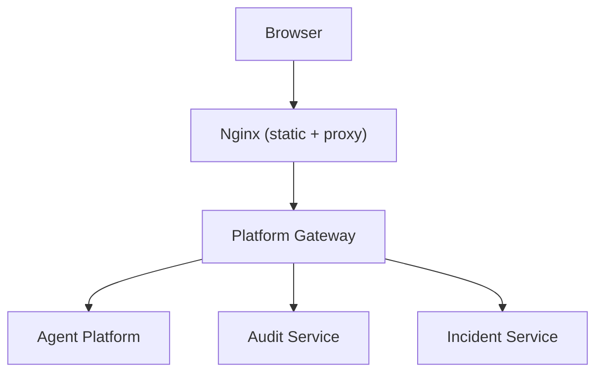
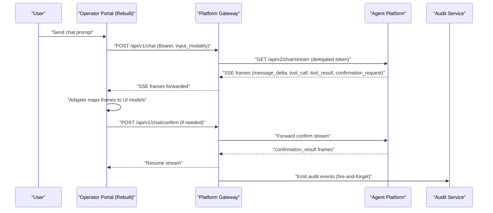
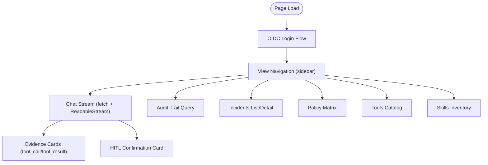
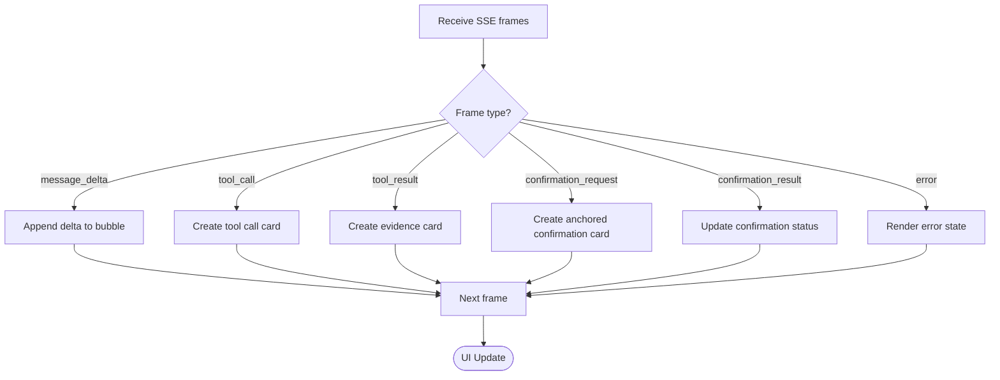
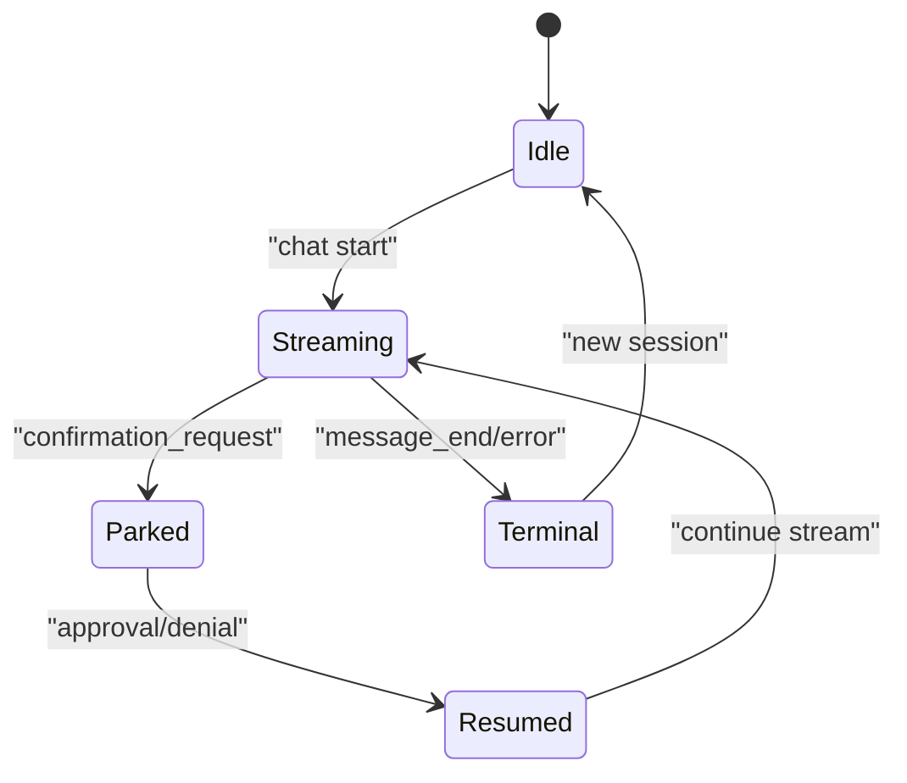
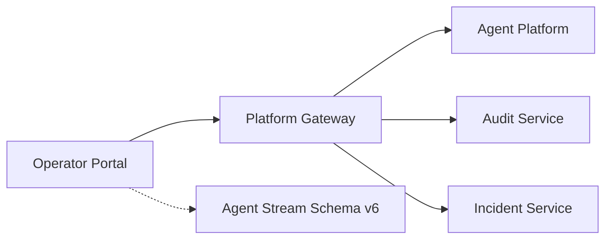

# Portal Framework Rebuild Spike Analysis

<cite>
**Referenced Files in This Document**
- [portal-framework-rebuild-spike.md](file://docs/workspace/portal-framework-rebuild-spike.md)
- [README.md](file://README.md)
- [operator-portal README.md](file://products/operator-portal/README.md)
- [platform-gateway README.md](file://products/platform-gateway/README.md)
- [app.js](file://products/operator-portal/web-ui/app.js)
- [index.html](file://products/operator-portal/web-ui/index.html)
- [Dockerfile](file://products/operator-portal/Dockerfile)
- [nginx.conf](file://products/operator-portal/nginx.conf)
- [SPEC-022 spec.md](file://docs/specs/SPEC-022-multi-session-operator-workspace/spec.md)
- [agent-stream-event.schema.json](file://shared/shared-contracts/schemas/agent-stream-event.schema.json)
- [stream-event.schema.json](file://shared/shared-contracts/schemas/stream-event.schema.json)
- [agent_client.py](file://products/platform-gateway/src/platform_gateway/services/agent_client.py)
- [test_session_workspace.py](file://products/agent-platform/tests/test_session_workspace.py)
- [troubleshooting.md](file://docs/guides/troubleshooting.md)
</cite>

## Table of Contents
1. [Introduction](#introduction)
2. [Project Structure](#project-structure)
3. [Core Components](#core-components)
4. [Architecture Overview](#architecture-overview)
5. [Detailed Component Analysis](#detailed-component-analysis)
6. [Dependency Analysis](#dependency-analysis)
7. [Performance Considerations](#performance-considerations)
8. [Troubleshooting Guide](#troubleshooting-guide)
9. [Conclusion](#conclusion)
10. [Appendices](#appendices)

## Introduction
This document analyzes the portal framework rebuild spike for the operator portal. It consolidates findings about the current vanilla web UI, the streaming SSE contract, multi-session foundations, and candidate AI UI frameworks. It also maps the integration points with platform-gateway and agent-platform to guide a safe migration path that preserves authentication, HITL invariants, evidence anchoring, and policy enforcement.

## Project Structure
The operator portal is currently a static site served by nginx:
- Static assets: index.html, app.js, styles.css
- Nginx configuration proxies /api/ to platform-gateway with streaming-friendly settings
- The Docker image is a minimal nginx runtime

**Diagram sources**
- [nginx.conf:8-17](file://products/operator-portal/nginx.conf#L8-L17)
- [platform-gateway README.md:8-41](file://products/platform-gateway/README.md#L8-L41)

**Section sources**
- [operator-portal README.md:21-36](file://products/operator-portal/README.md#L21-L36)
- [Dockerfile:1-7](file://products/operator-portal/Dockerfile#L1-L7)
- [nginx.conf:1-29](file://products/operator-portal/nginx.conf#L1-L29)

## Core Components
- Operator portal web UI:
  - Single-page HTML with vanilla JS handling auth, streaming chat, evidence panels, audit trail, incidents, permissions, tools, skills views
  - Auth via Keycloak OIDC flow driven from browser; token refresh handled client-side
  - Streaming uses fetch + ReadableStream to support POST bodies and Authorization headers
- Platform gateway:
  - Portal-facing edge enforcing deny-by-default policies, token verification, session workspace endpoints, and proxies to agent-platform, audit-service, incident-service
- Agent stream schema:
  - v6 defines event types including message deltas, tool_call/tool_result, confirmation_request/confirmation_result, and risk_level metadata for parked calls

Key implications for the rebuild:
- The rebuild must preserve the existing SSE frame vocabulary and keep one adapter module owning the wire protocol
- Authentication and serving are stable; the primary risks are the SSE adapter and view/view-gating logic
- Multi-session API is already available behind platform-gateway; the UI is deferred to the rebuild spec

**Section sources**
- [portal-framework-rebuild-spike.md:21-42](file://docs/workspace/portal-framework-rebuild-spike.md#L21-L42)
- [platform-gateway README.md:8-41](file://products/platform-gateway/README.md#L8-L41)
- [agent-stream-event.schema.json:1-101](file://shared/shared-contracts/schemas/agent-stream-event.schema.json#L1-L101)

## Architecture Overview
The portal communicates with backend services through platform-gateway. Chat streams use SSE frames defined by the agent stream schema. The rebuild introduces a React-based UI with an adapter layer that translates SSE frames into framework models without changing the wire protocol.

**Diagram sources**
- [agent_client.py:117-193](file://products/platform-gateway/src/platform_gateway/services/agent_client.py#L117-L193)
- [agent-stream-event.schema.json:1-101](file://shared/shared-contracts/schemas/agent-stream-event.schema.json#L1-L101)
- [platform-gateway README.md:8-41](file://products/platform-gateway/README.md#L8-L41)

## Detailed Component Analysis

### Current Web UI Baseline
- Vanilla HTML/CSS/JS with no build step
- Views: Chat, Control (incidents, audit, permissions), Workspace (tools, skills, settings)
- Streaming via fetch + ReadableStream; frames dispatched by eventType
- Nginx serves static assets and proxies /api/ to platform-gateway with streaming-friendly settings

**Diagram sources**
- [index.html:10-286](file://products/operator-portal/web-ui/index.html#L10-L286)
- [app.js:1-200](file://products/operator-portal/web-ui/app.js#L1-L200)
- [nginx.conf:8-17](file://products/operator-portal/nginx.conf#L8-L17)

**Section sources**
- [operator-portal README.md:38-96](file://products/operator-portal/README.md#L38-L96)
- [portal-framework-rebuild-spike.md:21-42](file://docs/workspace/portal-framework-rebuild-spike.md#L21-L42)

### Candidate Framework Evaluation
- Ant Design X: MIT license, mature component set aligned with SPEC-022 Appendix A requirements; transport-agnostic hooks allow keeping the SSE adapter as single owner of wire protocol
- AgentScope Spark: strong conceptual fit but license split and maturity risks; same adapter boundary applies
- Alternatives considered but not deep-dived due to weaker licensing clarity or coupling to external runtimes

Recommendation: adopt Ant Design X on React with TypeScript and Vite build, preserving the existing SSE adapter boundary.

**Section sources**
- [portal-framework-rebuild-spike.md:44-91](file://docs/workspace/portal-framework-rebuild-spike.md#L44-L91)
- [portal-framework-rebuild-spike.md:139-150](file://docs/workspace/portal-framework-rebuild-spike.md#L139-L150)

### SSE Contract Adapter Boundary
The rebuild must maintain a thin adapter module that:
- Owns transport: fetch + ReadableStream (never EventSource), supports POST body and Bearer header
- Translates frame vocabulary into framework models:
  - message_delta → streaming bubble content
  - tool_call/tool_result → evidence/thought-chain items
  - confirmation_request/confirmation_result → anchored confirmation cards
  - stream close/truncation → explicit terminal states
- Consumes SPEC-022 session API: list sessions, get transcript, delete with 409 handling

**Diagram sources**
- [agent-stream-event.schema.json:1-101](file://shared/shared-contracts/schemas/agent-stream-event.schema.json#L1-L101)
- [portal-framework-rebuild-spike.md:93-113](file://docs/workspace/portal-framework-rebuild-spike.md#L93-L113)

**Section sources**
- [portal-framework-rebuild-spike.md:93-113](file://docs/workspace/portal-framework-rebuild-spike.md#L93-L113)

### Multi-Session Foundations and Invariants
- Session API delivered under platform-gateway with deny-by-default actions
- Voice-readiness contract: input_modality metadata, never privilege; HITL decisions remain explicit UI actions
- Invariants preserved:
  - Click-gated HITL (no voice-driven approvals)
  - Deny-by-default view gating
  - Evidence anchoring inline next to answer
  - No fabricated history when transcript unavailable

**Diagram sources**
- [SPEC-022 spec.md:98-120](file://docs/specs/SPEC-022-multi-session-operator-workspace/spec.md#L98-L120)
- [portal-framework-rebuild-spike.md:115-127](file://docs/workspace/portal-framework-rebuild-spike.md#L115-L127)

**Section sources**
- [SPEC-022 spec.md:15-34](file://docs/specs/SPEC-022-multi-session-operator-workspace/spec.md#L15-L34)
- [SPEC-022 spec.md:98-120](file://docs/specs/SPEC-022-multi-session-operator-workspace/spec.md#L98-L120)
- [portal-framework-rebuild-spike.md:115-127](file://docs/workspace/portal-framework-rebuild-spike.md#L115-L127)

### Build Toolchain and Deployment Consequences
- Adds Node build stage to operator-portal Dockerfile (multi-stage: node build → nginx runtime)
- Runtime image remains nginx-static; serving, probes, and /api/ proxy unchanged
- PLATFORM_VERSION injection and cache-busting become build-time content-hashing
- No backend changes required by the rebuild itself

**Section sources**
- [portal-framework-rebuild-spike.md:128-137](file://docs/workspace/portal-framework-rebuild-spike.md#L128-L137)
- [Dockerfile:1-7](file://products/operator-portal/Dockerfile#L1-L7)
- [nginx.conf:8-17](file://products/operator-portal/nginx.conf#L8-L17)

## Dependency Analysis
The portal depends on platform-gateway for all backend interactions. The gateway enforces policies and proxies to agent-platform, audit-service, and incident-service. The stream schema defines the SSE frame vocabulary consumed by the portal’s adapter.

**Diagram sources**
- [platform-gateway README.md:8-41](file://products/platform-gateway/README.md#L8-L41)
- [agent-stream-event.schema.json:1-101](file://shared/shared-contracts/schemas/agent-stream-event.schema.json#L1-L101)

**Section sources**
- [platform-gateway README.md:8-41](file://products/platform-gateway/README.md#L8-L41)
- [agent-stream-event.schema.json:1-101](file://shared/shared-contracts/schemas/agent-stream-event.schema.json#L1-L101)

## Performance Considerations
- Streaming performance relies on nginx proxy_buffering off and long read timeouts for SSE
- The rebuilt UI should avoid unnecessary re-renders during streaming and batch updates where possible
- Tree-shaking and route-level code splitting can mitigate heavier bundle size from React dependencies
- Keep the adapter thin to minimize per-frame processing overhead

[No sources needed since this section provides general guidance]

## Troubleshooting Guide
Common issues related to session management and streaming:
- Session delete returns 409 when a session has unresolved parked HITL confirmation; resolve the confirmation first
- Foreign or unknown session IDs return 404 per anti-enumeration convention
- Verify pending_confirmation flag via session detail endpoint

Diagnostic steps:
- Check session detail for pending_confirmation
- Resolve parked confirmation via portal or confirm endpoint
- Retry delete after resolution

**Section sources**
- [troubleshooting.md:703-725](file://docs/guides/troubleshooting.md#L703-L725)
- [test_session_workspace.py:237-278](file://products/agent-platform/tests/test_session_workspace.py#L237-L278)

## Conclusion
The portal framework rebuild should adopt Ant Design X on React with a thin SSE adapter that owns the wire protocol. This approach preserves authentication, HITL invariants, evidence anchoring, and policy enforcement while enabling multi-session and voice-ready features specified in SPEC-022. The build toolchain adds a Node stage but keeps the runtime lightweight. Migration should be phased, starting with chat and then expanding to Control and Workspace views.

[No sources needed since this section summarizes without analyzing specific files]

## Appendices

### Appendix A: Deferred Portal UI Requirements (from SPEC-022)
- Session panel with title, last-active time, awaiting approval badge
- Switch/resume with transcript loading and active session persistence
- New/delete with confirmation and 409 handling for parked confirmations
- Confirmation anchoring to original session
- Incident deep links opening additional sessions
- Voice input sending input_modality: "voice" without bypassing approvals
- Model dropdown owned by separate spec

**Section sources**
- [SPEC-022 spec.md:159-186](file://docs/specs/SPEC-022-multi-session-operator-workspace/spec.md#L159-L186)