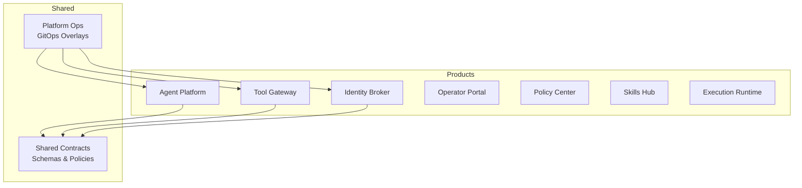
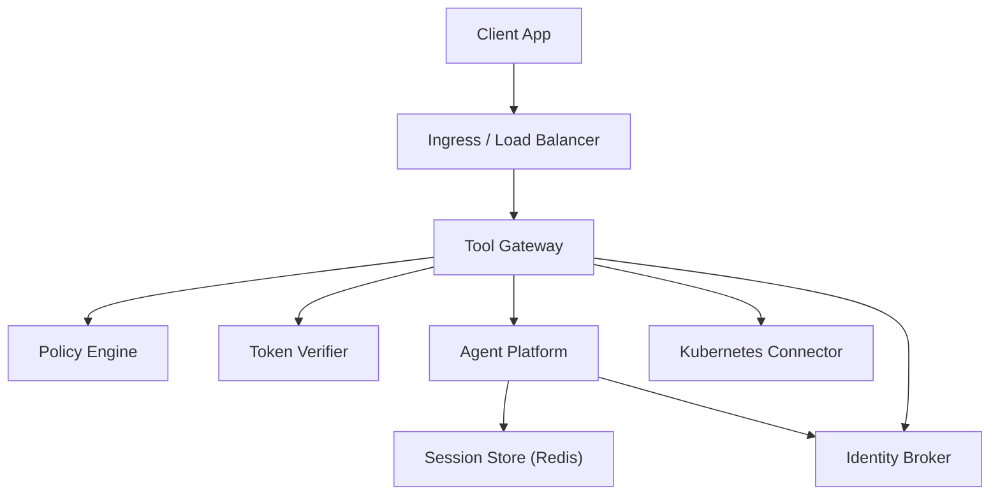
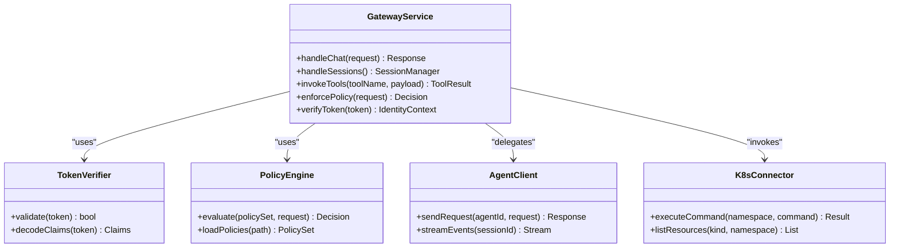
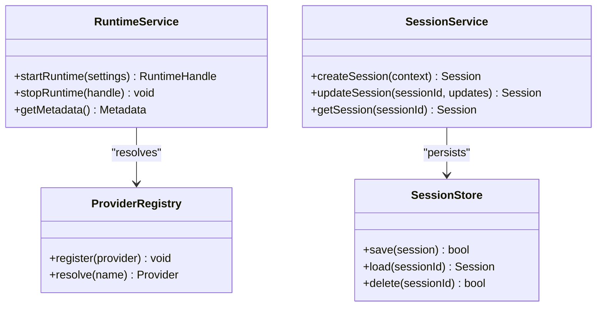
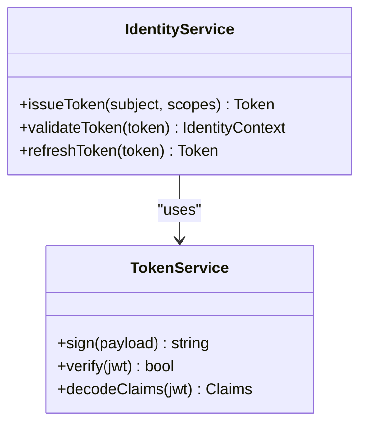
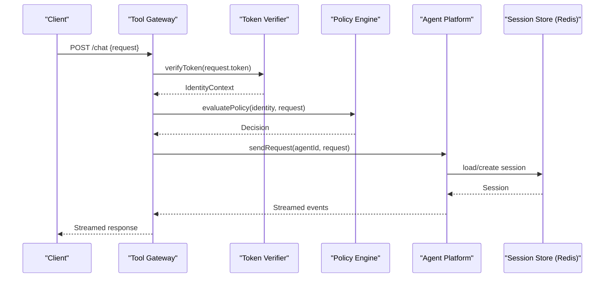
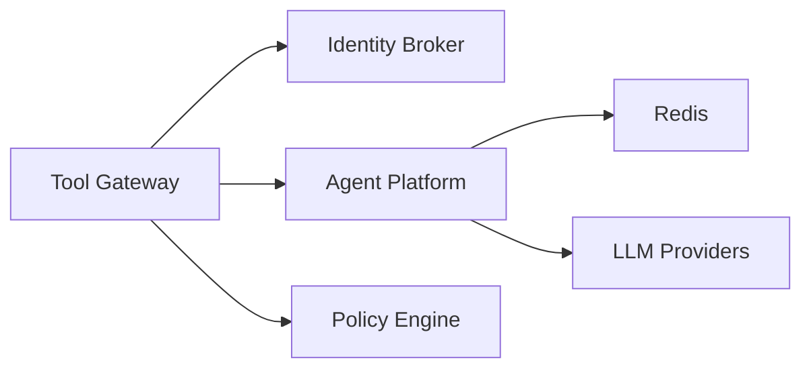
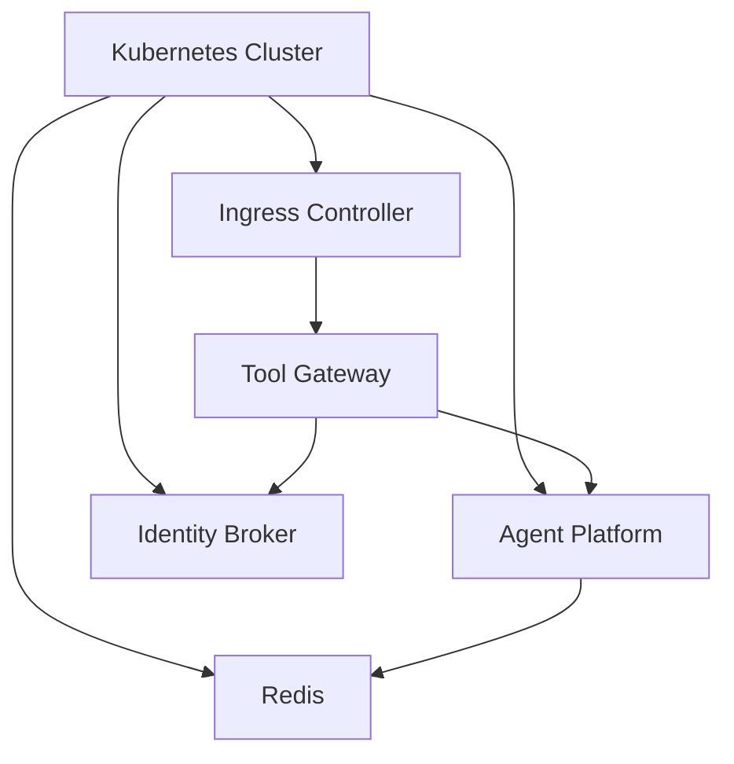

# Reference Architecture

<cite>
**Referenced Files in This Document**
- [README.md](file://README.md)
- [part-2-reference-architecture.md](file://docs/agentic-aiops-platform/part-2-reference-architecture.md)
- [identity-and-authorization-design.md](file://docs/agentic-aiops-platform/identity-and-authorization-design.md)
- [policy-specification.md](file://docs/agentic-aiops-platform/policy-specification.md)
- [SPEC-007-tool-execution-framework/spec.md](file://docs/specs/SPEC-007-tool-execution-framework/spec.md)
- [SPEC-008-service-to-service-identity/spec.md](file://docs/specs/SPEC-008-service-to-service-identity/spec.md)
- [agent-platform README.md](file://products/agent-platform/README.md)
- [tool-gateway README.md](file://products/tool-gateway/README.md)
- [identity-broker README.md](file://products/identity-broker/README.md)
- [api_gateway app.py](file://products/tool-gateway/src/api_gateway/app.py)
- [gateway_service.py](file://products/tool-gateway/src/api_gateway/services/gateway_service.py)
- [token_verifier.py](file://products/tool-gateway/src/api_gateway/services/token_verifier.py)
- [agent_client.py](file://products/tool-gateway/src/api_gateway/services/agent_client.py)
- [policy_engine.py](file://products/tool-gateway/src/api_gateway/services/policy_engine.py)
- [routes.py (v2)](file://products/agent-platform/src/agent_service/api/routes/v2/routes.py)
- [runtime_service.py](file://products/agent-platform/src/agent_service/services/runtime_service.py)
- [session_service.py](file://products/agent-platform/src/agent_service/services/session_service.py)
- [redis-deployment.yaml](file://shared/platform-ops/gitops/dev-k8s/base/infra/redis-deployment.yaml)
- [kustomization.yaml (base)](file://shared/platform-ops/gitops/dev-k8s/base/kustomization.yaml)
- [kustomization.yaml (dev)](file://shared/platform-ops/gitops/dev-k8s/kustomization.yaml)
</cite>

## Table of Contents
1. [Introduction](#introduction)
2. [Project Structure](#project-structure)
3. [Core Components](#core-components)
4. [Architecture Overview](#architecture-overview)
5. [Detailed Component Analysis](#detailed-component-analysis)
6. [Dependency Analysis](#dependency-analysis)
7. [Performance Considerations](#performance-considerations)
8. [Troubleshooting Guide](#troubleshooting-guide)
9. [Conclusion](#conclusion)
10. [Appendices](#appendices)

## Introduction
This document presents the reference architecture for the Luban AIOps Platform, focusing on its microservices design, service boundaries, responsibilities, and communication patterns. It details the core services—Agent Platform, Identity Broker, Tool Gateway—and their interactions during request processing from client to agent execution. The document also covers data flows, message formats, integration points, scalability, fault tolerance, high availability principles, and Kubernetes deployment topology.

## Project Structure
The platform is organized as a multi-product repository with shared contracts, operational assets, and per-service implementations:
- Products: Agent Platform, Tool Gateway, Identity Broker, Operator Portal, Policy Center, Skills Hub, Execution Runtime
- Shared: Contracts (schemas, policies), SDK, and platform operations (GitOps overlays for Kubernetes)
- Documentation: ADRs, specs, and product documentation

**Diagram sources**
- [kustomization.yaml (base)](file://shared/platform-ops/gitops/dev-k8s/base/kustomization.yaml)
- [kustomization.yaml (dev)](file://shared/platform-ops/gitops/dev-k8s/kustomization.yaml)

**Section sources**
- [README.md](file://README.md)
- [part-2-reference-architecture.md](file://docs/agentic-aiops-platform/part-2-reference-architecture.md)

## Core Components
- Tool Gateway: External API entrypoint; handles authentication, authorization via policy engine, token verification, and routing requests to Agent Platform. Provides tool invocation abstractions and integrates with Kubernetes connectors.
- Agent Platform: Hosts agent runtime and session management; exposes APIs for chat and runtime control; manages sessions via Redis-backed store; interacts with LLM providers through a provider registry.
- Identity Broker: Issues and validates tokens; provides identity context and auth endpoints; supports service-to-service identity delegation.
- Shared Contracts: JSON schemas for chat, sessions, tools, identity, and policy decisions define strict interfaces across services.

Key responsibilities:
- Tool Gateway: Request ingress, policy enforcement, token verification, orchestration, observability, metrics.
- Agent Platform: Agent lifecycle, session durability, runtime settings, provider abstraction, streaming events.
- Identity Broker: Token issuance/validation, identity context propagation, health endpoints.

**Section sources**
- [tool-gateway README.md](file://products/tool-gateway/README.md)
- [agent-platform README.md](file://products/agent-platform/README.md)
- [identity-broker README.md](file://products/identity-broker/README.md)
- [policy-specification.md](file://docs/agentic-aiops-platform/policy-specification.md)
- [SPEC-007-tool-execution-framework/spec.md](file://docs/specs/SPEC-007-tool-execution-framework/spec.md)
- [SPEC-008-service-to-service-identity/spec.md](file://docs/specs/SPEC-008-service-to-service-identity/spec.md)

## Architecture Overview
The platform follows a layered microservices architecture:
- Client applications interact with Tool Gateway via REST/HTTP.
- Tool Gateway enforces policies and verifies tokens before delegating to Agent Platform.
- Agent Platform executes agents, manages sessions, and streams results back through Tool Gateway.
- Identity Broker provides identity and token services used by both Tool Gateway and Agent Platform.
- Redis is used for session persistence and state sharing.

**Diagram sources**
- [api_gateway app.py](file://products/tool-gateway/src/api_gateway/app.py)
- [gateway_service.py](file://products/tool-gateway/src/api_gateway/services/gateway_service.py)
- [token_verifier.py](file://products/tool-gateway/src/api_gateway/services/token_verifier.py)
- [agent_client.py](file://products/tool-gateway/src/api_gateway/services/agent_client.py)
- [policy_engine.py](file://products/tool-gateway/src/api_gateway/services/policy_engine.py)
- [runtime_service.py](file://products/agent-platform/src/agent_service/services/runtime_service.py)
- [session_service.py](file://products/agent-platform/src/agent_service/services/session_service.py)
- [redis-deployment.yaml](file://shared/platform-ops/gitops/dev-k8s/base/infra/redis-deployment.yaml)

## Detailed Component Analysis

### Tool Gateway
Responsibilities:
- Expose public APIs for chat, sessions, tools, identity, and runtime.
- Enforce policies using a policy engine.
- Verify tokens and propagate identity context.
- Orchestrate calls to Agent Platform and Kubernetes connectors.

Key components:
- API routes: chat, sessions, tools, identity, runtime, health.
- Services: gateway_service, token_verifier, agent_client, policy_engine.
- Tools: base tool interface, k8s_connector, registry.

**Diagram sources**
- [gateway_service.py](file://products/tool-gateway/src/api_gateway/services/gateway_service.py)
- [token_verifier.py](file://products/tool-gateway/src/api_gateway/services/token_verifier.py)
- [agent_client.py](file://products/tool-gateway/src/api_gateway/services/agent_client.py)
- [policy_engine.py](file://products/tool-gateway/src/api_gateway/services/policy_engine.py)
- [k8s_connector.py](file://products/tool-gateway/src/api_gateway/tools/k8s_connector.py)

**Section sources**
- [tool-gateway README.md](file://products/tool-gateway/README.md)
- [api_gateway app.py](file://products/tool-gateway/src/api_gateway/app.py)
- [gateway_service.py](file://products/tool-gateway/src/api_gateway/services/gateway_service.py)
- [token_verifier.py](file://products/tool-gateway/src/api_gateway/services/token_verifier.py)
- [agent_client.py](file://products/tool-gateway/src/api_gateway/services/agent_client.py)
- [policy_engine.py](file://products/tool-gateway/src/api_gateway/services/policy_engine.py)

### Agent Platform
Responsibilities:
- Provide agent runtime and session management.
- Expose v2 APIs for chat and runtime control.
- Manage sessions with Redis-backed storage.
- Integrate with LLM providers via a registry.

Key components:
- API routes: v2 routes for chat and runtime.
- Services: runtime_service, session_service, session_store.
- Providers: openai, dashscope, deepseek, registry.

**Diagram sources**
- [runtime_service.py](file://products/agent-platform/src/agent_service/services/runtime_service.py)
- [session_service.py](file://products/agent-platform/src/agent_service/services/session_service.py)
- [routes.py (v2)](file://products/agent-platform/src/agent_service/api/routes/v2/routes.py)

**Section sources**
- [agent-platform README.md](file://products/agent-platform/README.md)
- [routes.py (v2)](file://products/agent-platform/src/agent_service/api/routes/v2/routes.py)
- [runtime_service.py](file://products/agent-platform/src/agent_service/services/runtime_service.py)
- [session_service.py](file://products/agent-platform/src/agent_service/services/session_service.py)

### Identity Broker
Responsibilities:
- Issue and validate tokens.
- Provide identity context endpoints.
- Support service-to-service identity delegation.

Key components:
- Auth routes, identity routes, health.
- Services: identity_service, token_service.
- Schemas: auth, identity.

**Diagram sources**
- [identity_service.py](file://products/identity-broker/src/identity_service/services/identity_service.py)
- [token_service.py](file://products/identity-broker/src/identity_service/services/token_service.py)

**Section sources**
- [identity-broker README.md](file://products/identity-broker/README.md)
- [identity-and-authorization-design.md](file://docs/agentic-aiops-platform/identity-and-authorization-design.md)
- [SPEC-008-service-to-service-identity/spec.md](file://docs/specs/SPEC-008-service-to-service-identity/spec.md)

### Data Flow: Request Processing from Client to Agent Execution
End-to-end flow:
- Client sends a chat request to Tool Gateway.
- Tool Gateway verifies token and evaluates policy.
- Tool Gateway delegates to Agent Platform via agent_client.
- Agent Platform creates or resumes a session, runs the agent, and streams events.
- Tool Gateway relays responses and events back to the client.

**Diagram sources**
- [gateway_service.py](file://products/tool-gateway/src/api_gateway/services/gateway_service.py)
- [token_verifier.py](file://products/tool-gateway/src/api_gateway/services/token_verifier.py)
- [policy_engine.py](file://products/tool-gateway/src/api_gateway/services/policy_engine.py)
- [agent_client.py](file://products/tool-gateway/src/api_gateway/services/agent_client.py)
- [session_service.py](file://products/agent-platform/src/agent_service/services/session_service.py)
- [redis-deployment.yaml](file://shared/platform-ops/gitops/dev-k8s/base/infra/redis-deployment.yaml)

**Section sources**
- [SPEC-007-tool-execution-framework/spec.md](file://docs/specs/SPEC-007-tool-execution-framework/spec.md)
- [policy-specification.md](file://docs/agentic-aiops-platform/policy-specification.md)

## Dependency Analysis
Inter-service dependencies:
- Tool Gateway depends on Identity Broker for token validation and on Agent Platform for execution.
- Agent Platform depends on Redis for session persistence and on Identity Broker for identity context when required.
- Shared contracts ensure consistent message formats across services.

**Diagram sources**
- [api_gateway app.py](file://products/tool-gateway/src/api_gateway/app.py)
- [gateway_service.py](file://products/tool-gateway/src/api_gateway/services/gateway_service.py)
- [runtime_service.py](file://products/agent-platform/src/agent_service/services/runtime_service.py)
- [redis-deployment.yaml](file://shared/platform-ops/gitops/dev-k8s/base/infra/redis-deployment.yaml)

**Section sources**
- [part-2-reference-architecture.md](file://docs/agentic-aiops-platform/part-2-reference-architecture.md)
- [SPEC-007-tool-execution-framework/spec.md](file://docs/specs/SPEC-007-tool-execution-framework/spec.md)
- [SPEC-008-service-to-service-identity/spec.md](file://docs/specs/SPEC-008-service-to-service-identity/spec.md)

## Performance Considerations
- Stateless Tool Gateway: Scale horizontally behind an ingress/load balancer; cache policy evaluations where appropriate.
- Connection pooling: Use connection pools for Redis and HTTP clients to reduce latency.
- Streaming: Prefer server-sent events or chunked responses for long-running agent tasks.
- Backpressure: Implement rate limiting and circuit breakers at Tool Gateway to protect downstream services.
- Observability: Emit structured logs, metrics, and traces for request tracing across services.

[No sources needed since this section provides general guidance]

## Troubleshooting Guide
Common issues and diagnostics:
- Token validation failures: Inspect token_verifier logs and Identity Broker health endpoints.
- Policy denials: Review policy engine evaluation logs and policy definitions.
- Session loss: Check Redis connectivity and session_store operations.
- Agent execution errors: Validate Agent Platform runtime logs and provider configurations.

Operational checks:
- Health endpoints exposed by each service.
- Metrics and telemetry collected by observability modules.
- GitOps overlays for consistent deployments and configuration drift detection.

**Section sources**
- [token_verifier.py](file://products/tool-gateway/src/api_gateway/services/token_verifier.py)
- [policy_engine.py](file://products/tool-gateway/src/api_gateway/services/policy_engine.py)
- [session_service.py](file://products/agent-platform/src/agent_service/services/session_service.py)
- [redis-deployment.yaml](file://shared/platform-ops/gitops/dev-k8s/base/infra/redis-deployment.yaml)

## Conclusion
The Luban AIOps Platform implements a robust microservices architecture with clear service boundaries and well-defined contracts. Tool Gateway serves as the secure, policy-enforced entrypoint, while Agent Platform manages agent execution and session durability. Identity Broker centralizes identity and token management. The design emphasizes scalability, fault tolerance, and high availability through stateless gateways, resilient session stores, and comprehensive observability.

[No sources needed since this section summarizes without analyzing specific files]

## Appendices

### Deployment Topology and Infrastructure Dependencies
- Kubernetes clusters host the services with GitOps overlays managing base and dev configurations.
- Redis is deployed as a shared infrastructure component for session persistence.
- Ingress controllers expose Tool Gateway externally; internal DNS resolves service names.

**Diagram sources**
- [kustomization.yaml (base)](file://shared/platform-ops/gitops/dev-k8s/base/kustomization.yaml)
- [kustomization.yaml (dev)](file://shared/platform-ops/gitops/dev-k8s/kustomization.yaml)
- [redis-deployment.yaml](file://shared/platform-ops/gitops/dev-k8s/base/infra/redis-deployment.yaml)

**Section sources**
- [part-2-reference-architecture.md](file://docs/agentic-aiops-platform/part-2-reference-architecture.md)
- [SPEC-007-tool-execution-framework/spec.md](file://docs/specs/SPEC-007-tool-execution-framework/spec.md)
- [SPEC-008-service-to-service-identity/spec.md](file://docs/specs/SPEC-008-service-to-service-identity/spec.md)