# SPEC-010: Platform Gateway Extraction Specification

<cite>
**Referenced Files in This Document**
- [spec.md](file://docs/specs/SPEC-010-platform-gateway-extraction/spec.md)
- [plan.md](file://docs/specs/SPEC-010-platform-gateway-extraction/plan.md)
- [tasks.md](file://docs/specs/SPEC-010-platform-gateway-extraction/tasks.md)
- [adr-0005.md](file://docs/adr/0005-platform-gateway-extraction.md)
- [app.py](file://products/platform-gateway/src/platform_gateway/app.py)
- [main.py](file://products/platform-gateway/src/platform_gateway/main.py)
- [config.py](file://products/platform-gateway/src/platform_gateway/core/config.py)
- [router.py](file://products/platform-gateway/src/platform_gateway/api/router.py)
- [gateway_service.py](file://products/platform-gateway/src/platform_gateway/services/gateway_service.py)
- [token_verifier.py](file://products/platform-gateway/src/platform_gateway/services/token_verifier.py)
- [policy_engine.py](file://products/platform-gateway/src/platform_gateway/services/policy_engine.py)
- [delegation_client.py](file://products/platform-gateway/src/platform_gateway/services/delegation_client.py)
- [chat.py](file://products/platform-gateway/src/platform_gateway/api/routes/chat.py)
- [sessions.py](file://products/platform-gateway/src/platform_gateway/api/routes/sessions.py)
- [auth.py](file://products/platform-gateway/src/platform_gateway/api/routes/auth.py)
- [identity.py](file://products/platform-gateway/src/platform_gateway/api/routes/identity.py)
- [runtime.py](file://products/platform-gateway/src/platform_gateway/api/routes/runtime.py)
- [health.py](file://products/platform-gateway/src/platform_gateway/api/routes/health.py)
- [tool_app.py](file://products/tool-gateway/src/tool_gateway/app.py)
- [tool_router.py](file://products/tool-gateway/src/tool_gateway/api/router.py)
- [tool_gateway_service.py](file://products/tool-gateway/src/tool_gateway/services/gateway_service.py)
- [platform-gateway-deployment.yaml](file://shared/platform-ops/gitops/dev-k8s/base/platform-gateway/platform-gateway-deployment.yaml)
- [tool-gateway-deployment.yaml](file://shared/platform-ops/gitops/dev-k8s/base/tool-gateway/tool-gateway-deployment.yaml)
- [platform-gateway-readme.md](file://products/platform-gateway/README.md)
- [tool-gateway-readme.md](file://products/tool-gateway/README.md)
</cite>

## Update Summary
**Changes Made**
- Updated status to reflect delivered state with complete implementation of platform-gateway extraction
- Added comprehensive documentation of the five-stage mechanical extraction approach that was fully implemented
- Updated architecture diagrams to show the completed split between platform-gateway (portal edge) and tool-gateway (internal service)
- Enhanced identity plumbing details showing audience binding changes from `tool-gateway` to `platform-gateway` for portal tokens
- Added deployment configuration details showing the new Kubernetes manifests for both services
- Updated all component references to reflect the actual delivered code structure

## Table of Contents
1. [Introduction](#introduction)
2. [Project Structure](#project-structure)
3. [Core Components](#core-components)
4. [Architecture Overview](#architecture-overview)
5. [Detailed Component Analysis](#detailed-component-analysis)
6. [Dependency Analysis](#dependency-analysis)
7. [Performance Considerations](#performance-considerations)
8. [Troubleshooting Guide](#troubleshooting-guide)
9. [Conclusion](#conclusion)
10. [Appendices](#appendices)

## Introduction
This document specifies the extraction of the portal-facing API edge from the existing tool-gateway product into a new platform-gateway product, as defined by ADR-0005 and implemented under SPEC-010. The goal is to separate security/control-plane concerns (token verification, policy enforcement, chat/session proxying, token delegation, and portal routes) from the tool/connector framework (tool registry, connectors, tools:list/invoke, redaction, audit). External behavior remains unchanged for callers, preserving HTTP contracts, request correlation headers, and the deny-by-default trust model.

**Updated Status**: The specification has been fully delivered with a comprehensive five-stage mechanical extraction approach that ensures behavior-preserving code movement while establishing clear ownership boundaries between platform-gateway (portal edge) and tool-gateway (internal tool execution service). All acceptance criteria have been met and `make verify` is green across all four products.

Key outcomes:
- New product `platform-gateway` hosts the portal edge with identical external contracts
- `tool-gateway` becomes an internal service focused on tool execution and connector logic
- Identity plumbing adapts across the boundary without weakening trust or policy semantics
- Build, overlay, and deployment align to include the new product while keeping end-to-end smoke paths intact

**Section sources**
- [spec.md:3-11](file://docs/specs/SPEC-010-platform-gateway-extraction/spec.md#L3-L11)
- [spec.md:14-22](file://docs/specs/SPEC-010-platform-gateway-extraction/spec.md#L14-L22)
- [spec.md:166-170](file://docs/specs/SPEC-010-platform-gateway-extraction/spec.md#L166-L170)
- [adr-0005.md:14-31](file://docs/adr/0005-platform-gateway-extraction.md#L14-L31)

## Project Structure
The implementation has been completed with platform-gateway hosting the edge modules (token verification, policy engine, delegation client, and portal routes), while tool-gateway retains tool-related modules.

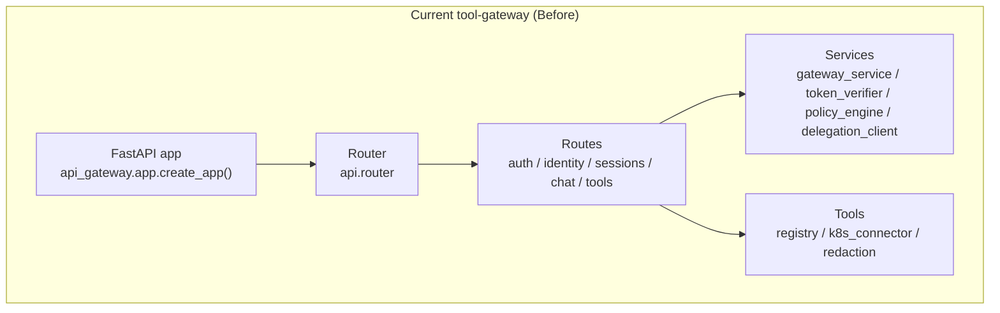

**Post-Extraction Architecture (Delivered):**
```mermaid
graph TB
subgraph "New platform-gateway (Portal Edge)"
PG_A["FastAPI app<br/>platform_gateway.app.create_app()"]
PG_B["Router<br/>portal routes only"]
PG_C["Portal Routes<br/>auth / identity / sessions / chat / runtime / health"]
PG_D["Edge Services<br/>token_verifier / policy_engine / delegation_client / agent_client"]
PG_E["Policies<br/>policy-default.yaml"]
end
subgraph "Reduced tool-gateway (Internal Service)"
TG_A["FastAPI app<br/>tool_gateway.app.create_app()"]
TG_B["Tool Router<br/>tools only"]
TG_C["Tool Routes<br/>tools:list / tools:invoke / health"]
TG_D["Tool Services<br/>tool_registry / redaction / audit"]
TG_E["Tools<br/>base / k8s_connector / redaction / registry"]
end
PG_A --> PG_B --> PG_C
PG_C --> PG_D
PG_D --> PG_E
TG_A --> TG_B --> TG_C
TG_C --> TG_D
TG_D --> TG_E
```

**Diagram sources**
- [app.py:16-44](file://products/platform-gateway/src/platform_gateway/app.py#L16-L44)
- [router.py:1-12](file://products/platform-gateway/src/platform_gateway/api/router.py#L1-L12)
- [tool_app.py:35-64](file://products/tool-gateway/src/tool_gateway/app.py#L35-L64)
- [tool_router.py:1-8](file://products/tool-gateway/src/tool_gateway/api/router.py#L1-L8)

**Section sources**
- [app.py:16-44](file://products/platform-gateway/src/platform_gateway/app.py#L16-L44)
- [router.py:1-12](file://products/platform-gateway/src/platform_gateway/api/router.py#L1-L12)
- [tool_app.py:35-64](file://products/tool-gateway/src/tool_gateway/app.py#L35-L64)
- [tool_router.py:1-8](file://products/tool-gateway/src/tool_gateway/api/router.py#L1-L8)

## Core Components
- **Platform Gateway FastAPI application bootstrap and middleware:**
  - Application factory sets up logging, metrics, telemetry, and includes portal routers only.
- **Platform Gateway Router assembly:**
  - Central router aggregates only portal routes (auth, identity, sessions, chat, runtime, health).
- **Tool Gateway FastAPI application bootstrap and middleware:**
  - Application factory initializes tool registry, registers middleware for request logging, includes tool routers, and sets up metrics/telemetry.
- **Tool Gateway Router assembly:**
  - Central router aggregates only tool routes (tools, health).
- **Portal routes (platform-gateway):**
  - Chat and session endpoints orchestrate identity resolution, policy checks, delegation, and proxying to agent-platform.
  - Auth and identity endpoints proxy to identity-broker and expose local JWT verification helpers.
  - Runtime and health endpoints provide service status information.
- **Tool routes (tool-gateway):**
  - tools:list and tools:invoke enforce policy and delegate to the tool registry; results are redacted and audited.
- **Edge Services (platform-gateway):**
  - gateway_service: orchestrates identity resolution, policy enforcement, session/chat operations, and tool invocation flow.
  - token_verifier: local JWT verification via JWKS, producing an IdentityContext with audience `platform-gateway`.
  - policy_engine: deny-by-default evaluation against a YAML bundle.
  - delegation_client: per-user delegated token cache and exchange with identity-broker, workload-token preference, dev minting fallback.
- **Tool Services (tool-gateway):**
  - gateway_service: reduced to tool-invocation orchestration (invoke choke point, redaction, audit, readiness).
  - token_verifier: delegated-token verification with audience `tool-gateway`.
  - policy_engine: action authorization for `tools:list` / `tools:invoke`.

**Section sources**
- [app.py:16-44](file://products/platform-gateway/src/platform_gateway/app.py#L16-L44)
- [router.py:1-12](file://products/platform-gateway/src/platform_gateway/api/router.py#L1-L12)
- [tool_app.py:35-64](file://products/tool-gateway/src/tool_gateway/app.py#L35-L64)
- [tool_router.py:1-8](file://products/tool-gateway/src/tool_gateway/api/router.py#L1-L8)
- [gateway_service.py:152-200](file://products/platform-gateway/src/platform_gateway/services/gateway_service.py#L152-L200)
- [tool_gateway_service.py:57-117](file://products/tool-gateway/src/tool_gateway/services/gateway_service.py#L57-L117)

## Architecture Overview
The extraction splits responsibilities following the five-stage mechanical approach that was fully implemented:
- **platform-gateway** owns inbound token verification, audience enforcement (`platform-gateway`), action policy enforcement, chat/session proxying to agent-platform, broker-mediated token delegation, and portal routes.
- **tool-gateway** owns ToolRegistry, connectors, tools:list/invoke, redaction choke point, tool audit, and readiness/metrics.

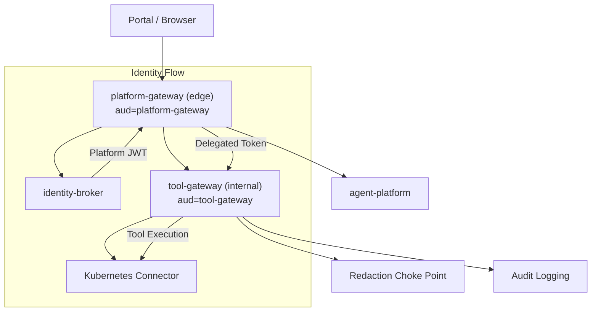

**Diagram sources**
- [platform-gateway-deployment.yaml:1-40](file://shared/platform-ops/gitops/dev-k8s/base/platform-gateway/platform-gateway-deployment.yaml#L1-L40)
- [tool-gateway-deployment.yaml:1-37](file://shared/platform-ops/gitops/dev-k8s/base/tool-gateway/tool-gateway-deployment.yaml#L1-L37)
- [platform-gateway-readme.md:1-46](file://products/platform-gateway/README.md#L1-L46)
- [tool-gateway-readme.md:1-114](file://products/tool-gateway/README.md#L1-L114)

## Detailed Component Analysis

### FastAPI App and Middleware
- **Platform Gateway Application Factory:** Initializes state, registers middleware for request logging, includes portal routers, and sets up metrics/telemetry.
- **Tool Gateway Application Factory:** Builds tool registry, initializes state, registers middleware for request logging, includes tool routers, and sets up metrics/telemetry.
- Entry points read runtime settings and start uvicorn for both services.

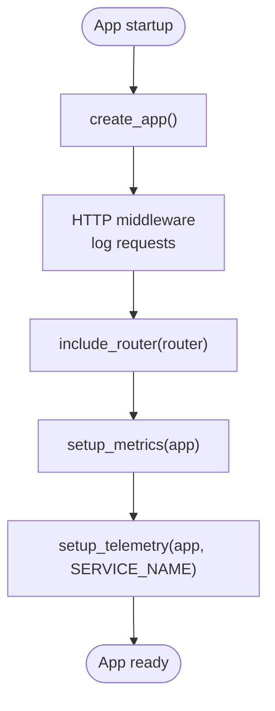

**Diagram sources**
- [app.py:16-44](file://products/platform-gateway/src/platform_gateway/app.py#L16-L44)
- [tool_app.py:35-64](file://products/tool-gateway/src/tool_gateway/app.py#L35-L64)

**Section sources**
- [app.py:16-44](file://products/platform-gateway/src/platform_gateway/app.py#L16-L44)
- [tool_app.py:35-64](file://products/tool-gateway/src/tool_gateway/app.py#L35-L64)

### Router Assembly
- **Platform Gateway Router:** Aggregates only portal route modules (health, runtime, auth, identity, sessions, chat).
- **Tool Gateway Router:** Aggregates only tool route modules (health, tools).

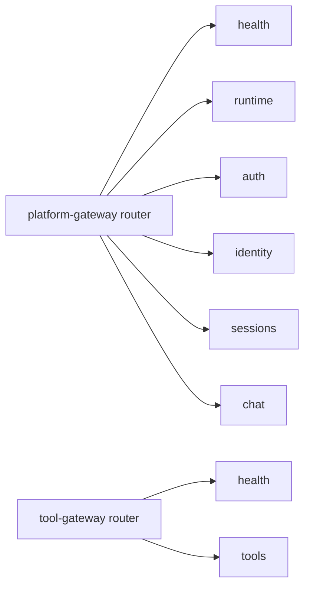

**Diagram sources**
- [router.py:1-12](file://products/platform-gateway/src/platform_gateway/api/router.py#L1-L12)
- [tool_router.py:1-8](file://products/tool-gateway/src/tool_gateway/api/router.py#L1-L8)

**Section sources**
- [router.py:1-12](file://products/platform-gateway/src/platform_gateway/api/router.py#L1-L12)
- [tool_router.py:1-8](file://products/tool-gateway/src/tool_gateway/api/router.py#L1-L8)

### Chat Flow (Portal Edge)
- Route resolves identity, enforces policy, obtains delegated token, proxies to agent-platform, and logs completion.

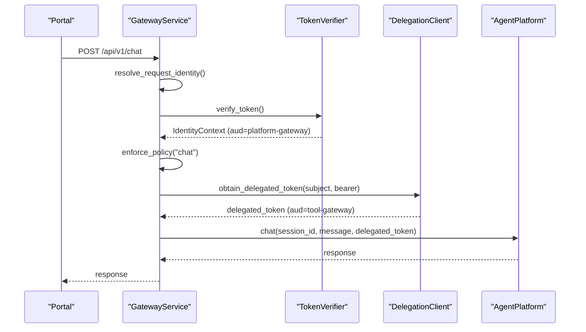

**Diagram sources**
- [gateway_service.py:152-200](file://products/platform-gateway/src/platform_gateway/services/gateway_service.py#L152-L200)

**Section sources**
- [gateway_service.py:152-200](file://products/platform-gateway/src/platform_gateway/services/gateway_service.py#L152-L200)

### Sessions Flow (Portal Edge)
- Create and read sessions with identity resolution and policy enforcement.

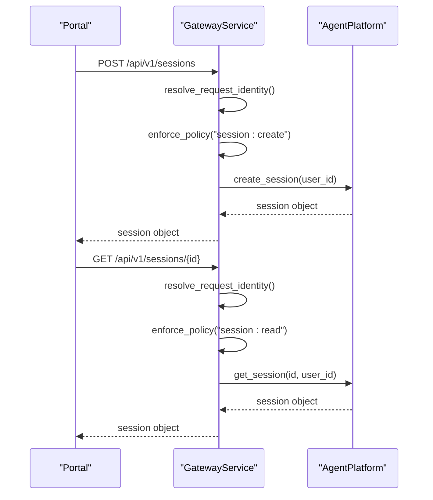

**Section sources**
- [gateway_service.py:152-200](file://products/platform-gateway/src/platform_gateway/services/gateway_service.py#L152-L200)

### Auth and Identity Flow
- Proxy login URLs, start login, callback, logout URL, refresh, and normalize identity. Local JWT verification endpoint exposed.

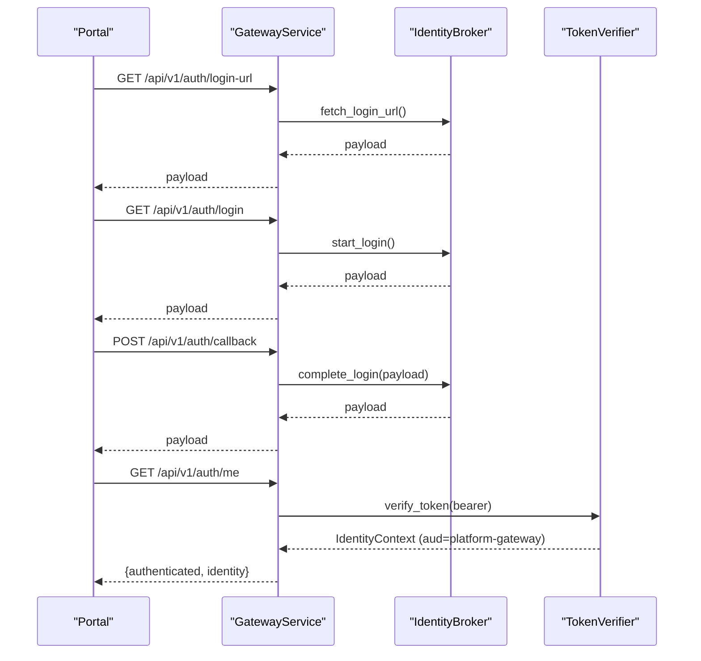

**Section sources**
- [gateway_service.py:66-149](file://products/platform-gateway/src/platform_gateway/services/gateway_service.py#L66-L149)

### Tools Flow (Internal Service)
- List and invoke tools with policy enforcement, redaction, and audit.

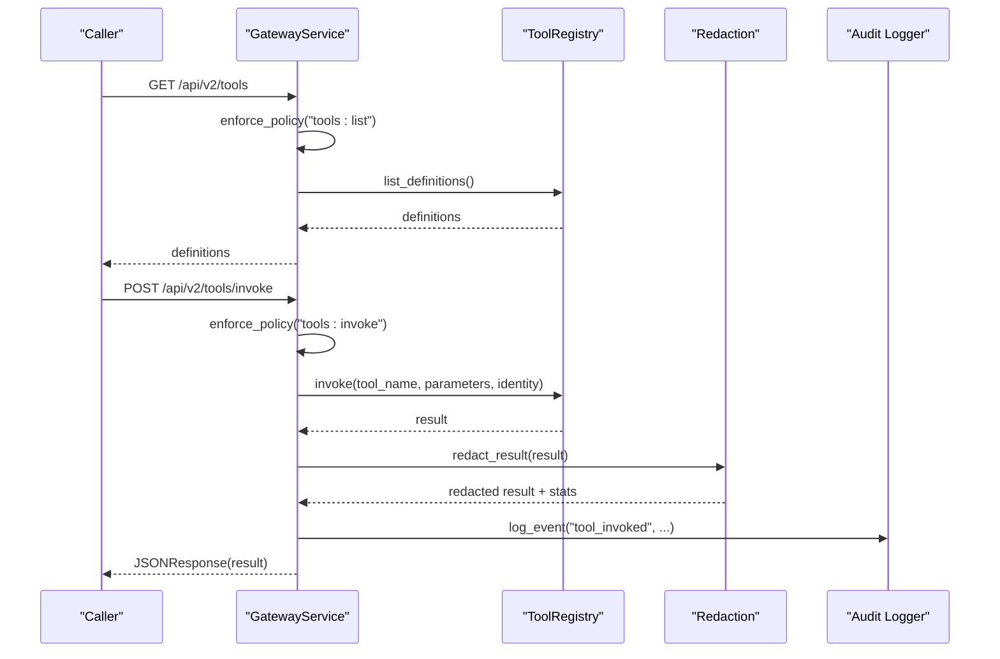

**Section sources**
- [tool_gateway_service.py:154-200](file://products/tool-gateway/src/tool_gateway/services/gateway_service.py#L154-L200)

### Token Verification
- **Platform Gateway:** Local JWT verification using JWKS, enforcing issuer, audience (`platform-gateway`), and required claims. Extracts actor from act claim when present.
- **Tool Gateway:** Delegated token verification with audience `tool-gateway`, maintaining the same claim shape for tool execution.

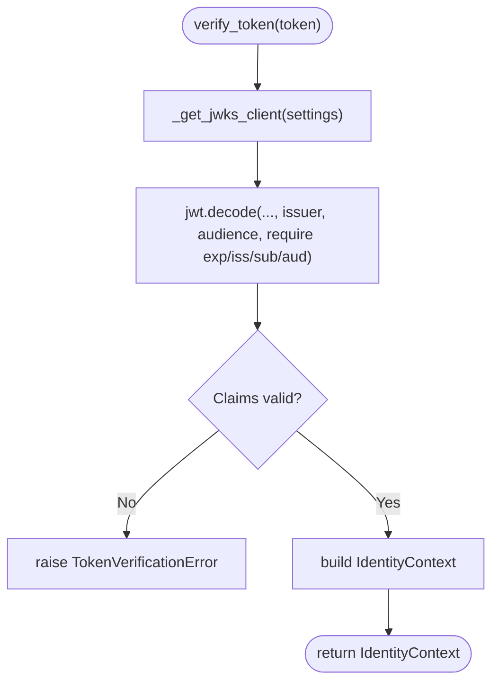

**Diagram sources**
- [token_verifier.py:52-89](file://products/platform-gateway/src/platform_gateway/services/token_verifier.py#L52-L89)

**Section sources**
- [token_verifier.py:52-89](file://products/platform-gateway/src/platform_gateway/services/token_verifier.py#L52-L89)

### Policy Engine
- Deny-by-default evaluation over a YAML bundle. Explicit deny overrides allow; higher priority wins among allows. Both services load the same shared policy bundle but enforce different actions.

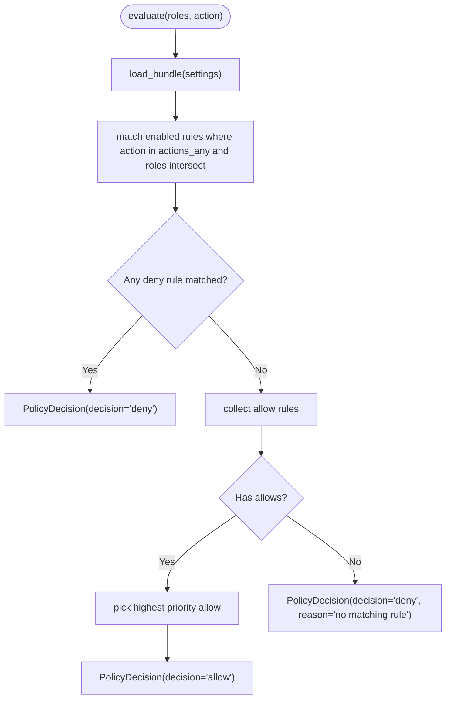

**Diagram sources**
- [policy_engine.py:156-198](file://products/platform-gateway/src/platform_gateway/services/policy_engine.py#L156-L198)

**Section sources**
- [policy_engine.py:156-198](file://products/platform-gateway/src/platform_gateway/services/policy_engine.py#L156-L198)

### Delegation Client
- Per-replica cache of delegated tokens per subject; exchanges at identity-broker using workload token if available, else static credentials; non-fatal failures allow tool-less operation.

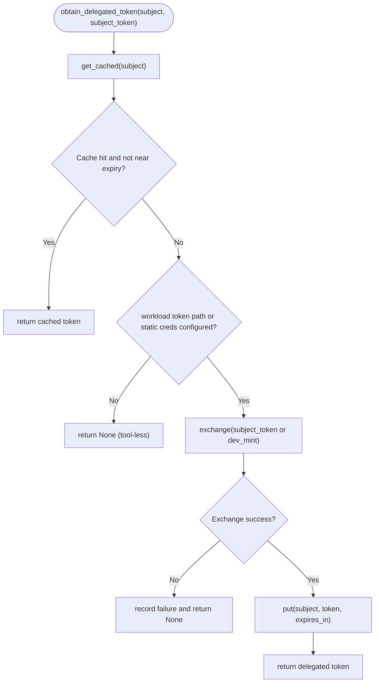

**Diagram sources**
- [delegation_client.py:190-229](file://products/platform-gateway/src/platform_gateway/services/delegation_client.py#L190-L229)

**Section sources**
- [delegation_client.py:190-229](file://products/platform-gateway/src/platform_gateway/services/delegation_client.py#L190-L229)

## Dependency Analysis
The implementation shows clear separation of dependencies between the two services. Platform-gateway owns edge dependencies (token verifier, policy engine, delegation client, and portal routes), while tool-gateway retains tool-related dependencies.

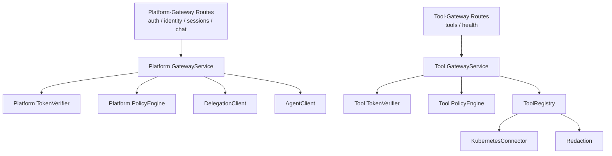

**Diagram sources**
- [router.py:1-12](file://products/platform-gateway/src/platform_gateway/api/router.py#L1-L12)
- [tool_router.py:1-8](file://products/tool-gateway/src/tool_gateway/api/router.py#L1-L8)
- [gateway_service.py:1-26](file://products/platform-gateway/src/platform_gateway/services/gateway_service.py#L1-L26)
- [tool_gateway_service.py:1-26](file://products/tool-gateway/src/tool_gateway/services/gateway_service.py#L1-L26)

**Section sources**
- [router.py:1-12](file://products/platform-gateway/src/platform_gateway/api/router.py#L1-L12)
- [tool_router.py:1-8](file://products/tool-gateway/src/tool_gateway/api/router.py#L1-L8)
- [gateway_service.py:1-26](file://products/platform-gateway/src/platform_gateway/services/gateway_service.py#L1-L26)
- [tool_gateway_service.py:1-26](file://products/tool-gateway/src/tool_gateway/services/gateway_service.py#L1-L26)

## Performance Considerations
- JWKS caching reduces repeated key fetching overhead during token verification in both services.
- Delegated token cache minimizes broker exchange calls per user subject, refreshing before expiry.
- Redaction overflow handling prevents excessive processing by short-circuiting large outputs in tool-gateway.
- Streaming responses for chat reduce latency and memory pressure for long-running interactions in platform-gateway.
- Both services maintain separate metrics collection for their specific responsibilities.

## Troubleshooting Guide
Common issues and diagnostics:
- **Token verification failures:** check issuer, audience, expiration, and JWKS availability. For platform-gateway, verify audience is `platform-gateway`; for tool-gateway, verify audience is `tool-gateway`.
- **Policy denials:** inspect matched rule IDs and reasons; ensure roles map to allowed actions for the specific service's scope.
- **Delegation failures:** verify workload token path or static credentials; monitor exchange metrics and warnings.
- **Redaction overflow:** tune overflow fraction and review tool output sensitivity in tool-gateway.
- **Deployment issues:** check Kubernetes manifests for correct image names (`luban-aiops/platform-gateway` vs `luban-aiops/tool-gateway`) and service configurations.

**Section sources**
- [token_verifier.py:52-89](file://products/platform-gateway/src/platform_gateway/services/token_verifier.py#L52-L89)
- [policy_engine.py:156-198](file://products/platform-gateway/src/platform_gateway/services/policy_engine.py#L156-L198)
- [delegation_client.py:190-229](file://products/platform-gateway/src/platform_gateway/services/delegation_client.py#L190-L229)
- [tool_gateway_service.py:154-200](file://products/tool-gateway/src/tool_gateway/services/gateway_service.py#L154-L200)

## Conclusion
SPEC-010 defines a clean separation between the portal-facing edge and the tool/connector framework. By extracting platform-gateway, ownership, review scope, and blast radius improve, while maintaining byte-compatible contracts and deny-by-default trust. The implementation preserves identity plumbing, policy semantics, and operational observability, enabling future edge features without entangling connector code.

The delivered five-stage mechanical extraction approach ensures each stage stays verifiable while the code moves but behavior does not. All naming conventions have been resolved, providing clear boundaries between platform-gateway (portal edge with `PLATFORM_GATEWAY_*` environment variables) and tool-gateway (internal tool execution service with `GATEWAY_*` environment variables). The Kubernetes deployments are properly configured with separate service accounts, RBAC policies, and policy ConfigMaps mounted at `/etc/luban/policy`.

## Appendices
- **Open questions from the spec:** All resolved in the delivered implementation.
- **Environment variable scope:** Edge configuration uses `PLATFORM_GATEWAY_*` prefix; tool-gateway uses `GATEWAY_*` prefix for tool-scoped settings.
- **Kubernetes/image naming:** Platform gateway deploys as `luban-aiops/platform-gateway:dev-local`; tool gateway deploys as `luban-aiops/tool-gateway:dev-local`.
- **Portal token audience naming:** Changed from `tool-gateway` to `platform-gateway` for platform tokens; delegated tokens keep `aud = tool-gateway`.
- **Edge's broker client id registration strategy:** Edge registers as new `platform-gateway` broker client, so delegated tokens' `act.sub` becomes `platform-gateway`.

**Section sources**
- [spec.md:145-163](file://docs/specs/SPEC-010-platform-gateway-extraction/spec.md#L145-L163)
- [plan.md:170-182](file://docs/specs/SPEC-010-platform-gateway-extraction/plan.md#L170-L182)
- [tasks.md:87-93](file://docs/specs/SPEC-010-platform-gateway-extraction/tasks.md#L87-L93)
- [platform-gateway-readme.md:29-46](file://products/platform-gateway/README.md#L29-L46)
- [tool-gateway-readme.md:60-94](file://products/tool-gateway/README.md#L60-L94)