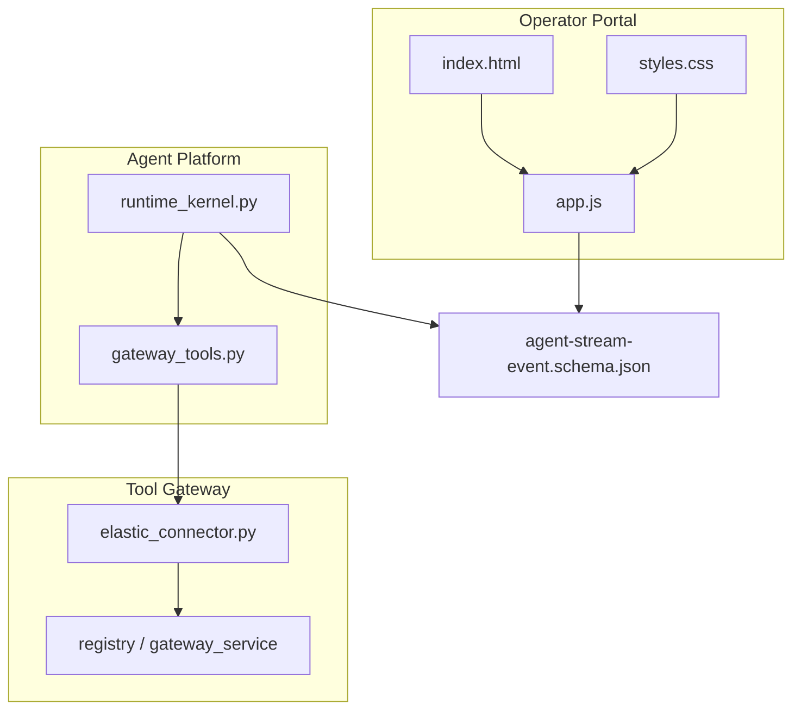
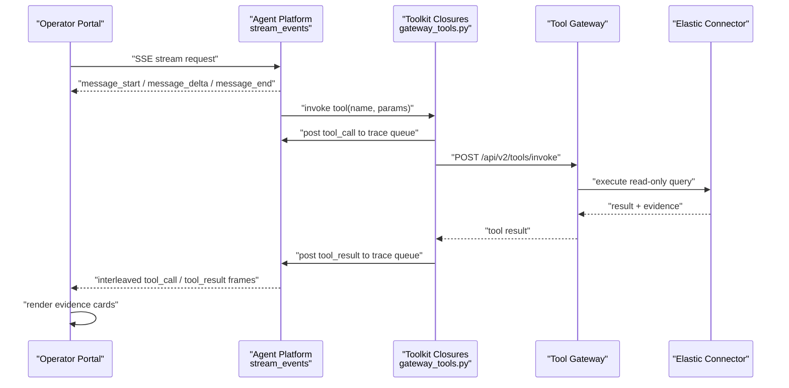
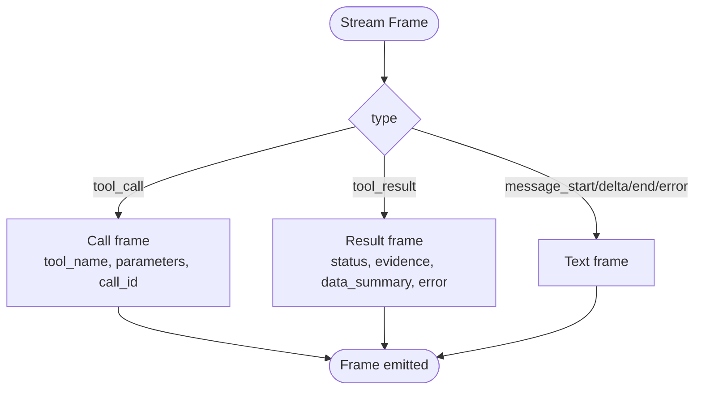
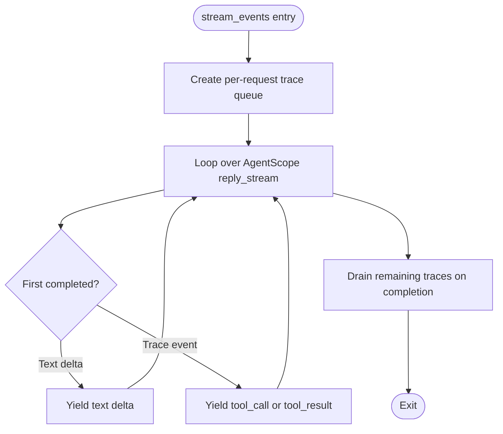
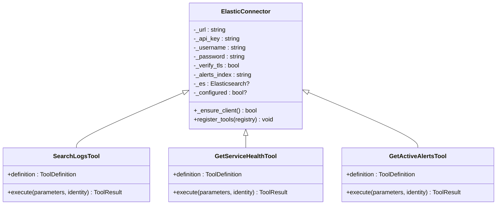
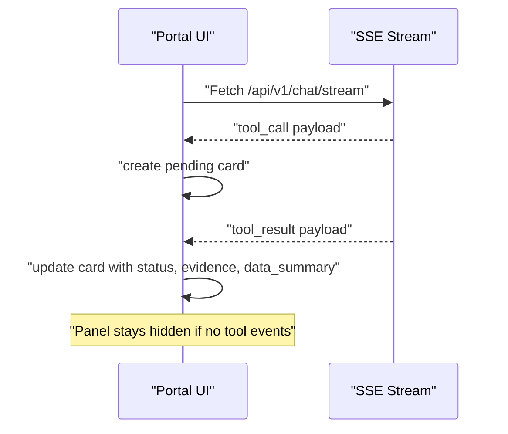
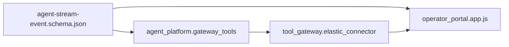

# SPEC-011: Observability and Evidence Panels

<cite>
**Referenced Files in This Document**
- [spec.md](file://docs/specs/SPEC-011-observability-and-evidence-panels/spec.md)
- [plan.md](file://docs/specs/SPEC-011-observability-and-evidence-panels/plan.md)
- [tasks.md](file://docs/specs/SPEC-011-observability-and-evidence-panels/tasks.md)
- [agent-stream-event.schema.json](file://shared/shared-contracts/schemas/agent-stream-event.schema.json)
- [elastic_connector.py](file://products/tool-gateway/src/tool_gateway/tools/elastic_connector.py)
- [gateway_tools.py](file://products/agent-platform/src/agent_service/tools/gateway_tools.py)
- [index.html](file://products/operator-portal/web-ui/index.html)
- [app.js](file://products/operator-portal/web-ui/app.js)
- [styles.css](file://products/operator-portal/web-ui/styles.css)
- [runtime-config.env](file://shared/platform-ops/gitops/dev-k8s/base/tool-gateway/runtime-config.env)
</cite>

## Table of Contents
1. [Introduction](#introduction)
2. [Project Structure](#project-structure)
3. [Core Components](#core-components)
4. [Architecture Overview](#architecture-overview)
5. [Detailed Component Analysis](#detailed-component-analysis)
6. [Dependency Analysis](#dependency-analysis)
7. [Performance Considerations](#performance-considerations)
8. [Troubleshooting Guide](#troubleshooting-guide)
9. [Conclusion](#conclusion)

## Introduction
SPEC-011 delivers grounded, evidence-backed operational answers by adding an Elastic observability connector to the tool-gateway, extending the agent stream contract with tool trace events, and rendering an evidence panel in the operator portal. It completes R1’s vision that operators can verify which tools were used, what data was returned, and how long execution took — while keeping everything read-only and policy-enforced.

Key outcomes:
- New stream event types for tool traces (tool_call, tool_result).
- Per-request trace emission from the agent runtime toolkit closures.
- Three read-only Elastic tools: search logs, service health, active alerts.
- Operator portal evidence panel showing pending and completed tool invocations with metadata and bounded data summaries.
- Dev overlay configuration that gates the connector off by default.

**Section sources**
- [spec.md:11-24](file://docs/specs/SPEC-011-observability-and-evidence-panels/spec.md#L11-L24)
- [plan.md:3-11](file://docs/specs/SPEC-011-observability-and-evidence-panels/plan.md#L3-L11)

## Project Structure
SPEC-011 spans four areas:
- Contract extension in shared schemas.
- Agent platform toolkit changes to emit traces into the SSE stream.
- Tool-gateway Elastic connector implementing three read-only tools.
- Operator portal UI additions to render evidence cards alongside streamed text.

**Diagram sources**
- [agent-stream-event.schema.json:1-73](file://shared/shared-contracts/schemas/agent-stream-event.schema.json#L1-L73)
- [gateway_tools.py:197-359](file://products/agent-platform/src/agent_service/tools/gateway_tools.py#L197-L359)
- [elastic_connector.py:40-103](file://products/tool-gateway/src/tool_gateway/tools/elastic_connector.py#L40-L103)
- [index.html:27-31](file://products/operator-portal/web-ui/index.html#L27-L31)
- [app.js:435-526](file://products/operator-portal/web-ui/app.js#L435-L526)
- [styles.css:322-405](file://products/operator-portal/web-ui/styles.css#L322-L405)

**Section sources**
- [plan.md:15-71](file://docs/specs/SPEC-011-observability-and-evidence-panels/plan.md#L15-L71)
- [tasks.md:5-56](file://docs/specs/SPEC-011-observability-and-evidence-panels/tasks.md#L5-L56)

## Core Components
- Stream event schema extension: Adds tool_call and tool_result frames with correlation IDs, parameters, status, evidence, data_summary, and error fields.
- Toolkit trace emission: Each gateway tool closure posts a tool_call before invocation and a tool_result after, including bounded data_summary and evidence.
- Elastic connector: Implements elastic.search_logs, elastic.get_service_health, and elastic.get_active_alerts with lazy client initialization, parameter validation, and read-only queries.
- Evidence panel: Renders pending and completed tool cards, shows evidence metadata, and collapses large data summaries.

Acceptance highlights:
- Schema enforces additionalProperties: false and adds new enum values.
- Trace queue is per-request; merge is non-blocking with first-completed ordering.
- Elastic tools are feature-gated via GATEWAY_ELASTIC_ENABLED and return structured errors when disabled or unreachable.
- Portal handles out-of-order events and hides the panel when no tool calls occur.

**Section sources**
- [agent-stream-event.schema.json:1-73](file://shared/shared-contracts/schemas/agent-stream-event.schema.json#L1-L73)
- [gateway_tools.py:165-251](file://products/agent-platform/src/agent_service/tools/gateway_tools.py#L165-L251)
- [elastic_connector.py:287-535](file://products/tool-gateway/src/tool_gateway/tools/elastic_connector.py#L287-L535)
- [app.js:435-526](file://products/operator-portal/web-ui/app.js#L435-L526)

## Architecture Overview
The end-to-end flow connects the operator portal to the agent platform and tool-gateway, emitting tool traces into the same SSE stream as text deltas.

**Diagram sources**
- [gateway_tools.py:212-251](file://products/agent-platform/src/agent_service/tools/gateway_tools.py#L212-L251)
- [elastic_connector.py:328-379](file://products/tool-gateway/src/tool_gateway/tools/elastic_connector.py#L328-L379)
- [app.js:541-640](file://products/operator-portal/web-ui/app.js#L541-L640)

## Detailed Component Analysis

### Stream Event Contract Extension (R-1)
- Extends the type enum with tool_call and tool_result.
- tool_call carries tool_name, parameters, call_id.
- tool_result carries tool_name, call_id, status, evidence, data_summary, error.
- Both carry session_id and request_id; additionalProperties remains false.

**Diagram sources**
- [agent-stream-event.schema.json:1-73](file://shared/shared-contracts/schemas/agent-stream-event.schema.json#L1-L73)

**Section sources**
- [spec.md:27-38](file://docs/specs/SPEC-011-observability-and-evidence-panels/spec.md#L27-L38)
- [plan.md:15-21](file://docs/specs/SPEC-011-observability-and-evidence-panels/plan.md#L15-L21)
- [tasks.md:5-12](file://docs/specs/SPEC-011-observability-and-evidence-panels/tasks.md#L5-L12)

### Toolkit Trace Emission (R-2)
- Per-request asyncio.Queue created at stream start.
- Each closure posts tool_call before invoke and tool_result after, including bounded data_summary and evidence.
- Merge algorithm yields whichever arrives first (text vs trace), ensuring non-blocking interleaving.
- When no tool gateway is configured, no trace events are emitted.

**Diagram sources**
- [gateway_tools.py:197-359](file://products/agent-platform/src/agent_service/tools/gateway_tools.py#L197-L359)

**Section sources**
- [spec.md:39-53](file://docs/specs/SPEC-011-observability-and-evidence-panels/spec.md#L39-L53)
- [plan.md:22-31](file://docs/specs/SPEC-011-observability-and-evidence-panels/plan.md#L22-L31)
- [tasks.md:13-25](file://docs/specs/SPEC-011-observability-and-evidence-panels/tasks.md#L13-L25)

### Elastic Connector (R-3)
- Lazy client initialization with API key or basic auth fallback.
- Three read-only tools:
  - elastic.search_logs: KQL/text query with time range and max results.
  - elastic.get_service_health: Aggregates error rate, avg latency, request count.
  - elastic.get_active_alerts: Lists alerts filtered by severity.
- Parameter clamping for time ranges and result counts.
- Returns structured errors for not configured or connection failures.

**Diagram sources**
- [elastic_connector.py:40-103](file://products/tool-gateway/src/tool_gateway/tools/elastic_connector.py#L40-L103)
- [elastic_connector.py:287-535](file://products/tool-gateway/src/tool_gateway/tools/elastic_connector.py#L287-L535)

**Section sources**
- [spec.md:54-73](file://docs/specs/SPEC-011-observability-and-evidence-panels/spec.md#L54-L73)
- [plan.md:32-48](file://docs/specs/SPEC-011-observability-and-evidence-panels/plan.md#L32-L48)
- [tasks.md:26-41](file://docs/specs/SPEC-011-observability-and-evidence-panels/tasks.md#L26-L41)

### Operator Portal Evidence Panel (R-4)
- Adds an Evidence section below Response, hidden until tool events arrive.
- Renders pending cards for tool_call and updates them on tool_result using call_id.
- Shows status badges (success, error, denied), evidence metadata, and collapsible data_summary.
- Handles out-of-order events and clears panel on new streams.

**Diagram sources**
- [index.html:27-31](file://products/operator-portal/web-ui/index.html#L27-L31)
- [app.js:435-526](file://products/operator-portal/web-ui/app.js#L435-L526)
- [styles.css:322-405](file://products/operator-portal/web-ui/styles.css#L322-L405)

**Section sources**
- [spec.md:74-88](file://docs/specs/SPEC-011-observability-and-evidence-panels/spec.md#L74-L88)
- [plan.md:50-64](file://docs/specs/SPEC-011-observability-and-evidence-panels/plan.md#L50-L64)
- [tasks.md:42-51](file://docs/specs/SPEC-011-observability-and-evidence-panels/tasks.md#L42-L51)

### Dev Overlay Configuration (R-5)
- Adds Elastic environment variables to tool-gateway runtime config.
- Defaults to disabled in dev; commented examples document enabling against external Elastic.
- kustomize build succeeds with both enabled and disabled configurations.

**Section sources**
- [spec.md:89-100](file://docs/specs/SPEC-011-observability-and-evidence-panels/spec.md#L89-L100)
- [runtime-config.env:1-14](file://shared/platform-ops/gitops/dev-k8s/base/tool-gateway/runtime-config.env#L1-L14)
- [plan.md:65-71](file://docs/specs/SPEC-011-observability-and-evidence-panels/plan.md#L65-L71)
- [tasks.md:52-56](file://docs/specs/SPEC-011-observability-and-evidence-panels/tasks.md#L52-L56)

## Dependency Analysis
- The agent platform toolkit depends on the updated stream event schema and emits tool trace events into the SSE stream.
- The tool-gateway Elastic connector registers tools conditionally based on feature flags and environment configuration.
- The operator portal consumes the extended stream event types and renders evidence panels without requiring framework dependencies.

**Diagram sources**
- [agent-stream-event.schema.json:1-73](file://shared/shared-contracts/schemas/agent-stream-event.schema.json#L1-L73)
- [gateway_tools.py:197-359](file://products/agent-platform/src/agent_service/tools/gateway_tools.py#L197-L359)
- [elastic_connector.py:40-103](file://products/tool-gateway/src/tool_gateway/tools/elastic_connector.py#L40-L103)
- [app.js:541-640](file://products/operator-portal/web-ui/app.js#L541-L640)

**Section sources**
- [plan.md:73-80](file://docs/specs/SPEC-011-observability-and-evidence-panels/plan.md#L73-L80)

## Performance Considerations
- Data summary truncation prevents oversized payloads from flowing to the browser; configurable via AGENT_TOOL_DATA_SUMMARY_MAX_CHARS with a default bound.
- Trace merging uses first-completed scheduling to avoid blocking text streaming while waiting for tool results.
- Elastic queries clamp time ranges and result sizes to limit load on the observability backend.
- Lazy client initialization avoids unnecessary connections when the connector is disabled or unreachable.

[No sources needed since this section provides general guidance]

## Troubleshooting Guide
Common issues and resolutions:
- No evidence panel appears: Ensure tool calls occurred; the panel remains hidden when there are no tool events.
- Out-of-order tool_result: The portal creates a completed card if the corresponding tool_call card has not yet rendered.
- Elastic connector disabled: Verify GATEWAY_ELASTIC_ENABLED and endpoint configuration; tools return ELASTIC_NOT_CONFIGURED when disabled.
- Connection errors: Tools return ELASTIC_CONNECTION_ERROR with details when the Elastic client cannot connect.
- Large data payloads: data_summary is truncated; full payloads remain available in server-side audit logs.

**Section sources**
- [spec.md:101-130](file://docs/specs/SPEC-011-observability-and-evidence-panels/spec.md#L101-L130)
- [plan.md:82-99](file://docs/specs/SPEC-011-observability-and-evidence-panels/plan.md#L82-L99)
- [tasks.md:57-68](file://docs/specs/SPEC-011-observability-and-evidence-panels/tasks.md#L57-L68)

## Conclusion
SPEC-011 closes the gap between tool execution and human verification by surfacing tool usage, provenance, and results directly in the operator portal. The Elastic connector expands observability beyond Kubernetes, while the stream contract extension and per-request trace emission ensure real-time, ordered visibility. With feature gating and bounded data summaries, the implementation remains safe, scalable, and backward-compatible.

[No sources needed since this section summarizes without analyzing specific files]