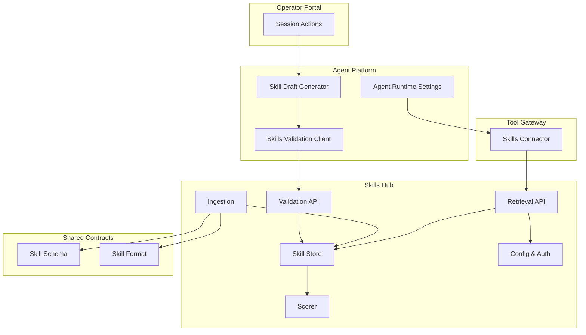
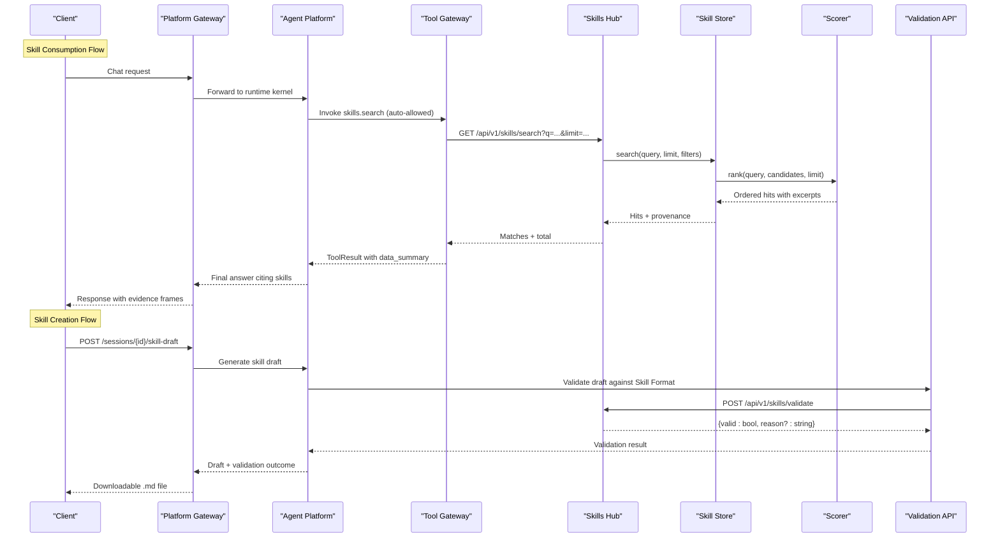
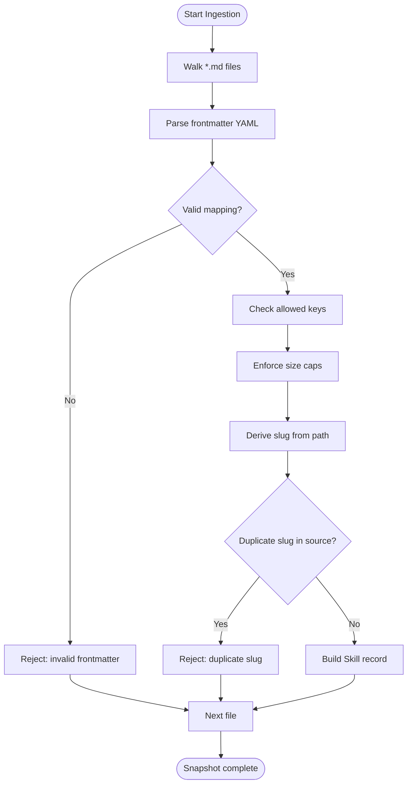
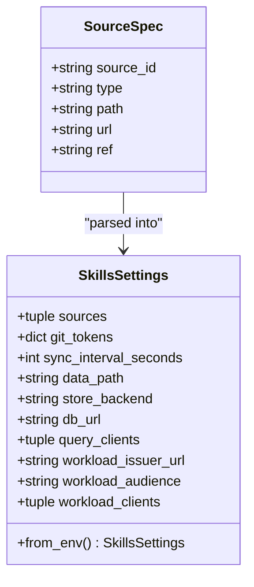
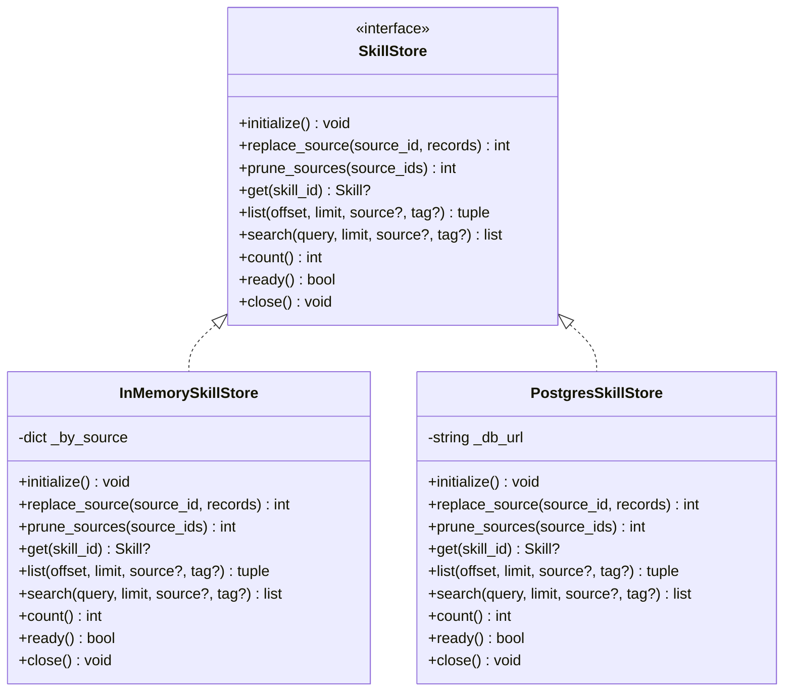
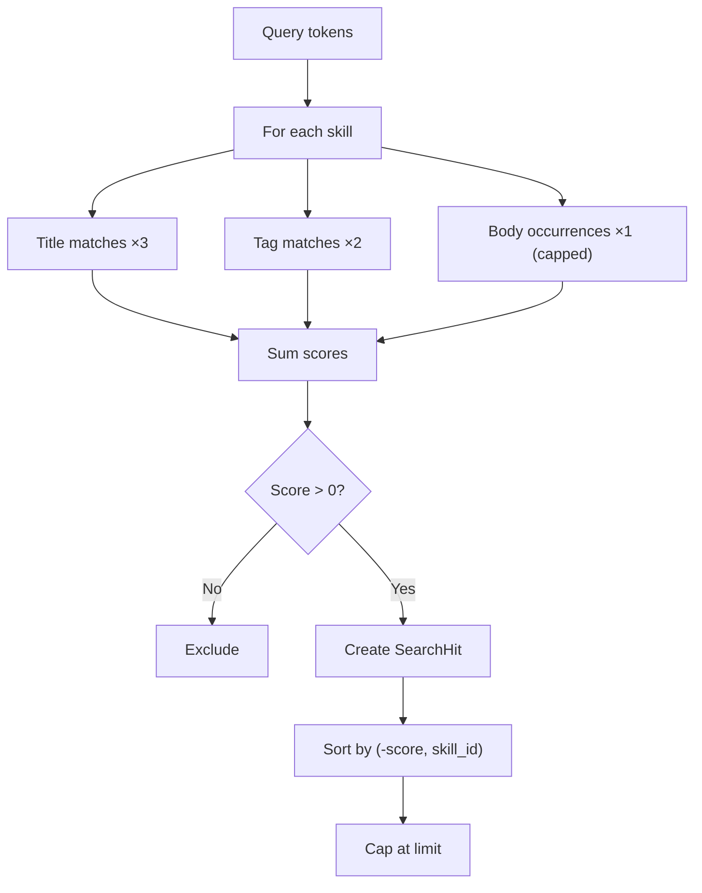
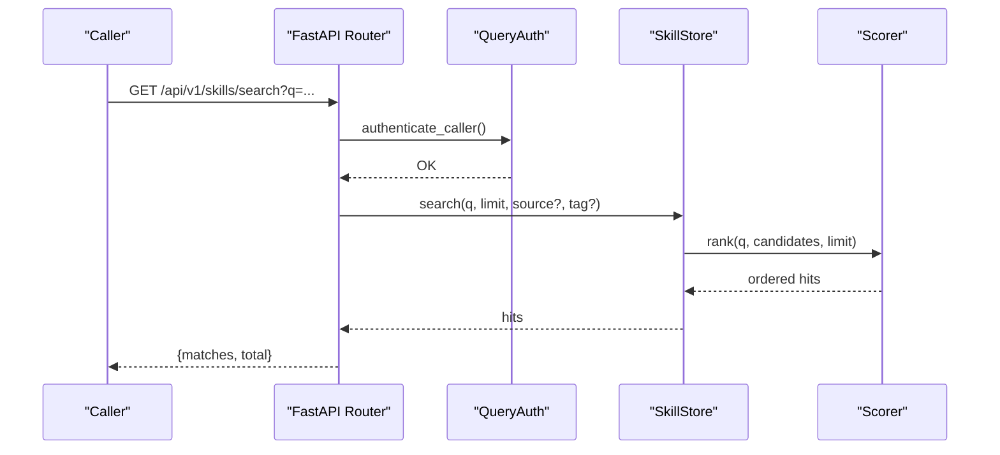
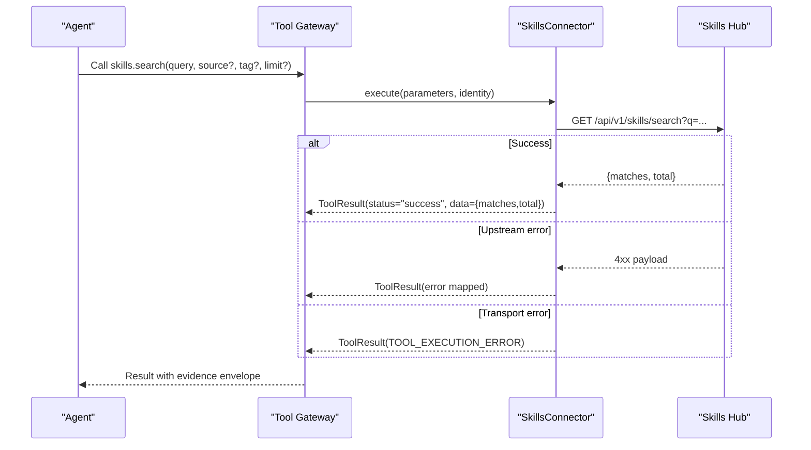
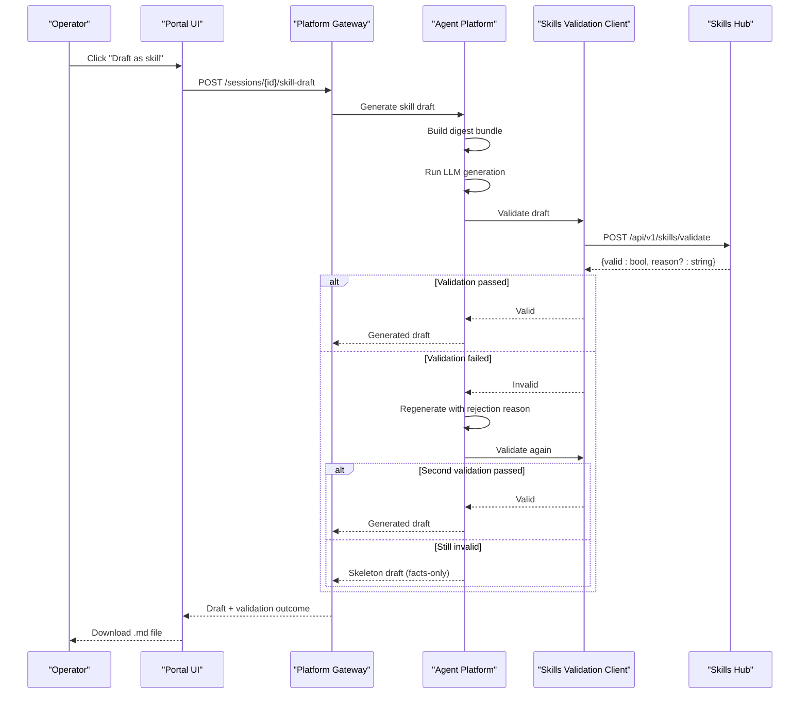
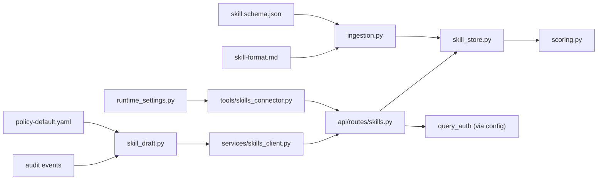

# SPEC-014: Skills and Grounded Guidance Specification

<cite>
**Referenced Files in This Document**
- [spec.md](file://docs/specs/SPEC-014-skills-and-grounded-guidance/spec.md)
- [plan.md](file://docs/specs/SPEC-014-skills-and-grounded-guidance/plan.md)
- [tasks.md](file://docs/specs/SPEC-014-skills-and-grounded-guidance/tasks.md)
- [skill-format.md](file://shared/shared-contracts/skill-format.md)
- [skill.schema.json](file://shared/shared-contracts/schemas/skill.schema.json)
- [app.py](file://products/skills-hub/src/skills_hub/app.py)
- [main.py](file://products/skills-hub/src/skills_hub/main.py)
- [skills.py](file://products/skills-hub/src/skills_hub/api/routes/skills.py)
- [config.py](file://products/skills-hub/src/skills_hub/core/config.py)
- [ingestion.py](file://products/skills-hub/src/skills_hub/services/ingestion.py)
- [skill_store.py](file://products/skills-hub/src/skills_hub/services/skill_store.py)
- [scoring.py](file://products/skills-hub/src/skills_hub/services/scoring.py)
- [skills_connector.py](file://products/tool-gateway/src/tool_gateway/tools/skills_connector.py)
- [runtime_settings.py](file://products/agent-platform/src/agent_service/runtime_settings.py)
- [skills_client.py](file://products/agent-platform/src/agent_service/services/skills_client.py)
- [SPEC-044 spec.md](file://docs/specs/SPEC-044-skill-authoring-export/spec.md)
- [SPEC-044 plan.md](file://docs/specs/SPEC-044-skill-authoring-export/plan.md)
- [SPEC-044 tasks.md](file://docs/specs/SPEC-044-skill-authoring-export/tasks.md)
</cite>

## Update Summary
**Changes Made**
- Added new section documenting the skill authoring export capability (SPEC-044) that complements existing grounded guidance features
- Updated Introduction to reflect the enhanced skills ecosystem with export functionality
- Added new Architecture Overview diagram showing the complete skills lifecycle including export flow
- Added detailed component analysis for the validation client and export workflow
- Updated Dependency Analysis to include the new skills validation client
- Enhanced Troubleshooting Guide with export-related issues and diagnostics

## Table of Contents
1. [Introduction](#introduction)
2. [Project Structure](#project-structure)
3. [Core Components](#core-components)
4. [Architecture Overview](#architecture-overview)
5. [Detailed Component Analysis](#detailed-component-analysis)
6. [Skill Authoring Export Capability](#skill-authoring-export-capability)
7. [Dependency Analysis](#dependency-analysis)
8. [Performance Considerations](#performance-considerations)
9. [Troubleshooting Guide](#troubleshooting-guide)
10. [Conclusion](#conclusion)
11. [Appendices](#appendices)

## Introduction
SPEC-014 delivers Release 2 of the platform's skills and grounded guidance capability, establishing a comprehensive skills ecosystem that now includes both consumption and creation workflows. The specification introduces a new skills-hub service that ingests team-owned Markdown runbooks from federated sources, validates them against a shared contract, indexes them, and exposes deterministic search and retrieval APIs. The agent-platform extends its system prompt to consult skills when answering procedure or remediation questions, and tool-gateway registers read-only skills tools so all skill access flows through policy, audit, redaction, and evidence panels without expanding the trust surface.

The enhanced ecosystem now supports the complete knowledge lifecycle: operators can generate skill drafts from completed troubleshooting sessions, validate them against Skill Format v1 before they reach human review, and export them as downloadable Markdown files ready for contribution to team Git repositories. This creates a closed loop where operational experience becomes reusable team knowledge through a secure, auditable process.

Key outcomes:
- A stable skill document contract with JSON schema validation and frontmatter rules.
- Federated ingestion from local directories and Git repositories with per-source atomic swaps.
- Deterministic keyword-based search with explainable ranking and provenance.
- Read-only skills tools exposed via tool-gateway, inheriting existing security and observability controls.
- **New**: Skill authoring export capability that generates validated Markdown drafts from session facts.
- Operator-facing citations visible in the portal evidence panel and chat transcripts.

**Section sources**
- [spec.md:13-41](file://docs/specs/SPEC-014-skills-and-grounded-guidance/spec.md#L13-L41)
- [plan.md:3-22](file://docs/specs/SPEC-014-skills-and-grounded-guidance/plan.md#L3-L22)
- [SPEC-044 spec.md:18-29](file://docs/specs/SPEC-044-skill-authoring-export/spec.md#L18-L29)

## Project Structure
The implementation spans three products plus shared contracts, now extended to support the complete skills lifecycle:
- skills-hub: FastAPI service for ingestion, storage, retrieval, and validation endpoints.
- tool-gateway: Registers skills tools and proxies calls to skills-hub.
- agent-platform: Extends system prompt, auto-allowed tools, and now includes skill-draft generation and validation client.
- operator-portal: Session actions for draft generation and download.
- shared contracts: Skill schema and format convention consumed by skills-hub and tests.

**Diagram sources**
- [app.py:20-56](file://products/skills-hub/src/skills_hub/app.py#L20-L56)
- [skills.py:17-119](file://products/skills-hub/src/skills_hub/api/routes/skills.py#L17-L119)
- [ingestion.py:151-229](file://products/skills-hub/src/skills_hub/services/ingestion.py#L151-L229)
- [skill_store.py:30-67](file://products/skills-hub/src/skills_hub/services/skill_store.py#L30-L67)
- [scoring.py:28-97](file://products/skills-hub/src/skills_hub/services/scoring.py#L28-L97)
- [config.py:147-189](file://products/skills-hub/src/skills_hub/core/config.py#L147-L189)
- [skills_connector.py:71-88](file://products/tool-gateway/src/tool_gateway/tools/skills_connector.py#L71-L88)
- [runtime_settings.py:8-22](file://products/agent-platform/src/agent_service/runtime_settings.py#L8-L22)
- [skills_client.py:69-114](file://products/agent-platform/src/agent_service/services/skills_client.py#L69-L114)
- [skill.schema.json:1-76](file://shared/shared-contracts/schemas/skill.schema.json#L1-L76)
- [skill-format.md:1-85](file://shared/shared-contracts/skill-format.md#L1-L85)

**Section sources**
- [spec.md:43-213](file://docs/specs/SPEC-014-skills-and-grounded-guidance/spec.md#L43-L213)
- [plan.md:24-235](file://docs/specs/SPEC-014-skills-and-grounded-guidance/plan.md#L24-L235)

## Core Components
- Skill contract: Envelope and frontmatter rules define how skills are authored and validated.
- Ingestion pipeline: Walks source directories, parses YAML frontmatter, enforces size caps and allowed keys, derives slugs, and rejects invalid documents with structured reasons.
- Storage backends: In-memory store for dev/tests; PostgreSQL store for production with per-source atomic replace and GIN full-text index pre-filtering.
- Search and scoring: Deterministic keyword scorer with fixed weights (title > tags > body), capped body occurrences, and stable tie-breaking by skill id.
- Retrieval API: List, get-by-id, and search endpoints with auth, parameter validation, pagination, and bounded results.
- **New**: Validation API: Read-only endpoint that validates candidate skill documents against Skill Format v1 using the same code path as ingestion.
- Tool connector: Registers read-only skills tools in tool-gateway, authenticates to skills-hub with gateway-held credentials, maps upstream errors, and emits standard evidence envelopes.
- **New**: Skill draft generator: Generates Markdown skill drafts from session facts with fenced frontmatter contract and deterministic post-processing.
- **New**: Skills validation client: Bounded HTTP client that validates drafts against skills-hub before returning to operators.
- Agent integration: System prompt instructs the agent to consult skills for procedure/interpretation/remediation and cite used skills; tools are auto-allowed.

**Section sources**
- [skill.schema.json:1-76](file://shared/shared-contracts/schemas/skill.schema.json#L1-L76)
- [skill-format.md:9-68](file://shared/shared-contracts/skill-format.md#L9-L68)
- [ingestion.py:85-149](file://products/skills-hub/src/skills_hub/services/ingestion.py#L85-L149)
- [skill_store.py:72-154](file://products/skills-hub/src/skills_hub/services/skill_store.py#L72-L154)
- [skill_store.py:247-432](file://products/skills-hub/src/skills_hub/services/skill_store.py#L247-L432)
- [scoring.py:28-97](file://products/skills-hub/src/skills_hub/services/scoring.py#L28-L97)
- [skills.py:34-119](file://products/skills-hub/src/skills_hub/api/routes/skills.py#L34-L119)
- [skills_connector.py:143-401](file://products/tool-gateway/src/tool_gateway/tools/skills_connector.py#L143-L401)
- [runtime_settings.py:8-22](file://products/agent-platform/src/agent_service/runtime_settings.py#L8-L22)
- [skills_client.py:69-114](file://products/agent-platform/src/agent_service/services/skills_client.py#L69-L114)

## Architecture Overview
End-to-end flow from agent request to cited skill result, now including the complete skills lifecycle from generation to publication:

**Diagram sources**
- [skills_connector.py:187-232](file://products/tool-gateway/src/tool_gateway/tools/skills_connector.py#L187-L232)
- [skills.py:65-101](file://products/skills-hub/src/skills_hub/api/routes/skills.py#L65-L101)
- [skill_store.py:366-392](file://products/skills-hub/src/skills_hub/services/skill_store.py#L366-L392)
- [scoring.py:85-97](file://products/skills-hub/src/skills_hub/services/scoring.py#L85-L97)
- [runtime_settings.py:8-22](file://products/agent-platform/src/agent_service/runtime_settings.py#L8-L22)
- [skills_client.py:69-114](file://products/agent-platform/src/agent_service/services/skills_client.py#L69-L114)

## Detailed Component Analysis

### Skill Contract and Validation
- Envelope fields include globally unique skill_id namespaced by source_id, provenance fields (source_path, source_ref, updated_at), human-readable title/description, optional tags/version/source_url, and body where applicable.
- Frontmatter must be a YAML mapping with required keys and strict size caps; unknown keys are rejected.
- Slug derivation is path-based and sanitized, ensuring moves within a repo change skill_id intentionally.
- Ingestion walks directories, skips README/NOTICE files, handles Kubernetes projected volumes, and reports per-document rejections.

**Diagram sources**
- [ingestion.py:151-229](file://products/skills-hub/src/skills_hub/services/ingestion.py#L151-L229)
- [skill.schema.json:1-76](file://shared/shared-contracts/schemas/skill.schema.json#L1-L76)
- [skill-format.md:26-68](file://shared/shared-contracts/skill-format.md#L26-L68)

**Section sources**
- [skill.schema.json:1-76](file://shared/shared-contracts/schemas/skill.schema.json#L1-L76)
- [skill-format.md:9-68](file://shared/shared-contracts/skill-format.md#L9-L68)
- [ingestion.py:85-149](file://products/skills-hub/src/skills_hub/services/ingestion.py#L85-L149)
- [ingestion.py:151-229](file://products/skills-hub/src/skills_hub/services/ingestion.py#L151-L229)

### Federated Ingestion and Sync
- Sources are configured via SKILLS_SOURCES entries supporting local directories and Git repositories.
- Each source syncs on an interval, builds a fully validated snapshot, and atomically replaces the source slice in the store.
- Rejections are reported per document with structured reasons; zero valid docs still swap to an empty slice.
- Status endpoint exposes last sync time, ref, accepted count, and rejection list.

**Diagram sources**
- [config.py:22-31](file://products/skills-hub/src/skills_hub/core/config.py#L22-L31)
- [config.py:147-189](file://products/skills-hub/src/skills_hub/core/config.py#L147-L189)

**Section sources**
- [config.py:49-117](file://products/skills-hub/src/skills_hub/core/config.py#L49-L117)
- [config.py:147-189](file://products/skills-hub/src/skills_hub/core/config.py#L147-L189)
- [app.py:20-56](file://products/skills-hub/src/skills_hub/app.py#L20-L56)

### Storage Backends
- InMemorySkillStore: Per-source snapshot map with atomic reference swap; suitable for dev/tests.
- PostgresSkillStore: Durable table with GIN index on title/body tsvector; per-source delete+insert transaction; tag filtering uses safe constructs; search pre-filters via full-text then re-ranks with shared scorer for byte-identical ordering.

**Diagram sources**
- [skill_store.py:30-67](file://products/skills-hub/src/skills_hub/services/skill_store.py#L30-L67)
- [skill_store.py:72-154](file://products/skills-hub/src/skills_hub/services/skill_store.py#L72-L154)
- [skill_store.py:247-432](file://products/skills-hub/src/skills_hub/services/skill_store.py#L247-L432)

**Section sources**
- [skill_store.py:72-154](file://products/skills-hub/src/skills_hub/services/skill_store.py#L72-L154)
- [skill_store.py:247-432](file://products/skills-hub/src/skills_hub/services/skill_store.py#L247-L432)

### Deterministic Scoring and Ranking
- Tokenization uses lowercase alphanumeric tokens.
- Weights: title ×3, tags ×2, body ×1 (capped occurrences).
- Zero-score records excluded; ties broken by skill_id ascending.
- Excerpts bounded to ≤400 chars around first matched region; fallback to description head if match only in title/tags.

**Diagram sources**
- [scoring.py:28-97](file://products/skills-hub/src/skills_hub/services/scoring.py#L28-97)

**Section sources**
- [scoring.py:28-97](file://products/skills-hub/src/skills_hub/services/scoring.py#L28-97)

### Retrieval API
- Endpoints:
  - GET /api/v1/skills: list with offset/limit, optional source/tag filters; returns summaries without bodies.
  - GET /api/v1/skills/{skill_id:path}: full record including body; 404 for unknown ids.
  - GET /api/v1/skills/search: ranked matches with excerpt and provenance; q required; limit capped.
- Authentication: Basic clients or projected workload tokens; unauthenticated requests receive 401.
- Parameter validation: Returns structured 400 errors for malformed inputs.

**Diagram sources**
- [skills.py:34-119](file://products/skills-hub/src/skills_hub/api/routes/skills.py#L34-119)
- [skill_store.py:366-392](file://products/skills-hub/src/skills_hub/services/skill_store.py#L366-392)
- [scoring.py:85-97](file://products/skills-hub/src/skills_hub/services/scoring.py#L85-97)

**Section sources**
- [skills.py:34-119](file://products/skills-hub/src/skills_hub/api/routes/skills.py#L34-119)

### Tool-Gateway Skills Connector
- Registers read-only tools: skills.search, skills.get, skills.list.
- Parameters validated locally; skill_id validated against namespaced pattern before URL interpolation.
- HTTP transport uses httpx with timeout and Basic auth from gateway-held credentials.
- Error mapping: 404 → SKILL_NOT_FOUND; unreachable → TOOL_EXECUTION_ERROR; other 4xx pass through with code/message.
- Evidence envelope built for every outcome; tool invocations inherit policy, audit emission, and redaction.

**Diagram sources**
- [skills_connector.py:143-232](file://products/tool-gateway/src/tool_gateway/tools/skills_connector.py#L143-232)
- [skills_connector.py:235-294](file://products/tool-gateway/src/tool_gateway/tools/skills_connector.py#L235-294)
- [skills_connector.py:297-401](file://products/tool-gateway/src/tool_gateway/tools/skills_connector.py#L297-401)

**Section sources**
- [skills_connector.py:71-88](file://products/tool-gateway/src/tool_gateway/tools/skills_connector.py#L71-88)
- [skills_connector.py:143-232](file://products/tool-gateway/src/tool_gateway/tools/skills_connector.py#L143-232)
- [skills_connector.py:235-294](file://products/tool-gateway/src/tool_gateway/tools/skills_connector.py#L235-294)
- [skills_connector.py:297-401](file://products/tool-gateway/src/tool_gateway/tools/skills_connector.py#L297-401)

### Agent Integration and Citations
- DEFAULT_SYSTEM_PROMPT extended to instruct the agent to consult skills for procedure/interpretation/remediation, cite used skills by title or skill_id, separate skill guidance from live cluster data, and report no-match honestly.
- Auto-allowed tools include skills.search and skills.get, enabling frictionless retrieval when needed.
- Empty-match behavior: skills.search returns success with empty matches; agent reports no team guidance matched.

**Section sources**
- [runtime_settings.py:8-22](file://products/agent-platform/src/agent_service/runtime_settings.py#L8-22)
- [plan.md:147-167](file://docs/specs/SPEC-014-skills-and-grounded-guidance/plan.md#L147-L167)

## Skill Authoring Export Capability

The enhanced skills ecosystem now includes a comprehensive skill authoring export capability that transforms completed troubleshooting sessions into reusable team knowledge. This feature closes the loop between operational experience and published guidance through a secure, validated workflow.

### Skill Draft Generation
The agent-platform gains a skill-draft generator that creates Markdown skill drafts from session facts. The generator follows a digest-only approach, using the same deterministic session-fact assembly that powers shift summaries, combined with validated triage reports when sessions are incident-linked. Raw transcripts, alert payloads, and evidence payloads never reach the prompt — only curated facts.

The generation process produces either:
- **Generated mode**: LLM-generated content with fenced `skill-frontmatter` JSON block plus Markdown body
- **Skeleton mode**: Facts-only skeleton with verbatim evidence/outcome tables when generation fails

Both modes produce format-valid output that passes Skill Format v1 validation.

### Validation Pipeline
Every generated draft undergoes validation against Skill Format v1 before reaching operators. The validation uses skills-hub's own ingestion code path through a new `POST /api/v1/skills/validate` endpoint, ensuring consistency with the ingestion process. The validation client in agent-platform authenticates with Basic query credentials and provides structured error handling:

- Not configured → 503 Service Unavailable
- Unreachable service → 502 Bad Gateway  
- Validation failure → One regeneration attempt with rejection reason
- Second failure → Facts-only skeleton (always format-valid)

### Policy Gate and Audit Trail
The export capability is gated behind a new policy action `session:skill_draft`, granted to platform-admin, approver, and operator roles. Every successful draft generation emits a `skill_draft_generated` audit event containing requester, session ID, covered incident ID (when present), generation mode, validation outcome, and correlation headers.

### Content Guardrails and Provenance
All drafts carry deterministic provenance markers as HTML comments containing session ID, covered incident ID, generation date, platform version, and generation mode. The content passes through deterministic post-processing that applies the gateway's redaction vocabulary and enforces Skill Format caps regardless of model output. The prompt contract explicitly forbids secrets, hostnames, and customer data in drafts.

### Operator Workflow
Operators access the export capability through the portal's session actions interface. The "Draft as skill" action appears when the caller has the required policy permission, initiates generation with busy state indication, and downloads the resulting Markdown file as `<suggested-slug>.md`. The download toast distinguishes between generated and skeleton modes so operators understand what they're receiving.

**Diagram sources**
- [SPEC-044 spec.md:59-95](file://docs/specs/SPEC-044-skill-authoring-export/spec.md#L59-L95)
- [SPEC-044 spec.md:96-127](file://docs/specs/SPEC-044-skill-authoring-export/spec.md#L96-L127)
- [SPEC-044 spec.md:170-189](file://docs/specs/SPEC-044-skill-authoring-export/spec.md#L170-L189)
- [skills_client.py:69-114](file://products/agent-platform/src/agent_service/services/skills_client.py#L69-114)

**Section sources**
- [SPEC-044 spec.md:18-29](file://docs/specs/SPEC-044-skill-authoring-export/spec.md#L18-L29)
- [SPEC-044 spec.md:59-95](file://docs/specs/SPEC-044-skill-authoring-export/spec.md#L59-L95)
- [SPEC-044 spec.md:96-127](file://docs/specs/SPEC-044-skill-authoring-export/spec.md#L96-L127)
- [SPEC-044 spec.md:170-189](file://docs/specs/SPEC-044-skill-authoring-export/spec.md#L170-L189)
- [SPEC-044 plan.md:35-59](file://docs/specs/SPEC-044-skill-authoring-export/plan.md#L35-L59)
- [skills_client.py:69-114](file://products/agent-platform/src/agent_service/services/skills_client.py#L69-114)

## Dependency Analysis
- skills-hub depends on shared contracts for schema and format; uses FastAPI router, metrics, observability, and request context modules.
- Retrieval routes depend on query authentication and skill store; store implementations depend on scorer for consistent ranking.
- tool-gateway depends on base tool framework and registry; skills connector depends on httpx and error mapping utilities.
- agent-platform depends on runtime settings for prompt and allow-list, and now includes skills validation client for export capability.
- **New**: Export capability adds dependencies on skills validation client, policy engine for new action, and audit service for new event type.

**Diagram sources**
- [skill.schema.json:1-76](file://shared/shared-contracts/schemas/skill.schema.json#L1-76)
- [skill-format.md:1-85](file://shared/shared-contracts/skill-format.md#L1-85)
- [ingestion.py:151-229](file://products/skills-hub/src/skills_hub/services/ingestion.py#L151-229)
- [skill_store.py:30-67](file://products/skills-hub/src/skills_hub/services/skill_store.py#L30-67)
- [scoring.py:28-97](file://products/skills-hub/src/skills_hub/services/scoring.py#L28-97)
- [skills.py:17-119](file://products/skills-hub/src/skills_hub/api/routes/skills.py#L17-119)
- [skills_connector.py:71-88](file://products/tool-gateway/src/tool_gateway/tools/skills_connector.py#L71-88)
- [runtime_settings.py:8-22](file://products/agent-platform/src/agent_service/runtime_settings.py#L8-22)
- [skills_client.py:69-114](file://products/agent-platform/src/agent_service/services/skills_client.py#L69-114)

**Section sources**
- [plan.md:24-235](file://docs/specs/SPEC-014-skills-and-grounded-guidance/plan.md#L24-235)
- [spec.md:250-266](file://docs/specs/SPEC-014-skills-and-grounded-guidance/spec.md#L250-L266)
- [SPEC-044 spec.md:262-287](file://docs/specs/SPEC-044-skill-authoring-export/spec.md#L262-L287)

## Performance Considerations
- Scoring is O(n·t) per query where n is candidate count and t is token count; body occurrence cap prevents long bodies from dominating scores.
- PostgreSQL search uses GIN full-text index to reduce candidate set; Python re-ranking ensures deterministic ordering parity with in-memory store.
- Pagination limits protect payloads: list limit capped at 100, search limit capped at 20; excerpts bounded to ≤400 chars.
- Atomic per-source replace avoids partial reads during sync; failed sync preserves previous snapshot.
- Timeouts and structured errors prevent cascading failures in tool execution.
- **New**: Export capability performance considerations:
  - Validation round-trip adds bounded latency to draft generation
  - Digest-only input minimizes prompt size and processing overhead
  - Skeleton fallback ensures availability even when LLM generation fails
  - Client-side download eliminates server-side draft persistence overhead

[No sources needed since this section provides general guidance]

## Troubleshooting Guide
Common issues and diagnostics:
- Invalid frontmatter or unknown keys: ingestion rejects with structured reason; check skill-format constraints and size caps.
- Duplicate slug within a source: ingestion rejects; ensure unique paths per source.
- Unreachable skills-hub: tool-gateway returns TOOL_EXECUTION_ERROR; verify GATEWAY_SKILLS_SERVICE_URL and credentials.
- Unknown skill id: 404 SKILL_NOT_FOUND; confirm namespaced id format and existence.
- Unauthorized access: 401 UNAUTHORIZED; configure SKILLS_QUERY_CLIENTS or workload tokens correctly.
- Empty matches: skills.search returns success with empty matches; agent should report no team guidance matched.

**Export-specific issues:**
- Skills validation not configured: 503 Service Unavailable; verify AGENT_SKILLS_SERVICE_URL, AGENT_SKILLS_CLIENT_ID, and AGENT_SKILLS_CLIENT_SECRET are set.
- Skills service unreachable: 502 Bad Gateway; check network connectivity and skills-hub health.
- Validation failures: Review rejection reasons from skills-hub validation response; regenerate with corrected content.
- Draft quality issues: Use skeleton mode for quiet sessions; review prompt constraints and digest content.
- Policy denial: Ensure caller has `session:skill_draft` action granted to their role.

Operational checks:
- Use GET /api/v1/skills/status to inspect last sync outcomes per source, accepted counts, and rejections.
- Validate sources locally with the standalone validator CLI to catch issues before deployment.
- Monitor audit events for `skill_draft_generated` to track export activity and success rates.

**Section sources**
- [ingestion.py:85-149](file://products/skills-hub/src/skills_hub/services/ingestion.py#L85-149)
- [skills.py:34-119](file://products/skills-hub/src/skills_hub/api/routes/skills.py#L34-119)
- [skills_connector.py:117-137](file://products/tool-gateway/src/tool_gateway/tools/skills_connector.py#L117-137)
- [plan.md:86-93](file://docs/specs/SPEC-014-skills-and-grounded-guidance/plan.md#L86-L93)
- [skills_client.py:31-55](file://products/agent-platform/src/agent_service/services/skills_client.py#L31-L55)
- [SPEC-044 spec.md:119-127](file://docs/specs/SPEC-044-skill-authoring-export/spec.md#L119-L127)

## Conclusion
SPEC-014 integrates team-owned operational knowledge into the platform in a secure, auditable, and operator-visible way. By enforcing a strict skill contract, providing deterministic retrieval, and routing access through existing tool-execution guardrails, it enhances agent answers with cited guidance while preserving the trust model. The enhanced ecosystem now supports the complete knowledge lifecycle from creation to consumption, with the new skill authoring export capability closing the loop between operational experience and published guidance.

The design supports future enhancements such as semantic retrieval, per-team scoping, and advanced skill quality assessment without disrupting current behavior. The export capability establishes a foundation for continuous improvement of team knowledge through automated generation from real operational experience.

[No sources needed since this section summarizes without analyzing specific files]

## Appendices
- Deployment and configuration details are covered in the plan and tasks, including overlay wiring, secrets sync, and sample skill sources.
- Living-state documentation updates include product READMEs, configuration references, tool configuration guides, and architecture overview diagrams.
- **New**: Export capability deployment includes three new agent-platform environment variables (`AGENT_SKILLS_SERVICE_URL`, `AGENT_SKILLS_CLIENT_ID`, `AGENT_SKILLS_CLIENT_SECRET`) wired through existing secrets-sync conventions.

**Section sources**
- [plan.md:168-235](file://docs/specs/SPEC-014-skills-and-grounded-guidance/plan.md#L168-L235)
- [tasks.md:49-67](file://docs/specs/SPEC-014-skills-and-grounded-guidance/tasks.md#L49-L67)
- [SPEC-044 spec.md:278-287](file://docs/specs/SPEC-044-skill-authoring-export/spec.md#L278-L287)