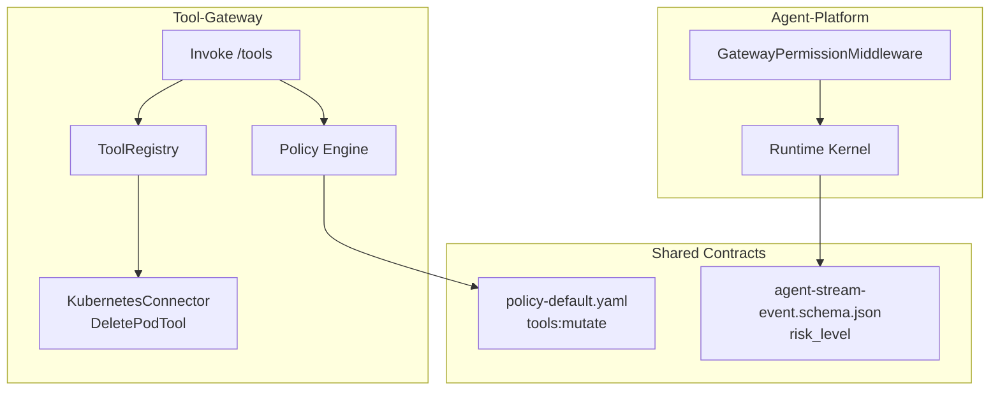
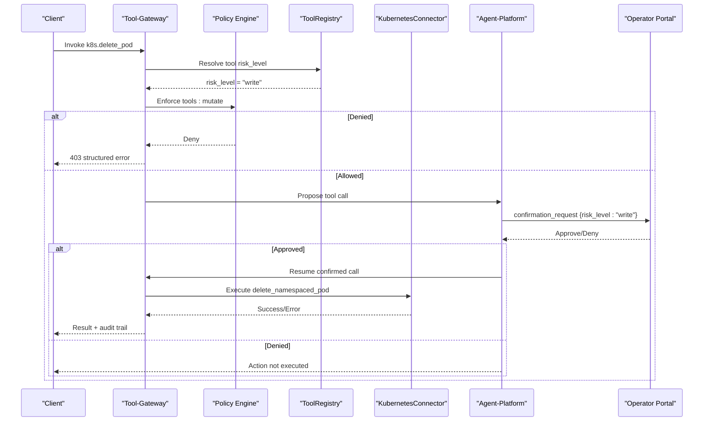
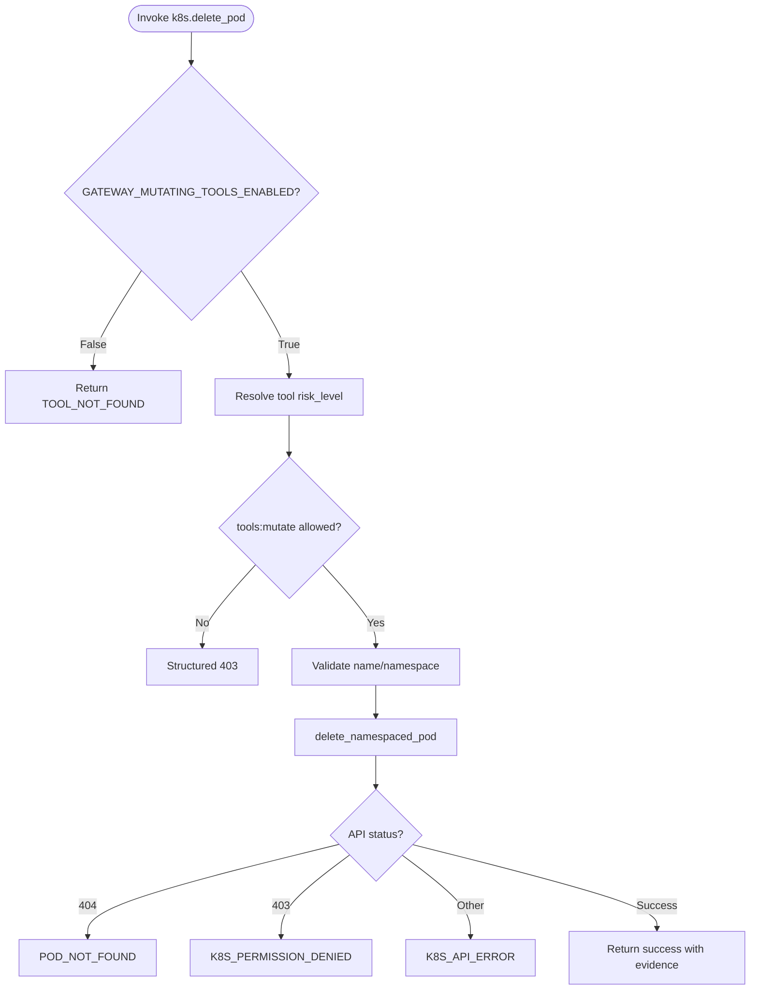
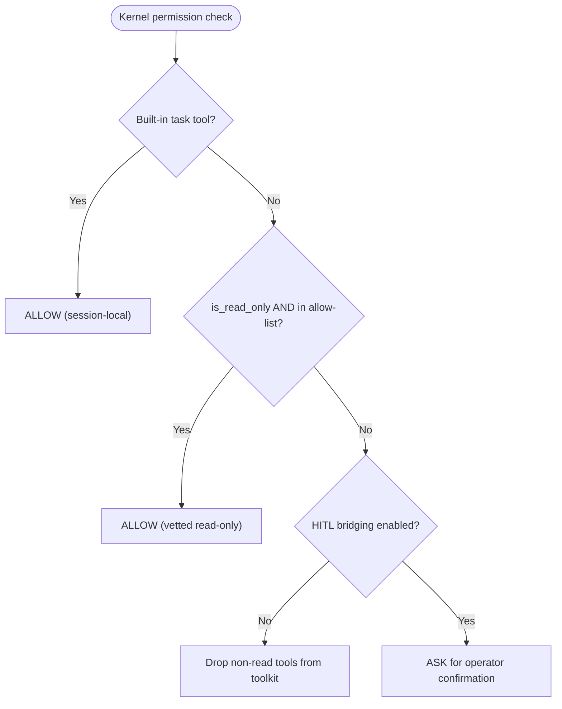
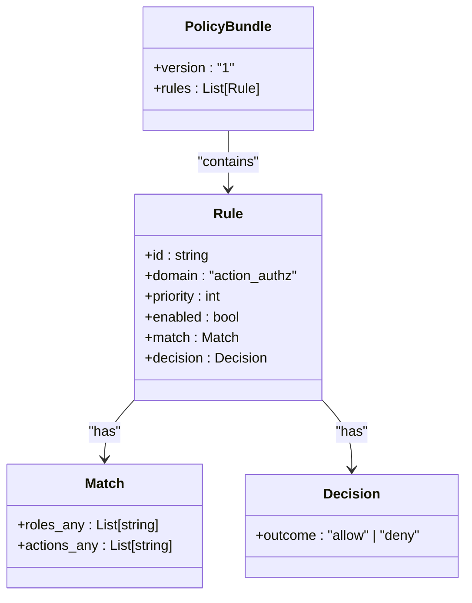
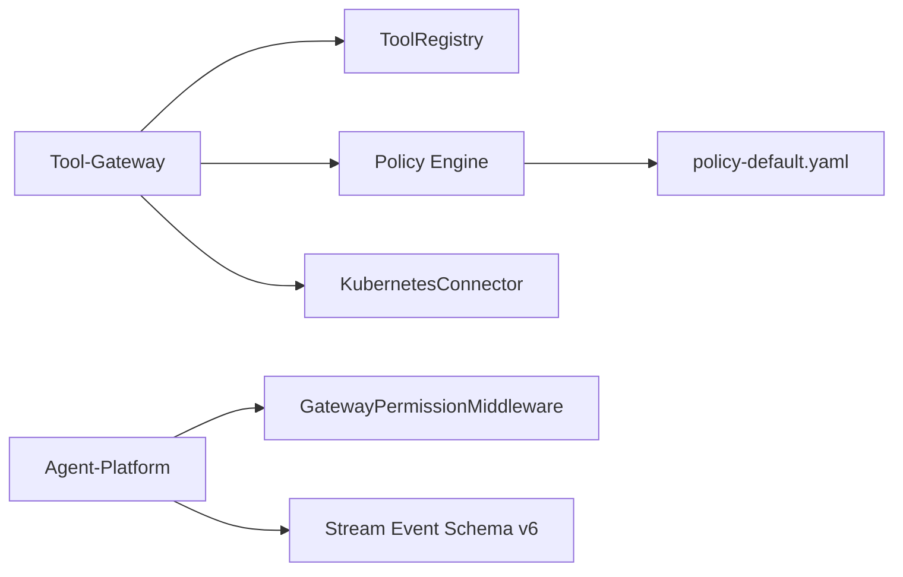

# SPEC-021: Bounded Mutating Actions

<cite>
**Referenced Files in This Document**
- [spec.md](file://docs/specs/SPEC-021-bounded-mutating-actions/spec.md)
- [plan.md](file://docs/specs/SPEC-021-bounded-mutating-actions/plan.md)
- [tasks.md](file://docs/specs/SPEC-021-bounded-mutating-actions/tasks.md)
- [k8s_connector.py](file://products/tool-gateway/src/tool_gateway/tools/k8s_connector.py)
- [kernel_middleware.py](file://products/agent-platform/src/agent_service/services/kernel_middleware.py)
- [policy-default.yaml](file://shared/shared-contracts/policies/policy-default.yaml)
- [approval-and-hitl.md](file://docs/guides/approval-and-hitl.md)
- [mutating-demo.sh](file://shared/platform-ops/e2e/mutating-demo.sh)
- [2026-08-22-release-notes.md](file://docs/agentic-aiops-platform/release-notes/2026-08-22-bounded-mutating-actions.md)
</cite>

## Update Summary
**Changes Made**
- Enhanced with comprehensive v0.7.0 release notes documenting the complete bounded mutating actions feature
- Added detailed triple-gated security model explanation including risk-tier admission, agent-platform invariants, and HITL confirmation
- Documented k8s.delete_pod tool implementation with structured error handling and evidence tracking
- Expanded operator enablement procedures covering the four-layer approval model and deployment posture
- Updated validation results showing 1003 tests across seven products and successful live cluster testing
- Added e2e demo script details and automated verification procedures

## Table of Contents
1. [Introduction](#introduction)
2. [Project Structure](#project-structure)
3. [Core Components](#core-components)
4. [Architecture Overview](#architecture-overview)
5. [Detailed Component Analysis](#detailed-component-analysis)
6. [Dependency Analysis](#dependency-analysis)
7. [Performance Considerations](#performance-considerations)
8. [Troubleshooting Guide](#troubleshooting-guide)
9. [Validation and Release Notes](#validation-and-release-notes)
10. [Conclusion](#conclusion)

## Introduction
SPEC-021 delivers the platform's first write capability — `k8s.delete_pod` — behind three independent, each fail-closed gates. Tool-gateway gains risk-tier admission: every tool now carries a `risk_level` (`read`/`write`/`admin`) validated at registration, and while `GATEWAY_MUTATING_TOOLS_ENABLED` stays `false` (the committed default) non-read tools are never registered — absent from discovery and answered with `TOOL_NOT_FOUND` on invoke. When the gate is opted in, mutating invokes additionally require the new deny-by-default `tools:mutate` policy action, granted to `platform-admin` and `operator` only. On the agent side, auto-allow is read-only by construction: mutating tools carry `is_read_only=False`, so naming one in `AGENT_GATEWAY_TOOL_AUTO_ALLOW` can never grant auto-execution — it is logged as misconfiguration and still parks for confirmation. Every mutating call therefore reaches execution only through the SPEC-020 HITL bridge: the confirmation card gains a `mutating` badge and per-call `risk_level` markers (stream schema v6), and approval remains an explicit operator action.

Live testing on the dev cluster validated the whole chain, including the fail-closed behavior: with the opt-in RBAC not yet applied, an approved deletion reached the Kubernetes API and was refused there (403 mapped to a structured tool error), proving every platform gate had opened while cluster-level blast radius stayed zero.

**Section sources**
- [spec.md:11-20](file://docs/specs/SPEC-021-bounded-mutating-actions/spec.md#L11-L20)
- [plan.md:3-16](file://docs/specs/SPEC-021-bounded-mutating-actions/plan.md#L3-L16)
- [2026-08-22-release-notes.md:5-26](file://docs/agentic-aiops-platform/release-notes/2026-08-22-bounded-mutating-actions.md#L5-L26)

## Project Structure
This spec spans multiple products and shared contracts:
- Tool-gateway: risk-tier admission gate, new policy action enforcement, and the first mutating tool implementation.
- Agent-platform: kernel middleware invariant ensuring mutating tools cannot be auto-approved and cannot run when HITL bridging is disabled.
- Policy bundle: new tools:mutate action with deny-by-default semantics.
- Portal and schemas: additive stream event schema change to carry risk_level for pending confirmations and UI indicators.

**Diagram sources**
- [k8s_connector.py:80-91](file://products/tool-gateway/src/tool_gateway/tools/k8s_connector.py#L80-L91)
- [kernel_middleware.py:122-201](file://products/agent-platform/src/agent_service/services/kernel_middleware.py#L122-L201)
- [policy-default.yaml:72-86](file://shared/shared-contracts/policies/policy-default.yaml#L72-L86)

**Section sources**
- [plan.md:18-20](file://docs/specs/SPEC-021-bounded-mutating-actions/plan.md#L18-L20)
- [tasks.md:5-46](file://docs/specs/SPEC-021-bounded-mutating-actions/tasks.md#L5-L46)

## Core Components
- Risk-tier admission at the tool-gateway:
  - Validates ToolDefinition.risk_level vocabulary at registration.
  - Filters non-read tools from discovery and invocation when GATEWAY_MUTATING_TOOLS_ENABLED is false.
  - Selects required policy action based on risk tier: tools:invoke for read, tools:mutate for write/admin.
- First bounded mutating tool — k8s.delete_pod:
  - Single named pod deletion with optional namespace; no selectors or multi-pod variants.
  - Structured error mapping for 404 and 403 cases; evidence envelope carries risk_level: "write".
  - Registered only when both K8S connector and mutating tools are enabled.
- HITL confirmation invariant:
  - Auto-allow list excludes mutating tools; even if named, they always park for confirmation.
  - When HITL bridging is disabled, non-read tools are dropped from toolkit construction.
  - Stream events add optional risk_level to confirmation_request pending calls.
- Policy bundle tools:mutate:
  - New rule granting tools:mutate to platform-admin and operator; all other roles denied by default.
  - Existing tools:invoke rule comment updated to reflect risk-tier scoping.

**Section sources**
- [spec.md:26-85](file://docs/specs/SPEC-021-bounded-mutating-actions/spec.md#L26-L85)
- [plan.md:22-58](file://docs/specs/SPEC-021-bounded-mutating-actions/plan.md#L22-L58)
- [tasks.md:12-46](file://docs/specs/SPEC-021-bounded-mutating-actions/tasks.md#L12-L46)

## Architecture Overview
The mutating flow is triple-gated and audited end-to-end:

**Diagram sources**
- [k8s_connector.py:439-518](file://products/tool-gateway/src/tool_gateway/tools/k8s_connector.py#L439-L518)
- [kernel_middleware.py:122-201](file://products/agent-platform/src/agent_service/services/kernel_middleware.py#L122-L201)
- [policy-default.yaml:72-86](file://shared/shared-contracts/policies/policy-default.yaml#L72-L86)

## Detailed Component Analysis

### Tool-Gateway: Risk-Tier Admission and Delete Pod Tool
- Registration and gating:
  - ToolRegistry validates risk_level and filters non-read tools when mutating tools are disabled.
  - DeletePodTool is registered alongside read-only tools but gated by registry behavior.
- Execution:
  - Uses official Kubernetes client with lazy initialization and fallback between in-cluster and kubeconfig.
  - Parameters validated; errors mapped to structured codes (POD_NOT_FOUND, K8S_PERMISSION_DENIED).
  - Evidence envelope includes risk_level: "write" and duration metrics.

**Diagram sources**
- [k8s_connector.py:439-518](file://products/tool-gateway/src/tool_gateway/tools/k8s_connector.py#L439-L518)

**Section sources**
- [k8s_connector.py:80-91](file://products/tool-gateway/src/tool_gateway/tools/k8s_connector.py#L80-L91)
- [k8s_connector.py:439-518](file://products/tool-gateway/src/tool_gateway/tools/k8s_connector.py#L439-L518)

### Agent-Platform: HITL Confirmation Invariant
- Allow-list invariant:
  - Only read-only tools may be auto-approved; mutating tools are excluded regardless of allow-list contents.
  - When HITL bridging is disabled, non-read tools are removed from toolkit construction to avoid silent ASK parking.
- Permission middleware:
  - Explicitly answers with ASK for unvetted tools instead of delegating to agentscope's PermissionEngine to prevent bypassing the allow-list.
  - Confirmed calls resume with ALLOWED state to avoid re-parking.

**Diagram sources**
- [kernel_middleware.py:122-201](file://products/agent-platform/src/agent_service/services/kernel_middleware.py#L122-L201)

**Section sources**
- [kernel_middleware.py:55-86](file://products/agent-platform/src/agent_service/services/kernel_middleware.py#L55-L86)
- [kernel_middleware.py:122-201](file://products/agent-platform/src/agent_service/services/kernel_middleware.py#L122-L201)

### Policy Bundle: tools:mutate Action
- New rule allow-operators-tools-mutate grants tools:mutate to platform-admin and operator.
- All other roles are denied by default for mutating actions.
- Existing tools:invoke rule comment updated to reflect risk-tier scoping.

**Diagram sources**
- [policy-default.yaml:56-86](file://shared/shared-contracts/policies/policy-default.yaml#L56-L86)

**Section sources**
- [policy-default.yaml:56-86](file://shared/shared-contracts/policies/policy-default.yaml#L56-L86)

## Dependency Analysis
- Tool-gateway depends on:
  - ToolRegistry for validation and filtering based on risk_level and feature flags.
  - Policy engine for enforcing tools:mutate vs tools:invoke.
  - KubernetesConnector for executing the bounded mutation.
- Agent-platform depends on:
  - Kernel middleware to enforce allow-list invariants and bridge to HITL.
  - Stream event schema v6 to carry optional risk_level in confirmation frames.
- Shared contracts:
  - Policy bundle defines the new action and role grants.
  - Schema changes are additive and backward-compatible.

**Diagram sources**
- [k8s_connector.py:80-91](file://products/tool-gateway/src/tool_gateway/tools/k8s_connector.py#L80-L91)
- [kernel_middleware.py:122-201](file://products/agent-platform/src/agent_service/services/kernel_middleware.py#L122-L201)
- [policy-default.yaml:72-86](file://shared/shared-contracts/policies/policy-default.yaml#L72-L86)

**Section sources**
- [plan.md:60-67](file://docs/specs/SPEC-021-bounded-mutating-actions/plan.md#L60-L67)
- [tasks.md:5-46](file://docs/specs/SPEC-021-bounded-mutating-actions/tasks.md#L5-L46)

## Performance Considerations
- Lazy Kubernetes client initialization avoids unnecessary startup overhead.
- Synchronous K8s API calls are executed in an executor to keep the async event loop responsive.
- Evidence payloads are size-guarded to prevent oversized frames in streams.
- Risk-tier gating occurs early in the invoke path to minimize policy evaluation cost for disabled features.

## Troubleshooting Guide
Common symptoms and resolutions:
- Mutating tool absent from discovery:
  - Ensure GATEWAY_MUTATING_TOOLS_ENABLED is true and K8S connector is enabled.
  - Verify tool registration path and registry filtering logic.
- 403 on mutating invoke:
  - Confirm tools:mutate is granted to the caller's role in the policy bundle.
  - Check RBAC permissions for the tool-gateway service account on pods.
- No confirmation card appears:
  - Verify HITL bridging is enabled (AGENT_HITL_CONFIRM_TIMEOUT != 0).
  - Confirm the agent toolkit construction includes the tool and the middleware emits ASK.
- Approval succeeds but RBAC forbidden:
  - Apply the opt-in pod-delete RBAC manifest and redeploy.
  - Review structured error code K8S_PERMISSION_DENIED for guidance.

**Section sources**
- [spec.md:70-85](file://docs/specs/SPEC-021-bounded-mutating-actions/spec.md#L70-L85)
- [tasks.md:33-46](file://docs/specs/SPEC-021-bounded-mutating-actions/tasks.md#L33-L46)

## Validation and Release Notes

### v0.7.0 Release Highlights
SPEC-021 delivers the platform's first write capability — `k8s.delete_pod` — behind three independent, each fail-closed gates. The release includes comprehensive validation across seven products with 1003 tests passing green.

### Change Set 1: Risk-tier admission and `tools:mutate` (R-1, R-4)
**Highlights:**
- `ToolDefinition.risk_level` vocabulary (`read`/`write`/`admin`) validated at registration; invalid tiers refuse the tool.
- Registry admission: non-read tools are skipped (with a startup log) while `GATEWAY_MUTATING_TOOLS_ENABLED` is false — discovery and invoke both fail closed.
- Invoke path: read tools keep `tools:invoke`; write/admin tools additionally require `tools:mutate`, with structured 403, warning log, and `policy_decision` audit event on deny.
- Policy bundle: new `allow-operators-tools-mutate` rule (12 rules now validate); `tools:mutate` added to both gateways' protected-action vocabularies; all four bundle copies byte-identical via `make sync-policy`.
- New bounded tool `k8s.delete_pod` (namespace-scoped, single pod) with structured 404/403 error mapping.

**Why It Matters:**
Every layer denies independently: a misconfigured flag, a missing policy rule, or a missing RBAC verb each stops the mutation on its own. The authorization matrix now pins approver/developer/observer denial of `tools:mutate` in tests.

### Change Set 2: Read-only-by-construction auto-allow and HITL surfacing (R-3)
**Highlights:**
- `gateway_risk_level` on FunctionTools flows into parked confirmation frames; `confirmation_request`/`confirmation_result` carry optional `risk_level` per pending call (agent-stream-event schema v6).
- Auto-allow exclusion invariant tested: mutating tools can never bypass the confirmation bridge regardless of allow-list contents.
- HITL-disabled posture (`AGENT_HITL_CONFIRM_TIMEOUT=0`) drops non-read tools from the toolkit entirely and injects a deterministic system notice — write capability can never silently become unconfirmable.
- Portal: amber `mutating` badge on confirmation cards, per-call risk badges, and a confirmation column in the Tools inventory.

**Why It Matters:**
The agent layer cannot be tricked into auto-executing a write tool even by operator misconfiguration; the invariant is structural, not prompt-based.

### Change Set 3: Operator enablement and deployment posture (R-5, R-6)
**Highlights:**
- New Approval and HITL Governance Guide (`docs/guides/approval-and-hitl.md`) covering the four-layer approval model, auto-allow management, policy bundle workflow, and every HITL knob; tool-configuration, configuration-reference, and troubleshooting guides updated.
- dev-k8s commits `GATEWAY_MUTATING_TOOLS_ENABLED=false` with a documented four-step opt-in; the pod-delete Role/RoleBinding ships as an out-of-kustomization manifest so default deploys never gain delete verbs.
- New deterministic `shared/platform-ops/e2e/mutating-demo.sh`: asserts the deny-by-default posture on default deploys, the full opt-in chain after enablement, and an opt-in HITL chat leg with audit assertions.

**Why It Matters:**
Activation is an explicit, auditable operator action with a matching deactivation path; the e2e script is rerunnable in either posture.

### Validation Results
- `make verify` green after final review fixes: 1003 tests across seven products (agent-platform 281, tool-gateway 196, platform-gateway 148, incident-service 130, skills-hub 118, audit-service 70, identity-broker 60), all four kustomize overlays render, 12 policy rules validate, version lockstep 0.7.0.
- Pre-tag code & doc review: no blocking issues; two findings fixed (denied-envelope `risk_level` fidelity, schema-version docstring).
- Live cluster test: portal approval of `k8s.delete_pod` recycled the target pod end to end; prior run without opt-in RBAC demonstrated the Kubernetes-side fail-closed layer with a structured error envelope.
- L3 deep security review on the committed change set: no findings.
- Shipped as commits `53ea460` + `40b3551`, tag `v0.7.0`.

### Known Limitations
- Mutating capability is single-tool and Kubernetes-only (`k8s.delete_pod`); further write tools require their own risk-tier registration, RBAC manifests, and guide updates.
- Policy-center `require_approval` semantics are not yet enforced — approval requirements come from the HITL bridge and policy actions, not per-rule declarations (next R4 slice).
- `mutating-demo.sh`'s HITL chat leg is LLM-dependent and opt-in (`RUN_HITL_LEG=true`), mirroring the other e2e demos' chat legs.

**Section sources**
- [2026-08-22-release-notes.md:28-130](file://docs/agentic-aiops-platform/release-notes/2026-08-22-bounded-mutating-actions.md#L28-L130)
- [approval-and-hitl.md:25-84](file://docs/guides/approval-and-hitl.md#L25-L84)
- [mutating-demo.sh:3-47](file://shared/platform-ops/e2e/mutating-demo.sh#L3-L47)

## Conclusion
SPEC-021 delivers a safe, bounded, and fully documented mutating capability grounded in existing platform controls. By combining risk-tier admission, a fail-closed auto-allow invariant, and mandatory HITL confirmation, it ensures that the first write tool executes only under explicit operator oversight with clear auditability. The design preserves backward compatibility, minimizes blast radius, and sets a repeatable pattern for future mutating tools while documenting the path toward policy-center and execution-runtime extraction.

The v0.7.0 release demonstrates production readiness through comprehensive testing across seven products, successful live cluster validation, and thorough operator documentation covering the complete four-layer approval model. The triple-gated security architecture ensures that mutating capabilities remain tightly controlled while providing operators with clear enablement procedures and troubleshooting guidance.