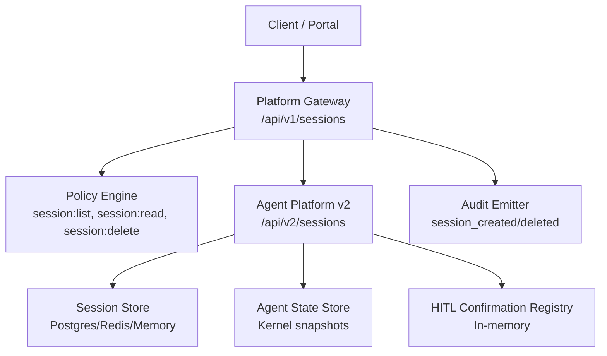
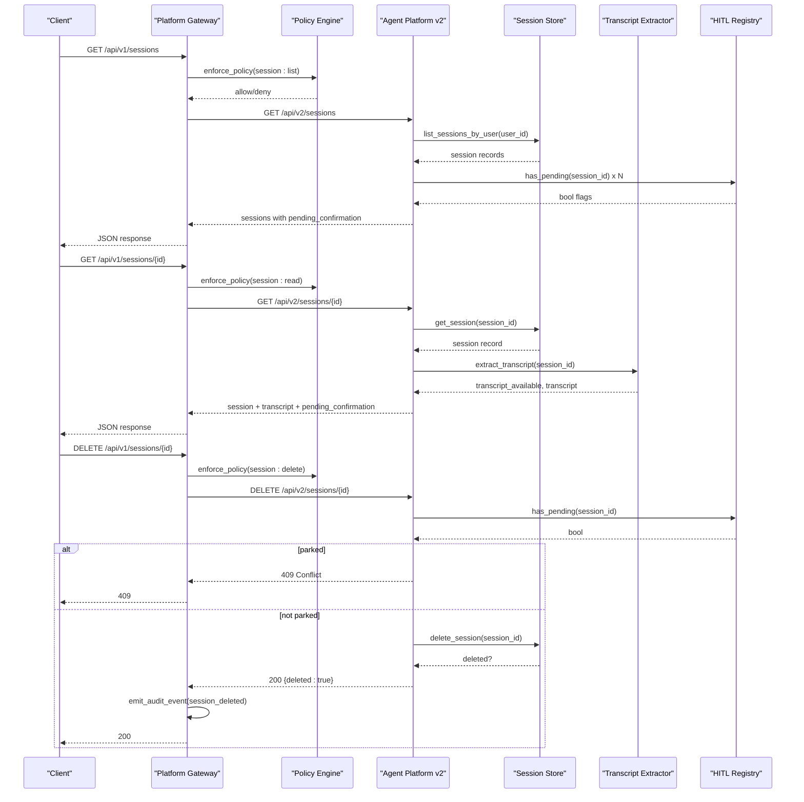
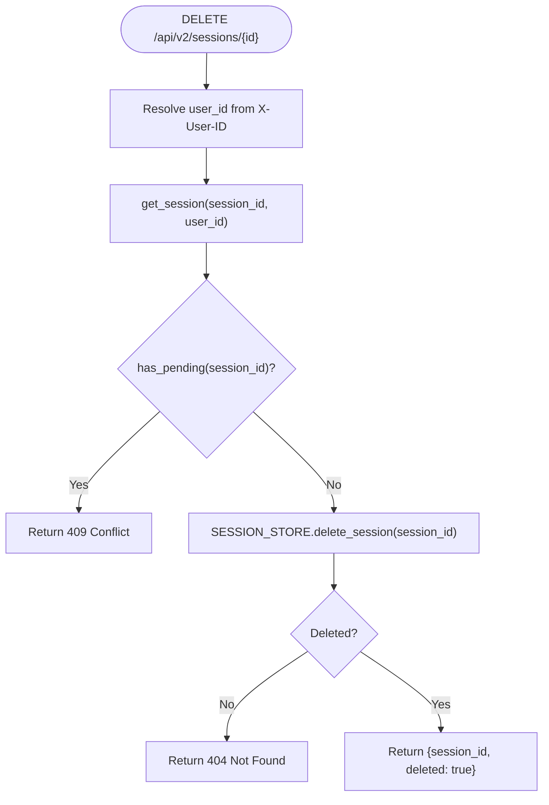
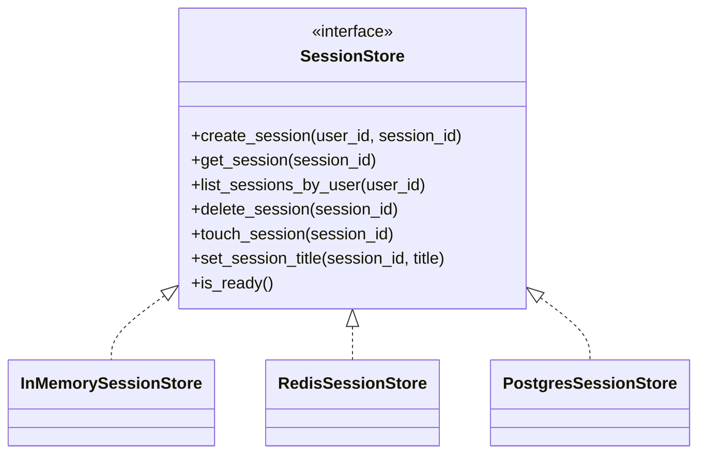
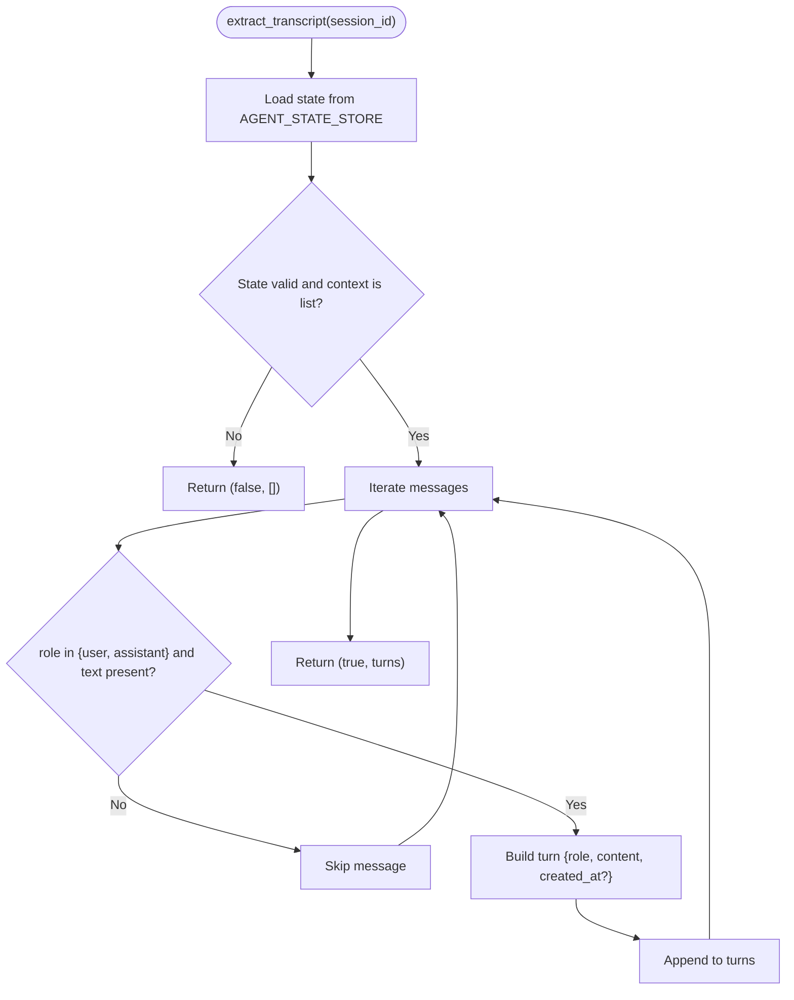
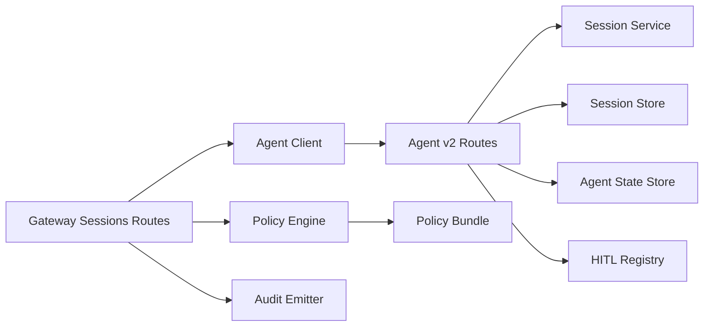

# SPEC-022: Multi-Session Operator Workspace

<cite>
**Referenced Files in This Document**
- [spec.md](file://docs/specs/SPEC-022-multi-session-operator-workspace/spec.md)
- [plan.md](file://docs/specs/SPEC-022-multi-session-operator-workspace/plan.md)
- [tasks.md](file://docs/specs/SPEC-022-multi-session-operator-workspace/tasks.md)
- [routes.py](file://products/agent-platform/src/agent_service/api/v2/routes.py)
- [session_store.py](file://products/agent-platform/src/agent_service/services/session_store.py)
- [hitl_confirmations.py](file://products/agent-platform/src/agent_service/services/hitl_confirmations.py)
- [session_transcript.py](file://products/agent-platform/src/agent_service/services/session_transcript.py)
- [v2.py](file://products/agent-platform/src/agent_service/schemas/v2.py)
- [sessions.py](file://products/platform-gateway/src/platform_gateway/api/routes/sessions.py)
- [gateway_service.py](file://products/platform-gateway/src/platform_gateway/services/gateway_service.py)
- [policy-default.yaml](file://shared/shared-contracts/policies/policy-default.yaml)
- [authorization-matrix.md](file://docs/agentic-aiops-platform/authorization-matrix.md)
- [kustomization.yaml](file://shared/platform-ops/gitops/runtime-profiles/mutating-dev/kustomization.yaml)
- [agent-chat-request.schema.json](file://shared/shared-contracts/schemas/agent-chat-request.schema.json)
</cite>

## Update Summary
**Changes Made**
- Updated to reflect delivered status of SPEC-022 with comprehensive implementation
- Enhanced session API endpoints documentation with v2 endpoints (GET/DELETE /api/v2/sessions)
- Added voice-readiness contract details with input_modality field implementation
- Documented mutating-dev kustomize profile for development environments
- Updated HITL confirmation integration and transcript reconstruction capabilities
- Revised authorization matrix with new session actions (session:list, session:delete)

## Table of Contents
1. [Introduction](#introduction)
2. [Project Structure](#project-structure)
3. [Core Components](#core-components)
4. [Architecture Overview](#architecture-overview)
5. [Detailed Component Analysis](#detailed-component-analysis)
6. [Dependency Analysis](#dependency-analysis)
7. [Performance Considerations](#performance-considerations)
8. [Troubleshooting Guide](#troubleshooting-guide)
9. [Conclusion](#conclusion)
10. [Appendices](#appendices)

## Introduction
This document specifies and explains the implementation of SPEC-022: Multi-Session Operator Workspace. The specification has been **delivered** in version 0.8.0, providing framework-agnostic foundations for a multi-session operator workspace by exposing session lifecycle operations, adding voice-readiness contract discipline, and committing an environment-scoped mutating dev profile. The portal UI is intentionally deferred to a future rebuild spec; this release focuses on durable APIs, policy enforcement, schema discipline, and deployment posture.

Key outcomes delivered:
- Session API surface under agent-platform v2 and platform-gateway proxies with deny-by-default policy actions.
- Voice-readiness contract via optional modality metadata that never changes authorization or HITL behavior.
- Environment-scoped mutating dev profile so dev deployments opt-in without changing base deny-by-default posture.
- Authorization matrix updates and documentation reflecting new session actions.

**Section sources**
- [spec.md:5-13](file://docs/specs/SPEC-022-multi-session-operator-workspace/spec.md#L5-L13)
- [spec.md:15-64](file://docs/specs/SPEC-022-multi-session-operator-workspace/spec.md#L15-L64)

## Project Structure
SPEC-022 spans multiple layers with comprehensive implementation:
- Agent-platform v2 routes expose session list, get-with-transcript, and delete endpoints with full functionality.
- Platform-gateway adds proxy routes gated by new policy actions and emits audit events.
- Shared contracts extend chat request schema with modality metadata.
- Kustomize overlays commit the mutating dev posture into dev-k8s while keeping base deny-by-default.
- Authorization matrix documents role grants for new session actions.

**Diagram sources**
- [sessions.py:29-153](file://products/platform-gateway/src/platform_gateway/api/routes/sessions.py#L29-L153)
- [routes.py:334-419](file://products/agent-platform/src/agent_service/api/v2/routes.py#L334-L419)
- [session_store.py:327-398](file://products/agent-platform/src/agent_service/services/session_store.py#L327-L398)
- [session_transcript.py:30-64](file://products/agent-platform/src/agent_service/services/session_transcript.py#L30-L64)
- [hitl_confirmations.py:93-223](file://products/agent-platform/src/agent_service/services/hitl_confirmations.py#L93-L223)
- [gateway_service.py:225-259](file://products/platform-gateway/src/platform_gateway/services/gateway_service.py#L225-L259)

**Section sources**
- [plan.md:22-64](file://docs/specs/SPEC-022-multi-session-operator-workspace/plan.md#L22-L64)
- [tasks.md:6-17](file://docs/specs/SPEC-022-multi-session-operator-workspace/tasks.md#L6-L17)

## Core Components
- Agent-platform v2 session routes: list sessions (capped, ordered), read session with transcript and pending confirmation flag, owner-only delete with parked confirmation guard.
- Session store: pluggable backends with Postgres DDL idempotent migration adding title and last_active_at columns; touch and set_title bookkeeping.
- Transcript extraction: best-effort reconstruction from kernel state snapshots; returns availability flag rather than failing.
- HITL registry: in-memory per-process registry used to badge sessions awaiting approval and block delete when parked.
- Platform-gateway proxies: enforce policy actions, log events, emit audit events for session lifecycle.
- Schema extension: optional input_modality field in chat request across gateway and agent-platform schemas.
- Mutating dev profile: committed kustomize overlay enabling mutating tools in dev only.

**Section sources**
- [routes.py:334-419](file://products/agent-platform/src/agent_service/api/v2/routes.py#L334-L419)
- [session_store.py:327-398](file://products/agent-platform/src/agent_service/services/session_store.py#L327-L398)
- [session_transcript.py:30-64](file://products/agent-platform/src/agent_service/services/session_transcript.py#L30-L64)
- [hitl_confirmations.py:93-223](file://products/agent-platform/src/agent_service/services/hitl_confirmations.py#L93-L223)
- [sessions.py:70-153](file://products/platform-gateway/src/platform_gateway/api/routes/sessions.py#L70-L153)
- [gateway_service.py:289-353](file://products/platform-gateway/src/platform_gateway/services/gateway_service.py#L289-L353)
- [v2.py:31-48](file://products/agent-platform/src/agent_service/schemas/v2.py#L31-L48)
- [agent-chat-request.schema.json:1-31](file://shared/shared-contracts/schemas/agent-chat-request.schema.json#L1-L31)
- [kustomization.yaml:1-21](file://shared/platform-ops/gitops/runtime-profiles/mutating-dev/kustomization.yaml#L1-L21)

## Architecture Overview
The multi-session workspace flows through platform-gateway into agent-platform, which coordinates session storage, kernel state, and HITL parking. Policy enforcement is centralized at the gateway using deny-by-default actions.

**Diagram sources**
- [sessions.py:70-153](file://products/platform-gateway/src/platform_gateway/api/routes/sessions.py#L70-L153)
- [gateway_service.py:225-259](file://products/platform-gateway/src/platform_gateway/services/gateway_service.py#L225-L259)
- [routes.py:354-419](file://products/agent-platform/src/agent_service/api/v2/routes.py#L354-L419)
- [session_store.py:519-561](file://products/agent-platform/src/agent_service/services/session_store.py#L519-L561)
- [session_transcript.py:30-64](file://products/agent-platform/src/agent_service/services/session_transcript.py#L30-L64)
- [hitl_confirmations.py:215-223](file://products/agent-platform/src/agent_service/services/hitl_confirmations.py#L215-L223)

## Detailed Component Analysis

### Agent-Platform v2 Session Routes
- List sessions: returns capped, most-recently-active-first list with pending confirmation badges.
- Read session: enriches with server-minted title, last active timestamp, pending confirmation flag, and best-effort transcript.
- Delete session: enforces ownership (anti-enumeration 404), blocks deletion if parked confirmation exists (409), otherwise deletes session and associated state.

**Diagram sources**
- [routes.py:398-419](file://products/agent-platform/src/agent_service/api/v2/routes.py#L398-L419)
- [hitl_confirmations.py:215-223](file://products/agent-platform/src/agent_service/services/hitl_confirmations.py#L215-L223)

**Section sources**
- [routes.py:354-419](file://products/agent-platform/src/agent_service/api/v2/routes.py#L354-L419)

### Session Store and Bookkeeping
- Postgres backend includes idempotent DDL adding title and last_active_at columns.
- Touch and set_title are fail-open bookkeeping to avoid impacting chat turns.
- Listing uses indexed queries with ordering and limit; memory/Redis backends sort client-side.

**Diagram sources**
- [session_store.py:46-73](file://products/agent-platform/src/agent_service/services/session_store.py#L46-L73)
- [session_store.py:81-169](file://products/agent-platform/src/agent_service/services/session_store.py#L81-L169)
- [session_store.py:176-319](file://products/agent-platform/src/agent_service/services/session_store.py#L176-L319)
- [session_store.py:420-611](file://products/agent-platform/src/agent_service/services/session_store.py#L420-L611)

**Section sources**
- [session_store.py:327-398](file://products/agent-platform/src/agent_service/services/session_store.py#L327-L398)
- [session_store.py:519-591](file://products/agent-platform/src/agent_service/services/session_store.py#L519-L591)

### Transcript Reconstruction
- Best-effort extraction from kernel state snapshot; returns availability flag and empty transcript on failure.
- Only user/assistant text content included; tool/evidence frames excluded from transcripts.

**Diagram sources**
- [session_transcript.py:30-64](file://products/agent-platform/src/agent_service/services/session_transcript.py#L30-L64)
- [session_transcript.py:67-82](file://products/agent-platform/src/agent_service/services/session_transcript.py#L67-L82)

**Section sources**
- [session_transcript.py:1-83](file://products/agent-platform/src/agent_service/services/session_transcript.py#L1-L83)

### HITL Confirmation Registry
- In-memory per-process registry tracks parked confirmations per session.
- Provides has_pending for workspace badging and prevents delete of parked sessions.
- Single-flight claim/expiry semantics ensure safe resume and cleanup.

**Section sources**
- [hitl_confirmations.py:93-223](file://products/agent-platform/src/agent_service/services/hitl_confirmations.py#L93-L223)

### Platform-Gateway Proxies and Policy
- New routes for list/get/delete sessions enforce policy actions and emit audit events.
- Error mapping preserves upstream 4xx and converts transport failures to 502.

**Section sources**
- [sessions.py:70-153](file://products/platform-gateway/src/platform_gateway/api/routes/sessions.py#L70-L153)
- [gateway_service.py:289-353](file://products/platform-gateway/src/platform_gateway/services/gateway_service.py#L289-L353)

### Voice-Readiness Contract
- Optional input_modality field added to chat request schemas across gateway and agent-platform.
- Modality is metadata only; no code path changes policy, auto-allow, or HITL outcomes based on it.
- Approval surface remains unchanged; voice input cannot approve or deny.

**Section sources**
- [v2.py:31-48](file://products/agent-platform/src/agent_service/schemas/v2.py#L31-L48)
- [agent-chat-request.schema.json:1-31](file://shared/shared-contracts/schemas/agent-chat-request.schema.json#L1-L31)
- [spec.md:98-120](file://docs/specs/SPEC-022-multi-session-operator-workspace/spec.md#L98-L120)

### Mutating Dev Profile
- Committed kustomize profile enables mutating tools in dev only.
- Merges environment variable into platform-runtime-config and applies pod-delete RBAC.
- Base remains deny-by-default; dev-k8s always includes the profile.

**Section sources**
- [kustomization.yaml:1-21](file://shared/platform-ops/gitops/runtime-profiles/mutating-dev/kustomization.yaml#L1-L21)

## Dependency Analysis
- Agent-platform v2 routes depend on session service, session store, agent state store, and HITL registry.
- Platform-gateway depends on policy engine, audit emitter, and agent client for proxies.
- Shared contracts define schemas validated by both services.
- Kustomize overlays compose runtime profiles and config maps for environment-specific posture.

**Diagram sources**
- [routes.py:334-419](file://products/agent-platform/src/agent_service/api/v2/routes.py#L334-L419)
- [gateway_service.py:225-259](file://products/platform-gateway/src/platform_gateway/services/gateway_service.py#L225-L259)
- [sessions.py:70-153](file://products/platform-gateway/src/platform_gateway/api/routes/sessions.py#L70-L153)
- [policy-default.yaml:19-44](file://shared/shared-contracts/policies/policy-default.yaml#L19-L44)

**Section sources**
- [policy-default.yaml:19-44](file://shared/shared-contracts/policies/policy-default.yaml#L19-L44)
- [authorization-matrix.md:329-370](file://docs/agentic-aiops-platform/authorization-matrix.md#L329-L370)

## Performance Considerations
- Session listing is capped at 50 rows and ordered by last_active_at; Postgres query uses indexes to minimize cost.
- Transcript extraction is best-effort and avoids heavy transformations; failures return quickly with availability flag.
- HITL registry is in-memory; accurate within single replica and documented as such.
- Bookkeeping (title minting, last_active_at touch) is fail-open to prevent chat latency spikes.

## Troubleshooting Guide
- Unknown or foreign session IDs return 404 to prevent enumeration; verify caller owns the session.
- Deleting a session with a parked confirmation returns 409; resolve or expire the confirmation first.
- Transcript unavailable indicates missing or corrupt kernel state snapshot; live stream evidence remains available during streaming.
- Policy denial (403) indicates missing action grant; ensure roles include session:list or session:delete where required.
- Mutating tools disabled in non-dev environments unless the mutating-dev profile is applied; check ConfigMap and RBAC.

**Section sources**
- [routes.py:398-419](file://products/agent-platform/src/agent_service/api/v2/routes.py#L398-L419)
- [session_transcript.py:30-64](file://products/agent-platform/src/agent_service/services/session_transcript.py#L30-L64)
- [gateway_service.py:225-259](file://products/platform-gateway/src/platform_gateway/services/gateway_service.py#L225-L259)
- [kustomization.yaml:1-21](file://shared/platform-ops/gitops/runtime-profiles/mutating-dev/kustomization.yaml#L1-L21)

## Conclusion
SPEC-022 has been successfully delivered in version 0.8.0, establishing durable, auditable, and policy-gated session management foundations for the operator workspace. It introduces a robust session API, voice-readiness contract discipline, and a committed mutating dev profile while deferring portal UI work to a dedicated rebuild effort. The result is a safer, more observable, and deployable foundation for multi-session workflows.

## Appendices
- Deferred portal UI requirements are preserved verbatim in the spec's Appendix A for handoff to the rebuild spec.
- Delivery tasks and version bump to 0.8.0 are tracked in the tasks file.

**Section sources**
- [spec.md:159-199](file://docs/specs/SPEC-022-multi-session-operator-workspace/spec.md#L159-L199)
- [tasks.md:40-45](file://docs/specs/SPEC-022-multi-session-operator-workspace/tasks.md#L40-L45)