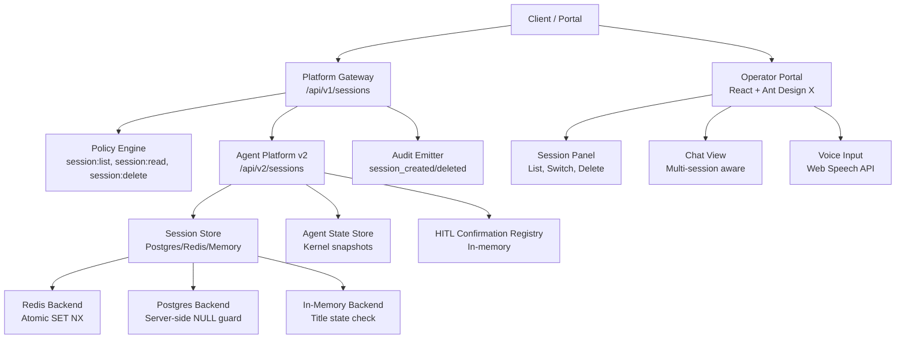
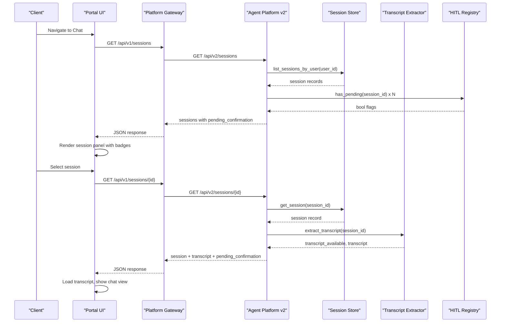
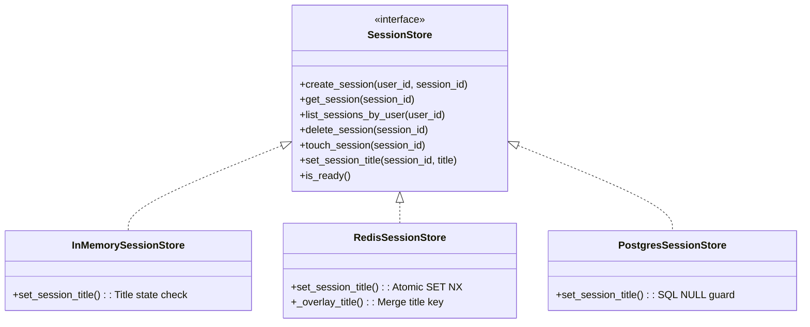
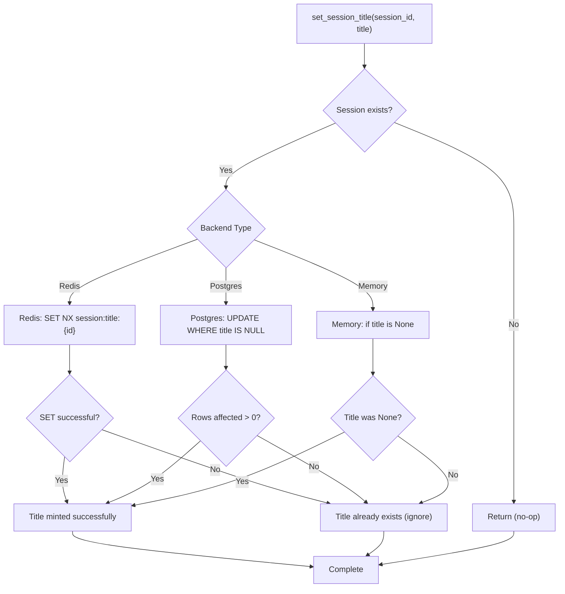
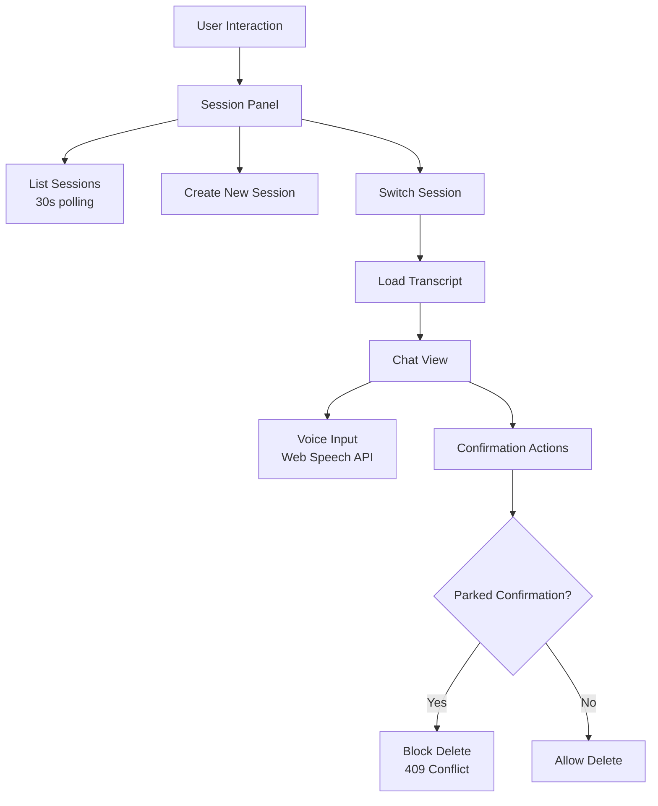
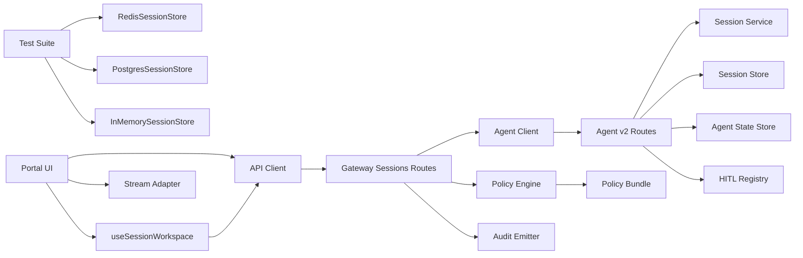

# SPEC-022: Multi-Session Operator Workspace

<cite>
**Referenced Files in This Document**
- [spec.md](file://docs/specs/SPEC-022-multi-session-operator-workspace/spec.md)
- [plan.md](file://docs/specs/SPEC-022-multi-session-operator-workspace/plan.md)
- [tasks.md](file://docs/specs/SPEC-022-multi-session-operator-workspace/tasks.md)
- [routes.py](file://products/agent-platform/src/agent_service/api/v2/routes.py)
- [session_store.py](file://products/agent-platform/src/agent_service/services/session_store.py)
- [hitl_confirmations.py](file://products/agent-platform/src/agent_service/services/hitl_confirmations.py)
- [session_transcript.py](file://products/agent-platform/src/agent_service/services/session_transcript.py)
- [v2.py](file://products/agent-platform/src/agent_service/schemas/v2.py)
- [sessions.py](file://products/platform-gateway/src/platform_gateway/api/routes/sessions.py)
- [gateway_service.py](file://products/platform-gateway/src/platform_gateway/services/gateway_service.py)
- [policy-default.yaml](file://shared/shared-contracts/policies/policy-default.yaml)
- [authorization-matrix.md](file://docs/agentic-aiops-platform/authorization-matrix.md)
- [kustomization.yaml](file://shared/platform-ops/gitops/runtime-profiles/mutating-dev/kustomization.yaml)
- [agent-chat-request.schema.json](file://shared/shared-contracts/schemas/agent-chat-request.schema.json)
- [test_redis_session_store.py](file://products/agent-platform/tests/test_redis_session_store.py)
- [test_postgres_session_store.py](file://products/agent-platform/tests/test_postgres_session_store.py)
- [useSessionWorkspace.ts](file://products/operator-portal/web-ui/app/src/sessions/useSessionWorkspace.ts)
- [ChatView.tsx](file://products/operator-portal/web-ui/app/src/chat/ChatView.tsx)
- [App.tsx](file://products/operator-portal/web-ui/app/src/App.tsx)
- [sessions.ts](file://products/operator-portal/web-ui/app/src/api/sessions.ts)
</cite>

## Update Summary
**Changes Made**
- Updated to reflect completion of multi-session workspace UI implementation through SPEC-023 portal framework rebuild
- Enhanced session API endpoints documentation with v2 endpoints (GET/DELETE /api/v2/sessions)
- Added comprehensive portal UI integration details including session panel, switching, and incident deep links
- Documented voice-readiness contract details with input_modality field implementation
- Added voice input capabilities and browser speech recognition integration
- Updated HITL confirmation integration and transcript reconstruction capabilities
- Revised authorization matrix with new session actions (session:list, session:delete)
- **Added comprehensive SPEC-022 R-1 contract requirements for set-once title semantics with atomic Redis operations and full test coverage**
- **Integrated SPEC-023 delivered status showing complete multi-session workspace UI implementation**

## Table of Contents
1. [Introduction](#introduction)
2. [Project Structure](#project-structure)
3. [Core Components](#core-components)
4. [Architecture Overview](#architecture-overview)
5. [Detailed Component Analysis](#detailed-component-analysis)
6. [Dependency Analysis](#dependency-analysis)
7. [Performance Considerations](#performance-considerations)
8. [Troubleshooting Guide](#troubleshooting-guide)
9. [Conclusion](#conclusion)
10. [Appendices](#appendices)

## Introduction
This document specifies and explains the implementation of SPEC-022: Multi-Session Operator Workspace. The specification has been **delivered** in version 0.8.0, providing framework-agnostic foundations for a multi-session operator workspace by exposing session lifecycle operations, adding voice-readiness contract discipline, and committing an environment-scoped mutating dev profile. 

**Updated**: The multi-session workspace UI has now been fully implemented through SPEC-023 (delivered in 0.9.0), completing the handoff contract preserved in Appendix A. The rebuilt portal on React + Ant Design X delivers the complete multi-session experience including session management, switching, incident deep links, and voice input capabilities.

Key outcomes delivered:
- Session API surface under agent-platform v2 and platform-gateway proxies with deny-by-default policy actions.
- Voice-readiness contract via optional modality metadata that never changes authorization or HITL behavior.
- Environment-scoped mutating dev profile so dev deployments opt-in without changing base deny-by-default posture.
- Authorization matrix updates and documentation reflecting new session actions.
- **Complete multi-session workspace UI implementation through SPEC-023 portal framework rebuild**.
- **Comprehensive SPEC-022 R-1 contract requirements for set-once title semantics with atomic Redis operations and full test coverage.**

**Section sources**
- [spec.md:5-13](file://docs/specs/SPEC-022-multi-session-operator-workspace/spec.md#L5-L13)
- [spec.md:15-64](file://docs/specs/SPEC-022-multi-session-operator-workspace/spec.md#L15-L64)

## Project Structure
SPEC-022 spans multiple layers with comprehensive implementation across backend APIs and frontend UI:
- Agent-platform v2 routes expose session list, get-with-transcript, and delete endpoints with full functionality.
- Platform-gateway adds proxy routes gated by new policy actions and emits audit events.
- Shared contracts extend chat request schema with modality metadata.
- Kustomize overlays commit the mutating dev posture into dev-k8s while keeping base deny-by-default.
- Authorization matrix documents role grants for new session actions.
- **Complete multi-session workspace UI built on React + Ant Design X with session panel, switching, and incident deep links**.
- **Voice input integration with browser speech recognition and language selection**.

**Diagram sources**
- [sessions.py:29-153](file://products/platform-gateway/src/platform_gateway/api/routes/sessions.py#L29-L153)
- [routes.py:334-419](file://products/agent-platform/src/agent_service/api/v2/routes.py#L334-L419)
- [session_store.py:176-358](file://products/agent-platform/src/agent_service/services/session_store.py#L176-L358)
- [session_store.py:458-650](file://products/agent-platform/src/agent_service/services/session_store.py#L458-L650)
- [session_transcript.py:30-64](file://products/agent-platform/src/agent_service/services/session_transcript.py#L30-L64)
- [hitl_confirmations.py:93-223](file://products/agent-platform/src/agent_service/services/hitl_confirmations.py#L93-L223)
- [gateway_service.py:225-259](file://products/platform-gateway/src/platform_gateway/services/gateway_service.py#L225-L259)
- [ChatView.tsx:363-454](file://products/operator-portal/web-ui/app/src/chat/ChatView.tsx#L363-L454)
- [useSessionWorkspace.ts:22-73](file://products/operator-portal/web-ui/app/src/sessions/useSessionWorkspace.ts#L22-L73)

**Section sources**
- [plan.md:22-64](file://docs/specs/SPEC-022-multi-session-operator-workspace/plan.md#L22-L64)
- [tasks.md:6-17](file://docs/specs/SPEC-022-multi-session-operator-workspace/tasks.md#L6-L17)

## Core Components
- Agent-platform v2 session routes: list sessions (capped, ordered), read session with transcript and pending confirmation flag, owner-only delete with parked confirmation guard.
- Session store: pluggable backends with Postgres DDL idempotent migration adding title and last_active_at columns; touch and set_title bookkeeping.
- Transcript extraction: best-effort reconstruction from kernel state snapshots; returns availability flag rather than failing.
- HITL registry: in-memory per-process registry used to badge sessions awaiting approval and block delete when parked.
- Platform-gateway proxies: enforce policy actions, log events, emit audit events for session lifecycle.
- Schema extension: optional input_modality field in chat request across gateway and agent-platform schemas.
- Mutating dev profile: committed kustomize overlay enabling mutating tools in dev only.
- **Complete multi-session workspace UI with session panel, switching, incident deep links, and voice input**.
- **SPEC-022 R-1 Contract: Atomic set-once title semantics ensuring first-turn titles are preserved across all backends with comprehensive test coverage.**

**Section sources**
- [routes.py:334-419](file://products/agent-platform/src/agent_service/api/v2/routes.py#L334-L419)
- [session_store.py:176-358](file://products/agent-platform/src/agent_service/services/session_store.py#L176-L358)
- [session_store.py:458-650](file://products/agent-platform/src/agent_service/services/session_store.py#L458-L650)
- [session_transcript.py:30-64](file://products/agent-platform/src/agent_service/services/session_transcript.py#L30-L64)
- [hitl_confirmations.py:93-223](file://products/agent-platform/src/agent_service/services/hitl_confirmations.py#L93-L223)
- [sessions.py:70-153](file://products/platform-gateway/src/platform_gateway/api/routes/sessions.py#L70-L153)
- [gateway_service.py:289-353](file://products/platform-gateway/src/platform_gateway/services/gateway_service.py#L289-L353)
- [v2.py:31-48](file://products/agent-platform/src/agent_service/schemas/v2.py#L31-L48)
- [agent-chat-request.schema.json:1-31](file://shared/shared-contracts/schemas/agent-chat-request.schema.json#L1-L31)
- [kustomization.yaml:1-21](file://shared/platform-ops/gitops/runtime-profiles/mutating-dev/kustomization.yaml#L1-L21)

## Architecture Overview
The multi-session workspace flows through platform-gateway into agent-platform, which coordinates session storage, kernel state, and HITL parking. Policy enforcement is centralized at the gateway using deny-by-default actions. The rebuilt portal provides a complete multi-session user interface.

**Diagram sources**
- [sessions.py:70-153](file://products/platform-gateway/src/platform_gateway/api/routes/sessions.py#L70-L153)
- [gateway_service.py:225-259](file://products/platform-gateway/src/platform_gateway/services/gateway_service.py#L225-L259)
- [routes.py:354-419](file://products/agent-platform/src/agent_service/api/v2/routes.py#L354-L419)
- [session_store.py:519-561](file://products/agent-platform/src/agent_service/services/session_store.py#L519-L561)
- [session_transcript.py:30-64](file://products/agent-platform/src/agent_service/services/session_transcript.py#L30-L64)
- [hitl_confirmations.py:215-223](file://products/agent-platform/src/agent_service/services/hitl_confirmations.py#L215-L223)
- [ChatView.tsx:515-555](file://products/operator-portal/web-ui/app/src/chat/ChatView.tsx#L515-L555)

## Detailed Component Analysis

### Agent-Platform v2 Session Routes
- List sessions: returns capped, most-recently-active-first list with pending confirmation badges.
- Read session: enriches with server-minted title, last active timestamp, pending confirmation flag, and best-effort transcript.
- Delete session: enforces ownership (anti-enumeration 404), blocks deletion if parked confirmation exists (409), otherwise deletes session and associated state.

**Diagram sources**
- [routes.py:398-419](file://products/agent-platform/src/agent_service/api/v2/routes.py#L398-L419)
- [hitl_confirmations.py:215-223](file://products/agent-platform/src/agent_service/services/hitl_confirmations.py#L215-L223)

**Section sources**
- [routes.py:354-419](file://products/agent-platform/src/agent_service/api/v2/routes.py#L354-L419)

### Session Store and Bookkeeping
- Postgres backend includes idempotent DDL adding title and last_active_at columns.
- Touch and set_title are fail-open bookkeeping to avoid impacting chat turns.
- Listing uses indexed queries with ordering and limit; memory/Redis backends sort client-side.
- **SPEC-022 R-1 Contract Implementation**: All backends implement atomic set-once title semantics:
  - **Redis Backend**: Uses `SET ... NX` command to atomically mint titles, preventing overwrites
  - **Postgres Backend**: Server-side SQL constraint with `title IS NULL` guard ensures single assignment
  - **In-Memory Backend**: Title state check prevents multiple assignments
  - **Test Coverage**: Comprehensive tests verify atomicity, concurrent access safety, and backend-specific behaviors

**Diagram sources**
- [session_store.py:46-73](file://products/agent-platform/src/agent_service/services/session_store.py#L46-L73)
- [session_store.py:159-163](file://products/agent-platform/src/agent_service/services/session_store.py#L159-L163)
- [session_store.py:176-358](file://products/agent-platform/src/agent_service/services/session_store.py#L176-L358)
- [session_store.py:458-650](file://products/agent-platform/src/agent_service/services/session_store.py#L458-L650)

**Section sources**
- [session_store.py:176-358](file://products/agent-platform/src/agent_service/services/session_store.py#L176-L358)
- [session_store.py:458-650](file://products/agent-platform/src/agent_service/services/session_store.py#L458-L650)

### SPEC-022 R-1 Contract: Set-Once Title Semantics
**Updated** Comprehensive implementation of atomic set-once title semantics across all backends with full test coverage.

- **Redis Implementation**: Titles stored in dedicated `session:title:{session_id}` keys with atomic `SET ... NX` command ensuring first-write-wins semantics
- **Postgres Implementation**: Server-side SQL constraint using `UPDATE ... WHERE title IS NULL` preventing concurrent title assignments
- **In-Memory Implementation**: Simple title state check preventing multiple assignments within process lifetime
- **Test Coverage**: Extensive test suite covering:
  - Atomic title minting and retrieval
  - Concurrent access safety (no double-title wins)
  - Touch operation safety (never clobbers minted titles)
  - Missing session handling (no-op behavior)
  - Cleanup on session deletion (title key removal)
  - Length counting (excludes title keys)

**Diagram sources**
- [session_store.py:320-334](file://products/agent-platform/src/agent_service/services/session_store.py#L320-L334)
- [session_store.py:614-629](file://products/agent-platform/src/agent_service/services/session_store.py#L614-L629)
- [session_store.py:159-163](file://products/agent-platform/src/agent_service/services/session_store.py#L159-L163)

**Section sources**
- [session_store.py:176-358](file://products/agent-platform/src/agent_service/services/session_store.py#L176-L358)
- [session_store.py:458-650](file://products/agent-platform/src/agent_service/services/session_store.py#L458-L650)
- [test_redis_session_store.py:114-160](file://products/agent-platform/tests/test_redis_session_store.py#L114-L160)
- [test_postgres_session_store.py:193-207](file://products/agent-platform/tests/test_postgres_session_store.py#L193-L207)

### Transcript Reconstruction
- Best-effort extraction from kernel state snapshot; returns availability flag and empty transcript on failure.
- Only user/assistant text content included; tool/evidence frames excluded from transcripts.

**Diagram sources**
- [session_transcript.py:30-64](file://products/agent-platform/src/agent_service/services/session_transcript.py#L30-L64)
- [session_transcript.py:67-82](file://products/agent-platform/src/agent_service/services/session_transcript.py#L67-L82)

**Section sources**
- [session_transcript.py:1-83](file://products/agent-platform/src/agent_service/services/session_transcript.py#L1-L83)

### HITL Confirmation Registry
- In-memory per-process registry tracks parked confirmations per session.
- Provides has_pending for workspace badging and prevents delete of parked sessions.
- Single-flight claim/expiry semantics ensure safe resume and cleanup.

**Section sources**
- [hitl_confirmations.py:93-223](file://products/agent-platform/src/agent_service/services/hitl_confirmations.py#L93-L223)

### Platform-Gateway Proxies and Policy
- New routes for list/get/delete sessions enforce policy actions and emit audit events.
- Error mapping preserves upstream 4xx and converts transport failures to 502.

**Section sources**
- [sessions.py:70-153](file://products/platform-gateway/src/platform_gateway/api/routes/sessions.py#L70-L153)
- [gateway_service.py:289-353](file://products/platform-gateway/src/platform_gateway/services/gateway_service.py#L289-L353)

### Voice-Readiness Contract
- Optional input_modality field added to chat request schemas across gateway and agent-platform.
- Modality is metadata only; no code path changes policy, auto-allow, or HITL outcomes based on it.
- Approval surface remains unchanged; voice input cannot approve or deny.

**Section sources**
- [v2.py:31-48](file://products/agent-platform/src/agent_service/schemas/v2.py#L31-L48)
- [agent-chat-request.schema.json:1-31](file://shared/shared-contracts/schemas/agent-chat-request.schema.json#L1-L31)
- [spec.md:98-120](file://docs/specs/SPEC-022-multi-session-operator-workspace/spec.md#L98-L120)

### Mutating Dev Profile
- Committed kustomize profile enables mutating tools in dev only.
- Merges environment variable into platform-runtime-config and applies pod-delete RBAC.
- Base remains deny-by-default; dev-k8s always includes the profile.

**Section sources**
- [kustomization.yaml:1-21](file://shared/platform-ops/gitops/runtime-profiles/mutating-dev/kustomization.yaml#L1-L21)

### Multi-Session Workspace UI (SPEC-023 Integration)
**New** Complete multi-session workspace UI implementation delivered through SPEC-023 portal framework rebuild.

- **Session Panel**: Displays operator's sessions with titles, relative last-active time, and amber "awaiting approval" badges for pending confirmations
- **Switch/Resume**: Seamless session switching with transcript loading, stream repointing, and per-tab active session persistence
- **Incident Deep Links**: Incident sessions appear as pinned entries in the session panel, opening alongside existing sessions
- **Voice Input**: Browser-based speech recognition with language selection (en-US, zh-CN minimum), sending `input_modality: "voice"` 
- **Delete Operations**: In-UI confirmation dialogs with proper 409 handling for parked confirmations and neutral 404 responses
- **Polling**: 30-second polling interval with lifecycle event refreshes for real-time session status updates

**Diagram sources**
- [ChatView.tsx:363-454](file://products/operator-portal/web-ui/app/src/chat/ChatView.tsx#L363-L454)
- [useSessionWorkspace.ts:49-73](file://products/operator-portal/web-ui/app/src/sessions/useSessionWorkspace.ts#L49-L73)
- [ChatView.tsx:585-601](file://products/operator-portal/web-ui/app/src/chat/ChatView.tsx#L585-L601)

**Section sources**
- [ChatView.tsx:363-454](file://products/operator-portal/web-ui/app/src/chat/ChatView.tsx#L363-L454)
- [useSessionWorkspace.ts:22-73](file://products/operator-portal/web-ui/app/src/sessions/useSessionWorkspace.ts#L22-L73)
- [App.tsx:219-228](file://products/operator-portal/web-ui/app/src/App.tsx#L219-L228)

## Dependency Analysis
- Agent-platform v2 routes depend on session service, session store, agent state store, and HITL registry.
- Platform-gateway depends on policy engine, audit emitter, and agent client for proxies.
- Shared contracts define schemas validated by both services.
- Kustomize overlays compose runtime profiles and config maps for environment-specific posture.
- **Portal UI depends on session workspace hook, API clients, and stream adapter**.
- **Test dependencies include fakeredis for Redis backend testing and mock database connections for Postgres testing**.

**Diagram sources**
- [routes.py:334-419](file://products/agent-platform/src/agent_service/api/v2/routes.py#L334-L419)
- [gateway_service.py:225-259](file://products/platform-gateway/src/platform_gateway/services/gateway_service.py#L225-L259)
- [sessions.py:70-153](file://products/platform-gateway/src/platform_gateway/api/routes/sessions.py#L70-L153)
- [policy-default.yaml:19-44](file://shared/shared-contracts/policies/policy-default.yaml#L19-L44)
- [test_redis_session_store.py:1-274](file://products/agent-platform/tests/test_redis_session_store.py#L1-L274)
- [test_postgres_session_store.py:1-327](file://products/agent-platform/tests/test_postgres_session_store.py#L1-L327)
- [useSessionWorkspace.ts:49-73](file://products/operator-portal/web-ui/app/src/sessions/useSessionWorkspace.ts#L49-L73)

**Section sources**
- [policy-default.yaml:19-44](file://shared/shared-contracts/policies/policy-default.yaml#L19-L44)
- [authorization-matrix.md:329-370](file://docs/agentic-aiops-platform/authorization-matrix.md#L329-L370)

## Performance Considerations
- Session listing is capped at 50 rows and ordered by last_active_at; Postgres query uses indexes to minimize cost.
- Transcript extraction is best-effort and avoids heavy transformations; failures return quickly with availability flag.
- HITL registry is in-memory; accurate within single replica and documented as such.
- Bookkeeping (title minting, last_active_at touch) is fail-open to prevent chat latency spikes.
- **SPEC-022 R-1 Contract Performance**: Atomic title operations are optimized:
  - Redis: Single `SET NX` operation with TTL management
  - Postgres: Server-side constraint evaluation minimizes application logic
  - In-Memory: Simple dictionary lookup for title state
  - All operations are O(1) and non-blocking
- **Portal UI Performance**: 30-second polling with lifecycle event refreshes, per-session turn caches, and efficient session panel rendering

## Troubleshooting Guide
- Unknown or foreign session IDs return 404 to prevent enumeration; verify caller owns the session.
- Deleting a session with a parked confirmation returns 409; resolve or expire the confirmation first.
- Transcript unavailable indicates missing or corrupt kernel state snapshot; live stream evidence remains available during streaming.
- Policy denial (403) indicates missing action grant; ensure roles include session:list or session:delete where required.
- Mutating tools disabled in non-dev environments unless the mutating-dev profile is applied; check ConfigMap and RBAC.
- **SPEC-022 R-1 Contract Issues**: 
  - Title not appearing: Verify session exists before setting title; check backend connectivity
  - Multiple title attempts: First-write-wins semantics apply; subsequent attempts are ignored
  - Title persistence: Ensure proper TTL configuration and backend health monitoring
- **Portal UI Issues**:
  - Session panel not updating: Check network connectivity and 30-second polling interval
  - Voice input unavailable: Verify browser supports Web Speech API; check permissions
  - Session switching issues: Clear browser cache and verify session ID persistence

**Section sources**
- [routes.py:398-419](file://products/agent-platform/src/agent_service/api/v2/routes.py#L398-L419)
- [session_transcript.py:30-64](file://products/agent-platform/src/agent_service/services/session_transcript.py#L30-L64)
- [gateway_service.py:225-259](file://products/platform-gateway/src/platform_gateway/services/gateway_service.py#L225-L259)
- [kustomization.yaml:1-21](file://shared/platform-ops/gitops/runtime-profiles/mutating-dev/kustomization.yaml#L1-L21)

## Conclusion
SPEC-022 has been successfully delivered in version 0.8.0, establishing durable, auditable, and policy-gated session management foundations for the operator workspace. It introduces a robust session API, voice-readiness contract discipline, and a committed mutating dev profile while deferring portal UI work to a dedicated rebuild effort.

**Enhanced with SPEC-023 Integration**: The multi-session workspace UI has now been fully implemented through SPEC-023 (delivered in 0.9.0), completing the handoff contract preserved in Appendix A. The rebuilt portal on React + Ant Design X delivers the complete multi-session experience including session management, switching, incident deep links, and voice input capabilities. The result is a safer, more observable, and deployable foundation for multi-session workflows with a polished user interface.

**Enhanced with SPEC-022 R-1 Contract Requirements**: The implementation includes comprehensive atomic set-once title semantics across all backends (Redis, Postgres, In-Memory) with extensive test coverage ensuring data integrity and concurrent access safety. This provides a solid foundation for session identification and organization in multi-user environments.

## Appendices
- Deferred portal UI requirements are preserved verbatim in the spec's Appendix A for handoff to the rebuild spec.
- Delivery tasks and version bump to 0.8.0 are tracked in the tasks file.
- **SPEC-022 R-1 Contract Test Coverage**: Comprehensive test suite validates atomic title semantics, concurrent access safety, and backend-specific behaviors across Redis, Postgres, and In-Memory implementations.
- **SPEC-023 Completion**: The multi-session workspace UI has been fully implemented and delivered, satisfying all requirements from Appendix A with additional voice input capabilities and incident deep link support.

**Section sources**
- [spec.md:159-199](file://docs/specs/SPEC-022-multi-session-operator-workspace/spec.md#L159-L199)
- [tasks.md:40-45](file://docs/specs/SPEC-022-multi-session-operator-workspace/tasks.md#L40-L45)
- [test_redis_session_store.py:114-160](file://products/agent-platform/tests/test_redis_session_store.py#L114-L160)
- [test_postgres_session_store.py:193-207](file://products/agent-platform/tests/test_postgres_session_store.py#L193-L207)