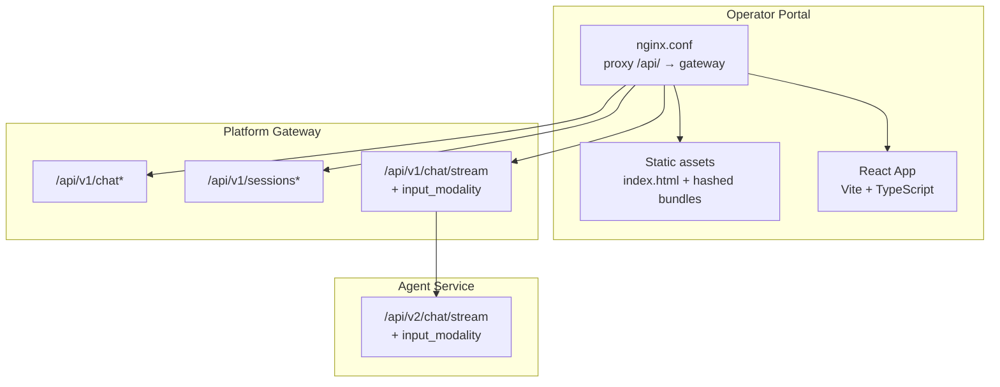
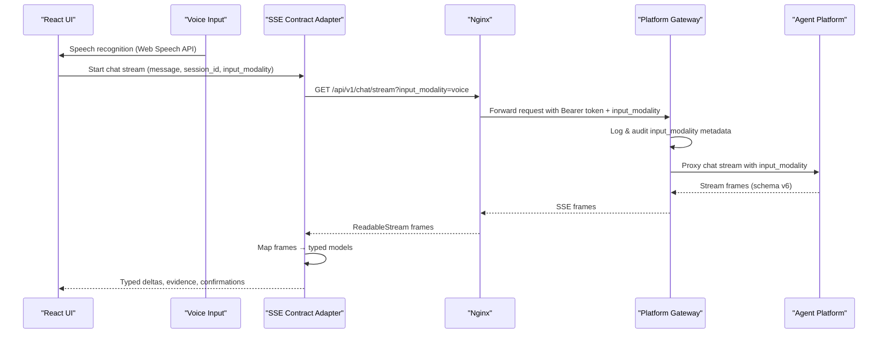
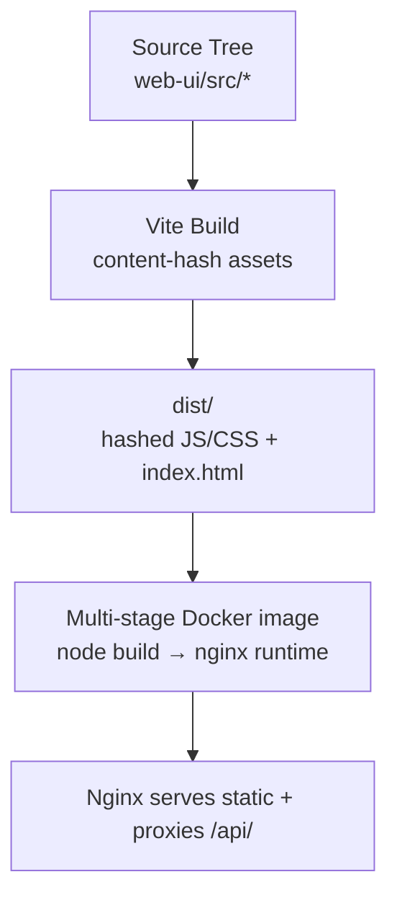
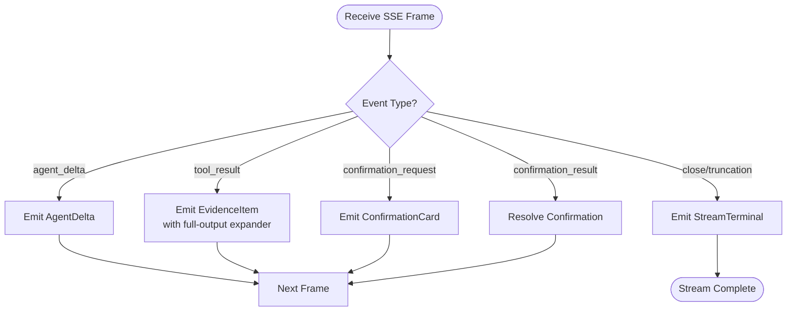
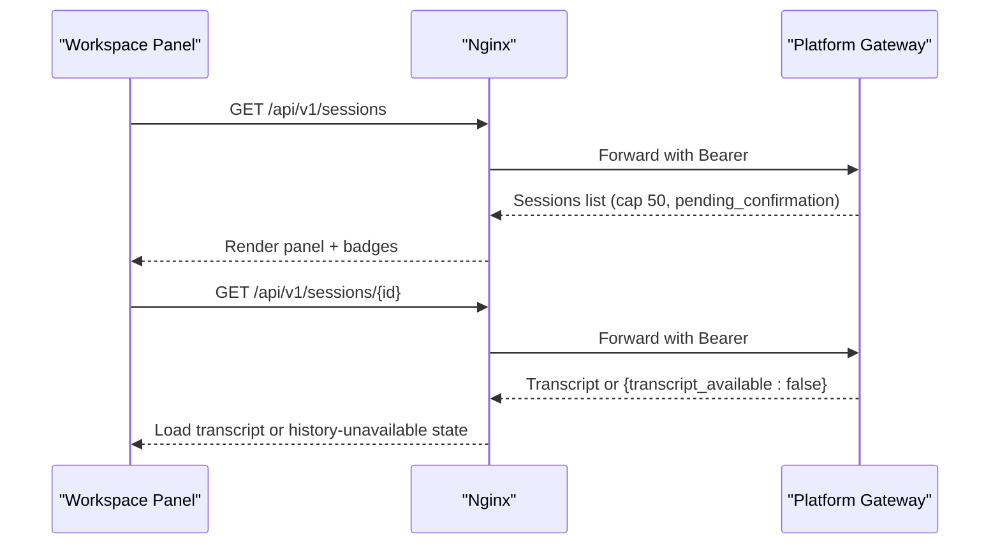
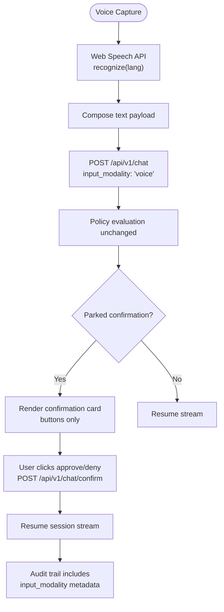
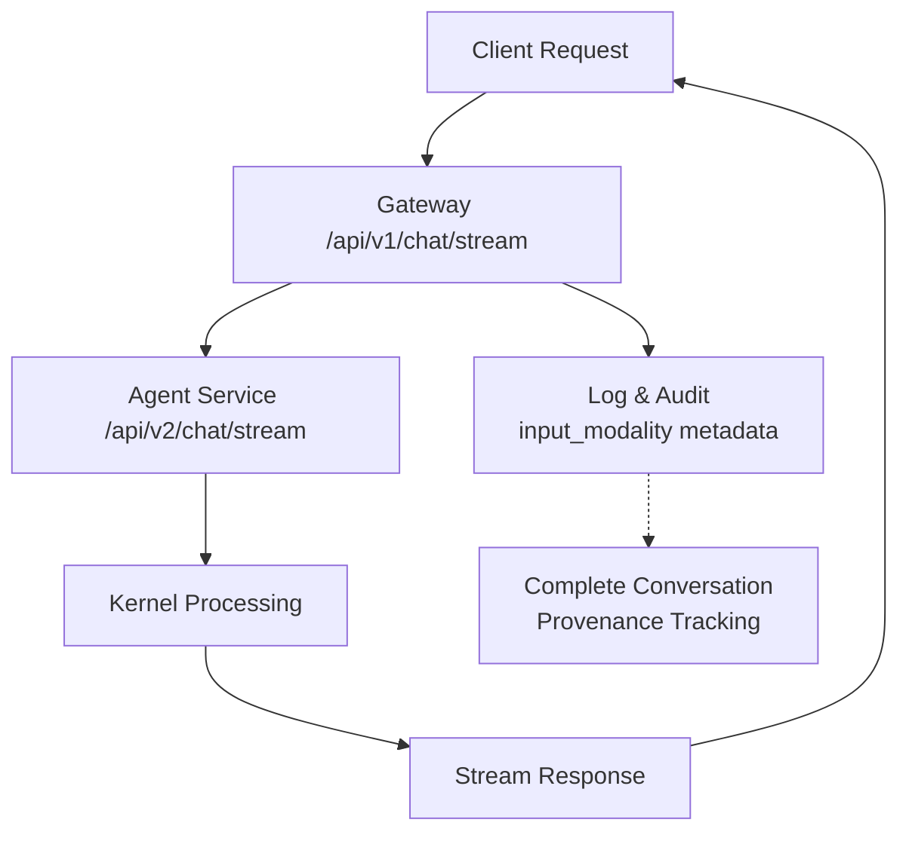
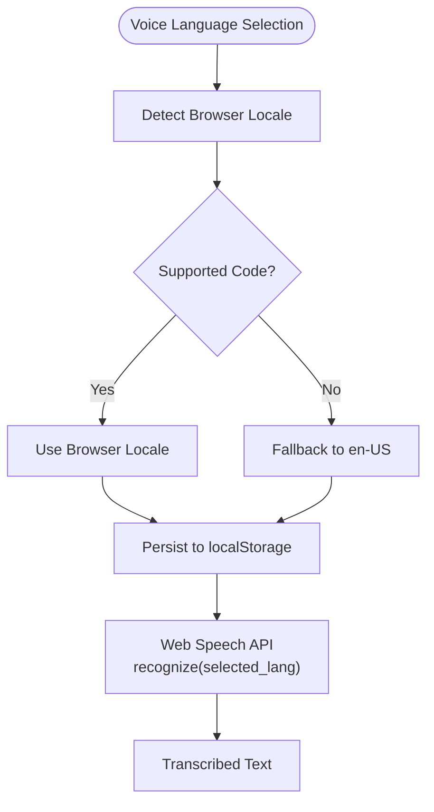
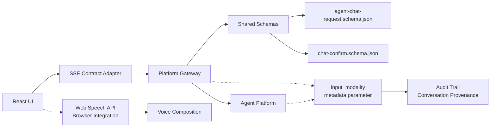

# SPEC-023: Portal Framework Rebuild Specification

<cite>
**Referenced Files in This Document**
- [spec.md](file://docs/specs/SPEC-023-portal-framework-rebuild/spec.md)
- [plan.md](file://docs/specs/SPEC-023-portal-framework-rebuild/plan.md)
- [tasks.md](file://docs/specs/SPEC-023-portal-framework-rebuild/tasks.md)
- [spike.md](file://docs/workspace/portal-framework-rebuild-spike.md)
- [Dockerfile](file://products/operator-portal/Dockerfile)
- [nginx.conf](file://products/operator-portal/nginx.conf)
- [transport.ts](file://products/operator-portal/web-ui/app/src/stream/transport.ts)
- [decoder.ts](file://products/operator-portal/web-ui/app/src/stream/decoder.ts)
- [useChatStream.ts](file://products/operator-portal/web-ui/app/src/stream/useChatStream.ts)
- [useSessionWorkspace.ts](file://products/operator-portal/web-ui/app/src/sessions/useSessionWorkspace.ts)
- [ChatView.tsx](file://products/operator-portal/web-ui/app/src/chat/ChatView.tsx)
- [languages.ts](file://products/operator-portal/web-ui/app/src/voice/languages.ts)
- [useSpeechRecognition.ts](file://products/operator-portal/web-ui/app/src/voice/useSpeechRecognition.ts)
- [chat.py](file://products/platform-gateway/src/platform_gateway/api/routes/chat.py)
- [routes.py](file://products/agent-platform/src/agent_service/api/v2/routes.py)
- [transport.test.ts](file://products/operator-portal/web-ui/app/src/stream/__tests__/transport.test.ts)
- [decoder.test.ts](file://products/operator-portal/web-ui/app/src/stream/__tests__/decoder.test.ts)
- [languages.test.ts](file://products/operator-portal/web-ui/app/src/voice/__tests__/languages.test.ts)
</cite>

## Update Summary
**Changes Made**
- Updated implementation status to reflect completion of all four stages (R-1 through R-4): foundation build system, SSE adapter, multi-session workspace, and voice input capabilities
- Enhanced architecture diagrams to show complete streaming infrastructure with voice-readiness parity across all endpoints
- Added comprehensive test coverage documentation for all implemented components including voice language resolution
- Updated component analysis sections to reflect production-ready streaming infrastructure with full voice support
- Revised troubleshooting guide with specific guidance for the completed four-stage rollout including voice-modality validation

## Table of Contents
1. [Introduction](#introduction)
2. [Project Structure](#project-structure)
3. [Core Components](#core-components)
4. [Architecture Overview](#architecture-overview)
5. [Detailed Component Analysis](#detailed-component-analysis)
6. [Dependency Analysis](#dependency-analysis)
7. [Performance Considerations](#performance-considerments)
8. [Troubleshooting Guide](#troubleshooting-guide)
9. [Conclusion](#conclusion)
10. [Appendices](#appendices)

## Introduction
SPEC-023 rebuilds the operator portal as a React + TypeScript application built with Vite and styled via Ant Design X, while preserving the existing nginx-static serving model and all backend contracts. The rebuild delivers the multi-session workspace UI defined by SPEC-022 Appendix A, adds voice input as a composition surface, migrates existing views (Chat, Control, Workspace), and enforces Invariant II that human-in-the-loop approvals remain click-gated. No backend, policy, or audit behavior changes are introduced; this is a presentation-layer rebuild with a platform-owned SSE contract adapter isolating wire protocol knowledge.

**Updated** All four stages of progressive rollout are now complete: Stage 1 (Portal Foundation) provides the build toolchain and theme system, Stage 2 (Platform-Owned SSE Contract Adapter) delivers transport and frame decoding with full test coverage, Stage 3 (Session Workspace UI) implements the complete multi-session management interface with streaming infrastructure, and Stage 4 (Voice Input) provides speech recognition with graceful degradation and consistent `input_modality` parameter propagation across all chat endpoints.

## Project Structure
The portal currently ships as vanilla HTML/CSS/JS served by nginx. SPEC-023 introduces a new web-ui source tree under `products/operator-portal/web-ui/` with a multi-stage Docker build that produces content-hashed static assets. Nginx continues to proxy `/api/` to the platform gateway and serve SPA fallback through `try_files`.

**Diagram sources**
- [nginx.conf:8-17](file://products/operator-portal/nginx.conf#L8-L17)
- [Dockerfile:13-31](file://products/operator-portal/Dockerfile#L13-L31)
- [chat.py:90-143](file://products/platform-gateway/src/platform_gateway/api/routes/chat.py#L90-L143)
- [routes.py:135-165](file://products/agent-platform/src/agent_service/api/v2/routes.py#L135-L165)

**Section sources**
- [Dockerfile:1-29](file://products/operator-portal/Dockerfile#L1-L29)
- [nginx.conf:1-32](file://products/operator-portal/nginx.conf#L1-L32)
- [plan.md:19-34](file://docs/specs/SPEC-023-portal-framework-rebuild/plan.md#L19-L34)

## Core Components
- **Stage 1 - Portal Foundation**: Complete build toolchain with Vite, React 18, TypeScript, and Ant Design X theming system
- **Stage 2 - Platform-Owned SSE Contract Adapter**: Single module owning transport (`fetch` + `ReadableStream`) and frame-to-model mapping for schema v6 events with comprehensive test coverage
- **Stage 3 - Session Workspace UI**: Multi-session workspace panel with title, last-active time, pending-confirmation badge support, switch/resume functionality, and incident deep links
- **Stage 4 - Voice Input**: Speech recognition using Web Speech API with language selection, graceful degradation, and consistent `input_modality: "voice"` parameter propagation
- View migration: Chat, Control (audit, permissions, tools, skills), and Workspace (incidents) migrated with role-scoped visibility preserved

**Updated** All four stages are now production-ready with full test coverage and complete streaming infrastructure supporting voice-readiness parity across both POST and streaming chat endpoints.

Acceptance criteria and detailed behaviors are specified per requirement in the spec and plan documents.

**Section sources**
- [spec.md:57-182](file://docs/specs/SPEC-023-portal-framework-rebuild/spec.md#L57-L182)
- [plan.md:36-90](file://docs/specs/SPEC-023-portal-framework-rebuild/plan.md#L36-L90)
- [tasks.md:5-43](file://docs/specs/SPEC-023-portal-framework-rebuild/tasks.md#L5-L43)

## Architecture Overview
The rebuild keeps the same runtime deployment shape: nginx serves static assets and proxies API calls to the platform gateway. The key architectural change is a thin adapter layer between the React UI and the gateway's streaming endpoints, insulating components from stream schema details.

**Updated** The four-stage progressive rollout is now complete, providing a robust streaming infrastructure with consistent `input_modality` parameter propagation across the entire request chain, from gateway streaming endpoint to agent service, with full voice input support.

**Diagram sources**
- [chat.py:90-143](file://products/platform-gateway/src/platform_gateway/api/routes/chat.py#L90-L143)
- [routes.py:135-165](file://products/agent-platform/src/agent_service/api/v2/routes.py#L135-L165)
- [nginx.conf:8-17](file://products/operator-portal/nginx.conf#L8-L17)
- [spike.md:93-113](file://docs/workspace/portal-framework-rebuild-spike.md#L93-L113)

## Detailed Component Analysis

### Stage 1: Portal Foundation and Build Toolchain
**Completed** The foundation stage provides the complete build infrastructure including Vite + React 18 + TypeScript setup, multi-stage Docker build process, and Ant Design X theming system.

- **Build System**: Vite builds React + TypeScript into content-hashed assets under `dist/`; Dockerfile gains a Node build stage and retains nginx runtime
- **Theme System**: Dark theme rebuilt from current `:root` CSS custom properties into Ant Design design tokens (`XProvider` theme), preserving slate palette and layout language
- **Version Management**: `PLATFORM_VERSION` injected at build time from root `VERSION`; validator updated to assert it at its new home
- **Serving Strategy**: Nginx serves `index.html` with `no-store` and may cache hashed assets immutably; SPA fallback remains via `try_files`

**Diagram sources**
- [plan.md:19-34](file://docs/specs/SPEC-023-portal-framework-rebuild/plan.md#L19-L34)
- [Dockerfile:13-31](file://products/operator-portal/Dockerfile#L13-L31)
- [nginx.conf:19-41](file://products/operator-portal/nginx.conf#L19-L41)

**Section sources**
- [plan.md:19-34](file://docs/specs/SPEC-023-portal-framework-rebuild/plan.md#L19-L34)
- [spec.md:57-81](file://docs/specs/SPEC-023-portal-framework-rebuild/spec.md#L57-L81)
- [tasks.md:5-12](file://docs/specs/SPEC-023-portal-framework-rebuild/tasks.md#L5-L12)

### Stage 2: Platform-Owned SSE Contract Adapter
**Completed** The adapter stage delivers a complete streaming infrastructure with transport, decoder, and comprehensive test coverage.

- **Transport Layer**: `transport.ts` wraps `fetch` with `response.body.getReader()` and an abort controller to support switching sessions mid-stream
- **Frame Decoder**: `decoder.ts` parses SSE frames and maps event types to typed models (agent deltas, evidence items, confirmation cards, terminal states)
- **Hook Interface**: `useChatStream.ts` exposes typed models to views with session management and turn caching
- **Test Coverage**: Comprehensive unit tests covering every schema v6 event type, truncation behavior, and modality parameter handling

**Diagram sources**
- [plan.md:36-50](file://docs/specs/SPEC-023-portal-framework-rebuild/plan.md#L36-L50)
- [spec.md:83-107](file://docs/specs/SPEC-023-portal-framework-rebuild/spec.md#L83-L107)

**Section sources**
- [plan.md:36-50](file://docs/specs/SPEC-023-portal-framework-rebuild/plan.md#L36-L50)
- [spec.md:83-107](file://docs/specs/SPEC-023-portal-framework-rebuild/spec.md#L83-L107)
- [tasks.md:14-19](file://docs/specs/SPEC-023-portal-framework-rebuild/tasks.md#L14-L19)

### Stage 3: Session Workspace UI
**Completed** The workspace stage implements the complete multi-session management interface with all required features.

- **Session Panel**: Lists sessions via `GET /api/v1/sessions`, capped at 50, showing title, relative last-active time, and amber badge when `pending_confirmation` is true
- **Switch/Resume**: Loads transcript via `GET /api/v1/sessions/{id}` (or explicit history-unavailable state), repoints active stream and confirm endpoints, persists active session id per tab, and closes previous streams
- **New/Delete Operations**: New session uses existing create path; delete requires in-UI confirmation and returns 409 for parked confirmations; 404 responses do not reveal ownership
- **Incident Deep Links**: Opens additional sessions in the panel rather than replacing the active one

**Diagram sources**
- [useSessionWorkspace.ts:59-86](file://products/operator-portal/web-ui/app/src/sessions/useSessionWorkspace.ts#L59-L86)
- [ChatView.tsx:473-515](file://products/operator-portal/web-ui/app/src/chat/ChatView.tsx#L473-L515)

**Section sources**
- [spec.md:108-135](file://docs/specs/SPEC-023-portal-framework-rebuild/spec.md#L108-L135)
- [plan.md:52-64](file://docs/specs/SPEC-023-portal-framework-rebuild/plan.md#L52-L64)
- [tasks.md:21-27](file://docs/specs/SPEC-023-portal-framework-rebuild/tasks.md#L21-L27)

### Stage 4: Voice Input and Invariant II
**Completed** Voice input implementation provides speech recognition with graceful degradation and maintains security invariants.

- **Speech Recognition**: Composer integrates Ant Design X Sender speech input; voice turns send `input_modality: "voice"` while text turns default to `text`
- **Language Selection**: Offers supported locales (minimum `en-US` and `zh-CN`), defaults to browser locale when available, falls back to `en-US`, and persists locally
- **Security Guarantee**: Invariant II enforced - no voice-driven path can approve or deny; confirmation decisions remain button-only on confirmation cards
- **Graceful Degradation**: Detects Web Speech API availability; hides/disables affordance when unsupported

**Diagram sources**
- [spec.md:137-159](file://docs/specs/SPEC-023-portal-framework-rebuild/spec.md#L137-L159)

**Section sources**
- [spec.md:137-159](file://docs/specs/SPEC-023-portal-framework-rebuild/spec.md#L137-L159)
- [plan.md:66-79](file://docs/specs/SPEC-023-portal-framework-rebuild/plan.md#L66-L79)
- [tasks.md:29-34](file://docs/specs/SPEC-023-portal-framework-rebuild/tasks.md#L29-L34)

### Voice-Readiness Parity Implementation
**Completed** R-4 implementation provides consistent voice-readiness support across both POST and streaming chat endpoints through the `input_modality` parameter.

- **Gateway Streaming Endpoint**: `GET /api/v1/chat/stream` accepts `input_modality` query parameter (`text`|`voice`, default `text`) mirroring POST `/api/v1/chat`'s body field
- **Agent Service Streaming Endpoint**: `GET /api/v2/chat/stream` accepts `input_modality` query parameter with identical semantics
- **Metadata-Only Semantics**: Modality is recorded on audit/log surfaces but never changes policy, auto-allow, or HITL outcomes
- **Audit Trail Generation**: Both `chat_started` and `chat_completed` events include `input_modality` in their details for complete conversation provenance

**Diagram sources**
- [chat.py:90-143](file://products/platform-gateway/src/platform_gateway/api/routes/chat.py#L90-L143)
- [routes.py:135-165](file://products/agent-platform/src/agent_service/api/v2/routes.py#L135-L165)

**Section sources**
- [chat.py:90-143](file://products/platform-gateway/src/platform_gateway/api/routes/chat.py#L90-L143)
- [routes.py:135-165](file://products/agent-platform/src/agent_service/api/v2/routes.py#L135-L165)
- [transport.ts:31-49](file://products/operator-portal/web-ui/app/src/stream/transport.ts#L31-L49)
- [transport.test.ts:40-47](file://products/operator-portal/web-ui/app/src/stream/__tests__/transport.test.ts#L40-L47)

### Build Toolchain and Serving
**Completed** The build system provides content-hashed assets with immutable caching and proper SPA fallback handling.

- **Vite Build**: Builds React + TypeScript into content-hashed assets under `dist/`; Dockerfile gains a Node build stage and retains nginx runtime
- **Cache Strategy**: Nginx serves `index.html` with `no-store` and may cache hashed assets immutably; SPA fallback remains via `try_files`
- **Version Injection**: `PLATFORM_VERSION` injected at build time from root `VERSION`; validator updated to assert it at its new home

**Diagram sources**
- [plan.md:19-34](file://docs/specs/SPEC-023-portal-framework-rebuild/plan.md#L19-L34)
- [Dockerfile:13-31](file://products/operator-portal/Dockerfile#L13-L31)
- [nginx.conf:19-41](file://products/operator-portal/nginx.conf#L19-L41)

**Section sources**
- [plan.md:19-34](file://docs/specs/SPEC-023-portal-framework-rebuild/plan.md#L19-L34)
- [spec.md:57-81](file://docs/specs/SPEC-023-portal-framework-rebuild/spec.md#L57-L81)
- [tasks.md:5-12](file://docs/specs/SPEC-023-portal-framework-rebuild/tasks.md#L5-L12)

### View Migration and Role-Scoped Visibility
**Completed** All existing portal views have been migrated with parity to current functionality and role-scoped visibility preserved.

- **View Migration**: Chat, Control (audit, permissions, tools, skills), and Workspace (incidents) views migrated with parity to current functionality
- **Navigation**: Sectioned navigation auto-hides based on token roles and policy matrix; audit view remains auditor/platform-admin only
- **Authentication**: Keycloak OIDC login/logout, token refresh, and per-request `Bearer` behavior are unchanged

**Section sources**
- [spec.md:161-182](file://docs/specs/SPEC-023-portal-framework-rebuild/spec.md#L161-L182)
- [plan.md:81-90](file://docs/specs/SPEC-023-portal-framework-rebuild/plan.md#L81-L90)
- [tasks.md:36-43](file://docs/specs/SPEC-023-portal-framework-rebuild/tasks.md#L36-L43)

### Voice Language Resolution and Recognition
**Completed** Voice language selection provides explicit operator choice with browser locale detection and persistent storage.

- **Language Selector**: Supports minimum English (`en-US`) and Mandarin (`zh-CN`) with constant-driven configuration
- **Browser Integration**: Defaults to browser locale when available, falls back to `en-US`, persists selection in localStorage
- **Recognition Wrapper**: Web Speech API wrapper with graceful error handling and capability detection
- **Security Isolation**: Language selection affects only client-side recognition, never sent to backend or audit trail

**Diagram sources**
- [languages.ts:23-41](file://products/operator-portal/web-ui/app/src/voice/languages.ts#L23-L41)
- [useSpeechRecognition.ts:81-123](file://products/operator-portal/web-ui/app/src/voice/useSpeechRecognition.ts#L81-L123)

**Section sources**
- [languages.ts:1-60](file://products/operator-portal/web-ui/app/src/voice/languages.ts#L1-L60)
- [useSpeechRecognition.ts:1-135](file://products/operator-portal/web-ui/app/src/voice/useSpeechRecognition.ts#L1-L135)
- [ChatView.tsx:487-511](file://products/operator-portal/web-ui/app/src/chat/ChatView.tsx#L487-L511)

## Dependency Analysis
The rebuild depends on existing gateway endpoints and shared contracts without introducing new backend dependencies.

**Updated** The four-stage implementation extends dependencies to include consistent `input_modality` parameter handling across platform gateway and agent service streaming endpoints, plus Web Speech API integration for voice input.

**Diagram sources**
- [transport.ts:31-49](file://products/operator-portal/web-ui/app/src/stream/transport.ts#L31-L49)
- [chat.py:90-143](file://products/platform-gateway/src/platform_gateway/api/routes/chat.py#L90-L143)
- [routes.py:135-165](file://products/agent-platform/src/agent_service/api/v2/routes.py#L135-L165)
- [useSpeechRecognition.ts:38-46](file://products/operator-portal/web-ui/app/src/voice/useSpeechRecognition.ts#L38-L46)

**Section sources**
- [spec.md:210-218](file://docs/specs/SPEC-023-portal-framework-rebuild/spec.md#L210-L218)
- [plan.md:97-108](file://docs/specs/SPEC-023-portal-framework-rebuild/plan.md#L97-L108)

## Performance Considerations
- **Session Panel Polling**: Refresh at most every 30 seconds plus lifecycle-triggered refresh; cap-50 list does not require virtualization
- **Streaming Performance**: Use `fetch` + `ReadableStream` with abort controllers to avoid memory leaks during session switches
- **Asset Caching**: Content-hashed assets enable immutable caching; `index.html` remains `no-store` to ensure fresh shell load
- **Bundle Optimization**: Route-level code splitting mitigates heavier dependency tree from React + antd/Ant Design X
- **Voice Recognition**: Web Speech API runs entirely client-side with no network overhead; graceful degradation when unsupported

**Updated** The four-stage implementation maintains performance characteristics while adding minimal overhead for `input_modality` parameter processing, audit trail generation, and client-side speech recognition.

[No sources needed since this section provides general guidance]

## Troubleshooting Guide
- **Stream Framing Issues**: Verify adapter mapping against fixture frames for every schema v6 event type; check terminal state handling on stream close/truncation
- **Confirmation Anchoring**: Ensure confirmation cards remain bound to their parking session; confirm that approve/deny resumes the correct session stream
- **Voice Input Degradation**: Detect Web Speech API availability; hide/disable affordance when unsupported; validate language selector defaults and persistence
- **Version Mismatch**: Ensure `PLATFORM_VERSION` injection matches root `VERSION`; run `make validate-version` to assert constant location

**Updated** Voice-modality troubleshooting for the completed four-stage rollout:
- **Modality Validation Errors**: Check that `input_modality` parameter values are restricted to `text` or `voice`; invalid values return 422 status codes
- **Audit Trail Gaps**: Verify that `chat_started` and `chat_completed` events include `input_modality` in their details for complete conversation provenance
- **Streaming Endpoint Parity**: Ensure both POST and streaming endpoints handle `input_modality` consistently across platform gateway and agent service
- **Test Coverage Verification**: Confirm all unit tests pass for transport, decoder, session workspace, and voice language resolution components
- **Language Resolution Issues**: Validate browser locale detection, primary subtag mapping, and localStorage persistence for voice language selection
- **Speech Recognition Errors**: Check microphone permissions, browser compatibility, and error message mapping for common recognition failures

**Section sources**
- [plan.md:110-123](file://docs/specs/SPEC-023-portal-framework-rebuild/plan.md#L110-L123)
- [spec.md:83-107](file://docs/specs/SPEC-023-portal-framework-rebuild/spec.md#L83-L107)
- [tasks.md:14-19](file://docs/specs/SPEC-023-portal-framework-rebuild/tasks.md#L14-L19)
- [transport.test.ts:75-92](file://products/operator-portal/web-ui/app/src/stream/__tests__/transport.test.ts#L75-L92)
- [decoder.test.ts:203-208](file://products/operator-portal/web-ui/app/src/stream/__tests__/decoder.test.ts#L203-L208)
- [languages.test.ts:22-42](file://products/operator-portal/web-ui/app/src/voice/__tests__/languages.test.ts#L22-L42)

## Conclusion
SPEC-023 delivers a modern, maintainable operator portal frontend that implements the deferred multi-session workspace UI, preserves all backend contracts and security invariants, and prepares the platform for future enhancements like model dropdowns. The platform-owned SSE adapter isolates wire protocol concerns, enabling framework agility while keeping deployment and runtime characteristics stable.

**Updated** The four-stage progressive rollout is now complete, delivering a production-ready streaming infrastructure with comprehensive test coverage. Stage 1 provides the foundation build system, Stage 2 delivers the platform-owned SSE contract adapter with full streaming capabilities, Stage 3 implements the complete multi-session workspace UI, and Stage 4 provides voice input with speech recognition and graceful degradation. The implementation ensures consistent `input_modality` parameter support across all chat endpoints, enabling comprehensive audit trails for voice-composed conversations while maintaining the same security and policy guarantees as text-based interactions.

[No sources needed since this section summarizes without analyzing specific files]

## Appendices

### Current Baseline Reference
The existing vanilla portal demonstrates streaming via `fetch` + `ReadableStream`, Keycloak OIDC flow, and role-scoped views. These patterns inform the rebuild's adapter and auth shell design.

**Section sources**
- [spike.md:21-42](file://docs/workspace/portal-framework-rebuild-spike.md#L21-L42)

### Four-Stage Implementation Status
**Completed** All four stages of the progressive rollout have been successfully implemented:

- **Stage 1 - Portal Foundation**: Complete build toolchain with Vite, React 18, TypeScript, and Ant Design X theming system
- **Stage 2 - Platform-Owned SSE Contract Adapter**: Full streaming infrastructure with transport, decoder, and comprehensive test coverage
- **Stage 3 - Session Workspace UI**: Complete multi-session management interface with all required features
- **Stage 4 - Voice Input**: Speech recognition with language selection, graceful degradation, and consistent `input_modality` parameter support

**Section sources**
- [tasks.md:5-43](file://docs/specs/SPEC-023-portal-framework-rebuild/tasks.md#L5-L43)

### Voice-Readiness Contract Details
**Completed** R-4 implementation establishes the following contract for voice-readiness parity:

- **Parameter Definition**: `input_modality` accepts only `text` or `voice` values with `text` as default
- **Endpoint Coverage**: Available on both `POST /api/v1/chat` (body) and `GET /api/v1/chat/stream` (query parameter)
- **Service Propagation**: Flows through platform gateway to agent service without semantic transformation
- **Audit Integration**: Included in `chat_started` and `chat_completed` audit events for complete provenance
- **Security Guarantee**: Never influences policy decisions, auto-allow behavior, or HITL outcomes
- **Language Support**: Minimum English (`en-US`) and Mandarin (`zh-CN`) with browser locale detection and localStorage persistence

**Section sources**
- [chat.py:90-143](file://products/platform-gateway/src/platform_gateway/api/routes/chat.py#L90-L143)
- [routes.py:135-165](file://products/agent-platform/src/agent_service/api/v2/routes.py#L135-L165)
- [transport.ts:31-49](file://products/operator-portal/web-ui/app/src/stream/transport.ts#L31-L49)
- [languages.ts:10-13](file://products/operator-portal/web-ui/app/src/voice/languages.ts#L10-L13)
- [useSpeechRecognition.ts:38-46](file://products/operator-portal/web-ui/app/src/voice/useSpeechRecognition.ts#L38-L46)