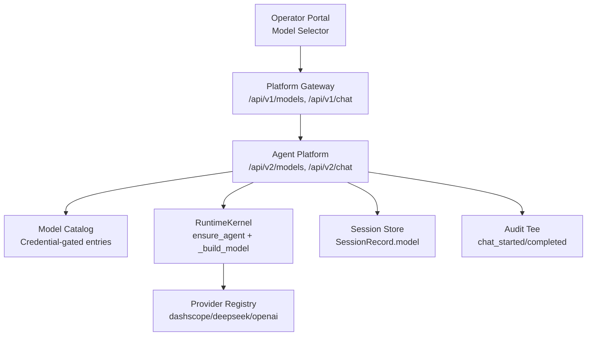
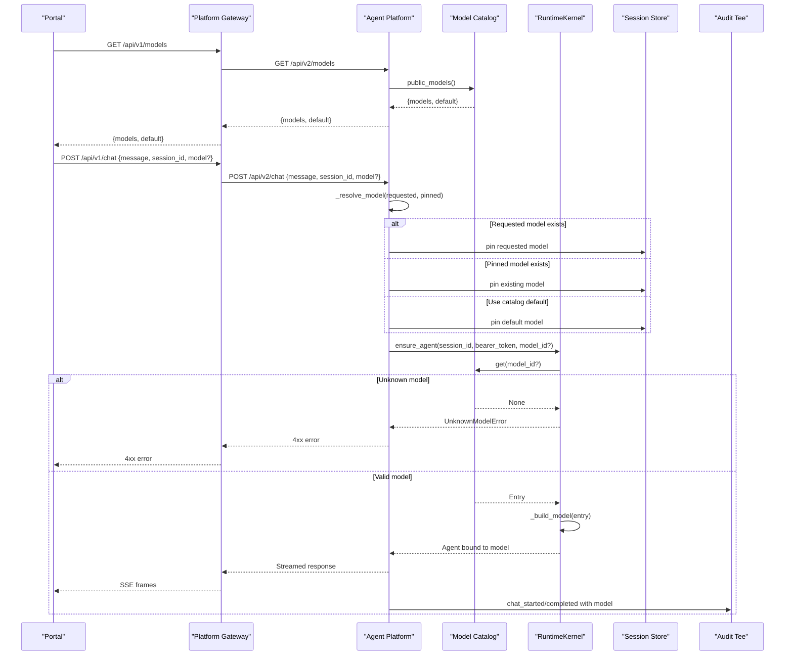
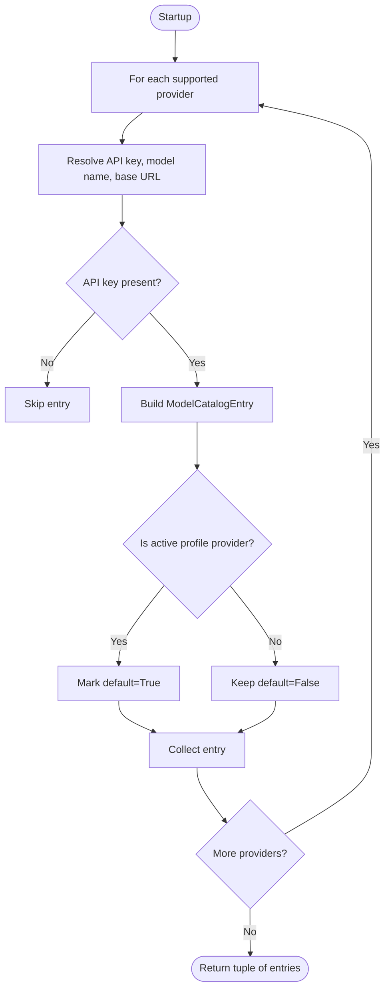
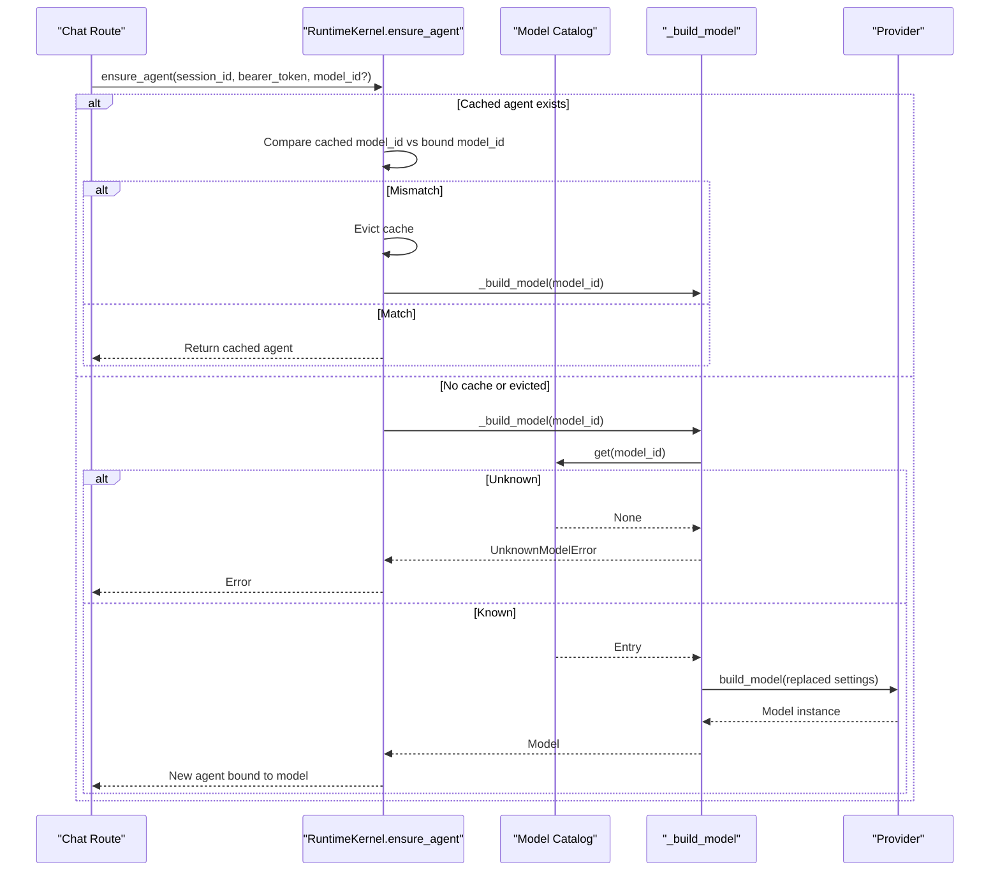
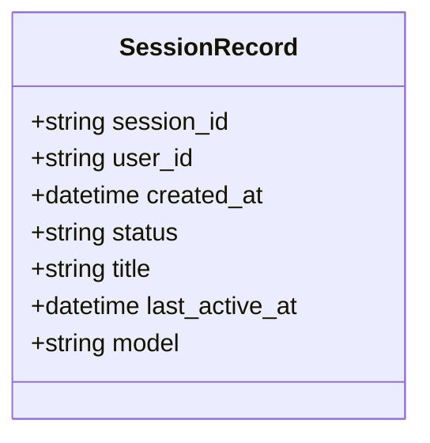
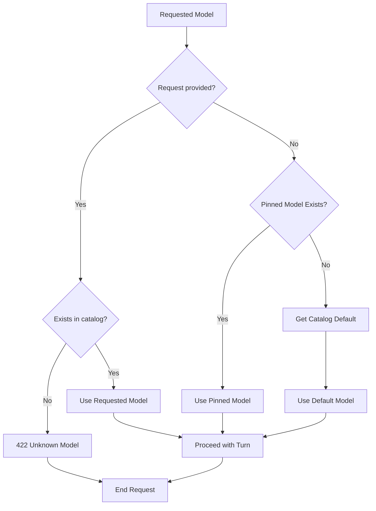
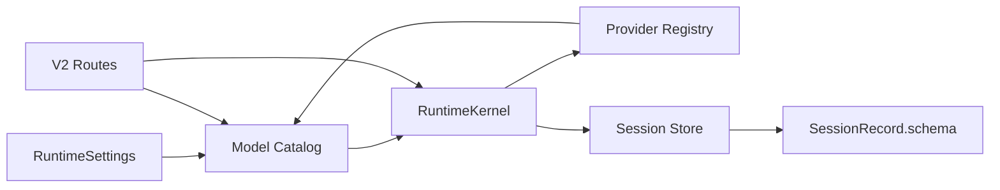

# SPEC-024: Runtime LLM Model Switching

<cite>
**Referenced Files in This Document**
- [spec.md](file://docs/specs/SPEC-024-runtime-llm-model-switching/spec.md)
- [plan.md](file://docs/specs/SPEC-024-runtime-llm-model-switching/plan.md)
- [tasks.md](file://docs/specs/SPEC-024-runtime-llm-model-switching/tasks.md)
- [model_catalog.py](file://products/agent-platform/src/agent_service/services/model_catalog.py)
- [runtime_kernel.py](file://products/agent-platform/src/agent_service/runtime_kernel.py)
- [api.py](file://products/agent-platform/src/agent_service/schemas/api.py)
- [runtime_settings.py](file://products/agent-platform/src/agent_service/runtime_settings.py)
- [registry.py](file://products/agent-platform/src/agent_service/providers/registry.py)
- [routes.py](file://products/agent-platform/src/agent_service/api/v2/routes.py)
- [hitl_confirmations.py](file://products/agent-platform/src/agent_service/services/hitl_confirmations.py)
- [session_service.py](file://products/agent-platform/src/agent_service/services/session_service.py)
</cite>

## Update Summary
**Changes Made**
- Enhanced per-turn model selection via POST chat parameters and query string parameters (?model=)
- Updated credential-gated model catalog implementation with environment variable configuration
- Added session-based model pinning with fallback resolution ladder (request > pinned > default)
- Fixed critical HITL confirmation wedge issue where evicted model pins now properly fall back to catalog defaults
- Updated architecture diagrams to reflect new model resolution flow

## Table of Contents
1. [Introduction](#introduction)
2. [Project Structure](#project-structure)
3. [Core Components](#core-components)
4. [Architecture Overview](#architecture-overview)
5. [Detailed Component Analysis](#detailed-component-analysis)
6. [Dependency Analysis](#dependency-analysis)
7. [Performance Considerations](#performance-considerations)
8. [Troubleshooting Guide](#troubleshooting-guide)
9. [Conclusion](#conclusion)
10. [Appendices](#appendices)

## Introduction
SPEC-024 enables runtime selection of the LLM model per session through a portal dropdown, backed by a credential-gated model catalog and per-session affinity. The agent-platform exposes a discovery endpoint for available models, pins the chosen model on the session record, rebuilds the kernel agent when the model changes without losing conversation memory, and enriches audit events with the resolved model. The platform-gateway relays model discovery and chat requests with optional model fields, while the operator-portal renders a selector sourced from the catalog.

Key outcomes:
- Operators can compare models or recover from provider outages without redeploying.
- Selection is audited and gated by credentials; unknown models fail closed.
- Per-session affinity survives restarts and integrates with existing HITL and policy flows.
- **Enhanced**: Per-turn model selection via POST body parameters and query string parameters (?model=) allows dynamic model switching within sessions.
- **Fixed**: Critical HITL confirmation wedge issue resolved where evicted model pins now gracefully degrade to catalog defaults instead of causing UnknownModelError exceptions.

**Section sources**
- [spec.md:12-37](file://docs/specs/SPEC-024-runtime-llm-model-switching/spec.md#L12-L37)
- [plan.md:10-167](file://docs/specs/SPEC-024-runtime-llm-model-switching/plan.md#L10-L167)
- [tasks.md:6-35](file://docs/specs/SPEC-024-runtime-llm-model-switching/tasks.md#L6-L35)

## Project Structure
The implementation spans three layers:
- Agent-platform services and kernel: catalog construction, kernel model binding, session affinity, and stream enrichment.
- Platform-gateway: pass-through routes for model discovery and chat with optional model fields, plus policy enforcement.
- Operator-portal: UI selector driven by the catalog discovery endpoint.

**Diagram sources**
- [model_catalog.py:1-318](file://products/agent-platform/src/agent_service/services/model_catalog.py#L1-L318)
- [runtime_kernel.py:216-243](file://products/agent-platform/src/agent_service/runtime_kernel.py#L216-L243)
- [registry.py:1-28](file://products/agent-platform/src/agent_service/providers/registry.py#L1-L28)
- [api.py:8-21](file://products/agent-platform/src/agent_service/schemas/api.py#L8-L21)

**Section sources**
- [plan.md:77-127](file://docs/specs/SPEC-024-runtime-llm-model-switching/plan.md#L77-L127)
- [tasks.md:12-29](file://docs/specs/SPEC-024-runtime-llm-model-switching/tasks.md#L12-L29)

## Core Components
- Credential-gated model catalog: Builds a startup-time list of selectable models from environment variables per provider, dropping entries without API keys and flagging the deploy-time default.
- Runtime kernel model selection: Resolves the effective model per turn using the fallback ladder (request > pinned > default), rebuilds the agent on switch, and restores persisted agent state to preserve conversation history.
- Session affinity: Persists the selected model id on the session record so it survives restarts and is visible in session detail.
- Discovery contract: Exposes a read-only catalog via agent-platform and relays it through the gateway with policy gating.
- Audit enrichment: Records the resolved model in chat_started and chat_completed audit payloads without introducing new event types.
- **Enhanced**: Per-turn model selection supports both POST body parameters (`model`) and query string parameters (`?model=`) for flexible client integration.

**Section sources**
- [model_catalog.py:38-318](file://products/agent-platform/src/agent_service/services/model_catalog.py#L38-L318)
- [runtime_kernel.py:216-243](file://products/agent-platform/src/agent_service/runtime_kernel.py#L216-L243)
- [runtime_kernel.py:511-614](file://products/agent-platform/src/agent_service/runtime_kernel.py#L511-L614)
- [api.py:8-21](file://products/agent-platform/src/agent_service/schemas/api.py#L8-L21)
- [routes.py:112-137](file://products/agent-platform/src/agent_service/api/v2/routes.py#L112-L137)
- [plan.md:105-127](file://docs/specs/SPEC-024-runtime-llm-model-switching/plan.md#L105-L127)

## Architecture Overview
The runtime switching flow ensures safe, auditable, and persistent model selection per session with enhanced per-turn flexibility.

**Diagram sources**
- [model_catalog.py:113-318](file://products/agent-platform/src/agent_service/services/model_catalog.py#L113-L318)
- [runtime_kernel.py:216-243](file://products/agent-platform/src/agent_service/runtime_kernel.py#L216-L243)
- [runtime_kernel.py:547-614](file://products/agent-platform/src/agent_service/runtime_kernel.py#L547-L614)
- [routes.py:112-137](file://products/agent-platform/src/agent_service/api/v2/routes.py#L112-L137)
- [plan.md:92-117](file://docs/specs/SPEC-024-runtime-llm-model-switching/plan.md#L92-L117)

## Detailed Component Analysis

### Model Catalog
Responsibilities:
- Derive entries from per-provider environment variables, falling back to active profile settings for the current provider.
- Drop entries without an API key; mark the active profile's entry as default.
- Provide a discovery-safe view that excludes credentials and base URLs.

Key behaviors:
- Entries are keyed by provider name; labels carry the resolved model name for display.
- A zero-entry catalog is allowed and degrades gracefully.
- **Enhanced**: Supports live model discovery with periodic refresh and fail-soft fallback ladder.

**Diagram sources**
- [model_catalog.py:68-110](file://products/agent-platform/src/agent_service/services/model_catalog.py#L68-L110)

**Section sources**
- [model_catalog.py:1-318](file://products/agent-platform/src/agent_service/services/model_catalog.py#L1-L318)
- [plan.md:12-41](file://docs/specs/SPEC-024-runtime-llm-model-switching/plan.md#L12-L41)

### Runtime Kernel Model Binding
Responsibilities:
- Resolve effective model per turn using request > pinned > default order.
- Rebuild the agent when the model changes, restoring persisted agent state to keep conversation history intact.
- Fail closed on unknown model ids with a structured error.

Key behaviors:
- Cache tracks the bound model id per session; mismatch triggers eviction and rebuild.
- Provider adapters remain unchanged; settings are replaced via dataclass replacement.
- **Enhanced**: Supports per-turn model selection via both POST body and query string parameters.

**Diagram sources**
- [runtime_kernel.py:511-614](file://products/agent-platform/src/agent_service/runtime_kernel.py#L511-L614)
- [runtime_kernel.py:216-243](file://products/agent-platform/src/agent_service/runtime_kernel.py#L216-L243)
- [model_catalog.py:113-318](file://products/agent-platform/src/agent_service/services/model_catalog.py#L113-L318)

**Section sources**
- [runtime_kernel.py:216-243](file://products/agent-platform/src/agent_service/runtime_kernel.py#L216-L243)
- [runtime_kernel.py:547-614](file://products/agent-platform/src/agent_service/runtime_kernel.py#L547-L614)
- [plan.md:43-63](file://docs/specs/SPEC-024-runtime-llm-model-switching/plan.md#L43-L63)

### Session Affinity and Schema
Responsibilities:
- Persist the selected model id on the session record for durability across restarts.
- Expose the pinned model additively in session detail responses.

Key behaviors:
- Additive schema change; legacy records remain readable.
- Pinning occurs at turn start and is idempotent per value.
- **Enhanced**: Fallback resolution ladder ensures graceful degradation when pinned models become invalid.

**Diagram sources**
- [api.py:8-21](file://products/agent-platform/src/agent_service/schemas/api.py#L8-L21)

**Section sources**
- [api.py:8-21](file://products/agent-platform/src/agent_service/schemas/api.py#L8-L21)
- [plan.md:64-76](file://docs/specs/SPEC-024-runtime-llm-model-switching/plan.md#L64-L76)

### Provider Resolution and Settings
Responsibilities:
- Define supported providers and validate configuration at startup.
- Provide default provider options and resolve model names/base URLs.

Key behaviors:
- Strict validation of provider choices and related knobs.
- Fallback to AGENTSCOPE_* settings for the active profile provider.
- **Enhanced**: Live model discovery with configurable refresh intervals and timeout handling.

**Section sources**
- [runtime_settings.py:32-35](file://products/agent-platform/src/agent_service/runtime_settings.py#L32-L35)
- [runtime_settings.py:113-158](file://products/agent-platform/src/agent_service/runtime_settings.py#L113-L158)
- [runtime_settings.py:279-349](file://products/agent-platform/src/agent_service/runtime_settings.py#L279-L349)
- [registry.py:1-28](file://products/agent-platform/src/agent_service/providers/registry.py#L1-L28)

### Model Resolution Ladder
Responsibilities:
- Implement the fallback resolution ladder for model selection: request > pinned > default.
- Ensure unknown models fail closed with appropriate HTTP status codes.
- Handle edge cases like evicted model pins during HITL confirmations.

Key behaviors:
- Explicitly requested models must exist in the credential-gated catalog.
- Pinned models are honored only while they still exist in the catalog.
- **Fixed**: HITL confirmation wedge issue resolved where evicted model pins now gracefully degrade to catalog defaults instead of raising UnknownModelError exceptions mid-stream.

**Diagram sources**
- [routes.py:112-137](file://products/agent-platform/src/agent_service/api/v2/routes.py#L112-L137)

**Section sources**
- [routes.py:112-137](file://products/agent-platform/src/agent_service/api/v2/routes.py#L112-L137)
- [test_hitl_confirmations.py:624-667](file://products/agent-platform/tests/test_hitl_confirmations.py#L624-L667)

## Dependency Analysis
The runtime switching feature introduces minimal coupling:
- Catalog depends on runtime settings and provider registry to construct entries.
- Kernel depends on catalog for validation and on provider registry to build models.
- Schemas extend session records additively; no breaking changes.
- Gateway routes relay model fields verbatim, preserving upstream error posture.
- **Enhanced**: Routes implement the model resolution ladder with proper error handling.

**Diagram sources**
- [model_catalog.py:24-35](file://products/agent-platform/src/agent_service/services/model_catalog.py#L24-L35)
- [runtime_kernel.py:8-25](file://products/agent-platform/src/agent_service/runtime_kernel.py#L8-L25)
- [registry.py:1-28](file://products/agent-platform/src/agent_service/providers/registry.py#L1-L28)
- [api.py:8-21](file://products/agent-platform/src/agent_service/schemas/api.py#L8-L21)
- [routes.py:112-137](file://products/agent-platform/src/agent_service/api/v2/routes.py#L112-L137)

**Section sources**
- [plan.md:77-117](file://docs/specs/SPEC-024-runtime-llm-model-switching/plan.md#L77-L117)
- [tasks.md:12-23](file://docs/specs/SPEC-024-runtime-llm-model-switching/tasks.md#L12-L23)

## Performance Considerations
- Model catalog is built once at startup; lookup is O(1) per id.
- Kernel agent cache is bounded; model switch triggers controlled rebuild with state restore.
- Stream tee captures message_end.model without additional passes over the stream.
- No per-turn parameter tuning surfaces; provider options remain deploy-time to avoid runtime overhead.
- **Enhanced**: Model resolution ladder adds minimal overhead with efficient catalog lookups.
- **Fixed**: HITL confirmation wedge fix prevents stream corruption and session wedging scenarios.

## Troubleshooting Guide
Common issues and resolutions:
- Unknown model id: The kernel rejects unknown ids early; routes map to 4xx errors. Verify the model id against the catalog discovery endpoint.
- Missing credentials: Entries without API keys are excluded from the catalog; ensure provider-specific keys are set.
- Session stuck with parked HITL confirmation: Model changes are refused with 409 until the confirmation resolves.
- Audit missing model: Ensure stream tee captures message_end.model and that chat_started includes the requested model.
- **Enhanced**: Per-turn model selection via POST/query parameters should be validated against the catalog before sending.
- **Fixed**: If encountering UnknownModelError during HITL confirmations, verify that the pinned model still exists in the catalog; the system should now gracefully degrade to the default.

Operational checks:
- Validate catalog exposure via GET /api/v2/models and gateway passthrough GET /api/v1/models.
- Confirm session detail includes the pinned model after a turn.
- Inspect audit events for chat_started and chat_completed to verify model attribution.
- Test per-turn model selection with both POST body and query string parameters.

**Section sources**
- [runtime_kernel.py:31-37](file://products/agent-platform/src/agent_service/runtime_kernel.py#L31-L37)
- [runtime_kernel.py:735-761](file://products/agent-platform/src/agent_service/runtime_kernel.py#L735-L761)
- [plan.md:92-117](file://docs/specs/SPEC-024-runtime-llm-model-switching/plan.md#L92-L117)
- [routes.py:112-137](file://products/agent-platform/src/agent_service/api/v2/routes.py#L112-L137)

## Conclusion
SPEC-024 delivers runtime LLM model switching with strong safety guarantees: credential gating, fail-closed validation, per-session affinity, and audited selection. The design leverages existing provider adapters, session stores, and audit infrastructure, minimizing risk while enabling operators to compare models and respond to provider issues without redeployment.

**Enhanced Features**:
- Per-turn model selection via POST body parameters and query string parameters provides flexible client integration.
- Robust fallback resolution ladder ensures graceful degradation when pinned models become invalid.
- Critical HITL confirmation wedge issue resolved, preventing session wedging scenarios.

The implementation maintains backward compatibility while adding powerful new capabilities for dynamic model management within operational workflows.

## Appendices
- Contract updates:
  - New model catalog schema under shared contracts.
  - Additive model field on chat request/response and session detail.
  - Additive model field on stream message_end frames.
  - **Enhanced**: Support for per-turn model selection in both POST body and query string parameters.
- Deployment notes:
  - Active deepseek profile remains the default via existing AGENTSCOPE_* knobs.
  - Additional providers enabled via per-provider environment variables.
  - **Enhanced**: Live model discovery can be configured with refresh intervals and timeouts.

**Section sources**
- [plan.md:77-141](file://docs/specs/SPEC-024-runtime-llm-model-switching/plan.md#L77-L141)
- [tasks.md:12-35](file://docs/specs/SPEC-024-runtime-llm-model-switching/tasks.md#L12-L35)
- [routes.py:112-137](file://products/agent-platform/src/agent_service/api/v2/routes.py#L112-L137)
- [runtime_settings.py:152-157](file://products/agent-platform/src/agent_service/runtime_settings.py#L152-L157)