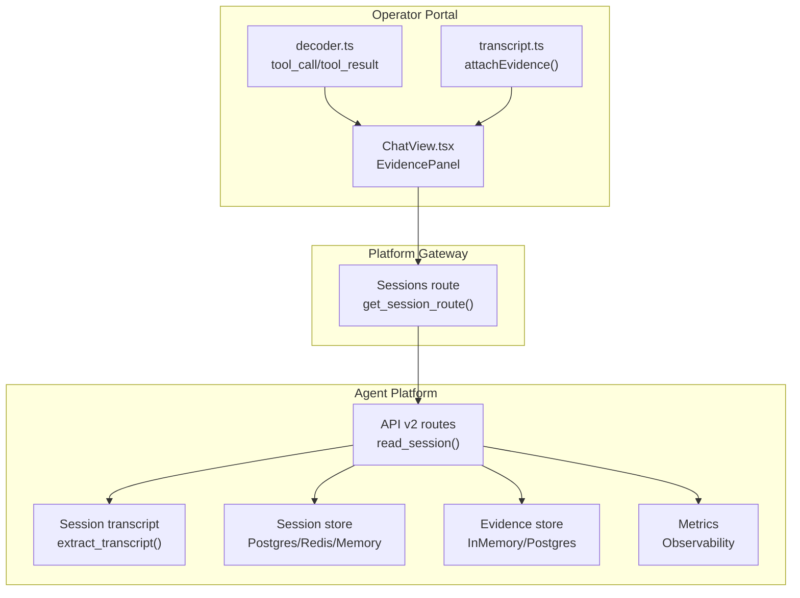
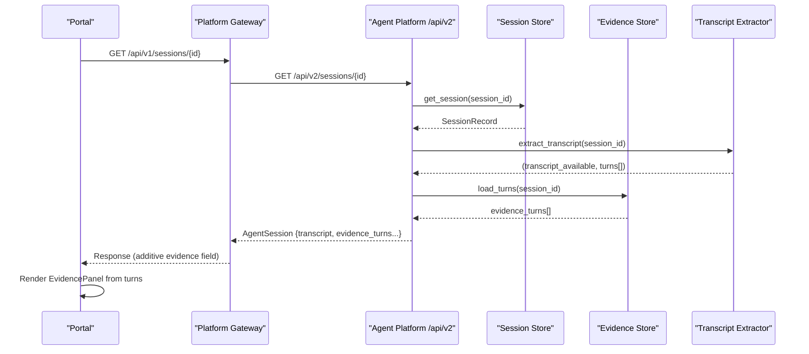
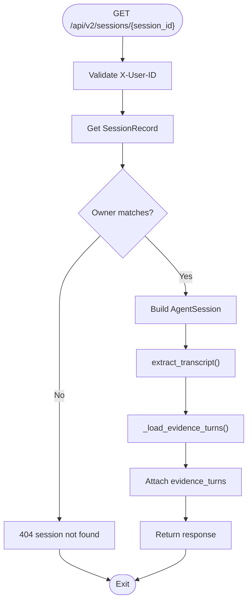
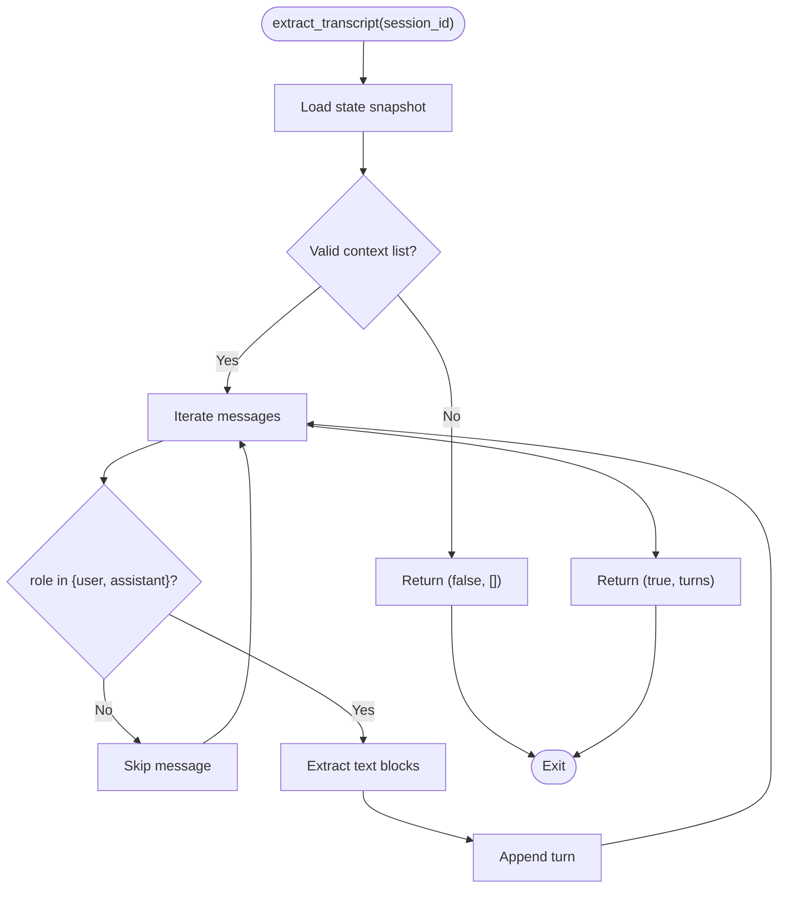
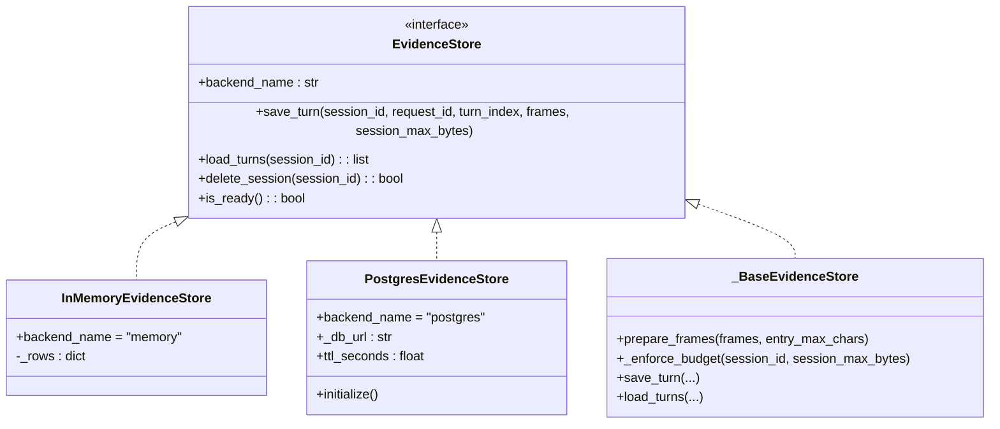
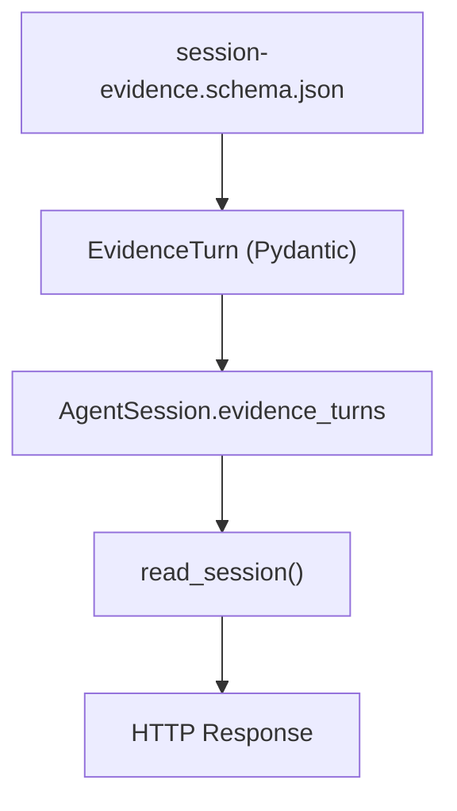
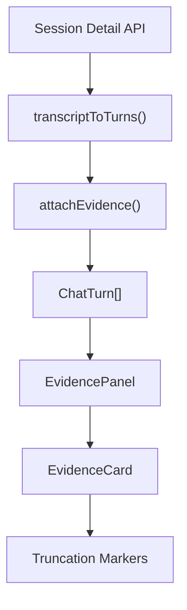
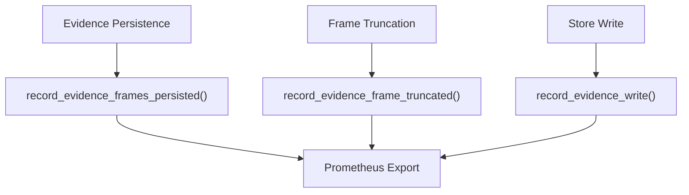
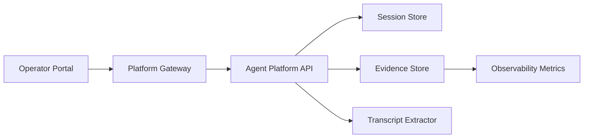

# SPEC-025: Evidence Persistence in Transcripts

<cite>
**Referenced Files in This Document**
- [spec.md](file://docs/specs/SPEC-025-evidence-persistence-in-transcripts/spec.md)
- [evidence_store.py](file://products/agent-platform/src/agent_service/services/evidence_store.py)
- [session_transcript.py](file://products/agent-platform/src/agent_service/services/session_transcript.py)
- [routes.py](file://products/agent-platform/src/agent_service/api/v2/routes.py)
- [v2.py](file://products/agent-platform/src/agent_service/schemas/v2.py)
- [metrics.py](file://products/agent-platform/src/agent_service/core/metrics.py)
- [session-evidence.schema.json](file://shared/shared-contracts/schemas/session-evidence.schema.json)
- [test_evidence_store.py](file://products/agent-platform/tests/test_evidence_store.py)
- [ChatView.tsx](file://products/operator-portal/web-ui/app/src/chat/ChatView.tsx)
- [transcript.ts](file://products/operator-portal/web-ui/app/src/chat/transcript.ts)
- [decoder.ts](file://products/operator-portal/web-ui/app/src/stream/decoder.ts)
- [sessions.ts](file://products/operator-portal/web-ui/app/src/api/sessions.ts)
</cite>

## Update Summary
**Changes Made**
- Updated Introduction to reflect delivered status and completed implementation of dual-backend evidence persistence
- Enhanced Requirements section with detailed acceptance criteria based on actual implementation verification
- Added comprehensive Architecture Overview showing complete data flow with evidence store integration
- Expanded Component Analysis with specific implementation details from evidence_store.py, routes.py, schema files, and portal components
- Updated Performance Considerations with concrete storage backends, size management, and observability metrics
- Enhanced Troubleshooting Guide with evidence-specific scenarios and monitoring guidance
- Added Conclusion summarizing the delivered implementation with dual-backend support and portal integration

## Table of Contents
1. [Introduction](#introduction)
2. [Project Structure](#project-structure)
3. [Core Components](#core-components)
4. [Architecture Overview](#architecture-overview)
5. [Detailed Component Analysis](#detailed-component-analysis)
6. [Dependency Analysis](#dependency-analysis)
7. [Performance Considerations](#performance-considerations)
8. [Troubleshooting Guide](#troubleshooting-guide)
9. [Conclusion](#conclusion)

## Introduction
This document specifies the delivered implementation of evidence persistence for session transcripts under SPEC-025. The spec is now in `delivered` status, created on 2026-08-23, and addresses a critical parity gap where evidence only existed during live streaming but disappeared when sessions were reopened. The implementation introduces dual-backend storage (in-memory/PostgreSQL) for tool call and result frames with comprehensive size management and observability metrics. It extends existing specifications including SPEC-022 R-1 (transcripts), SPEC-011 R-4 (evidence panels), and SPEC-017 (kernel state persistence). All requirements R-1 through R-4 have been fully implemented and verified with comprehensive testing.

**Section sources**
- [spec.md:3-15](file://docs/specs/SPEC-025-evidence-persistence-in-transcripts/spec.md#L3-L15)

## Project Structure
SPEC-025 touches three product areas with clear responsibilities:
- Agent Platform: persists evidence frames alongside transcript extraction and enriches the session-detail response with dual-backend support
- Operator Portal: renders evidence cards from persisted data with parity to live rendering using shared EvidenceCard component
- Platform Gateway: passes through the additive evidence field without modification

**Diagram sources**
- [routes.py:410-431](file://products/agent-platform/src/agent_service/api/v2/routes.py#L410-L431)
- [session_transcript.py:30-64](file://products/agent-platform/src/agent_service/services/session_transcript.py#L30-L64)
- [evidence_store.py:504-551](file://products/agent-platform/src/agent_service/services/evidence_store.py#L504-L551)
- [metrics.py:156-186](file://products/agent-platform/src/agent_service/core/metrics.py#L156-L186)
- [ChatView.tsx:134-165](file://products/operator-portal/web-ui/app/src/chat/ChatView.tsx#L134-L165)
- [transcript.ts:55-70](file://products/operator-portal/web-ui/app/src/chat/transcript.ts#L55-L70)

**Section sources**
- [spec.md:17-44](file://docs/specs/SPEC-025-evidence-persistence-in-transcripts/spec.md#L17-L44)

## Core Components
The implementation focuses on four key components that work together to provide evidence persistence:

- **Session detail read path**: Returns transcript availability, chat-only turns, and additive evidence field per turn with graceful degradation
- **Transcript extractor**: Best-effort reconstruction from kernel state; currently excludes tool/evidence frames by design for v1
- **Evidence store backends**: Dual-backend pattern (in-memory for dev/CI, Postgres for production) with bounded storage and TTL refresh
- **Portal evidence UI**: Reuses existing EvidenceCard component for both live and replayed data with identical rendering
- **Stream decoder**: Parses tool_call and tool_result events into structured objects used by the UI

Key acceptance criteria from the spec define the scope:
- **R-1**: Persist tool_call and tool_result frames per turn with traceability metadata and redaction; bounded storage with entry and session caps; best-effort persistence
- **R-2**: Additive session-detail contract with evidence attached to turns; gateway pass-through unchanged; backward compatible
- **R-3**: Portal evidence-card parity for reopened sessions using grouped entries and summary counts
- **R-4**: Traceability and metrics on persisted evidence (request_id, duration, correlation to audit/observability)

**Section sources**
- [spec.md:46-116](file://docs/specs/SPEC-025-evidence-persistence-in-transcripts/spec.md#L46-L116)
- [session_transcript.py:1-14](file://products/agent-platform/src/agent_service/services/session_transcript.py#L1-L14)
- [routes.py:410-431](file://products/agent-platform/src/agent_service/api/v2/routes.py#L410-L431)

## Architecture Overview
The implementation adds a per-turn evidence persistence layer with dual-backend support and augments the session-detail response with evidence attached to each turn. The portal reuses its existing evidence card logic for both live and replayed data, ensuring visual consistency.

**Diagram sources**
- [routes.py:410-431](file://products/agent-platform/src/agent_service/api/v2/routes.py#L410-L431)
- [session_transcript.py:30-64](file://products/agent-platform/src/agent_service/services/session_transcript.py#L30-L64)
- [evidence_store.py:165-180](file://products/agent-platform/src/agent_service/services/evidence_store.py#L165-L180)

## Detailed Component Analysis

### Agent Platform: Session Detail Read Path
The current behavior reads session metadata, extracts chat-only transcript, loads evidence turns from the evidence store, and returns both in the session response with graceful degradation. Security measures keep existing owner checks and anti-enumeration semantics intact.

**Diagram sources**
- [routes.py:410-431](file://products/agent-platform/src/agent_service/api/v2/routes.py#L410-L431)
- [routes.py:351-367](file://products/agent-platform/src/agent_service/api/v2/routes.py#L351-L367)

**Section sources**
- [routes.py:410-431](file://products/agent-platform/src/agent_service/api/v2/routes.py#L410-L431)

### Agent Platform: Transcript Extraction
The current scope reconstructs user/assistant chat text from kernel state and explicitly excludes tool/evidence frames for v1. Future scope integrates evidence frames per turn when storage is available, degrading gracefully if unavailable.

**Diagram sources**
- [session_transcript.py:30-64](file://products/agent-platform/src/agent_service/services/session_transcript.py#L30-L64)
- [session_transcript.py:67-82](file://products/agent-platform/src/agent_service/services/session_transcript.py#L67-L82)

**Section sources**
- [session_transcript.py:1-14](file://products/agent-platform/src/agent_service/services/session_transcript.py#L1-L14)
- [session_transcript.py:30-82](file://products/agent-platform/src/agent_service/services/session_transcript.py#L30-L82)

### Agent Platform: Evidence Store Backends
The evidence store provides dual-backend support with in-memory for development/testing and PostgreSQL for production deployments. Both backends enforce identical size caps and eviction policies with TTL refresh on reads.

**Diagram sources**
- [evidence_store.py:86-107](file://products/agent-platform/src/agent_service/services/evidence_store.py#L86-L107)
- [evidence_store.py:211-273](file://products/agent-platform/src/agent_service/services/evidence_store.py#L211-L273)
- [evidence_store.py:362-497](file://products/agent-platform/src/agent_service/services/evidence_store.py#L362-L497)
- [evidence_store.py:109-204](file://products/agent-platform/src/agent_service/services/evidence_store.py#L109-L204)

**Section sources**
- [evidence_store.py:1-15](file://products/agent-platform/src/agent_service/services/evidence_store.py#L1-L15)
- [evidence_store.py:504-551](file://products/agent-platform/src/agent_service/services/evidence_store.py#L504-L551)

### Agent Platform: Schema and Contract
The implementation defines Pydantic models and JSON schemas for evidence turns with strict validation and backward compatibility guarantees.

**Diagram sources**
- [session-evidence.schema.json:1-58](file://shared/shared-contracts/schemas/session-evidence.schema.json#L1-L58)
- [v2.py:125-158](file://products/agent-platform/src/agent_service/schemas/v2.py#L125-L158)
- [routes.py:410-431](file://products/agent-platform/src/agent_service/api/v2/routes.py#L410-L431)

**Section sources**
- [v2.py:125-158](file://products/agent-platform/src/agent_service/schemas/v2.py#L125-L158)
- [session-evidence.schema.json:1-58](file://shared/shared-contracts/schemas/session-evidence.schema.json#L1-L58)

### Operator Portal: Evidence Rendering Integration
The operator portal seamlessly integrates persisted evidence with live stream rendering using shared components. The EvidencePanel component handles both live and replayed evidence identically, while the transcript converter maps evidence groups to chat turns.

**Diagram sources**
- [ChatView.tsx:134-165](file://products/operator-portal/web-ui/app/src/chat/ChatView.tsx#L134-L165)
- [transcript.ts:55-70](file://products/operator-portal/web-ui/app/src/chat/transcript.ts#L55-L70)
- [sessions.ts:11-42](file://products/operator-portal/web-ui/app/src/api/sessions.ts#L11-L42)

**Section sources**
- [ChatView.tsx:134-165](file://products/operator-portal/web-ui/app/src/chat/ChatView.tsx#L134-L165)
- [transcript.ts:55-70](file://products/operator-portal/web-ui/app/src/chat/transcript.ts#L55-L70)
- [sessions.ts:11-42](file://products/operator-portal/web-ui/app/src/api/sessions.ts#L11-L42)

### Observability and Metrics
The implementation includes comprehensive metrics for evidence persistence operations, frame truncation, and storage backend health monitoring.

**Diagram sources**
- [metrics.py:156-186](file://products/agent-platform/src/agent_service/core/metrics.py#L156-L186)
- [evidence_store.py:27-30](file://products/agent-platform/src/agent_service/services/evidence_store.py#L27-L30)

**Section sources**
- [metrics.py:156-186](file://products/agent-platform/src/agent_service/core/metrics.py#L156-L186)

## Dependency Analysis
The implementation creates clear dependencies between components:
- Agent Platform depends on session store backends for durable session metadata, transcript extractor for chat-only turns (currently), and evidence store for per-turn evidence frames
- Portal depends on stream decoder for live events and session-detail API for replayed evidence
- Gateway depends on policy enforcement and logging, plus transparent forwarding of session responses
- Evidence store depends on metrics module for observability and shared environment configuration

**Diagram sources**
- [routes.py:410-431](file://products/agent-platform/src/agent_service/api/v2/routes.py#L410-L431)
- [evidence_store.py:504-551](file://products/agent-platform/src/agent_service/services/evidence_store.py#L504-L551)
- [metrics.py:156-186](file://products/agent-platform/src/agent_service/core/metrics.py#L156-L186)

**Section sources**
- [spec.md:128-138](file://docs/specs/SPEC-025-evidence-persistence-in-transcripts/spec.md#L128-L138)

## Performance Considerations
Critical performance considerations for evidence persistence include:
- **Dual-backend storage**: In-memory for development/CI, PostgreSQL for production with automatic fallback
- **Size management**: Per-entry cap (131,072 chars) and per-session budget (4,194,304 bytes) with automatic eviction
- **Best-effort persistence**: Failures must not fail chat turns; log and continue operations with graceful degradation
- **Read paths**: Evidence retrieval uses TTL refresh on reads to maintain session activity
- **Redaction**: Apply existing redaction before storing evidence payloads to prevent secrets leakage
- **Metrics**: Comprehensive observability with counters for writes, frames persisted, and truncation reasons

These considerations align with the spec's requirements for bounded storage and graceful degradation across all deployment environments.

## Troubleshooting Guide
Common troubleshooting scenarios for evidence persistence:
- **If evidence is missing on reopened sessions**: Verify evidence persistence is enabled and writing successfully, confirm session-detail includes evidence_turns, ensure portal uses the same EvidencePanel for replayed data
- **If evidence contains sensitive data**: Validate redaction pipeline runs before storage, check stored payloads for credentials or secrets
- **If performance degrades**: Inspect per-session evidence size and cap enforcement, review query patterns for evidence retrieval, check PostgreSQL connection health
- **If evidence store is unavailable**: Monitor evidence_store_writes_total{result="error"} metric, verify AGENT_STATE_STORE_BACKEND configuration, check database connectivity
- **If truncation occurs frequently**: Review AGENT_EVIDENCE_ENTRY_MAX_CHARS and AGENT_EVIDENCE_SESSION_MAX_BYTES settings, analyze evidence_frames_truncated_total metrics

**Section sources**
- [spec.md:59-69](file://docs/specs/SPEC-025-evidence-persistence-in-transcripts/spec.md#L59-L69)
- [test_evidence_store.py:230-261](file://products/agent-platform/tests/test_evidence_store.py#L230-L261)

## Conclusion
SPEC-025 successfully closes the parity gap between live and replayed evidence by implementing dual-backend evidence persistence with comprehensive size management and observability. The implementation persists tool_call and tool_result frames per turn using in-memory (development) and PostgreSQL (production) backends, exposing them via the session-detail API with graceful degradation. The portal renders evidence identically for live and reopened sessions using the existing EvidenceCard component. The implementation focuses on robust storage with bounded growth, best-effort persistence, strict redaction, and comprehensive metrics while maintaining backward compatibility. All requirements R-1 through R-4 have been fully implemented and verified with comprehensive testing, delivering complete evidence parity between live streaming and session replay experiences.