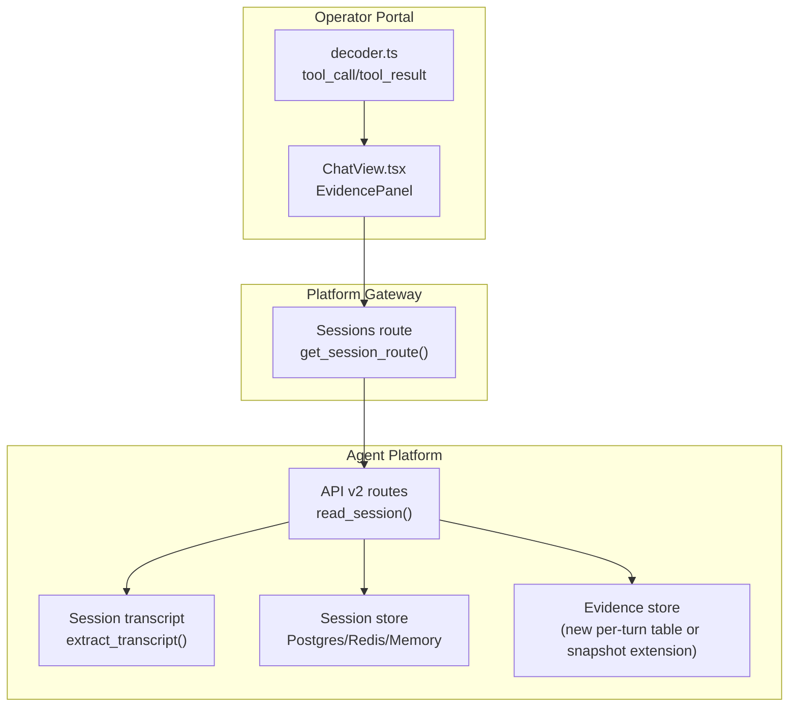
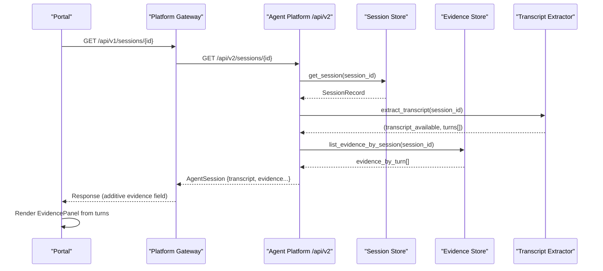
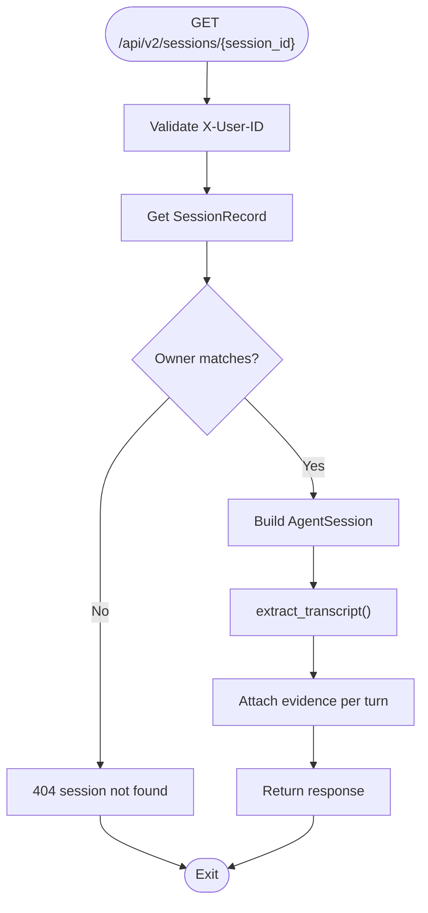
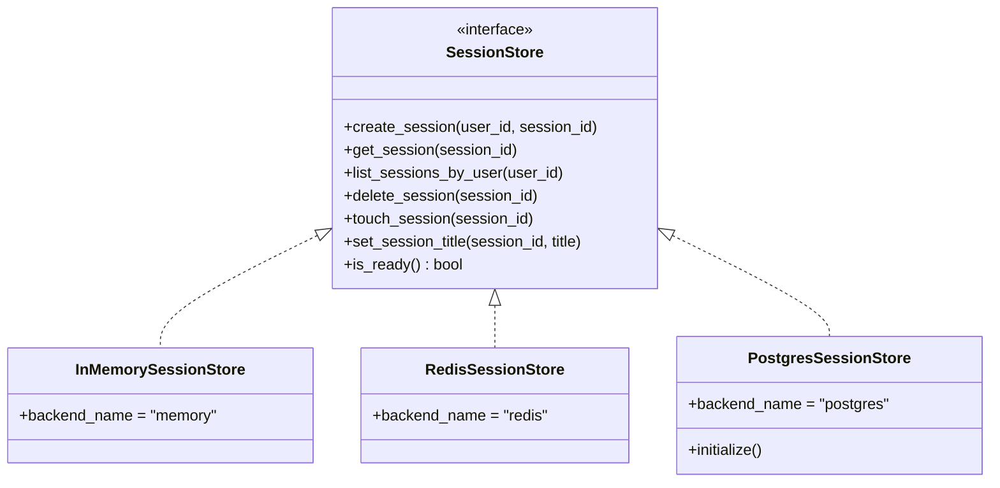
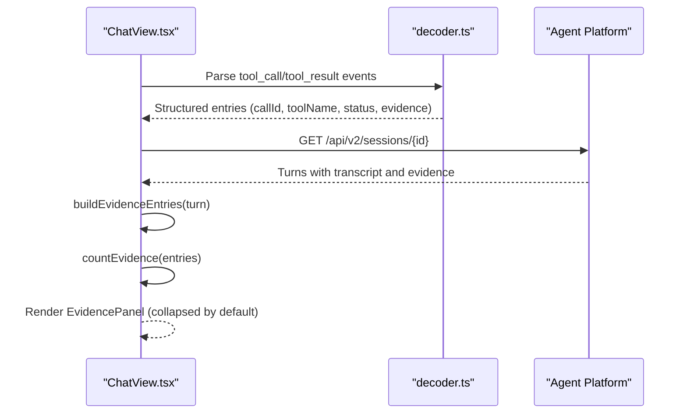
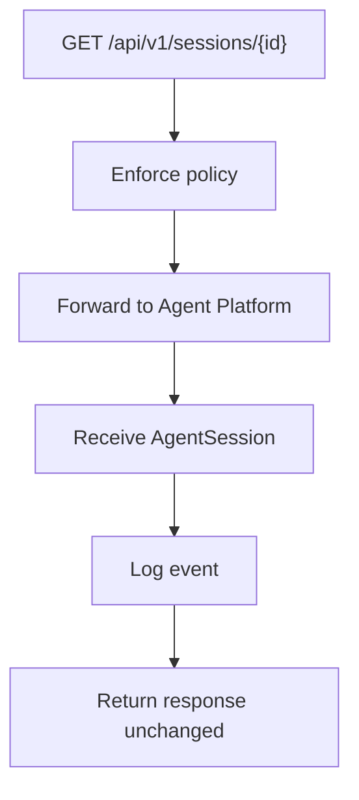
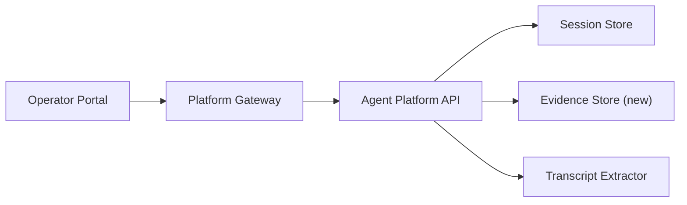

# SPEC-025: Evidence Persistence in Transcripts

<cite>
**Referenced Files in This Document**
- [spec.md](file://docs/specs/SPEC-025-evidence-persistence-in-transcripts/spec.md)
- [session_transcript.py](file://products/agent-platform/src/agent_service/services/session_transcript.py)
- [routes.py](file://products/agent-platform/src/agent_service/api/v2/routes.py)
- [api.py](file://products/agent-platform/src/agent_service/schemas/api.py)
- [session_store.py](file://products/agent-platform/src/agent_service/services/session_store.py)
- [session_service.py](file://products/agent-platform/src/agent_service/services/session_service.py)
- [ChatView.tsx](file://products/operator-portal/web-ui/app/src/chat/ChatView.tsx)
- [decoder.ts](file://products/operator-portal/web-ui/app/src/stream/decoder.ts)
- [sessions.py](file://products/platform-gateway/src/platform_gateway/api/routes/sessions.py)
</cite>

## Table of Contents
1. [Introduction](#introduction)
2. [Project Structure](#project-structure)
3. [Core Components](#core-components)
4. [Architecture Overview](#architecture-overview)
5. [Detailed Component Analysis](#detailed-component-analysis)
6. [Dependency Analysis](#dependency-analysis)
7. [Performance Considerations](#performance-considerations)
8. [Troubleshooting Guide](#troubleshooting-guide)
9. [Conclusion](#conclusion)

## Introduction
This document specifies how evidence persistence will be implemented for session transcripts under SPEC-025. It explains the current gap (evidence only exists during live streaming), the requirements to persist tool evidence per turn, expose it via the session-detail API, and render parity in the portal for both live and reopened sessions. It also maps the affected components across agent-platform, operator-portal, platform-gateway, and shared contracts.

## Project Structure
SPEC-025 touches three product areas:
- Agent Platform: persists evidence frames alongside transcript extraction and enriches the session-detail response.
- Operator Portal: renders evidence cards from persisted data with parity to live rendering.
- Platform Gateway: passes through the additive evidence field without modification.

**Diagram sources**
- [routes.py:387-407](file://products/agent-platform/src/agent_service/api/v2/routes.py#L387-L407)
- [session_transcript.py:30-64](file://products/agent-platform/src/agent_service/services/session_transcript.py#L30-L64)
- [session_store.py:458-649](file://products/agent-platform/src/agent_service/services/session_store.py#L458-L649)
- [sessions.py:94-115](file://products/platform-gateway/src/platform_gateway/api/routes/sessions.py#L94-L115)
- [ChatView.tsx:67-161](file://products/operator-portal/web-ui/app/src/chat/ChatView.tsx#L67-L161)
- [decoder.ts:38-72](file://products/operator-portal/web-ui/app/src/stream/decoder.ts#L38-L72)

**Section sources**
- [spec.md:17-44](file://docs/specs/SPEC-025-evidence-persistence-in-transcripts/spec.md#L17-L44)

## Core Components
- Session detail read path: currently returns transcript availability and chat-only turns; needs an additive evidence field per turn.
- Transcript extractor: best-effort reconstruction from kernel state; currently excludes tool/evidence frames by design.
- Session store backends: provide durable session metadata; a new evidence storage strategy is required (open question in spec).
- Portal evidence UI: already supports live evidence rendering; must reuse the same component for replayed data.
- Stream decoder: parses tool_call and tool_result events into structured objects used by the UI.

Key acceptance criteria from the spec:
- R-1: Persist tool_call and tool_result frames per turn with traceability metadata and redaction; bounded storage; best-effort persistence.
- R-2: Additive session-detail contract with evidence attached to turns; gateway pass-through unchanged; backward compatible.
- R-3: Portal evidence-card parity for reopened sessions using grouped entries and summary counts.
- R-4: Traceability and metrics on persisted evidence (request_id, duration, correlation to audit/observability).

**Section sources**
- [spec.md:46-116](file://docs/specs/SPEC-025-evidence-persistence-in-transcripts/spec.md#L46-L116)
- [session_transcript.py:1-14](file://products/agent-platform/src/agent_service/services/session_transcript.py#L1-L14)
- [routes.py:387-407](file://products/agent-platform/src/agent_service/api/v2/routes.py#L387-L407)
- [ChatView.tsx:67-161](file://products/operator-portal/web-ui/app/src/chat/ChatView.tsx#L67-L161)
- [decoder.ts:38-72](file://products/operator-portal/web-ui/app/src/stream/decoder.ts#L38-L72)

## Architecture Overview
The implementation adds a per-turn evidence persistence layer and augments the session-detail response with evidence attached to each turn. The portal reuses its existing evidence card logic for both live and replayed data.

**Diagram sources**
- [sessions.py:94-115](file://products/platform-gateway/src/platform_gateway/api/routes/sessions.py#L94-L115)
- [routes.py:387-407](file://products/agent-platform/src/agent_service/api/v2/routes.py#L387-L407)
- [session_transcript.py:30-64](file://products/agent-platform/src/agent_service/services/session_transcript.py#L30-L64)
- [session_store.py:458-649](file://products/agent-platform/src/agent_service/services/session_store.py#L458-L649)

## Detailed Component Analysis

### Agent Platform: Session Detail Read Path
- Current behavior: reads session metadata, extracts chat-only transcript, and returns both in the session response.
- Required change: attach per-turn evidence to the response while preserving backward compatibility.
- Security: keep existing owner checks and anti-enumeration semantics.

**Diagram sources**
- [routes.py:387-407](file://products/agent-platform/src/agent_service/api/v2/routes.py#L387-L407)
- [session_service.py:64-69](file://products/agent-platform/src/agent_service/services/session_service.py#L64-L69)
- [session_transcript.py:30-64](file://products/agent-platform/src/agent_service/services/session_transcript.py#L30-L64)

**Section sources**
- [routes.py:387-407](file://products/agent-platform/src/agent_service/api/v2/routes.py#L387-L407)
- [session_service.py:64-69](file://products/agent-platform/src/agent_service/services/session_service.py#L64-L69)

### Agent Platform: Transcript Extraction
- Current scope: reconstructs user/assistant chat text from kernel state; explicitly excludes tool/evidence frames for v1.
- Future scope: integrate evidence frames per turn when storage is available; degrade gracefully if unavailable.

**Diagram sources**
- [session_transcript.py:30-64](file://products/agent-platform/src/agent_service/services/session_transcript.py#L30-L64)
- [session_transcript.py:67-82](file://products/agent-platform/src/agent_service/services/session_transcript.py#L67-L82)

**Section sources**
- [session_transcript.py:1-14](file://products/agent-platform/src/agent_service/services/session_transcript.py#L1-L14)
- [session_transcript.py:30-82](file://products/agent-platform/src/agent_service/services/session_transcript.py#L30-L82)

### Agent Platform: Session Store Backends
- Provides durable session metadata with TTL and listing/ordering.
- For evidence, the spec leaves open whether to extend the kernel state snapshot or add a dedicated per-session evidence table in Postgres. Either approach must support bounded growth and best-effort persistence.

**Diagram sources**
- [session_store.py:46-73](file://products/agent-platform/src/agent_service/services/session_store.py#L46-L73)
- [session_store.py:81-169](file://products/agent-platform/src/agent_service/services/session_store.py#L81-L169)
- [session_store.py:176-358](file://products/agent-platform/src/agent_service/services/session_store.py#L176-L358)
- [session_store.py:458-649](file://products/agent-platform/src/agent_service/services/session_store.py#L458-L649)

**Section sources**
- [session_store.py:1-7](file://products/agent-platform/src/agent_service/services/session_store.py#L1-L7)
- [session_store.py:458-649](file://products/agent-platform/src/agent_service/services/session_store.py#L458-L649)

### Operator Portal: Evidence Rendering
- Live rendering: builds evidence entries from stream events and groups them by call_id; shows summary counts and collapsible cards.
- Reopened sessions: must reuse the same EvidencePanel and entry-building logic against persisted data returned by the session-detail API.

**Diagram sources**
- [ChatView.tsx:67-161](file://products/operator-portal/web-ui/app/src/chat/ChatView.tsx#L67-L161)
- [decoder.ts:38-72](file://products/operator-portal/web-ui/app/src/stream/decoder.ts#L38-L72)

**Section sources**
- [ChatView.tsx:67-161](file://products/operator-portal/web-ui/app/src/chat/ChatView.tsx#L67-L161)
- [ChatView.tsx:163-196](file://products/operator-portal/web-ui/app/src/chat/ChatView.tsx#L163-L196)
- [decoder.ts:38-72](file://products/operator-portal/web-ui/app/src/stream/decoder.ts#L38-L72)

### Platform Gateway: Pass-Through
- The gateway forwards session reads and does not modify the payload; it enforces policy and logs access.
- With SPEC-025, the additive evidence field should pass through unchanged.

**Diagram sources**
- [sessions.py:94-115](file://products/platform-gateway/src/platform_gateway/api/routes/sessions.py#L94-L115)

**Section sources**
- [sessions.py:94-115](file://products/platform-gateway/src/platform_gateway/api/routes/sessions.py#L94-L115)

## Dependency Analysis
- Agent Platform depends on:
  - Session store backends for durable session metadata.
  - Transcript extractor for chat-only turns (currently).
  - New evidence store (to be added) for per-turn evidence frames.
- Portal depends on:
  - Stream decoder for live events.
  - Session-detail API for replayed evidence.
- Gateway depends on:
  - Policy enforcement and logging.
  - Transparent forwarding of session responses.

**Diagram sources**
- [routes.py:387-407](file://products/agent-platform/src/agent_service/api/v2/routes.py#L387-L407)
- [session_store.py:458-649](file://products/agent-platform/src/agent_service/services/session_store.py#L458-L649)
- [sessions.py:94-115](file://products/platform-gateway/src/platform_gateway/api/routes/sessions.py#L94-L115)

**Section sources**
- [spec.md:128-138](file://docs/specs/SPEC-025-evidence-persistence-in-transcripts/spec.md#L128-L138)

## Performance Considerations
- Storage sizing: define per-entry and per-session caps for evidence; truncate oversized results with visible markers.
- Best-effort persistence: failures must not fail chat turns; log and continue.
- Read paths: ensure evidence retrieval does not block session-detail responses; consider async or background writes.
- Redaction: apply existing redaction before storing evidence payloads to prevent secrets leakage.

[No sources needed since this section provides general guidance]

## Troubleshooting Guide
- If evidence is missing on reopened sessions:
  - Verify evidence persistence is enabled and writing successfully.
  - Confirm session-detail includes evidence per turn.
  - Ensure portal uses the same EvidencePanel for replayed data.
- If evidence contains sensitive data:
  - Validate redaction pipeline runs before storage.
  - Check stored payloads for credentials or secrets.
- If performance degrades:
  - Inspect per-session evidence size and cap enforcement.
  - Review query patterns for evidence retrieval.

**Section sources**
- [spec.md:59-69](file://docs/specs/SPEC-025-evidence-persistence-in-transcripts/spec.md#L59-L69)
- [session_transcript.py:60-64](file://products/agent-platform/src/agent_service/services/session_transcript.py#L60-L64)

## Conclusion
SPEC-025 closes the parity gap between live and replayed evidence by persisting tool_call and tool_result frames per turn and exposing them via the session-detail API. The portal will render evidence identically for live and reopened sessions. Implementation focuses on robust storage, bounded growth, best-effort persistence, and strict redaction, while keeping the gateway pass-through unchanged.

[No sources needed since this section summarizes without analyzing specific files]