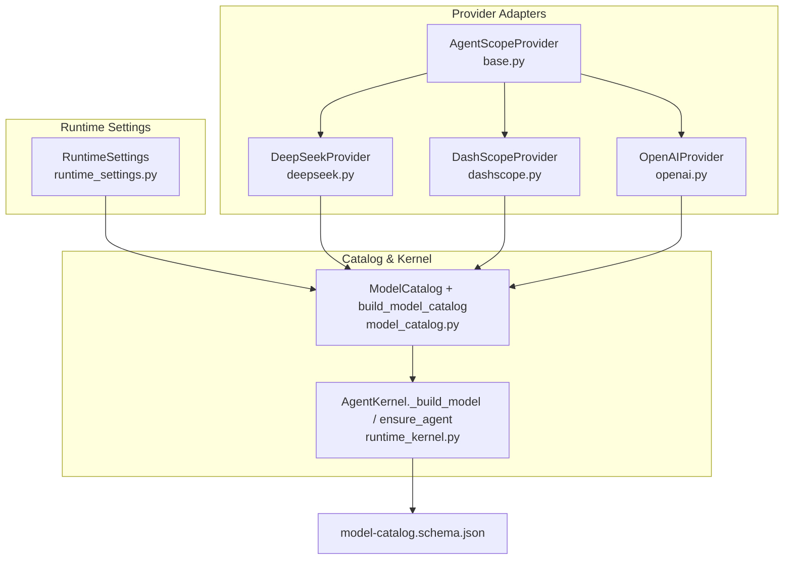
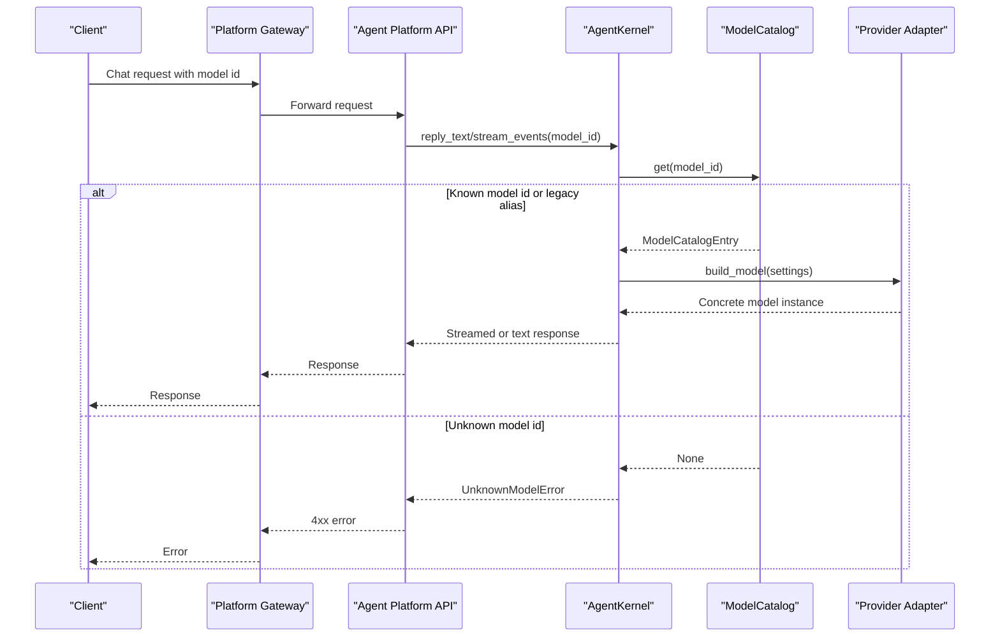
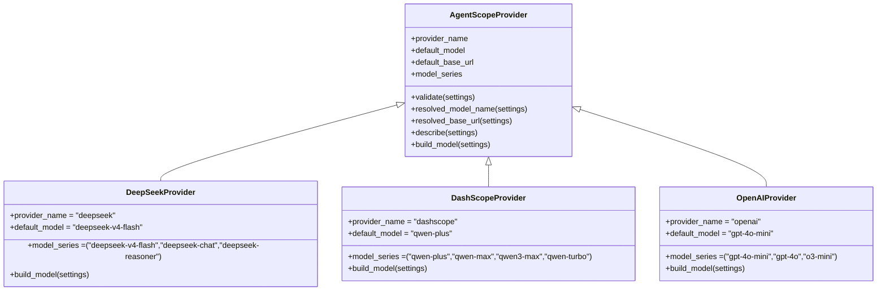
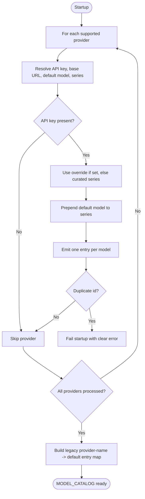
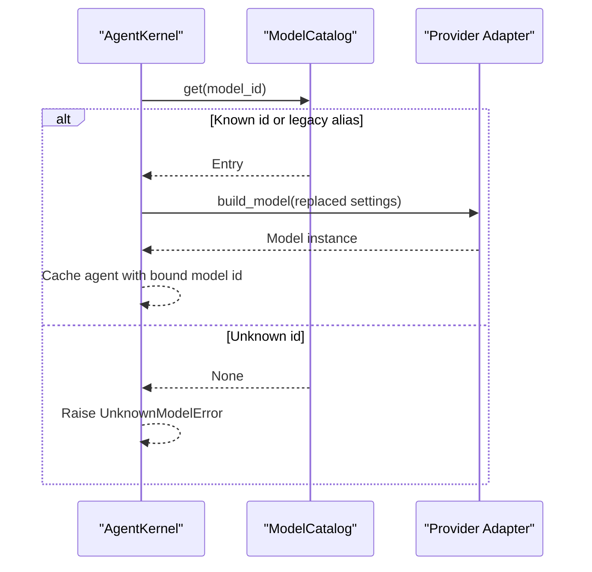
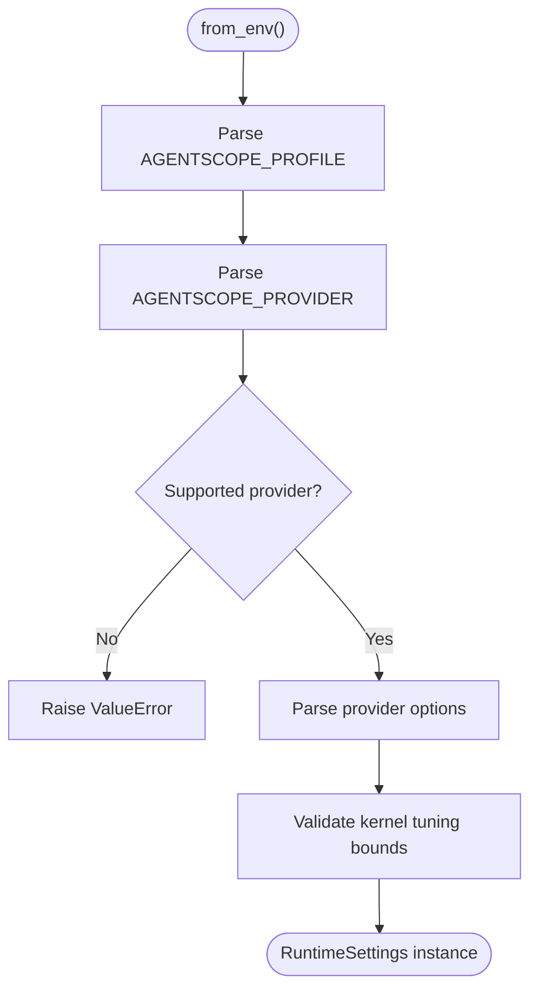
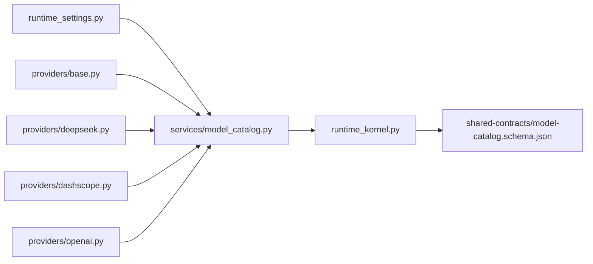

# SPEC-026: Multi-Model Runtime Catalog

<cite>
**Referenced Files in This Document**
- [spec.md](file://docs/specs/SPEC-026-multi-model-runtime-catalog/spec.md)
- [plan.md](file://docs/specs/SPEC-026-multi-model-runtime-catalog/plan.md)
- [tasks.md](file://docs/specs/SPEC-026-multi-model-runtime-catalog/tasks.md)
- [base.py](file://products/agent-platform/src/agent_service/providers/base.py)
- [deepseek.py](file://products/agent-platform/src/agent_service/providers/deepseek.py)
- [dashscope.py](file://products/agent-platform/src/agent_service/providers/dashscope.py)
- [openai.py](file://products/agent-platform/src/agent_service/providers/openai.py)
- [model_catalog.py](file://products/agent-platform/src/agent_service/services/model_catalog.py)
- [runtime_settings.py](file://products/agent-platform/src/agent_service/runtime_settings.py)
- [runtime_kernel.py](file://products/agent-platform/src/agent_service/runtime_kernel.py)
- [model-catalog.schema.json](file://shared/shared-contracts/schemas/model-catalog.schema.json)
</cite>

## Table of Contents
1. [Introduction](#introduction)
2. [Project Structure](#project-structure)
3. [Core Components](#core-components)
4. [Architecture Overview](#architecture-overview)
5. [Detailed Component Analysis](#detailed-component-analysis)
6. [Dependency Analysis](#dependency-analysis)
7. [Performance Considerations](#performance-considerations)
8. [Troubleshooting Guide](#troubleshooting-guide)
9. [Conclusion](#conclusion)
10. [Appendices](#appendices)

## Introduction
SPEC-026 extends the credential-gated model catalog introduced by SPEC-024 so that each configured provider exposes its full curated model series instead of a single entry per provider. Entry identity moves from the provider name to the concrete model name, enabling per-session model selection without redeploying or restarting. Legacy provider-name identifiers remain supported via an alias map for backward compatibility with pinned sessions and older requests. The runtime profile is decoupled from the provider and consolidated into a generic deployment label.

Key outcomes:
- Each enabled provider contributes one catalog entry per model in its curated series (or override).
- Catalog entries are identified by model name; the active profile’s resolved default model is marked as default.
- Legacy provider-name ids resolve to the provider’s default entry.
- Duplicate model names across providers fail startup to prevent misconfiguration.
- GitOps runtime profiles consolidate to a single generic profile layout.

**Section sources**
- [spec.md:13-135](file://docs/specs/SPEC-026-multi-model-runtime-catalog/spec.md#L13-L135)
- [plan.md:3-31](file://docs/specs/SPEC-026-multi-model-runtime-catalog/plan.md#L3-L31)

## Project Structure
The multi-model runtime catalog spans three layers:
- Provider adapters define curated model series and build concrete models.
- Runtime settings parse environment configuration and validate constraints.
- Model catalog builds the startup-time catalog and provides lookup with legacy aliases.
- Runtime kernel resolves model ids per session and enforces fail-closed behavior on unknown ids.

**Diagram sources**
- [base.py:14-24](file://products/agent-platform/src/agent_service/providers/base.py#L14-L24)
- [deepseek.py:9-14](file://products/agent-platform/src/agent_service/providers/deepseek.py#L9-L14)
- [dashscope.py:9-14](file://products/agent-platform/src/agent_service/providers/dashscope.py#L9-L14)
- [openai.py:9-14](file://products/agent-platform/src/agent_service/providers/openai.py#L9-L14)
- [runtime_settings.py:32-37](file://products/agent-platform/src/agent_service/runtime_settings.py#L32-L37)
- [model_catalog.py:110-146](file://products/agent-platform/src/agent_service/services/model_catalog.py#L110-L146)
- [runtime_kernel.py:216-246](file://products/agent-platform/src/agent_service/runtime_kernel.py#L216-L246)
- [model-catalog.schema.json:1-43](file://shared/shared-contracts/schemas/model-catalog.schema.json#L1-L43)

**Section sources**
- [base.py:14-24](file://products/agent-platform/src/agent_service/providers/base.py#L14-L24)
- [model_catalog.py:110-146](file://products/agent-platform/src/agent_service/services/model_catalog.py#L110-L146)
- [runtime_kernel.py:216-246](file://products/agent-platform/src/agent_service/runtime_kernel.py#L216-L246)

## Core Components
- Provider adapters expose a curated `model_series` tuple and a `default_model`. They validate credentials and build concrete AgentScope models using resolved settings.
- Runtime settings parse environment variables, enforce validation bounds, and provide helper methods to resolve the effective model name and base URL.
- Model catalog constructs a startup-time list of selectable models, enforces uniqueness, marks the deploy-time default, and exposes discovery-safe public views. It also builds legacy aliases mapping bare provider names to their default model entry.
- Runtime kernel resolves model ids per turn/session, supports switching between models within a session, and fails closed when encountering unknown ids.

Key behaviors:
- Credential gating: only providers with resolvable API keys contribute entries.
- Series override: `<PROVIDER>_MODELS` can restrict or replace the curated series while ensuring the default model remains selectable.
- Legacy compatibility: bare provider names resolve to the provider’s default entry.
- Fail-closed: unknown model ids produce explicit errors rather than silent fallbacks.

**Section sources**
- [base.py:14-54](file://products/agent-platform/src/agent_service/providers/base.py#L14-L54)
- [deepseek.py:9-41](file://products/agent-platform/src/agent_service/providers/deepseek.py#L9-L41)
- [dashscope.py:9-42](file://products/agent-platform/src/agent_service/providers/dashscope.py#L9-L42)
- [openai.py:9-44](file://products/agent-platform/src/agent_service/providers/openai.py#L9-L44)
- [runtime_settings.py:114-175](file://products/agent-platform/src/agent_service/runtime_settings.py#L114-L175)
- [model_catalog.py:42-62](file://products/agent-platform/src/agent_service/services/model_catalog.py#L42-L62)
- [model_catalog.py:82-146](file://products/agent-platform/src/agent_service/services/model_catalog.py#L82-L146)
- [model_catalog.py:149-212](file://products/agent-platform/src/agent_service/services/model_catalog.py#L149-L212)
- [runtime_kernel.py:31-37](file://products/agent-platform/src/agent_service/runtime_kernel.py#L31-L37)
- [runtime_kernel.py:216-261](file://products/agent-platform/src/agent_service/runtime_kernel.py#L216-L261)

## Architecture Overview
The catalog is built once at startup from environment configuration and provider adapters. At request time, the kernel resolves the requested model id through the catalog, including legacy aliases, and constructs the appropriate provider model instance.

**Diagram sources**
- [runtime_kernel.py:674-725](file://products/agent-platform/src/agent_service/runtime_kernel.py#L674-L725)
- [runtime_kernel.py:754-780](file://products/agent-platform/src/agent_service/runtime_kernel.py#L754-L780)
- [model_catalog.py:149-185](file://products/agent-platform/src/agent_service/services/model_catalog.py#L149-L185)
- [base.py:51-54](file://products/agent-platform/src/agent_service/providers/base.py#L51-L54)

## Detailed Component Analysis

### Provider Adapters
Each provider adapter defines:
- A provider name and default model.
- A curated model series tuple.
- A `build_model` method that validates settings and constructs the concrete model with parameters.

**Diagram sources**
- [base.py:14-54](file://products/agent-platform/src/agent_service/providers/base.py#L14-L54)
- [deepseek.py:9-41](file://products/agent-platform/src/agent_service/providers/deepseek.py#L9-L41)
- [dashscope.py:9-42](file://products/agent-platform/src/agent_service/providers/dashscope.py#L9-L42)
- [openai.py:9-44](file://products/agent-platform/src/agent_service/providers/openai.py#L9-L44)

**Section sources**
- [deepseek.py:9-41](file://products/agent-platform/src/agent_service/providers/deepseek.py#L9-L41)
- [dashscope.py:9-42](file://products/agent-platform/src/agent_service/providers/dashscope.py#L9-L42)
- [openai.py:9-44](file://products/agent-platform/src/agent_service/providers/openai.py#L9-L44)

### Model Catalog Construction and Lookup
The catalog builder iterates supported providers, resolves credentials and series, ensures the default model is always included, emits one entry per model, and guards against duplicate ids. The lookup supports legacy provider-name aliases.

**Diagram sources**
- [model_catalog.py:82-146](file://products/agent-platform/src/agent_service/services/model_catalog.py#L82-L146)
- [model_catalog.py:188-212](file://products/agent-platform/src/agent_service/services/model_catalog.py#L188-L212)

**Section sources**
- [model_catalog.py:82-146](file://products/agent-platform/src/agent_service/services/model_catalog.py#L82-L146)
- [model_catalog.py:149-212](file://products/agent-platform/src/agent_service/services/model_catalog.py#L149-L212)

### Kernel Model Resolution and Session Switching
The kernel normalizes model ids, resolves them through the catalog, and builds the correct provider model. It enforces fail-closed behavior for unknown ids and supports per-session model switching by rebuilding the agent when the bound model changes.

**Diagram sources**
- [runtime_kernel.py:216-246](file://products/agent-platform/src/agent_service/runtime_kernel.py#L216-L246)
- [runtime_kernel.py:248-261](file://products/agent-platform/src/agent_service/runtime_kernel.py#L248-L261)
- [runtime_kernel.py:566-633](file://products/agent-platform/src/agent_service/runtime_kernel.py#L566-L633)

**Section sources**
- [runtime_kernel.py:216-261](file://products/agent-platform/src/agent_service/runtime_kernel.py#L216-L261)
- [runtime_kernel.py:566-633](file://products/agent-platform/src/agent_service/runtime_kernel.py#L566-L633)

### Runtime Settings and Profile Decoupling
Runtime settings parse environment variables, validate kernel tuning knobs, and support a free-form profile label decoupled from the provider. Provider-specific options are parsed per provider type.

**Diagram sources**
- [runtime_settings.py:278-335](file://products/agent-platform/src/agent_service/runtime_settings.py#L278-L335)
- [runtime_settings.py:171-231](file://products/agent-platform/src/agent_service/runtime_settings.py#L171-L231)

**Section sources**
- [runtime_settings.py:114-175](file://products/agent-platform/src/agent_service/runtime_settings.py#L114-L175)
- [runtime_settings.py:278-335](file://products/agent-platform/src/agent_service/runtime_settings.py#L278-L335)

### Contract Schema Update
The shared contract schema documents that the catalog entry `id` is the model name and describes the envelope returned by model endpoints.

**Section sources**
- [model-catalog.schema.json:1-43](file://shared/shared-contracts/schemas/model-catalog.schema.json#L1-L43)

## Dependency Analysis
- Provider adapters depend on runtime settings to resolve credentials and base URLs.
- Model catalog depends on runtime settings and provider adapters to build entries.
- Runtime kernel depends on the catalog singleton for resolution and on provider adapters for model construction.
- Shared contract schema constrains the public catalog envelope.

**Diagram sources**
- [runtime_settings.py:278-335](file://products/agent-platform/src/agent_service/runtime_settings.py#L278-L335)
- [model_catalog.py:110-146](file://products/agent-platform/src/agent_service/services/model_catalog.py#L110-L146)
- [runtime_kernel.py:216-246](file://products/agent-platform/src/agent_service/runtime_kernel.py#L216-L246)
- [model-catalog.schema.json:1-43](file://shared/shared-contracts/schemas/model-catalog.schema.json#L1-L43)

**Section sources**
- [model_catalog.py:110-146](file://products/agent-platform/src/agent_service/services/model_catalog.py#L110-L146)
- [runtime_kernel.py:216-246](file://products/agent-platform/src/agent_service/runtime_kernel.py#L216-L246)

## Performance Considerations
- Startup catalog construction is O(P*M) where P is the number of supported providers and M is the number of models per provider; this is negligible at service start.
- Per-request model lookup is O(1) due to dictionary-based indexing.
- Session-scoped agent caching avoids repeated model and toolkit construction; model switches trigger controlled rebuilds only when necessary.
- Evidence persistence and toolkit discovery are guarded to avoid blocking or poisoning caches.

[No sources needed since this section provides general guidance]

## Troubleshooting Guide
Common issues and resolutions:
- Unknown model id: The kernel rejects unknown ids explicitly; verify the id exists in the catalog and that the provider is configured with credentials.
- Duplicate model id: Startup fails with a clear error if two providers advertise the same model name; adjust curated series or overrides to remove collisions.
- Missing credentials: Providers without resolvable API keys do not contribute entries; ensure the appropriate provider API key is set.
- Legacy id mismatch: If a pinned session uses a bare provider name, it should resolve to the provider’s default entry; if not, check that the provider is enabled and has credentials.

**Section sources**
- [runtime_kernel.py:31-37](file://products/agent-platform/src/agent_service/runtime_kernel.py#L31-L37)
- [model_catalog.py:132-140](file://products/agent-platform/src/agent_service/services/model_catalog.py#L132-L140)
- [model_catalog.py:168-175](file://products/agent-platform/src/agent_service/services/model_catalog.py#L168-L175)

## Conclusion
SPEC-026 delivers a robust, operator-friendly multi-model runtime catalog. Operators can now select among a provider’s curated model lineup per session without redeployment, while preserving backward compatibility for legacy identifiers. The design keeps credentials local to the catalog layer, enforces fail-closed behavior on unknown selections, and consolidates runtime profiles for simpler GitOps management.

[No sources needed since this section summarizes without analyzing specific files]

## Appendices

### Acceptance Criteria Mapping
- R-1 (per-provider model series, credential-gated): implemented via provider `model_series`, credential checks, and force-included default model.
- R-2 (model-name entry identity): catalog entries use model names as ids; default flag marks the active profile’s resolved model.
- R-3 (legacy id compatibility): alias map resolves bare provider names to default entries; unresolvable legacy ids fall back appropriately.
- R-4 (series override): `<PROVIDER>_MODELS` parsing and merge with default model.
- R-5 (generic profile + gitops consolidation): profile decoupled from provider; plan outlines consolidation steps.

**Section sources**
- [spec.md:36-135](file://docs/specs/SPEC-026-multi-model-runtime-catalog/spec.md#L36-L135)
- [plan.md:11-31](file://docs/specs/SPEC-026-multi-model-runtime-catalog/plan.md#L11-L31)