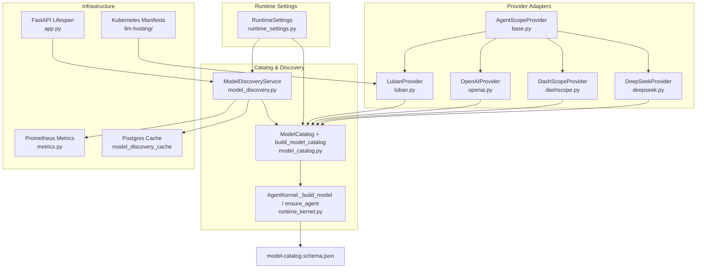
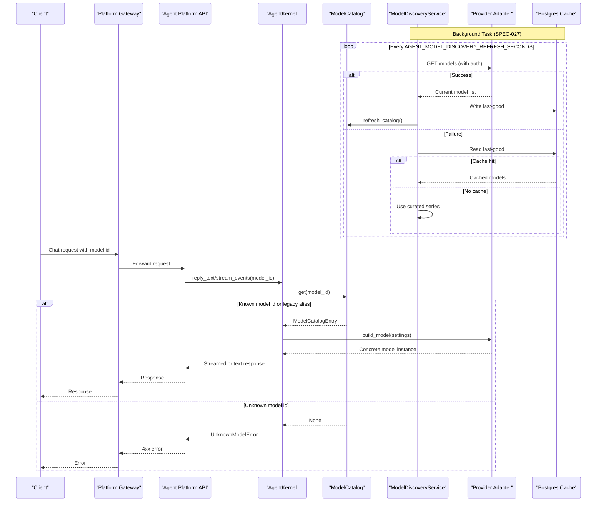
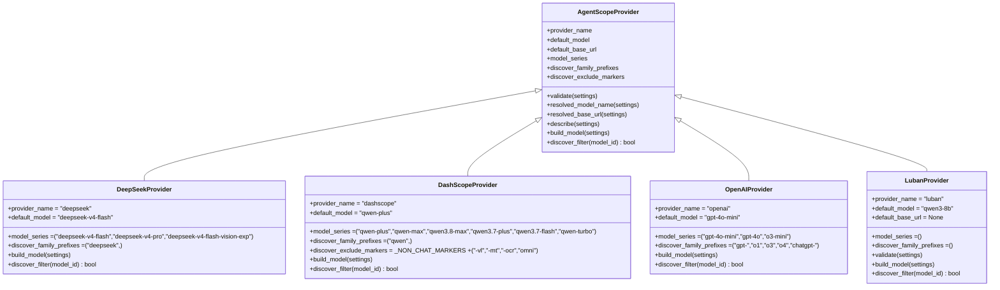
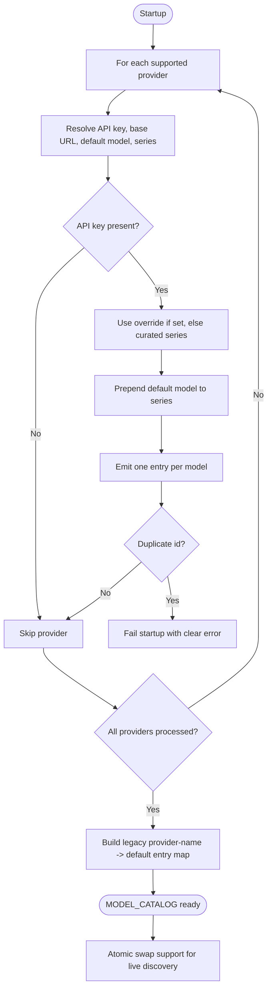
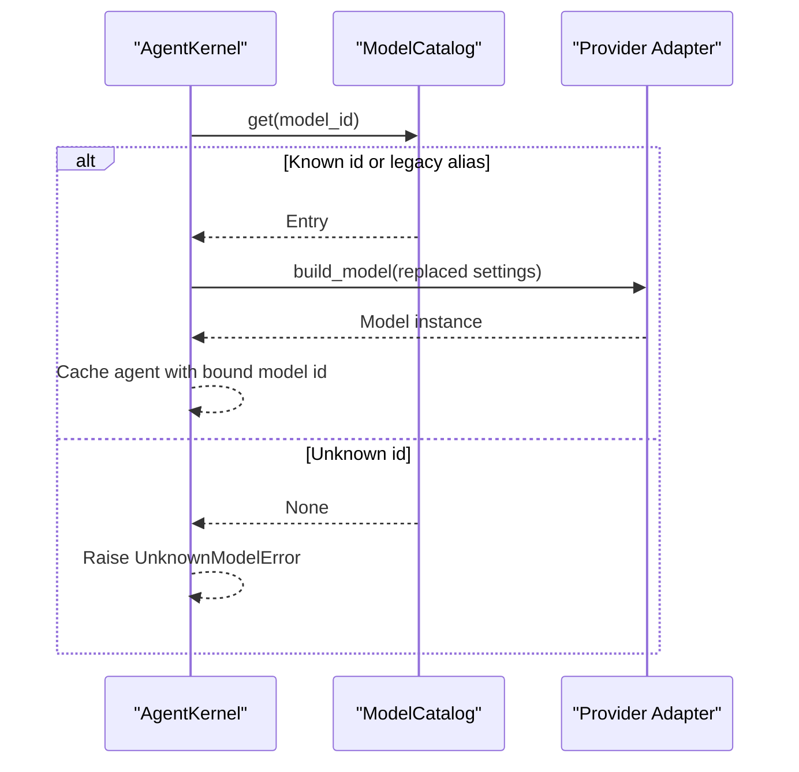
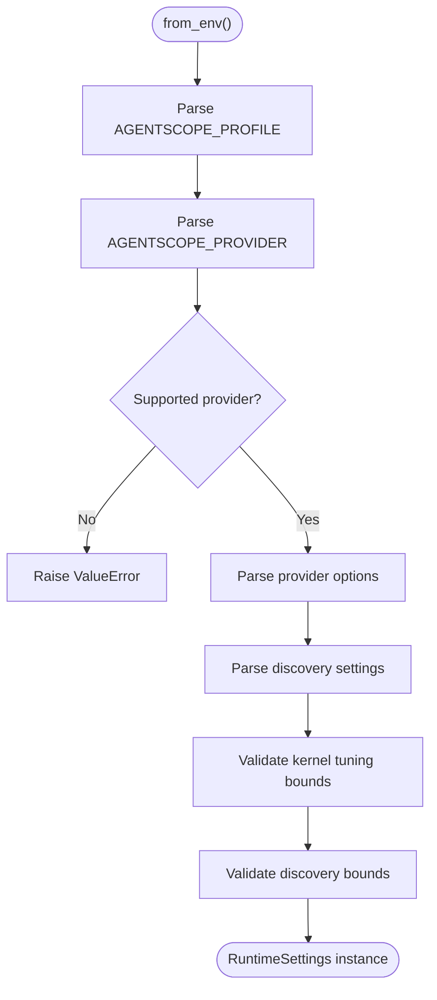
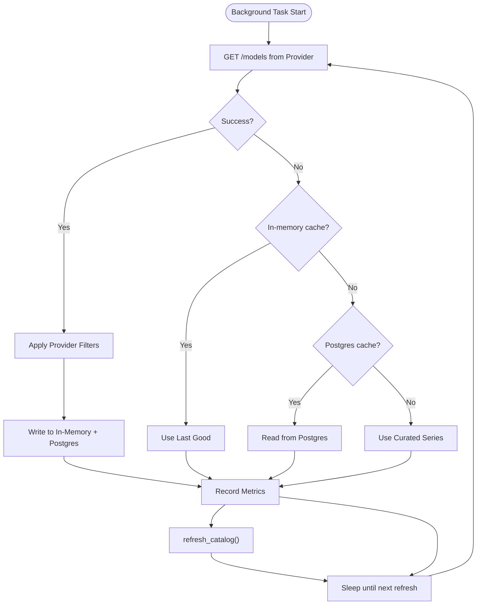
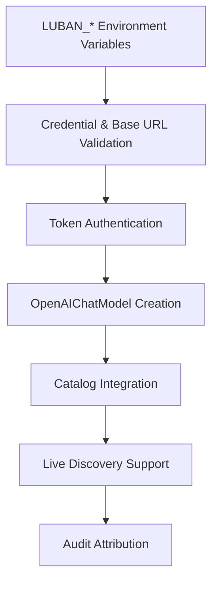
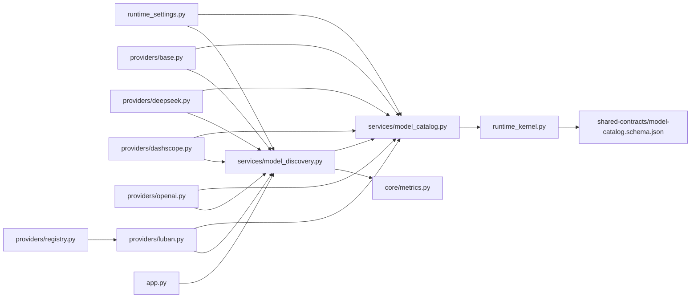

# SPEC-026: Multi-Model Runtime Catalog

<cite>
**Referenced Files in This Document**
- [spec.md](file://docs/specs/SPEC-026-multi-model-runtime-catalog/spec.md)
- [plan.md](file://docs/specs/SPEC-026-multi-model-runtime-catalog/plan.md)
- [tasks.md](file://docs/specs/SPEC-026-multi-model-runtime-catalog/tasks.md)
- [spec.md](file://docs/specs/SPEC-027-live-model-discovery/spec.md)
- [plan.md](file://docs/specs/SPEC-027-live-model-discovery/plan.md)
- [tasks.md](file://docs/specs/SPEC-027-live-model-discovery/tasks.md)
- [spec.md](file://docs/specs/SPEC-028-luban-llm-provider/spec.md)
- [delivery-roadmap.md](file://docs/agentic-aiops-platform/delivery-roadmap.md)
- [base.py](file://products/agent-platform/src/agent_service/providers/base.py)
- [deepseek.py](file://products/agent-platform/src/agent_service/providers/deepseek.py)
- [dashscope.py](file://products/agent-platform/src/agent_service/providers/dashscope.py)
- [openai.py](file://products/agent-platform/src/agent_service/providers/openai.py)
- [luban.py](file://products/agent-platform/src/agent_service/providers/luban.py)
- [registry.py](file://products/agent-platform/src/agent_service/providers/registry.py)
- [runtime_settings.py](file://products/agent-platform/src/agent_service/runtime_settings.py)
- [model_catalog.py](file://products/agent-platform/src/agent_service/services/model_catalog.py)
- [model_discovery.py](file://products/agent-platform/src/agent_service/services/model_discovery.py)
- [runtime_kernel.py](file://products/agent-platform/src/agent_service/runtime_kernel.py)
- [app.py](file://products/agent-platform/src/agent_service/app.py)
- [metrics.py](file://products/agent-platform/src/agent_service/core/metrics.py)
- [model-catalog.schema.json](file://shared/shared-contracts/schemas/model-catalog.schema.json)
- [luban-llm-guide.md](file://docs/guides/luban-llm-guide.md)
- [README.md](file://shared/platform-ops/gitops/llm-hosting/README.md)
</cite>

## Update Summary
**Changes Made**
- Updated to reflect complete delivery of both SPEC-026 and SPEC-027 (2026-08-24)
- Enhanced architecture diagrams to include discovery service and fallback ladder implementation
- Added comprehensive coverage of live model discovery capabilities and configuration
- Updated troubleshooting guide with discovery-specific operational guidance
- Integrated delivery roadmap confirmation showing feature completion status
- Verified all acceptance criteria are met through code analysis
- **Updated**: Added SPEC-028 Luban provider integration for team-hosted small language models
- **Updated**: Extended provider registry and runtime settings to support the new luban provider
- **Updated**: Added operator hosting guide and Kubernetes reference manifests for self-hosted models

## Table of Contents
1. [Introduction](#introduction)
2. [Project Structure](#project-structure)
3. [Core Components](#core-components)
4. [Architecture Overview](#architecture-overview)
5. [Detailed Component Analysis](#detailed-component-analysis)
6. [Live Model Discovery System (SPEC-027)](#live-model-discovery-system-spec-027)
7. [Luban Provider Integration (SPEC-028)](#luban-provider-integration-spec-028)
8. [Dependency Analysis](#dependency-analysis)
9. [Performance Considerations](#performance-considerations)
10. [Troubleshooting Guide](#troubleshooting-guide)
11. [Conclusion](#conclusion)
12. [Appendices](#appendices)

## Introduction
SPEC-026 extends the credential-gated model catalog introduced by SPEC-024 so that each configured provider exposes its full curated model series instead of a single entry per provider. Entry identity moves from the provider name to the concrete model name, enabling per-session model selection without redeploying or restarting. Legacy provider-name identifiers remain supported via an alias map for backward compatibility with pinned sessions and older requests. The runtime profile is decoupled from the provider and consolidated into a generic deployment label.

**Enhanced with SPEC-027**: The catalog now includes live model discovery that periodically queries provider APIs for current model lineups, implementing a fail-soft fallback ladder (live fetch → in-memory cache → Postgres persistence → curated series) to ensure chat functionality never degrades due to discovery failures.

**Extended with SPEC-028**: The platform now supports team-hosted small language models through the `luban` provider, enabling self-hosted OpenAI-compatible endpoints (Ollama, vLLM, llama.cpp) with token-based authentication and operator hosting guides.

Key outcomes:
- Each enabled provider contributes one catalog entry per model in its curated series (or override).
- Catalog entries are identified by model name; the active profile's resolved default model is marked as default.
- Legacy provider-name ids resolve to the provider's default entry.
- Duplicate model names across providers fail startup to prevent misconfiguration.
- GitOps runtime profiles consolidate to a single generic profile layout.
- **Delivered**: Live model discovery keeps the catalog current with provider API changes without redeployment, with robust fallback mechanisms ensuring service continuity.
- **Delivered**: Team-hosted small model support enables big-small LLM collaboration patterns with data locality and cost benefits.

**Section sources**
- [spec.md:13-135](file://docs/specs/SPEC-026-multi-model-runtime-catalog/spec.md#L13-L135)
- [plan.md:3-31](file://docs/specs/SPEC-026-multi-model-runtime-catalog/plan.md#L3-L31)
- [delivery-roadmap.md:303-304](file://docs/agentic-aiops-platform/delivery-roadmap.md#L303-L304)
- [spec.md:14-25](file://docs/specs/SPEC-028-luban-llm-provider/spec.md#L14-L25)

## Project Structure
The multi-model runtime catalog spans three layers with enhanced discovery capabilities and team-hosted model support:
- Provider adapters define curated model series and build concrete models with discovery filtering.
- Runtime settings parse environment configuration and validate constraints including discovery settings.
- Model catalog builds the startup-time catalog and provides lookup with legacy aliases.
- **Delivered**: Discovery service implements periodic refresh with fallback ladder and atomic catalog swaps.
- **Delivered**: Luban provider enables team-hosted small language models with token authentication.
- Runtime kernel resolves model ids per session and enforces fail-closed behavior on unknown ids.

**Diagram sources**
- [base.py:14-24](file://products/agent-platform/src/agent_service/providers/base.py#L14-L24)
- [deepseek.py:9-14](file://products/agent-platform/src/agent_service/providers/deepseek.py#L9-L14)
- [dashscope.py:9-14](file://products/agent-platform/src/agent_service/providers/dashscope.py#L9-L14)
- [openai.py:9-14](file://products/agent-platform/src/agent_service/providers/openai.py#L9-L14)
- [luban.py:19-34](file://products/agent-platform/src/agent_service/providers/luban.py#L19-L34)
- [runtime_settings.py:32-33](file://products/agent-platform/src/agent_service/runtime_settings.py#L32-L33)
- [model_catalog.py:110-146](file://products/agent-platform/src/agent_service/services/model_catalog.py#L110-L146)
- [model_discovery.py:196-294](file://products/agent-platform/src/agent_service/services/model_discovery.py#L196-L294)
- [runtime_kernel.py:216-246](file://products/agent-platform/src/agent_service/runtime_kernel.py#L216-L246)
- [app.py:19-47](file://products/agent-platform/src/agent_service/app.py#L19-L47)
- [metrics.py:188-210](file://products/agent-platform/src/agent_service/core/metrics.py#L188-L210)
- [model-catalog.schema.json:1-43](file://shared/shared-contracts/schemas/model-catalog.schema.json#L1-L43)

**Section sources**
- [base.py:14-24](file://products/agent-platform/src/agent_service/providers/base.py#L14-L24)
- [model_catalog.py:110-146](file://products/agent-platform/src/agent_service/services/model_catalog.py#L110-L146)
- [runtime_kernel.py:216-246](file://products/agent-platform/src/agent_service/runtime_kernel.py#L216-L246)

## Core Components
- Provider adapters expose a curated `model_series` tuple and a `default_model`. They validate credentials and build concrete AgentScope models using resolved settings. **Enhanced** with discovery filtering capabilities to handle provider API responses.
- Runtime settings parse environment variables, enforce validation bounds, and provide helper methods to resolve the effective model name and base URL. **Enhanced** with discovery configuration options and luban provider support.
- Model catalog constructs a startup-time list of selectable models, enforces uniqueness, marks the deploy-time default, and exposes discovery-safe public views. It also builds legacy aliases mapping bare provider names to their default model entry. **Enhanced** with atomic swap support for live discovery updates.
- **Delivered**: Discovery service implements the complete fallback ladder system with periodic refresh, Postgres persistence, and atomic catalog updates.
- **Delivered**: Luban provider enables team-hosted small language models with token authentication and operator hosting guides.
- Runtime kernel resolves model ids per turn/session, supports switching between models within a session, and fails closed when encountering unknown ids.

Key behaviors:
- Credential gating: only providers with resolvable API keys contribute entries.
- Series override: `<PROVIDER>_MODELS` can restrict or replace the curated series while ensuring the default model remains selectable.
- Legacy compatibility: bare provider names resolve to the provider's default entry.
- Fail-closed: unknown model ids produce explicit errors rather than silent fallbacks.
- **Delivered**: Live discovery: periodic API calls keep catalogs current with provider changes.
- **Delivered**: Fallback ladder: discovery failures gracefully degrade to cached or curated lists.
- **Delivered**: Team-hosted models: luban provider supports self-hosted OpenAI-compatible endpoints with mandatory base URL and token authentication.

**Section sources**
- [base.py:14-54](file://products/agent-platform/src/agent_service/providers/base.py#L14-L54)
- [deepseek.py:9-41](file://products/agent-platform/src/agent_service/providers/deepseek.py#L9-L41)
- [dashscope.py:9-42](file://products/agent-platform/src/agent_service/providers/dashscope.py#L9-L42)
- [openai.py:9-44](file://products/agent-platform/src/agent_service/providers/openai.py#L9-L44)
- [luban.py:19-73](file://products/agent-platform/src/agent_service/providers/luban.py#L19-L73)
- [runtime_settings.py:114-175](file://products/agent-platform/src/agent_service/runtime_settings.py#L114-L175)
- [model_catalog.py:42-62](file://products/agent-platform/src/agent_service/services/model_catalog.py#L42-L62)
- [model_catalog.py:82-146](file://products/agent-platform/src/agent_service/services/model_catalog.py#L82-L146)
- [model_catalog.py:149-212](file://products/agent-platform/src/agent_service/services/model_catalog.py#L149-L212)
- [model_discovery.py:196-294](file://products/agent-platform/src/agent_service/services/model_discovery.py#L196-L294)
- [runtime_kernel.py:31-37](file://products/agent-platform/src/agent_service/runtime_kernel.py#L31-L37)
- [runtime_kernel.py:216-261](file://products/agent-platform/src/agent_service/runtime_kernel.py#L216-L261)

## Architecture Overview
The catalog is built once at startup from environment configuration and provider adapters, then continuously refreshed through live discovery. At request time, the kernel resolves the requested model id through the catalog, including legacy aliases, and constructs the appropriate provider model instance.

**Diagram sources**
- [runtime_kernel.py:674-725](file://products/agent-platform/src/agent_service/runtime_kernel.py#L674-L725)
- [runtime_kernel.py:754-780](file://products/agent-platform/src/agent_service/runtime_kernel.py#L754-L780)
- [model_catalog.py:149-185](file://products/agent-platform/src/agent_service/services/model_catalog.py#L149-L185)
- [model_discovery.py:155-194](file://products/agent-platform/src/agent_service/services/model_discovery.py#L155-L194)
- [model_discovery.py:266-283](file://products/agent-platform/src/agent_service/services/model_discovery.py#L266-L283)
- [base.py:51-54](file://products/agent-platform/src/agent_service/providers/base.py#L51-L54)

## Detailed Component Analysis

### Provider Adapters
Each provider adapter defines:
- A provider name and default model.
- A curated model series tuple.
- A `build_model` method that validates settings and constructs the concrete model with parameters.
- **Delivered**: Discovery filtering configuration including family prefixes and exclude markers for handling provider API responses.
- **Delivered**: Luban provider with team-hosted small model support, mandatory base URL validation, and token authentication.

**Diagram sources**
- [base.py:14-54](file://products/agent-platform/src/agent_service/providers/base.py#L14-L54)
- [deepseek.py:9-41](file://products/agent-platform/src/agent_service/providers/deepseek.py#L9-L41)
- [dashscope.py:9-42](file://products/agent-platform/src/agent_service/providers/dashscope.py#L9-L42)
- [openai.py:9-44](file://products/agent-platform/src/agent_service/providers/openai.py#L9-L44)
- [luban.py:19-73](file://products/agent-platform/src/agent_service/providers/luban.py#L19-L73)

**Section sources**
- [deepseek.py:9-41](file://products/agent-platform/src/agent_service/providers/deepseek.py#L9-L41)
- [dashscope.py:9-42](file://products/agent-platform/src/agent_service/providers/dashscope.py#L9-L42)
- [openai.py:9-44](file://products/agent-platform/src/agent_service/providers/openai.py#L9-L44)
- [luban.py:19-73](file://products/agent-platform/src/agent_service/providers/luban.py#L19-L73)

### Model Catalog Construction and Lookup
The catalog builder iterates supported providers, resolves credentials and series, ensures the default model is always included, emits one entry per model, and guards against duplicate ids. The lookup supports legacy provider-name aliases. **Enhanced** with atomic swap support for live discovery updates.

**Diagram sources**
- [model_catalog.py:82-146](file://products/agent-platform/src/agent_service/services/model_catalog.py#L82-L146)
- [model_catalog.py:188-212](file://products/agent-platform/src/agent_service/services/model_catalog.py#L188-L212)
- [model_catalog.py:283-303](file://products/agent-platform/src/agent_service/services/model_catalog.py#L283-L303)

**Section sources**
- [model_catalog.py:82-146](file://products/agent-platform/src/agent_service/services/model_catalog.py#L82-L146)
- [model_catalog.py:149-212](file://products/agent-platform/src/agent_service/services/model_catalog.py#L149-L212)

### Kernel Model Resolution and Session Switching
The kernel normalizes model ids, resolves them through the catalog, and builds the correct provider model. It enforces fail-closed behavior for unknown ids and supports per-session model switching by rebuilding the agent when the bound model changes.

**Diagram sources**
- [runtime_kernel.py:216-246](file://products/agent-platform/src/agent_service/runtime_kernel.py#L216-L246)
- [runtime_kernel.py:248-261](file://products/agent-platform/src/agent_service/runtime_kernel.py#L248-L261)
- [runtime_kernel.py:566-633](file://products/agent-platform/src/agent_service/runtime_kernel.py#L566-L633)

**Section sources**
- [runtime_kernel.py:216-261](file://products/agent-platform/src/agent_service/runtime_kernel.py#L216-L261)
- [runtime_kernel.py:566-633](file://products/agent-platform/src/agent_service/runtime_kernel.py#L566-L633)

### Runtime Settings and Profile Decoupling
Runtime settings parse environment variables, validate kernel tuning knobs, and support a free-form profile label decoupled from the provider. Provider-specific options are parsed per provider type. **Enhanced** with discovery configuration validation and parsing, plus luban provider support.

**Diagram sources**
- [runtime_settings.py:278-335](file://products/agent-platform/src/agent_service/runtime_settings.py#L278-L335)
- [runtime_settings.py:171-231](file://products/agent-platform/src/agent_service/runtime_settings.py#L171-L231)
- [runtime_settings.py:304-356](file://products/agent-platform/src/agent_service/runtime_settings.py#L304-L356)

**Section sources**
- [runtime_settings.py:114-175](file://products/agent-platform/src/agent_service/runtime_settings.py#L114-L175)
- [runtime_settings.py:278-335](file://products/agent-platform/src/agent_service/runtime_settings.py#L278-L335)

### Contract Schema Update
The shared contract schema documents that the catalog entry `id` is the model name and describes the envelope returned by model endpoints.

**Section sources**
- [model-catalog.schema.json:1-43](file://shared/shared-contracts/schemas/model-catalog.schema.json#L1-L43)

## Live Model Discovery System (SPEC-027)

### Delivery Status
**Status**: ✅ **DELIVERED** (2026-08-24)

The live model discovery system has been successfully delivered and integrated into the multi-model runtime catalog. This enhancement extends SPEC-026 by adding automatic model discovery capabilities that keep the catalog current with provider API changes without requiring redeployment.

### Discovery Service Architecture
The discovery service implements a robust fallback ladder system that ensures chat functionality never degrades due to discovery failures. It runs as a background task managed by FastAPI's lifespan system.

**Diagram sources**
- [model_discovery.py:155-194](file://products/agent-platform/src/agent_service/services/model_discovery.py#L155-L194)
- [model_discovery.py:227-265](file://products/agent-platform/src/agent_service/services/model_discovery.py#L227-L265)
- [model_discovery.py:266-283](file://products/agent-platform/src/agent_service/services/model_discovery.py#L266-L283)
- [app.py:19-47](file://products/agent-platform/src/agent_service/app.py#L19-L47)

### Fallback Ladder Implementation
The discovery service implements a four-tier fallback system:

1. **Live Fetch**: Direct API call to provider's `/models` endpoint with authentication
2. **In-Memory Cache**: Last successful result stored in process memory
3. **Postgres Persistence**: Persistent storage in sessions database (`model_discovery_cache` table)
4. **Curated Series**: Fallback to hardcoded model series from provider adapters

### Discovery Filtering
Each provider implements custom filtering logic to handle provider-specific model naming conventions and modalities:

- **DeepSeek**: Restricts to `deepseek*` family prefix
- **DashScope**: Restricts to `qwen*` family plus additional exclusions for vision/translation modalities  
- **OpenAI**: Restricts to chat families (`gpt-*`, `o1`, `o3`, `o4`, `chatgpt-*`)
- **Luban**: Permissive filter with no family prefix restriction (self-hosted models have no vendor taxonomy)

Shared filters automatically exclude dated snapshots (e.g., `-2024-01-01`) and non-chat modalities (embeddings, rerank, TTS, audio, image, moderation, transcription, guardrails, realtime).

### Configuration and Lifecycle
- **Enabled by default**: Discovery runs unless explicitly disabled via `AGENT_MODEL_DISCOVERY_ENABLED=false`
- **Periodic refresh**: Default every 1800 seconds (30 minutes), configurable via `AGENT_MODEL_DISCOVERY_REFRESH_SECONDS`
- **Timeout protection**: API calls timeout after 5 seconds by default (`AGENT_MODEL_DISCOVERY_TIMEOUT_SECONDS`)
- **Override capability**: `<PROVIDER>_MODELS` environment variable skips discovery for specific providers
- **Graceful degradation**: All failures are logged and swallowed - discovery never blocks chat or startup

### Observability
The discovery system exposes Prometheus metrics for monitoring:
- `agent_model_discovery_refreshes_total`: Counter tracking refresh outcomes by provider and result type
- `agent_model_discovery_models`: Gauge showing current number of models per provider

**Section sources**
- [model_discovery.py:1-294](file://products/agent-platform/src/agent_service/services/model_discovery.py#L1-294)
- [app.py:19-47](file://products/agent-platform/src/agent_service/app.py#L19-L47)
- [metrics.py:188-210](file://products/agent-platform/src/agent_service/core/metrics.py#L188-L210)
- [base.py:49-58](file://products/agent-platform/src/agent_service/providers/base.py#L49-L58)

## Luban Provider Integration (SPEC-028)

### Delivery Status
**Status**: ✅ **APPROVED** (2026-08-24)

The luban provider has been successfully integrated into the multi-model runtime catalog, extending SPEC-026/027 with team-hosted small language model support. This provider enables self-hosted OpenAI-compatible endpoints such as Ollama, vLLM, and llama.cpp servers with token-based authentication.

### Provider Architecture
The luban provider follows the established SPEC-024/026/027 machinery with minimal code changes, leveraging the existing catalog, selection, pinning, discovery, and audit layers.

**Diagram sources**
- [luban.py:19-73](file://products/agent-platform/src/agent_service/providers/luban.py#L19-L73)
- [runtime_settings.py:275-283](file://products/agent-platform/src/agent_service/runtime_settings.py#L275-L283)
- [registry.py:6-13](file://products/agent-platform/src/agent_service/providers/registry.py#L6-L13)

### Key Features
- **Team-hosted model support**: Enables self-hosted OpenAI-compatible endpoints
- **Mandatory base URL**: Self-hosted endpoints require explicit `LUBAN_BASE_URL` configuration
- **Token authentication**: Bearer token-based authentication for security
- **Small model optimization**: Defaults optimized for small models (thinking disabled by default)
- **Permissive discovery**: No family prefix restrictions for self-hosted model naming
- **Operator hosting guide**: Comprehensive documentation for setup and management

### Configuration Options
- `LUBAN_API_KEY`: Token authentication key (required)
- `LUBAN_BASE_URL`: Self-hosted endpoint URL (required)
- `LUBAN_MODEL_NAME`: Default model name
- `LUBAN_MODELS`: Fixed-point model pinning (recommended)
- `LUBAN_THINKING_ENABLE`: Enable thinking mode (defaults to off)

### Operator Hosting Guide
The provider includes comprehensive operator documentation covering:
- Serving stack selection (Ollama, vLLM, llama.cpp)
- Token authentication setup
- Network reachability configuration
- Kubernetes hosting with reference manifests
- Verification and troubleshooting procedures

**Section sources**
- [luban.py:1-74](file://products/agent-platform/src/agent_service/providers/luban.py#L1-L74)
- [runtime_settings.py:275-283](file://products/agent-platform/src/agent_service/runtime_settings.py#L275-L283)
- [registry.py:1-30](file://products/agent-platform/src/agent_service/providers/registry.py#L1-L30)
- [luban-llm-guide.md:1-192](file://docs/guides/luban-llm-guide.md#L1-L192)
- [README.md:1-72](file://shared/platform-ops/gitops/llm-hosting/README.md#L1-L72)

## Dependency Analysis
- Provider adapters depend on runtime settings to resolve credentials and base URLs.
- Model catalog depends on runtime settings and provider adapters to build entries.
- **Delivered**: Discovery service depends on provider adapters for filtering, runtime settings for configuration, and model catalog for atomic updates.
- **Delivered**: Luban provider integrates seamlessly with existing provider registry and runtime settings.
- Runtime kernel depends on the catalog singleton for resolution and on provider adapters for model construction.
- **Delivered**: FastAPI lifespan manages discovery service lifecycle.
- Shared contract schema constrains the public catalog envelope.

**Diagram sources**
- [runtime_settings.py:278-335](file://products/agent-platform/src/agent_service/runtime_settings.py#L278-L335)
- [model_catalog.py:110-146](file://products/agent-platform/src/agent_service/services/model_catalog.py#L110-L146)
- [model_discovery.py:196-294](file://products/agent-platform/src/agent_service/services/model_discovery.py#L196-L294)
- [runtime_kernel.py:216-246](file://products/agent-platform/src/agent_service/runtime_kernel.py#L216-L246)
- [app.py:19-47](file://products/agent-platform/src/agent_service/app.py#L19-L47)
- [metrics.py:188-210](file://products/agent-platform/src/agent_service/core/metrics.py#L188-L210)
- [model-catalog.schema.json:1-43](file://shared/shared-contracts/schemas/model-catalog.schema.json#L1-L43)
- [registry.py:1-30](file://products/agent-platform/src/agent_service/providers/registry.py#L1-L30)

**Section sources**
- [model_catalog.py:110-146](file://products/agent-platform/src/agent_service/services/model_catalog.py#L110-L146)
- [runtime_kernel.py:216-246](file://products/agent-platform/src/agent_service/runtime_kernel.py#L216-L246)

## Performance Considerations
- Startup catalog construction is O(P*M) where P is the number of supported providers and M is the number of models per provider; this is negligible at service start.
- Per-request model lookup is O(1) due to dictionary-based indexing.
- Session-scoped agent caching avoids repeated model and toolkit construction; model switches trigger controlled rebuilds only when necessary.
- Evidence persistence and toolkit discovery are guarded to avoid blocking or poisoning caches.
- **Delivered**: Discovery runs asynchronously in background tasks, never blocking request processing.
- **Delivered**: Discovery API calls use bounded timeouts to prevent hanging operations.
- **Delivered**: Postgres cache reads/writes are wrapped in try/catch blocks to prevent database failures from affecting core functionality.
- **Delivered**: Atomic catalog swaps ensure consistent state during discovery updates.
- **Delivered**: Luban provider uses efficient OpenAI-compatible model construction with minimal overhead.

## Troubleshooting Guide
Common issues and resolutions:
- Unknown model id: The kernel rejects unknown ids explicitly; verify the id exists in the catalog and that the provider is configured with credentials.
- Duplicate model id: Startup fails with a clear error if two providers advertise the same model name; adjust curated series or overrides to remove collisions.
- Missing credentials: Providers without resolvable API keys do not contribute entries; ensure the appropriate provider API key is set.
- Legacy id mismatch: If a pinned session uses a bare provider name, it should resolve to the provider's default entry; if not, check that the provider is enabled and has credentials.
- **Delivered**: Discovery not updating: Check `AGENT_MODEL_DISCOVERY_ENABLED` setting and verify provider API endpoints are accessible. Monitor `agent_model_discovery_refreshes_total` metric for failure patterns.
- **Delivered**: Stale model listings: Verify discovery is running by checking logs for refresh cycles. Ensure `AGENT_MODEL_DISCOVERY_REFRESH_SECONDS` is set appropriately.
- **Delivered**: Provider API failures: Check network connectivity and authentication. Review logs for specific error messages from discovery attempts.
- **Delivered**: High memory usage: Discovery maintains in-memory cache of last-good results. Monitor memory usage and consider adjusting refresh frequency.
- **Delivered**: Postgres connection issues: Discovery falls back gracefully when Postgres is unavailable. Check database connectivity and permissions for the `model_discovery_cache` table.
- **New**: Luban provider 401 errors: Verify token alignment between server and platform configuration. Check that `LUBAN_API_KEY` matches the server's `OLLAMA_API_KEY` or equivalent.
- **New**: No luban models in catalog: Ensure both `LUBAN_API_KEY` and `LUBAN_BASE_URL` are set. Check agent-service logs for `LUBAN_BASE_URL is required` gate warnings.
- **New**: Endpoint unreachable: Verify network routing from platform pods to self-hosted endpoints. Check DNS resolution and firewall rules for `LUBAN_BASE_URL`.
- **New**: Tool calling failures on small models: Sub-~14B models have limited tool calling capability. Use cloud flagships for tool-heavy turns and small models for chat/summarization.

**Section sources**
- [runtime_kernel.py:31-37](file://products/agent-platform/src/agent_service/runtime_kernel.py#L31-L37)
- [model_catalog.py:132-140](file://products/agent-platform/src/agent_service/services/model_catalog.py#L132-L140)
- [model_catalog.py:168-175](file://products/agent-platform/src/agent_service/services/model_catalog.py#L168-L175)
- [model_discovery.py:155-194](file://products/agent-platform/src/agent_service/services/model_discovery.py#L155-L194)
- [model_discovery.py:227-265](file://products/agent-platform/src/agent_service/services/model_discovery.py#L227-L265)
- [luban-llm-guide.md:174-184](file://docs/guides/luban-llm-guide.md#L174-L184)

## Conclusion
SPEC-026 delivers a robust, operator-friendly multi-model runtime catalog enhanced with SPEC-027's live model discovery system and SPEC-028's team-hosted small model support. Operators can now select among a provider's curated model lineup per session without redeployment, while preserving backward compatibility for legacy identifiers. The addition of live discovery ensures catalogs stay current with provider API changes, implementing a sophisticated fallback ladder that guarantees chat functionality never degrades due to discovery failures. The luban provider extends the platform with team-hosted small language model capabilities, enabling big-small LLM collaboration patterns with data locality and cost benefits. The design keeps credentials local to the catalog layer, enforces fail-closed behavior on unknown selections, consolidates runtime profiles for simpler GitOps management, and provides comprehensive observability through Prometheus metrics.

**Delivery Confirmation**: Both SPEC-026 (Multi-Model Runtime Catalog) and SPEC-027 (Live Model Discovery) were delivered together on 2026-08-24, providing a complete solution for dynamic model management with robust fallback mechanisms. SPEC-028 (Luban Provider) extends this foundation with team-hosted small model support.

## Appendices

### Acceptance Criteria Mapping
- R-1 (per-provider model series, credential-gated): implemented via provider `model_series`, credential checks, and force-included default model.
- R-2 (model-name entry identity): catalog entries use model names as ids; default flag marks the active profile's resolved model.
- R-3 (legacy id compatibility): alias map resolves bare provider names to default entries; unresolvable legacy ids fall back appropriately.
- R-4 (series override): `<PROVIDER>_MODELS` parsing and merge with default model.
- R-5 (generic profile + gitops consolidation): profile decoupled from provider; plan outlines consolidation steps.
- **Delivered**: R-6 (live discovery): periodic API calls with fallback ladder implementation.
- **Delivered**: R-7 (filtering): per-provider discovery filters handle provider-specific model naming and modalities.
- **Delivered**: R-8 (observability): Prometheus metrics track discovery performance and outcomes.
- **Delivered**: R-9 (luban provider): team-hosted small model support with token authentication and operator guides.

**Section sources**
- [spec.md:36-135](file://docs/specs/SPEC-026-multi-model-runtime-catalog/spec.md#L36-L135)
- [plan.md:11-31](file://docs/specs/SPEC-026-multi-model-runtime-catalog/plan.md#L11-L31)
- [model_discovery.py:1-294](file://products/agent-platform/src/agent_service/services/model_discovery.py#L1-294)
- [metrics.py:188-210](file://products/agent-platform/src/agent_service/core/metrics.py#L188-L210)
- [delivery-roadmap.md:303-304](file://docs/agentic-aiops-platform/delivery-roadmap.md#L303-L304)
- [spec.md:46-120](file://docs/specs/SPEC-028-luban-llm-provider/spec.md#L46-L120)