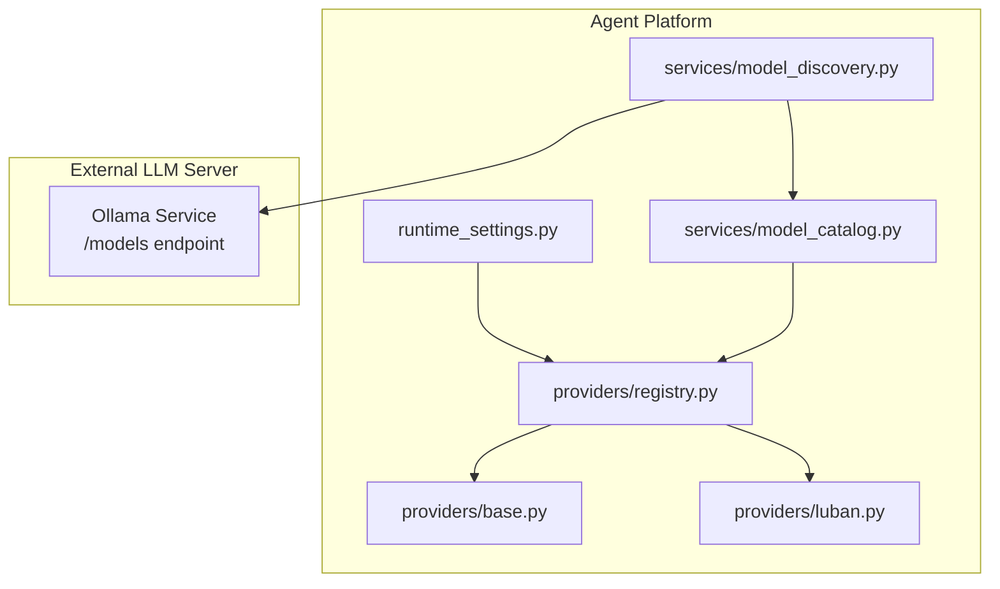
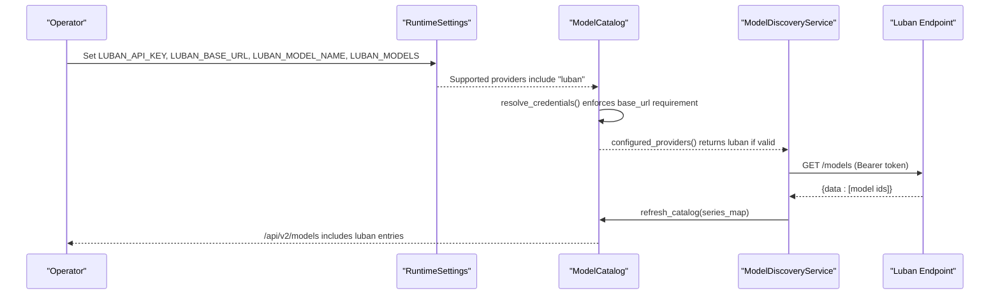
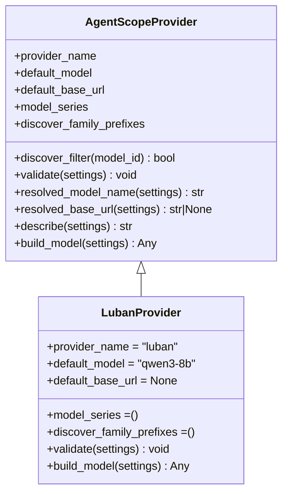
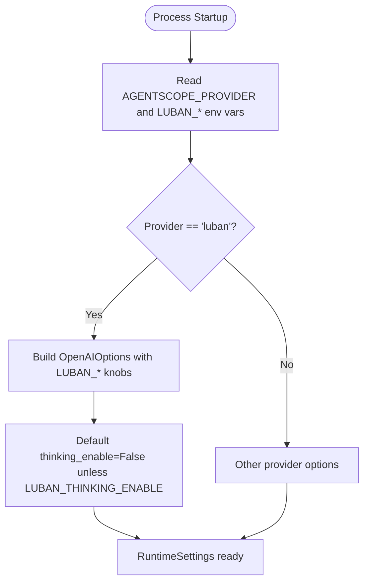
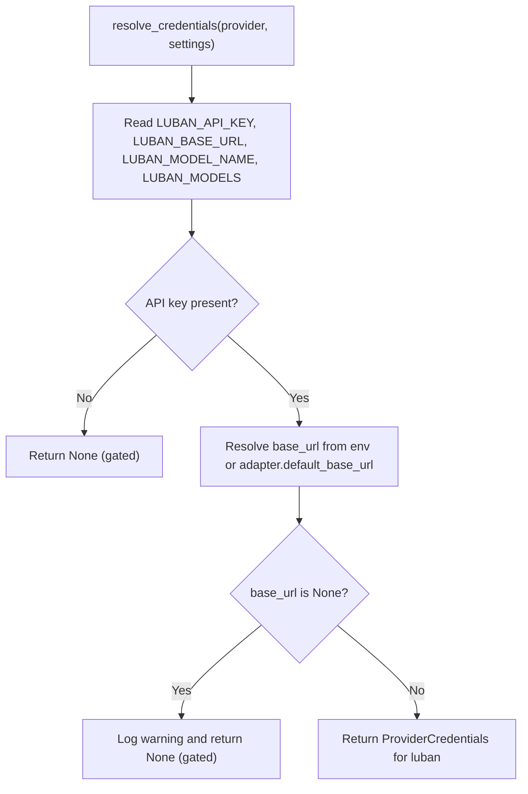
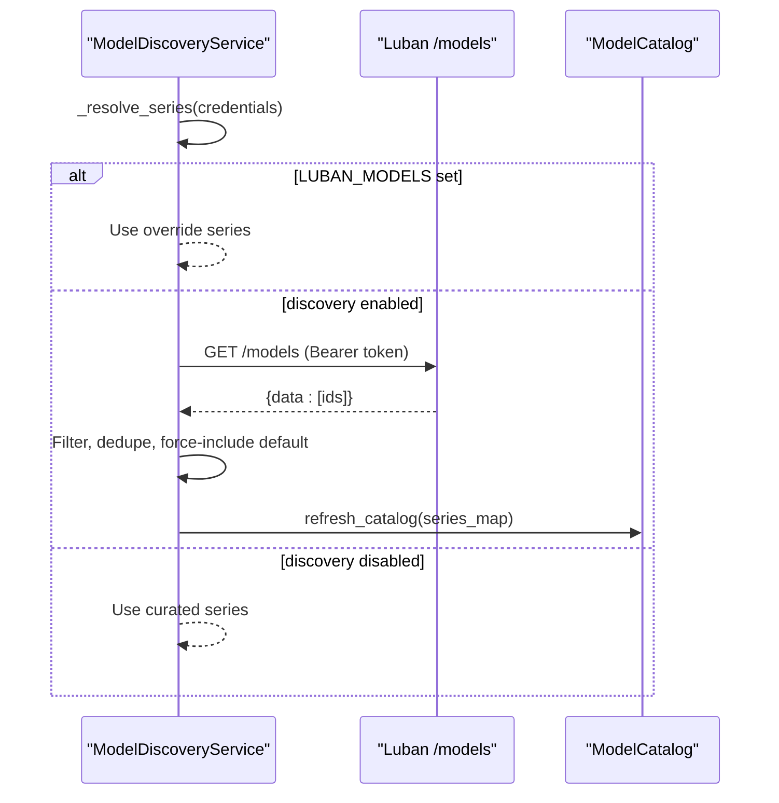
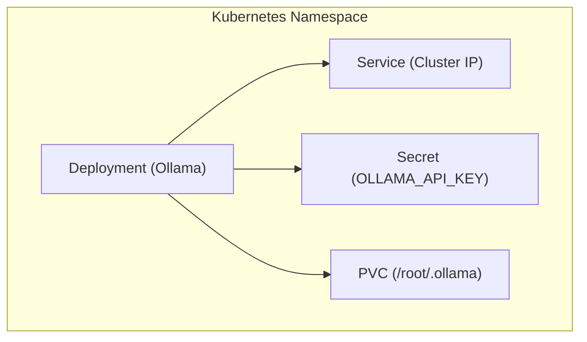
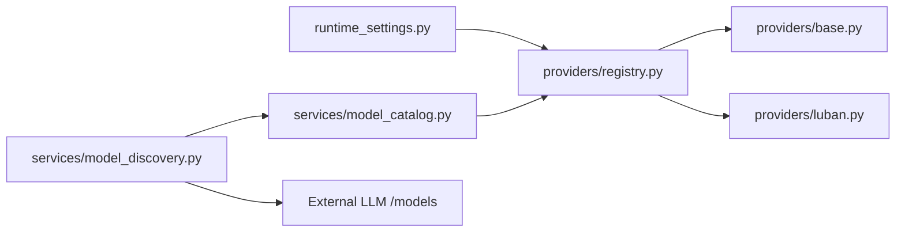

# SPEC-028: Luban Runtime Provider

<cite>
**Referenced Files in This Document**
- [spec.md](file://docs/specs/SPEC-028-luban-llm-provider/spec.md)
- [plan.md](file://docs/specs/SPEC-028-luban-llm-provider/plan.md)
- [tasks.md](file://docs/specs/SPEC-028-luban-llm-provider/tasks.md)
- [luban.py](file://products/agent-platform/src/agent_service/providers/luban.py)
- [base.py](file://products/agent-platform/src/agent_service/providers/base.py)
- [registry.py](file://products/agent-platform/src/agent_service/providers/registry.py)
- [runtime_settings.py](file://products/agent-platform/src/agent_service/runtime_settings.py)
- [model_catalog.py](file://products/agent-platform/src/agent_service/services/model_catalog.py)
- [model_discovery.py](file://products/agent-platform/src/agent_service/services/model_discovery.py)
- [README.md](file://shared/platform-ops/gitops/llm-hosting/README.md)
- [deployment.yaml](file://shared/platform-ops/gitops/llm-hosting/ollama/deployment.yaml)
- [service.yaml](file://shared/platform-ops/gitops/llm-hosting/ollama/service.yaml)
- [secret.yaml](file://shared/platform-ops/gitops/llm-hosting/ollama/secret.yaml)
- [pvc.yaml](file://shared/platform-ops/gitops/llm-hosting/ollama/pvc.yaml)
</cite>

## Table of Contents
1. [Introduction](#introduction)
2. [Project Structure](#project-structure)
3. [Core Components](#core-components)
4. [Architecture Overview](#architecture-overview)
5. [Detailed Component Analysis](#detailed-component-analysis)
6. [Dependency Analysis](#dependency-analysis)
7. [Performance Considerations](#performance-considerations)
8. [Troubleshooting Guide](#troubleshooting-guide)
9. [Conclusion](#conclusion)
10. [Appendices](#appendices)

## Introduction
SPEC-028 introduces a team-hosted “luban” runtime provider that enables the agent platform to call self-hosted OpenAI-compatible LLM endpoints (Ollama, vLLM, llama.cpp llama-server). It reuses the existing multi-model catalog, live discovery, per-turn selection, session pinning, and audit attribution mechanisms. The spec also provides operator-facing hosting guidance and reference Kubernetes manifests for running a small model inside the cluster.

Key goals:
- Add a fourth provider adapter with mandatory base URL and bearer token authentication.
- Reuse catalog and discovery machinery without new code paths for selection or auditing.
- Provide safe defaults for small models (thinking disabled by default).
- Deliver operator documentation and reference Ollama manifests as an opt-in deployment option.

**Section sources**
- [spec.md:14-44](file://docs/specs/SPEC-028-luban-llm-provider/spec.md#L14-L44)
- [plan.md:3-10](file://docs/specs/SPEC-028-luban-llm-provider/plan.md#L3-L10)

## Project Structure
The implementation spans three layers:
- Provider adapter layer: defines the luban adapter and its configuration behavior.
- Catalog and discovery layer: resolves credentials, builds entries, and optionally refreshes from live /models.
- Operator hosting assets: reference Kubernetes resources and README for deploying a small model server.

**Diagram sources**
- [runtime_settings.py:32-33](file://products/agent-platform/src/agent_service/runtime_settings.py#L32-L33)
- [registry.py:9-14](file://products/agent-platform/src/agent_service/providers/registry.py#L9-L14)
- [base.py:32-58](file://products/agent-platform/src/agent_service/providers/base.py#L32-L58)
- [luban.py:9-35](file://products/agent-platform/src/agent_service/providers/luban.py#L9-L35)
- [model_catalog.py:100-138](file://products/agent-platform/src/agent_service/services/model_catalog.py#L100-L138)
- [model_discovery.py:161-199](file://products/agent-platform/src/agent_service/services/model_discovery.py#L161-L199)

**Section sources**
- [spec.md:46-103](file://docs/specs/SPEC-028-luban-llm-provider/spec.md#L46-L103)
- [plan.md:12-41](file://docs/specs/SPEC-028-luban-llm-provider/plan.md#L12-L41)

## Core Components
- LubanProvider: Implements the luban adapter with mandatory base URL validation, OpenAI-compatible model construction, and small-model-safe parameters.
- Base provider utilities: Shared discovery filter logic and common validation helpers reused by all providers.
- Registry: Registers the luban adapter alongside dashscope, deepseek, and openai.
- Runtime settings: Adds luban to supported providers and maps LUBAN_* environment variables into OpenAI-shaped options.
- Model catalog: Enforces the mandatory base URL rule for adapters without a default endpoint and builds selectable entries.
- Model discovery: Periodically fetches /models from the luban endpoint, applies shared filters, and swaps the catalog safely.

**Section sources**
- [luban.py:9-74](file://products/agent-platform/src/agent_service/providers/luban.py#L9-L74)
- [base.py:32-88](file://products/agent-platform/src/agent_service/providers/base.py#L32-L88)
- [registry.py:9-14](file://products/agent-platform/src/agent_service/providers/registry.py#L9-L14)
- [runtime_settings.py:32-33](file://products/agent-platform/src/agent_service/runtime_settings.py#L32-L33)
- [runtime_settings.py:244-297](file://products/agent-platform/src/agent_service/runtime_settings.py#L244-L297)
- [model_catalog.py:100-138](file://products/agent-platform/src/agent_service/services/model_catalog.py#L100-L138)
- [model_discovery.py:220-280](file://products/agent-platform/src/agent_service/services/model_discovery.py#L220-L280)

## Architecture Overview
The luban provider integrates into the existing provider-generic catalog and discovery pipeline. Credentials are resolved at startup; if both API key and base URL are present, the provider is included. Live discovery can augment the curated series when enabled.

**Diagram sources**
- [runtime_settings.py:300-366](file://products/agent-platform/src/agent_service/runtime_settings.py#L300-L366)
- [model_catalog.py:100-138](file://products/agent-platform/src/agent_service/services/model_catalog.py#L100-L138)
- [model_discovery.py:161-199](file://products/agent-platform/src/agent_service/services/model_discovery.py#L161-L199)
- [model_discovery.py:272-280](file://products/agent-platform/src/agent_service/services/model_discovery.py#L272-L280)

## Detailed Component Analysis

### LubanProvider
Responsibilities:
- Validate that base URL is set when the provider is active.
- Build an OpenAI-compatible model using bearer token auth against the configured base URL.
- Apply small-model-safe defaults: thinking disabled by default, no reasoning effort unless explicitly enabled.

**Diagram sources**
- [base.py:32-88](file://products/agent-platform/src/agent_service/providers/base.py#L32-L88)
- [luban.py:9-74](file://products/agent-platform/src/agent_service/providers/luban.py#L9-L74)

**Section sources**
- [luban.py:9-74](file://products/agent-platform/src/agent_service/providers/luban.py#L9-L74)

### Runtime Settings and Options Mapping
Responsibilities:
- Include “luban” in supported providers.
- Map LUBAN_* environment variables into OpenAI-shaped options, keeping thinking disabled unless explicitly opted in via LUBAN_THINKING_ENABLE.

**Diagram sources**
- [runtime_settings.py:32-33](file://products/agent-platform/src/agent_service/runtime_settings.py#L32-L33)
- [runtime_settings.py:244-297](file://products/agent-platform/src/agent_service/runtime_settings.py#L244-L297)

**Section sources**
- [runtime_settings.py:32-33](file://products/agent-platform/src/agent_service/runtime_settings.py#L32-L33)
- [runtime_settings.py:244-297](file://products/agent-platform/src/agent_service/runtime_settings.py#L244-L297)

### Credential Resolution and Catalog Gating
Responsibilities:
- Gate the luban provider behind both API key and base URL.
- If base URL is missing, drop the provider and log a warning.
- Build catalog entries only for providers with resolvable credentials.

**Diagram sources**
- [model_catalog.py:100-138](file://products/agent-platform/src/agent_service/services/model_catalog.py#L100-L138)

**Section sources**
- [model_catalog.py:100-138](file://products/agent-platform/src/agent_service/services/model_catalog.py#L100-L138)

### Live Discovery Posture
Responsibilities:
- Respect LUBAN_MODELS as authoritative (skip discovery when set).
- When discovery is enabled, fetch /models with bearer token, apply shared filters, dedupe, force-include default, and swap catalog atomically.
- Fall back through memory last-good, Postgres cache, then curated series.

**Diagram sources**
- [model_discovery.py:233-280](file://products/agent-platform/src/agent_service/services/model_discovery.py#L233-L280)
- [model_discovery.py:161-199](file://products/agent-platform/src/agent_service/services/model_discovery.py#L161-L199)

**Section sources**
- [model_discovery.py:233-280](file://products/agent-platform/src/agent_service/services/model_discovery.py#L233-L280)
- [model_discovery.py:161-199](file://products/agent-platform/src/agent_service/services/model_discovery.py#L161-L199)

### Operator Hosting Assets
Reference manifests provide an opt-in way to host Ollama inside the cluster:
- Deployment with readiness probe on /api/version.
- Service exposing the endpoint within the cluster.
- Secret template for the API key.
- PVC for model weights storage.

**Diagram sources**
- [deployment.yaml](file://shared/platform-ops/gitops/llm-hosting/ollama/deployment.yaml)
- [service.yaml](file://shared/platform-ops/gitops/llm-hosting/ollama/service.yaml)
- [secret.yaml](file://shared/platform-ops/gitops/llm-hosting/ollama/secret.yaml)
- [pvc.yaml](file://shared/platform-ops/gitops/llm-hosting/ollama/pvc.yaml)

**Section sources**
- [README.md](file://shared/platform-ops/gitops/llm-hosting/README.md)
- [deployment.yaml](file://shared/platform-ops/gitops/llm-hosting/ollama/deployment.yaml)
- [service.yaml](file://shared/platform-ops/gitops/llm-hosting/ollama/service.yaml)
- [secret.yaml](file://shared/platform-ops/gitops/llm-hosting/ollama/secret.yaml)
- [pvc.yaml](file://shared/platform-ops/gitops/llm-hosting/ollama/pvc.yaml)

## Dependency Analysis
The luban provider depends on:
- Base provider utilities for discovery filtering and common validation.
- Registry to expose the adapter by name.
- Runtime settings to parse environment variables and build options.
- Model catalog to gate inclusion based on credentials and build entries.
- Model discovery to optionally enrich the catalog from live /models.

**Diagram sources**
- [runtime_settings.py:32-33](file://products/agent-platform/src/agent_service/runtime_settings.py#L32-L33)
- [registry.py:9-14](file://products/agent-platform/src/agent_service/providers/registry.py#L9-L14)
- [base.py:32-58](file://products/agent-platform/src/agent_service/providers/base.py#L32-L58)
- [luban.py:9-35](file://products/agent-platform/src/agent_service/providers/luban.py#L9-L35)
- [model_catalog.py:100-138](file://products/agent-platform/src/agent_service/services/model_catalog.py#L100-L138)
- [model_discovery.py:161-199](file://products/agent-platform/src/agent_service/services/model_discovery.py#L161-L199)

**Section sources**
- [registry.py:9-14](file://products/agent-platform/src/agent_service/providers/registry.py#L9-L14)
- [model_catalog.py:100-138](file://products/agent-platform/src/agent_service/services/model_catalog.py#L100-L138)
- [model_discovery.py:220-280](file://products/agent-platform/src/agent_service/services/model_discovery.py#L220-L280)

## Performance Considerations
- Small-model defaults: Thinking mode is disabled by default to avoid 4xx errors on servers that do not support it; sampling parameters remain configurable.
- Discovery overhead: Live /models calls are bounded by timeout and run periodically; failures degrade gracefully to cached or curated series.
- CPU-only deployments: Reference manifests target CPU-friendly quantizations; expect modest throughput for interactive turns.

[No sources needed since this section provides general guidance]

## Troubleshooting Guide
Common issues and resolutions:
- Missing base URL: If LUBAN_API_KEY is set without LUBAN_BASE_URL, the provider is gated out with a warning; add the base URL to enable.
- Authentication failures: Ensure the bearer token matches the server’s configured API key; verify network reachability from the agent service to the luban endpoint.
- Discovery anomalies: If /models is unreachable or malformed, discovery falls back to memory last-good, Postgres cache, or curated series; check logs for warnings.
- Model name drift: Pin concrete model ids via LUBAN_MODELS to ensure stable audit attribution and predictable behavior.

**Section sources**
- [model_catalog.py:100-138](file://products/agent-platform/src/agent_service/services/model_catalog.py#L100-L138)
- [model_discovery.py:161-199](file://products/agent-platform/src/agent_service/services/model_discovery.py#L161-L199)
- [model_discovery.py:233-280](file://products/agent-platform/src/agent_service/services/model_discovery.py#L233-L280)

## Conclusion
SPEC-028 extends the platform’s provider-generic catalog with a team-hosted “luban” adapter, enforcing mandatory base URL and bearer token authentication while reusing existing selection, pinning, discovery, and audit surfaces. Operators gain clear guidance and reference manifests to deploy small models locally or within the cluster, enabling big-small collaboration patterns with data locality and controlled cost.

[No sources needed since this section summarizes without analyzing specific files]

## Appendices
- Spec status and scope: delivered; focuses on adapter, credential gating, small-model defaults, operator guide, and reference manifests.
- Non-goals: multiple luban endpoints per deployment, model lifecycle management, auto-allowing tool-heavy turns, and making luban the default provider.

**Section sources**
- [spec.md:14-44](file://docs/specs/SPEC-028-luban-llm-provider/spec.md#L14-L44)
- [spec.md:156-167](file://docs/specs/SPEC-028-luban-llm-provider/spec.md#L156-L167)