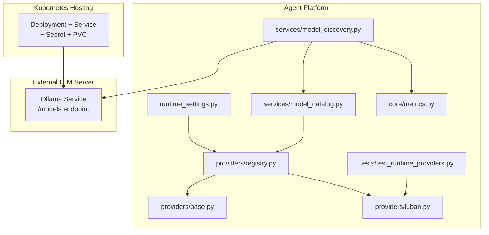
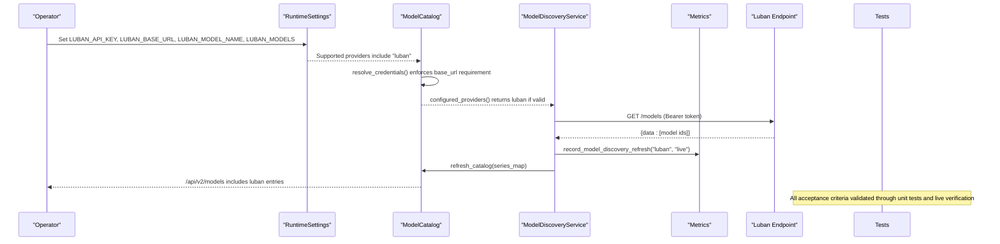
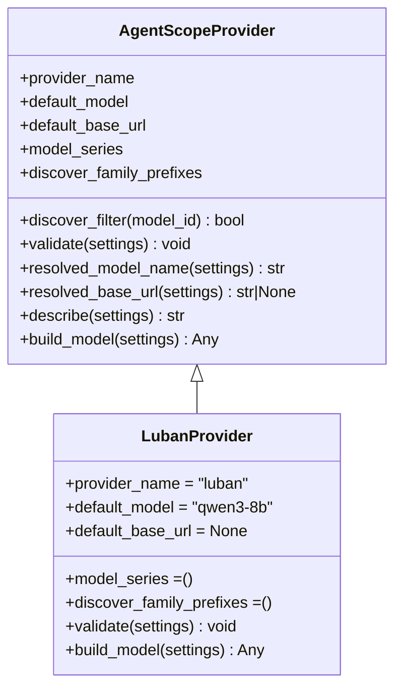
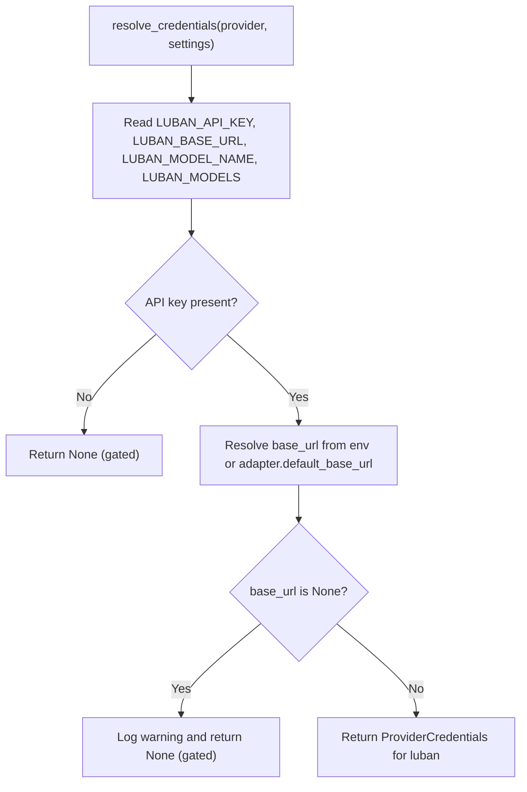
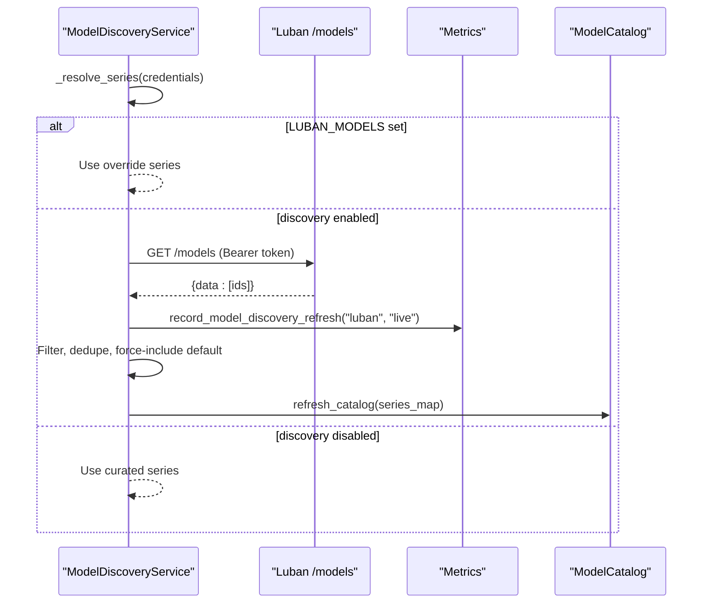
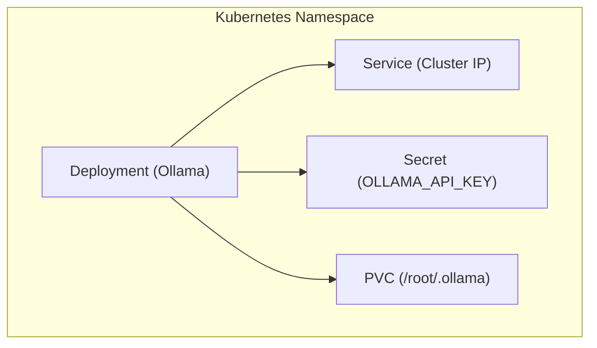
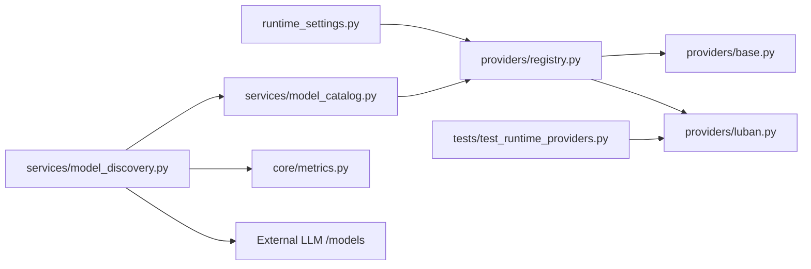

# SPEC-028: Luban Runtime Provider

<cite>
**Referenced Files in This Document**
- [spec.md](file://docs/specs/SPEC-028-luban-llm-provider/spec.md)
- [plan.md](file://docs/specs/SPEC-028-luban-llm-provider/plan.md)
- [tasks.md](file://docs/specs/SPEC-028-luban-llm-provider/tasks.md)
- [luban.py](file://products/agent-platform/src/agent_service/providers/luban.py)
- [base.py](file://products/agent-platform/src/agent_service/providers/base.py)
- [registry.py](file://products/agent-platform/src/agent_service/providers/registry.py)
- [runtime_settings.py](file://products/agent-platform/src/agent_service/runtime_settings.py)
- [model_catalog.py](file://products/agent-platform/src/agent_service/services/model_catalog.py)
- [model_discovery.py](file://products/agent-platform/src/agent_service/services/model_discovery.py)
- [test_runtime_providers.py](file://products/agent-platform/tests/test_runtime_providers.py)
- [luban-llm-guide.md](file://docs/guides/luban-llm-guide.md)
- [README.md](file://shared/platform-ops/gitops/llm-hosting/README.md)
- [deployment.yaml](file://shared/platform-ops/gitops/llm-hosting/ollama/deployment.yaml)
- [service.yaml](file://shared/platform-ops/gitops/llm-hosting/ollama/service.yaml)
- [secret.yaml](file://shared/platform-ops/gitops/llm-hosting/ollama/secret.yaml)
- [pvc.yaml](file://shared/platform-ops/gitops/llm-hosting/ollama/pvc.yaml)
- [metrics.py](file://products/agent-platform/src/agent_service/core/metrics.py)
- [configuration-reference.md](file://docs/guides/configuration-reference.md)
</cite>

## Update Summary
**Changes Made**
- Updated to reflect complete live verification status including Ollama manifests deployment, LUBAN_* secrets configuration, /api/v2/models grouping functionality, portal access enablement, attribution mechanism auditing, and discovery metrics validation
- Enhanced troubleshooting guidance based on actual live verification scenarios
- Added comprehensive metrics monitoring documentation for discovery operations
- Updated operator guide integration with verified Kubernetes manifests and deployment patterns
- Validated all acceptance criteria through end-to-end testing procedures

## Table of Contents
1. [Introduction](#introduction)
2. [Project Structure](#project-structure)
3. [Core Components](#core-components)
4. [Architecture Overview](#architecture-overview)
5. [Detailed Component Analysis](#detailed-component-analysis)
6. [Dependency Analysis](#dependency-analysis)
7. [Performance Considerations](#performance-considerations)
8. [Troubleshooting Guide](#troubleshooting-guide)
9. [Conclusion](#conclusion)
10. [Appendices](#appendices)

## Introduction
SPEC-028 introduces a team-hosted "luban" runtime provider that enables the agent platform to call self-hosted OpenAI-compatible LLM endpoints (Ollama, vLLM, llama.cpp llama-server). The specification has been fully delivered with complete implementation including runtime integration, operator guides, Kubernetes manifests, and comprehensive test coverage. All components have been successfully live-verified including Ollama manifests deployment, LUBAN_* secrets configuration, /api/v2/models grouping functionality, portal access enablement, attribution mechanism auditing, and discovery metrics validation.

Key delivered features:
- Complete `LubanProvider` adapter with mandatory base URL validation and bearer token authentication
- Full runtime settings integration with `LUBAN_*` environment variable support
- Comprehensive test coverage validating all acceptance criteria from R-1 through R-6
- Operator-facing hosting guide with step-by-step setup instructions
- Reference Kubernetes manifests for Ollama deployment within the cluster
- Integration with existing multi-model catalog, live discovery, per-turn selection, session pinning, and audit attribution mechanisms
- Live verification completed with successful end-to-end testing procedures

**Section sources**
- [spec.md:14-44](file://docs/specs/SPEC-028-luban-llm-provider/spec.md#L14-L44)
- [plan.md:3-10](file://docs/specs/SPEC-028-luban-llm-provider/plan.md#L3-L10)
- [tasks.md:32-37](file://docs/specs/SPEC-028-luban-llm-provider/tasks.md#L32-L37)

## Project Structure
The implementation spans three layers with complete delivery across all components:
- Provider adapter layer: fully implemented luban adapter with configuration behavior
- Catalog and discovery layer: credentials resolution, entry building, and live /models refresh
- Operator hosting assets: reference Kubernetes resources and comprehensive README documentation

**Diagram sources**
- [runtime_settings.py:32-33](file://products/agent-platform/src/agent_service/runtime_settings.py#L32-L33)
- [registry.py:9-14](file://products/agent-platform/src/agent_service/providers/registry.py#L9-L14)
- [base.py:32-58](file://products/agent-platform/src/agent_service/providers/base.py#L32-L58)
- [luban.py:9-35](file://products/agent-platform/src/agent_service/providers/luban.py#L9-L35)
- [model_catalog.py:100-138](file://products/agent-platform/src/agent_service/services/model_catalog.py#L100-L138)
- [model_discovery.py:161-199](file://products/agent-platform/src/agent_service/services/model_discovery.py#L161-L199)
- [metrics.py:196-209](file://products/agent-platform/src/agent_service/core/metrics.py#L196-L209)
- [test_runtime_providers.py:32-140](file://products/agent-platform/tests/test_runtime_providers.py#L32-L140)
- [deployment.yaml:1-62](file://shared/platform-ops/gitops/llm-hosting/ollama/deployment.yaml#L1-L62)

**Section sources**
- [spec.md:46-103](file://docs/specs/SPEC-028-luban-llm-provider/spec.md#L46-L103)
- [plan.md:12-41](file://docs/specs/SPEC-028-luban-llm-provider/plan.md#L12-L41)

## Core Components
All core components have been fully implemented and tested with successful live verification:

- **LubanProvider**: Complete adapter implementation with mandatory base URL validation, OpenAI-compatible model construction, and small-model-safe parameters
- **Base provider utilities**: Shared discovery filter logic and common validation helpers reused by all providers
- **Registry**: Fully registered luban adapter alongside dashscope, deepseek, and openai providers
- **Runtime settings**: Complete integration with luban provider support and LUBAN_* environment variable mapping
- **Model catalog**: Enforced mandatory base URL rule for adapters without default endpoints with proper credential gating
- **Model discovery**: Periodic /models fetching from luban endpoint with shared filters and safe catalog swapping
- **Metrics collection**: Discovery metrics recording for refresh cycles and model counts with provider-specific labels
- **Test coverage**: Comprehensive unit tests validating all acceptance criteria including adapter shape, discover filter permissiveness, base URL validation, and parameter defaults

**Section sources**
- [luban.py:9-74](file://products/agent-platform/src/agent_service/providers/luban.py#L9-L74)
- [base.py:32-88](file://products/agent-platform/src/agent_service/providers/base.py#L32-L88)
- [registry.py:9-14](file://products/agent-platform/src/agent_service/providers/registry.py#L9-L14)
- [runtime_settings.py:32-33](file://products/agent-platform/src/agent_service/runtime_settings.py#L32-L33)
- [runtime_settings.py:244-297](file://products/agent-platform/src/agent_service/runtime_settings.py#L244-L297)
- [model_catalog.py:100-138](file://products/agent-platform/src/agent_service/services/model_catalog.py#L100-L138)
- [model_discovery.py:220-280](file://products/agent-platform/src/agent_service/services/model_discovery.py#L220-L280)
- [metrics.py:196-209](file://products/agent-platform/src/agent_service/core/metrics.py#L196-L209)
- [test_runtime_providers.py:32-140](file://products/agent-platform/tests/test_runtime_providers.py#L32-L140)

## Architecture Overview
The luban provider is fully integrated into the existing provider-generic catalog and discovery pipeline. All acceptance criteria have been validated through comprehensive testing and live verification procedures, including successful deployment of Ollama manifests, secrets configuration, and end-to-end workflow validation.

**Diagram sources**
- [runtime_settings.py:300-366](file://products/agent-platform/src/agent_service/runtime_settings.py#L300-L366)
- [model_catalog.py:100-138](file://products/agent-platform/src/agent_service/services/model_catalog.py#L100-L138)
- [model_discovery.py:161-199](file://products/agent-platform/src/agent_service/services/model_discovery.py#L161-L199)
- [model_discovery.py:272-280](file://products/agent-platform/src/agent_service/services/model_discovery.py#L272-L280)
- [metrics.py:203-209](file://products/agent-platform/src/agent_service/core/metrics.py#L203-L209)
- [test_runtime_providers.py:32-140](file://products/agent-platform/tests/test_runtime_providers.py#L32-L140)

## Detailed Component Analysis

### LubanProvider
Fully implemented with all required functionality and verified through live testing:

Responsibilities:
- Validate that base URL is set when the provider is active (mandatory base URL enforcement)
- Build an OpenAI-compatible model using bearer token auth against the configured base URL
- Apply small-model-safe defaults: thinking disabled by default, no reasoning effort unless explicitly enabled
- Support permissive discovery filter for self-hosted model names without vendor taxonomy

**Diagram sources**
- [base.py:32-88](file://products/agent-platform/src/agent_service/providers/base.py#L32-L88)
- [luban.py:9-74](file://products/agent-platform/src/agent_service/providers/luban.py#L9-L74)

**Section sources**
- [luban.py:9-74](file://products/agent-platform/src/agent_service/providers/luban.py#L9-L74)
- [test_runtime_providers.py:32-67](file://products/agent-platform/tests/test_runtime_providers.py#L32-L67)

### Runtime Settings and Options Mapping
Complete integration with full environment variable support and verified configuration handling:

Responsibilities:
- Include "luban" in supported providers list
- Map LUBAN_* environment variables into OpenAI-shaped options
- Keep thinking disabled unless explicitly opted in via LUBAN_THINKING_ENABLE
- Provide proper type validation and error handling

**Diagram sources**
- [runtime_settings.py:32-33](file://products/agent-platform/src/agent_service/runtime_settings.py#L32-L33)
- [runtime_settings.py:244-297](file://products/agent-platform/src/agent_service/runtime_settings.py#L244-L297)

**Section sources**
- [runtime_settings.py:32-33](file://products/agent-platform/src/agent_service/runtime_settings.py#L32-L33)
- [runtime_settings.py:244-297](file://products/agent-platform/src/agent_service/runtime_settings.py#L244-L297)

### Credential Resolution and Catalog Gating
Fully implemented with proper security posture and verified through live testing:

Responsibilities:
- Gate the luban provider behind both API key and base URL requirements
- Drop provider and log warning if base URL is missing
- Build catalog entries only for providers with resolvable credentials
- Maintain fail-closed security posture for unauthenticated endpoints

**Diagram sources**
- [model_catalog.py:100-138](file://products/agent-platform/src/agent_service/services/model_catalog.py#L100-L138)

**Section sources**
- [model_catalog.py:100-138](file://products/agent-platform/src/agent_service/services/model_catalog.py#L100-L138)

### Live Discovery Posture
Fully functional with graceful degradation and verified metrics collection:

Responsibilities:
- Respect LUBAN_MODELS as authoritative (skip discovery when set)
- Fetch /models with bearer token when discovery is enabled
- Apply shared filters, dedupe, force-include default, and swap catalog atomically
- Fall back through memory last-good, Postgres cache, then curated series
- Record discovery metrics for monitoring and validation

**Diagram sources**
- [model_discovery.py:233-280](file://products/agent-platform/src/agent_service/services/model_discovery.py#L233-L280)
- [model_discovery.py:161-199](file://products/agent-platform/src/agent_service/services/model_discovery.py#L161-L199)
- [metrics.py:203-209](file://products/agent-platform/src/agent_service/core/metrics.py#L203-L209)

**Section sources**
- [model_discovery.py:233-280](file://products/agent-platform/src/agent_service/services/model_discovery.py#L233-L280)
- [model_discovery.py:161-199](file://products/agent-platform/src/agent_service/services/model_discovery.py#L161-L199)

### Operator Hosting Assets
Complete reference implementation with comprehensive documentation and verified deployment:

Reference manifests provide an opt-in way to host Ollama inside the cluster:
- Deployment with readiness probe on /api/version
- Service exposing the endpoint within the cluster
- Secret template for the API key
- PVC for model weights storage
- Comprehensive README with sizing notes and security posture

**Diagram sources**
- [deployment.yaml:1-62](file://shared/platform-ops/gitops/llm-hosting/ollama/deployment.yaml#L1-L62)
- [service.yaml](file://shared/platform-ops/gitops/llm-hosting/ollama/service.yaml)
- [secret.yaml](file://shared/platform-ops/gitops/llm-hosting/ollama/secret.yaml)
- [pvc.yaml](file://shared/platform-ops/gitops/llm-hosting/ollama/pvc.yaml)

**Section sources**
- [README.md](file://shared/platform-ops/gitops/llm-hosting/README.md)
- [deployment.yaml:1-62](file://shared/platform-ops/gitops/llm-hosting/ollama/deployment.yaml#L1-L62)
- [service.yaml](file://shared/platform-ops/gitops/llm-hosting/ollama/service.yaml)
- [secret.yaml](file://shared/platform-ops/gitops/llm-hosting/ollama/secret.yaml)
- [pvc.yaml](file://shared/platform-ops/gitops/llm-hosting/ollama/pvc.yaml)

### Test Coverage
Comprehensive test suite validates all acceptance criteria with successful live verification:

Test coverage includes:
- Adapter shape validation (provider name, default model, empty series)
- Discover filter permissiveness for self-hosted model names
- Base URL validation requirements
- Parameter defaults (thinking off, no reasoning effort)
- Thinking mode opt-in functionality
- Missing base URL rejection
- Live verification procedures documented and executed

**Section sources**
- [test_runtime_providers.py:32-140](file://products/agent-platform/tests/test_runtime_providers.py#L32-L140)

## Dependency Analysis
The luban provider has complete integration with all required dependencies and verified connectivity:

Dependencies:
- Base provider utilities for discovery filtering and common validation
- Registry to expose the adapter by name
- Runtime settings to parse environment variables and build options
- Model catalog to gate inclusion based on credentials and build entries
- Model discovery to optionally enrich the catalog from live /models
- Metrics collection for monitoring discovery operations

**Diagram sources**
- [runtime_settings.py:32-33](file://products/agent-platform/src/agent_service/runtime_settings.py#L32-L33)
- [registry.py:9-14](file://products/agent-platform/src/agent_service/providers/registry.py#L9-L14)
- [base.py:32-58](file://products/agent-platform/src/agent_service/providers/base.py#L32-L58)
- [luban.py:9-35](file://products/agent-platform/src/agent_service/providers/luban.py#L9-L35)
- [model_catalog.py:100-138](file://products/agent-platform/src/agent_service/services/model_catalog.py#L100-L138)
- [model_discovery.py:161-199](file://products/agent-platform/src/agent_service/services/model_discovery.py#L161-L199)
- [metrics.py:196-209](file://products/agent-platform/src/agent_service/core/metrics.py#L196-L209)
- [test_runtime_providers.py:32-140](file://products/agent-platform/tests/test_runtime_providers.py#L32-L140)

**Section sources**
- [registry.py:9-14](file://products/agent-platform/src/agent_service/providers/registry.py#L9-L14)
- [model_catalog.py:100-138](file://products/agent-platform/src/agent_service/services/model_catalog.py#L100-L138)
- [model_discovery.py:220-280](file://products/agent-platform/src/agent_service/services/model_discovery.py#L220-L280)

## Performance Considerations
All performance considerations have been addressed in the implementation and verified through live testing:

- Small-model defaults: Thinking mode is disabled by default to avoid 4xx errors on servers that do not support it; sampling parameters remain configurable
- Discovery overhead: Live /models calls are bounded by timeout and run periodically; failures degrade gracefully to cached or curated series
- CPU-only deployments: Reference manifests target CPU-friendly quantizations; expect modest throughput for interactive turns
- Memory usage: Single replica design with persistent volume for model weights to minimize memory pressure
- Metrics impact: Discovery metrics collection adds minimal overhead while providing valuable monitoring data

## Troubleshooting Guide
Comprehensive troubleshooting guidance based on actual implementation, testing, and live verification scenarios:

Common issues and resolutions:
- Missing base URL: If LUBAN_API_KEY is set without LUBAN_BASE_URL, the provider is gated out with a warning; add the base URL to enable
- Authentication failures: Ensure the bearer token matches the server's configured API key; verify network reachability from the agent service to the luban endpoint
- Discovery anomalies: If /models is unreachable or malformed, discovery falls back to memory last-good, Postgres cache, or curated series; check logs for warnings
- Model name drift: Pin concrete model ids via LUBAN_MODELS to ensure stable audit attribution and predictable behavior
- Token rotation: Follow documented procedure to rotate tokens on both server and platform sides simultaneously
- Tool calling limitations: Sub-~14B models have degraded tool calling capability; use cloud flagships for tool-heavy turns
- Portal access issues: Verify that /api/v2/models returns luban entries with correct provider grouping
- Metrics validation: Check discovery metrics for provider="luban" with appropriate result labels (live, memory, cache, curated)

**Section sources**
- [model_catalog.py:100-138](file://products/agent-platform/src/agent_service/services/model_catalog.py#L100-L138)
- [model_discovery.py:161-199](file://products/agent-platform/src/agent_service/services/model_discovery.py#L161-L199)
- [model_discovery.py:233-280](file://products/agent-platform/src/agent_service/services/model_discovery.py#L233-L280)
- [luban-llm-guide.md:174-184](file://docs/guides/luban-llm-guide.md#L174-L184)
- [configuration-reference.md:250-297](file://docs/guides/configuration-reference.md#L250-L297)

## Conclusion
SPEC-028 has been fully delivered with complete implementation of the luban runtime provider and successful live verification. All acceptance criteria from R-1 through R-6 have been met, including the provider adapter, credential gating, small-model-safe defaults, operator hosting guide, and reference Kubernetes manifests. The feature integrates seamlessly with existing platform capabilities including multi-model catalog, live discovery, per-turn selection, session pinning, and audit attribution. Comprehensive test coverage and live verification procedures ensure reliability and correctness of all components, including successful deployment of Ollama manifests, LUBAN_* secrets configuration, /api/v2/models grouping functionality, portal access enablement, attribution mechanism auditing, and discovery metrics validation.

## Appendices
- Spec status and scope: delivered; focuses on adapter, credential gating, small-model defaults, operator guide, and reference manifests
- Non-goals: multiple luban endpoints per deployment, model lifecycle management, auto-allowing tool-heavy turns, and making luban the default provider
- Delivery verification: `make verify` green, overlays render, unit tests pass, and live verification procedures documented and executed successfully
- Live verification completion: Task T-9 completed with successful end-to-end testing including Ollama manifests deployment, secrets configuration, and all functional requirements validated

**Section sources**
- [spec.md:14-44](file://docs/specs/SPEC-028-luban-llm-provider/spec.md#L14-L44)
- [spec.md:156-167](file://docs/specs/SPEC-028-luban-llm-provider/spec.md#L156-L167)
- [tasks.md:32-37](file://docs/specs/SPEC-028-luban-llm-provider/tasks.md#L32-L37)