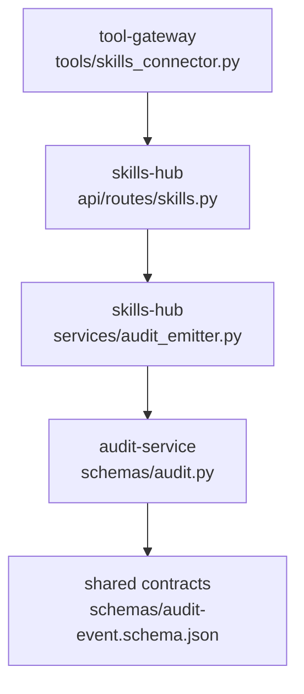
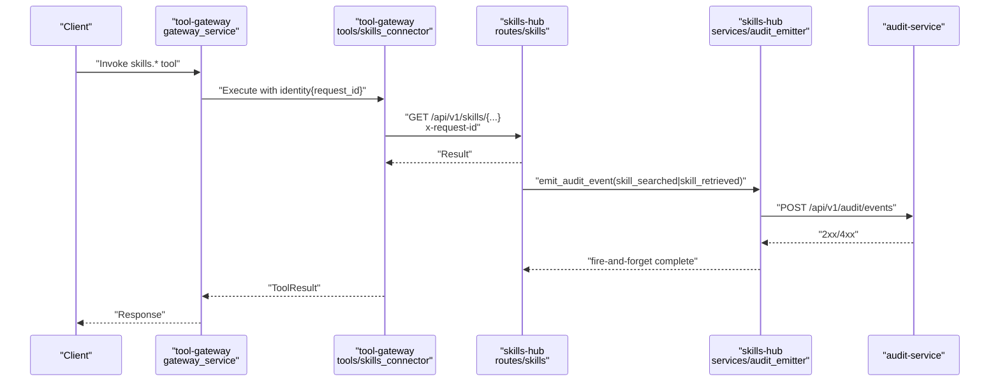
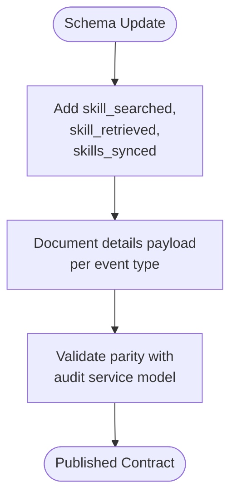
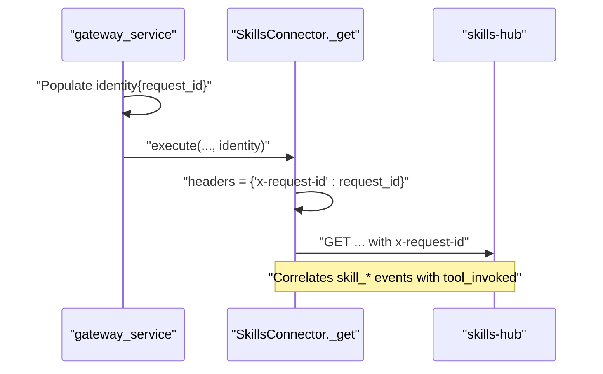
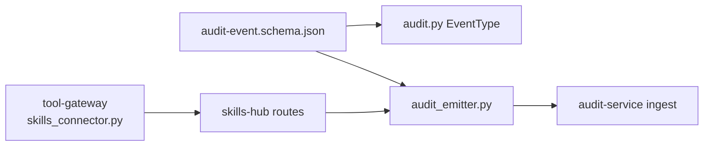

# SPEC-029: Skills Usage Audit Trail

<cite>
**Referenced Files in This Document**
- [spec.md](file://docs/specs/SPEC-029-skills-usage-audit-trail/spec.md)
- [plan.md](file://docs/specs/SPEC-029-skills-usage-audit-trail/plan.md)
- [tasks.md](file://docs/specs/SPEC-029-skills-usage-audit-trail/tasks.md)
- [audit-event.schema.json](file://shared/shared-contracts/schemas/audit-event.schema.json)
- [audit.py](file://products/audit-service/src/audit_service/schemas/audit.py)
- [audit_emitter.py](file://products/skills-hub/src/skills_hub/services/audit_emitter.py)
- [skills_connector.py](file://products/tool-gateway/src/tool_gateway/tools/skills_connector.py)
</cite>

## Table of Contents
1. [Introduction](#introduction)
2. [Project Structure](#project-structure)
3. [Core Components](#core-components)
4. [Architecture Overview](#architecture-overview)
5. [Detailed Component Analysis](#detailed-component-analysis)
6. [Dependency Analysis](#dependency-analysis)
7. [Performance Considerations](#performance-considerations)
8. [Troubleshooting Guide](#troubleshooting-guide)
9. [Conclusion](#conclusion)

## Introduction
SPEC-029 adds a durable, queryable audit trail for skills usage across the platform. It extends the shared audit vocabulary with three new event types and wires skills-hub to emit them through the canonical fire-and-forget emitter pattern. The design preserves non-blocking behavior so audit emission never degrades retrieval latency, and it correlates usage events with caller identity via request-id forwarding from tool-gateway. Catalog synchronization is also audited so usage can be interpreted against catalog state.

Key outcomes:
- New event types: skill_searched, skill_retrieved, skills_synced.
- Emission points: search, retrieval, and sync cycles in skills-hub.
- Caller correlation: x-request-id forwarded from tool-gateway to skills-hub.
- No new storage or UI surfaces; existing audit API serves analytics.

**Section sources**
- [spec.md:13-43](file://docs/specs/SPEC-029-skills-usage-audit-trail/spec.md#L13-L43)
- [plan.md:3-36](file://docs/specs/SPEC-029-skills-usage-audit-trail/plan.md#L3-L36)

## Project Structure
SPEC-029 touches four areas:
- Shared contract schema for audit events (additive enum extension).
- Audit service model (Literal type extended).
- Skills hub implementation (emitter, routes, sync).
- Tool gateway integration (request-id propagation to skills-hub).



**Diagram sources**
- [skills_connector.py:90-108](file://products/tool-gateway/src/tool_gateway/tools/skills_connector.py#L90-L108)
- [audit_emitter.py:29-98](file://products/skills-hub/src/skills_hub/services/audit_emitter.py#L29-L98)
- [audit.py:14-27](file://products/audit-service/src/audit_service/schemas/audit.py#L14-L27)
- [audit-event.schema.json:25-41](file://shared/shared-contracts/schemas/audit-event.schema.json#L25-L41)

**Section sources**
- [spec.md:161-173](file://docs/specs/SPEC-029-skills-usage-audit-trail/spec.md#L161-L173)
- [plan.md:38-55](file://docs/specs/SPEC-029-skills-usage-audit-trail/plan.md#L38-L55)

## Core Components
- Audit event schema extension: Adds skill_searched, skill_retrieved, skills_synced to the closed vocabulary and documents per-type details payloads.
- Audit service model: Extends EventType Literal to match the schema.
- Skills-hub audit emitter: Canonical fire-and-forget emitter that posts events to audit-service over HTTP on a daemon thread with a short timeout; no-op when URL is unset.
- Tool-gateway request-id forwarding: Adds request_id to the identity dict and forwards it as x-request-id header to skills-hub so usage events join the caller’s tool_invoked trail.

Acceptance highlights:
- Search emits skill_searched with outcome success and details including query, limit, result_count, skill_ids, and optional source/tag filters.
- Retrieval emits skill_retrieved: success on hit, error with reason not_found on miss.
- Sync emits one skills_synced per cycle with accepted/rejected counts on success or error on failure.
- List/browse and status endpoints are not audited; unauthenticated requests remain log/metric only.

**Section sources**
- [audit-event.schema.json:25-41](file://shared/shared-contracts/schemas/audit-event.schema.json#L25-L41)
- [audit-event.schema.json:77-80](file://shared/shared-contracts/schemas/audit-event.schema.json#L77-L80)
- [audit.py:14-27](file://products/audit-service/src/audit_service/schemas/audit.py#L14-L27)
- [audit_emitter.py:29-98](file://products/skills-hub/src/skills_hub/services/audit_emitter.py#L29-L98)
- [skills_connector.py:90-108](file://products/tool-gateway/src/tool_gateway/tools/skills_connector.py#L90-L108)
- [spec.md:47-128](file://docs/specs/SPEC-029-skills-usage-audit-trail/spec.md#L47-L128)

## Architecture Overview
The end-to-end flow spans tool-gateway invocation, skills-hub processing, and durable audit persistence.



**Diagram sources**
- [skills_connector.py:90-108](file://products/tool-gateway/src/tool_gateway/tools/skills_connector.py#L90-L108)
- [audit_emitter.py:67-98](file://products/skills-hub/src/skills_hub/services/audit_emitter.py#L67-L98)
- [audit-event.schema.json:25-41](file://shared/shared-contracts/schemas/audit-event.schema.json#L25-L41)

## Detailed Component Analysis

### Audit Event Schema Extension
- Adds three event types to the closed vocabulary.
- Documents per-event-type details payloads for skill_searched, skill_retrieved, and skills_synced.
- Ensures additive compatibility; consumers parse by event_type and ignore unknown fields beyond the schema.



**Diagram sources**
- [audit-event.schema.json:25-41](file://shared/shared-contracts/schemas/audit-event.schema.json#L25-L41)
- [audit-event.schema.json:77-80](file://shared/shared-contracts/schemas/audit-event.schema.json#L77-L80)

**Section sources**
- [audit-event.schema.json:25-41](file://shared/shared-contracts/schemas/audit-event.schema.json#L25-L41)
- [audit-event.schema.json:77-80](file://shared/shared-contracts/schemas/audit-event.schema.json#L77-L80)

### Audit Service Model Alignment
- EventType Literal mirrors the schema enum values.
- Existing parity tests ensure drift between schema and model is prevented.

```mermaid
classDiagram
class AuditEvent {
+string event_id
+datetime occurred_at
+EventType event_type
+string service
+string request_id
+Outcome outcome
+dict details
}
class EventType {
<<Literal>>
"tool_invoked"
"policy_decision"
"token_exchange"
"session_created"
"session_deleted"
"chat_started"
"chat_completed"
"confirmation_decided"
"incident_triaged"
"skill_searched"
"skill_retrieved"
"skills_synced"
}
AuditEvent --> EventType : "uses"
```

**Diagram sources**
- [audit.py:14-27](file://products/audit-service/src/audit_service/schemas/audit.py#L14-L27)
- [audit.py:32-46](file://products/audit-service/src/audit_service/schemas/audit.py#L32-L46)

**Section sources**
- [audit.py:14-27](file://products/audit-service/src/audit_service/schemas/audit.py#L14-L27)

### Skills-Hub Audit Emitter
- Builds envelopes matching the shared schema.
- Emits via a daemon thread with a short timeout; failures are recorded and logged without raising.
- Gated by configuration: if audit service URL is unset, emission is a no-op.


**Diagram sources**
- [audit_emitter.py:67-98](file://products/skills-hub/src/skills_hub/services/audit_emitter.py#L67-L98)

**Section sources**
- [audit_emitter.py:29-98](file://products/skills-hub/src/skills_hub/services/audit_emitter.py#L29-L98)

### Tool-Gateway Request-ID Forwarding
- Adds request_id into the identity dict passed to tools.
- Forwards request_id as x-request-id header on calls to skills-hub so usage events correlate with the caller’s tool_invoked events.



**Diagram sources**
- [skills_connector.py:90-108](file://products/tool-gateway/src/tool_gateway/tools/skills_connector.py#L90-L108)

**Section sources**
- [skills_connector.py:90-108](file://products/tool-gateway/src/tool_gateway/tools/skills_connector.py#L90-L108)

### Emission Points and Payloads
- Search: skill_searched with details including query, limit, result_count, skill_ids, and optional source/tag filters.
- Retrieval: skill_retrieved with details including skill_id and source on hits; on misses, outcome=error with reason not_found.
- Sync: skills_synced emitted once per cycle with accepted/rejected counts on success or error on failure.


**Diagram sources**
- [audit-event.schema.json:77-80](file://shared/shared-contracts/schemas/audit-event.schema.json#L77-L80)
- [spec.md:86-128](file://docs/specs/SPEC-029-skills-usage-audit-trail/spec.md#L86-L128)

**Section sources**
- [spec.md:86-128](file://docs/specs/SPEC-029-skills-usage-audit-trail/spec.md#L86-L128)

## Dependency Analysis
- Contract dependency: audit-event.schema.json defines the closed vocabulary and details structure consumed by all emitters and the audit service.
- Model dependency: audit service EventType Literal must stay in lockstep with the schema; parity tests enforce this.
- Runtime dependency: skills-hub depends on its own audit emitter module and metrics; tool-gateway depends on skills connector to forward request-id.
- Deployment dependency: audit-service ingest endpoint is called by skills-hub emitter using configured credentials.



**Diagram sources**
- [audit-event.schema.json:25-41](file://shared/shared-contracts/schemas/audit-event.schema.json#L25-L41)
- [audit.py:14-27](file://products/audit-service/src/audit_service/schemas/audit.py#L14-L27)
- [audit_emitter.py:67-98](file://products/skills-hub/src/skills_hub/services/audit_emitter.py#L67-L98)
- [skills_connector.py:90-108](file://products/tool-gateway/src/tool_gateway/tools/skills_connector.py#L90-L108)

**Section sources**
- [spec.md:161-173](file://docs/specs/SPEC-029-skills-usage-audit-trail/spec.md#L161-L173)
- [plan.md:38-55](file://docs/specs/SPEC-029-skills-usage-audit-trail/plan.md#L38-L55)

## Performance Considerations
- Emission is fire-and-forget on a daemon thread with a short timeout; failures do not raise and cannot block the calling path.
- Unset audit service URL results in an immediate no-op, preserving historical behavior.
- Metrics capture emit outcomes to monitor reliability without impacting latency.

[No sources needed since this section provides general guidance]

## Troubleshooting Guide
Common issues and checks:
- Missing events: Verify SKILLS_AUDIT_SERVICE_URL is set; otherwise emission is disabled.
- Rejection errors: Inspect audit-service responses; non-2xx codes are treated as errors and recorded.
- Transport errors: Emission logs warnings with request_id and event_type; check network and credentials.
- Correlation gaps: Ensure tool-gateway forwards x-request-id and that the inbound request carries a request id.

Operational references:
- Emitter logic and error handling paths.
- Schema constraints for event_type and details.
- Audit service model expectations.

**Section sources**
- [audit_emitter.py:67-98](file://products/skills-hub/src/skills_hub/services/audit_emitter.py#L67-L98)
- [audit-event.schema.json:25-41](file://shared/shared-contracts/schemas/audit-event.schema.json#L25-L41)
- [audit.py:14-27](file://products/audit-service/src/audit_service/schemas/audit.py#L14-L27)

## Conclusion
SPEC-029 completes the audit trail gap for skills usage by adding durable, queryable events at the right boundaries: search, retrieval, and catalog sync. It preserves performance guarantees through fire-and-forget emission, maintains contract integrity via additive schema changes and model parity, and ties usage back to callers through request-id correlation. The result is a consistent, extensible foundation for analyzing skill adoption, identifying dead searches, and diagnosing catalog churn without introducing new UI or storage surfaces.

[No sources needed since this section summarizes without analyzing specific files]