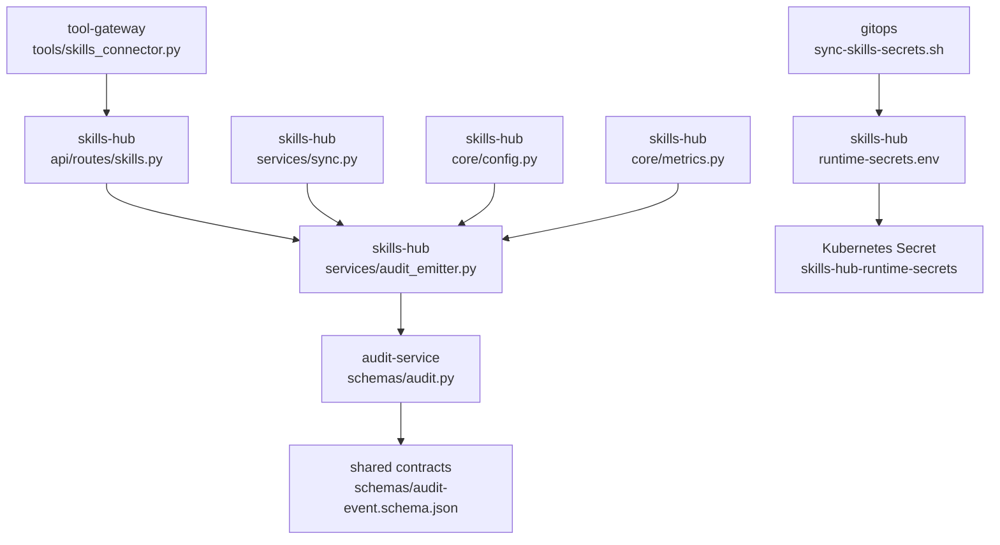
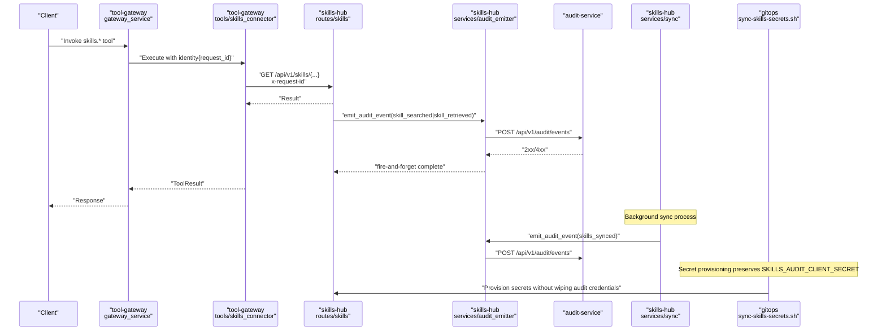
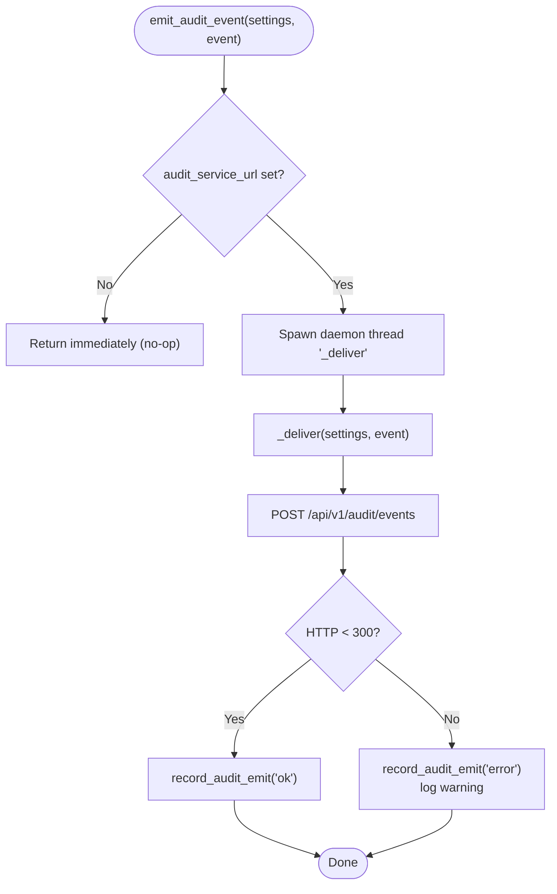
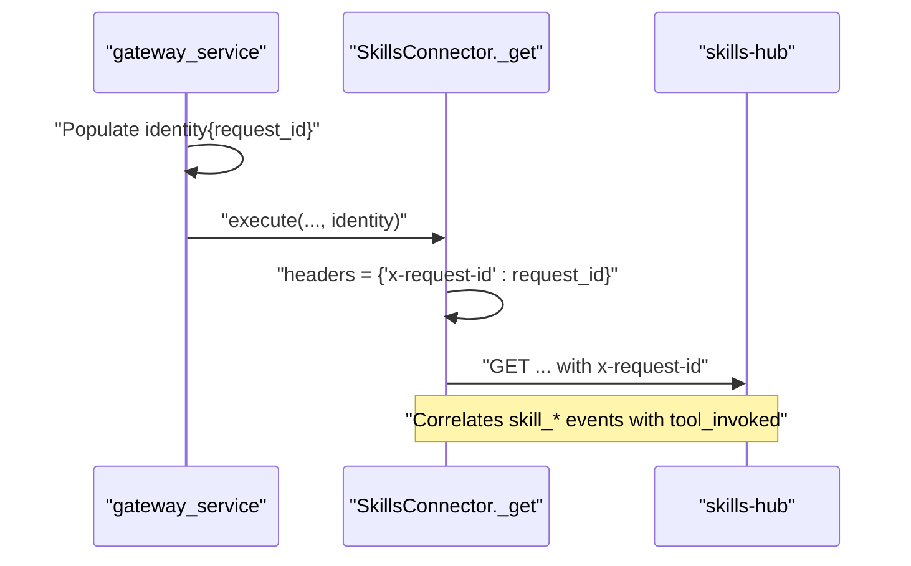
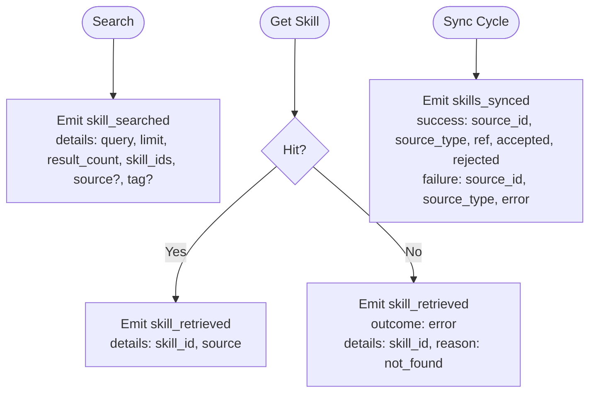

# SPEC-029: Skills Usage Audit Trail

<cite>
**Referenced Files in This Document**
- [spec.md](file://docs/specs/SPEC-029-skills-usage-audit-trail/spec.md)
- [plan.md](file://docs/specs/SPEC-029-skills-usage-audit-trail/plan.md)
- [tasks.md](file://docs/specs/SPEC-029-skills-usage-audit-trail/tasks.md)
- [audit-event.schema.json](file://shared/shared-contracts/schemas/audit-event.schema.json)
- [audit.py](file://products/audit-service/src/audit_service/schemas/audit.py)
- [audit_emitter.py](file://products/skills-hub/src/skills_hub/services/audit_emitter.py)
- [skills_connector.py](file://products/tool-gateway/src/tool_gateway/tools/skills_connector.py)
- [config.py](file://products/skills-hub/src/skills_hub/core/config.py)
- [sync.py](file://products/skills-hub/src/skills_hub/services/sync.py)
- [skills.py](file://products/skills-hub/src/skills_hub/api/routes/skills.py)
- [metrics.py](file://products/skills-hub/src/skills_hub/core/metrics.py)
- [test_audit_emitter.py](file://products/skills-hub/tests/test_audit_emitter.py)
- [sync-skills-secrets.sh](file://shared/platform-ops/gitops/sync-skills-secrets.sh)
- [deploy.sh](file://shared/platform-ops/gitops/dev-k8s/deploy.sh)
- [runtime-secrets.env](file://shared/platform-ops/gitops/dev-k8s/base/skills-hub/runtime-secrets.env)
- [configuration-reference.md](file://docs/guides/configuration-reference.md)
- [delivery-roadmap.md](file://docs/agentic-aiops-platform/delivery-roadmap.md)
- [2026-08-25-skills-secret-sync-patch.md](file://docs/agentic-aiops-platform/release-notes/2026-08-25-skills-secret-sync-patch.md)
</cite>

## Update Summary
**Changes Made**
- Updated Implementation Status section to reflect v0.11.1 patch resolution
- Added cross-reference to v0.11.1 patch release note for deployment fix
- Enhanced Configuration section with SKILLS_AUDIT_* environment variables and deployment considerations
- Updated Architecture Overview with complete end-to-end flow including sync events and deployment considerations
- Enhanced Troubleshooting Guide with deployment-specific guidance for secret synchronization issues
- Updated Conclusion to reflect successful resolution of deployment-time bug

## Table of Contents
1. [Introduction](#introduction)
2. [Implementation Status](#implementation-status)
3. [Project Structure](#project-structure)
4. [Core Components](#core-components)
5. [Architecture Overview](#architecture-overview)
6. [Detailed Component Analysis](#detailed-component-analysis)
7. [Configuration](#configuration)
8. [Testing Infrastructure](#testing-infrastructure)
9. [Performance Considerations](#performance-considerations)
10. [Troubleshooting Guide](#troubleshooting-guide)
11. [Conclusion](#conclusion)

## Introduction
SPEC-029 adds a durable, queryable audit trail for skills usage across the platform. It extends the shared audit vocabulary with three new event types and wires skills-hub to emit them through the canonical fire-and-forget emitter pattern. The design preserves non-blocking behavior so audit emission never degrades retrieval latency, and it correlates usage events with caller identity via request-id forwarding from tool-gateway. Catalog synchronization is also audited so usage can be interpreted against catalog state.

Key outcomes:
- New event types: skill_searched, skill_retrieved, skills_synced.
- Emission points: search, retrieval, and sync cycles in skills-hub.
- Caller correlation: x-request-id forwarded from tool-gateway to skills-hub.
- No new storage or UI surfaces; existing audit API serves analytics.

**Section sources**
- [spec.md:13-43](file://docs/specs/SPEC-029-skills-usage-audit-trail/spec.md#L13-L43)
- [plan.md:3-36](file://docs/specs/SPEC-029-skills-usage-audit-trail/plan.md#L3-L36)

## Implementation Status
**Status**: `delivered` ✅

The SPEC-029 implementation is complete and deployed with full functionality, including the critical v0.11.1 patch resolution:

- **Contract Extension**: Three new event types added to shared audit-event schema and audit-service model
- **Skills Hub Integration**: Complete audit emitter implementation with fire-and-forget pattern
- **Tool Gateway Correlation**: Request ID forwarding from tool-gateway to skills-hub
- **Sync Trail**: Catalog synchronization events emitted for both success and failure cases
- **Configuration**: Environment variables configured for production deployment
- **Testing**: Comprehensive test coverage including parity tests with other emitters
- **Deployment Fix**: v0.11.1 patch resolved critical deployment-time bug where sync-skills-secrets.sh was wiping SKILLS_AUDIT_CLIENT_SECRET during secret synchronization operations

**Updated** The implementation was delivered in the 0.11.0 release slice but required a follow-up v0.11.1 patch to resolve a deployment-time issue discovered during live verification. The patch ensures proper preservation of audit credentials during secret synchronization operations.

**Section sources**
- [spec.md:3-11](file://docs/specs/SPEC-029-skills-usage-audit-trail/spec.md#L3-L11)
- [spec.md:188-202](file://docs/specs/SPEC-029-skills-usage-audit-trail/spec.md#L188-L202)
- [2026-08-25-skills-secret-sync-patch.md:1-50](file://docs/agentic-aiops-platform/release-notes/2026-08-25-skills-secret-sync-patch.md#L1-L50)

## Project Structure
SPEC-029 touches four areas:
- Shared contract schema for audit events (additive enum extension).
- Audit service model (Literal type extended).
- Skills hub implementation (emitter, routes, sync).
- Tool gateway integration (request-id propagation to skills-hub).



**Diagram sources**
- [skills_connector.py:90-108](file://products/tool-gateway/src/tool_gateway/tools/skills_connector.py#L90-L108)
- [audit_emitter.py:29-98](file://products/skills-hub/src/skills_hub/services/audit_emitter.py#L29-L98)
- [audit.py:14-27](file://products/audit-service/src/audit_service/schemas/audit.py#L14-L27)
- [audit-event.schema.json:25-41](file://shared/shared-contracts/schemas/audit-event.schema.json#L25-L41)
- [sync.py:210-226](file://products/skills-hub/src/skills_hub/services/sync.py#L210-L226)
- [config.py:175-177](file://products/skills-hub/src/skills_hub/core/config.py#L175-L177)
- [metrics.py:58-62](file://products/skills-hub/src/skills_hub/core/metrics.py#L58-L62)
- [sync-skills-secrets.sh:96-121](file://shared/platform-ops/gitops/sync-skills-secrets.sh#L96-L121)
- [runtime-secrets.env:1-4](file://shared/platform-ops/gitops/dev-k8s/base/skills-hub/runtime-secrets.env#L1-L4)

**Section sources**
- [spec.md:161-173](file://docs/specs/SPEC-029-skills-usage-audit-trail/spec.md#L161-L173)
- [plan.md:38-55](file://docs/specs/SPEC-029-skills-usage-audit-trail/plan.md#L38-L55)

## Core Components
- **Audit event schema extension**: Adds skill_searched, skill_retrieved, skills_synced to the closed vocabulary and documents per-type details payloads.
- **Audit service model**: Extends EventType Literal to match the schema.
- **Skills-hub audit emitter**: Canonical fire-and-forget emitter that posts events to audit-service over HTTP on a daemon thread with a short timeout; no-op when URL is unset.
- **Tool-gateway request-id forwarding**: Adds request_id to the identity dict and forwards it as x-request-id header to skills-hub so usage events join the caller's tool_invoked trail.

Acceptance highlights:
- Search emits skill_searched with outcome success and details including query, limit, result_count, skill_ids, and optional source/tag filters.
- Retrieval emits skill_retrieved: success on hit, error with reason not_found on miss.
- Sync emits one skills_synced per cycle with accepted/rejected counts on success or error on failure.
- List/browse and status endpoints are not audited; unauthenticated requests remain log/metric only.

**Section sources**
- [audit-event.schema.json:25-41](file://shared/shared-contracts/schemas/audit-event.schema.json#L25-L41)
- [audit-event.schema.json:77-80](file://shared/shared-contracts/schemas/audit-event.schema.json#L77-L80)
- [audit.py:14-27](file://products/audit-service/src/audit_service/schemas/audit.py#L14-L27)
- [audit_emitter.py:29-98](file://products/skills-hub/src/skills_hub/services/audit_emitter.py#L29-L98)
- [skills_connector.py:90-108](file://products/tool-gateway/src/tool_gateway/tools/skills_connector.py#L90-L108)
- [spec.md:47-128](file://docs/specs/SPEC-029-skills-usage-audit-trail/spec.md#L47-L128)

## Architecture Overview
The end-to-end flow spans tool-gateway invocation, skills-hub processing, and durable audit persistence, with proper secret provisioning ensuring reliable operation.



**Diagram sources**
- [skills_connector.py:90-108](file://products/tool-gateway/src/tool_gateway/tools/skills_connector.py#L90-L108)
- [audit_emitter.py:67-98](file://products/skills-hub/src/skills_hub/services/audit_emitter.py#L67-L98)
- [audit-event.schema.json:25-41](file://shared/shared-contracts/schemas/audit-event.schema.json#L25-L41)
- [sync.py:210-226](file://products/skills-hub/src/skills_hub/services/sync.py#L210-L226)
- [sync-skills-secrets.sh:101-113](file://shared/platform-ops/gitops/sync-skills-secrets.sh#L101-L113)

## Detailed Component Analysis

### Audit Event Schema Extension
- Adds three event types to the closed vocabulary.
- Documents per-event-type details payloads for skill_searched, skill_retrieved, and skills_synced.
- Ensures additive compatibility; consumers parse by event_type and ignore unknown fields beyond the schema.


**Diagram sources**
- [audit-event.schema.json:25-41](file://shared/shared-contracts/schemas/audit-event.schema.json#L25-L41)
- [audit-event.schema.json:77-80](file://shared/shared-contracts/schemas/audit-event.schema.json#L77-L80)

**Section sources**
- [audit-event.schema.json:25-41](file://shared/shared-contracts/schemas/audit-event.schema.json#L25-L41)
- [audit-event.schema.json:77-80](file://shared/shared-contracts/schemas/audit-event.schema.json#L77-L80)

### Audit Service Model Alignment
- EventType Literal mirrors the schema enum values.
- Existing parity tests ensure drift between schema and model is prevented.

```mermaid
classDiagram
class AuditEvent {
+string event_id
+datetime occurred_at
+EventType event_type
+string service
+string request_id
+Outcome outcome
+dict details
}
class EventType {
<<Literal>>
"tool_invoked"
"policy_decision"
"token_exchange"
"session_created"
"session_deleted"
"chat_started"
"chat_completed"
"confirmation_decided"
"incident_triaged"
"skill_searched"
"skill_retrieved"
"skills_synced"
}
AuditEvent --> EventType : "uses"
```

**Diagram sources**
- [audit.py:14-27](file://products/audit-service/src/audit_service/schemas/audit.py#L14-L27)
- [audit.py:32-46](file://products/audit-service/src/audit_service/schemas/audit.py#L32-L46)

**Section sources**
- [audit.py:14-27](file://products/audit-service/src/audit_service/schemas/audit.py#L14-L27)

### Skills-Hub Audit Emitter
- Builds envelopes matching the shared schema.
- Emits via a daemon thread with a short timeout; failures are recorded and logged without raising.
- Gated by configuration: if audit service URL is unset, emission is a no-op.



**Diagram sources**
- [audit_emitter.py:67-98](file://products/skills-hub/src/skills_hub/services/audit_emitter.py#L67-L98)

**Section sources**
- [audit_emitter.py:29-98](file://products/skills-hub/src/skills_hub/services/audit_emitter.py#L29-L98)

### Tool-Gateway Request-ID Forwarding
- Adds request_id into the identity dict passed to tools.
- Forwards request_id as x-request-id header on calls to skills-hub so usage events correlate with the caller's tool_invoked events.



**Diagram sources**
- [skills_connector.py:90-108](file://products/tool-gateway/src/tool_gateway/tools/skills_connector.py#L90-L108)

**Section sources**
- [skills_connector.py:90-108](file://products/tool-gateway/src/tool_gateway/tools/skills_connector.py#L90-L108)

### Emission Points and Payloads
- **Search**: skill_searched with details including query, limit, result_count, skill_ids, and optional source/tag filters.
- **Retrieval**: skill_retrieved with details including skill_id and source on hits; on misses, outcome=error with reason not_found.
- **Sync**: skills_synced emitted once per cycle with accepted/rejected counts on success or error on failure.



**Diagram sources**
- [audit-event.schema.json:77-80](file://shared/shared-contracts/schemas/audit-event.schema.json#L77-L80)
- [spec.md:86-128](file://docs/specs/SPEC-029-skills-usage-audit-trail/spec.md#L86-L128)

**Section sources**
- [spec.md:86-128](file://docs/specs/SPEC-029-skills-usage-audit-trail/spec.md#L86-L128)

## Configuration
SPEC-029 introduces three new environment variables for skills-hub audit emission:

| Variable | Purpose | Default | Source |
|---|---|---|---|
| `SKILLS_AUDIT_SERVICE_URL` | Audit-service ingest URL for usage events (empty = emission disabled) | `http://audit-service:8000` | runtime-config |
| `SKILLS_AUDIT_CLIENT_ID` | Audit ingest client id | `skills-hub` | runtime-config |
| `SKILLS_AUDIT_CLIENT_SECRET` | Audit ingest credential | *(none)* | **runtime-secrets** |

**Updated** Deployment Configuration includes critical v0.11.1 patch fix:
- Dev-k8s overlay registers skills-hub as an ingest client with shared-secret discipline
- Secret provisioning handled by `sync-audit-secrets.sh` script
- **v0.11.1 Patch Fix**: `sync-skills-secrets.sh` now preserves `SKILLS_AUDIT_CLIENT_SECRET` across file rewrites, preventing credential wipe during deployment
- Production deployments require proper secret rotation and access controls
- Script ordering in `deploy.sh` ensures audit secrets are provisioned before skills secrets

**Critical Deployment Note**: The v0.11.1 patch resolves a deployment-time issue where running `make deploy` would wipe the `SKILLS_AUDIT_CLIENT_SECRET` from the cluster Secret, causing 401 errors for all skills-hub audit emissions until the audit sync ran again. The fix ensures proper preservation of audit credentials during secret synchronization operations.

**Section sources**
- [config.py:175-177](file://products/skills-hub/src/skills_hub/core/config.py#L175-L177)
- [config.py:200-202](file://products/skills-hub/src/skills_hub/core/config.py#L200-L202)
- [spec.md:130-147](file://docs/specs/SPEC-029-skills-usage-audit-trail/spec.md#L130-L147)
- [sync-skills-secrets.sh:101-113](file://shared/platform-ops/gitops/sync-skills-secrets.sh#L101-L113)
- [deploy.sh:15-21](file://shared/platform-ops/gitops/dev-k8s/deploy.sh#L15-L21)
- [configuration-reference.md:520-527](file://docs/guides/configuration-reference.md#L520-L527)

## Testing Infrastructure
SPEC-029 includes comprehensive test coverage ensuring reliability and contract compliance:

### Audit Emitter Tests (`test_audit_emitter.py`)
- **Contract Validation**: Verifies built audit events validate against shared schema
- **No-op Behavior**: Confirms no thread spawning when audit URL is unset
- **Delivery Paths**: Tests successful delivery, non-2xx responses, and transport errors
- **Parity Testing**: Joins the `AuditEmitterParityTest` family to prevent drift

### Route Emission Tests (`test_routes.py`)
- **Search Events**: Validates skill_searched emission with correct details structure
- **Retrieval Events**: Tests both hit and not-found scenarios for skill_retrieved
- **List Endpoint**: Confirms list operations do NOT emit audit events
- **Request ID Correlation**: Verifies x-request-id forwarding works correctly

### Sync Emission Tests
- **Success Path**: Validates skills_synced emission with accepted/rejected counts
- **Failure Path**: Tests error emission with token-scrubbed error messages
- **Per-Cycle Emission**: Ensures exactly one event per sync cycle

### Module Parity Tests
- **Drift Prevention**: Skills-hub joins the audit emitter parity family
- **Byte-Identical Logic**: Ensures emitter logic matches other services
- **Future Compatibility**: Prevents future changes from breaking parity

**Section sources**
- [test_audit_emitter.py:67-149](file://products/skills-hub/tests/test_audit_emitter.py#L67-L149)
- [test_routes.py:222-249](file://products/skills-hub/tests/test_routes.py#L222-L249)
- [plan.md:57-70](file://docs/specs/SPEC-029-skills-usage-audit-trail/plan.md#L57-L70)

## Performance Considerations
- **Fire-and-Forget Pattern**: Emission occurs on daemon threads with 2-second timeout; failures cannot block the calling path
- **Zero Overhead When Disabled**: Unset audit service URL results in immediate no-op, preserving historical performance characteristics
- **Metrics Integration**: All emission attempts are tracked via `audit_emits_total{result}` counter for monitoring
- **Non-Blocking Design**: Audit emission never degrades retrieval latency due to asynchronous delivery
- **Resource Efficiency**: Short-lived HTTP connections with minimal memory footprint per event

**Updated** Operational Impact includes deployment considerations:
- Audit failures are logged but never raise exceptions
- Network issues are handled gracefully with metric recording
- Memory usage remains bounded regardless of audit service availability
- CPU overhead is negligible due to background thread processing
- **v0.11.1 Patch Impact**: Proper secret preservation eliminates deployment-time credential loss that could cause service degradation

## Troubleshooting Guide
Common issues and diagnostic steps:

### Missing Events
- **Check Configuration**: Verify `SKILLS_AUDIT_SERVICE_URL` is set; otherwise emission is disabled
- **Verify Credentials**: Ensure `SKILLS_AUDIT_CLIENT_SECRET` is properly provisioned
- **Network Connectivity**: Confirm audit-service endpoint is reachable from skills-hub

### Rejection Errors
- **Inspect Responses**: Non-2xx codes are treated as errors and recorded in metrics
- **Authentication Issues**: Check Basic auth credentials (client_id/client_secret)
- **Rate Limiting**: Monitor audit-service for rate limiting or throttling

### Transport Errors
- **Connection Failures**: Emission logs warnings with request_id and event_type
- **Timeout Issues**: Default 2-second timeout may need adjustment for high-latency environments
- **DNS Resolution**: Verify audit-service hostname resolves correctly

### Correlation Gaps
- **Request ID Flow**: Ensure tool-gateway forwards x-request-id to skills-hub
- **Identity Context**: Verify inbound requests carry proper request IDs
- **Event Ordering**: Audit events may arrive out of order due to async delivery

### Deployment-Specific Issues
- **Secret Wipe Prevention**: v0.11.1 patch ensures `SKILLS_AUDIT_CLIENT_SECRET` is preserved during secret synchronization
- **Script Order Verification**: Confirm `sync-audit-secrets.sh` runs before `sync-skills-secrets.sh` in deployment pipeline
- **Cluster Secret State**: Verify `skills-hub-runtime-secrets` contains the audit credential after deployment
- **Rollout Verification**: Check that skills-hub pods restart with proper credentials after secret updates

### Monitoring and Metrics
- **Emission Success Rate**: Monitor `audit_emits_total{result="ok"}` vs `{result="error"}`
- **Latency Tracking**: Track audit service response times via metrics
- **Error Patterns**: Analyze error logs for recurring failure patterns
- **Deployment Health**: Monitor for 401 authentication errors indicating credential issues

**Updated** Section sources include deployment-related files:
- [audit_emitter.py:67-98](file://products/skills-hub/src/skills_hub/services/audit_emitter.py#L67-L98)
- [audit-event.schema.json:25-41](file://shared/shared-contracts/schemas/audit-event.schema.json#L25-L41)
- [audit.py:14-27](file://products/audit-service/src/audit_service/schemas/audit.py#L14-L27)
- [metrics.py:58-62](file://products/skills-hub/src/skills_hub/core/metrics.py#L58-L62)
- [sync-skills-secrets.sh:101-113](file://shared/platform-ops/gitops/sync-skills-secrets.sh#L101-L113)
- [2026-08-25-skills-secret-sync-patch.md:18-26](file://docs/agentic-aiops-platform/release-notes/2026-08-25-skills-secret-sync-patch.md#L18-L26)

## Conclusion
SPEC-029 completes the audit trail gap for skills usage by adding durable, queryable events at the right boundaries: search, retrieval, and catalog sync. The implementation delivers a robust, production-ready solution that preserves performance guarantees through fire-and-forget emission, maintains contract integrity via additive schema changes and model parity, and ties usage back to callers through request-id correlation.

**Updated** Key Achievements include deployment resilience:
- **Complete Implementation**: All three event types fully functional with comprehensive test coverage
- **Production Ready**: Proper configuration management, error handling, and monitoring
- **Performance Safe**: Fire-and-forget pattern ensures zero impact on user-facing operations  
- **Maintainable**: Parity testing prevents drift with other audit emitters in the platform
- **Observable**: Full metrics and logging support for operational visibility
- **Deployment Resilient**: v0.11.1 patch resolves critical deployment-time credential wipe issue

The result is a consistent, extensible foundation for analyzing skill adoption, identifying dead searches, and diagnosing catalog churn without introducing new UI or storage surfaces. The implementation successfully bridges the gap between skill discovery and actual usage patterns, enabling data-driven decisions about skill maintenance and development priorities. The v0.11.1 patch ensures that the deployment process itself doesn't undermine the audit capability by preserving critical credentials during secret synchronization operations.

**Section sources**
- [delivery-roadmap.md:307](file://docs/agentic-aiops-platform/delivery-roadmap.md#L307)
- [2026-08-25-skills-secret-sync-patch.md:33-42](file://docs/agentic-aiops-platform/release-notes/2026-08-25-skills-secret-sync-patch.md#L33-L42)