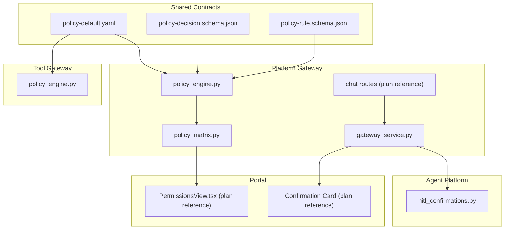
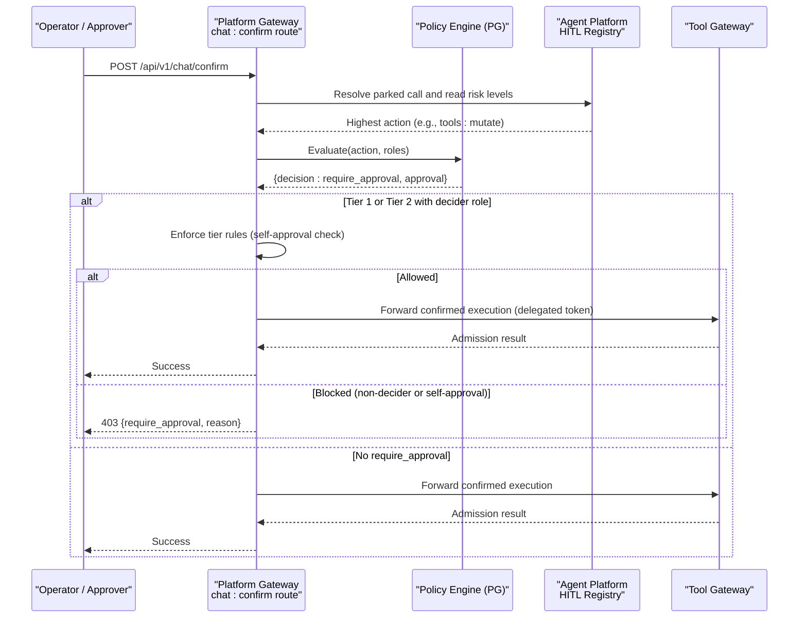
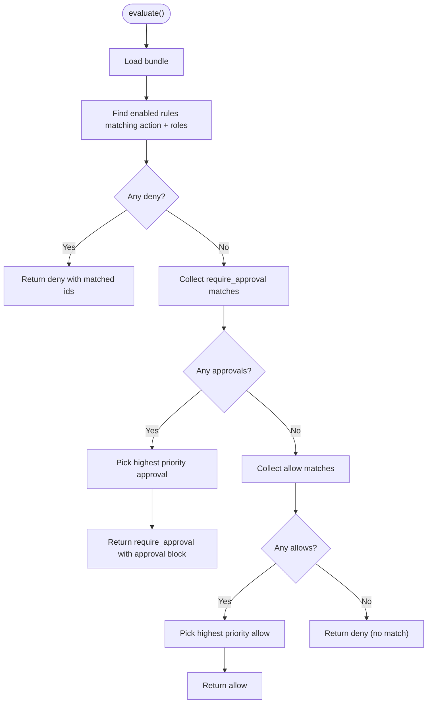
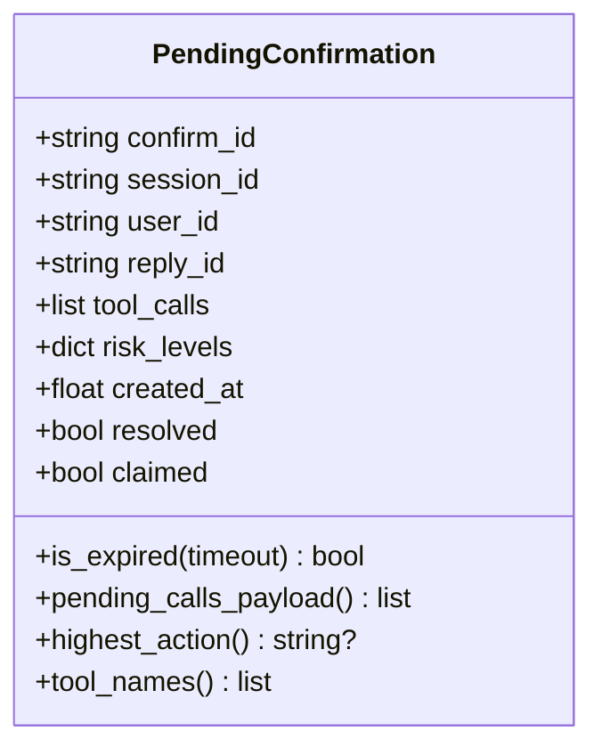
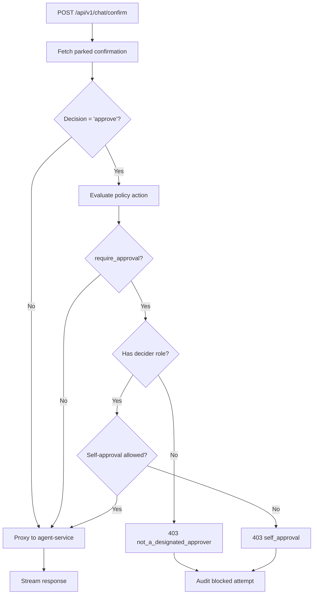
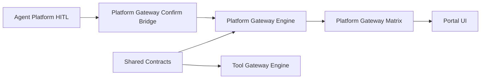

# SPEC-030: Require Approval Policy Semantics

<cite>
**Referenced Files in This Document**
- [spec.md](file://docs/specs/SPEC-030-require-approval-policy-semantics/spec.md)
- [plan.md](file://docs/specs/SPEC-030-require-approval-policy-semantics/plan.md)
- [tasks.md](file://docs/specs/SPEC-030-require-approval-policy-semantics/tasks.md)
- [policy-rule.schema.json](file://shared/shared-contracts/schemas/policy-rule.schema.json)
- [policy-decision.schema.json](file://shared/shared-contracts/schemas/policy-decision.schema.json)
- [policy_engine.py (platform-gateway)](file://products/platform-gateway/src/platform_gateway/services/policy_engine.py)
- [policy_engine.py (tool-gateway)](file://products/tool-gateway/src/tool_gateway/services/policy_engine.py)
- [hitl_confirmations.py](file://products/agent-platform/src/agent_service/services/hitl_confirmations.py)
- [policy_matrix.py](file://products/platform-gateway/src/platform_gateway/services/policy_matrix.py)
- [policy-default.yaml](file://shared/shared-contracts/policies/policy-default.yaml)
- [test_policy_engine.py](file://products/platform-gateway/tests/test_policy_engine.py)
- [chat.py](file://products/platform-gateway/src/platform_gateway/api/routes/chat.py)
- [gateway_service.py](file://products/platform-gateway/src/platform_gateway/services/gateway_service.py)
- [ConfirmationCard.test.tsx](file://products/operator-portal/web-ui/app/src/chat/__tests__/ConfirmationCard.test.tsx)
- [approval-and-hitl.md](file://docs/guides/approval-and-hitl.md)
</cite>

## Update Summary
**Changes Made**
- Updated Core Components section with detailed tiered approval system implementation
- Enhanced Architecture Overview with complete enforcement flow diagram
- Added Detailed Component Analysis for HITL Confirmation Bridge and Gateway Enforcement
- Updated Default Bundle Posture with specific rule details
- Expanded Troubleshooting Guide with tier-specific scenarios
- Added comprehensive source tracking for all code changes

## Table of Contents
1. [Introduction](#introduction)
2. [Project Structure](#project-structure)
3. [Core Components](#core-components)
4. [Architecture Overview](#architecture-overview)
5. [Detailed Component Analysis](#detailed-component-analysis)
6. [Dependency Analysis](#dependency-analysis)
7. [Performance Considerations](#performance-considerations)
8. [Troubleshooting Guide](#troubleshooting-guide)
9. [Conclusion](#conclusion)
10. [Appendices](#appendices)

## Introduction
SPEC-030 introduces require-approval policy semantics as a first-class, data-driven outcome for mutating actions. It upgrades the existing allow/deny-only policy model to include require_approval with explicit approval tiers:
- **tier_1**: session operator may confirm their own parked call (destructive-but-routine).
- **tier_2**: a designated approver distinct from the requester must decide (critical destructive).

The enforcement rides the already-delivered HITL confirmation substrate (park/resume and chat:confirm), so no new queue service is required in this slice. The default bundle ships a tier_2 requirement on tools:mutate, making the governance promise enforceable by default.

Key outcomes:
- Contract revision adds require_approval with an approval block to both rule and decision schemas.
- Both gateway engines evaluate deny > require_approval > allow with priority-based selection among approvals.
- Platform-gateway enforces tiered approval on the chat:confirm path; tool-gateway keeps admission unchanged.
- Transparency surfaces (permission matrix, portal cards, audit events) render approval requirements consistently.

**Section sources**
- [spec.md:16-31](file://docs/specs/SPEC-030-require-approval-policy-semantics/spec.md#L16-L31)
- [approval-and-hitl.md:170-208](file://docs/guides/approval-and-hitl.md#L170-L208)

## Project Structure
This spec spans shared contracts, two gateway services, agent-platform HITL storage, and the operator portal. The most relevant files are:
- Shared contracts: policy-rule.schema.json, policy-decision.schema.json, policy-default.yaml
- Platform-gateway: policy engine, policy matrix, confirm bridge (routes referenced in plan)
- Tool-gateway: policy engine (require_approval rules skipped at load)
- Agent-platform: HITL confirmation registry exposing risk-level mapping to policy actions
- Portal: permission view and confirmation card rendering (referenced in plan)

**Diagram sources**
- [policy-engine.py (platform-gateway):1-12](file://products/platform-gateway/src/platform_gateway/services/policy_engine.py#L1-L12)
- [policy-engine.py (tool-gateway):1-14](file://products/tool-gateway/src/tool_gateway/services/policy_engine.py#L1-L14)
- [policy_matrix.py:1-9](file://products/platform-gateway/src/platform_gateway/services/policy_matrix.py#L1-L9)
- [hitl_confirmations.py:34-42](file://products/agent-platform/src/agent_service/services/hitl_confirmations.py#L34-L42)
- [policy-default.yaml:113-135](file://shared/shared-contracts/policies/policy-default.yaml#L113-L135)

**Section sources**
- [plan.md:16-15](file://docs/specs/SPEC-030-require-approval-policy-semantics/plan.md#L16-L15)
- [spec.md:257-262](file://docs/specs/SPEC-030-require-approval-policy-semantics/spec.md#L257-L262)

## Core Components
- **Policy schemas (v2)**:
  - policy-rule.schema.json: Adds require_approval outcome and an approval object with tier, decided_by_roles, and optional allow_self_approval.
  - policy-decision.schema.json: Activates require_approval outcome and approval_tier; includes an optional approval mirror for callers.
- **Policy engines**:
  - platform-gateway: Evaluates deny > require_approval > allow; validates require_approval rules only on bridged actions; returns approval metadata.
  - tool-gateway: Validates approval blocks loudly but skips require_approval rules at load because there is no pre-approval substrate; admission remains allow/deny.
- **HITL confirmation registry**:
  - Maps tool risk levels to policy actions (tools:invoke or tools:mutate) and exposes highest action for policy evaluation during confirm.
- **Permission matrix**:
  - Derives role × action cells via evaluate(); will gain a third cell state requires_approval when the caller's role evaluates to require_approval.
- **Default bundle**:
  - Ships a tier_2 require_approval rule on tools:mutate with deciders approver and platform-admin, blocking self-approval by default.

Acceptance highlights:
- Precedence and priority semantics implemented in both engines.
- Confirm path enforces tiered approval; structured 403 on non-deciders and self-approval where forbidden.
- Transparency and audit enriched with approval details.

**Section sources**
- [policy-rule.schema.json:47-100](file://shared/shared-contracts/schemas/policy-rule.schema.json#L47-L100)
- [policy-decision.schema.json:8-56](file://shared/shared-contracts/schemas/policy-decision.schema.json#L8-L56)
- [policy_engine.py (platform-gateway):335-389](file://products/platform-gateway/src/platform_gateway/services/policy_engine.py#L335-L389)
- [policy_engine.py (tool-gateway):187-246](file://products/tool-gateway/src/tool_gateway/services/policy_engine.py#L187-L246)
- [hitl_confirmations.py:34-104](file://products/agent-platform/src/agent_service/services/hitl_confirmations.py#L34-L104)
- [policy_matrix.py:25-62](file://products/platform-gateway/src/platform_gateway/services/policy_matrix.py#L25-L62)
- [policy-default.yaml:113-135](file://shared/shared-contracts/policies/policy-default.yaml#L113-L135)

## Architecture Overview
The require-approval flow integrates into the existing HITL confirmation path:
- A mutating tool run parks a reply requiring user confirmation.
- The platform-gateway chat:confirm route resolves the parked call's effective action (from risk level) and evaluates it against the bundle.
- If require_approval is returned, the confirmer must hold one of the approved roles; tier_2 rejects self-approval unless explicitly allowed.
- On success, the confirmed call proceeds through tool-gateway admission using the confirmer's delegated token (unchanged).
- Transparency surfaces reflect the approval requirement and decisions.

**Diagram sources**
- [policy_engine.py (platform-gateway):335-389](file://products/platform-gateway/src/platform_gateway/services/policy_engine.py#L335-L389)
- [hitl_confirmations.py:34-104](file://products/agent-platform/src/agent_service/services/hitl_confirmations.py#L34-L104)
- [policy-default.yaml:113-135](file://shared/shared-contracts/policies/policy-default.yaml#L113-L135)

## Detailed Component Analysis

### Policy Schemas (v2)
- Rule schema adds require_approval outcome and an approval block:
  - tier: enum ["tier_1", "tier_2"]
  - decided_by_roles: non-empty array
  - allow_self_approval: optional boolean overriding tier defaults
- Decision schema activates require_approval and approval_tier; includes an optional approval mirror for callers.

These changes are additive v1 → v2 and preserve backward compatibility for v1 bundles.

**Section sources**
- [policy-rule.schema.json:47-100](file://shared/shared-contracts/schemas/policy-rule.schema.json#L47-L100)
- [policy-decision.schema.json:8-56](file://shared/shared-contracts/schemas/policy-decision.schema.json#L8-L56)

### Policy Engines
- Evaluation precedence: deny > require_approval > allow.
- Among require_approval matches, highest priority wins; its approval block rides the decision.
- Platform-gateway validation:
  - require_approval rules must target bridged actions (currently tools:mutate).
  - tier_2 with allow_self_approval:true is rejected at load.
- Tool-gateway behavior:
  - Validates approval blocks loudly, then skips require_approval rules at load (logged warning) because there is no pre-approval substrate; admission stays allow/deny.

**Diagram sources**
- [policy_engine.py (platform-gateway):335-389](file://products/platform-gateway/src/platform_gateway/services/policy_engine.py#L335-L389)
- [policy_engine.py (tool-gateway):279-335](file://products/tool-gateway/src/tool_gateway/services/policy_engine.py#L279-L335)

**Section sources**
- [policy_engine.py (platform-gateway):97-164](file://products/platform-gateway/src/platform_gateway/services/policy_engine.py#L97-L164)
- [policy_engine.py (platform-gateway):183-285](file://products/platform-gateway/src/platform_gateway/services/policy_engine.py#L183-L285)
- [policy_engine.py (tool-gateway):62-129](file://products/tool-gateway/src/tool_gateway/services/policy_engine.py#L62-L129)
- [policy_engine.py (tool-gateway):147-246](file://products/tool-gateway/src/tool_gateway/services/policy_engine.py#L147-L246)

### HITL Confirmation Bridge
- PendingConfirmation tracks risk_levels per tool and maps them to policy actions:
  - read → tools:invoke
  - write/admin → tools:mutate
- highest_action selects the strictest action in a batch (mutate over invoke).
- The confirm bridge uses this action to evaluate require_approval and enforce tier rules before forwarding to tool-gateway.

**Diagram sources**
- [hitl_confirmations.py:45-111](file://products/agent-platform/src/agent_service/services/hitl_confirmations.py#L45-L111)

**Section sources**
- [hitl_confirmations.py:34-104](file://products/agent-platform/src/agent_service/services/hitl_confirmations.py#L34-L104)

### Gateway Enforcement Implementation
The platform-gateway implements tiered approval enforcement in the chat:confirm flow:
- `_enforce_approval_tier()` evaluates the parked batch's policy action against the bundle
- For approve decisions, checks if confirmer holds required decider roles
- Enforces self-approval restrictions based on tier configuration
- Returns structured 403 responses with detailed rejection reasons
- Emits audit events for blocked attempts while keeping parked calls active

**Diagram sources**
- [gateway_service.py:610-684](file://products/platform-gateway/src/platform_gateway/services/gateway_service.py#L610-L684)
- [chat.py:158-199](file://products/platform-gateway/src/platform_gateway/api/routes/chat.py#L158-L199)

**Section sources**
- [gateway_service.py:527-700](file://products/platform-gateway/src/platform_gateway/services/gateway_service.py#L527-L700)
- [chat.py:158-199](file://products/platform-gateway/src/platform_gateway/api/routes/chat.py#L158-L199)

### Permission Matrix and Portal Rendering
- build_policy_matrix evaluates each role × action via evaluate(), inheriting precedence and disabled-rule semantics.
- For SPEC-030, the matrix gains a third cell state requires_approval carrying tier and decider roles; consumers render it distinctly from allow/deny.
- Portal confirmation card shows tier badge ("operator confirmation" vs "approver required") and read-only mode for non-deciders.

**Section sources**
- [policy_matrix.py:25-62](file://products/platform-gateway/src/platform_gateway/services/policy_matrix.py#L25-L62)
- [ConfirmationCard.test.tsx:80-103](file://products/operator-portal/web-ui/app/src/chat/__tests__/ConfirmationCard.test.tsx#L80-L103)

### Default Bundle Posture
- policy-default.yaml includes a tier_2 require_approval rule on tools:mutate with decided_by_roles [approver, platform-admin].
- Self-approval is blocked by default for tier_2; developer identity excluded by authoring.
- Existing allow rules remain; precedence ensures require_approval overrides allow for mutating runs.

**Section sources**
- [policy-default.yaml:113-135](file://shared/shared-contracts/policies/policy-default.yaml#L113-L135)
- [spec.md:154-179](file://docs/specs/SPEC-030-require-approval-policy-semantics/spec.md#L154-L179)

## Dependency Analysis
- Contracts drive both engines and transparency surfaces.
- Platform-gateway depends on:
  - policy_engine for evaluation and validation
  - hitl_confirmations for parked-call action resolution
  - policy_matrix for live permissions
- Tool-gateway depends on policy_engine for admission (allow/deny); require_approval rules are skipped at load.
- Portal depends on matrix and confirmation card components to render approval states.

**Diagram sources**
- [policy_engine.py (platform-gateway):1-12](file://products/platform-gateway/src/platform_gateway/services/policy_engine.py#L1-L12)
- [policy_engine.py (tool-gateway):1-14](file://products/tool-gateway/src/tool_gateway/services/policy_engine.py#L1-L14)
- [policy_matrix.py:1-9](file://products/platform-gateway/src/platform_gateway/services/policy_matrix.py#L1-L9)
- [hitl_confirmations.py:34-42](file://products/agent-platform/src/agent_service/services/hitl_confirmations.py#L34-L42)

**Section sources**
- [spec.md:257-262](file://docs/specs/SPEC-030-require-approval-policy-semantics/spec.md#L257-L262)

## Performance Considerations
- Policy evaluation is O(n) over enabled rules per request; typical bundles are small and cached.
- require_approval adds minimal overhead: an extra branch and approval block serialization.
- Tool-gateway skips require_approval rules at load, avoiding runtime cost for unenforced paths.
- Matrix computation iterates all visible roles × actions; caching and scope filtering mitigate cost.

[No sources needed since this section provides general guidance]

## Troubleshooting Guide
Common issues and resolutions:
- **Bundle load errors**:
  - Unknown outcome or malformed approval block raises PolicyLoadError; fix rule schema or remove invalid require_approval rules.
  - tier_2 with allow_self_approval:true is rejected; adjust to tier_1 or remove allow_self_approval.
- **Unexpected 403 on confirm**:
  - Confirmer lacks a decider role; ensure they hold one of decided_by_roles.
  - Self-approval blocked for tier_2; use a different approver identity.
  - Non-decider attempting approval; grant appropriate role or switch to approver identity.
- **Matrix not showing approval requirement**:
  - Ensure the caller's role evaluates to require_approval for the action; verify bundle and role membership.
- **Portal card not actionable**:
  - Non-deciders see read-only card; grant appropriate role or switch to an approver identity.
  - Observer without chat:confirm role sees read-only regardless of tier.

**Section sources**
- [policy_engine.py (platform-gateway):183-285](file://products/platform-gateway/src/platform_gateway/services/policy_engine.py#L183-L285)
- [policy_engine.py (tool-gateway):147-246](file://products/tool-gateway/src/tool_gateway/services/policy_engine.py#L147-L246)
- [test_policy_engine.py:446-502](file://products/platform-gateway/tests/test_policy_engine.py#L446-L502)
- [gateway_service.py:610-684](file://products/platform-gateway/src/platform_gateway/services/gateway_service.py#L610-L684)

## Conclusion
SPEC-030 makes approval a first-class, data-driven policy outcome with explicit tiers, enforced on the existing HITL confirmation path. It tightens security by default (tier_2 on mutating actions), preserves backward compatibility (v1 bundles), and improves transparency (matrix, portal, audit). Future slices can extend to policy-center and additional tiers without breaking this enforcement contract.

[No sources needed since this section summarizes without analyzing specific files]

## Appendices

### Requirements Summary
- R-1: Contract revision with require_approval and approval block.
- R-2: Evaluation semantics in both engines (deny > require_approval > allow; priority; validation).
- R-3: Tiered enforcement bridge on chat:confirm (decider roles, self-approval checks).
- R-4: Default bundle posture (tier_2 on tools:mutate; demo updates).
- R-5: Transparency and audit consistency (matrix third state, portal badges, audit enrichment).
- R-6: Settings panel restoration (portal-only, read-only panes).

**Section sources**
- [spec.md:59-226](file://docs/specs/SPEC-030-require-approval-policy-semantics/spec.md#L59-L226)
- [plan.md:16-139](file://docs/specs/SPEC-030-require-approval-policy-semantics/plan.md#L16-L139)
- [tasks.md:5-50](file://docs/specs/SPEC-030-require-approval-policy-semantics/tasks.md#L5-L50)

### Related Specifications and Guidance
- Policy specification defines minimum decision response and recommended tier behavior.
- Spike memo documents findings, options, and recommended shape leading to SPEC-030.

**Section sources**
- [policy-specification.md:223-295](file://docs/agentic-aiops-platform/policy-specification.md#L223-L295)
- [policy-require-approval-spike.md:21-142](file://docs/workspace/policy-require-approval-spike.md#L21-L142)