# SPEC-031: Approval Inbox and Persistent Confirmation Cards

<cite>
**Referenced Files in This Document**
- [spec.md](file://docs/specs/SPEC-031-approval-inbox-persistent-confirmation/spec.md)
- [plan.md](file://docs/specs/SPEC-031-approval-inbox-persistent-confirmation/plan.md)
- [tasks.md](file://docs/specs/SPEC-031-approval-inbox-persistent-confirmation/tasks.md)
- [spec.md](file://docs/specs/SPEC-032-owner-side-live-decision-sync/spec.md)
- [plan.md](file://docs/specs/SPEC-032-owner-side-live-decision-sync/plan.md)
- [tasks.md](file://docs/specs/SPEC-032-owner-side-live-decision-sync/tasks.md)
- [spec.md](file://docs/specs/SPEC-033-confirmation-card-turn-anchoring/spec.md)
- [plan.md](file://docs/specs/SPEC-033-confirmation-card-turn-anchoring/plan.md)
- [tasks.md](file://docs/specs/SPEC-033-confirmation-card-turn-anchoring/tasks.md)
- [spec.md](file://docs/specs/SPEC-036-inbox-pagination-and-seeded-reveal/spec.md)
- [plan.md](file://docs/specs/SPEC-036-inbox-pagination-and-seeded-reveal/plan.md)
- [tasks.md](file://docs/specs/SPEC-036-inbox-pagination-and-seeded-reveal/tasks.md)
- [usePendingDecisionPoll.ts](file://products/operator-portal/web-ui/app/src/chat/usePendingDecisionPoll.ts)
- [ChatView.tsx](file://products/operator-portal/web-ui/app/src/chat/ChatView.tsx)
- [transcript.ts](file://products/operator-portal/web-ui/app/src/chat/transcript.ts)
- [transcript.test.ts](file://products/operator-portal/web-ui/app/src/chat/__tests__/transcript.test.ts)
- [usePendingDecisionPoll.test.ts](file://products/operator-portal/web-ui/app/src/chat/__tests__/usePendingDecisionPoll.test.ts)
- [ConfirmationCard.test.tsx](file://products/operator-portal/web-ui/app/src/chat/__tests__/ConfirmationCard.test.tsx)
- [TurnGroup.test.tsx](file://products/operator-portal/web-ui/app/src/chat/__tests__/TurnGroup.test.tsx)
- [confirmation_records.py](file://products/agent-platform/src/agent_service/services/confirmation_records.py)
- [hitl_confirmations.py](file://products/agent-platform/src/agent_service/services/hitl_confirmations.py)
- [approvals.py](file://products/platform-gateway/src/platform_gateway/api/routes/approvals.py)
- [gateway_service.py](file://products/platform-gateway/src/platform_gateway/services/gateway_service.py)
- [routes.py](file://products/agent-platform/src/agent_service/api/v2/routes.py)
- [v2.py](file://products/agent-platform/src/agent_service/schemas/v2.py)
- [agent-session.schema.json](file://shared/shared-contracts/schemas/agent-session.schema.json)
- [useChatStream.ts](file://products/operator-portal/web-ui/app/src/stream/useChatStream.ts)
- [test_confirmation_records.py](file://products/agent-platform/tests/test_confirmation_records.py)
- [test_hitl_confirmations.py](file://products/agent-platform/tests/test_hitl_confirmations.py)
</cite>

## Update Summary
**Changes Made**
- Enhanced browser approval card UX with parsed DOM element labels displayed as prose instead of raw code blocks for improved readability
- Added technical argument JSON folding behind 'Technical details' expander to reduce visual clutter while maintaining audit trail access
- Implemented improved post-approval progress indication with labeled spinner row showing 'Agent is working…' during agent execution
- Updated confirmation card rendering to provide better user experience for browser-based approval workflows
- Enhanced TurnGroup component with activity indicator that appears after approval decisions are applied

## Table of Contents
1. [Introduction](#introduction)
2. [Project Structure](#project-structure)
3. [Core Components](#core-components)
4. [Architecture Overview](#architecture-overview)
5. [Detailed Component Analysis](#detailed-component-analysis)
6. [Dependency Analysis](#dependency-analysis)
7. [Performance Considerations](#performance-considerations)
8. [Troubleshooting Guide](#troubleshooting-guide)
9. [Conclusion](#conclusion)
10. [Appendices](#appendices)

## Introduction
This document specifies the design and implementation of SPEC-031: Approval Inbox and Persistent Confirmation Cards, **enhanced with SPEC-032: Owner-Side Live Decision Sync, SPEC-033: Confirmation Card Turn Anchoring, and SPEC-036: Server Inbox Pagination and Seeded Transcript Reveal**. It makes the tier_2 approval workflow end-to-end usable in the portal by introducing durable confirmation lifecycle records, persistent owner-side confirmation cards, an approvals inbox for designated approvers, race-resilient resolution semantics, and a portal Approvals view with persisted cards. The goal is to ensure that parked confirmations survive re-login, pod restarts, and replica boundaries; approvers can discover and act on pending items; and concurrent decisions resolve deterministically with structured outcomes.

The implementation has been delivered with comprehensive approval inbox functionality, durable storage using Postgres-backed persistence, gateway proxy integration for policy enforcement, and full operator portal integration with persistent card rendering and approvals view. **Enhanced** with first-write-wins semantics for confirmation records, improved startup sweep scoping to prevent cross-replica interference, comprehensive test coverage for race condition handling, **SPEC-032 integration providing real-time decision synchronization between approver inbox and owner's chat window through a 5-second polling mechanism**, **SPEC-033 turn anchoring that ensures each confirmation card renders under the specific user turn where it was parked, rather than stacking all cards under the newest turn**, and **SPEC-036 server-side pagination that eliminates data loss from truncated inbox history and provides progressive transcript reveal for cold-seeded sessions**.

**Updated** with enhanced browser approval card UX improvements including parsed DOM element labels displayed as prose instead of raw code blocks, technical argument JSON folded behind 'Technical details' expander for better readability, and improved post-approval progress indication with labeled spinner row showing 'Agent is working…' during agent execution.

## Project Structure
SPEC-031 spans three product areas with complete implementation, **now enhanced with SPEC-032 for owner-side live decision sync, SPEC-033 for turn anchoring, and SPEC-036 for server-side pagination**:
- Agent platform: durable confirmation store with Postgres backend, registry integration, session detail augmentation, and confirm route enhancements with race handling. **Updated with split inbox queries supporting server-side pagination**.
- Platform gateway: approvals inbox route with policy enforcement, identity resolution, relay semantics for cross-session discovery, **and pagination parameter forwarding**.
- Operator portal: Approvals view with polling-based refresh, persistent card rendering in transcripts, race response handling, **real-time decision synchronization via usePendingDecisionPoll hook**, **turn-anchored card placement**, **server-driven History tab with pagination controls**, and **enhanced browser approval card UX with improved readability and progress indicators**.

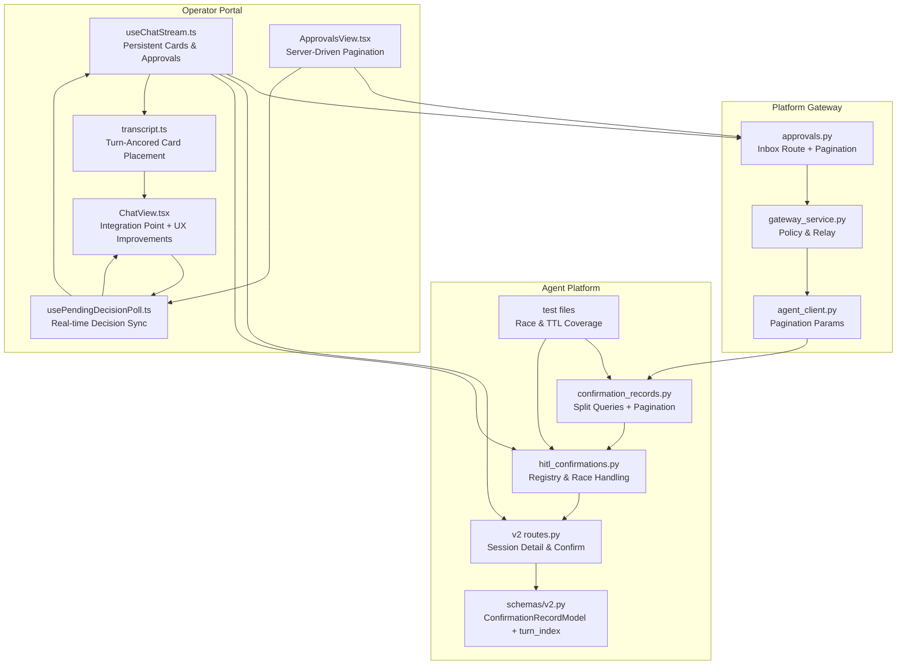

**Diagram sources**
- [confirmation_records.py:110-114](file://products/agent-platform/src/agent_service/services/confirmation_records.py#L110-L114)
- [hitl_confirmations.py:1-256](file://products/agent-platform/src/agent_service/services/hitl_confirmations.py#L1-L256)
- [routes.py:669-705](file://products/agent-platform/src/agent_service/api/v2/routes.py#L669-L705)
- [v2.py:175-199](file://products/agent-platform/src/agent_service/schemas/v2.py#L175-L199)
- [approvals.py:19-58](file://products/platform-gateway/src/platform_gateway/api/routes/approvals.py#L19-L58)
- [gateway_service.py:358-390](file://products/platform-gateway/src/platform_gateway/services/gateway_service.py#L358-L390)
- [agent_client.py:284-310](file://products/platform-gateway/src/platform_gateway/services/agent_client.py#L284-L310)
- [useChatStream.ts:1-435](file://products/operator-portal/web-ui/app/src/stream/useChatStream.ts#L1-L435)
- [usePendingDecisionPoll.ts:1-241](file://products/operator-portal/web-ui/app/src/chat/usePendingDecisionPoll.ts#L1-L241)
- [transcript.ts:137-165](file://products/operator-portal/web-ui/app/src/chat/transcript.ts#L137-L165)
- [ChatView.tsx:470-669](file://products/operator-portal/web-ui/app/src/chat/ChatView.tsx#L470-L669)
- [ChatView.tsx:1325-1340](file://products/operator-portal/web-ui/app/src/chat/ChatView.tsx#L1325-L1340)
- [ApprovalsView.tsx:69-241](file://products/operator-portal/web-ui/app/src/views/control/ApprovalsView.tsx#L69-L241)
- [test_confirmation_records.py:1-647](file://products/agent-platform/tests/test_confirmation_records.py#L1-L647)
- [test_hitl_confirmations.py:1-800](file://products/agent-platform/tests/test_hitl_confirmations.py#L1-L800)

**Section sources**
- [spec.md:11-37](file://docs/specs/SPEC-031-approval-inbox-persistent-confirmation/spec.md#L11-L37)
- [plan.md:3-11](file://docs/specs/SPEC-031-approval-inbox-persistent-confirmation/plan.md#L3-L11)

## Core Components
- Durable confirmation record store: Postgres-backed (with memory fallback) persistence for every parked confirmation and its resolution, keyed by session with a random confirm_id. Enforces per-session cap of 50 records and 30-day history windowing with opportunistic cleanup. **Enhanced** with first-write-wins semantics ensuring only the first successful write persists the outcome, **SPEC-033 turn_index field storing the ordinal of the user turn that parked the confirmation**, and **SPEC-036 split inbox queries separating pending queue (always complete) from paginated history**.
- In-memory confirmation registry: Hot-path single-flight claim/resume for parked kernel confirmations with race-resilient semantics, integrated with durable records for recovery and history.
- **Updated** Gateway approvals inbox: Policy-gated endpoint listing metadata-only items across sessions, **now with server-side pagination support** including `history_limit` and `history_offset` parameters, role-based scoping, and separate logging for pending and history counts.
- **Owner-side live decision sync**: Real-time synchronization via `usePendingDecisionPoll` hook that polls session details every 5 seconds while confirmation cards are pending, ensuring decisions made from external sources appear in the owner's chat window without manual refresh.
- **Turn-anchored card placement**: Transcript seeding places each confirmation card under the specific user turn where it was parked, using the stored `turn_index` field, with fallback to legacy behavior for pre-delivery records.
- **Server-driven History tab**: Portal's Approvals view now uses server-side pagination for the History tab, displaying `history_total` count and providing pagination controls that maintain the current page during refresh operations.
- **Progressive transcript reveal**: Cold-seeded transcripts now reveal replies progressively using the same typewriter mechanism as arrivals, with budget-compressed staggering for long transcripts.
- **Enhanced browser approval card UX**: Confirmation cards now display parsed DOM element labels as prose instead of raw code blocks for improved readability, with technical argument JSON folded behind 'Technical details' expander to reduce visual clutter while maintaining audit trail access.
- **Improved post-approval progress indication**: Labeled spinner row showing 'Agent is working…' appears during agent execution after approval decisions are applied, providing clear feedback about ongoing processing.
- Portal stream and UI: Renders persistent confirmation cards in the owner transcript and provides an Approvals view for deciders, handling already_resolved responses and polling-based refresh with pending count badges.
- Comprehensive test coverage: Validates race condition handling, TTL-scoped cleanup, idempotent resolution, cross-replica safety scenarios, **real-time decision synchronization behavior**, **turn anchoring behavior including multi-record anchoring, pending anchoring, and legacy fallback**, **pagination behavior including limit/offset shifting and total counting**, **browser approval card UX improvements**, and **post-approval progress indication**.

Key acceptance criteria are defined in the spec and fully implemented across all components with comprehensive testing and validation.

**Section sources**
- [spec.md:43-154](file://docs/specs/SPEC-031-approval-inbox-persistent-confirmation/spec.md#L43-L154)
- [plan.md:13-99](file://docs/specs/SPEC-031-approval-inbox-persistent-confirmation/plan.md#L13-L99)

## Architecture Overview
The system centers around a durable confirmation record store that becomes the source of truth for history and restart recovery. The in-memory registry remains the hot path for single-flight claims with race handling. The gateway enforces policy for inbox access and relays structured conflict responses. The portal renders both owner-side cards and an approvals view with persistent state. **Enhanced with SPEC-032 integration providing real-time decision synchronization through bounded polling that ensures decisions made from external sources appear within 5-second intervals without manual refresh, SPEC-033 turn anchoring that ensures each card renders under its parking turn, and SPEC-036 server-side pagination that eliminates data loss from truncated inbox history**.

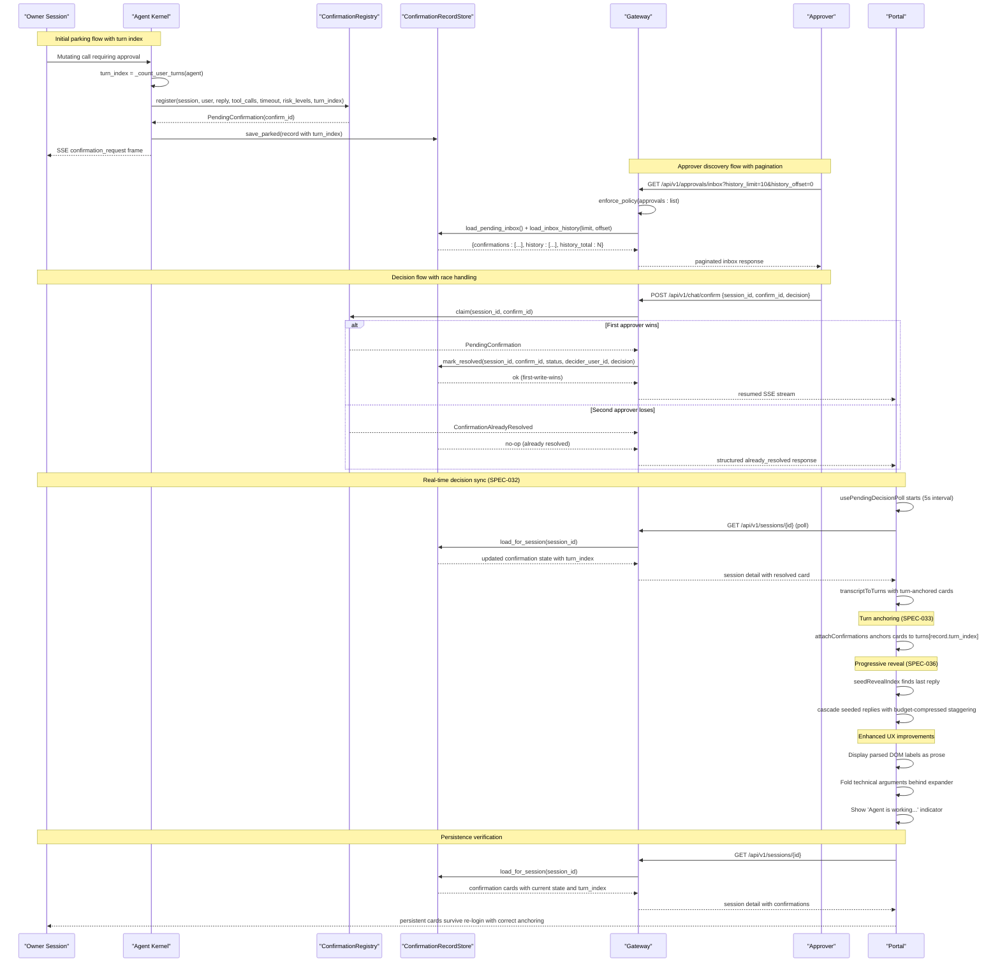

**Diagram sources**
- [hitl_confirmations.py:137-195](file://products/agent-platform/src/agent_service/services/hitl_confirmations.py#L137-L195)
- [confirmation_records.py:575-606](file://products/agent-platform/src/agent_service/services/confirmation_records.py#L575-L606)
- [routes.py:669-705](file://products/agent-platform/src/agent_service/api/v2/routes.py#L669-L705)
- [approvals.py:19-58](file://products/platform-gateway/src/platform_gateway/api/routes/approvals.py#L19-L58)
- [useChatStream.ts:290-378](file://products/operator-portal/web-ui/app/src/stream/useChatStream.ts#L290-L378)
- [usePendingDecisionPoll.ts:51-241](file://products/operator-portal/web-ui/app/src/chat/usePendingDecisionPoll.ts#L51-L241)
- [transcript.ts:231-260](file://products/operator-portal/web-ui/app/src/chat/transcript.ts#L231-L260)
- [ChatView.tsx:470-669](file://products/operator-portal/web-ui/app/src/chat/ChatView.tsx#L470-L669)
- [ChatView.tsx:1325-1340](file://products/operator-portal/web-ui/app/src/chat/ChatView.tsx#L1325-L1340)

## Detailed Component Analysis

### Durable Confirmation Record Store (R-1)
- Provides a protocol-backed interface with in-memory and Postgres implementations sharing the same AGENT_STATE_STORE_BACKEND posture as other platform services.
- Writes: park inserts a pending record before the confirmation_request frame; resolve/expire updates status, decider, and timestamp before confirmation_result flows. **Enhanced** with first-write-wins semantics where subsequent writes become no-ops if the record is already resolved, and **SPEC-033 turn_index field storing the parking turn ordinal**.
- Boundedness: per-session cap of most recent 50 records with oldest-first eviction; resolved rows beyond a 30-day history window are opportunistically swept on writes with configurable limits.
- Startup behavior: **Improved** startup sweep now scopes stale pending row closure to rows exceeding the HITL confirmation TTL, preventing cross-replica interference while ensuring consistent state after failures.
- Integration: module-level singleton used by runtime kernel and v2 routes; environment-driven backend selection with graceful fallback to in-memory mode when Postgres is unavailable.
- **SPEC-033 Enhancement**: The `make_record` function now accepts and stores `turn_index: int | None = None`, with Postgres table gaining an additive `turn_index INTEGER` column via idempotent migration. All load queries and both store backends round-trip the field, with legacy rows loading as None.
- **SPEC-036 Enhancement**: Split inbox queries replace the single combined `load_inbox()` with two separate methods: `load_pending_inbox()` for always-complete pending queue and `load_inbox_history(limit, offset)` for paginated history with total count. Both backends implement the same ordering and retention window logic.

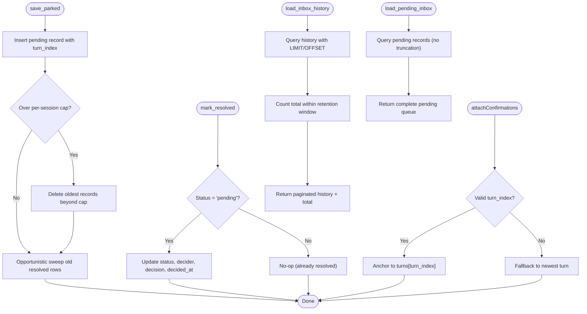

**Diagram sources**
- [confirmation_records.py:433-459](file://products/agent-platform/src/agent_service/services/confirmation_records.py#L433-L459)
- [confirmation_records.py:575-606](file://products/agent-platform/src/agent_service/services/confirmation_records.py#L575-L606)
- [transcript.ts:137-165](file://products/operator-portal/web-ui/app/src/chat/transcript.ts#L137-L165)

**Section sources**
- [confirmation_records.py:1-682](file://products/agent-platform/src/agent_service/services/confirmation_records.py#L1-L682)
- [spec.md:43-67](file://docs/specs/SPEC-031-approval-inbox-persistent-confirmation/spec.md#L43-L67)
- [plan.md:15-36](file://docs/specs/SPEC-031-approval-inbox-persistent-confirmation/plan.md#L15-L36)

### In-Memory Confirmation Registry (R-4)
- Tracks per-session parked confirmations with single-flight claim semantics and race-resilient resolution.
- claim sets exclusive ownership before any response headers; duplicate confirms fail closed with structured already_resolved responses carrying decider attribution instead of opaque errors.
- get raises NotFound for unknown/claimed/resolved entries and Expired for TTL breaches; take_for_expiry ensures cleanup without interrupting in-flight resumes.
- resolve removes the entry from the registry after decision processing and updates durable records for consistency.

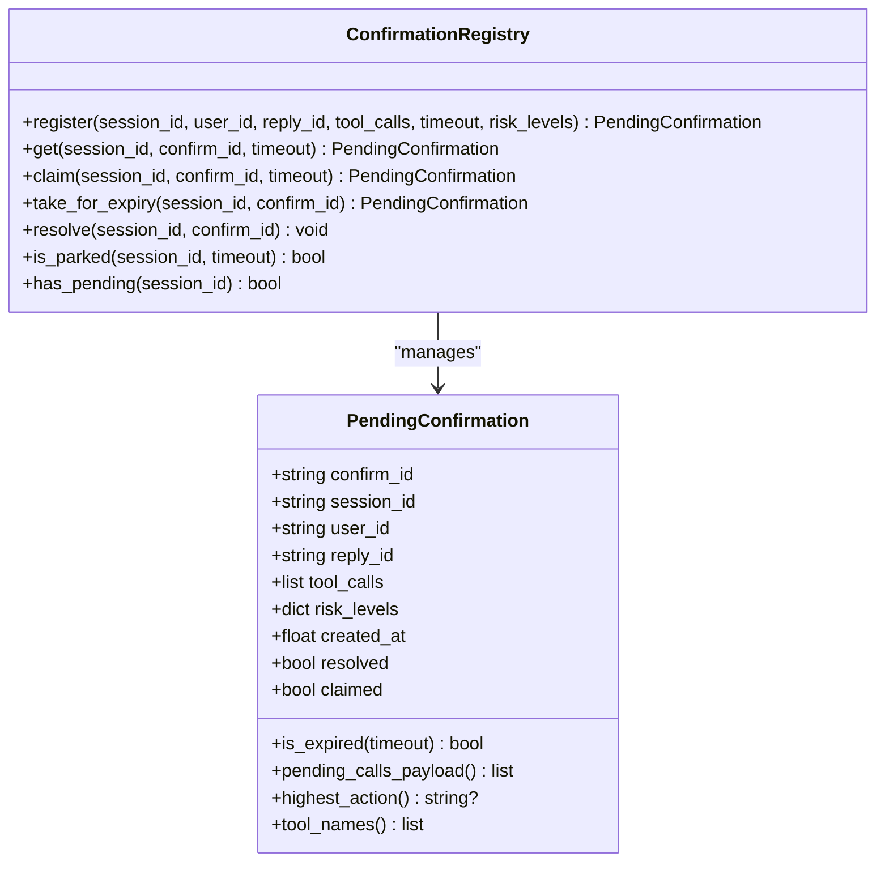

**Diagram sources**
- [hitl_confirmations.py:41-107](file://products/agent-platform/src/agent_service/services/hitl_confirmations.py#L41-L107)
- [hitl_confirmations.py:121-251](file://products/agent-platform/src/agent_service/services/hitl_confirmations.py#L121-L251)

**Section sources**
- [hitl_confirmations.py:1-256](file://products/agent-platform/src/agent_service/services/hitl_confirmations.py#L1-L256)
- [spec.md:112-131](file://docs/specs/SPEC-031-approval-inbox-persistent-confirmation/spec.md#L112-L131)
- [plan.md:70-83](file://docs/specs/SPEC-031-approval-inbox-persistent-confirmation/plan.md#L70-L83)

### Gateway Approvals Inbox (R-3)
- Exposes GET /api/v1/approvals/inbox gated by approvals:list policy action with proper identity resolution and role-based scoping.
- Resolves request identity via JWT verification, enforces policy, then relays to agent-platform to fetch metadata-only items scoped to decider roles.
- Logs item counts and pending counts for observability with authenticated user context and role information.
- Preserves metadata-only posture to avoid exposing owner transcript text while providing sufficient decision context.
- **SPEC-036 Enhancement**: Now accepts `history_limit` (1-50, default 10) and `history_offset` (≥0, default 0) query parameters, forwards them verbatim to the agent service, and logs pending and history counts separately.

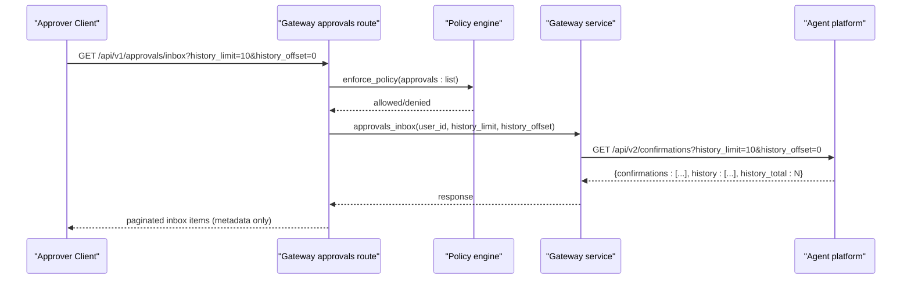

**Diagram sources**
- [approvals.py:19-58](file://products/platform-gateway/src/platform_gateway/api/routes/approvals.py#L19-L58)

**Section sources**
- [approvals.py:1-58](file://products/platform-gateway/src/platform_gateway/api/routes/approvals.py#L1-L58)
- [spec.md:88-110](file://docs/specs/SPEC-031-approval-inbox-persistent-confirmation/spec.md#L88-L110)
- [plan.md:51-68](file://docs/specs/SPEC-031-approval-inbox-persistent-confirmation/plan.md#L51-L68)

### Owner-Side Live Decision Sync (SPEC-032 Integration)
- **Real-time synchronization**: The `usePendingDecisionPoll` hook monitors active chat sessions for pending confirmation cards and polls session details every 5 seconds to detect decisions made from external sources (approver inbox, second browser session).
- **Bounded polling**: Polling runs only while at least one confirmation card is pending and no chat stream is active, preventing interference with live streaming operations.
- **Change-gated updates**: Uses a cheap fingerprint (confirmation statuses + transcript length) to detect state changes, avoiding unnecessary timeline rebuilds and maintaining scroll position.
- **Settle window**: After the last pending card resolves, polling continues for 5 minutes to capture the resumed turn's transcript content which may trail the claim-time record write.
- **Seamless integration**: Re-seeds the timeline through the same `transcriptToTurns` path used for initial load, ensuring consistent rendering of decided cards with attribution and resumed content.
- **Post-approval progress indication**: Returns `settling` state that drives the 'Agent is working...' indicator during the gap between decision application and agent response arrival.

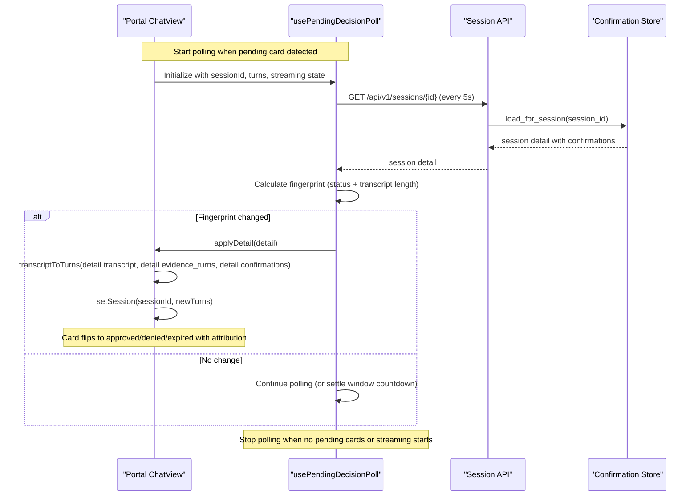

**Diagram sources**
- [usePendingDecisionPoll.ts:51-241](file://products/operator-portal/web-ui/app/src/chat/usePendingDecisionPoll.ts#L51-L241)
- [ChatView.tsx:1325-1340](file://products/operator-portal/web-ui/app/src/chat/ChatView.tsx#L1325-L1340)

**Section sources**
- [usePendingDecisionPoll.ts:1-241](file://products/operator-portal/web-ui/app/src/chat/usePendingDecisionPoll.ts#L1-L241)
- [ChatView.tsx:1325-1340](file://products/operator-portal/web-ui/app/src/chat/ChatView.tsx#L1325-L1340)
- [spec.md:44-91](file://docs/specs/SPEC-032-owner-side-live-decision-sync/spec.md#L44-L91)
- [plan.md:5-13](file://docs/specs/SPEC-032-owner-side-live-decision-sync/plan.md#L5-L13)

### Turn-Anchored Card Placement (SPEC-033 Enhancement)
- **Precise anchoring**: Each confirmation card is placed under the specific user turn where it was parked, using the stored `turn_index` field, rather than stacking all cards under the newest turn.
- **Legacy compatibility**: Records without a usable `turn_index` (pre-delivery records, null values, or out-of-range indices) fall back to the legacy behavior of anchoring to the newest turn or creating a synthetic turn for empty transcripts.
- **Pending card support**: Pending confirmation cards also anchor to their parking turn and drive `confirmationPending` on that specific turn, maintaining existing behavior.
- **Multi-record handling**: Sessions with multiple confirmed requests render each card under its own turn group, eliminating the stacking issue observed in v0.14.1.

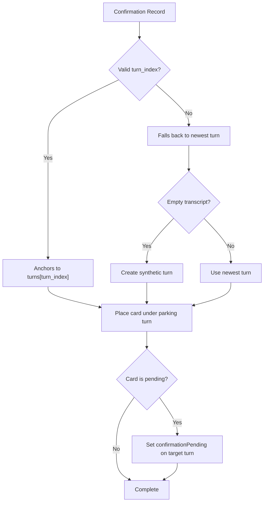

**Diagram sources**
- [transcript.ts:137-165](file://products/operator-portal/web-ui/app/src/chat/transcript.ts#L137-L165)

**Section sources**
- [transcript.ts:137-165](file://products/operator-portal/web-ui/app/src/chat/transcript.ts#L137-L165)
- [spec.md:74-87](file://docs/specs/SPEC-033-confirmation-card-turn-anchoring/spec.md#L74-L87)
- [plan.md:38-46](file://docs/specs/SPEC-033-confirmation-card-turn-anchoring/plan.md#L38-L46)

### Server-Driven History Tab (SPEC-036 Enhancement)
- **Server-side pagination**: The History tab now uses server-side pagination with `history_limit` (10 per page) and `history_offset` parameters, eliminating the previous client-side slicing of truncated payloads.
- **State management**: Maintains `historyTotal` count for accurate pagination display and `historyOffset` for tracking the current page during refresh operations.
- **User experience**: Pagination controls are hidden when only one page is needed, and page navigation refetches data while maintaining the current page context.
- **Local optimization**: When a decision is made from the Pending tab, the record is immediately moved to the first History page locally for responsive UX, normalizing on the next refresh.
- **Robust error handling**: Keeps last good lists on transient failures, preventing transport errors from masquerading as empty inboxes.

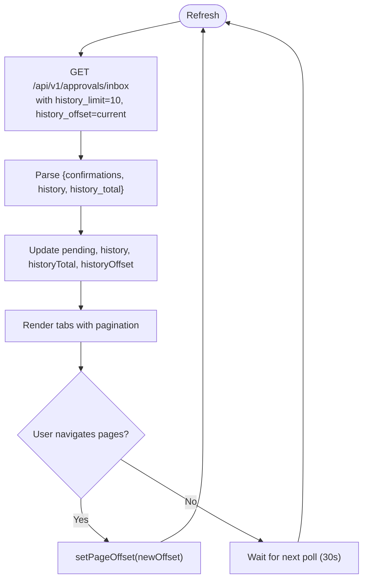

**Diagram sources**
- [ApprovalsView.tsx:69-241](file://products/operator-portal/web-ui/app/src/views/control/ApprovalsView.tsx#L69-L241)

**Section sources**
- [ApprovalsView.tsx:69-241](file://products/operator-portal/web-ui/app/src/views/control/ApprovalsView.tsx#L69-L241)
- [spec.md:111-128](file://docs/specs/SPEC-036-inbox-pagination-and-seeded-reveal/spec.md#L111-L128)
- [plan.md:76-98](file://docs/specs/SPEC-036-inbox-pagination-and-seeded-reveal/plan.md#L76-L98)

### Progressive Transcript Reveal (SPEC-036 Enhancement)
- **Cold-seed cascading**: When a session is opened cold (first load in a tab), replies reveal progressively using the same typewriter mechanism as arrivals, with top-to-bottom cascading.
- **Budget compression**: For long transcripts, the stagger delay compresses under a 3-second budget so the whole cascade starts quickly regardless of transcript length.
- **Integration with existing systems**: Works seamlessly with arrival detection and doesn't interfere with live streaming operations.
- **Accessibility**: Respects `prefers-reduced-motion` settings for instant rendering when users prefer reduced motion.

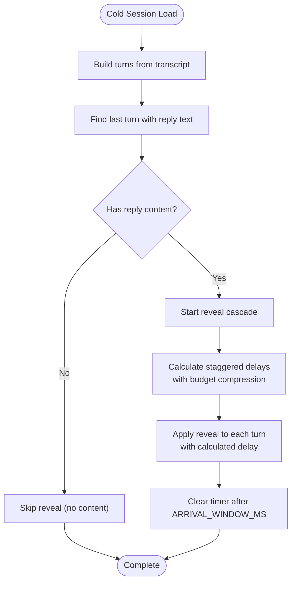

**Diagram sources**
- [transcript.ts:231-260](file://products/operator-portal/web-ui/app/src/chat/transcript.ts#L231-L260)
- [ChatView.tsx:764-776](file://products/operator-portal/web-ui/app/src/chat/ChatView.tsx#L764-L776)

**Section sources**
- [transcript.ts:231-260](file://products/operator-portal/web-ui/app/src/chat/transcript.ts#L231-L260)
- [ChatView.tsx:764-776](file://products/operator-portal/web-ui/app/src/chat/ChatView.tsx#L764-L776)
- [spec.md:44-67](file://docs/specs/SPEC-036-inbox-pagination-and-seeded-reveal/spec.md#L44-L67)
- [plan.md:9-36](file://docs/specs/SPEC-036-inbox-pagination-and-seeded-reveal/plan.md#L9-L36)

### Enhanced Browser Approval Card UX
- **Parsed DOM element labels**: Confirmation cards now display parsed DOM element labels as prose text instead of raw code blocks, significantly improving readability for browser-based approval workflows.
- **Technical details expander**: Raw technical argument JSON is now folded behind a 'Technical details' expander, reducing visual clutter while maintaining full audit trail access with one click.
- **Improved card layout**: The confirmation card interface has been refined to prioritize human-readable information while keeping technical details accessible but not overwhelming.
- **Audit trail preservation**: All technical details remain available in the audit trail unchanged, ensuring compliance requirements are met while improving the user experience.

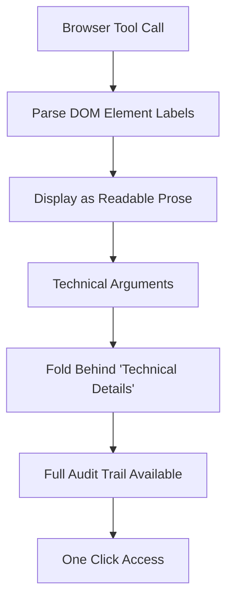

**Diagram sources**
- [ChatView.tsx:470-478](file://products/operator-portal/web-ui/app/src/chat/ChatView.tsx#L470-L478)
- [ConfirmationCard.test.tsx:233-252](file://products/operator-portal/web-ui/app/src/chat/__tests__/ConfirmationCard.test.tsx#L233-L252)

**Section sources**
- [ChatView.tsx:470-478](file://products/operator-portal/web-ui/app/src/chat/ChatView.tsx#L470-L478)
- [ConfirmationCard.test.tsx:233-252](file://products/operator-portal/web-ui/app/src/chat/__tests__/ConfirmationCard.test.tsx#L233-L252)

### Improved Post-Approval Progress Indication
- **Labeled spinner row**: After approval decisions are applied, a clearly labeled spinner row showing 'Agent is working...' appears directly under the reply and above the tool evidence.
- **Activity indicator positioning**: The indicator sits above the evidence panel because new tool frames land below it as the resumed stream progresses, providing clear visual hierarchy.
- **Contextual timing**: The indicator appears during the gap between decision application and agent response arrival, helping operators understand that processing is ongoing.
- **Automatic dismissal**: The indicator automatically disappears when the agent's resumed response arrives, providing seamless transition from processing to completion.

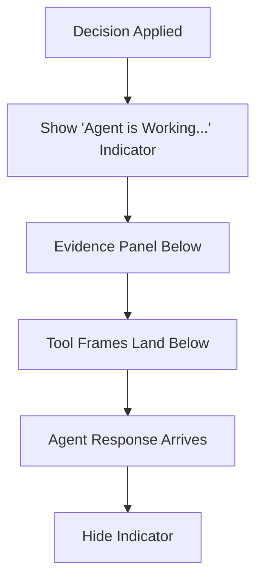

**Diagram sources**
- [ChatView.tsx:659-669](file://products/operator-portal/web-ui/app/src/chat/ChatView.tsx#L659-L669)
- [TurnGroup.test.tsx:87-107](file://products/operator-portal/web-ui/app/src/chat/__tests__/TurnGroup.test.tsx#L87-L107)

**Section sources**
- [ChatView.tsx:659-669](file://products/operator-portal/web-ui/app/src/chat/ChatView.tsx#L659-L669)
- [TurnGroup.test.tsx:87-107](file://products/operator-portal/web-ui/app/src/chat/__tests__/TurnGroup.test.tsx#L87-L107)

### Portal Stream and Persistent Cards (R-2, R-5)
- useChatStream handles confirmation_request frames to create pending cards and confirmation_result frames to lock them into final states with persistent attribution.
- Deciding a confirmation opens a confirm stream; errors and aborts are handled gracefully, preserving pending state when appropriate and updating local card state immediately.
- Owner-side transcripts merge persisted confirmations from session detail payloads so cards survive re-login with full decision attribution and read-only semantics.
- Approvals view provides polling-based refresh with pending count badges and race response handling that flips cards to resolved states with approver attribution.
- **Enhanced with SPEC-032**: Now integrates with usePendingDecisionPoll hook for real-time decision synchronization, ensuring owners see decisions made from external sources without manual refresh.
- **Enhanced with SPEC-033**: Uses transcriptToTurns with turn-anchored card placement, ensuring each card renders under its parking turn with proper fallback behavior.
- **Enhanced with SPEC-036**: Integrates with server-driven pagination for the History tab and progressive transcript reveal for cold-seeded sessions.
- **Enhanced with UX improvements**: Displays parsed DOM element labels as prose, folds technical arguments behind expander, and shows post-approval progress indication.

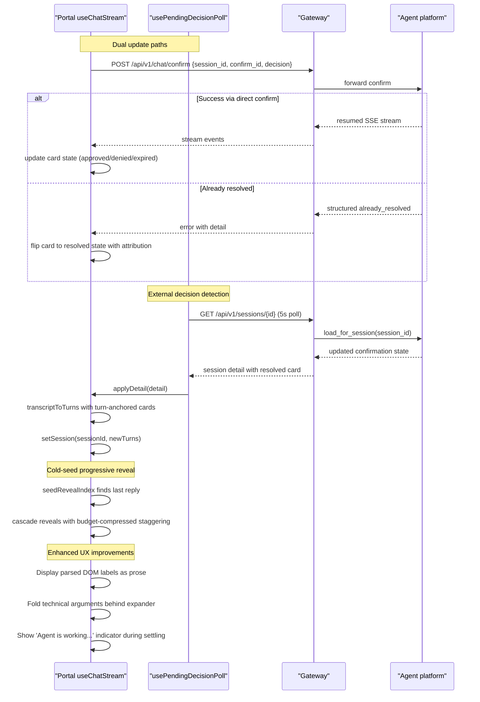

**Diagram sources**
- [useChatStream.ts:161-194](file://products/operator-portal/web-ui/app/src/stream/useChatStream.ts#L161-L194)
- [useChatStream.ts:290-378](file://products/operator-portal/web-ui/app/src/stream/useChatStream.ts#L290-L378)
- [usePendingDecisionPoll.ts:51-241](file://products/operator-portal/web-ui/app/src/chat/usePendingDecisionPoll.ts#L51-L241)
- [transcript.ts:137-165](file://products/operator-portal/web-ui/app/src/chat/transcript.ts#L137-L165)
- [ChatView.tsx:470-669](file://products/operator-portal/web-ui/app/src/chat/ChatView.tsx#L470-L669)

**Section sources**
- [useChatStream.ts:1-435](file://products/operator-portal/web-ui/app/src/stream/useChatStream.ts#L1-L435)
- [spec.md:69-86](file://docs/specs/SPEC-031-approval-inbox-persistent-confirmation/spec.md#L69-L86)
- [spec.md:133-154](file://docs/specs/SPEC-031-approval-inbox-persistent-confirmation/spec.md#L133-L154)
- [plan.md:38-49](file://docs/specs/SPEC-031-approval-inbox-persistent-confirmation/plan.md#L38-L49)
- [plan.md:85-99](file://docs/specs/SPEC-031-approval-inbox-persistent-confirmation/plan.md#L85-L99)

## Dependency Analysis
- confirmation_records.py depends on environment configuration to select backend and initializes Postgres tables idempotently with startup cleanup of stale pending records. **Enhanced** with improved TTL-scoped startup sweep to prevent cross-replica interference, **SPEC-033 turn_index field support**, and **SPEC-036 split inbox queries**.
- hitl_confirmations.py coordinates with the kernel parking mechanism and exposes exceptions for not found and expired cases; it integrates with durable records via callers that persist best-effort with race handling.
- approvals.py depends on policy enforcement and gateway services to relay inbox queries while preserving role scoping and metadata-only posture with proper identity resolution. **Updated** to accept and forward pagination parameters.
- **New**: usePendingDecisionPoll.ts depends on session detail API and integrates with ChatView through the existing transcript seeding path, providing real-time decision synchronization without backend changes.
- useChatStream.ts consumes stream events and drives confirm requests, handling structured conflicts and updating local card state with race response processing.
- **Enhanced**: Comprehensive test coverage validates race condition handling, TTL-scoped cleanup, idempotent resolution semantics, **real-time decision synchronization behavior including settle windows and change gating**, **SPEC-033 turn anchoring behavior including multi-record anchoring, pending anchoring, and legacy fallback**, **SPEC-036 pagination behavior including limit/offset shifting and total counting**, **browser approval card UX improvements**, and **post-approval progress indication**.

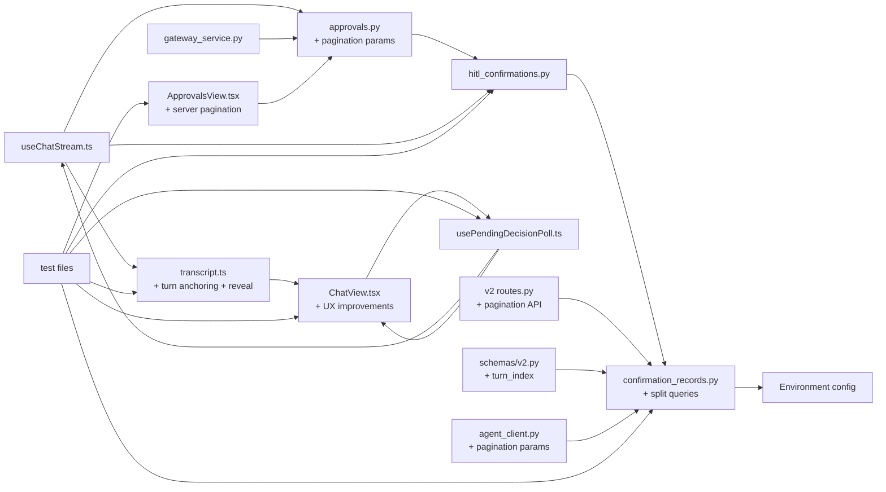

**Diagram sources**
- [confirmation_records.py:548-682](file://products/agent-platform/src/agent_service/services/confirmation_records.py#L548-L682)
- [hitl_confirmations.py:121-256](file://products/agent-platform/src/agent_service/services/hitl_confirmations.py#L121-L256)
- [approvals.py:1-58](file://products/platform-gateway/src/platform_gateway/api/routes/approvals.py#L1-L58)
- [useChatStream.ts:1-435](file://products/operator-portal/web-ui/app/src/stream/useChatStream.ts#L1-L435)
- [usePendingDecisionPoll.ts:1-241](file://products/operator-portal/web-ui/app/src/chat/usePendingDecisionPoll.ts#L1-L241)
- [transcript.ts:137-260](file://products/operator-portal/web-ui/app/src/chat/transcript.ts#L137-L260)
- [ChatView.tsx:470-669](file://products/operator-portal/web-ui/app/src/chat/ChatView.tsx#L470-L669)
- [ChatView.tsx:1325-1340](file://products/operator-portal/web-ui/app/src/chat/ChatView.tsx#L1325-L1340)
- [routes.py:669-705](file://products/agent-platform/src/agent_service/api/v2/routes.py#L669-L705)
- [v2.py:175-199](file://products/agent-platform/src/agent_service/schemas/v2.py#L175-L199)
- [gateway_service.py:358-390](file://products/platform-gateway/src/platform_gateway/services/gateway_service.py#L358-L390)
- [agent_client.py:284-310](file://products/platform-gateway/src/platform_gateway/services/agent_client.py#L284-L310)
- [ApprovalsView.tsx:69-241](file://products/operator-portal/web-ui/app/src/views/control/ApprovalsView.tsx#L69-L241)
- [test_confirmation_records.py:1-647](file://products/agent-platform/tests/test_confirmation_records.py#L1-L647)
- [test_hitl_confirmations.py:1-800](file://products/agent-platform/tests/test_hitl_confirmations.py#L1-L800)
- [usePendingDecisionPoll.test.ts:1-297](file://products/operator-portal/web-ui/app/src/chat/__tests__/usePendingDecisionPoll.test.ts#L1-L297)
- [transcript.test.ts:312-365](file://products/operator-portal/web-ui/app/src/chat/__tests__/transcript.test.ts#L312-L365)
- [ConfirmationCard.test.tsx:233-252](file://products/operator-portal/web-ui/app/src/chat/__tests__/ConfirmationCard.test.tsx#L233-L252)
- [TurnGroup.test.tsx:87-107](file://products/operator-portal/web-ui/app/src/chat/__tests__/TurnGroup.test.tsx#L87-L107)

**Section sources**
- [confirmation_records.py:548-682](file://products/agent-platform/src/agent_service/services/confirmation_records.py#L548-L682)
- [hitl_confirmations.py:121-256](file://products/agent-platform/src/agent_service/services/hitl_confirmations.py#L121-L256)
- [approvals.py:1-58](file://products/platform-gateway/src/platform_gateway/api/routes/approvals.py#L1-L58)
- [useChatStream.ts:1-435](file://products/operator-portal/web-ui/app/src/stream/useChatStream.ts#L1-L435)

## Performance Considerations
- In-memory registry remains the hot path for single-flight claims; durable store operations are bounded and opportunistic (cap eviction, sweep) to minimize database load.
- Postgres queries are parameterized and indexed by session and status; inbox queries limit results to 100 items and filter by 30-day history window for optimal performance.
- **Enhanced** startup sweep now uses TTL-scoped cleanup to prevent cross-replica interference, reducing unnecessary database operations during startup.
- **SPEC-032 Enhancement**: Owner-side polling uses a lightweight 5-second interval with change-gated updates, minimizing network overhead while ensuring near-real-time decision visibility. The settle window (5 minutes) captures delayed transcript content without excessive polling.
- Portal uses polling-based refresh for the Approvals view with 30-second intervals to avoid push channels while maintaining responsive UX; card state updates are incremental and lightweight.
- Backend failures trigger automatic fallback to in-memory mode, ensuring service availability even when Postgres is unavailable, though durability is temporarily degraded.
- **Real-time sync optimization**: Change fingerprinting prevents unnecessary timeline rebuilds, maintaining scroll position and composer draft state during decision synchronization.
- **SPEC-033 Optimization**: Turn anchoring uses efficient array indexing with bounds checking, falling back to legacy behavior only when necessary, minimizing performance impact on existing deployments.
- **SPEC-036 Optimization**: Server-side pagination eliminates client-side slicing overhead and prevents data loss from truncated payloads. The split inbox queries optimize database access patterns with dedicated pending and history queries. Budget-compressed transcript reveal ensures fast initial load times for long transcripts.
- **UX Performance**: Parsed DOM element labels are rendered efficiently as prose text, technical details expander reduces initial render complexity, and post-approval indicator uses lightweight spinners that don't impact overall performance.

## Troubleshooting Guide
- Already resolved conflicts: When a confirm hits a resolved record, the system returns a structured already_resolved response carrying decider, decision, and decided-at timestamp instead of opaque errors, enabling proper UI state synchronization. **Enhanced** with comprehensive test coverage validating this behavior.
- Stale tabs and races: A confirm attempt against a resolved record returns the same structured outcome with approver attribution; no second execution occurs and the losing approver sees who decided first. **Validated** through extensive race condition tests.
- Expired confirmations: If a confirmation expires before a decision, the portal marks the card as expired with appropriate messaging and prevents further actions while maintaining audit trail visibility.
- Backend failures: If Postgres is unavailable, the confirmation record store falls back to in-memory mode automatically; durability is degraded but the service remains usable with live-only cards.
- Role-based access issues: Non-decider users receive 403 errors on approvals inbox access with proper audit logging; ensure proper role assignment in the policy bundle.
- Cross-replica interference: **New** startup sweep now properly scopes stale pending row closure to rows exceeding the HITL TTL, preventing one replica from incorrectly expiring another replica's active confirmations.
- **Real-time sync issues**: If decisions don't appear in the owner's window, check that the usePendingDecisionPoll hook is active (should show 5-second polling), verify no streaming is active (which would pause polling), and confirm the session still has pending confirmation cards. Transport errors are handled gracefully with retry logic.
- **Turn anchoring issues**: If confirmation cards appear stacked under the wrong turn, verify that the `turn_index` field is present in the confirmation record (should be non-null for post-delivery records), check that the transcript has enough turns to accommodate the index, and confirm that the legacy fallback behavior is working correctly for pre-delivery records.
- **Pagination issues**: If History tab shows incomplete data, verify that `history_total` is being returned correctly from the server, check that pagination parameters (`history_limit`, `history_offset`) are being passed through the gateway, and confirm that the portal is maintaining the current page offset during refresh operations. Data loss should not occur as the pending queue is never truncated and history is server-side paginated.
- **Transcript reveal issues**: If cold-seeded transcripts appear instantly without progressive reveal, check that the session is being loaded cold (not cache-restore), verify that `seedRevealIndex` is finding the last reply correctly, and confirm that budget compression is working for long transcripts.
- **Browser approval card UX issues**: If confirmation cards show raw code blocks instead of parsed prose, verify that the DOM parsing is working correctly and that the technical details expander is functioning. Check that audit trails still contain full technical details even when displayed as prose.
- **Post-approval progress indication issues**: If the 'Agent is working...' indicator doesn't appear after approval, verify that the settling state is being properly tracked by usePendingDecisionPoll and that the ChatView is receiving the settling prop. Check that the indicator disappears when agent response arrives.

**Section sources**
- [hitl_confirmations.py:22-28](file://products/agent-platform/src/agent_service/services/hitl_confirmations.py#L22-L28)
- [confirmation_records.py:330-341](file://products/agent-platform/src/agent_service/services/confirmation_records.py#L330-L341)
- [useChatStream.ts:351-372](file://products/operator-portal/web-ui/app/src/stream/useChatStream.ts#L351-L372)
- [test_confirmation_records.py:413-497](file://products/agent-platform/tests/test_confirmation_records.py#L413-L497)
- [test_hitl_confirmations.py:498-513](file://products/agent-platform/tests/test_hitl_confirmations.py#L498-L513)
- [usePendingDecisionPoll.test.ts:156-179](file://products/operator-portal/web-ui/app/src/chat/__tests__/usePendingDecisionPoll.test.ts#L156-L179)
- [transcript.test.ts:312-365](file://products/operator-portal/web-ui/app/src/chat/__tests__/transcript.test.ts#L312-L365)
- [ConfirmationCard.test.tsx:233-252](file://products/operator-portal/web-ui/app/src/chat/__tests__/ConfirmationCard.test.tsx#L233-L252)
- [TurnGroup.test.tsx:87-107](file://products/operator-portal/web-ui/app/src/chat/__tests__/TurnGroup.test.tsx#L87-L107)

## Conclusion
SPEC-031 introduces durable confirmation lifecycle records, persistent owner-side cards, an approvals inbox for designated approvers, and race-resilient resolution semantics. The design preserves existing tier enforcement and audit semantics while adding robust discovery, persistence, and UI surfaces. The result is a trustworthy approval gate where parked calls are visible, auditable, and consistently resolved even under restarts, replicas, and concurrent decisions.

**Enhanced with SPEC-032, SPEC-033, and SPEC-036 integration**: The system now provides real-time decision synchronization between the approver inbox and owner's chat window through a bounded 5-second polling mechanism, ensures each confirmation card renders under the specific user turn where it was parked rather than stacking all cards under the newest turn, and implements server-side pagination for inbox history that eliminates data loss from truncated payloads. Additionally, cold-seeded transcripts now reveal progressively with budget-compressed staggering for better user experience. 

**Updated with enhanced browser approval card UX improvements**: The system now displays parsed DOM element labels as prose instead of raw code blocks for improved readability, folds technical argument JSON behind 'Technical details' expander to reduce visual clutter while maintaining audit trail access, and provides improved post-approval progress indication with labeled spinner row showing 'Agent is working…' during agent execution. These UX enhancements significantly improve the operator experience for browser-based approval workflows while maintaining full audit trail capabilities and compliance requirements.

The implementation includes first-write-wins semantics ensuring deterministic resolution across concurrent approvers, improved startup sweep scoping preventing cross-replica interference, comprehensive test coverage validating race condition handling and TTL-scoped cleanup, **real-time decision synchronization with change-gated updates and settle windows**, **turn anchoring with legacy fallback support**, **server-side pagination with progressive transcript reveal**, **enhanced browser approval card UX with parsed DOM labels and technical details expander**, and **improved post-approval progress indication**. All acceptance criteria have been validated through unit tests, contract tests, and live cluster validation.

## Appendices
- Task breakdown and delivery gates are captured in the tasks file and guide validation steps, e2e extensions, and documentation updates.
- The specification status is set to `delivered` with all requirements (R-1 through R-5) fully implemented and tested.
- Live cluster validation confirmed operator re-login shows decided cards, approver inbox approve/deny workflows, race response handling, **real-time decision synchronization**, **proper turn anchoring of confirmation cards**, **server-side pagination functionality**, **enhanced browser approval card UX**, and **post-approval progress indication**.
- **New**: Comprehensive test coverage validates first-write-wins semantics, TTL-scoped startup sweep, race condition handling, cross-replica safety scenarios, **real-time decision synchronization including settle windows, change gating, and streaming interference prevention**, **SPEC-033 turn anchoring including multi-record anchoring, pending anchoring, and legacy fallback behavior**, **SPEC-036 pagination including limit/offset shifting, total counting, and progressive transcript reveal**, **browser approval card UX improvements including parsed DOM labels and technical details expander**, and **post-approval progress indication with labeled spinner row**.

**Section sources**
- [tasks.md:1-52](file://docs/specs/SPEC-031-approval-inbox-persistent-confirmation/tasks.md#L1-L52)
- [spec.md:197-210](file://docs/specs/SPEC-031-approval-inbox-persistent-confirmation/spec.md#L197-L210)
- [test_confirmation_records.py:99-112](file://products/agent-platform/tests/test_confirmation_records.py#L99-L112)
- [test_confirmation_records.py:348-383](file://products/agent-platform/tests/test_confirmation_records.py#L348-L383)
- [test_hitl_confirmations.py:498-513](file://products/agent-platform/tests/test_hitl_confirmations.py#L498-L513)
- [usePendingDecisionPoll.test.ts:112-148](file://products/operator-portal/web-ui/app/src/chat/__tests__/usePendingDecisionPoll.test.ts#L112-L148)
- [transcript.test.ts:312-365](file://products/operator-portal/web-ui/app/src/chat/__tests__/transcript.test.ts#L312-L365)
- [ConfirmationCard.test.tsx:233-252](file://products/operator-portal/web-ui/app/src/chat/__tests__/ConfirmationCard.test.tsx#L233-L252)
- [TurnGroup.test.tsx:87-107](file://products/operator-portal/web-ui/app/src/chat/__tests__/TurnGroup.test.tsx#L87-L107)