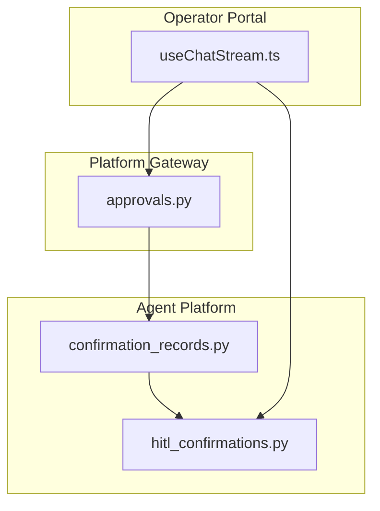
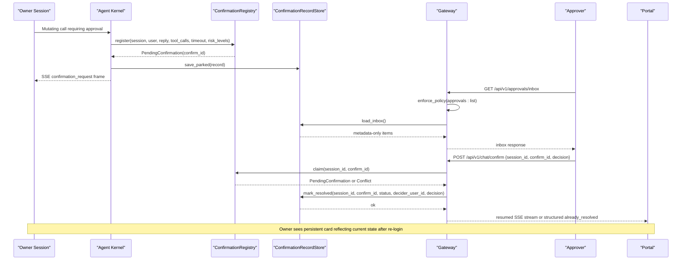
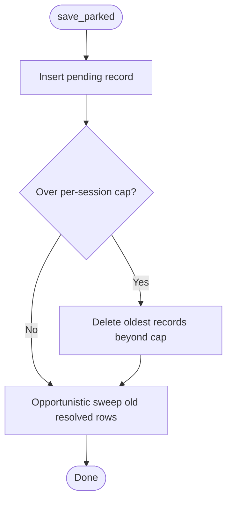
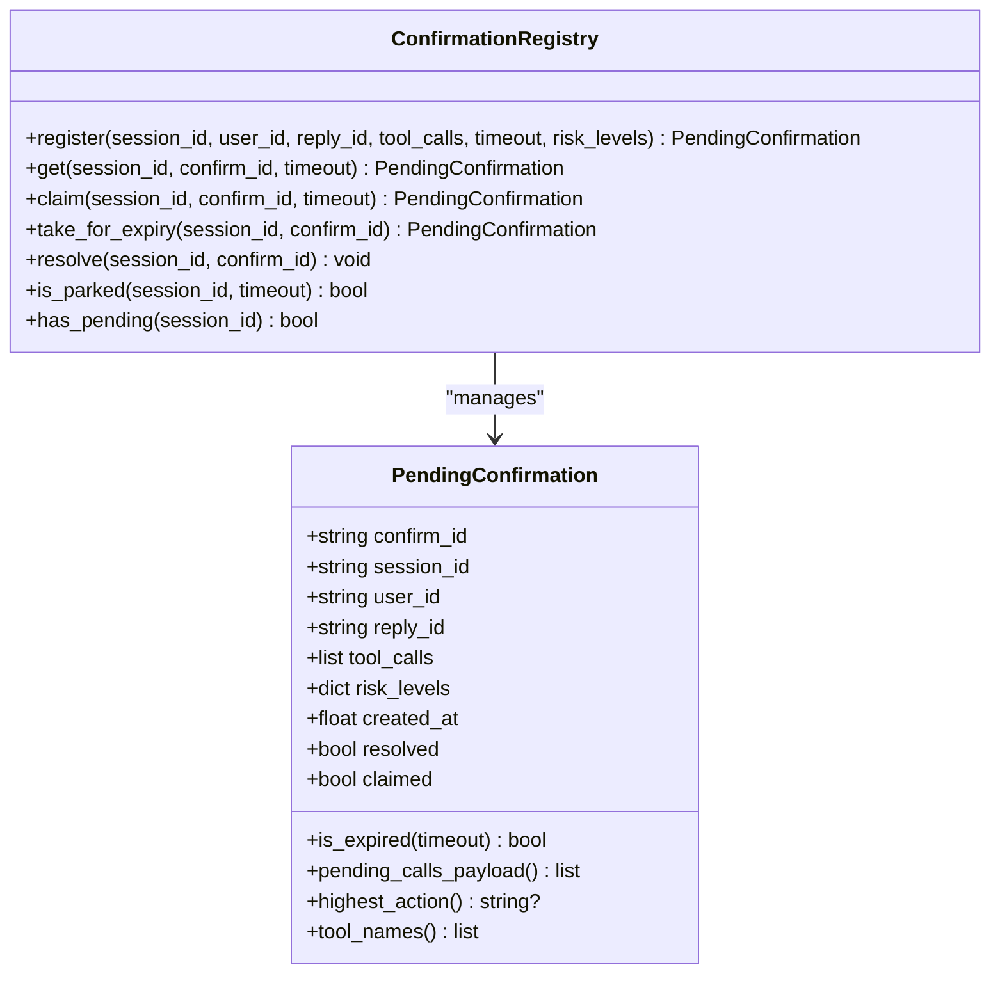
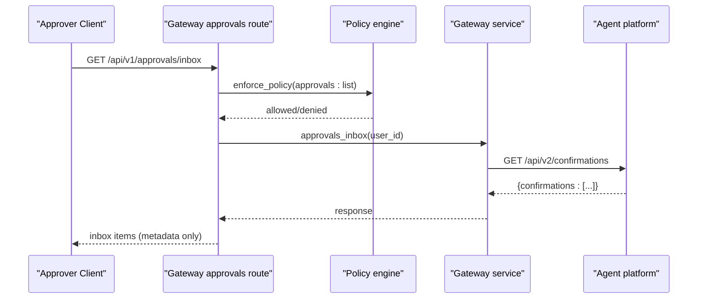
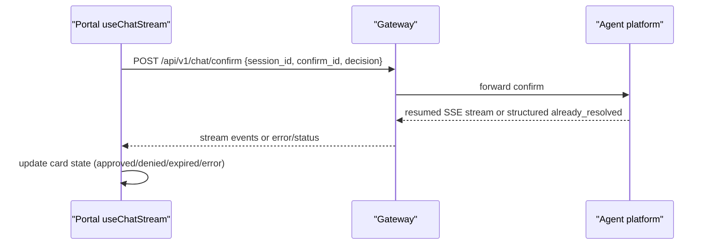
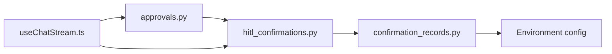

# SPEC-031: Approval Inbox and Persistent Confirmation Cards

<cite>
**Referenced Files in This Document**
- [spec.md](file://docs/specs/SPEC-031-approval-inbox-persistent-confirmation/spec.md)
- [plan.md](file://docs/specs/SPEC-031-approval-inbox-persistent-confirmation/plan.md)
- [tasks.md](file://docs/specs/SPEC-031-approval-inbox-persistent-confirmation/tasks.md)
- [confirmation_records.py](file://products/agent-platform/src/agent_service/services/confirmation_records.py)
- [hitl_confirmations.py](file://products/agent-platform/src/agent_service/services/hitl_confirmations.py)
- [approvals.py](file://products/platform-gateway/src/platform_gateway/api/routes/approvals.py)
- [useChatStream.ts](file://products/operator-portal/web-ui/app/src/stream/useChatStream.ts)
</cite>

## Table of Contents
1. [Introduction](#introduction)
2. [Project Structure](#project-structure)
3. [Core Components](#core-components)
4. [Architecture Overview](#architecture-overview)
5. [Detailed Component Analysis](#detailed-component-analysis)
6. [Dependency Analysis](#dependency-analysis)
7. [Performance Considerations](#performance-considerations)
8. [Troubleshooting Guide](#troubleshooting-guide)
9. [Conclusion](#conclusion)
10. [Appendices](#appendices)

## Introduction
This document specifies the design and implementation of SPEC-031: Approval Inbox and Persistent Confirmation Cards. It makes the tier_2 approval workflow end-to-end usable in the portal by introducing durable confirmation lifecycle records, persistent owner-side confirmation cards, an approvals inbox for designated approvers, race-resilient resolution semantics, and a portal Approvals view with persisted cards. The goal is to ensure that parked confirmations survive re-login, pod restarts, and replica boundaries; approvers can discover and act on pending items; and concurrent decisions resolve deterministically with structured outcomes.

## Project Structure
SPEC-031 spans three product areas:
- Agent platform: durable confirmation store, registry integration, session detail augmentation, and confirm route enhancements.
- Platform gateway: approvals inbox route with policy enforcement and relay semantics.
- Operator portal: Approvals view and persistent card rendering in transcripts.

**Diagram sources**
- [confirmation_records.py:1-565](file://products/agent-platform/src/agent_service/services/confirmation_records.py#L1-L565)
- [hitl_confirmations.py:1-256](file://products/agent-platform/src/agent_service/services/hitl_confirmations.py#L1-L256)
- [approvals.py:1-51](file://products/platform-gateway/src/platform_gateway/api/routes/approvals.py#L1-L51)
- [useChatStream.ts:1-411](file://products/operator-portal/web-ui/app/src/stream/useChatStream.ts#L1-L411)

**Section sources**
- [spec.md:11-37](file://docs/specs/SPEC-031-approval-inbox-persistent-confirmation/spec.md#L11-L37)
- [plan.md:3-11](file://docs/specs/SPEC-031-approval-inbox-persistent-confirmation/plan.md#L3-L11)

## Core Components
- Durable confirmation record store: Postgres-backed (with memory fallback) persistence for every parked confirmation and its resolution, keyed by session with a random confirm_id. Enforces per-session cap and history windowing.
- In-memory confirmation registry: Hot-path single-flight claim/resume for parked kernel confirmations, integrated with durable records for recovery and history.
- Gateway approvals inbox: Policy-gated endpoint listing metadata-only items across sessions, including pending and historical records within a time window.
- Portal stream and UI: Renders persistent confirmation cards in the owner transcript and provides an Approvals view for deciders, handling already_resolved responses and polling-based refresh.

Key acceptance criteria are defined in the spec and mapped to implementation points below.

**Section sources**
- [spec.md:43-154](file://docs/specs/SPEC-031-approval-inbox-persistent-confirmation/spec.md#L43-L154)
- [plan.md:13-99](file://docs/specs/SPEC-031-approval-inbox-persistent-confirmation/plan.md#L13-L99)

## Architecture Overview
The system centers around a durable confirmation record store that becomes the source of truth for history and restart recovery. The in-memory registry remains the hot path for single-flight claims. The gateway enforces policy for inbox access and relays structured conflict responses. The portal renders both owner-side cards and an approvals view.

**Diagram sources**
- [hitl_confirmations.py:137-195](file://products/agent-platform/src/agent_service/services/hitl_confirmations.py#L137-L195)
- [confirmation_records.py:407-455](file://products/agent-platform/src/agent_service/services/confirmation_records.py#L407-L455)
- [approvals.py:19-50](file://products/platform-gateway/src/platform_gateway/api/routes/approvals.py#L19-L50)
- [useChatStream.ts:290-378](file://products/operator-portal/web-ui/app/src/stream/useChatStream.ts#L290-L378)

## Detailed Component Analysis

### Durable Confirmation Record Store (R-1)
- Provides a protocol-backed interface with in-memory and Postgres implementations.
- Writes: park inserts a pending record before the confirmation_request frame; resolve/expire updates status, decider, and timestamp before confirmation_result flows.
- Boundedness: per-session cap of most recent 50 records; oldest evicted first; resolved rows beyond a 30-day history window are opportunistically swept on writes.
- Startup behavior: stale pending rows are closed as expired because parked kernel replies do not survive process restarts.
- Integration: module-level singleton used by runtime kernel and v2 routes; environment-driven backend selection with graceful fallback.

**Diagram sources**
- [confirmation_records.py:407-433](file://products/agent-platform/src/agent_service/services/confirmation_records.py#L407-L433)

**Section sources**
- [confirmation_records.py:1-565](file://products/agent-platform/src/agent_service/services/confirmation_records.py#L1-L565)
- [spec.md:43-67](file://docs/specs/SPEC-031-approval-inbox-persistent-confirmation/spec.md#L43-L67)
- [plan.md:15-36](file://docs/specs/SPEC-031-approval-inbox-persistent-confirmation/plan.md#L15-L36)

### In-Memory Confirmation Registry (R-4)
- Tracks per-session parked confirmations with single-flight claim semantics.
- claim sets exclusive ownership before any response headers; duplicate confirms fail closed to prevent double resume.
- get raises NotFound for unknown/claimed/resolved entries and Expired for TTL breaches; take_for_expiry ensures cleanup without interrupting in-flight resumes.
- resolve removes the entry from the registry after decision processing.

**Diagram sources**
- [hitl_confirmations.py:41-107](file://products/agent-platform/src/agent_service/services/hitl_confirmations.py#L41-L107)
- [hitl_confirmations.py:121-251](file://products/agent-platform/src/agent_service/services/hitl_confirmations.py#L121-L251)

**Section sources**
- [hitl_confirmations.py:1-256](file://products/agent-platform/src/agent_service/services/hitl_confirmations.py#L1-L256)
- [spec.md:112-131](file://docs/specs/SPEC-031-approval-inbox-persistent-confirmation/spec.md#L112-L131)
- [plan.md:70-83](file://docs/specs/SPEC-031-approval-inbox-persistent-confirmation/plan.md#L70-L83)

### Gateway Approvals Inbox (R-3)
- Exposes GET /api/v1/approvals/inbox gated by approvals:list policy action.
- Resolves request identity, enforces policy, then relays to agent-platform to fetch metadata-only items scoped to decider roles.
- Logs item counts and pending counts for observability.

**Diagram sources**
- [approvals.py:19-50](file://products/platform-gateway/src/platform_gateway/api/routes/approvals.py#L19-L50)

**Section sources**
- [approvals.py:1-51](file://products/platform-gateway/src/platform_gateway/api/routes/approvals.py#L1-L51)
- [spec.md:88-110](file://docs/specs/SPEC-031-approval-inbox-persistent-confirmation/spec.md#L88-L110)
- [plan.md:51-68](file://docs/specs/SPEC-031-approval-inbox-persistent-confirmation/plan.md#L51-L68)

### Portal Stream and Persistent Cards (R-2, R-5)
- useChatStream handles confirmation_request frames to create pending cards and confirmation_result frames to lock them into final states.
- Deciding a confirmation opens a confirm stream; errors and aborts are handled gracefully, preserving pending state when appropriate.
- Owner-side transcripts merge persisted confirmations from session detail payloads so cards survive re-login.

**Diagram sources**
- [useChatStream.ts:161-194](file://products/operator-portal/web-ui/app/src/stream/useChatStream.ts#L161-L194)
- [useChatStream.ts:290-378](file://products/operator-portal/web-ui/app/src/stream/useChatStream.ts#L290-L378)

**Section sources**
- [useChatStream.ts:1-411](file://products/operator-portal/web-ui/app/src/stream/useChatStream.ts#L1-L411)
- [spec.md:69-86](file://docs/specs/SPEC-031-approval-inbox-persistent-confirmation/spec.md#L69-L86)
- [spec.md:133-154](file://docs/specs/SPEC-031-approval-inbox-persistent-confirmation/spec.md#L133-L154)
- [plan.md:38-49](file://docs/specs/SPEC-031-approval-inbox-persistent-confirmation/plan.md#L38-L49)
- [plan.md:85-99](file://docs/specs/SPEC-031-approval-inbox-persistent-confirmation/plan.md#L85-L99)

## Dependency Analysis
- confirmation_records.py depends on environment configuration to select backend and initializes Postgres tables idempotently.
- hitl_confirmations.py coordinates with the kernel parking mechanism and exposes exceptions for not found and expired cases; it integrates with durable records via callers that persist best-effort.
- approvals.py depends on policy enforcement and gateway services to relay inbox queries while preserving role scoping and metadata-only posture.
- useChatStream.ts consumes stream events and drives confirm requests, handling structured conflicts and updating local card state.

**Diagram sources**
- [confirmation_records.py:522-565](file://products/agent-platform/src/agent_service/services/confirmation_records.py#L522-L565)
- [hitl_confirmations.py:121-256](file://products/agent-platform/src/agent_service/services/hitl_confirmations.py#L121-L256)
- [approvals.py:1-51](file://products/platform-gateway/src/platform_gateway/api/routes/approvals.py#L1-L51)
- [useChatStream.ts:1-411](file://products/operator-portal/web-ui/app/src/stream/useChatStream.ts#L1-L411)

**Section sources**
- [confirmation_records.py:522-565](file://products/agent-platform/src/agent_service/services/confirmation_records.py#L522-L565)
- [hitl_confirmations.py:121-256](file://products/agent-platform/src/agent_service/services/hitl_confirmations.py#L121-L256)
- [approvals.py:1-51](file://products/platform-gateway/src/platform_gateway/api/routes/approvals.py#L1-L51)
- [useChatStream.ts:1-411](file://products/operator-portal/web-ui/app/src/stream/useChatStream.ts#L1-L411)

## Performance Considerations
- In-memory registry remains the hot path for single-flight claims; durable store operations are bounded and opportunistic (cap eviction, sweep).
- Postgres queries are parameterized and indexed by session and status; inbox queries limit results and filter by history window.
- Portal uses polling-based refresh for the Approvals view to avoid push channels; card state updates are incremental and lightweight.

[No sources needed since this section provides general guidance]

## Troubleshooting Guide
- Already resolved conflicts: When a confirm hits a resolved record, the system returns a structured already_resolved response carrying decider, decision, and decided-at timestamp instead of opaque errors.
- Stale tabs and races: A confirm attempt against a resolved record returns the same structured outcome; no second execution occurs.
- Expired confirmations: If a confirmation expires before a decision, the portal marks the card as expired and prevents further actions.
- Backend failures: If Postgres is unavailable, the confirmation record store falls back to in-memory mode; durability is degraded but the service remains usable.

**Section sources**
- [hitl_confirmations.py:22-28](file://products/agent-platform/src/agent_service/services/hitl_confirmations.py#L22-L28)
- [confirmation_records.py:319-325](file://products/agent-platform/src/agent_service/services/confirmation_records.py#L319-L325)
- [useChatStream.ts:351-372](file://products/operator-portal/web-ui/app/src/stream/useChatStream.ts#L351-L372)

## Conclusion
SPEC-031 introduces durable confirmation lifecycle records, persistent owner-side cards, an approvals inbox for designated approvers, and race-resilient resolution semantics. The design preserves existing tier enforcement and audit semantics while adding robust discovery, persistence, and UI surfaces. The result is a trustworthy approval gate where parked calls are visible, auditable, and consistently resolved even under restarts, replicas, and concurrent decisions.

[No sources needed since this section summarizes without analyzing specific files]

## Appendices
- Task breakdown and delivery gates are captured in the tasks file and guide validation steps, e2e extensions, and documentation updates.

**Section sources**
- [tasks.md:1-52](file://docs/specs/SPEC-031-approval-inbox-persistent-confirmation/tasks.md#L1-L52)