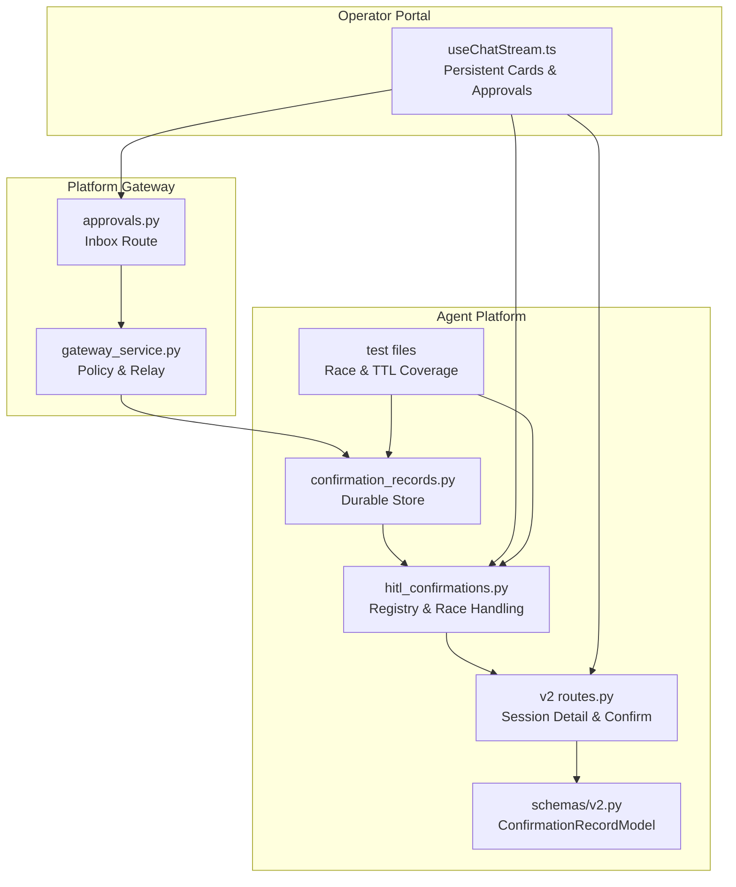
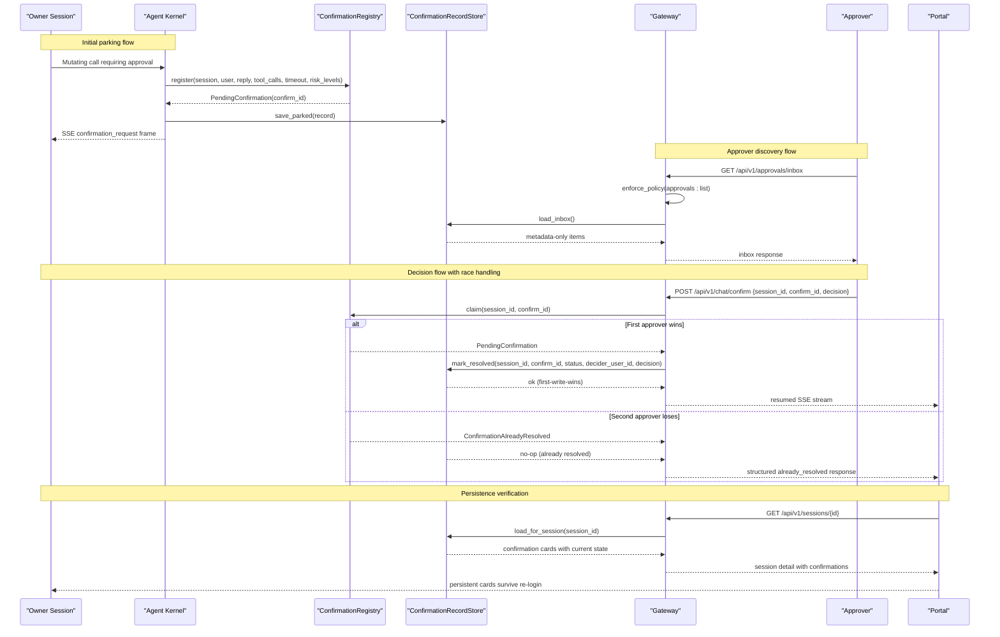
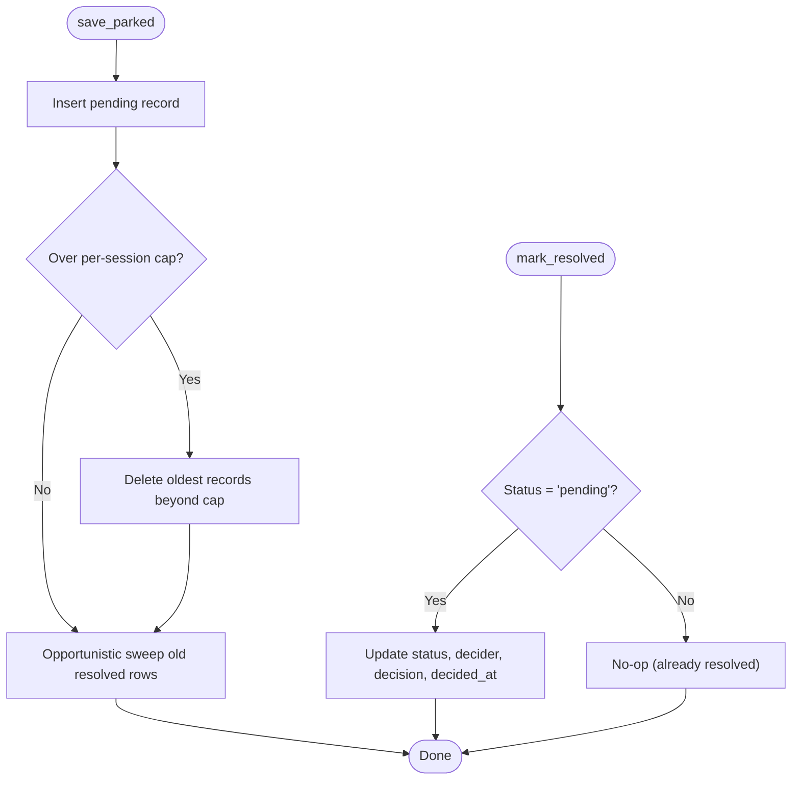
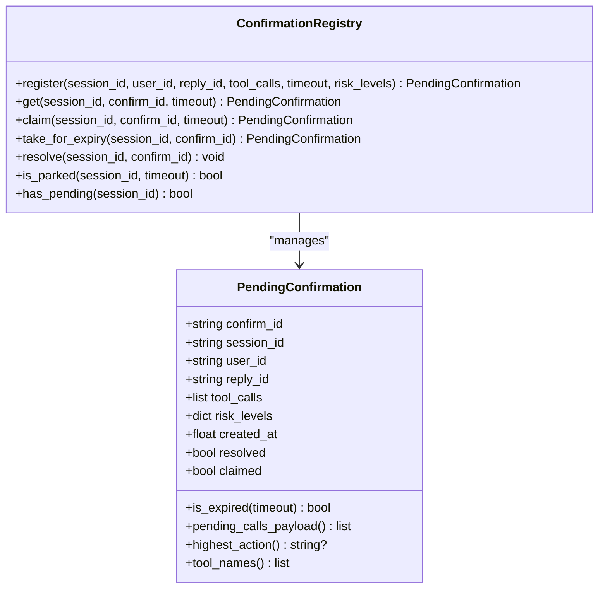
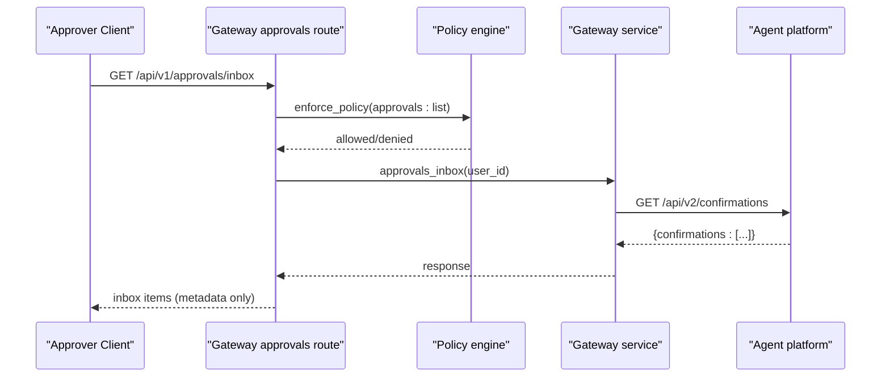
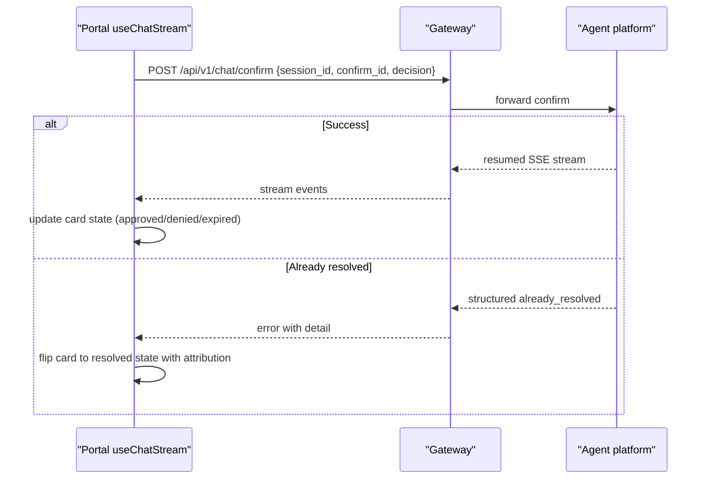
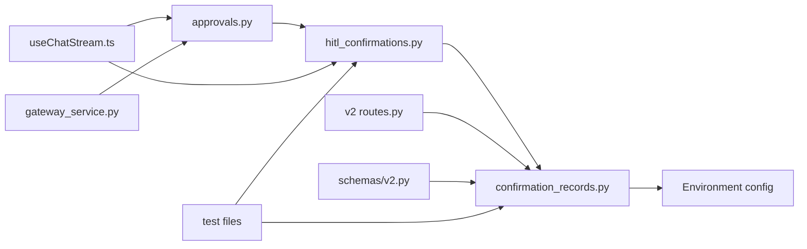

# SPEC-031: Approval Inbox and Persistent Confirmation Cards

<cite>
**Referenced Files in This Document**
- [spec.md](file://docs/specs/SPEC-031-approval-inbox-persistent-confirmation/spec.md)
- [plan.md](file://docs/specs/SPEC-031-approval-inbox-persistent-confirmation/plan.md)
- [tasks.md](file://docs/specs/SPEC-031-approval-inbox-persistent-confirmation/tasks.md)
- [confirmation_records.py](file://products/agent-platform/src/agent_service/services/confirmation_records.py)
- [hitl_confirmations.py](file://products/agent-platform/src/agent_service/services/hitl_confirmations.py)
- [approvals.py](file://products/platform-gateway/src/platform_gateway/api/routes/approvals.py)
- [gateway_service.py](file://products/platform-gateway/src/platform_gateway/services/gateway_service.py)
- [routes.py](file://products/agent-platform/src/agent_service/api/v2/routes.py)
- [v2.py](file://products/agent-platform/src/agent_service/schemas/v2.py)
- [useChatStream.ts](file://products/operator-portal/web-ui/app/src/stream/useChatStream.ts)
- [test_confirmation_records.py](file://products/agent-platform/tests/test_confirmation_records.py)
- [test_hitl_confirmations.py](file://products/agent-platform/tests/test_hitl_confirmations.py)
</cite>

## Update Summary
**Changes Made**
- Enhanced claim-time outcome persistence with first-write-wins semantics ensuring deterministic resolution across concurrent approvers
- Improved startup sweep scoping to prevent cross-replica interference by limiting stale pending row closure to rows exceeding HITL TTL
- Added comprehensive test coverage for race condition handling, TTL-scoped cleanup, and idempotent resolution semantics
- Updated architecture diagrams to reflect enhanced durability guarantees and improved replica safety
- Enhanced troubleshooting guide with detailed race condition resolution scenarios

## Table of Contents
1. [Introduction](#introduction)
2. [Project Structure](#project-structure)
3. [Core Components](#core-components)
4. [Architecture Overview](#architecture-overview)
5. [Detailed Component Analysis](#detailed-component-analysis)
6. [Dependency Analysis](#dependency-analysis)
7. [Performance Considerations](#performance-considerations)
8. [Troubleshooting Guide](#troubleshooting-guide)
9. [Conclusion](#conclusion)
10. [Appendices](#appendices)

## Introduction
This document specifies the design and implementation of SPEC-031: Approval Inbox and Persistent Confirmation Cards. It makes the tier_2 approval workflow end-to-end usable in the portal by introducing durable confirmation lifecycle records, persistent owner-side confirmation cards, an approvals inbox for designated approvers, race-resilient resolution semantics, and a portal Approvals view with persisted cards. The goal is to ensure that parked confirmations survive re-login, pod restarts, and replica boundaries; approvers can discover and act on pending items; and concurrent decisions resolve deterministically with structured outcomes.

The implementation has been delivered with comprehensive approval inbox functionality, durable storage using Postgres-backed persistence, gateway proxy integration for policy enforcement, and full operator portal integration with persistent card rendering and approvals view. **Enhanced** with first-write-wins semantics for confirmation records, improved startup sweep scoping to prevent cross-replica interference, and comprehensive test coverage for race condition handling.

## Project Structure
SPEC-031 spans three product areas with complete implementation:
- Agent platform: durable confirmation store with Postgres backend, registry integration, session detail augmentation, and confirm route enhancements with race handling.
- Platform gateway: approvals inbox route with policy enforcement, identity resolution, and relay semantics for cross-session discovery.
- Operator portal: Approvals view with polling-based refresh, persistent card rendering in transcripts, and race response handling.

**Diagram sources**
- [confirmation_records.py:1-599](file://products/agent-platform/src/agent_service/services/confirmation_records.py#L1-L599)
- [hitl_confirmations.py:1-256](file://products/agent-platform/src/agent_service/services/hitl_confirmations.py#L1-L256)
- [routes.py:1-200](file://products/agent-platform/src/agent_service/api/v2/routes.py#L1-L200)
- [v2.py:175-196](file://products/agent-platform/src/agent_service/schemas/v2.py#L175-L196)
- [approvals.py:1-51](file://products/platform-gateway/src/platform_gateway/api/routes/approvals.py#L1-L51)
- [gateway_service.py:358-387](file://products/platform-gateway/src/platform_gateway/services/gateway_service.py#L358-L387)
- [useChatStream.ts:1-435](file://products/operator-portal/web-ui/app/src/stream/useChatStream.ts#L1-L435)
- [test_confirmation_records.py:1-647](file://products/agent-platform/tests/test_confirmation_records.py#L1-L647)
- [test_hitl_confirmations.py:1-800](file://products/agent-platform/tests/test_hitl_confirmations.py#L1-L800)

**Section sources**
- [spec.md:11-37](file://docs/specs/SPEC-031-approval-inbox-persistent-confirmation/spec.md#L11-L37)
- [plan.md:3-11](file://docs/specs/SPEC-031-approval-inbox-persistent-confirmation/plan.md#L3-L11)

## Core Components
- Durable confirmation record store: Postgres-backed (with memory fallback) persistence for every parked confirmation and its resolution, keyed by session with a random confirm_id. Enforces per-session cap of 50 records and 30-day history windowing with opportunistic cleanup. **Enhanced** with first-write-wins semantics ensuring only the first successful write persists the outcome.
- In-memory confirmation registry: Hot-path single-flight claim/resume for parked kernel confirmations with race-resilient semantics, integrated with durable records for recovery and history.
- Gateway approvals inbox: Policy-gated endpoint listing metadata-only items across sessions, including pending and historical records within a time window, with role-based scoping.
- Portal stream and UI: Renders persistent confirmation cards in the owner transcript and provides an Approvals view for deciders, handling already_resolved responses and polling-based refresh with pending count badges.
- Comprehensive test coverage: Validates race condition handling, TTL-scoped cleanup, idempotent resolution, and cross-replica safety scenarios.

Key acceptance criteria are defined in the spec and fully implemented across all components with comprehensive testing and validation.

**Section sources**
- [spec.md:43-154](file://docs/specs/SPEC-031-approval-inbox-persistent-confirmation/spec.md#L43-L154)
- [plan.md:13-99](file://docs/specs/SPEC-031-approval-inbox-persistent-confirmation/plan.md#L13-L99)

## Architecture Overview
The system centers around a durable confirmation record store that becomes the source of truth for history and restart recovery. The in-memory registry remains the hot path for single-flight claims with race handling. The gateway enforces policy for inbox access and relays structured conflict responses. The portal renders both owner-side cards and an approvals view with persistent state. **Enhanced** with improved startup sweep scoping to prevent cross-replica interference and comprehensive race condition handling.

**Diagram sources**
- [hitl_confirmations.py:137-195](file://products/agent-platform/src/agent_service/services/hitl_confirmations.py#L137-L195)
- [confirmation_records.py:461-481](file://products/agent-platform/src/agent_service/services/confirmation_records.py#L461-L481)
- [approvals.py:19-50](file://products/platform-gateway/src/platform_gateway/api/routes/approvals.py#L19-L50)
- [useChatStream.ts:290-378](file://products/operator-portal/web-ui/app/src/stream/useChatStream.ts#L290-L378)

## Detailed Component Analysis

### Durable Confirmation Record Store (R-1)
- Provides a protocol-backed interface with in-memory and Postgres implementations sharing the same AGENT_STATE_STORE_BACKEND posture as other platform services.
- Writes: park inserts a pending record before the confirmation_request frame; resolve/expire updates status, decider, and timestamp before confirmation_result flows. **Enhanced** with first-write-wins semantics where subsequent writes become no-ops if the record is already resolved.
- Boundedness: per-session cap of most recent 50 records with oldest-first eviction; resolved rows beyond a 30-day history window are opportunistically swept on writes with configurable limits.
- Startup behavior: **Improved** startup sweep now scopes stale pending row closure to rows exceeding the HITL confirmation TTL, preventing cross-replica interference while ensuring consistent state after failures.
- Integration: module-level singleton used by runtime kernel and v2 routes; environment-driven backend selection with graceful fallback to in-memory mode when Postgres is unavailable.

**Diagram sources**
- [confirmation_records.py:433-459](file://products/agent-platform/src/agent_service/services/confirmation_records.py#L433-L459)
- [confirmation_records.py:461-481](file://products/agent-platform/src/agent_service/services/confirmation_records.py#L461-L481)

**Section sources**
- [confirmation_records.py:1-599](file://products/agent-platform/src/agent_service/services/confirmation_records.py#L1-L599)
- [spec.md:43-67](file://docs/specs/SPEC-031-approval-inbox-persistent-confirmation/spec.md#L43-L67)
- [plan.md:15-36](file://docs/specs/SPEC-031-approval-inbox-persistent-confirmation/plan.md#L15-L36)

### In-Memory Confirmation Registry (R-4)
- Tracks per-session parked confirmations with single-flight claim semantics and race-resilient resolution.
- claim sets exclusive ownership before any response headers; duplicate confirms fail closed with structured already_resolved responses carrying decider attribution instead of opaque errors.
- get raises NotFound for unknown/claimed/resolved entries and Expired for TTL breaches; take_for_expiry ensures cleanup without interrupting in-flight resumes.
- resolve removes the entry from the registry after decision processing and updates durable records for consistency.

**Diagram sources**
- [hitl_confirmations.py:41-107](file://products/agent-platform/src/agent_service/services/hitl_confirmations.py#L41-L107)
- [hitl_confirmations.py:121-251](file://products/agent-platform/src/agent_service/services/hitl_confirmations.py#L121-L251)

**Section sources**
- [hitl_confirmations.py:1-256](file://products/agent-platform/src/agent_service/services/hitl_confirmations.py#L1-L256)
- [spec.md:112-131](file://docs/specs/SPEC-031-approval-inbox-persistent-confirmation/spec.md#L112-L131)
- [plan.md:70-83](file://docs/specs/SPEC-031-approval-inbox-persistent-confirmation/plan.md#L70-L83)

### Gateway Approvals Inbox (R-3)
- Exposes GET /api/v1/approvals/inbox gated by approvals:list policy action with proper identity resolution and role-based scoping.
- Resolves request identity via JWT verification, enforces policy, then relays to agent-platform to fetch metadata-only items scoped to decider roles.
- Logs item counts and pending counts for observability with authenticated user context and role information.
- Preserves metadata-only posture to avoid exposing owner transcript text while providing sufficient decision context.

**Diagram sources**
- [approvals.py:19-50](file://products/platform-gateway/src/platform_gateway/api/routes/approvals.py#L19-L50)

**Section sources**
- [approvals.py:1-51](file://products/platform-gateway/src/platform_gateway/api/routes/approvals.py#L1-L51)
- [spec.md:88-110](file://docs/specs/SPEC-031-approval-inbox-persistent-confirmation/spec.md#L88-L110)
- [plan.md:51-68](file://docs/specs/SPEC-031-approval-inbox-persistent-confirmation/plan.md#L51-L68)

### Portal Stream and Persistent Cards (R-2, R-5)
- useChatStream handles confirmation_request frames to create pending cards and confirmation_result frames to lock them into final states with persistent attribution.
- Deciding a confirmation opens a confirm stream; errors and aborts are handled gracefully, preserving pending state when appropriate and updating local card state immediately.
- Owner-side transcripts merge persisted confirmations from session detail payloads so cards survive re-login with full decision attribution and read-only semantics.
- Approvals view provides polling-based refresh with pending count badges and race response handling that flips cards to resolved states with approver attribution.

**Diagram sources**
- [useChatStream.ts:161-194](file://products/operator-portal/web-ui/app/src/stream/useChatStream.ts#L161-L194)
- [useChatStream.ts:290-378](file://products/operator-portal/web-ui/app/src/stream/useChatStream.ts#L290-L378)

**Section sources**
- [useChatStream.ts:1-435](file://products/operator-portal/web-ui/app/src/stream/useChatStream.ts#L1-L435)
- [spec.md:69-86](file://docs/specs/SPEC-031-approval-inbox-persistent-confirmation/spec.md#L69-L86)
- [spec.md:133-154](file://docs/specs/SPEC-031-approval-inbox-persistent-confirmation/spec.md#L133-L154)
- [plan.md:38-49](file://docs/specs/SPEC-031-approval-inbox-persistent-confirmation/plan.md#L38-L49)
- [plan.md:85-99](file://docs/specs/SPEC-031-approval-inbox-persistent-confirmation/plan.md#L85-L99)

## Dependency Analysis
- confirmation_records.py depends on environment configuration to select backend and initializes Postgres tables idempotently with startup cleanup of stale pending records. **Enhanced** with improved TTL-scoped startup sweep to prevent cross-replica interference.
- hitl_confirmations.py coordinates with the kernel parking mechanism and exposes exceptions for not found and expired cases; it integrates with durable records via callers that persist best-effort with race handling.
- approvals.py depends on policy enforcement and gateway services to relay inbox queries while preserving role scoping and metadata-only posture with proper identity resolution.
- useChatStream.ts consumes stream events and drives confirm requests, handling structured conflicts and updating local card state with race response processing.
- **New**: Comprehensive test coverage validates race condition handling, TTL-scoped cleanup, and idempotent resolution semantics across all components.

**Diagram sources**
- [confirmation_records.py:548-599](file://products/agent-platform/src/agent_service/services/confirmation_records.py#L548-L599)
- [hitl_confirmations.py:121-256](file://products/agent-platform/src/agent_service/services/hitl_confirmations.py#L121-L256)
- [approvals.py:1-51](file://products/platform-gateway/src/platform_gateway/api/routes/approvals.py#L1-L51)
- [useChatStream.ts:1-435](file://products/operator-portal/web-ui/app/src/stream/useChatStream.ts#L1-L435)
- [routes.py:1-200](file://products/agent-platform/src/agent_service/api/v2/routes.py#L1-L200)
- [v2.py:175-196](file://products/agent-platform/src/agent_service/schemas/v2.py#L175-L196)
- [gateway_service.py:358-387](file://products/platform-gateway/src/platform_gateway/services/gateway_service.py#L358-L387)
- [test_confirmation_records.py:1-647](file://products/agent-platform/tests/test_confirmation_records.py#L1-L647)
- [test_hitl_confirmations.py:1-800](file://products/agent-platform/tests/test_hitl_confirmations.py#L1-L800)

**Section sources**
- [confirmation_records.py:548-599](file://products/agent-platform/src/agent_service/services/confirmation_records.py#L548-L599)
- [hitl_confirmations.py:121-256](file://products/agent-platform/src/agent_service/services/hitl_confirmations.py#L121-L256)
- [approvals.py:1-51](file://products/platform-gateway/src/platform_gateway/api/routes/approvals.py#L1-L51)
- [useChatStream.ts:1-435](file://products/operator-portal/web-ui/app/src/stream/useChatStream.ts#L1-L435)

## Performance Considerations
- In-memory registry remains the hot path for single-flight claims; durable store operations are bounded and opportunistic (cap eviction, sweep) to minimize database load.
- Postgres queries are parameterized and indexed by session and status; inbox queries limit results to 100 items and filter by 30-day history window for optimal performance.
- **Enhanced** startup sweep now uses TTL-scoped cleanup to prevent cross-replica interference, reducing unnecessary database operations during startup.
- Portal uses polling-based refresh for the Approvals view with 30-second intervals to avoid push channels while maintaining responsive UX; card state updates are incremental and lightweight.
- Backend failures trigger automatic fallback to in-memory mode, ensuring service availability even when Postgres is unavailable, though durability is temporarily degraded.

## Troubleshooting Guide
- Already resolved conflicts: When a confirm hits a resolved record, the system returns a structured already_resolved response carrying decider, decision, and decided-at timestamp instead of opaque errors, enabling proper UI state synchronization. **Enhanced** with comprehensive test coverage validating this behavior.
- Stale tabs and races: A confirm attempt against a resolved record returns the same structured outcome with approver attribution; no second execution occurs and the losing approver sees who decided first. **Validated** through extensive race condition tests.
- Expired confirmations: If a confirmation expires before a decision, the portal marks the card as expired with appropriate messaging and prevents further actions while maintaining audit trail visibility.
- Backend failures: If Postgres is unavailable, the confirmation record store falls back to in-memory mode automatically; durability is degraded but the service remains usable with live-only cards.
- Role-based access issues: Non-decider users receive 403 errors on approvals inbox access with proper audit logging; ensure proper role assignment in the policy bundle.
- Cross-replica interference: **New** startup sweep now properly scopes stale pending row closure to rows exceeding the HITL TTL, preventing one replica from incorrectly expiring another replica's active confirmations.

**Section sources**
- [hitl_confirmations.py:22-28](file://products/agent-platform/src/agent_service/services/hitl_confirmations.py#L22-L28)
- [confirmation_records.py:330-341](file://products/agent-platform/src/agent_service/services/confirmation_records.py#L330-L341)
- [useChatStream.ts:351-372](file://products/operator-portal/web-ui/app/src/stream/useChatStream.ts#L351-L372)
- [test_confirmation_records.py:413-497](file://products/agent-platform/tests/test_confirmation_records.py#L413-L497)
- [test_hitl_confirmations.py:498-513](file://products/agent-platform/tests/test_hitl_confirmations.py#L498-L513)

## Conclusion
SPEC-031 introduces durable confirmation lifecycle records, persistent owner-side cards, an approvals inbox for designated approvers, and race-resilient resolution semantics. The design preserves existing tier enforcement and audit semantics while adding robust discovery, persistence, and UI surfaces. The result is a trustworthy approval gate where parked calls are visible, auditable, and consistently resolved even under restarts, replicas, and concurrent decisions.

**Enhanced** with first-write-wins semantics ensuring deterministic resolution across concurrent approvers, improved startup sweep scoping preventing cross-replica interference, and comprehensive test coverage validating race condition handling and TTL-scoped cleanup. The delivered implementation includes comprehensive approval inbox functionality with Postgres-backed durable storage, gateway proxy integration for policy enforcement and identity resolution, and full operator portal integration with persistent card rendering, approvals view, and race response handling. All acceptance criteria have been validated through unit tests, contract tests, and live cluster validation.

## Appendices
- Task breakdown and delivery gates are captured in the tasks file and guide validation steps, e2e extensions, and documentation updates.
- The specification status is set to `delivered` with all requirements (R-1 through R-5) fully implemented and tested.
- Live cluster validation confirmed operator re-login shows decided cards, approver inbox approve/deny workflows, and race response handling.
- **New**: Comprehensive test coverage validates first-write-wins semantics, TTL-scoped startup sweep, race condition handling, and cross-replica safety scenarios.

**Section sources**
- [tasks.md:1-52](file://docs/specs/SPEC-031-approval-inbox-persistent-confirmation/tasks.md#L1-L52)
- [spec.md:197-210](file://docs/specs/SPEC-031-approval-inbox-persistent-confirmation/spec.md#L197-L210)
- [test_confirmation_records.py:99-112](file://products/agent-platform/tests/test_confirmation_records.py#L99-L112)
- [test_confirmation_records.py:348-383](file://products/agent-platform/tests/test_confirmation_records.py#L348-L383)
- [test_hitl_confirmations.py:498-513](file://products/agent-platform/tests/test_hitl_confirmations.py#L498-L513)