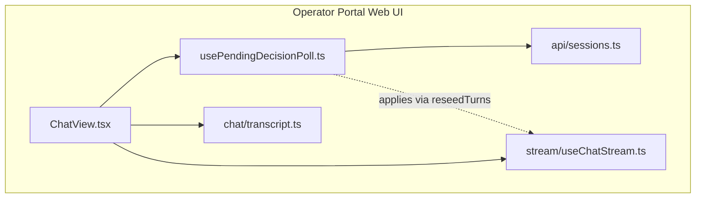
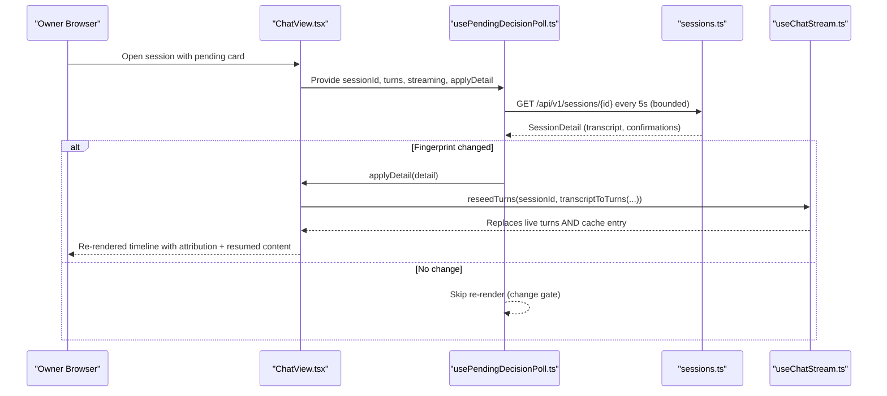
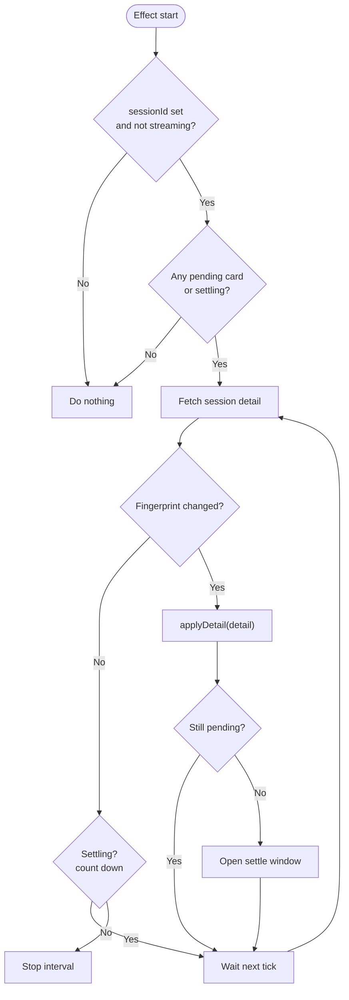
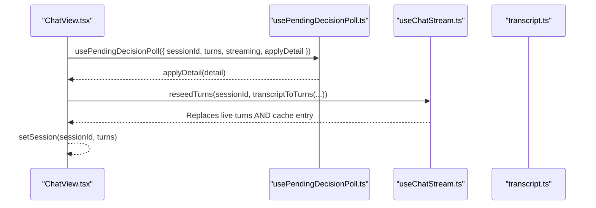
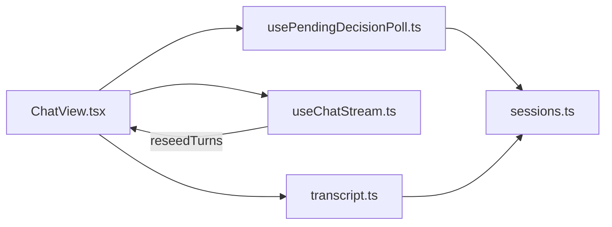

# SPEC-032: Owner-Side Live Decision Sync

<cite>
**Referenced Files in This Document**
- [spec.md](file://docs/specs/SPEC-032-owner-side-live-decision-sync/spec.md)
- [plan.md](file://docs/specs/SPEC-032-owner-side-live-decision-sync/plan.md)
- [tasks.md](file://docs/specs/SPEC-032-owner-side-live-decision-sync/tasks.md)
- [usePendingDecisionPoll.ts](file://products/operator-portal/web-ui/app/src/chat/usePendingDecisionPoll.ts)
- [ChatView.tsx](file://products/operator-portal/web-ui/app/src/chat/ChatView.tsx)
- [sessions.ts](file://products/operator-portal/web-ui/app/src/api/sessions.ts)
- [transcript.ts](file://products/operator-portal/web-ui/app/src/chat/transcript.ts)
- [usePendingDecisionPoll.test.ts](file://products/operator-portal/web-ui/app/src/chat/__tests__/usePendingDecisionPoll.test.ts)
- [useChatStream.ts](file://products/operator-portal/web-ui/app/src/stream/useChatStream.ts)
- [2026-08-25-owner-decision-sync-reseed-patch.md](file://docs/agentic-aiops-platform/release-notes/2026-08-25-owner-decision-sync-reseed-patch.md)
</cite>

## Update Summary
**Changes Made**
- Updated Core Components section to reflect the v0.14.1 patch fix using `reseedTurns` method
- Enhanced Architecture Overview with detailed cache-shadowing issue explanation
- Added new Cache Shadowing Issue section documenting the root cause and resolution
- Updated Detailed Component Analysis to include reseedTurns implementation details
- Enhanced Tests section with regression test coverage for cache-shadowing scenarios
- Updated Conclusion to reflect the complete fix including the v0.14.1 patch

## Table of Contents
1. Introduction
2. Project Structure
3. Core Components
4. Architecture Overview
5. Cache Shadowing Issue (v0.14.1 Patch Fix)
6. Detailed Component Analysis
7. Dependency Analysis
8. Performance Considerations
9. Troubleshooting Guide
10. Conclusion

## Introduction
SPEC-032 delivers owner-side live decision sync for the operator portal. When an approval-gated action is pending, the owner's chat view polls the existing session detail endpoint on a short interval and re-renders as soon as the card resolves. The change is gated so identical responses do not rebuild the timeline or disturb scroll position, composer drafts, or in-flight streams. No new backend surface is introduced; decisions continue to be durable records consumed by both the approver inbox and the owner's transcript.

Key outcomes:
- Pending cards flip to approved, denied, or expired with decider attribution.
- The resumed turn's content appears without requiring a manual refresh.
- Polling is bounded: it runs only while a pending card exists and never while a stream is active.

**Updated** The v0.14.1 patch resolved a critical cache-shadowing issue where the poll applied through `setSession`, causing the owner's chat window to remain 'deaf' after external approvals due to stale cached turns being restored instead of fresh state.

**Section sources**
- [spec.md:11-38](file://docs/specs/SPEC-032-owner-side-live-decision-sync/spec.md#L11-L38)
- [spec.md:40-100](file://docs/specs/SPEC-032-owner-side-live-decision-sync/spec.md#L40-L100)
- [2026-08-25-owner-decision-sync-reseed-patch.md:7-31](file://docs/agentic-aiops-platform/release-notes/2026-08-25-owner-decision-sync-reseed-patch.md#L7-L31)

## Project Structure
This feature is portal-only and touches the operator portal web UI under products/operator-portal/web-ui/app. It introduces a new React hook that wires into the existing ChatView and reuses the session-detail API client and transcript seeding path.

**Diagram sources**
- [ChatView.tsx:718-742](file://products/operator-portal/web-ui/app/src/chat/ChatView.tsx#L718-L742)
- [usePendingDecisionPoll.ts:1-145](file://products/operator-portal/web-ui/app/src/chat/usePendingDecisionPoll.ts#L1-L145)
- [sessions.ts:107-115](file://products/operator-portal/web-ui/app/src/api/sessions.ts#L107-L115)
- [transcript.ts:162-198](file://products/operator-portal/web-ui/app/src/chat/transcript.ts#L162-L198)
- [useChatStream.ts:436-441](file://products/operator-portal/web-ui/app/src/stream/useChatStream.ts#L436-L441)

**Section sources**
- [plan.md:3-13](file://docs/specs/SPEC-032-owner-side-live-decision-sync/plan.md#L3-L13)
- [ChatView.tsx:718-742](file://products/operator-portal/web-ui/app/src/chat/ChatView.tsx#L718-L742)

## Core Components
- usePendingDecisionPoll hook: Implements bounded, change-gated polling of the session detail endpoint while a confirmation card is pending and no stream is active. Uses a fingerprint over confirmations and transcript length/content to avoid unnecessary re-renders. Includes a settle window after the last pending card resolves to capture trailing resumed content.
- ChatView integration: Wires the hook into the chat workspace and applies the authoritative session detail through the `reseedTurns` method (v0.14.1 patch) instead of `setSession`, ensuring fresh state is applied without cache shadowing.
- Session detail API client: Provides getSession for reading the authoritative session state (transcript, evidence turns, confirmations).
- Transcript mapping: Converts session detail into chat turns and merges durable confirmation records into the turn timeline, including attribution notes for decided cards.
- **New**: reseedTurns method: Authoritative same-session re-seed that replaces both live turns and cache entry, never moves session pointer or aborts stream, solving the cache-shadowing issue.

Acceptance criteria alignment:
- R-1: Poll-while-pending on the active session using GET /api/v1/sessions/{id}.
- R-2: Bounded polling with no activity when idle or streaming; auto-stop after resolution plus settle ticks.
- R-3: Outcome parity across approvals, denials, expirations, and same-window tier_1 decisions.

**Updated** The v0.14.1 patch ensures the apply path uses `reseedTurns` instead of `setSession` to prevent cache-shadowing where stale turns would be restored instead of fresh state.

**Section sources**
- [usePendingDecisionPoll.ts:16-49](file://products/operator-portal/web-ui/app/src/chat/usePendingDecisionPoll.ts#L16-L49)
- [usePendingDecisionPoll.ts:51-145](file://products/operator-portal/web-ui/app/src/chat/usePendingDecisionPoll.ts#L51-L145)
- [ChatView.tsx:718-742](file://products/operator-portal/web-ui/app/src/chat/ChatView.tsx#L718-L742)
- [sessions.ts:44-94](file://products/operator-portal/web-ui/app/src/api/sessions.ts#L44-L94)
- [transcript.ts:84-135](file://products/operator-portal/web-ui/app/src/chat/transcript.ts#L84-L135)
- [transcript.ts:137-198](file://products/operator-portal/web-ui/app/src/chat/transcript.ts#L137-L198)
- [useChatStream.ts:436-441](file://products/operator-portal/web-ui/app/src/stream/useChatStream.ts#L436-L441)

## Architecture Overview
The owner's chat view observes its local turns for pending confirmation cards. If present and no stream is active, the hook periodically fetches the authoritative session detail. On a changed fingerprint, ChatView re-seeds the turn timeline through `reseedTurns` (v0.14.1), which replaces both live turns and cache entries, avoiding the cache-shadowing pitfall that occurred with `setSession`.

**Updated** The architecture now uses `reseedTurns` instead of `setSession` to prevent cache-shadowing issues where stale turns would be restored.

**Diagram sources**
- [usePendingDecisionPoll.ts:72-143](file://products/operator-portal/web-ui/app/src/chat/usePendingDecisionPoll.ts#L72-L143)
- [ChatView.tsx:718-742](file://products/operator-portal/web-ui/app/src/chat/ChatView.tsx#L718-L742)
- [sessions.ts:107-115](file://products/operator-portal/web-ui/app/src/api/sessions.ts#L107-L115)
- [transcript.ts:162-198](file://products/operator-portal/web-ui/app/src/chat/transcript.ts#L162-L198)
- [useChatStream.ts:436-441](file://products/operator-portal/web-ui/app/src/stream/useChatStream.ts#L436-L441)

## Cache Shadowing Issue (v0.14.1 Patch Fix)

### Problem Description
In v0.14.0, the SPEC-032 implementation used `setSession` for applying poll results, which caused the owner's chat window to remain 'deaf' after external approvals. The poll worked correctly — it observed moved state and attempted to apply fresh timeline — but the application path was flawed due to how `setSession` handles per-tab turn caching.

### Root Cause Analysis
The `setSession` method implements session switching behavior:
1. Stashes current session's turns into per-tab cache
2. Restores target session's cached turns (with history fallback)
3. Falls back to `history` parameter only on cache miss

When called for the session already on screen:
- `previousId === sessionId`, so current (stale) turns were stashed into cache
- Restore read cache back — guaranteed hit — bypassing the fresh `history` parameter
- Every successful poll re-seeded the exact same stale turns

### Resolution
The v0.14.1 patch introduced `reseedTurns(sessionId, turns)` method:
- Replaces both live turns AND cache entry atomically
- Never moves session pointer or aborts stream
- No-op for sessions other than the one currently on screen
- Ensures later session switches restore fresh timeline, not shadowed stale one

### Impact
- External approvals now appear within poll interval in owner's window
- Decided cards show proper attribution and status updates
- Resumed turn content surfaces without manual refresh
- Session switch away/back restores correct timeline state

**Section sources**
- [2026-08-25-owner-decision-sync-reseed-patch.md:15-31](file://docs/agentic-aiops-platform/release-notes/2026-08-25-owner-decision-sync-reseed-patch.md#L15-L31)
- [useChatStream.ts:430-441](file://products/operator-portal/web-ui/app/src/stream/useChatStream.ts#L430-L441)
- [ChatView.tsx:723-726](file://products/operator-portal/web-ui/app/src/chat/ChatView.tsx#L723-L726)

## Detailed Component Analysis

### usePendingDecisionPoll Hook
Responsibilities:
- Determine whether to poll based on presence of a pending confirmation card and absence of streaming.
- Maintain latest-value refs to avoid stale closures during async operations.
- Compute a cheap fingerprint from confirmation statuses and transcript size to detect changes.
- Apply a settle window after the last pending card resolves to ensure resumed content surfaces.
- Safely drop in-flight responses if streaming starts or the session switches.

Key behaviors:
- Interval-driven polling at PENDING_SYNC_INTERVAL_MS (5 seconds).
- Baseline capture on first tick to avoid applying unchanged data.
- Change gating prevents timeline rebuilds on identical responses.
- Error handling preserves last-good view and retries on next tick.

**Diagram sources**
- [usePendingDecisionPoll.ts:23-40](file://products/operator-portal/web-ui/app/src/chat/usePendingDecisionPoll.ts#L23-L40)
- [usePendingDecisionPoll.ts:51-145](file://products/operator-portal/web-ui/app/src/chat/usePendingDecisionPoll.ts#L51-L145)

**Section sources**
- [usePendingDecisionPoll.ts:16-49](file://products/operator-portal/web-ui/app/src/chat/usePendingDecisionPoll.ts#L16-L49)
- [usePendingDecisionPoll.ts:51-145](file://products/operator-portal/web-ui/app/src/chat/usePendingDecisionPoll.ts#L51-L145)

### ChatView Integration
Integration points:
- Wires usePendingDecisionPoll with current sessionId, turns, streaming flag, and an applyDetail callback.
- **Updated**: applyDetail calls `reseedTurns` (v0.14.1) instead of `setSession` to avoid cache-shadowing issues.
- Existing session switch logic seeds the initial timeline via the same transcriptToTurns path, keeping behavior uniform between initial load and live sync.

**Updated** The v0.14.1 patch routes the applyDetail through `reseedTurns` to prevent cache-shadowing where stale turns would be restored.

**Diagram sources**
- [ChatView.tsx:718-742](file://products/operator-portal/web-ui/app/src/chat/ChatView.tsx#L718-L742)
- [transcript.ts:162-198](file://products/operator-portal/web-ui/app/src/chat/transcript.ts#L162-L198)
- [useChatStream.ts:436-441](file://products/operator-portal/web-ui/app/src/stream/useChatStream.ts#L436-L441)

**Section sources**
- [ChatView.tsx:718-742](file://products/operator-portal/web-ui/app/src/chat/ChatView.tsx#L718-L742)

### Session Detail API Client
Provides:
- getSession(sessionId, signal?) to read authoritative session state.
- Types for SessionDetail, ConfirmationRecord, EvidenceTurn, and related shapes used by both the hook and transcript mapper.

Usage in this spec:
- Called by the hook on each tick to obtain the latest confirmations and transcript growth.

**Section sources**
- [sessions.ts:44-94](file://products/operator-portal/web-ui/app/src/api/sessions.ts#L44-L94)
- [sessions.ts:107-115](file://products/operator-portal/web-ui/app/src/api/sessions.ts#L107-L115)

### Transcript Mapping and Attribution
Responsibilities:
- Convert server transcript and evidence turns into chat turns.
- Merge durable confirmation records into turns, marking pending cards and attaching attribution notes for decided cards.
- Ensure parity with live stream rendering so the owner sees the same outcome regardless of how the decision arrived.

Attribution note generation:
- For non-pending records, includes status, decider user id, and decision timestamp where available.

**Section sources**
- [transcript.ts:84-135](file://products/operator-portal/web-ui/app/src/chat/transcript.ts#L84-L135)
- [transcript.ts:137-198](file://products/operator-portal/web-ui/app/src/chat/transcript.ts#L137-L198)

### reseedTurns Method (v0.14.1 Addition)
**New** The v0.14.1 patch added the `reseedTurns` method to solve the cache-shadowing issue:

Responsibilities:
- Replace both live turns AND cache entry atomically for the current session
- Never move session pointer or abort stream
- No-op for sessions other than the one currently on screen
- Ensure later session switches restore fresh timeline, not shadowed stale one

Implementation details:
- Guards against reseeding wrong session IDs
- Updates both `turnsRef.current` and `turnsCacheRef.current`
- Triggers re-render via `bump()` reducer
- Maintains stream integrity and session context

**Section sources**
- [useChatStream.ts:436-441](file://products/operator-portal/web-ui/app/src/stream/useChatStream.ts#L436-L441)

### Tests
Coverage highlights:
- External approval flips the pending card and surfaces resumed content without refresh.
- No polling when idle or streaming.
- In-flight response dropped when a stream starts.
- Denial and expiration parity through the same poll path.
- Transport errors preserve last-good view and retry.
- Stale responses dropped after session switch.

**Updated** The v0.14.1 patch added three new regression tests:
- Cache-shadow behavior validation (same-session history never applies)
- `reseedTurns` effectiveness (replaces live turns and cache entry)
- Cross-session isolation (no-op for sessions not on screen)

**Section sources**
- [usePendingDecisionPoll.test.ts:111-296](file://products/operator-portal/web-ui/app/src/chat/__tests__/usePendingDecisionPoll.test.ts#L111-L296)

## Dependency Analysis
Component coupling:
- ChatView depends on usePendingDecisionPoll and transcriptToTurns for consistent timeline updates.
- usePendingDecisionPoll depends on sessions.getSession and relies on ChatTurn shape from the stream module.
- transcript.ts depends on API types from sessions.ts and stream models for tool frames.
- **Updated**: ChatView now depends on `reseedTurns` method from useChatStream instead of `setSession` for poll applications.

External contracts:
- Reads GET /api/v1/sessions/{id} — no write paths, no contract changes.
- Consumes durable confirmation records produced by earlier specs (SPEC-031).

Potential risks:
- Race between poll and stream: guarded by streaming flag and session identity checks.
- Stale responses after session switch: guarded by captured session id and ref-based latest values.
- **Mitigated**: Cache-shadowing issue resolved by using `reseedTurns` instead of `setSession`.

**Updated** The dependency graph now shows the direct relationship between ChatView and reseedTurns for authoritative timeline updates.

**Diagram sources**
- [ChatView.tsx:718-742](file://products/operator-portal/web-ui/app/src/chat/ChatView.tsx#L718-L742)
- [usePendingDecisionPoll.ts:12-14](file://products/operator-portal/web-ui/app/src/chat/usePendingDecisionPoll.ts#L12-L14)
- [sessions.ts:107-115](file://products/operator-portal/web-ui/app/src/api/sessions.ts#L107-L115)
- [transcript.ts:9-20](file://products/operator-portal/web-ui/app/src/chat/transcript.ts#L9-L20)
- [useChatStream.ts:436-441](file://products/operator-portal/web-ui/app/src/stream/useChatStream.ts#L436-L441)

**Section sources**
- [plan.md:53-59](file://docs/specs/SPEC-032-owner-side-live-decision-sync/plan.md#L53-L59)

## Performance Considerations
- Poll interval: 5 seconds balances near-instant visibility with low server load.
- Change gating: Fingerprint avoids unnecessary timeline rebuilds, preserving scroll and focus.
- Bounded execution: No polling when idle or streaming; automatic teardown on state changes.
- Settle window: Limits extra requests after resolution to capture trailing resumed content.
- **Updated**: `reseedTurns` provides atomic updates to both live turns and cache, eliminating redundant re-renders caused by cache-shadowing.

[No sources needed since this section provides general guidance]

## Troubleshooting Guide
Common issues and mitigations:
- No visible update after approval:
  - Verify a pending card exists in the active session turns.
  - Confirm the session is not streaming; polling is disabled during streams.
  - Check network errors; transient failures are retried on the next tick.
  - **Updated**: Ensure v0.14.1+ is deployed to benefit from the `reseedTurns` fix.
- Unexpected re-renders:
  - Ensure fingerprint logic remains intact; identical responses should not rebuild the timeline.
- Stale decision applied to wrong session:
  - Validate session identity checks in the hook; responses for previous sessions are dropped.
- **New**: Cache-shadowing symptoms (owner window stays deaf):
  - Verify deployment includes v0.14.1 patch with `reseedTurns` method.
  - Check that ChatView.applyDetail routes through `reseedTurns` instead of `setSession`.
  - Confirm session ID matching in reseedTurns guard condition.

Operational tips:
- Use browser dev tools to inspect periodic GET /api/v1/sessions/{id} calls.
- Temporarily reduce PENDING_SYNC_INTERVAL_MS in tests to validate behavior quickly.
- Confirm transcriptToTurns is invoked with the correct detail fields.
- **Updated**: Monitor for proper `reseedTurns` usage in the applyDetail callback.

**Section sources**
- [usePendingDecisionPoll.ts:87-130](file://products/operator-portal/web-ui/app/src/chat/usePendingDecisionPoll.ts#L87-L130)
- [usePendingDecisionPoll.test.ts:247-296](file://products/operator-portal/web-ui/app/src/chat/__tests__/usePendingDecisionPoll.test.ts#L247-L296)
- [2026-08-25-owner-decision-sync-reseed-patch.md:61-66](file://docs/agentic-aiops-platform/release-notes/2026-08-25-owner-decision-sync-reseed-patch.md#L61-L66)

## Conclusion
SPEC-032 completes the R4 owner experience by making external decisions visible in real time within the owner's chat view. The implementation is portal-only, leverages existing session detail and durable confirmation records, and uses a bounded, change-gated poll to keep latency acceptable while avoiding interference with live streams. 

**Updated** The v0.14.1 patch resolved a critical cache-shadowing issue where the owner's chat window remained 'deaf' after external approvals. By introducing the `reseedTurns` method and routing the poll's apply path through it instead of `setSession`, the system now properly updates both live turns and cache entries, ensuring decisions appear promptly with full attribution and resumed content. All acceptance criteria are covered by unit tests, including comprehensive regression tests for the cache-shadowing scenario, and documented in the spec plan and tasks.

**Section sources**
- [2026-08-25-owner-decision-sync-reseed-patch.md:52-59](file://docs/agentic-aiops-platform/release-notes/2026-08-25-owner-decision-sync-reseed-patch.md#L52-L59)
- [spec.md:124-130](file://docs/specs/SPEC-032-owner-side-live-decision-sync/spec.md#L124-L130)