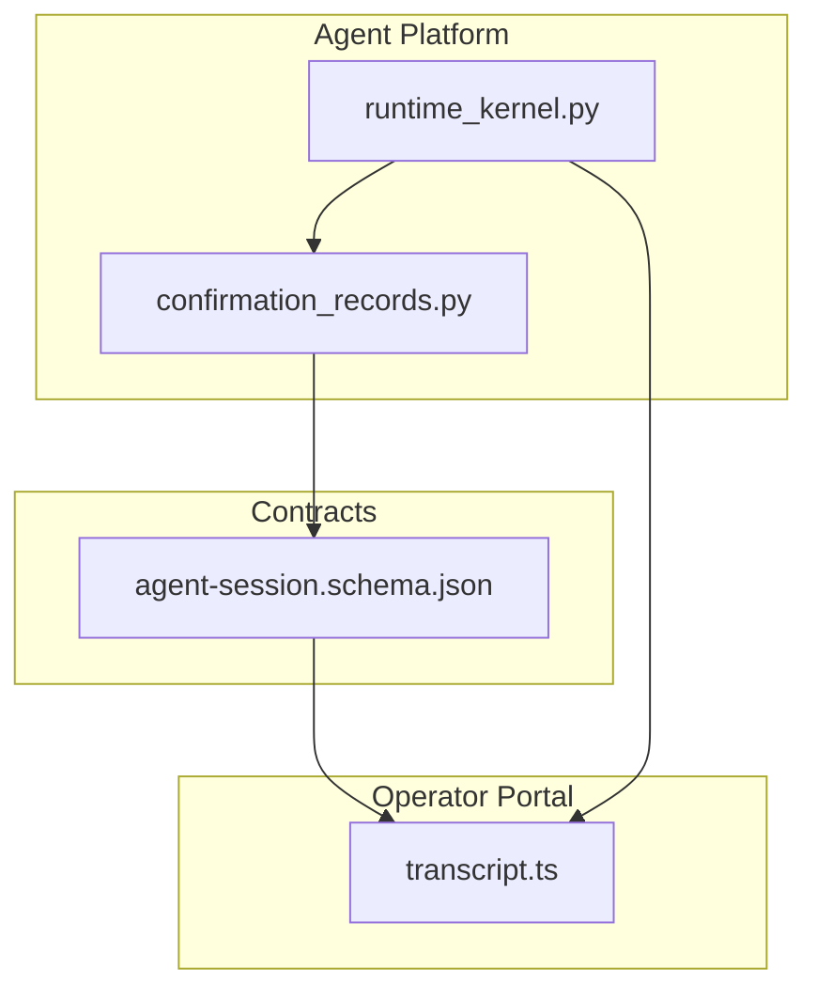
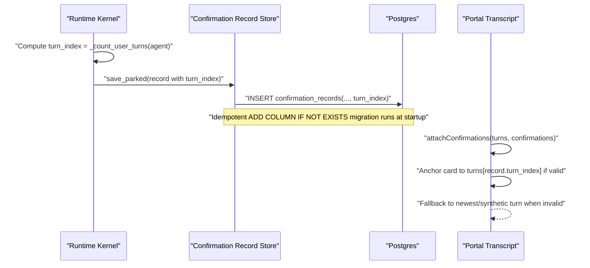
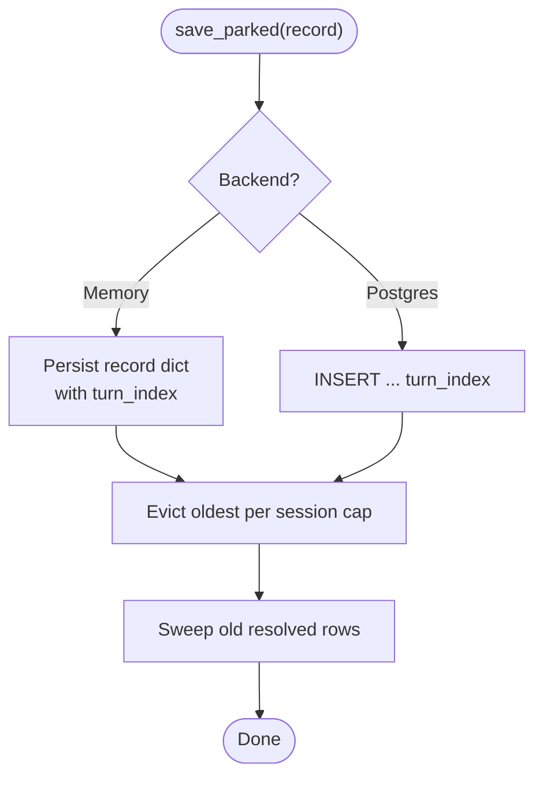
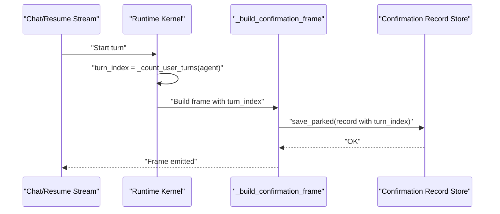
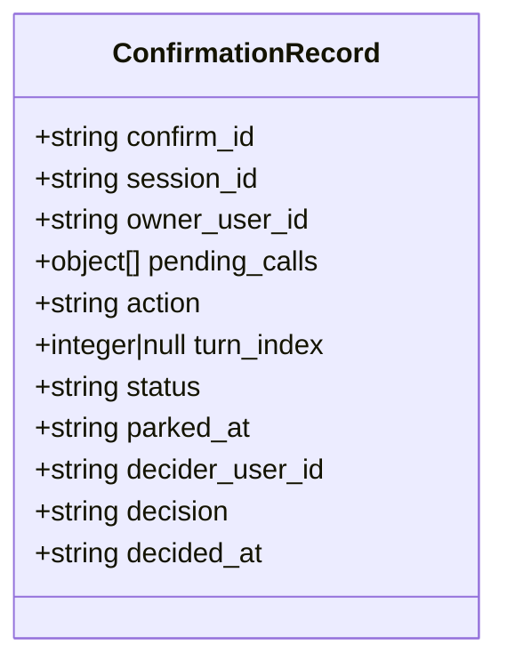
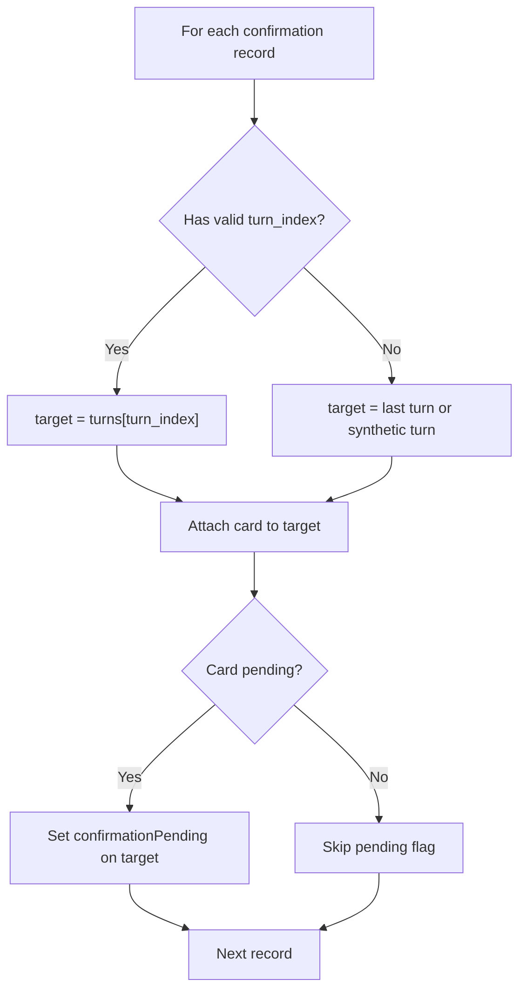
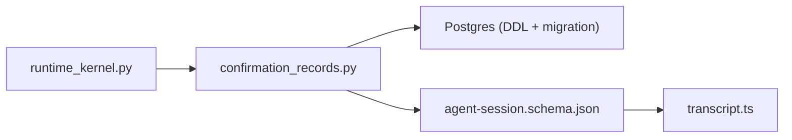

# SPEC-033: Confirmation Card Turn Anchoring

<cite>
**Referenced Files in This Document**
- [spec.md](file://docs/specs/SPEC-033-confirmation-card-turn-anchoring/spec.md)
- [plan.md](file://docs/specs/SPEC-033-confirmation-card-turn-anchoring/plan.md)
- [tasks.md](file://docs/specs/SPEC-033-confirmation-card-turn-anchoring/tasks.md)
- [agent-session.schema.json](file://shared/shared-contracts/schemas/agent-session.schema.json)
- [confirmation_records.py](file://products/agent-platform/src/agent_service/services/confirmation_records.py)
- [runtime_kernel.py](file://products/agent-platform/src/agent_service/runtime_kernel.py)
- [transcript.ts](file://products/operator-portal/web-ui/app/src/chat/transcript.ts)
</cite>

## Table of Contents
1. [Introduction](#introduction)
2. [Project Structure](#project-structure)
3. [Core Components](#core-components)
4. [Architecture Overview](#architecture-overview)
5. [Detailed Component Analysis](#detailed-component-analysis)
6. [Dependency Analysis](#dependency-analysis)
7. [Performance Considerations](#performance-considerations)
8. [Troubleshooting Guide](#troubleshooting-guide)
9. [Conclusion](#conclusion)

## Introduction
SPEC-033 introduces turn anchoring for confirmation cards so that each durable confirmation is rendered under the exact user turn where it was parked, instead of stacking all cards under the newest turn. The change is additive and backward-compatible: pre-delivery records without a turn index fall back to legacy behavior.

Key outcomes:
- Persist the parking turn ordinal on confirmation records at park time.
- Expose the ordinal on session-detail and inbox surfaces as an additive nullable field.
- Anchor portal transcript cards by the persisted turn index with safe fallbacks.

**Section sources**
- [spec.md:11-36](file://docs/specs/SPEC-033-confirmation-card-turn-anchoring/spec.md#L11-L36)
- [spec.md:38-87](file://docs/specs/SPEC-033-confirmation-card-turn-anchoring/spec.md#L38-L87)

## Project Structure
This feature spans three layers:
- Backend store and kernel integration (Python): persists and forwards the parking turn ordinal.
- Contract schema (JSON Schema): adds an additive `turn_index` field to confirmation records.
- Portal UI (TypeScript): seeds transcript turns and anchors confirmation cards by turn index.

**Diagram sources**
- [runtime_kernel.py:918-980](file://products/agent-platform/src/agent_service/runtime_kernel.py#L918-L980)
- [confirmation_records.py:52-76](file://products/agent-platform/src/agent_service/services/confirmation_records.py#L52-L76)
- [agent-session.schema.json:94-145](file://shared/shared-contracts/schemas/agent-session.schema.json#L94-L145)
- [transcript.ts:137-165](file://products/operator-portal/web-ui/app/src/chat/transcript.ts#L137-L165)

**Section sources**
- [plan.md:10-46](file://docs/specs/SPEC-033-confirmation-card-turn-anchoring/plan.md#L10-L46)

## Core Components
- Confirmation record store: creates records with an optional `turn_index`, persists via Postgres or in-memory backend, and round-trips the field unchanged.
- Runtime kernel: computes the current user turn ordinal before running a turn and passes it into the confirmation frame builder.
- Session detail contract: exposes `turn_index` as an additive nullable integer on confirmation items.
- Portal transcript seeding: attaches confirmation cards to the turn identified by `turn_index`, with fallback to newest turn or synthetic turn.

**Section sources**
- [confirmation_records.py:52-76](file://products/agent-platform/src/agent_service/services/confirmation_records.py#L52-L76)
- [runtime_kernel.py:918-980](file://products/agent-platform/src/agent_service/runtime_kernel.py#L918-L980)
- [agent-session.schema.json:94-145](file://shared/shared-contracts/schemas/agent-session.schema.json#L94-L145)
- [transcript.ts:137-165](file://products/operator-portal/web-ui/app/src/chat/transcript.ts#L137-L165)

## Architecture Overview
The anchoring flow connects the runtime kernel’s turn counting to persistence and then to UI rendering.

**Diagram sources**
- [runtime_kernel.py:918-980](file://products/agent-platform/src/agent_service/runtime_kernel.py#L918-L980)
- [confirmation_records.py:226-252](file://products/agent-platform/src/agent_service/services/confirmation_records.py#L226-L252)
- [confirmation_records.py:435-452](file://products/agent-platform/src/agent_service/services/confirmation_records.py#L435-L452)
- [transcript.ts:137-165](file://products/operator-portal/web-ui/app/src/chat/transcript.ts#L137-L165)

## Detailed Component Analysis

### Backend: Confirmation Record Store
- Adds `turn_index` to record creation and persists it through both in-memory and Postgres backends.
- Postgres DDL includes the new column; startup initialization runs an idempotent `ADD COLUMN IF NOT EXISTS` migration so existing clusters are updated safely.
- All load queries include the column and map it into the record dict; legacy rows load with `None`.

**Diagram sources**
- [confirmation_records.py:134-137](file://products/agent-platform/src/agent_service/services/confirmation_records.py#L134-L137)
- [confirmation_records.py:254-264](file://products/agent-platform/src/agent_service/services/confirmation_records.py#L254-L264)
- [confirmation_records.py:454-481](file://products/agent-platform/src/agent_service/services/confirmation_records.py#L454-L481)

**Section sources**
- [confirmation_records.py:52-76](file://products/agent-platform/src/agent_service/services/confirmation_records.py#L52-L76)
- [confirmation_records.py:226-252](file://products/agent-platform/src/agent_service/services/confirmation_records.py#L226-L252)
- [confirmation_records.py:366-392](file://products/agent-platform/src/agent_service/services/confirmation_records.py#L366-L392)
- [confirmation_records.py:435-452](file://products/agent-platform/src/agent_service/services/confirmation_records.py#L435-L452)

### Runtime Kernel: Parking Turn Ordinal
- Both chat stream and resume stream compute the current user turn ordinal before executing the turn and pass it into `_build_confirmation_frame`.
- The frame builder forwards `turn_index` to the store when persisting the parked confirmation.

**Diagram sources**
- [runtime_kernel.py:918-980](file://products/agent-platform/src/agent_service/runtime_kernel.py#L918-L980)
- [runtime_kernel.py:1171-1175](file://products/agent-platform/src/agent_service/runtime_kernel.py#L1171-L1175)

**Section sources**
- [runtime_kernel.py:918-980](file://products/agent-platform/src/agent_service/runtime_kernel.py#L918-L980)
- [runtime_kernel.py:1171-1175](file://products/agent-platform/src/agent_service/runtime_kernel.py#L1171-L1175)

### Contract: Additive turn_index on Confirmations
- The session-detail schema adds `turn_index` as an additive nullable integer on confirmation items.
- Existing fields remain unchanged; pre-delivery records may have `null`.

**Diagram sources**
- [agent-session.schema.json:94-145](file://shared/shared-contracts/schemas/agent-session.schema.json#L94-L145)

**Section sources**
- [agent-session.schema.json:94-145](file://shared/shared-contracts/schemas/agent-session.schema.json#L94-L145)

### Portal: Transcript Seeding Anchors Cards by Turn
- During seeding, each confirmation card is attached to the turn identified by `record.turn_index` when present and in range.
- Fallback behavior preserves legacy rendering: newest turn or a synthetic turn for empty transcripts.
- Pending cards still mark their anchored turn with `confirmationPending`.

**Diagram sources**
- [transcript.ts:137-165](file://products/operator-portal/web-ui/app/src/chat/transcript.ts#L137-L165)

**Section sources**
- [transcript.ts:137-165](file://products/operator-portal/web-ui/app/src/chat/transcript.ts#L137-L165)

## Dependency Analysis
- The runtime kernel depends on the confirmation record store to persist turn-anchored records.
- The store depends on the database schema; startup ensures the `turn_index` column exists.
- The portal depends on the session-detail contract shape to anchor cards correctly.

**Diagram sources**
- [runtime_kernel.py:918-980](file://products/agent-platform/src/agent_service/runtime_kernel.py#L918-L980)
- [confirmation_records.py:226-252](file://products/agent-platform/src/agent_service/services/confirmation_records.py#L226-L252)
- [agent-session.schema.json:94-145](file://shared/shared-contracts/schemas/agent-session.schema.json#L94-L145)
- [transcript.ts:137-165](file://products/operator-portal/web-ui/app/src/chat/transcript.ts#L137-L165)

**Section sources**
- [plan.md:10-46](file://docs/specs/SPEC-033-confirmation-card-turn-anchoring/plan.md#L10-L46)

## Performance Considerations
- Persistence path remains best-effort; failures degrade to live-only cards without failing turns.
- Postgres operations include bounded eviction and opportunistic sweep to keep writes efficient.
- UI anchoring is O(n) over confirmations per session and uses direct array indexing for constant-time placement.

[No sources needed since this section provides general guidance]

## Troubleshooting Guide
- Pre-delivery records render under the newest turn or synthetic turn when `turn_index` is missing or out of range.
- If the Postgres backend is unavailable, the service falls back to in-memory storage; anchoring still works within the process lifetime.
- Startup migration ensures the `turn_index` column exists; verify initialization logs if anchoring appears inconsistent after upgrades.

**Section sources**
- [confirmation_records.py:570-616](file://products/agent-platform/src/agent_service/services/confirmation_records.py#L570-L616)
- [transcript.ts:137-165](file://products/operator-portal/web-ui/app/src/chat/transcript.ts#L137-L165)

## Conclusion
SPEC-033 delivers precise, turn-anchored confirmation cards with zero breaking changes. New records carry the parking turn ordinal, the wire contract extends additively, and the portal renders cards exactly where they were created while preserving legacy behavior for older data.

[No sources needed since this section summarizes without analyzing specific files]