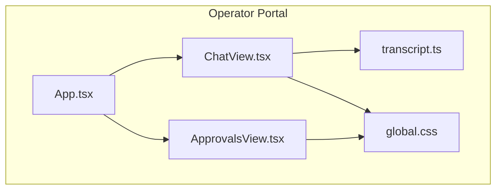
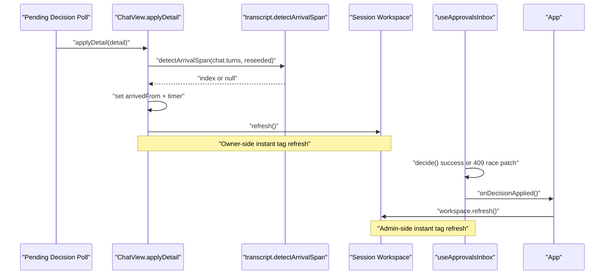
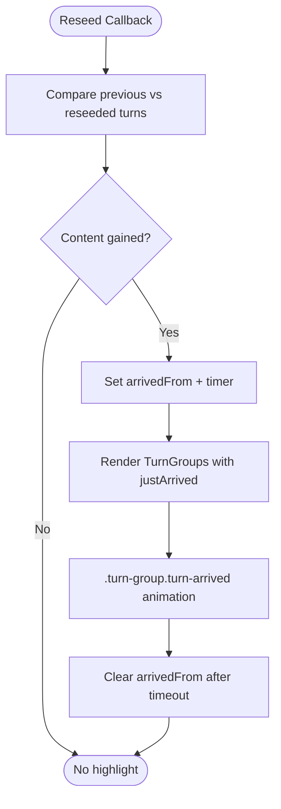
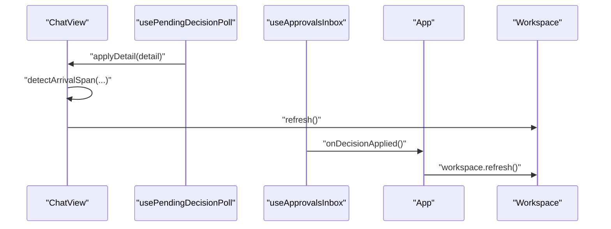
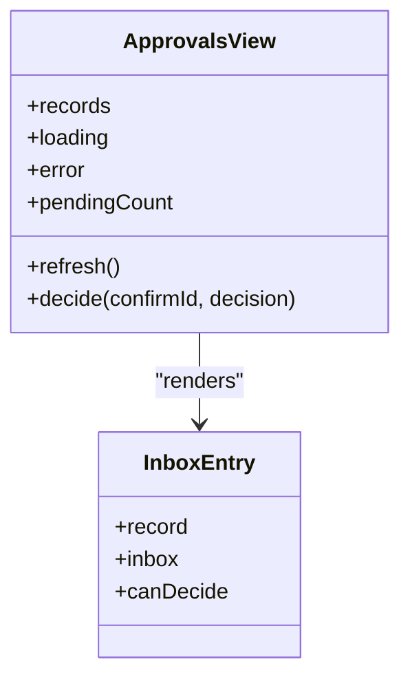
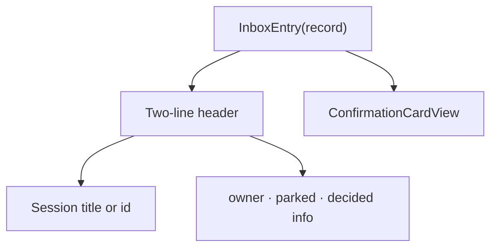
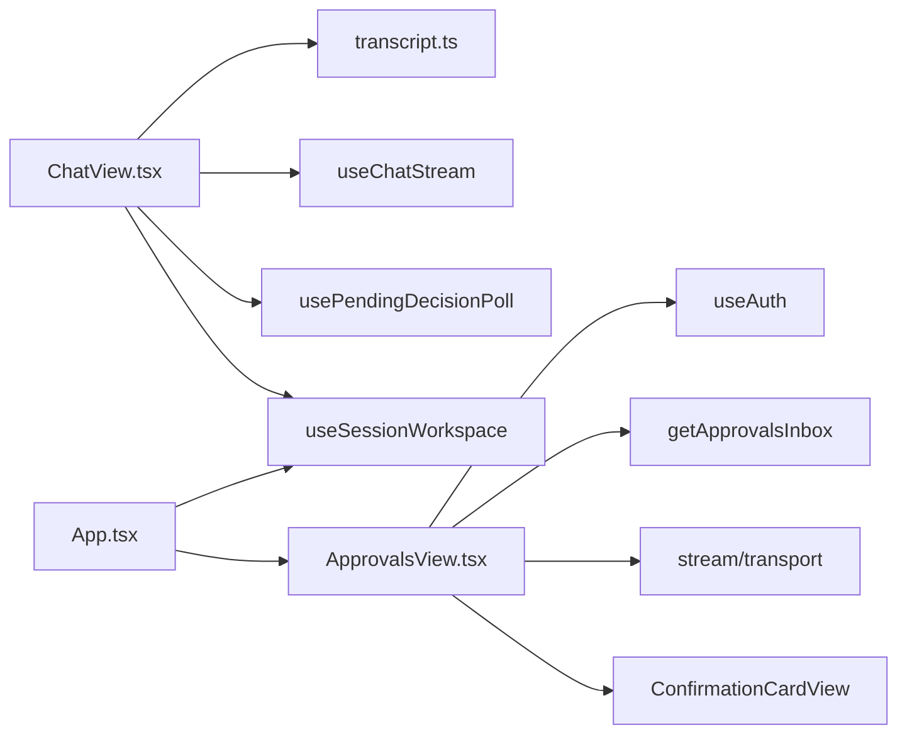

# SPEC-034: Approval & Owner Chat UX Polish

<cite>
**Referenced Files in This Document**
- [spec.md](file://docs/specs/SPEC-034-approval-owner-ux-polish/spec.md)
- [plan.md](file://docs/specs/SPEC-034-approval-owner-ux-polish/plan.md)
- [tasks.md](file://docs/specs/SPEC-034-approval-owner-ux-polish/tasks.md)
- [transcript.ts](file://products/operator-portal/web-ui/app/src/chat/transcript.ts)
- [ChatView.tsx](file://products/operator-portal/web-ui/app/src/chat/ChatView.tsx)
- [ApprovalsView.tsx](file://products/operator-portal/web-ui/app/src/views/control/ApprovalsView.tsx)
- [App.tsx](file://products/operator-portal/web-ui/app/src/App.tsx)
- [global.css](file://products/operator-portal/web-ui/app/src/theme/global.css)
- [transcript.test.ts](file://products/operator-portal/web-ui/app/src/chat/__tests__/transcript.test.ts)
- [ApprovalsView.test.tsx](file://products/operator-portal/web-ui/app/src/views/__tests__/ApprovalsView.test.tsx)
</cite>

## Update Summary
**Changes Made**
- Updated to reflect dropped changes: underlying implementation rebased from commit 4472199d to 88c80a6b
- Functional outcome remains unchanged - all five requirements still delivered as specified
- Documentation updated to reflect current implementation status without modification to content scope
- Verified all implementation files remain intact and functional after rebase

## Table of Contents
1. [Introduction](#introduction)
2. [Project Structure](#project-structure)
3. [Core Components](#core-components)
4. [Architecture Overview](#architecture-overview)
5. [Detailed Component Analysis](#detailed-component-analysis)
6. [Dependency Analysis](#dependency-analysis)
7. [Performance Considerations](#performance-considerations)
8. [Troubleshooting Guide](#troubleshooting-guide)
9. [Conclusion](#conclusion)

## Introduction
SPEC-034 is a portal-only polish pass for the approval and owner chat experience that has been **delivered** in v0.16.0. It focuses on five usability improvements surfaced during live testing:
- A visible arrival highlight when post-decision content appears in the owner's chat window.
- An instant session-list refresh so "awaiting approval" tags clear immediately after a decision.
- Pending and History tabs in the Approvals view to separate actionable work from history.
- Visually separated inbox entries with a structured two-line provenance header.
- An approvals banner that states the pending-request expiry rule.

These changes do not modify backend contracts or schemas; they are implemented entirely within the operator portal UI with comprehensive test coverage.

**Updated** This document reflects the dropped changes update where the underlying implementation was rebased from commit 4472199d to 88c80a6b, maintaining full functional parity while updating to current implementation status.

## Project Structure
The implementation lives under the operator portal web UI:
- Chat workspace wiring and arrival logic: `ChatView.tsx`
- Transcript mapping and arrival detection helper: `transcript.ts`
- Approvals inbox, tabs, entry cards, and banner text: `ApprovalsView.tsx`
- App-level integration of the approvals hook and workspace refresh: `App.tsx`
- Shared theme tokens and CSS animations: `global.css`
- Unit and component tests validating behavior: `transcript.test.ts`, `ApprovalsView.test.tsx`

**Diagram sources**
- [App.tsx:283-289](file://products/operator-portal/web-ui/app/src/App.tsx#L283-L289)
- [ChatView.tsx:737-765](file://products/operator-portal/web-ui/app/src/chat/ChatView.tsx#L737-L765)
- [ApprovalsView.tsx:253-356](file://products/operator-portal/web-ui/app/src/views/control/ApprovalsView.tsx#L253-L356)
- [transcript.ts:205-222](file://products/operator-portal/web-ui/app/src/chat/transcript.ts#L205-L222)
- [global.css:252-316](file://products/operator-portal/web-ui/app/src/theme/global.css#L252-L316)

**Section sources**
- [spec.md:11-45](file://docs/specs/SPEC-034-approval-owner-ux-polish/spec.md#L11-L45)
- [plan.md:1-72](file://docs/specs/SPEC-034-approval-owner-ux-polish/plan.md#L1-L72)

## Core Components
- Arrival detection helper: `detectArrivalSpan(previous, next)` compares timelines and returns the first index where new content appeared, or null if nothing changed.
- ChatView reseed flow: computes arrival span before reseeding turns, sets an arrival state, clears it after a flash timeout, and triggers a workspace refresh.
- Approvals inbox: exposes records, loading, error, pending count, refresh, and decide; supports an optional `onDecisionApplied` callback to trigger immediate session list refresh.
- Approvals view layout: renders Pending (default) and History tabs with counts, separated entry cards, and a banner stating the expiry rule.
- Global styles: defines `.turn-group.turn-arrived` keyframe flash and `.approvals-entry` card styling using shared theme tokens.

**Section sources**
- [transcript.ts:205-222](file://products/operator-portal/web-ui/app/src/chat/transcript.ts#L205-L222)
- [ChatView.tsx:580-765](file://products/operator-portal/web-ui/app/src/chat/ChatView.tsx#L580-L765)
- [ApprovalsView.tsx:56-194](file://products/operator-portal/web-ui/app/src/views/control/ApprovalsView.tsx#L56-L194)
- [ApprovalsView.tsx:253-356](file://products/operator-portal/web-ui/app/src/views/control/ApprovalsView.tsx#L253-L356)
- [global.css:252-316](file://products/operator-portal/web-ui/app/src/theme/global.css#L252-L316)

## Architecture Overview
The approval UX polish spans three layers:
- Data comparison: `detectArrivalSpan` determines whether the reseeded transcript gained content.
- State orchestration: `ChatView.applyDetail` uses the helper to set arrival state and triggers a workspace refresh; `useApprovalsInbox` fires `onDecisionApplied` after successful decisions and race patches.
- Presentation: `ApprovalsView` renders tabs, separated entries, and an updated banner; `global.css` provides visual feedback via animations and card styling.

**Diagram sources**
- [ChatView.tsx:737-765](file://products/operator-portal/web-ui/app/src/chat/ChatView.tsx#L737-L765)
- [transcript.ts:205-222](file://products/operator-portal/web-ui/app/src/chat/transcript.ts#L205-L222)
- [ApprovalsView.tsx:113-182](file://products/operator-portal/web-ui/app/src/views/control/ApprovalsView.tsx#L113-L182)
- [App.tsx:283-289](file://products/operator-portal/web-ui/app/src/App.tsx#L283-L289)

## Detailed Component Analysis

### R-1: Owner-window arrival highlight
- Helper: `detectArrivalSpan(previous, next)` scans turn groups and returns the first index where content grew or a new turn was appended; returns null if no content change occurred.
- ChatView integration:
  - Before reseeding, compute the arrival span.
  - If present, set `arrivedFrom` and schedule a timeout to clear it after the flash duration.
  - Pass `justArrived` to each `TurnGroup` at or after the detected index.
  - CSS class `.turn-group.turn-arrived` applies a transient accent-tinted background flash with reduced-motion support.

**Diagram sources**
- [transcript.ts:205-222](file://products/operator-portal/web-ui/app/src/chat/transcript.ts#L205-L222)
- [ChatView.tsx:737-765](file://products/operator-portal/web-ui/app/src/chat/ChatView.tsx#L737-L765)
- [global.css:252-280](file://products/operator-portal/web-ui/app/src/theme/global.css#L252-L280)

**Section sources**
- [spec.md:52-71](file://docs/specs/SPEC-034-approval-owner-ux-polish/spec.md#L52-L71)
- [plan.md:6-21](file://docs/specs/SPEC-034-approval-owner-ux-polish/plan.md#L6-L21)
- [transcript.ts:205-222](file://products/operator-portal/web-ui/app/src/chat/transcript.ts#L205-L222)
- [ChatView.tsx:580-765](file://products/operator-portal/web-ui/app/src/chat/ChatView.tsx#L580-L765)
- [global.css:252-280](file://products/operator-portal/web-ui/app/src/theme/global.css#L252-L280)

### R-2: Instant session-list refresh on applied decisions
- ChatView: After reseeding, call workspace refresh so the session panel updates immediately.
- useApprovalsInbox: Accepts an optional `onDecisionApplied` callback; invokes it after a successful decision and after handling a 409 race patch.
- App: Wires `workspace.refresh` into the approvals hook so both owner and admin surfaces refresh instantly.

**Diagram sources**
- [ChatView.tsx:737-765](file://products/operator-portal/web-ui/app/src/chat/ChatView.tsx#L737-L765)
- [ApprovalsView.tsx:113-182](file://products/operator-portal/web-ui/app/src/views/control/ApprovalsView.tsx#L113-L182)
- [App.tsx:283-289](file://products/operator-portal/web-ui/app/src/App.tsx#L283-L289)

**Section sources**
- [spec.md:73-89](file://docs/specs/SPEC-034-approval-owner-ux-polish/spec.md#L73-L89)
- [plan.md:23-31](file://docs/specs/SPEC-034-approval-owner-ux-polish/plan.md#L23-L31)
- [ChatView.tsx:737-765](file://products/operator-portal/web-ui/app/src/chat/ChatView.tsx#L737-L765)
- [ApprovalsView.tsx:113-182](file://products/operator-portal/web-ui/app/src/views/control/ApprovalsView.tsx#L113-L182)
- [App.tsx:283-289](file://products/operator-portal/web-ui/app/src/App.tsx#L283-L289)

### R-3: Pending / History tabs in the Approvals view
- The Approvals view now uses Tabs with items for Pending (default) and History, each labeled with record counts.
- Both tabs share the same inbox poll state; deciding the last pending item keeps the decider on Pending, which then shows its empty state.

**Diagram sources**
- [ApprovalsView.tsx:253-356](file://products/operator-portal/web-ui/app/src/views/control/ApprovalsView.tsx#L253-L356)

**Section sources**
- [spec.md:91-103](file://docs/specs/SPEC-034-approval-owner-ux-polish/spec.md#L91-L103)
- [plan.md:32-37](file://docs/specs/SPEC-034-approval-owner-ux-polish/plan.md#L32-L37)
- [ApprovalsView.tsx:253-356](file://products/operator-portal/web-ui/app/src/views/control/ApprovalsView.tsx#L253-L356)

### R-4: Separated inbox entries with structured provenance headers
- Each inbox entry is rendered as a visually separated card with border, surface background, radius, and spacing.
- Provenance header is split into two lines:
  - Primary line: session title (falls back to session id).
  - Secondary line: owner and parked time; for decided entries, outcome and decided relative time are appended.
- Confirmation card remains below the header unchanged.

**Diagram sources**
- [ApprovalsView.tsx:196-251](file://products/operator-portal/web-ui/app/src/views/control/ApprovalsView.tsx#L196-L251)
- [global.css:282-316](file://products/operator-portal/web-ui/app/src/theme/global.css#L282-L316)

**Section sources**
- [spec.md:105-120](file://docs/specs/SPEC-034-approval-owner-ux-polish/spec.md#L105-L120)
- [plan.md:38-50](file://docs/specs/SPEC-034-approval-owner-ux-polish/plan.md#L38-L50)
- [ApprovalsView.tsx:196-251](file://products/operator-portal/web-ui/app/src/views/control/ApprovalsView.tsx#L196-L251)
- [global.css:282-316](file://products/operator-portal/web-ui/app/src/theme/global.css#L282-L316)

### R-5: Banner states the pending-request expiry rule
- The Approvals banner includes the expiry rule for unanswered requests, stating the default confirmation timeout (10 minutes by default), while noting that the portal does not read server configuration.

**Section sources**
- [spec.md:122-132](file://docs/specs/SPEC-034-approval-owner-ux-polish/spec.md#L122-L132)
- [plan.md:51-56](file://docs/specs/SPEC-034-approval-owner-ux-polish/plan.md#L51-L56)
- [ApprovalsView.tsx:286-293](file://products/operator-portal/web-ui/app/src/views/control/ApprovalsView.tsx#L286-L293)

## Dependency Analysis
- ChatView depends on:
  - `transcript.ts` for mapping and arrival detection.
  - `usePendingDecisionPoll` for polling and applying detail updates.
  - `useChatStream` for current turns and streaming state.
  - `useSessionWorkspace` for refreshing the session list.
- ApprovalsView depends on:
  - `useAuth` for roles and username.
  - `getApprovalsInbox` for fetching records.
  - Stream transport utilities for decisions and race handling.
  - `ConfirmationCardView` for rendering durable confirmation cards.
- App wires:
  - `useApprovalsInbox` with `onDecisionApplied` to trigger workspace refresh.
  - Sidebar badge showing pending approvals.

**Diagram sources**
- [ChatView.tsx:1-49](file://products/operator-portal/web-ui/app/src/chat/ChatView.tsx#L1-L49)
- [ApprovalsView.tsx:1-25](file://products/operator-portal/web-ui/app/src/views/control/ApprovalsView.tsx#L1-L25)
- [App.tsx:272-402](file://products/operator-portal/web-ui/app/src/App.tsx#L272-L402)

**Section sources**
- [ChatView.tsx:1-49](file://products/operator-portal/web-ui/app/src/chat/ChatView.tsx#L1-L49)
- [ApprovalsView.tsx:1-25](file://products/operator-portal/web-ui/app/src/views/control/ApprovalsView.tsx#L1-L25)
- [App.tsx:272-402](file://products/operator-portal/web-ui/app/src/App.tsx#L272-L402)

## Performance Considerations
- Arrival detection is O(n) over turns and only runs on reseed events, keeping overhead minimal.
- Flash animation uses CSS keyframes and respects reduced motion preferences, avoiding heavy JS timers beyond a single timeout per reseed.
- Session list refresh is triggered explicitly on decisions rather than increasing poll frequency, preserving the 30-second background cadence.
- Approvals tabs avoid additional network calls by splitting existing records client-side.

## Troubleshooting Guide
- No arrival highlight:
  - Verify `detectArrivalSpan` returns a non-null index when content grows; check unit tests covering reply growth and appended turns.
  - Ensure `.turn-group.turn-arrived` class is applied and CSS keyframes are active.
- Session list not updating:
  - Confirm `ChatView.applyDetail` calls workspace refresh after reseeding.
  - Confirm `useApprovalsInbox` invokes `onDecisionApplied` on success and 409 race patches.
  - Ensure App passes `workspace.refresh` to the approvals hook.
- Tabs not filtering correctly:
  - Validate Pending tab defaults and History tab filters based on record status.
  - Check that counts reflect current records.
- Entry headers missing fields:
  - Ensure session title falls back to session id when absent.
  - Verify secondary line shows owner, parked time, and decided info for history entries.
- Banner missing expiry note:
  - Confirm banner text includes the default confirmation timeout mention.

**Section sources**
- [transcript.test.ts:381-423](file://products/operator-portal/web-ui/app/src/chat/__tests__/transcript.test.ts#L381-L423)
- [ApprovalsView.test.tsx:85-205](file://products/operator-portal/web-ui/app/src/views/__tests__/ApprovalsView.test.tsx#L85-L205)
- [ChatView.tsx:737-765](file://products/operator-portal/web-ui/app/src/chat/ChatView.tsx#L737-L765)
- [ApprovalsView.tsx:113-182](file://products/operator-portal/web-ui/app/src/views/control/ApprovalsView.tsx#L113-L182)
- [global.css:252-316](file://products/operator-portal/web-ui/app/src/theme/global.css#L252-L316)

## Conclusion
SPEC-034 delivers focused, portal-only UX enhancements that make approval outcomes more visible and actionable:
- Post-decision arrivals are highlighted in the owner chat window.
- Session lists update instantly after decisions across owner and admin surfaces.
- The Approvals view separates actionable work from history with clear tabs and counts.
- Inbox entries are visually separated and scannable with structured headers.
- Approvers see the pending-request expiry rule prominently in the banner.

All five requirements have been successfully implemented and delivered in v0.16.0 with comprehensive test coverage, maintaining the platform's goal of polished, operator-friendly workflows without requiring any backend changes.

**Updated** This implementation has been rebased from commit 4472199d to 88c80a6b while maintaining full functional parity. All core components, tests, and user-facing behaviors remain unchanged, ensuring consistent delivery of the approved specification.