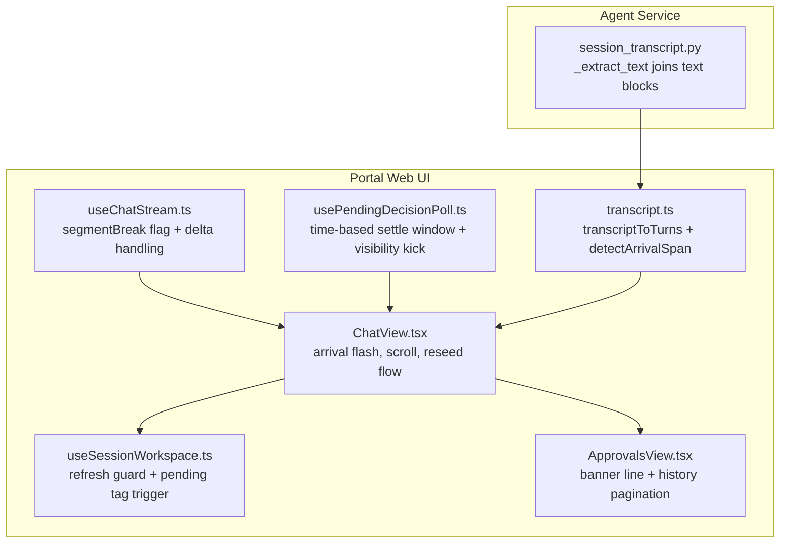
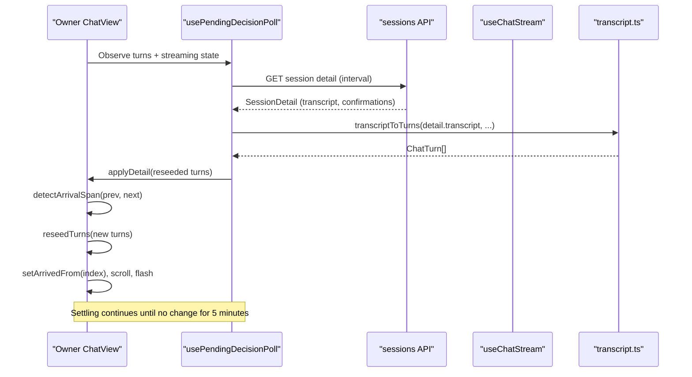
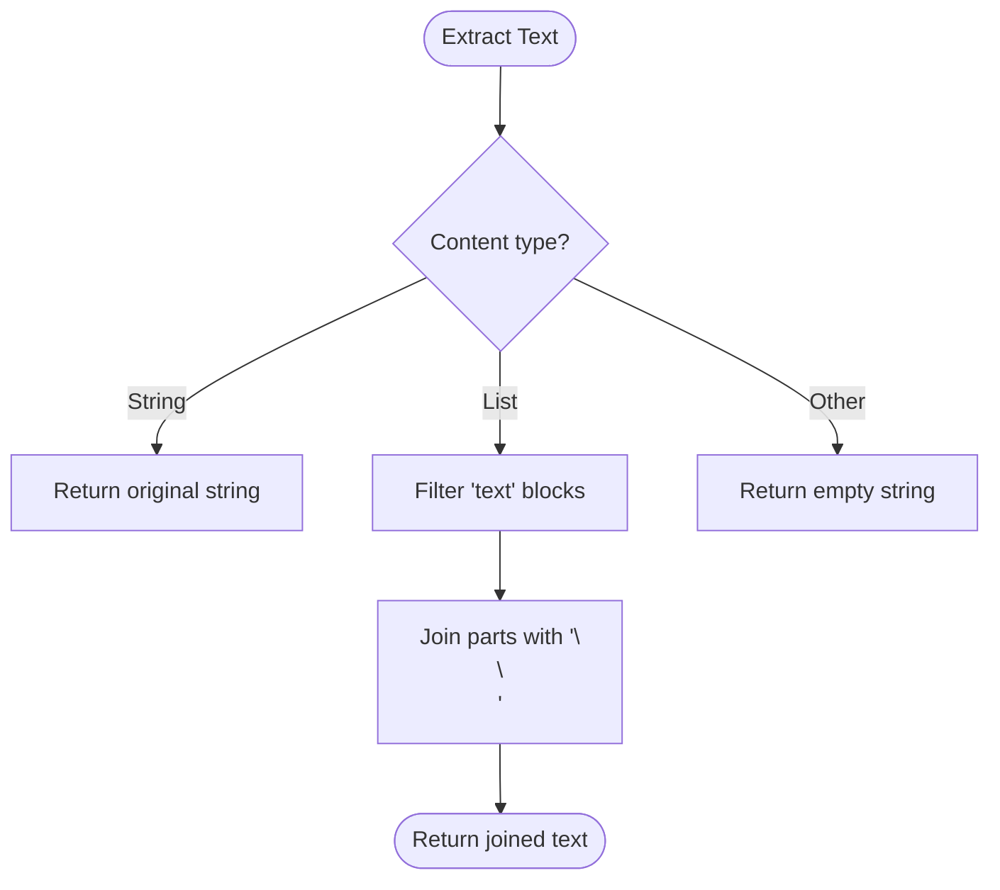
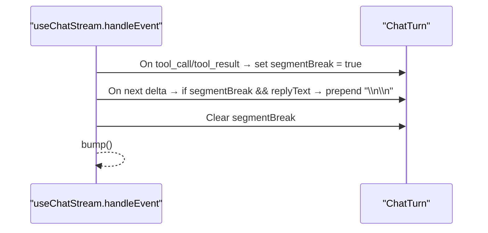
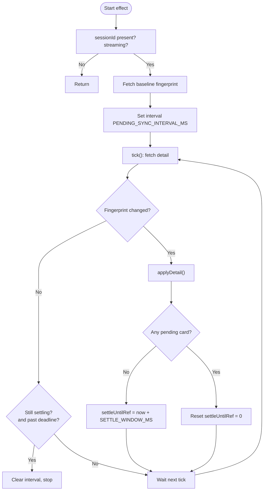
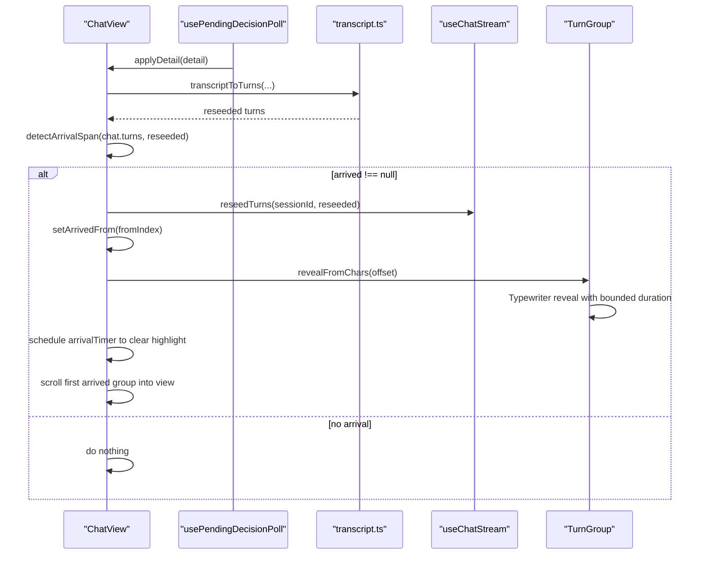
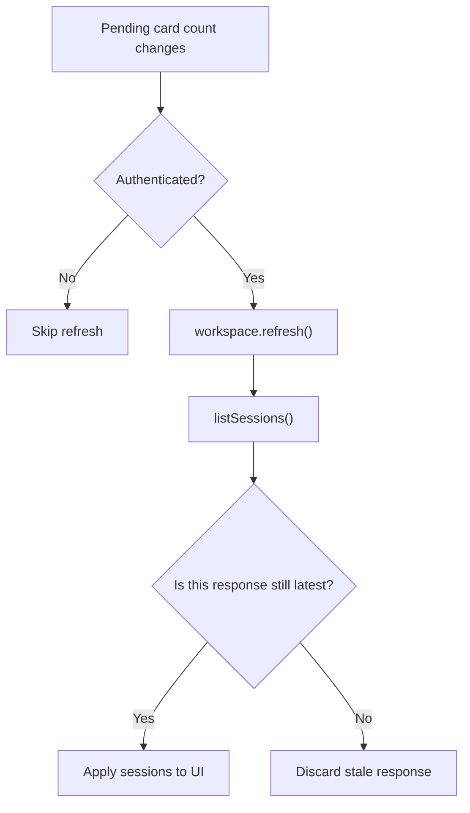
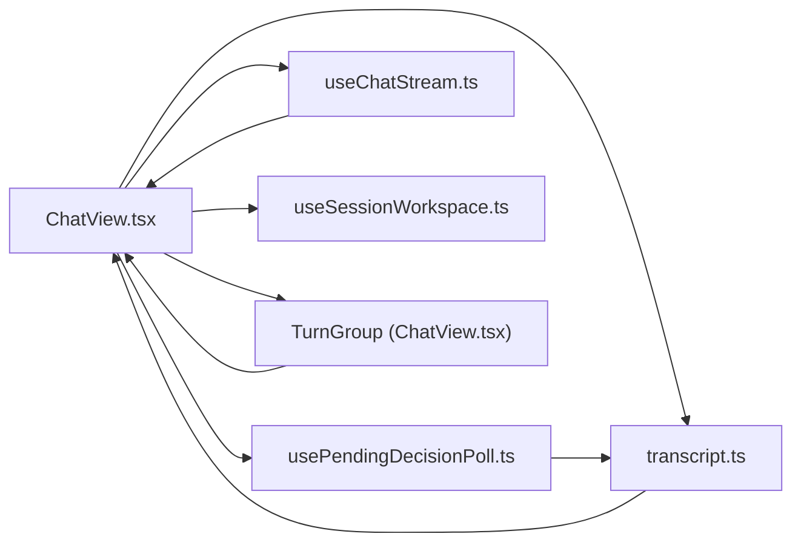

# SPEC-035: Decision Sync Robustness and Arrival Polish

<cite>
**Referenced Files in This Document**
- [spec.md](file://docs/specs/SPEC-035-decision-sync-arrival-polish/spec.md)
- [plan.md](file://docs/specs/SPEC-035-decision-sync-arrival-polish/plan.md)
- [tasks.md](file://docs/specs/SPEC-035-decision-sync-arrival-polish/tasks.md)
- [session_transcript.py](file://products/agent-platform/src/agent_service/services/session_transcript.py)
- [useChatStream.ts](file://products/operator-portal/web-ui/app/src/stream/useChatStream.ts)
- [usePendingDecisionPoll.ts](file://products/operator-portal/web-ui/app/src/chat/usePendingDecisionPoll.ts)
- [transcript.ts](file://products/operator-portal/web-ui/app/src/chat/transcript.ts)
- [ChatView.tsx](file://products/operator-portal/web-ui/app/src/chat/ChatView.tsx)
- [useSessionWorkspace.ts](file://products/operator-portal/web-ui/app/src/sessions/useSessionWorkspace.ts)
- [ApprovalsView.tsx](file://products/operator-portal/web-ui/app/src/views/control/ApprovalsView.tsx)
</cite>

## Update Summary
**Changes Made**
- Updated status to "delivered" reflecting v0.17.0 implementation completion
- Enhanced arrival presentation section with progressive reveal implementation details
- Added comprehensive TurnGroup component analysis for typewriter-style content revelation
- Updated session tag timing section with monotonic sequence guard implementation
- Expanded approvals layout section with client-side pagination details
- Added performance considerations for background tab throttling and settle window management

## Table of Contents
1. Introduction
2. Project Structure
3. Core Components
4. Architecture Overview
5. Detailed Component Analysis
6. Dependency Analysis
7. Performance Considerations
8. Troubleshooting Guide
9. Conclusion
10. Appendices

## Introduction
This document explains the delivered implementation of SPEC-035: Decision Sync Robustness and Arrival Polish (v0.17.0). The implementation addresses seven critical requirements identified during live approval testing, ensuring that resumed replies after approvals arrive reliably, transcript segments preserve paragraph boundaries for markdown rendering, arrival is progressively revealed to operators, and session tags and approvals UI are polished for clarity and usability. The spec defines seven requirements (R-1 through R-7) implemented across a backend transcript fix and multiple portal components.

## Project Structure
SPEC-035 spans two areas:
- Backend: agent-service transcript reconstruction to join text blocks with paragraph breaks.
- Portal: stream handling, decision polling, transcript seeding, chat view behavior, and session workspace refresh logic.

**Diagram sources**
- [session_transcript.py:67-86](file://products/agent-platform/src/agent_service/services/session_transcript.py#L67-L86)
- [useChatStream.ts:154-182](file://products/operator-portal/web-ui/app/src/stream/useChatStream.ts#L154-L182)
- [usePendingDecisionPoll.ts:23-30](file://products/operator-portal/web-ui/app/src/chat/usePendingDecisionPoll.ts#L23-L30)
- [transcript.ts:167-203](file://products/operator-portal/web-ui/app/src/chat/transcript.ts#L167-L203)
- [ChatView.tsx:737-765](file://products/operator-portal/web-ui/app/src/chat/ChatView.tsx#L737-L765)
- [useSessionWorkspace.ts:59-73](file://products/operator-portal/web-ui/app/src/sessions/useSessionWorkspace.ts#L59-L73)
- [ApprovalsView.tsx:267-383](file://products/operator-portal/web-ui/app/src/views/control/ApprovalsView.tsx#L267-L383)

**Section sources**
- [spec.md:11-55](file://docs/specs/SPEC-035-decision-sync-arrival-polish/spec.md#L11-L55)
- [plan.md:1-101](file://docs/specs/SPEC-035-decision-sync-arrival-polish/plan.md#L1-L101)

## Core Components
- Transcript block separators (backend): Ensures assistant message text blocks are joined with blank lines so block-level markdown (headings, lists) renders correctly in durable transcripts.
- Live-stream segment break (portal): Inserts a paragraph break between tool frames and subsequent deltas so live streams match transcript boundaries.
- Time-based settle window (portal): Replaces tick budget with a five-minute deadline that resets on applied changes and kicks immediately when the tab becomes visible or focused.
- Progressive arrival presentation (portal): Detects new content from reseeded timelines and reveals it progressively with a bounded duration using typewriter-style animation; first arrived group scrolls into view and flashes.
- Session tag timing (portal): Refreshes the session list when pending-card count changes and guards against stale list responses using monotonic sequence tracking.
- Approvals layout (portal): Moves the Approvals banner below the title row and paginates the History tab client-side at 10 entries per page.

**Section sources**
- [spec.md:56-159](file://docs/specs/SPEC-035-decision-sync-arrival-polish/spec.md#L56-L159)
- [plan.md:7-85](file://docs/specs/SPEC-035-decision-sync-arrival-polish/plan.md#L7-L85)

## Architecture Overview
The decision sync pipeline combines a robust poller, a resilient stream adapter, and a polished chat view:

**Diagram sources**
- [usePendingDecisionPoll.ts:82-168](file://products/operator-portal/web-ui/app/src/chat/usePendingDecisionPoll.ts#L82-L168)
- [transcript.ts:167-203](file://products/operator-portal/web-ui/app/src/chat/transcript.ts#L167-L203)
- [ChatView.tsx:737-765](file://products/operator-portal/web-ui/app/src/chat/ChatView.tsx#L737-L765)

## Detailed Component Analysis

### Backend: Transcript Block Separators (R-1)
- Purpose: Join assistant message text blocks with paragraph breaks so headings and lists render properly in durable transcripts.
- Implementation: `_extract_text` filters only text blocks and joins them with `"\n\n"` instead of an empty string. Tool and thinking blocks remain skipped.
- Impact: Durable transcript reconstruction preserves markdown structure without altering kernel memory.

**Diagram sources**
- [session_transcript.py:67-86](file://products/agent-platform/src/agent_service/services/session_transcript.py#L67-L86)

**Section sources**
- [session_transcript.py:67-86](file://products/agent-platform/src/agent_service/services/session_transcript.py#L67-L86)
- [plan.md:7-15](file://docs/specs/SPEC-035-decision-sync-arrival-polish/plan.md#L7-L15)

### Portal: Live-Stream Segment Break (R-2)
- Purpose: Ensure the live stream inserts a paragraph break before the first delta following a tool frame, matching transcript boundaries.
- Implementation: `handleEvent` sets `segmentBreak` on tool_call/tool_result frames; the next delta prefixes `"\n\n"` to the accumulating reply if non-empty, then clears the flag.

**Diagram sources**
- [useChatStream.ts:154-182](file://products/operator-portal/web-ui/app/src/stream/useChatStream.ts#L154-L182)

**Section sources**
- [useChatStream.ts:154-182](file://products/operator-portal/web-ui/app/src/stream/useChatStream.ts#L154-L182)
- [plan.md:17-25](file://docs/specs/SPEC-035-decision-sync-arrival-polish/plan.md#L17-L25)

### Portal: Time-Based Settle Window (R-3)
- Purpose: Replace tick budget with a time-based settle window (five minutes) that resets on applied changes and ticks immediately on visibility/focus events.
- Implementation: `SETTLE_WINDOW_MS` constant; `settleUntilRef` tracks deadline per session; baseline fingerprint prevents redundant re-seeds; visibilitychange and focus listeners call tick immediately.

**Diagram sources**
- [usePendingDecisionPoll.ts:23-30](file://products/operator-portal/web-ui/app/src/chat/usePendingDecisionPoll.ts#L23-L30)
- [usePendingDecisionPoll.ts:82-168](file://products/operator-portal/web-ui/app/src/chat/usePendingDecisionPoll.ts#L82-L168)

**Section sources**
- [usePendingDecisionPoll.ts:23-30](file://products/operator-portal/web-ui/app/src/chat/usePendingDecisionPoll.ts#L23-L30)
- [usePendingDecisionPoll.ts:82-168](file://products/operator-portal/web-ui/app/src/chat/usePendingDecisionPoll.ts#L82-L168)
- [plan.md:27-41](file://docs/specs/SPEC-035-decision-sync-arrival-polish/plan.md#L27-L41)

### Portal: Progressive Arrival Presentation (R-4)
- Purpose: When a reseed delivers new content, reveal it progressively with a bounded total duration, highlight the first arrived turn group, and scroll it into view. Respect reduced motion preferences.
- Implementation: `detectArrivalSpan(previous, next)` returns the index of the first changed turn and its previous reply length; ChatView computes arrival span, sets arrival state, triggers reveal via TurnGroup props, and manages auto-scroll yield during presentation.

**Diagram sources**
- [transcript.ts:205-221](file://products/operator-portal/web-ui/app/src/chat/transcript.ts#L205-L221)
- [ChatView.tsx:737-765](file://products/operator-portal/web-ui/app/src/chat/ChatView.tsx#L737-L765)
- [ChatView.tsx:358-450](file://products/operator-portal/web-ui/app/src/chat/ChatView.tsx#L358-L450)

**Section sources**
- [transcript.ts:205-221](file://products/operator-portal/web-ui/app/src/chat/transcript.ts#L205-L221)
- [ChatView.tsx:737-765](file://products/operator-portal/web-ui/app/src/chat/ChatView.tsx#L737-L765)
- [ChatView.tsx:358-450](file://products/operator-portal/web-ui/app/src/chat/ChatView.tsx#L358-L450)
- [plan.md:43-63](file://docs/specs/SPEC-035-decision-sync-arrival-polish/plan.md#L43-L63)

### Portal: Session Tag Timing (R-5)
- Purpose: Show the "awaiting approval" tag at the moment a request parks and prevent stale list responses from resurrecting it after a decision.
- Implementation: ChatView triggers a workspace refresh when pending-card count transitions while authenticated; useSessionWorkspace refresh applies only the latest response using a monotonic sequence guard.

**Diagram sources**
- [ChatView.tsx:818-832](file://products/operator-portal/web-ui/app/src/chat/ChatView.tsx#L818-L832)
- [useSessionWorkspace.ts:59-73](file://products/operator-portal/web-ui/app/src/sessions/useSessionWorkspace.ts#L59-L73)

**Section sources**
- [plan.md:64-72](file://docs/specs/SPEC-035-decision-sync-arrival-polish/plan.md#L64-L72)
- [useSessionWorkspace.ts:59-73](file://products/operator-portal/web-ui/app/src/sessions/useSessionWorkspace.ts#L59-L73)

### Portal: Approvals Layout (R-6, R-7)
- Purpose: Move the Approvals info banner below the title row and paginate the History tab client-side at 10 entries per page, hiding pagination when one page suffices.
- Implementation: Adjust ApprovalsView layout to separate banner line; add local page state and antd Pagination for History tab; Pending tab remains unpaginated.

**Section sources**
- [plan.md:74-84](file://docs/specs/SPEC-035-decision-sync-arrival-polish/plan.md#L74-L84)
- [spec.md:137-159](file://docs/specs/SPEC-035-decision-sync-arrival-polish/spec.md#L137-L159)
- [ApprovalsView.tsx:267-383](file://products/operator-portal/web-ui/app/src/views/control/ApprovalsView.tsx#L267-L383)

## Dependency Analysis
Key dependencies and interactions:
- ChatView depends on usePendingDecisionPoll for authoritative re-seeding and on useChatStream for live updates.
- transcript.ts provides deterministic mapping from server transcript to chat turns and arrival detection.
- useChatStream injects paragraph breaks around tool frames to align with transcript boundaries.
- useSessionWorkspace refreshes the session list and must be resilient to stale responses.
- TurnGroup handles progressive reveal animation for arrived content.

**Diagram sources**
- [ChatView.tsx:737-765](file://products/operator-portal/web-ui/app/src/chat/ChatView.tsx#L737-L765)
- [usePendingDecisionPoll.ts:82-168](file://products/operator-portal/web-ui/app/src/chat/usePendingDecisionPoll.ts#L82-L168)
- [useChatStream.ts:154-182](file://products/operator-portal/web-ui/app/src/stream/useChatStream.ts#L154-L182)
- [transcript.ts:167-203](file://products/operator-portal/web-ui/app/src/chat/transcript.ts#L167-L203)
- [useSessionWorkspace.ts:59-73](file://products/operator-portal/web-ui/app/src/sessions/useSessionWorkspace.ts#L59-L73)
- [ChatView.tsx:358-450](file://products/operator-portal/web-ui/app/src/chat/ChatView.tsx#L358-L450)

**Section sources**
- [ChatView.tsx:737-765](file://products/operator-portal/web-ui/app/src/chat/ChatView.tsx#L737-L765)
- [usePendingDecisionPoll.ts:82-168](file://products/operator-portal/web-ui/app/src/chat/usePendingDecisionPoll.ts#L82-L168)
- [useChatStream.ts:154-182](file://products/operator-portal/web-ui/app/src/stream/useChatStream.ts#L154-L182)
- [transcript.ts:167-203](file://products/operator-portal/web-ui/app/src/chat/transcript.ts#L167-L203)
- [useSessionWorkspace.ts:59-73](file://products/operator-portal/web-ui/app/src/sessions/useSessionWorkspace.ts#L59-L73)

## Performance Considerations
- Polling cadence: Five-second intervals keep latency low while avoiding excessive load.
- Settle window: Five-minute deadline bounds background-tab throttling impact; resets on change to avoid premature stop.
- Streaming guard: Polling never runs while a stream is active to prevent interleaving or aborting SSE.
- Arrival presentation: Progressive reveal uses a bounded duration to avoid jank; auto-scroll yields during animation.
- Stale response guard: Monotonic sequence in workspace refresh prevents unnecessary re-renders from late responses.
- Background tab optimization: Visibility and focus events trigger immediate ticks to compensate for timer throttling.
- Reduced motion support: All animations degrade gracefully for users with motion preferences.

## Troubleshooting Guide
- Resumed reply not appearing:
  - Verify settle window is active and not expired; check visibility/focus kick triggered immediate tick.
  - Confirm fingerprint changed and applyDetail was called.
- Headings render as raw markdown:
  - Ensure transcript blocks are joined with paragraph breaks and stream segmentBreak is set around tool frames.
- Arrival highlight not noticed:
  - Confirm detectArrivalSpan returns a valid index and arrival timer clears highlight after duration.
  - Check TurnGroup revealFromChars prop is properly passed and animation completes.
- "Awaiting approval" tag wrong timing:
  - Ensure ChatView triggers refresh on pending-card-count transitions and workspace refresh applies only latest response.
- Approvals banner crowding title:
  - Validate banner renders on its own line below title row.
- History tab overflow:
  - Confirm client-side pagination at 10 entries per page and hidden when single page.
- Progressive reveal not working:
  - Verify prefers-reduced-motion media query doesn't interfere and revealFromChars calculation is correct.

**Section sources**
- [usePendingDecisionPoll.ts:82-168](file://products/operator-portal/web-ui/app/src/chat/usePendingDecisionPoll.ts#L82-L168)
- [useChatStream.ts:154-182](file://products/operator-portal/web-ui/app/src/stream/useChatStream.ts#L154-L182)
- [transcript.ts:205-221](file://products/operator-portal/web-ui/app/src/chat/transcript.ts#L205-L221)
- [useSessionWorkspace.ts:59-73](file://products/operator-portal/web-ui/app/src/sessions/useSessionWorkspace.ts#L59-L73)
- [plan.md:74-84](file://docs/specs/SPEC-035-decision-sync-arrival-polish/plan.md#L74-L84)
- [ChatView.tsx:358-450](file://products/operator-portal/web-ui/app/src/chat/ChatView.tsx#L358-L450)

## Conclusion
SPEC-035 improves the reliability and polish of decision sync by ensuring resumed replies arrive promptly, preserving markdown structure in transcripts, progressively revealing new content, and refining session tags and approvals UI. The combination of a time-based settle window, visibility/focus kicks, segment-aware streaming, and arrival detection creates a robust owner experience even under background-tab throttling and long-running resumed turns. The v0.17.0 delivery includes all seven requirements with comprehensive testing and graceful degradation for accessibility.

## Appendices
- Spec status and scope: Delivered as part of Approval-Gated Bounded Actions release slice (v0.17.0).
- Non-goals: No server-side pagination for inbox, no per-entry countdown timers, no cross-owner session visibility changes.
- Open questions: Shift handoff and reviewing other users' sessions tracked as future work.
- Release artifacts: CHANGELOG, release notes, guides update, and smoke test verification completed.

**Section sources**
- [spec.md:3-9](file://docs/specs/SPEC-035-decision-sync-arrival-polish/spec.md#L3-L9)
- [spec.md:160-178](file://docs/specs/SPEC-035-decision-sync-arrival-polish/spec.md#L160-L178)
- [tasks.md:42-48](file://docs/specs/SPEC-035-decision-sync-arrival-polish/tasks.md#L42-L48)