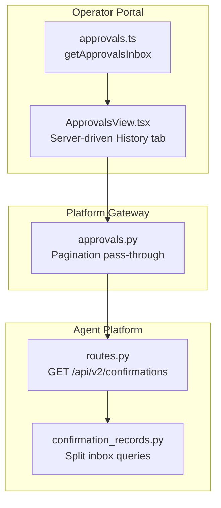
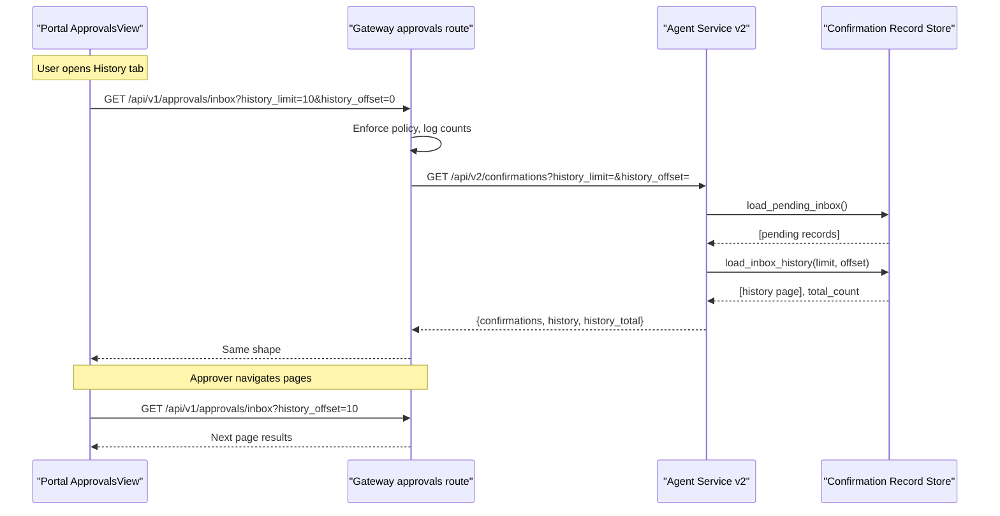
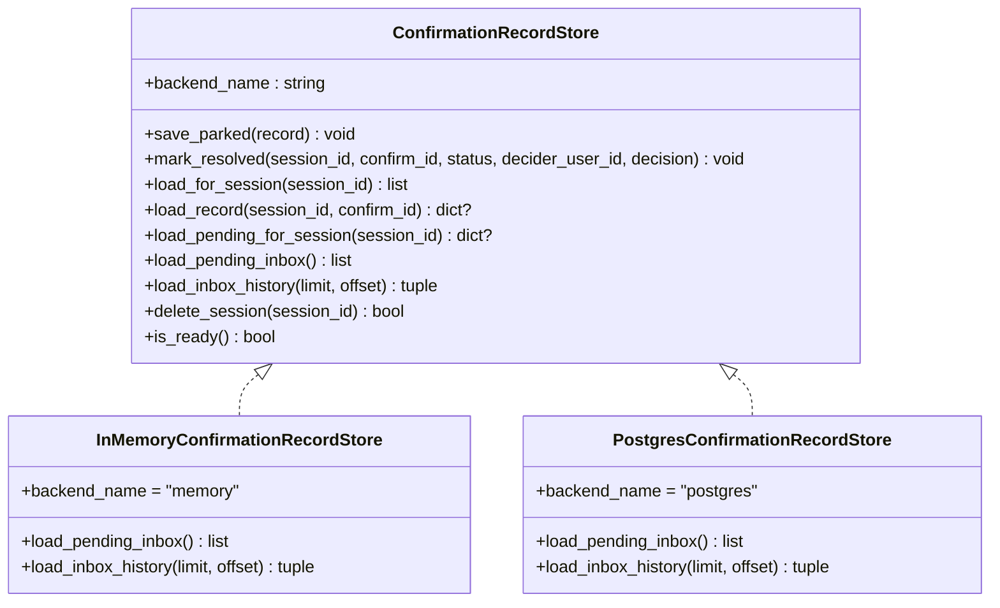
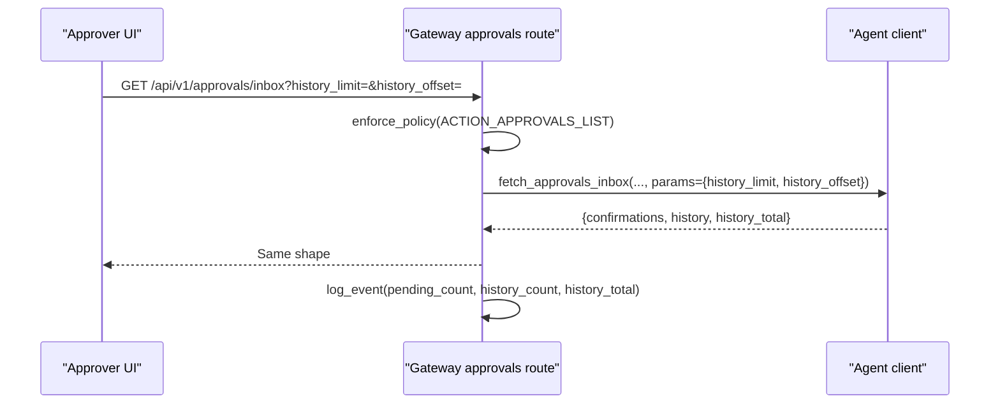
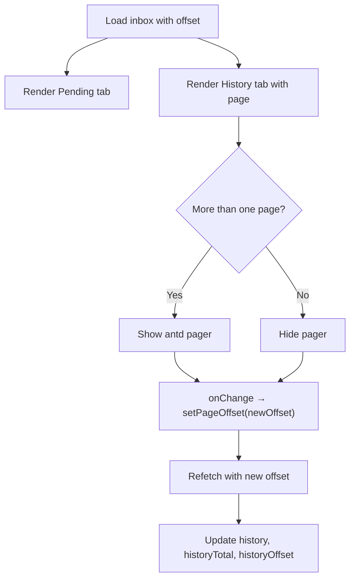
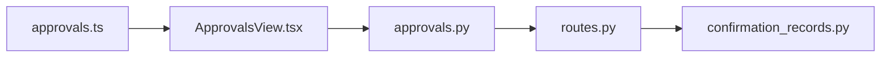

# SPEC-036: Server Inbox Pagination and Seeded Transcript Reveal

<cite>
**Referenced Files in This Document**
- [spec.md](file://docs/specs/SPEC-036-inbox-pagination-and-seeded-reveal/spec.md)
- [plan.md](file://docs/specs/SPEC-036-inbox-pagination-and-seeded-reveal/plan.md)
- [tasks.md](file://docs/specs/SPEC-036-inbox-pagination-and-seeded-reveal/tasks.md)
- [confirmation_records.py](file://products/agent-platform/src/agent_service/services/confirmation_records.py)
- [routes.py](file://products/agent-platform/src/agent_service/api/v2/routes.py)
- [approvals.py](file://products/platform-gateway/src/platform_gateway/api/routes/approvals.py)
- [transcript.ts](file://products/operator-portal/web-ui/app/src/chat/transcript.ts)
- [ChatView.tsx](file://products/operator-portal/web-ui/app/src/chat/ChatView.tsx)
- [approvals.ts](file://products/operator-portal/web-ui/app/src/api/approvals.ts)
- [ApprovalsView.tsx](file://products/operator-portal/web-ui/app/src/views/control/ApprovalsView.tsx)
- [live-check-patch.md](file://docs/agentic-aiops-platform/release-notes/2026-08-26-live-check-patch.md)
</cite>

## Update Summary
**Changes Made**
- Updated spec status to reflect current state after revert: R-1 (Seeded Transcript Reveal) was reverted in v0.18.1, while R-2 through R-5 remain delivered
- Removed all references to seeded transcript reveal functionality from implementation sections
- Updated architecture diagrams to reflect only the remaining inbox pagination features
- Added comprehensive coverage of the revert decision and its impact
- Updated component analysis to focus exclusively on the delivered inbox pagination requirements
- Added release verification information for both the original delivery and subsequent revert

## Table of Contents
1. [Introduction](#introduction)
2. [Project Structure](#project-structure)
3. [Core Components](#core-components)
4. [Architecture Overview](#architecture-overview)
5. [Detailed Component Analysis](#detailed-component-analysis)
6. [Dependency Analysis](#dependency-analysis)
7. [Performance Considerations](#performance-considerations)
8. [Troubleshooting Guide](#troubleshooting-guide)
9. [Conclusion](#conclusion)
10. [Appendices](#appendices)

## Introduction
SPEC-036 introduced two operator-facing improvements to the approval workflow and session transcript experience:
- Server-side pagination for the approvals inbox history, replacing a single combined query that silently truncated results.
- Progressive typewriter reveal for cold-seeded transcripts so opening a session reads like a live stream instead of a sudden wall of text.

The spec defines five requirements (R-1 through R-5) spanning the portal chat UI, agent-service confirmation store, agent-service v2 API, gateway proxy, and portal approvals view. However, **R-1 (Seeded Transcript Reveal) was completely reverted in v0.18.1** due to negative user feedback during live check, where operators found the seeded-transcript typewriter read as delay rather than polish. The typewriter effect is now reserved exclusively for live arrivals (SPEC-035).

**Current Status**: R-2 through R-5 delivered in v0.18.0; R-1 reverted in v0.18.1 patch.

**Section sources**
- [spec.md:3-9](file://docs/specs/SPEC-036-inbox-pagination-and-seeded-reveal/spec.md#L3-L9)
- [spec.md:44-51](file://docs/specs/SPEC-036-inbox-pagination-and-seeded-reveal/spec.md#L44-L51)
- [spec.md:157-165](file://docs/specs/SPEC-036-inbox-pagination-and-seeded-reveal/spec.md#L157-L165)

## Project Structure
This feature touches three products with partial implementation:
- Operator Portal (React): server-driven History tab and approvals view for pagination.
- Agent Platform (Python): confirmation record store split into pending and paginated history, plus new v2 endpoint.
- Platform Gateway (Python): forwards pagination parameters and logs counts separately.

**Diagram sources**
- [approvals.ts:21-37](file://products/operator-portal/web-ui/app/src/api/approvals.ts#L21-L37)
- [ApprovalsView.tsx:69-241](file://products/operator-portal/web-ui/app/src/views/control/ApprovalsView.tsx#L69-L241)
- [confirmation_records.py:186-216](file://products/agent-platform/src/agent_service/services/confirmation_records.py#L186-L216)
- [routes.py:669-705](file://products/agent-platform/src/agent_service/api/v2/routes.py#L669-L705)
- [approvals.py:19-57](file://products/platform-gateway/src/platform_gateway/api/routes/approvals.py#L19-L57)

**Section sources**
- [plan.md:9-98](file://docs/specs/SPEC-036-inbox-pagination-and-seeded-reveal/plan.md#L9-L98)

## Core Components
- Confirmation record store (agent-service): splits inbox queries into pending and history with offset paging and total count.
- Paginated inbox API (agent-service v2): exposes `history_limit` and `history_offset`, returns separate pending/history arrays and total.
- Gateway pass-through (platform-gateway): forwards pagination params, enforces policy, logs counts separately.
- Server-driven History tab (portal): uses antd pagination with offset-based navigation and refresh-aware state management.

Key behaviors:
- Pending queue is never hidden or paginated; it remains complete up to its sanity cap.
- History uses offset pagination within a retention window; ordering is stable using parked_at desc with confirm_id tiebreak.
- History tab maintains current page during polling without snapping back to page 1.

**Section sources**
- [confirmation_records.py:186-216](file://products/agent-platform/src/agent_service/services/confirmation_records.py#L186-L216)
- [confirmation_records.py:575-606](file://products/agent-platform/src/agent_service/services/confirmation_records.py#L575-L606)
- [routes.py:669-705](file://products/agent-platform/src/agent_service/api/v2/routes.py#L669-L705)
- [approvals.py:19-57](file://products/platform-gateway/src/platform_gateway/api/routes/approvals.py#L19-L57)
- [ApprovalsView.tsx:69-241](file://products/operator-portal/web-ui/app/src/views/control/ApprovalsView.tsx#L69-L241)

## Architecture Overview
End-to-end flow for an approvals inbox request with server-side pagination:

**Diagram sources**
- [ApprovalsView.tsx:88-106](file://products/operator-portal/web-ui/app/src/views/control/ApprovalsView.tsx#L88-L106)
- [approvals.py:19-57](file://products/platform-gateway/src/platform_gateway/api/routes/approvals.py#L19-L57)
- [routes.py:669-705](file://products/agent-platform/src/agent_service/api/v2/routes.py#L669-L705)
- [confirmation_records.py:575-606](file://products/agent-platform/src/agent_service/services/confirmation_records.py#L575-L606)

## Detailed Component Analysis

### Seeded Transcript Reveal (R-1) - Reverted
**Status**: Reverted in v0.18.1 due to negative user feedback during live check.

The seeded transcript reveal feature was originally implemented but completely removed after operators reported that opening a session re-typed its history instead of showing it, which read as delay rather than polish. The following components were removed:
- `seedRevealIndex` and `seedRevealDelay` helpers in transcript.ts
- Cascade state management in ChatView.tsx
- All related unit tests for seeded reveal functionality

**Current State**: Cold-seeded transcripts now render instantly. The typewriter effect is reserved exclusively for live arrivals (SPEC-035).

**Section sources**
- [spec.md:44-51](file://docs/specs/SPEC-036-inbox-pagination-and-seeded-reveal/spec.md#L44-L51)
- [live-check-patch.md:50-58](file://docs/agentic-aiops-platform/release-notes/2026-08-26-live-check-patch.md#L50-L58)

### Split Inbox Store Queries (R-2) - Delivered
- Protocol change implemented:
  - `load_pending_inbox() -> list[pending]`
  - `load_inbox_history(limit, offset) -> tuple[list[resolved], int(total)]`
- Backends fully implemented:
  - In-memory: filters pending vs resolved, applies retention window for history, sorts by parked_at desc with confirm_id tiebreak, slices with limit/offset, returns total.
  - Postgres: dedicated SQL for pending (LIMIT sanity cap), history (retention window, ORDER BY parked_at DESC, confirm_id DESC, LIMIT/OFFSET), and COUNT for total.

**Diagram sources**
- [confirmation_records.py:84-118](file://products/agent-platform/src/agent_service/services/confirmation_records.py#L84-L118)
- [confirmation_records.py:186-216](file://products/agent-platform/src/agent_service/services/confirmation_records.py#L186-L216)
- [confirmation_records.py:575-606](file://products/agent-platform/src/agent_service/services/confirmation_records.py#L575-L606)

**Section sources**
- [confirmation_records.py:186-216](file://products/agent-platform/src/agent_service/services/confirmation_records.py#L186-L216)
- [confirmation_records.py:337-367](file://products/agent-platform/src/agent_service/services/confirmation_records.py#L337-L367)
- [confirmation_records.py:575-606](file://products/agent-platform/src/agent_service/services/confirmation_records.py#L575-L606)

### Paginated Inbox API (R-3) - Delivered
- Endpoint fully implemented: `GET /api/v2/confirmations`
- Query params validated:
  - `history_limit` (1–50, default 10)
  - `history_offset` (≥ 0, default 0)
- Response shape returned: `{ confirmations: [...pending...], history: [...page...], history_total: N }`
- Validation enforced: invalid params return framework 422.

Acceptance signals verified include default page behavior, explicit offset/limit shifting, and separation of pending from history.

**Section sources**
- [plan.md:54-62](file://docs/specs/SPEC-036-inbox-pagination-and-seeded-reveal/plan.md#L54-L62)
- [spec.md:91-97](file://docs/specs/SPEC-036-inbox-pagination-and-seeded-reveal/spec.md#L91-L97)
- [routes.py:669-705](file://products/agent-platform/src/agent_service/api/v2/routes.py#L669-L705)

### Gateway Pass-Through (R-4) - Delivered
- Route fully implemented: `GET /api/v1/approvals/inbox` accepts `history_limit` and `history_offset`.
- Forwards params verbatim to agent service via `approvals_inbox`.
- Policy gate (`approvals:list`) unchanged; error mapping unchanged.
- Logging records `pending_count` and `history_count` separately along with `history_total`.

**Diagram sources**
- [approvals.py:19-57](file://products/platform-gateway/src/platform_gateway/api/routes/approvals.py#L19-L57)

**Section sources**
- [approvals.py:19-57](file://products/platform-gateway/src/platform_gateway/api/routes/approvals.py#L19-L57)
- [plan.md:64-74](file://docs/specs/SPEC-036-inbox-pagination-and-seeded-reveal/plan.md#L64-L74)

### Server-Driven History Tab (R-5) - Delivered
- API client fully implemented: `getApprovalsInbox({ historyLimit?, historyOffset?, signal? })` returns the new shape.
- Hook state fully implemented: replaces flat `records` with `pending`, `history`, `historyTotal`, `historyOffset`, and `setPageOffset(offset)`.
- Behavior fully implemented:
  - Polling refreshes current page (does not snap back to page 1).
  - Deciding a pending item locally moves it to the first history page when visible, normalizing on next refresh.
  - Pager (antd) renders only when `history_total` exceeds page size; navigation calls `setPageOffset` which refetches.

**Diagram sources**
- [plan.md:76-98](file://docs/specs/SPEC-036-inbox-pagination-and-seeded-reveal/plan.md#L76-L98)
- [ApprovalsView.tsx:88-135](file://products/operator-portal/web-ui/app/src/views/control/ApprovalsView.tsx#L88-L135)

**Section sources**
- [plan.md:76-98](file://docs/specs/SPEC-036-inbox-pagination-and-seeded-reveal/plan.md#L76-L98)
- [spec.md:118-127](file://docs/specs/SPEC-036-inbox-pagination-and-seeded-reveal/spec.md#L118-L127)
- [ApprovalsView.tsx:69-241](file://products/operator-portal/web-ui/app/src/views/control/ApprovalsView.tsx#L69-L241)

## Dependency Analysis
- Portal depends on:
  - Approvals API client for server-driven pagination.
- Gateway depends on:
  - Policy engine for approvals:list.
  - Agent client to forward pagination params.
- Agent service depends on:
  - Confirmation record store backends for split queries and totals.

**Diagram sources**
- [approvals.ts:21-37](file://products/operator-portal/web-ui/app/src/api/approvals.ts#L21-L37)
- [ApprovalsView.tsx:69-241](file://products/operator-portal/web-ui/app/src/views/control/ApprovalsView.tsx#L69-L241)
- [approvals.py:19-57](file://products/platform-gateway/src/platform_gateway/api/routes/approvals.py#L19-L57)
- [routes.py:669-705](file://products/agent-platform/src/agent_service/api/v2/routes.py#L669-L705)
- [confirmation_records.py:575-606](file://products/agent-platform/src/agent_service/services/confirmation_records.py#L575-L606)

**Section sources**
- [plan.md:9-98](file://docs/specs/SPEC-036-inbox-pagination-and-seeded-reveal/plan.md#L9-L98)

## Performance Considerations
- Inbox history pagination avoids loading entire histories; offset paging is bounded by retention window and sweep, minimizing drift risk.
- Pending queue remains unpaginated to prevent hiding work; sanity cap prevents excessive payloads.
- Reduced motion preference degrades to instant render for accessibility.
- History tab maintains current page during polling to avoid disruptive reflows.

## Troubleshooting Guide
Common issues and checks:
- Missing history data: verify `history_limit`/`history_offset` reach the agent service and that retention window includes decided rows.
- Incorrect totals: ensure history count query excludes pending rows and respects retention window.
- Policy errors: validate `approvals:list` permission and upstream error mapping (4xx passthrough, 5xx/transport → 502).
- Page navigation issues: verify offset state management and refetch logic in ApprovalsView hook.

**Section sources**
- [approvals.py:19-57](file://products/platform-gateway/src/platform_gateway/api/routes/approvals.py#L19-L57)
- [routes.py:669-705](file://products/agent-platform/src/agent_service/api/v2/routes.py#L669-L705)
- [confirmation_records.py:575-606](file://products/agent-platform/src/agent_service/services/confirmation_records.py#L575-L606)
- [ApprovalsView.tsx:88-135](file://products/operator-portal/web-ui/app/src/views/control/ApprovalsView.tsx#L88-L135)

## Conclusion
SPEC-036 has been partially delivered, with four out of five requirements successfully implemented:
- **Delivered**: R-2 through R-5 provide robust server-side pagination for the approvals inbox, eliminating silent truncation and enabling efficient browsing of historical decisions.
- **Reverted**: R-1 (Seeded Transcript Reveal) was removed in v0.18.1 due to negative user feedback, with the typewriter effect reserved for live arrivals only.

The delivered components improve reliability and usability for approvers by providing accurate, paginated access to approval history while maintaining the integrity of the pending queue.

**Delivery Status**: R-2 through R-5 completed in v0.18.0; R-1 reverted in v0.18.1 patch.

## Appendices
- Spec status and release slice: delivered in R4 — Approval-Gated Bounded Actions (with R-1 reverted).
- Non-goals: keyset/cursor pagination, cross-owner session review, shift-summary artifacts, and any changes to pending-record behavior or retention windows.
- Verification: Portal suite green; agent-platform suite green; gateway suite green; `make verify` green at lockstep 0.18.1.
- Revert rationale: Live-check feedback indicated that seeded-transcript typewriter read as delay rather than polish, leading to its removal in v0.18.1.

**Section sources**
- [spec.md:3-9](file://docs/specs/SPEC-036-inbox-pagination-and-seeded-reveal/spec.md#L3-L9)
- [spec.md:137-143](file://docs/specs/SPEC-036-inbox-pagination-and-seeded-reveal/spec.md#L137-L143)
- [tasks.md:36-45](file://docs/specs/SPEC-036-inbox-pagination-and-seeded-reveal/tasks.md#L36-L45)
- [live-check-patch.md:50-58](file://docs/agentic-aiops-platform/release-notes/2026-08-26-live-check-patch.md#L50-L58)