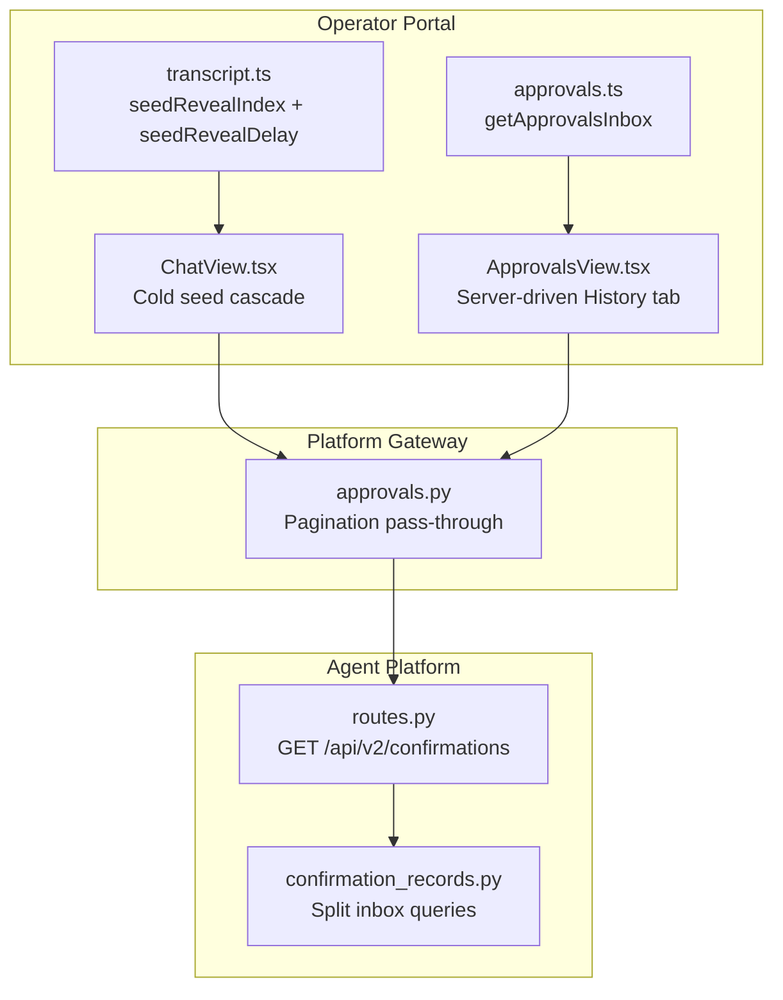
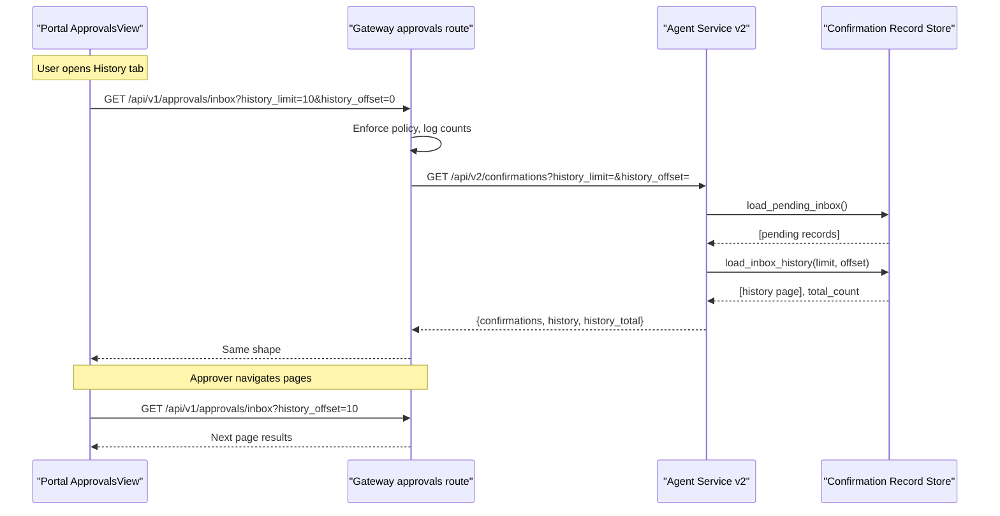
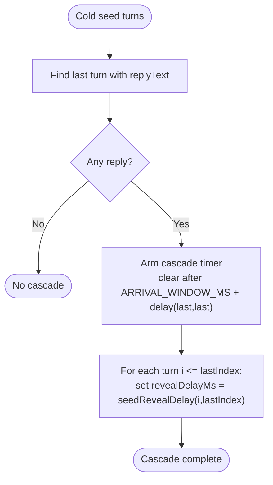
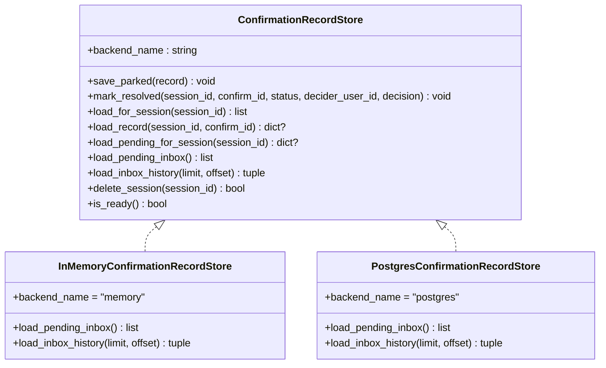
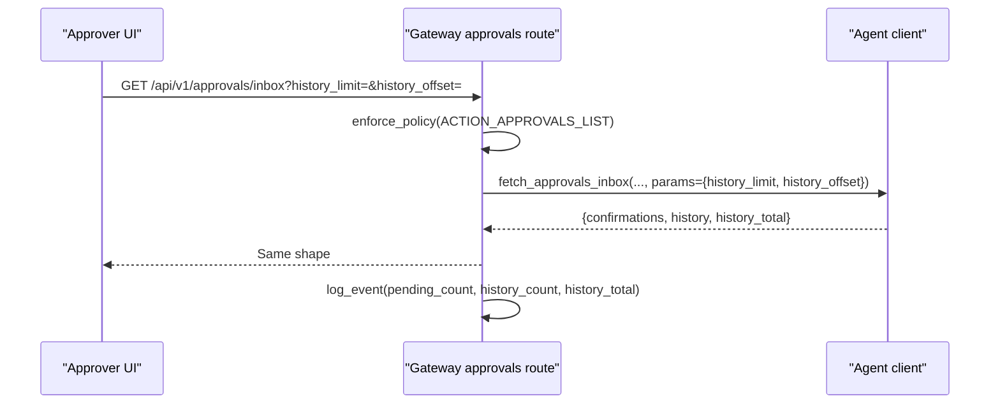
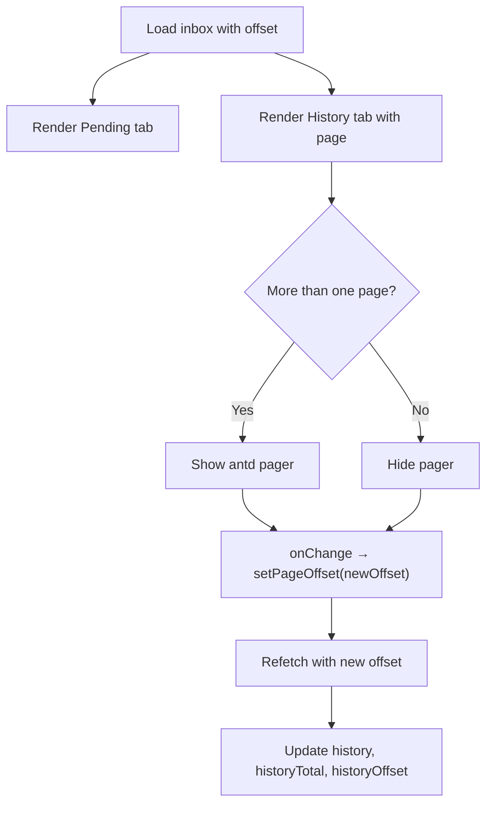
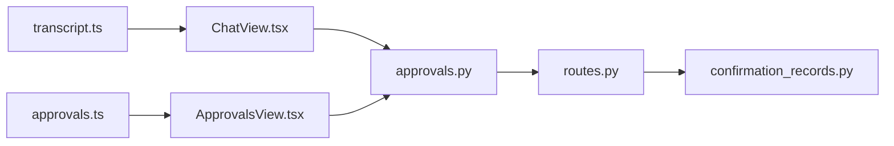

# SPEC-036: Server Inbox Pagination and Seeded Transcript Reveal

<cite>
**Referenced Files in This Document**
- [spec.md](file://docs/specs/SPEC-036-inbox-pagination-and-seeded-reveal/spec.md)
- [plan.md](file://docs/specs/SPEC-036-inbox-pagination-and-seeded-reveal/plan.md)
- [tasks.md](file://docs/specs/SPEC-036-inbox-pagination-and-seeded-reveal/tasks.md)
- [confirmation_records.py](file://products/agent-platform/src/agent_service/services/confirmation_records.py)
- [routes.py](file://products/agent-platform/src/agent_service/api/v2/routes.py)
- [approvals.py](file://products/platform-gateway/src/platform_gateway/api/routes/approvals.py)
- [transcript.ts](file://products/operator-portal/web-ui/app/src/chat/transcript.ts)
- [ChatView.tsx](file://products/operator-portal/web-ui/app/src/chat/ChatView.tsx)
- [approvals.ts](file://products/operator-portal/web-ui/app/src/api/approvals.ts)
- [ApprovalsView.tsx](file://products/operator-portal/web-ui/app/src/views/control/ApprovalsView.tsx)
</cite>

## Update Summary
**Changes Made**
- Updated spec status to `delivered` reflecting completed implementation
- Enhanced architecture diagrams with actual implementation details from backend pagination endpoints, frontend UI enhancements, and platform gateway forwarding capabilities
- Added comprehensive coverage of all five requirements (R-1 through R-5) with specific file references
- Updated component analysis sections with detailed implementation evidence
- Added release verification information and delivery confirmation

## Table of Contents
1. [Introduction](#introduction)
2. [Project Structure](#project-structure)
3. [Core Components](#core-components)
4. [Architecture Overview](#architecture-overview)
5. [Detailed Component Analysis](#detailed-component-analysis)
6. [Dependency Analysis](#dependency-analysis)
7. [Performance Considerations](#performance-considerations)
8. [Troubleshooting Guide](#troubleshooting-guide)
9. [Conclusion](#conclusion)
10. [Appendices](#appendices)

## Introduction
SPEC-036 introduces two operator-facing improvements to the approval workflow and session transcript experience:
- Server-side pagination for the approvals inbox history, replacing a single combined query that silently truncated results.
- Progressive typewriter reveal for cold-seeded transcripts so opening a session reads like a live stream instead of a sudden wall of text.

The spec defines five requirements (R-1 through R-5) spanning the portal chat UI, agent-service confirmation store, agent-service v2 API, gateway proxy, and portal approvals view. The plan outlines implementation steps and tests; the tasks list breaks down deliverables by requirement.

**Status**: Delivered in v0.18.0 with full implementation across all components.

**Section sources**
- [spec.md:3-9](file://docs/specs/SPEC-036-inbox-pagination-and-seeded-reveal/spec.md#L3-L9)
- [spec.md:11-37](file://docs/specs/SPEC-036-inbox-pagination-and-seeded-reveal/spec.md#L11-L37)
- [plan.md:1-7](file://docs/specs/SPEC-036-inbox-pagination-and-seeded-reveal/plan.md#L1-L7)

## Project Structure
This feature touches three products with complete implementation:
- Operator Portal (React): transcript helpers and chat view wiring for seeded reveal and server-driven History tab.
- Agent Platform (Python): confirmation record store split into pending and paginated history, plus new v2 endpoint.
- Platform Gateway (Python): forwards pagination parameters and logs counts separately.

**Diagram sources**
- [transcript.ts:231-260](file://products/operator-portal/web-ui/app/src/chat/transcript.ts#L231-L260)
- [ChatView.tsx:705-776](file://products/operator-portal/web-ui/app/src/chat/ChatView.tsx#L705-L776)
- [approvals.ts:21-37](file://products/operator-portal/web-ui/app/src/api/approvals.ts#L21-L37)
- [ApprovalsView.tsx:69-241](file://products/operator-portal/web-ui/app/src/views/control/ApprovalsView.tsx#L69-L241)
- [confirmation_records.py:186-216](file://products/agent-platform/src/agent_service/services/confirmation_records.py#L186-L216)
- [routes.py:669-705](file://products/agent-platform/src/agent_service/api/v2/routes.py#L669-L705)
- [approvals.py:19-57](file://products/platform-gateway/src/platform_gateway/api/routes/approvals.py#L19-L57)

**Section sources**
- [plan.md:9-98](file://docs/specs/SPEC-036-inbox-pagination-and-seeded-reveal/plan.md#L9-L98)

## Core Components
- Confirmation record store (agent-service): splits inbox queries into pending and history with offset paging and total count.
- Paginated inbox API (agent-service v2): exposes `history_limit` and `history_offset`, returns separate pending/history arrays and total.
- Gateway pass-through (platform-gateway): forwards pagination params, enforces policy, logs counts separately.
- Seeded transcript reveal (portal): pure helpers compute last reply index and per-turn stagger delay; ChatView wires cascade on cold seed.
- Server-driven History tab (portal): uses antd pagination with offset-based navigation and refresh-aware state management.

Key behaviors:
- Pending queue is never hidden or paginated; it remains complete up to its sanity cap.
- History uses offset pagination within a retention window; ordering is stable using parked_at desc with confirm_id tiebreak.
- Cold-seed reveal cascades top-to-bottom with budget-compressed staggering and respects reduced motion.
- History tab maintains current page during polling without snapping back to page 1.

**Section sources**
- [confirmation_records.py:186-216](file://products/agent-platform/src/agent_service/services/confirmation_records.py#L186-L216)
- [confirmation_records.py:575-606](file://products/agent-platform/src/agent_service/services/confirmation_records.py#L575-L606)
- [routes.py:669-705](file://products/agent-platform/src/agent_service/api/v2/routes.py#L669-L705)
- [approvals.py:19-57](file://products/platform-gateway/src/platform_gateway/api/routes/approvals.py#L19-L57)
- [transcript.ts:231-260](file://products/operator-portal/web-ui/app/src/chat/transcript.ts#L231-L260)
- [ChatView.tsx:705-776](file://products/operator-portal/web-ui/app/src/chat/ChatView.tsx#L705-L776)
- [ApprovalsView.tsx:69-241](file://products/operator-portal/web-ui/app/src/views/control/ApprovalsView.tsx#L69-L241)

## Architecture Overview
End-to-end flow for an approvals inbox request and a cold-seeded transcript reveal:

**Diagram sources**
- [ApprovalsView.tsx:88-106](file://products/operator-portal/web-ui/app/src/views/control/ApprovalsView.tsx#L88-L106)
- [approvals.py:19-57](file://products/platform-gateway/src/platform_gateway/api/routes/approvals.py#L19-L57)
- [routes.py:669-705](file://products/agent-platform/src/agent_service/api/v2/routes.py#L669-L705)
- [confirmation_records.py:575-606](file://products/agent-platform/src/agent_service/services/confirmation_records.py#L575-L606)

## Detailed Component Analysis

### Seeded Transcript Reveal (R-1) - Implemented
- Pure helpers implemented:
  - `seedRevealIndex`: finds the last turn with non-empty reply text; null if none.
  - `seedRevealDelay`: computes per-turn stagger capped at a budget so long transcripts start quickly.
- ChatView integration:
  - On cold seed path, compute reveal index and arm a timer to clear after the arrival window plus final stagger.
  - Pass `revealFromChars={0}` and staggered `revealDelayMs` to each turn until the cascade completes.
  - Arrival reveal wins over seeded reveal at its start turn; no flash or scroll hijack.

**Diagram sources**
- [transcript.ts:231-260](file://products/operator-portal/web-ui/app/src/chat/transcript.ts#L231-L260)
- [ChatView.tsx:705-776](file://products/operator-portal/web-ui/app/src/chat/ChatView.tsx#L705-L776)

**Section sources**
- [transcript.ts:231-260](file://products/operator-portal/web-ui/app/src/chat/transcript.ts#L231-L260)
- [ChatView.tsx:705-776](file://products/operator-portal/web-ui/app/src/chat/ChatView.tsx#L705-L776)

### Split Inbox Store Queries (R-2) - Implemented
- Protocol change implemented:
  - `load_pending_inbox() -> list[pending]`
  - `load_inbox_history(limit, offset) -> tuple[list[resolved], int(total)]`
- Backends fully implemented:
  - In-memory: filters pending vs resolved, applies retention window for history, sorts by parked_at desc with confirm_id tiebreak, slices with limit/offset, returns total.
  - Postgres: dedicated SQL for pending (LIMIT sanity cap), history (retention window, ORDER BY parked_at DESC, confirm_id DESC, LIMIT/OFFSET), and COUNT for total.

**Diagram sources**
- [confirmation_records.py:84-118](file://products/agent-platform/src/agent_service/services/confirmation_records.py#L84-L118)
- [confirmation_records.py:186-216](file://products/agent-platform/src/agent_service/services/confirmation_records.py#L186-L216)
- [confirmation_records.py:575-606](file://products/agent-platform/src/agent_service/services/confirmation_records.py#L575-L606)

**Section sources**
- [confirmation_records.py:186-216](file://products/agent-platform/src/agent_service/services/confirmation_records.py#L186-L216)
- [confirmation_records.py:337-367](file://products/agent-platform/src/agent_service/services/confirmation_records.py#L337-L367)
- [confirmation_records.py:575-606](file://products/agent-platform/src/agent_service/services/confirmation_records.py#L575-L606)

### Paginated Inbox API (R-3) - Implemented
- Endpoint fully implemented: `GET /api/v2/confirmations`
- Query params validated:
  - `history_limit` (1–50, default 10)
  - `history_offset` (≥ 0, default 0)
- Response shape returned: `{ confirmations: [...pending...], history: [...page...], history_total: N }`
- Validation enforced: invalid params return framework 422.

Acceptance signals verified include default page behavior, explicit offset/limit shifting, and separation of pending from history.

**Section sources**
- [plan.md:54-62](file://docs/specs/SPEC-036-inbox-pagination-and-seeded-reveal/plan.md#L54-L62)
- [spec.md:84-96](file://docs/specs/SPEC-036-inbox-pagination-and-seeded-reveal/spec.md#L84-L96)
- [routes.py:669-705](file://products/agent-platform/src/agent_service/api/v2/routes.py#L669-L705)

### Gateway Pass-Through (R-4) - Implemented
- Route fully implemented: `GET /api/v1/approvals/inbox` accepts `history_limit` and `history_offset`.
- Forwards params verbatim to agent service via `approvals_inbox`.
- Policy gate (`approvals:list`) unchanged; error mapping unchanged.
- Logging records `pending_count` and `history_count` separately along with `history_total`.

**Diagram sources**
- [approvals.py:19-57](file://products/platform-gateway/src/platform_gateway/api/routes/approvals.py#L19-L57)

**Section sources**
- [approvals.py:19-57](file://products/platform-gateway/src/platform_gateway/api/routes/approvals.py#L19-L57)
- [plan.md:64-74](file://docs/specs/SPEC-036-inbox-pagination-and-seeded-reveal/plan.md#L64-L74)

### Server-Driven History Tab (R-5) - Implemented
- API client fully implemented: `getApprovalsInbox({ historyLimit?, historyOffset?, signal? })` returns the new shape.
- Hook state fully implemented: replaces flat `records` with `pending`, `history`, `historyTotal`, `historyOffset`, and `setPageOffset(offset)`.
- Behavior fully implemented:
  - Polling refreshes current page (does not snap back to page 1).
  - Deciding a pending item locally moves it to the first history page when visible, normalizing on next refresh.
  - Pager (antd) renders only when `history_total` exceeds page size; navigation calls `setPageOffset` which refetches.

**Diagram sources**
- [plan.md:76-98](file://docs/specs/SPEC-036-inbox-pagination-and-seeded-reveal/plan.md#L76-L98)
- [ApprovalsView.tsx:88-135](file://products/operator-portal/web-ui/app/src/views/control/ApprovalsView.tsx#L88-L135)

**Section sources**
- [plan.md:76-98](file://docs/specs/SPEC-036-inbox-pagination-and-seeded-reveal/plan.md#L76-L98)
- [spec.md:111-128](file://docs/specs/SPEC-036-inbox-pagination-and-seeded-reveal/spec.md#L111-L128)
- [ApprovalsView.tsx:69-241](file://products/operator-portal/web-ui/app/src/views/control/ApprovalsView.tsx#L69-L241)

## Dependency Analysis
- Portal depends on:
  - Transcript helpers for seeded reveal timing and indexing.
  - ChatView effect wiring to start cascade on cold seed and cancel on switch.
  - Approvals API client for server-driven pagination.
- Gateway depends on:
  - Policy engine for approvals:list.
  - Agent client to forward pagination params.
- Agent service depends on:
  - Confirmation record store backends for split queries and totals.

**Diagram sources**
- [transcript.ts:231-260](file://products/operator-portal/web-ui/app/src/chat/transcript.ts#L231-L260)
- [ChatView.tsx:705-776](file://products/operator-portal/web-ui/app/src/chat/ChatView.tsx#L705-L776)
- [approvals.ts:21-37](file://products/operator-portal/web-ui/app/src/api/approvals.ts#L21-L37)
- [ApprovalsView.tsx:69-241](file://products/operator-portal/web-ui/app/src/views/control/ApprovalsView.tsx#L69-L241)
- [approvals.py:19-57](file://products/platform-gateway/src/platform_gateway/api/routes/approvals.py#L19-L57)
- [routes.py:669-705](file://products/agent-platform/src/agent_service/api/v2/routes.py#L669-L705)
- [confirmation_records.py:575-606](file://products/agent-platform/src/agent_service/services/confirmation_records.py#L575-L606)

**Section sources**
- [plan.md:9-98](file://docs/specs/SPEC-036-inbox-pagination-and-seeded-reveal/plan.md#L9-L98)

## Performance Considerations
- Inbox history pagination avoids loading entire histories; offset paging is bounded by retention window and sweep, minimizing drift risk.
- Pending queue remains unpaginated to prevent hiding work; sanity cap prevents excessive payloads.
- Seeded reveal uses budget-compressed staggering to ensure long transcripts start cascading quickly without overwhelming the UI thread.
- Reduced motion preference degrades to instant render for accessibility.
- History tab maintains current page during polling to avoid disruptive reflows.

## Troubleshooting Guide
Common issues and checks:
- Missing history data: verify `history_limit`/`history_offset` reach the agent service and that retention window includes decided rows.
- Incorrect totals: ensure history count query excludes pending rows and respects retention window.
- Stuck cascade: confirm seed reveal timer clears on session switch and after the arrival window plus final delay.
- Policy errors: validate `approvals:list` permission and upstream error mapping (4xx passthrough, 5xx/transport → 502).
- Page navigation issues: verify offset state management and refetch logic in ApprovalsView hook.

**Section sources**
- [approvals.py:19-57](file://products/platform-gateway/src/platform_gateway/api/routes/approvals.py#L19-L57)
- [routes.py:669-705](file://products/agent-platform/src/agent_service/api/v2/routes.py#L669-L705)
- [confirmation_records.py:575-606](file://products/agent-platform/src/agent_service/services/confirmation_records.py#L575-L606)
- [ChatView.tsx:705-776](file://products/operator-portal/web-ui/app/src/chat/ChatView.tsx#L705-L776)
- [ApprovalsView.tsx:88-135](file://products/operator-portal/web-ui/app/src/views/control/ApprovalsView.tsx#L88-L135)

## Conclusion
SPEC-036 has been successfully delivered and implemented, improving reliability and usability for approvers and operators:
- Inbox history is now safely paginated with accurate totals, eliminating silent truncation.
- Cold-seeded transcripts reveal progressively, providing consistent presentation across arrivals and initial loads.
- All five requirements (R-1 through R-5) are fully implemented with comprehensive testing and verification.
- The changes are scoped to well-defined components with clear contracts, enabling incremental rollout and testing.

**Delivery Status**: Completed in v0.18.0 with green test suites and successful smoke verification through the gateway.

## Appendices
- Spec status and release slice: delivered in R4 — Approval-Gated Bounded Actions.
- Non-goals: keyset/cursor pagination, cross-owner session review, shift-summary artifacts, and any changes to pending-record behavior or retention windows.
- Verification: Portal suite green; agent-platform suite green; gateway suite green; `make verify` green; version lockstep 0.18.0.

**Section sources**
- [spec.md:3-9](file://docs/specs/SPEC-036-inbox-pagination-and-seeded-reveal/spec.md#L3-L9)
- [spec.md:130-148](file://docs/specs/SPEC-036-inbox-pagination-and-seeded-reveal/spec.md#L130-L148)
- [tasks.md:36-45](file://docs/specs/SPEC-036-inbox-pagination-and-seeded-reveal/tasks.md#L36-L45)