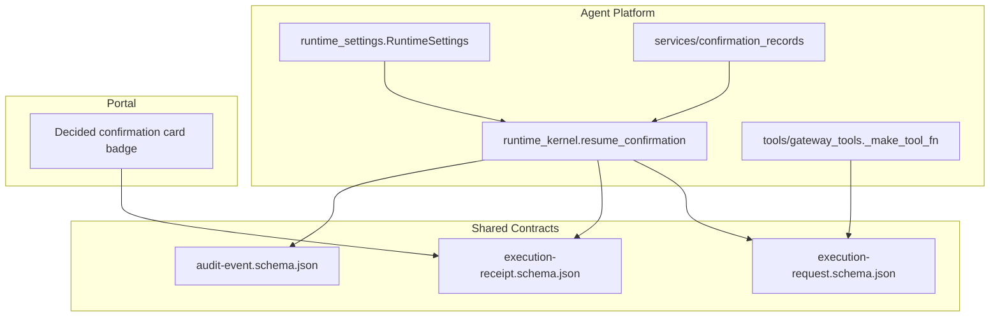
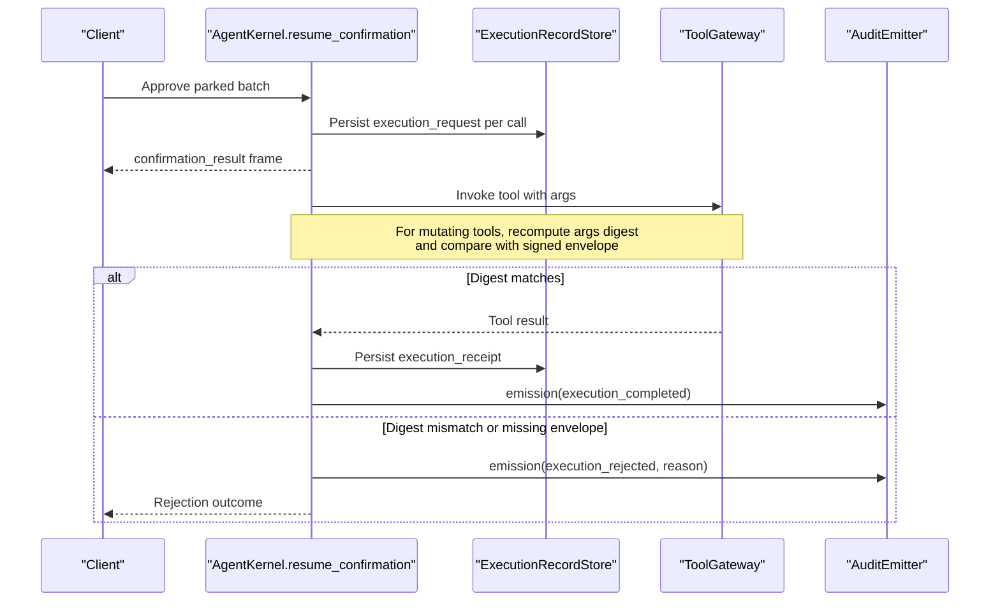
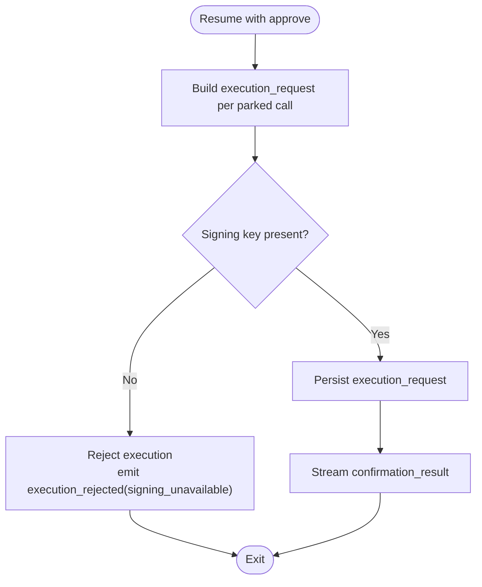
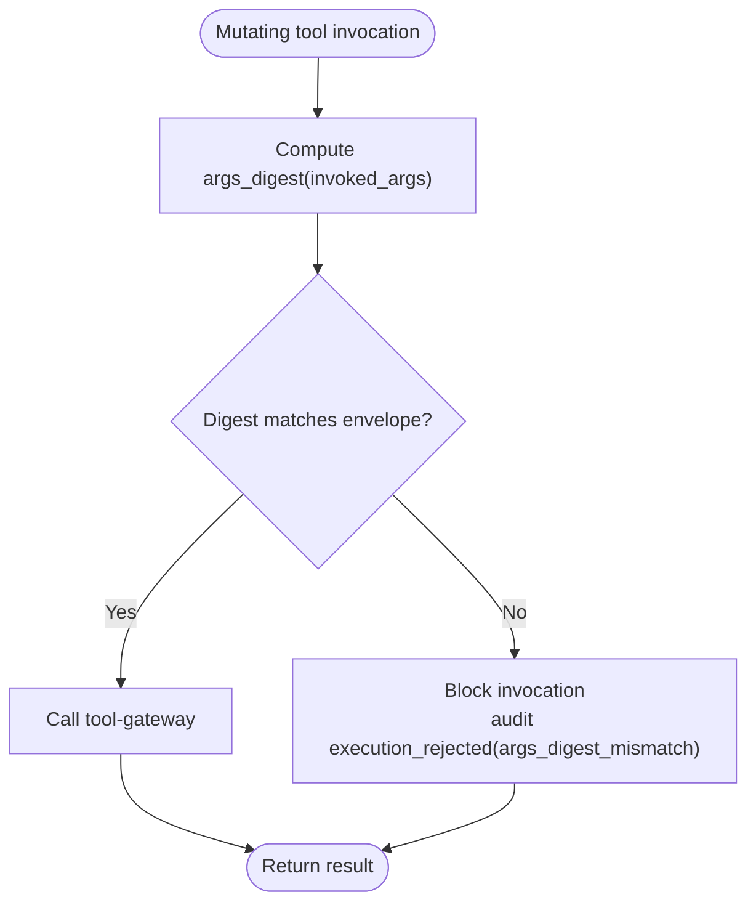
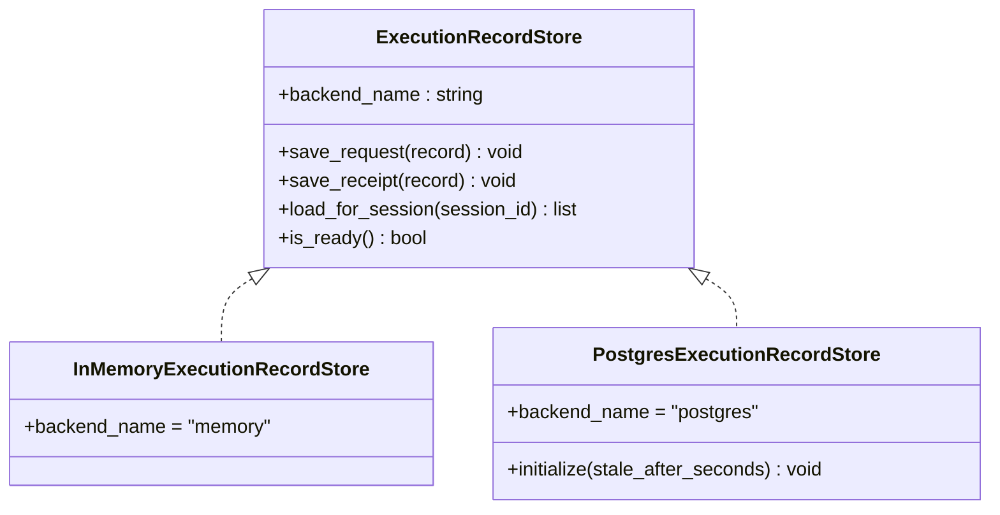
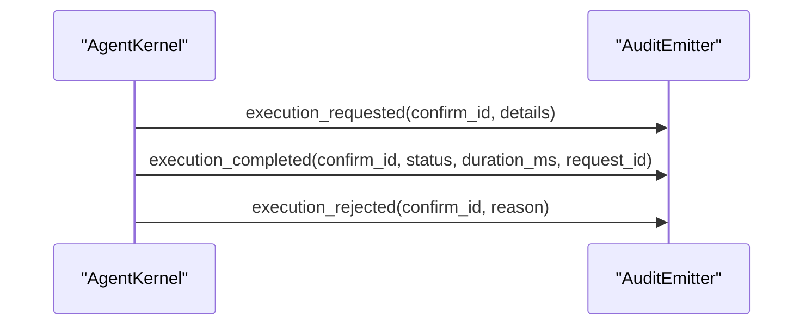
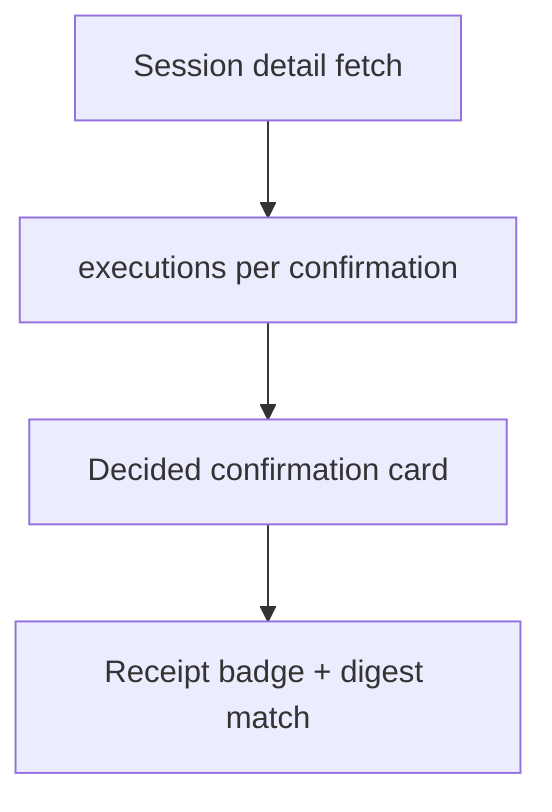
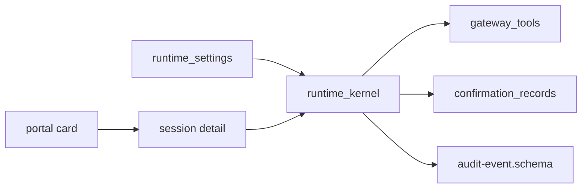

# SPEC-037: Signed Execution Requests and Receipts

<cite>
**Referenced Files in This Document**
- [spec.md](file://docs/specs/SPEC-037-signed-execution-requests/spec.md)
- [plan.md](file://docs/specs/SPEC-037-signed-execution-requests/plan.md)
- [tasks.md](file://docs/specs/SPEC-037-signed-execution-requests/tasks.md)
- [runtime_kernel.py](file://products/agent-platform/src/agent_service/runtime_kernel.py)
- [gateway_tools.py](file://products/agent-platform/src/agent_service/tools/gateway_tools.py)
- [runtime_settings.py](file://products/agent-platform/src/agent_service/runtime_settings.py)
- [confirmation_records.py](file://products/agent-platform/src/agent_service/services/confirmation_records.py)
- [audit-event.schema.json](file://shared/shared-contracts/schemas/audit-event.schema.json)
</cite>

## Table of Contents
1. [Introduction](#introduction)
2. [Project Structure](#project-structure)
3. [Core Components](#core-components)
4. [Architecture Overview](#architecture-overview)
5. [Detailed Component Analysis](#detailed-component-analysis)
6. [Dependency Analysis](#dependency-analysis)
7. [Performance Considerations](#performance-considerations)
8. [Troubleshooting Guide](#troubleshooting-guide)
9. [Conclusion](#conclusion)
10. [Appendices](#appendices)

## Introduction
This document specifies and documents the implementation design for SPEC-037: Signed Execution Requests and Receipts. It explains how approved, mutating tool calls are bound to tamper-evident execution requests and receipts, ensuring that executed arguments match what was approved. The spec defines contracts, runtime wiring, verification points, durable records, audit events, and portal visibility.

Key goals:
- Create a signed execution request per approved parked tool call at resume time.
- Verify argument digests at invocation boundaries before calling the tool-gateway.
- Persist durable execution records (requests and receipts) alongside confirmation records.
- Emit additive audit events correlating decisions with executions.
- Render receipt status on decided confirmation cards in the portal.

Non-goals include an isolated execution worker (Phase 2), async queues, retries, or changes to approval surfaces.

**Section sources**
- [spec.md:11-43](file://docs/specs/SPEC-037-signed-execution-requests/spec.md#L11-L43)
- [spec.md:164-198](file://docs/specs/SPEC-037-signed-execution-requests/spec.md#L164-L198)

## Project Structure
SPEC-037 spans three areas:
- Agent platform (agent-service): signing, verification, record store, resume path, session detail augmentation.
- Shared contracts: new schemas for execution request/receipt and additive audit event types.
- Operator portal: read-only receipt badge on decided confirmation cards.
- Deploy chain: secret sync script and environment wiring for agent-service.

**Diagram sources**
- [runtime_kernel.py:1096-1216](file://products/agent-platform/src/agent_service/runtime_kernel.py#L1096-L1216)
- [gateway_tools.py:127-162](file://products/agent-platform/src/agent_service/tools/gateway_tools.py#L127-L162)
- [runtime_settings.py:117-161](file://products/agent-platform/src/agent_service/runtime_settings.py#L117-L161)
- [confirmation_records.py:631-682](file://products/agent-platform/src/agent_service/services/confirmation_records.py#L631-L682)
- [audit-event.schema.json:25-41](file://shared/shared-contracts/schemas/audit-event.schema.json#L25-L41)

**Section sources**
- [plan.md:1-9](file://docs/specs/SPEC-037-signed-execution-requests/plan.md#L1-L9)
- [tasks.md:5-43](file://docs/specs/SPEC-037-signed-execution-requests/tasks.md#L5-L43)

## Core Components
- Execution request and receipt contracts (R-1): New JSON schemas define the envelope fields and signature semantics. Canonicalization is pinned to sorted keys and compact separators to ensure stable digests.
- Signing at resume (R-2): On approve, agent-service builds one signed execution request per parked tool call using HMAC-SHA256 over a canonical envelope derived from parked arguments, confirm id, decider, and session. A missing key fails closed and audits rejection.
- Argument-digest verification (R-3): At the gateway invocation boundary, invoked arguments’ digest is recomputed and compared against the signed envelope for mutating tools; mismatches block invocation and emit a rejection audit. Read-only tools skip checks.
- Durable execution records (R-4): Best-effort persistence of requests and receipts keyed by confirm_id + call_id, with TTL-scoped startup sweep and retention aligned to confirmation records. Session detail exposes an additive executions array per confirmation.
- Audit events (R-5): Additive event_type values extend the audit schema; requested/completed/rejected events carry confirm_id and forward x-request-id for correlation.
- Portal visibility (R-6): Decided confirmation cards render a read-only receipt badge and digest-match state; inbox remains unchanged.

**Section sources**
- [spec.md:45-163](file://docs/specs/SPEC-037-signed-execution-requests/spec.md#L45-L163)
- [plan.md:10-89](file://docs/specs/SPEC-037-signed-execution-requests/plan.md#L10-L89)
- [tasks.md:5-43](file://docs/specs/SPEC-037-signed-execution-requests/tasks.md#L5-L43)

## Architecture Overview
The flow spans decision, signing, invocation, and recording:

**Diagram sources**
- [runtime_kernel.py:1096-1216](file://products/agent-platform/src/agent_service/runtime_kernel.py#L1096-L1216)
- [gateway_tools.py:127-162](file://products/agent-platform/src/agent_service/tools/gateway_tools.py#L127-L162)
- [confirmation_records.py:631-682](file://products/agent-platform/src/agent_service/services/confirmation_records.py#L631-L682)
- [audit-event.schema.json:25-41](file://shared/shared-contracts/schemas/audit-event.schema.json#L25-L41)

## Detailed Component Analysis

### Resume Path: Signed Request Creation and Fail-Closed Posture
- Trigger: When a claimed confirmation resumes with approve, agent-service constructs one signed execution request per approved parked tool call before any invocation.
- Envelope: Includes execution_id, confirm_id, call_id, session_id, owner_user_id, decider_user_id, tool_name, args_digest (SHA-256 hex of canonical JSON of parked arguments), requested_at, and signature.
- Key management: The signing key is sourced from AGENT_EXECUTION_SIGNING_KEY via RuntimeSettings. If absent, mutating resumes fail closed: the resumed stream reports rejection and emits execution_rejected with reason signing_unavailable. Denials construct no request.
- State propagation: A context-local mapping of call_id to request is set for the duration of the resumed stream so invocation-time verification can access it.

**Diagram sources**
- [runtime_kernel.py:1096-1216](file://products/agent-platform/src/agent_service/runtime_kernel.py#L1096-L1216)
- [runtime_settings.py:117-161](file://products/agent-platform/src/agent_service/runtime_settings.py#L117-L161)

**Section sources**
- [spec.md:69-88](file://docs/specs/SPEC-037-signed-execution-requests/spec.md#L69-L88)
- [plan.md:21-38](file://docs/specs/SPEC-037-signed-execution-requests/plan.md#L21-L38)
- [tasks.md:11-16](file://docs/specs/SPEC-037-signed-execution-requests/tasks.md#L11-L16)

### Invocation Boundary: Argument-Digest Verification
- Scope: Only applies to mutating tools (is_read_only == False). Read-only tools never consult the envelope.
- Mechanism: Recompute the invoked arguments’ digest and compare against the signed envelope’s args_digest. Match proceeds; mismatch raises a structured error, audits execution_rejected with reason args_digest_mismatch, and blocks the gateway call. Absence of an envelope on a mutating call also rejects (fail closed).
- Integration: The verification occurs within the gateway tool closure built by _make_tool_fn, which wraps invoke_gateway_tool.

**Diagram sources**
- [gateway_tools.py:127-162](file://products/agent-platform/src/agent_service/tools/gateway_tools.py#L127-L162)

**Section sources**
- [spec.md:94-108](file://docs/specs/SPEC-037-signed-execution-requests/spec.md#L94-L108)
- [plan.md:40-49](file://docs/specs/SPEC-037-signed-execution-requests/plan.md#L40-L49)
- [tasks.md:18-21](file://docs/specs/SPEC-037-signed-execution-requests/tasks.md#L18-L21)

### Durable Execution Records and Retention
- Storage model: ExecutionRecordStore mirrors ConfirmationRecordStore posture with memory and Postgres backends, sharing backend selection knobs and DB URL. A dedicated table stores requests and receipts keyed by confirm_id + call_id.
- Write points: Requests persisted at resume; receipts written after tool results land in the resumed-stream handling. Writes are best-effort durable — failures degrade audit completeness but do not interrupt the chat stream.
- Retention: TTL-scoped startup sweep reuses the confirmation records’ sweep shape (30-day window).
- Session detail: An additive executions array appears under each confirmation entry in session detail, carrying request/receipt status and digest-match result.

**Diagram sources**
- [confirmation_records.py:84-119](file://products/agent-platform/src/agent_service/services/confirmation_records.py#L84-L119)
- [confirmation_records.py:631-682](file://products/agent-platform/src/agent_service/services/confirmation_records.py#L631-L682)

**Section sources**
- [spec.md:110-128](file://docs/specs/SPEC-037-signed-execution-requests/spec.md#L110-L128)
- [plan.md:51-69](file://docs/specs/SPEC-037-signed-execution-requests/plan.md#L51-L69)
- [tasks.md:23-27](file://docs/specs/SPEC-037-signed-execution-requests/tasks.md#L23-L27)

### Audit Events and Correlation
- Schema extension: Three additive event_type values extend audit-event.schema.json: execution_requested, execution_completed, execution_rejected. Details describe payloads for each.
- Emission points:
  - execution_requested when the request is persisted at resume.
  - execution_completed when the receipt is written (status, duration_ms, request_id).
  - execution_rejected on any rejection path (reason).
- Correlation: All events carry confirm_id and forward x-request-id to correlate confirmation_decided → execution_requested → tool_invoked → execution_completed.

**Diagram sources**
- [audit-event.schema.json:25-41](file://shared/shared-contracts/schemas/audit-event.schema.json#L25-L41)
- [audit-event.schema.json:77-81](file://shared/shared-contracts/schemas/audit-event.schema.json#L77-L81)

**Section sources**
- [spec.md:130-146](file://docs/specs/SPEC-037-signed-execution-requests/spec.md#L130-L146)
- [plan.md:71-80](file://docs/specs/SPEC-037-signed-execution-requests/plan.md#L71-L80)
- [tasks.md:29-32](file://docs/specs/SPEC-037-signed-execution-requests/tasks.md#L29-L32)

### Portal Visibility: Receipt Badge on Decided Cards
- Surface: Decided confirmation cards in the owner transcript show a read-only receipt badge (succeeded / failed / timeout) and digest-match state.
- Data source: Session-detail executions entries ride existing session-detail fetch; transcript seeding maps them onto decided cards.
- Inbox: Unchanged — approver surface stays metadata-only.

**Diagram sources**
- [plan.md:82-89](file://docs/specs/SPEC-037-signed-execution-requests/plan.md#L82-L89)

**Section sources**
- [spec.md:148-162](file://docs/specs/SPEC-037-signed-execution-requests/spec.md#L148-L162)
- [plan.md:82-89](file://docs/specs/SPEC-037-signed-execution-requests/plan.md#L82-L89)
- [tasks.md:34-37](file://docs/specs/SPEC-037-signed-execution-requests/tasks.md#L34-L37)

## Dependency Analysis
- Agent kernel depends on:
  - Runtime settings for signing key presence.
  - Confirmation records store posture for lifecycle and retention patterns.
  - Gateway tools for invocation boundary enforcement.
- Contracts depend on shared schema validation and canonicalization stability.
- Portal depends on session-detail augmentations for executions arrays.

**Diagram sources**
- [runtime_settings.py:117-161](file://products/agent-platform/src/agent_service/runtime_settings.py#L117-L161)
- [runtime_kernel.py:1096-1216](file://products/agent-platform/src/agent_service/runtime_kernel.py#L1096-L1216)
- [gateway_tools.py:127-162](file://products/agent-platform/src/agent_service/tools/gateway_tools.py#L127-L162)
- [confirmation_records.py:631-682](file://products/agent-platform/src/agent_service/services/confirmation_records.py#L631-L682)
- [audit-event.schema.json:25-41](file://shared/shared-contracts/schemas/audit-event.schema.json#L25-L41)

**Section sources**
- [plan.md:100-109](file://docs/specs/SPEC-037-signed-execution-requests/plan.md#L100-L109)

## Performance Considerations
- Signing and verification use HMAC-SHA256 over compact canonical JSON; overhead is minimal relative to network/tool latency.
- Best-effort writes to execution records avoid blocking the streaming path; transient failures degrade audit completeness only.
- Startup sweeps reuse the proven pattern from confirmation records to reclaim old rows without impacting live operations.
- Read-only invocations bypass all signing logic, preserving performance for diagnostic flows.

[No sources needed since this section provides general guidance]

## Troubleshooting Guide
Common issues and diagnostics:
- Missing signing key: Mutating resumes reject immediately; check AGENT_EXECUTION_SIGNING_KEY provisioning and audit logs for execution_rejected(signing_unavailable).
- Argument digest mismatch: Invocations blocked; verify parked arguments were not mutated between park and resume; look for execution_rejected(args_digest_mismatch).
- Store failures: Execution records may be incomplete; service continues; inspect backend readiness and logs around execution record writes.
- Portal badge not visible: Ensure session detail includes executions for decided confirmations; legacy rows without execution records render unchanged.

**Section sources**
- [spec.md:69-108](file://docs/specs/SPEC-037-signed-execution-requests/spec.md#L69-L108)
- [plan.md:51-80](file://docs/specs/SPEC-037-signed-execution-requests/plan.md#L51-L80)

## Conclusion
SPEC-037 tightens the approval-to-execution binding with tamper-evident signatures and durable receipts while keeping execution in-process. It introduces additive contracts, fail-closed behavior on missing keys, robust verification at invocation, best-effort durability, correlated audit events, and clear portal visibility. Phase 2 will isolate execution workers; this slice ensures the contract is proven and auditable today.

[No sources needed since this section summarizes without analyzing specific files]

## Appendices

### Contract Summary
- Execution request fields: execution_id, confirm_id, call_id, session_id, owner_user_id, decider_user_id, tool_name, args_digest, requested_at, signature.
- Execution receipt fields: execution_id, status (succeeded/failed/timeout), outcome_digest, request_id, completed_at, signature.
- Audit event extensions: execution_requested, execution_completed, execution_rejected with details describing payloads.

**Section sources**
- [spec.md:50-60](file://docs/specs/SPEC-037-signed-execution-requests/spec.md#L50-L60)
- [audit-event.schema.json:25-41](file://shared/shared-contracts/schemas/audit-event.schema.json#L25-L41)
- [audit-event.schema.json:77-81](file://shared/shared-contracts/schemas/audit-event.schema.json#L77-L81)

### Implementation Checklist Alignment
- R-1: Schemas and canonicalization helpers.
- R-2: Signing at resume, fail-closed on missing key.
- R-3: Argument-digest verification at invocation.
- R-4: Durable execution records and session detail augmentation.
- R-5: Execution audit events.
- R-6: Receipt visibility on decided cards.

**Section sources**
- [tasks.md:5-43](file://docs/specs/SPEC-037-signed-execution-requests/tasks.md#L5-L43)