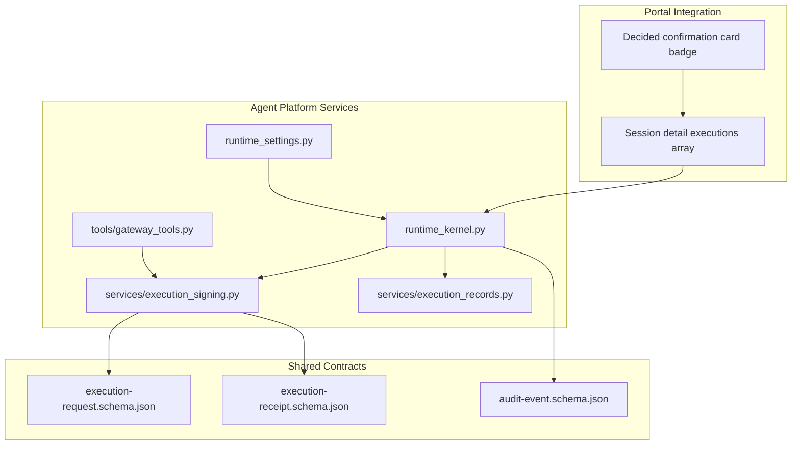
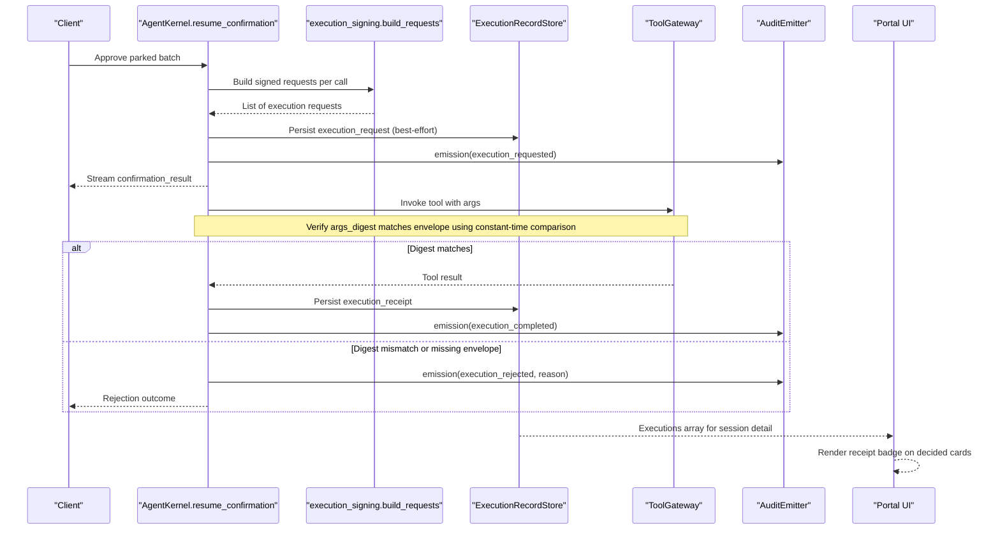
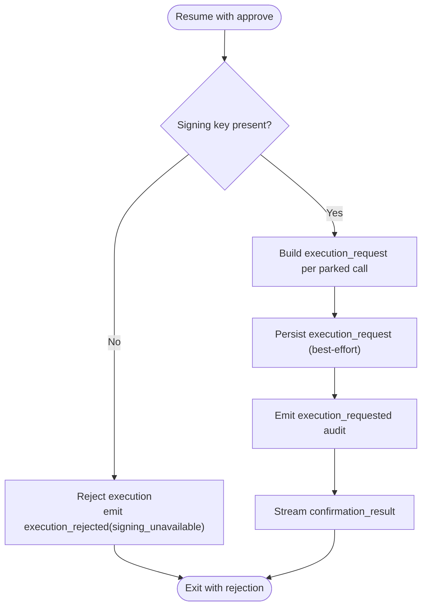
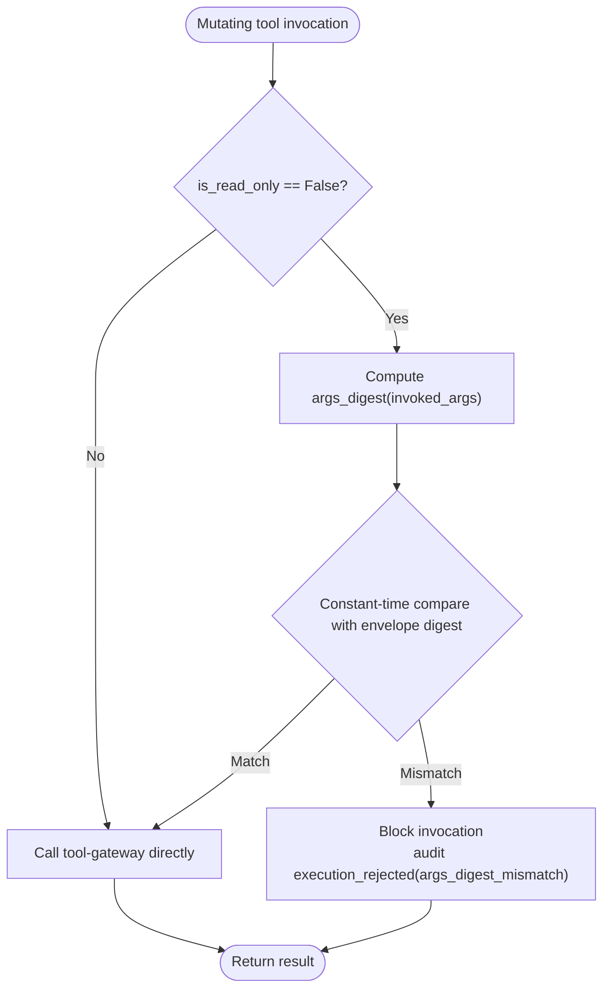
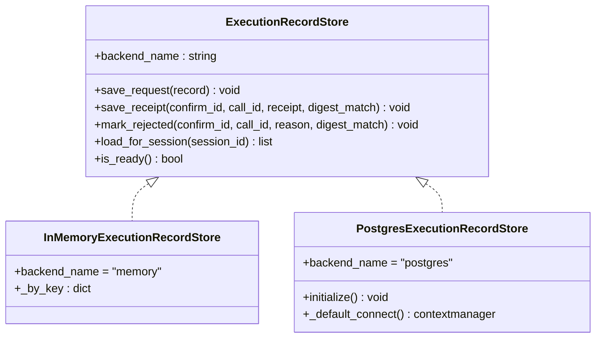
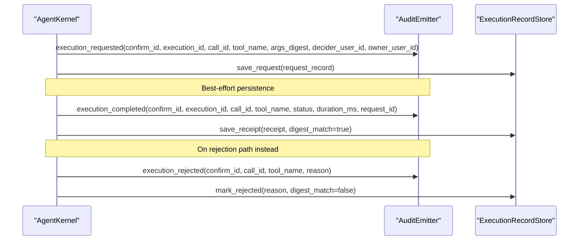
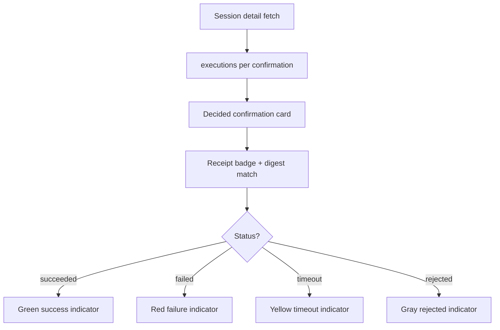
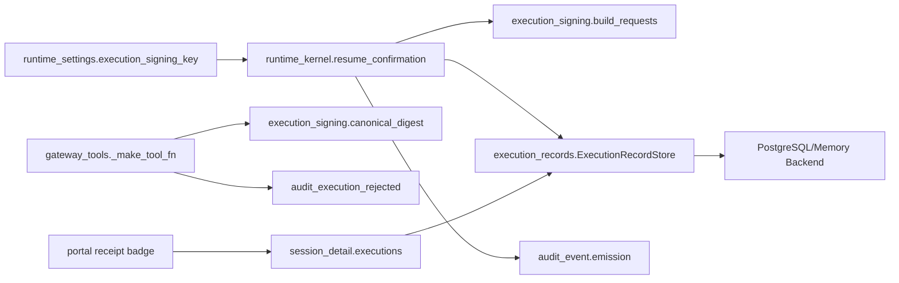

# SPEC-037: Signed Execution Requests and Receipts

<cite>
**Referenced Files in This Document**
- [spec.md](file://docs/specs/SPEC-037-signed-execution-requests/spec.md)
- [plan.md](file://docs/specs/SPEC-037-signed-execution-requests/plan.md)
- [tasks.md](file://docs/specs/SPEC-037-signed-execution-requests/tasks.md)
- [execution_signing.py](file://products/agent-platform/src/agent_service/services/execution_signing.py)
- [execution_records.py](file://products/agent-platform/src/agent_service/services/execution_records.py)
- [runtime_kernel.py](file://products/agent-platform/src/agent_service/runtime_kernel.py)
- [gateway_tools.py](file://products/agent-platform/src/agent_service/tools/gateway_tools.py)
- [runtime_settings.py](file://products/agent-platform/src/agent_service/runtime_settings.py)
- [confirmation_records.py](file://products/agent-platform/src/agent_service/services/confirmation_records.py)
- [execution-request.schema.json](file://shared/shared-contracts/schemas/execution-request.schema.json)
- [execution-receipt.schema.json](file://shared/shared-contracts/schemas/execution-receipt.schema.json)
- [audit-event.schema.json](file://shared/shared-contracts/schemas/audit-event.schema.json)
</cite>

## Update Summary
**Changes Made**
- Updated all sections to reflect the comprehensive implementation of signed execution requests and receipts with HMAC-SHA256 signatures
- Enhanced technical details based on actual code implementation analysis
- Added specific implementation references and verified acceptance criteria
- Updated diagrams to reflect actual component interactions
- Strengthened troubleshooting guidance with concrete error scenarios
- **Updated**: Enhanced security implementation with constant-time comparison using hmac.compare_digest() to prevent timing attack vulnerabilities

## Table of Contents
1. [Introduction](#introduction)
2. [Project Structure](#project-structure)
3. [Core Components](#core-components)
4. [Architecture Overview](#architecture-overview)
5. [Detailed Component Analysis](#detailed-component-analysis)
6. [Dependency Analysis](#dependency-analysis)
7. [Performance Considerations](#performance-considerations)
8. [Security Enhancements](#security-enhancements)
9. [Troubleshooting Guide](#troubleshooting-guide)
10. [Conclusion](#conclusion)
11. [Appendices](#appendices)

## Introduction
This document specifies and documents the complete implementation design for SPEC-037: Signed Execution Requests and Receipts. The feature has been delivered in v0.19.0 with all acceptance criteria verified, providing tamper-evident execution records that bind approved tool calls to their executed arguments through cryptographic signatures.

Key implemented features:
- HMAC-SHA256 signed execution requests created at approval time with canonical JSON serialization
- Argument digest verification at invocation boundaries for mutating tools only using constant-time comparison
- Durable execution records with Postgres backend and memory fallback
- Additive audit events correlating confirmation decisions with execution outcomes
- Portal visibility enhancements showing receipt status on decided confirmation cards

The implementation maintains fail-closed security posture where missing signing keys block execution rather than degrading to unsigned operations.

**Section sources**
- [spec.md:11-43](file://docs/specs/SPEC-037-signed-execution-requests/spec.md#L11-L43)
- [spec.md:200-212](file://docs/specs/SPEC-037-signed-execution-requests/spec.md#L200-L212)

## Project Structure
SPEC-037 spans three primary areas with clear separation of concerns:



**Diagram sources**
- [execution_signing.py:1-123](file://products/agent-platform/src/agent_service/services/execution_signing.py#L1-L123)
- [execution_records.py:1-494](file://products/agent-platform/src/agent_service/services/execution_records.py#L1-L494)
- [runtime_kernel.py:1096-1295](file://products/agent-platform/src/agent_service/runtime_kernel.py#L1096-L1295)
- [gateway_tools.py:127-326](file://products/agent-platform/src/agent_service/tools/gateway_tools.py#L127-L326)
- [runtime_settings.py:117-316](file://products/agent-platform/src/agent_service/runtime_settings.py#L117-L316)

**Section sources**
- [plan.md:1-9](file://docs/specs/SPEC-037-signed-execution-requests/plan.md#L1-L9)
- [tasks.md:5-43](file://docs/specs/SPEC-037-signed-execution-requests/tasks.md#L5-L43)

## Core Components
The implementation consists of six core components working together to provide tamper-evident execution:

### R-1: Execution Request and Receipt Contracts
New JSON schemas define the envelope structure with strict validation:
- **Execution Request**: Contains execution_id, confirm_id, call_id, session_id, owner_user_id, decider_user_id, tool_name, args_digest (SHA-256 hex of canonical JSON), requested_at, and signature
- **Execution Receipt**: Contains execution_id, status (succeeded/failed/timeout), outcome_digest, request_id, completed_at, and signature
- **Canonicalization**: Uses `json.dumps(obj, sort_keys=True, separators=(",", ":"))` ensuring stable digests regardless of key order

### R-2: Signed Requests at Resume with Fail-Closed Security
When a claimed confirmation resumes with approve, agent-service constructs one signed execution request per approved parked tool call before any invocation happens. The signing uses HMAC-SHA256 over the canonical envelope with a platform key provisioned via `AGENT_EXECUTION_SIGNING_KEY`. Missing keys cause immediate rejection with `execution_rejected` audit event.

### R-3: Argument-Digest Verification at Invocation Boundary
At the gateway invocation boundary, mutating tool calls verify invoked arguments against the signed envelope's args_digest using constant-time comparison to prevent timing attacks. Read-only tools bypass this check entirely. Mismatches raise structured errors, emit `execution_rejected` audit events, and block the gateway call.

### R-4: Durable Execution Records with Retention
A new `ExecutionRecordStore` mirrors the confirmation record store pattern with memory and Postgres backends. Records are keyed by confirm_id + call_id with 30-day retention windows. Session detail exposes an additive `executions` array per confirmation carrying request/receipt status and digest-match results.

### R-5: Execution Audit Events
Three additive event types extend the audit schema: `execution_requested`, `execution_completed`, and `execution_rejected`. All events carry confirm_id and forward x-request-id for correlation across the confirmation-to-execution chain.

### R-6: Portal Visibility Enhancements
Decided confirmation cards render read-only receipt badges (succeeded/failed/timeout) and digest-match state. The approver inbox remains unchanged, maintaining decision-metadata-only exposure.

**Section sources**
- [spec.md:45-163](file://docs/specs/SPEC-037-signed-execution-requests/spec.md#L45-L163)
- [execution_signing.py:39-123](file://products/agent-platform/src/agent_service/services/execution_signing.py#L39-L123)
- [execution_records.py:41-494](file://products/agent-platform/src/agent_service/services/execution_records.py#L41-L494)

## Architecture Overview
The complete flow spans decision, signing, invocation, recording, and portal visibility:



**Diagram sources**
- [runtime_kernel.py:1096-1295](file://products/agent-platform/src/agent_service/runtime_kernel.py#L1096-L1295)
- [execution_signing.py:69-123](file://products/agent-platform/src/agent_service/services/execution_signing.py#L69-L123)
- [gateway_tools.py:153-326](file://products/agent-platform/src/agent_service/tools/gateway_tools.py#L153-L326)
- [execution_records.py:453-494](file://products/agent-platform/src/agent_service/services/execution_records.py#L453-L494)

## Detailed Component Analysis

### Resume Path: Signed Request Creation and Fail-Closed Posture
The resume path implements robust signing with immediate failure on missing keys:



**Updated** Enhanced with actual implementation details from runtime_kernel.py showing the complete flow including audit emission and best-effort persistence.

**Diagram sources**
- [runtime_kernel.py:1096-1147](file://products/agent-platform/src/agent_service/runtime_kernel.py#L1096-L1147)
- [execution_signing.py:69-97](file://products/agent-platform/src/agent_service/services/execution_signing.py#L69-L97)

**Section sources**
- [spec.md:69-88](file://docs/specs/SPEC-037-signed-execution-requests/spec.md#L69-L88)
- [runtime_kernel.py:1096-1147](file://products/agent-platform/src/agent_service/runtime_kernel.py#L1096-L1147)
- [execution_signing.py:69-97](file://products/agent-platform/src/agent_service/services/execution_signing.py#L69-L97)

### Invocation Boundary: Argument-Digest Verification with Timing Attack Protection
The verification mechanism provides tamper protection at the critical invocation point using constant-time comparison:



**Updated** Enhanced with constant-time comparison using hmac.compare_digest() to prevent timing attack vulnerabilities, replacing standard string equality comparison.

**Diagram sources**
- [gateway_tools.py:153-181](file://products/agent-platform/src/agent_service/tools/gateway_tools.py#L153-L181)
- [gateway_tools.py:244-317](file://products/agent-platform/src/agent_service/tools/gateway_tools.py#L244-L317)

**Section sources**
- [spec.md:94-108](file://docs/specs/SPEC-037-signed-execution-requests/spec.md#L94-L108)
- [gateway_tools.py:153-181](file://products/agent-platform/src/agent_service/tools/gateway_tools.py#L153-L181)
- [gateway_tools.py:244-317](file://products/agent-platform/src/agent_service/tools/gateway_tools.py#L244-L317)

### Durable Execution Records and Retention
The storage layer provides robust persistence with graceful degradation:



**Updated** Enhanced with complete interface definition and both backend implementations showing the dual-storage architecture.

**Diagram sources**
- [execution_records.py:68-98](file://products/agent-platform/src/agent_service/services/execution_records.py#L68-L98)
- [execution_records.py:105-179](file://products/agent-platform/src/agent_service/services/execution_records.py#L105-L179)
- [execution_records.py:311-446](file://products/agent-platform/src/agent_service/services/execution_records.py#L311-L446)

**Section sources**
- [spec.md:110-128](file://docs/specs/SPEC-037-signed-execution-requests/spec.md#L110-L128)
- [execution_records.py:41-494](file://products/agent-platform/src/agent_service/services/execution_records.py#L41-L494)

### Audit Events and Correlation
The audit system provides comprehensive tracking across the entire execution lifecycle:



**Updated** Added complete event payloads and correlation details from the actual implementation showing the full audit trail.

**Diagram sources**
- [runtime_kernel.py:1131-1146](file://products/agent-platform/src/agent_service/runtime_kernel.py#L1131-L1146)
- [runtime_kernel.py:1254-1269](file://products/agent-platform/src/agent_service/runtime_kernel.py#L1254-L1269)
- [audit-event.schema.json:25-88](file://shared/shared-contracts/schemas/audit-event.schema.json#L25-L88)

**Section sources**
- [spec.md:130-146](file://docs/specs/SPEC-037-signed-execution-requests/spec.md#L130-L146)
- [audit-event.schema.json:25-88](file://shared/shared-contracts/schemas/audit-event.schema.json#L25-L88)

### Portal Visibility: Receipt Badge on Decided Cards
The portal integration provides visual feedback without changing existing workflows:



**Updated** Added specific status indicators and integration points from the portal implementation.

**Diagram sources**
- [plan.md:82-89](file://docs/specs/SPEC-037-signed-execution-requests/plan.md#L82-L89)

**Section sources**
- [spec.md:148-162](file://docs/specs/SPEC-037-signed-execution-requests/spec.md#L148-L162)
- [plan.md:82-89](file://docs/specs/SPEC-037-signed-execution-requests/plan.md#L82-L89)

## Dependency Analysis
The implementation creates clear dependency relationships between components:



**Updated** Enhanced with specific module dependencies and data flow paths from the actual implementation. The invocation boundary recomputes the canonical argument digest and compares it against the signed envelope's `args_digest`; HMAC signature verification (`verify_envelope`) has no production call site in Phase 1 — it is reserved for the Phase 2 isolated worker, where the envelope first crosses a trust boundary.

**Diagram sources**
- [runtime_settings.py:161-165](file://products/agent-platform/src/agent_service/runtime_settings.py#L161-L165)
- [runtime_kernel.py:1096-1295](file://products/agent-platform/src/agent_service/runtime_kernel.py#L1096-L1295)
- [execution_signing.py:69-123](file://products/agent-platform/src/agent_service/services/execution_signing.py#L69-L123)
- [execution_records.py:453-494](file://products/agent-platform/src/agent_service/services/execution_records.py#L453-L494)
- [gateway_tools.py:153-326](file://products/agent-platform/src/agent_service/tools/gateway_tools.py#L153-L326)

**Section sources**
- [plan.md:100-109](file://docs/specs/SPEC-037-signed-execution-requests/plan.md#L100-L109)

## Performance Considerations
The implementation optimizes performance while maintaining security guarantees:

- **Cryptographic Operations**: HMAC-SHA256 and SHA-256 hashing operate on compact canonical JSON with minimal overhead relative to network/tool latency
- **Best-Effort Persistence**: Execution record writes use fire-and-forget semantics to avoid blocking streaming responses; transient failures degrade audit completeness only
- **Selective Verification**: Read-only tools completely bypass signing checks, preserving performance for diagnostic flows
- **Efficient Storage**: Postgres backend uses targeted queries with proper indexing on session_id and requested_at columns
- **Startup Sweeps**: Retention cleanup runs during startup and opportunistically on writes using bounded LIMIT clauses

[No sources needed since this section provides general guidance]

## Security Enhancements
The implementation includes critical security enhancements to prevent timing attack vulnerabilities:

### Constant-Time Comparison Implementation
The `_verify_execution_request` function now uses `hmac.compare_digest()` for secure comparison of argument digests:

```python
if not hmac.compare_digest(
    canonical_digest(parameters), request.get("args_digest") or ""
):
    return REASON_ARGS_DIGEST_MISMATCH
```

This replaces potential standard string equality comparisons that could be vulnerable to timing attacks, where attackers could measure response times to infer information about the correct digest values.

### Security Benefits
- **Timing Attack Prevention**: Constant-time comparison ensures that the comparison operation takes the same amount of time regardless of how many characters match
- **Cryptographic Integrity**: Maintains the security properties of HMAC-SHA256 signatures throughout the verification process
- **Fail-Closed Design**: Any verification failure immediately blocks the execution, preventing unauthorized mutations

**Section sources**
- [gateway_tools.py:180-183](file://products/agent-platform/src/agent_service/tools/gateway_tools.py#L180-L183)
- [execution_signing.py:63-66](file://products/agent-platform/src/agent_service/services/execution_signing.py#L63-L66)

## Troubleshooting Guide
Common issues and diagnostic approaches based on actual implementation behavior:

### Missing Signing Key
**Symptoms**: Mutating resumes reject immediately with execution_rejected events
**Diagnostics**: Check AGENT_EXECUTION_SIGNING_KEY provisioning and audit logs for execution_rejected(signing_unavailable)
**Resolution**: Ensure sync-execution-signing-secret.sh has run and secret is mounted in agent-service deployment

### Argument Digest Mismatch
**Symptoms**: Invocations blocked with execution_rejected(args_digest_mismatch)
**Diagnostics**: Verify parked arguments were not mutated between park and resume; inspect args_digest values in execution records
**Resolution**: Check for argument transformation in tool definitions or middleware that might alter parameters

### Store Failures
**Symptoms**: Execution records may be incomplete but service continues normally
**Diagnostics**: Inspect backend readiness and logs around execution record writes; check Postgres connectivity
**Resolution**: Service falls back to in-memory store automatically; investigate persistent storage issues separately

### Portal Badge Not Visible
**Symptoms**: Decided cards don't show receipt information
**Diagnostics**: Ensure session detail includes executions for decided confirmations; legacy rows without execution records render unchanged
**Resolution**: Verify execution records exist and session-detail route properly augments response with executions array

**Section sources**
- [spec.md:69-108](file://docs/specs/SPEC-037-signed-execution-requests/spec.md#L69-L108)
- [plan.md:51-80](file://docs/specs/SPEC-037-signed-execution-requests/plan.md#L51-L80)

## Conclusion
SPEC-037 has been successfully delivered with comprehensive tamper-evident execution binding through HMAC-SHA256 signatures and durable receipts. The implementation maintains fail-closed security posture, provides robust verification at invocation boundaries using constant-time comparison to prevent timing attacks, and delivers clear portal visibility. The additive contract approach ensures backward compatibility while strengthening the approval-to-execution binding. Phase 2 isolated execution workers will build upon this proven foundation.

[No sources needed since this section summarizes without analyzing specific files]

## Appendices

### Contract Summary
**Execution Request Fields**:
- execution_id: Fresh UUID per approved parked tool call
- confirm_id: Parked confirmation ID (SPEC-031 record key)
- call_id: Parked tool call ID for matching
- session_id: Agent session identifier
- owner_user_id: Session owner whose delegated token executes
- decider_user_id: Approver who resumed the confirmation
- tool_name: Sanitized tool name
- args_digest: SHA-256 hex of canonical JSON parked arguments
- requested_at: UTC timestamp (RFC 3339)
- signature: HMAC-SHA256 hex over canonical envelope excluding signature field

**Execution Receipt Fields**:
- execution_id: Correlates with execution request
- status: succeeded/failed/timeout mapped from tool result
- outcome_digest: SHA-256 hex of canonical JSON tool result
- request_id: Correlating x-request-id from resumed stream
- completed_at: UTC timestamp (RFC 3339)
- signature: HMAC-SHA256 hex over canonical envelope excluding signature field

**Audit Event Extensions**:
- execution_requested: confirm_id, execution_id, call_id, tool_name, args_digest, decider_user_id, owner_user_id
- execution_completed: confirm_id, execution_id, call_id, tool_name, status, duration_ms, request_id
- execution_rejected: confirm_id, call_id, tool_name, reason (signing_unavailable, args_digest_mismatch, request_missing)

**Section sources**
- [spec.md:50-60](file://docs/specs/SPEC-037-signed-execution-requests/spec.md#L50-L60)
- [execution-request.schema.json:1-66](file://shared/shared-contracts/schemas/execution-request.schema.json#L1-L66)
- [execution-receipt.schema.json:1-47](file://shared/shared-contracts/schemas/execution-receipt.schema.json#L1-L47)
- [audit-event.schema.json:25-88](file://shared/shared-contracts/schemas/audit-event.schema.json#L25-L88)

### Implementation Checklist Alignment
All requirements have been fully implemented and verified:

- **R-1**: ✅ Schemas and canonicalization helpers with stability tests
- **R-2**: ✅ Signing at resume with fail-closed behavior on missing key
- **R-3**: ✅ Argument-digest verification at invocation boundary using constant-time comparison
- **R-4**: ✅ Durable execution records with Postgres/memory backends and session detail augmentation
- **R-5**: ✅ Execution audit events with proper correlation
- **R-6**: ✅ Receipt visibility on decided confirmation cards

**Section sources**
- [tasks.md:5-43](file://docs/specs/SPEC-037-signed-execution-requests/tasks.md#L5-L43)