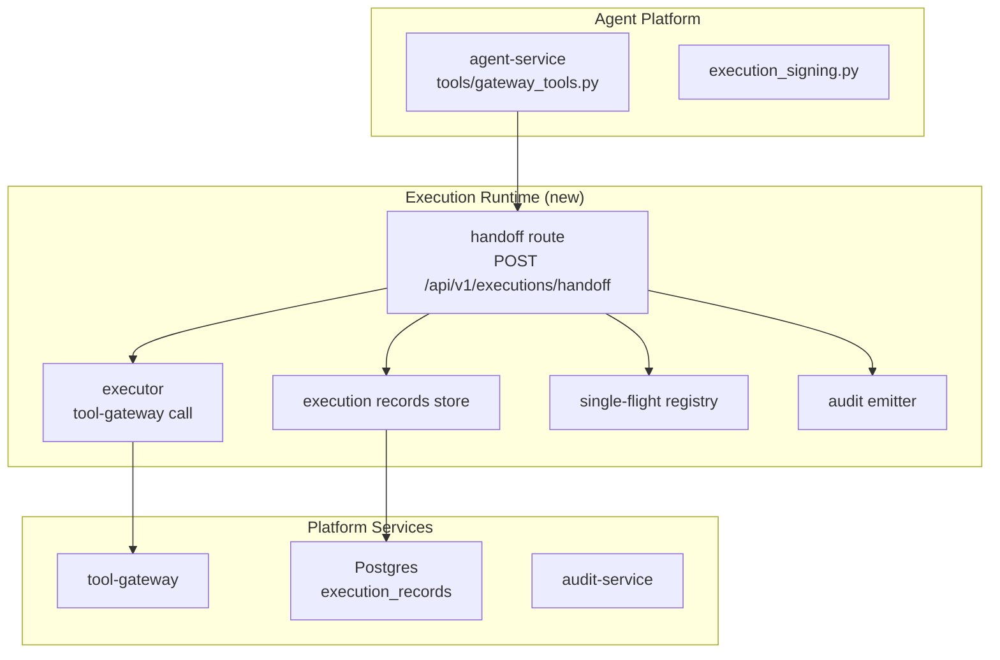
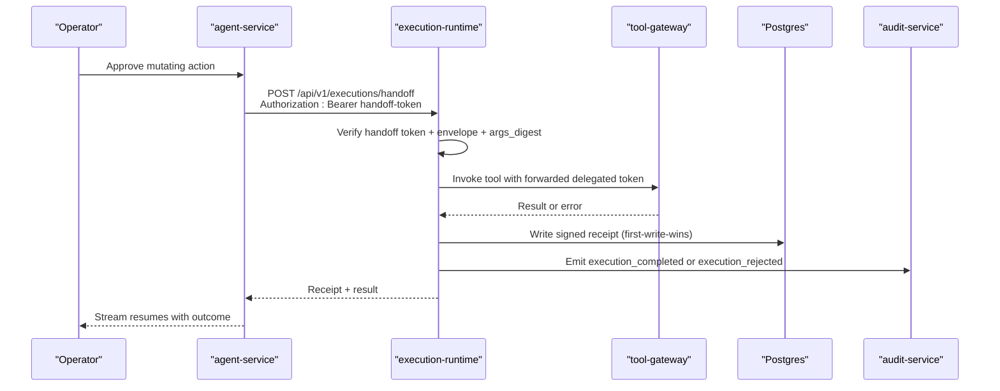
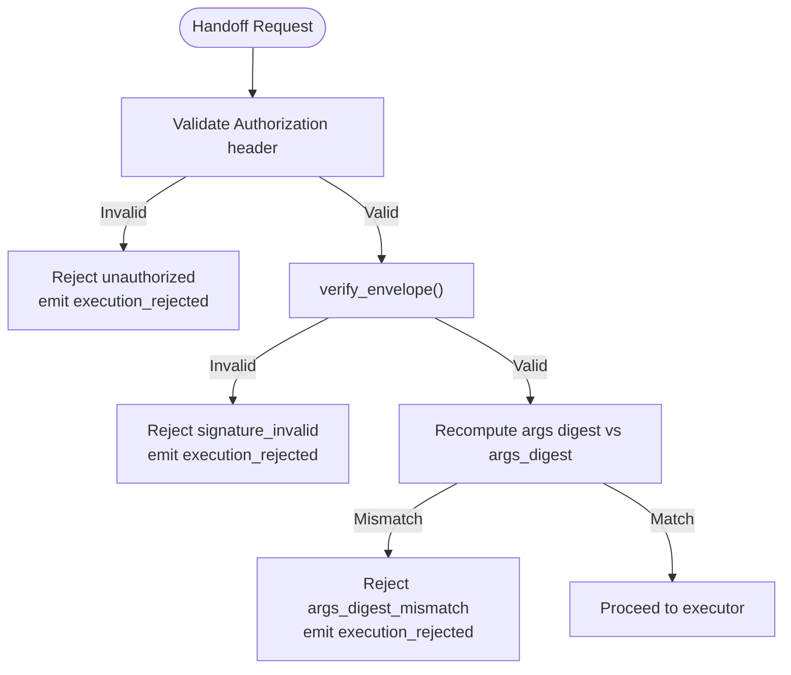
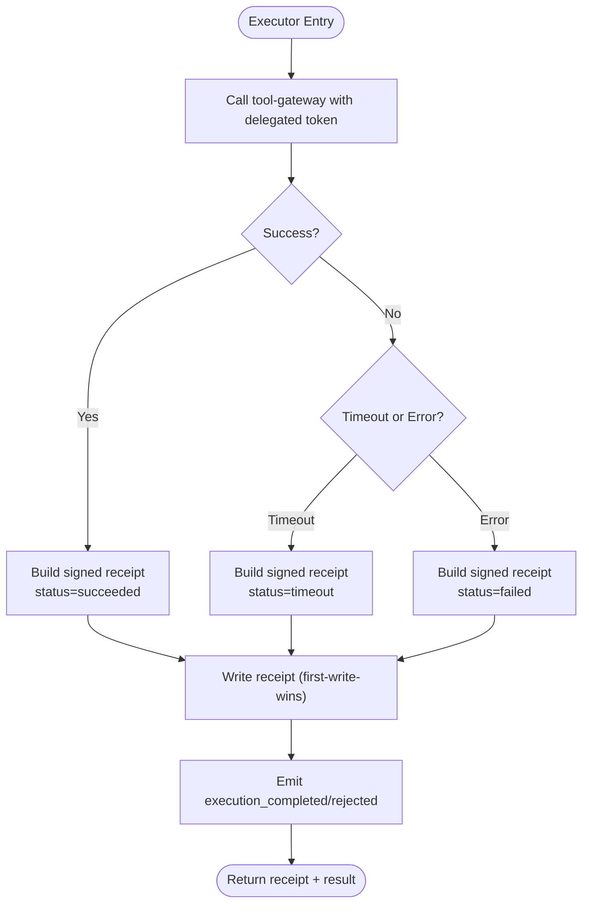
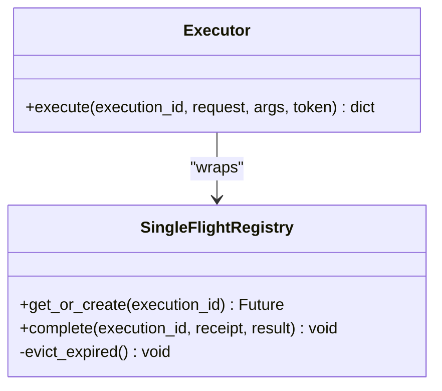
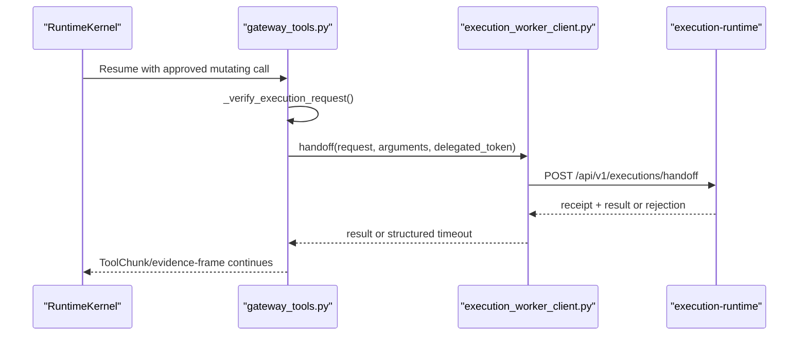
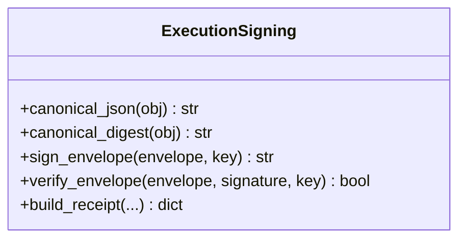
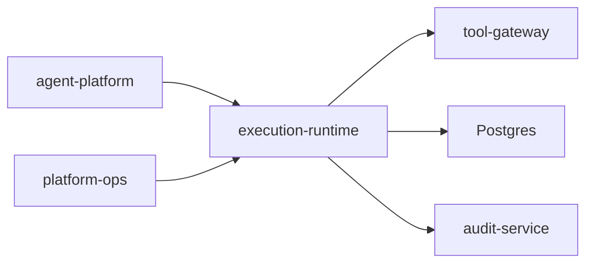

# SPEC-038: Isolated Execution Worker Specification

<cite>
**Referenced Files in This Document**
- [spec.md](file://docs/specs/SPEC-038-isolated-execution-worker/spec.md)
- [plan.md](file://docs/specs/SPEC-038-isolated-execution-worker/plan.md)
- [tasks.md](file://docs/specs/SPEC-038-isolated-execution-worker/tasks.md)
- [execution-runtime-spike.md](file://docs/workspace/execution-runtime-spike.md)
- [README.md](file://products/execution-runtime/README.md)
- [execution_signing.py](file://products/agent-platform/src/agent_service/services/execution_signing.py)
- [gateway_tools.py](file://products/agent-platform/src/agent_service/tools/gateway_tools.py)
- [test_gateway_tools.py](file://products/agent-platform/tests/test_gateway_tools.py)
</cite>

## Table of Contents
1. [Introduction](#introduction)
2. [Project Structure](#project-structure)
3. [Core Components](#core-components)
4. [Architecture Overview](#architecture-overview)
5. [Detailed Component Analysis](#detailed-component-analysis)
6. [Dependency Analysis](#dependency-analysis)
7. [Performance Considerations](#performance-considerations)
8. [Troubleshooting Guide](#troubleshooting-guide)
9. [Conclusion](#conclusion)
10. [Appendices](#appendices)

## Introduction
This document specifies the isolated execution worker for the platform, known as SPEC-038. It moves approved mutating actions out of the agent-service process into a dedicated, infrastructure-isolated worker that verifies signed execution envelopes, executes tool calls via the tool-gateway under the confirmer’s delegated identity, and authorizes receipts. The design preserves operator experience by blocking the resumed stream on a bounded timeout so results appear in the same turn.

Key goals:
- Enforce isolation boundaries at deployment time (own service, ClusterIP-only, no portal exposure).
- Require fail-closed verification of handoff credentials and signed envelopes before any execution.
- Guarantee single-flight idempotency per execution_id to prevent accidental re-execution.
- Keep read-only flows unchanged and avoid changes to approval tiers or policy semantics.

**Section sources**
- [spec.md:11-51](file://docs/specs/SPEC-038-isolated-execution-worker/spec.md#L11-L51)
- [execution-runtime-spike.md:22-54](file://docs/workspace/execution-runtime-spike.md#L22-L54)

## Project Structure
SPEC-038 introduces a new product, execution-runtime, alongside targeted changes in agent-platform and platform operations. The spec defines requirements R-1 through R-6; the plan maps each requirement to concrete modules, routes, settings, and manifests. Tasks break delivery into small, verifiable steps with acceptance signals tied to the spec.

**Diagram sources**
- [plan.md:41-93](file://docs/specs/SPEC-038-isolated-execution-worker/plan.md#L41-L93)
- [spec.md:58-236](file://docs/specs/SPEC-038-isolated-execution-worker/spec.md#L58-L236)

**Section sources**
- [plan.md:12-169](file://docs/specs/SPEC-038-isolated-execution-worker/plan.md#L12-L169)
- [tasks.md:5-44](file://docs/specs/SPEC-038-isolated-execution-worker/tasks.md#L5-L44)

## Core Components
- Execution runtime worker product: A Python service with health endpoint, structured logging, frozen EXECUTION_* settings, and minimal inbound surface (internal handoff only).
- Authenticated handoff: Constant-time token check, envelope signature verification, and args-digest re-computation before execution.
- Executor and receipt authorship: Forwards the confirmer’s delegated token to the tool-gateway, writes signed receipts with first-write-wins semantics, and emits audit events.
- Single-flight idempotency: In-process registry keyed by execution_id; concurrent duplicates join the same future; completed entries are evicted after retention.
- Agent-platform integration: New runtime knobs and a handoff client; mutating resume paths block on the worker with a dedicated timeout; read-only paths remain untouched.
- Deployment isolation: Own Deployment and ClusterIP Service, secrets mounted, no external routes, and deploy scripts to provision the handoff secret.

Acceptance signals are defined per requirement in the spec and tasks.

**Section sources**
- [spec.md:58-236](file://docs/specs/SPEC-038-isolated-execution-worker/spec.md#L58-L236)
- [plan.md:12-169](file://docs/specs/SPEC-038-isolated-execution-worker/plan.md#L12-L169)
- [tasks.md:5-44](file://docs/specs/SPEC-038-isolated-execution-worker/tasks.md#L5-L44)

## Architecture Overview
The worker sits between agent-service and tool-gateway. On resume of an approved mutating action, agent-service hands off the signed envelope, parked arguments, and delegated token to the worker. The worker verifies everything, executes the tool call, writes a signed receipt, and returns the result. The resumed stream waits with a bounded timeout.

**Diagram sources**
- [plan.md:41-93](file://docs/specs/SPEC-038-isolated-execution-worker/plan.md#L41-L93)
- [spec.md:119-184](file://docs/specs/SPEC-038-isolated-execution-worker/spec.md#L119-L184)

## Detailed Component Analysis

### Handoff Authentication and Verification
- Endpoint: POST /api/v1/executions/handoff
- Order of checks (all fail-closed):
  1) Authorization header constant-time comparison against EXECUTION_HANDOFF_TOKEN
  2) verify_envelope using EXECUTION_SIGNING_KEY
  3) Re-compute canonical digest of arguments and compare to args_digest
- Rejections return structured 4xx bodies and emit execution_rejected with reason.

**Diagram sources**
- [plan.md:47-65](file://docs/specs/SPEC-038-isolated-execution-worker/plan.md#L47-L65)
- [spec.md:79-117](file://docs/specs/SPEC-038-isolated-execution-worker/spec.md#L79-L117)

**Section sources**
- [plan.md:41-65](file://docs/specs/SPEC-038-isolated-execution-worker/plan.md#L41-L65)
- [spec.md:79-117](file://docs/specs/SPEC-038-isolated-execution-worker/spec.md#L79-L117)

### Executor and Receipt Authorship
- Executes tool-gateway call with forwarded delegated bearer token; timeouts map to structured TIMEOUT result.
- Writes signed receipt with status mapped from result (succeeded/failed/timeout); closes only requested rows (first write wins).
- Emits execution_completed or execution_rejected with confirm_id and forwarded x-request-id.
- Crash-window recovery documented via correlation query against tool_invoked events.

**Diagram sources**
- [plan.md:67-93](file://docs/specs/SPEC-038-isolated-execution-worker/plan.md#L67-L93)
- [spec.md:119-147](file://docs/specs/SPEC-038-isolated-execution-worker/spec.md#L119-L147)

**Section sources**
- [plan.md:67-93](file://docs/specs/SPEC-038-isolated-execution-worker/plan.md#L67-L93)
- [spec.md:119-147](file://docs/specs/SPEC-038-isolated-execution-worker/spec.md#L119-L147)

### Single-Flight Idempotency
- In-process registry keyed by execution_id.
- Concurrent duplicates await the same future; post-completion replays return recorded outcome without re-execution.
- Retention window evicts old entries; deployment runs a single replica to keep registry authoritative.

**Diagram sources**
- [plan.md:123-133](file://docs/specs/SPEC-038-isolated-execution-worker/plan.md#L123-L133)
- [spec.md:186-206](file://docs/specs/SPEC-038-isolated-execution-worker/spec.md#L186-L206)

**Section sources**
- [plan.md:123-133](file://docs/specs/SPEC-038-isolated-execution-worker/plan.md#L123-L133)
- [spec.md:186-206](file://docs/specs/SPEC-038-isolated-execution-worker/spec.md#L186-L206)

### Agent-Platform Integration (Blocking Handoff)
- New runtime settings: execution_worker_url, execution_handoff_token, execution_worker_timeout_seconds (default 60s).
- Mutating invocations hand off after existing envelope verification; read-only closures are untouched.
- Missing worker URL or token rejects with worker_unavailable; timeouts yield structured timeout result and close receipt as timeout.

**Diagram sources**
- [plan.md:95-122](file://docs/specs/SPEC-038-isolated-execution-worker/plan.md#L95-L122)
- [spec.md:149-184](file://docs/specs/SPEC-038-isolated-execution-worker/spec.md#L149-L184)

**Section sources**
- [plan.md:95-122](file://docs/specs/SPEC-038-isolated-execution-worker/plan.md#L95-L122)
- [spec.md:149-184](file://docs/specs/SPEC-038-isolated-execution-worker/spec.md#L149-L184)

### Signing and Envelope Contract
- The worker uses a copy-with-parity signing module to ensure byte parity with agent-platform.
- Existing agent-platform signing functions provide canonicalization, digest computation, envelope signing, and verification.

**Diagram sources**
- [execution_signing.py:39-74](file://products/agent-platform/src/agent_service/services/execution_signing.py#L39-L74)
- [plan.md:56-65](file://docs/specs/SPEC-038-isolated-execution-worker/plan.md#L56-L65)

**Section sources**
- [execution_signing.py:39-74](file://products/agent-platform/src/agent_service/services/execution_signing.py#L39-L74)
- [plan.md:56-65](file://docs/specs/SPEC-038-isolated-execution-worker/plan.md#L56-L65)

### Deployment and Infrastructure Isolation
- Own Deployment and ClusterIP Service; non-root securityContext; enableServiceLinks disabled; probes on /healthz.
- Secrets: execution-signing-secret mounted as EXECUTION_SIGNING_KEY; new execution-handoff-secret mounted as EXECUTION_HANDOFF_TOKEN.
- Deploy chain adds sync-execution-handoff-secret.sh honoring SKIP_EXECUTION_HANDOFF_SECRET=true.
- No HTTPRoute or gateway route references the worker; isolation enforced at infrastructure layer.

**Section sources**
- [plan.md:135-158](file://docs/specs/SPEC-038-isolated-execution-worker/plan.md#L135-L158)
- [spec.md:208-236](file://docs/specs/SPEC-038-isolated-execution-worker/spec.md#L208-L236)
- [tasks.md:37-44](file://docs/specs/SPEC-038-isolated-execution-worker/tasks.md#L37-L44)

## Dependency Analysis
- Agent-platform depends on:
  - execution-runtime handoff API (R-4)
  - execution_signing module for envelope verification pre-handoff
- Execution-runtime depends on:
  - tool-gateway for actual mutations
  - Postgres for execution_records
  - audit-service for best-effort emission
- Platform ops depend on:
  - new sync script for handoff secret
  - base overlays for worker manifests

**Diagram sources**
- [plan.md:12-169](file://docs/specs/SPEC-038-isolated-execution-worker/plan.md#L12-L169)
- [spec.md:263-283](file://docs/specs/SPEC-038-isolated-execution-worker/spec.md#L263-L283)

**Section sources**
- [spec.md:263-283](file://docs/specs/SPEC-038-isolated-execution-worker/spec.md#L263-L283)

## Performance Considerations
- Bounded timeouts:
  - Worker-to-tool-gateway call budget defaults to 30 seconds.
  - Agent-service wait for worker response defaults to 60 seconds.
- Single-flight registry is in-process and bounded by retention; eviction prevents unbounded growth.
- First-write-wins receipt closure avoids repeated writes and ensures idempotent completion.
- Read-only tools bypass the worker entirely, preserving latency for non-mutating operations.

[No sources needed since this section provides general guidance]

## Troubleshooting Guide
Common failure modes and diagnostics:
- Unauthorized handoff: Check EXECUTION_HANDOFF_TOKEN provisioning and Authorization header; expect 401 and execution_rejected audit.
- Signature invalid: Inspect envelope fields and signing key; expect signature_invalid rejection and audit.
- Arguments digest mismatch: Ensure parked arguments match those used to compute args_digest; expect args_digest_mismatch rejection and audit.
- Worker unavailable: If AGENT_EXECUTION_WORKER_URL or token missing, mutating resume rejects with worker_unavailable before handoff.
- Timeout: Handoff timeout yields structured timeout result and closes receipt as timeout; late worker completion becomes a late-arrival case.
- Crash-window recovery: Correlate execution_requested with tool_invoked using confirm_id and forwarded x-request-id to determine if the call executed despite missing receipt.

**Section sources**
- [spec.md:79-184](file://docs/specs/SPEC-038-isolated-execution-worker/spec.md#L79-L184)
- [plan.md:47-122](file://docs/specs/SPEC-038-isolated-execution-worker/plan.md#L47-L122)

## Conclusion
SPEC-038 isolates approved mutating execution into a dedicated worker, enforcing fail-closed verification, single-flight idempotency, and infrastructure-level isolation while preserving the operator’s “approve and watch” experience. It builds directly on SPEC-037’s signed envelope contract and extends agent-platform with a thin handoff client. Delivery includes tests, overlays, and live validation on the mutating-dev profile.

[No sources needed since this section summarizes without analyzing specific files]

## Appendices

### Requirements Summary
- R-1: execution-runtime worker product scaffold and wiring
- R-2: Authenticated internal handoff with fail-closed verification
- R-3: Worker-side execution and receipt authorship
- R-4: Blocking handoff on the resumed stream
- R-5: Single-flight idempotency keyed by execution_id
- R-6: Deployment and infrastructure-level isolation

**Section sources**
- [spec.md:58-236](file://docs/specs/SPEC-038-isolated-execution-worker/spec.md#L58-L236)
- [tasks.md:5-44](file://docs/specs/SPEC-038-isolated-execution-worker/tasks.md#L5-L44)

### Related Artifacts
- Spike memo outlining phased approach and rationale
- Product README defining boundary and ownership
- Existing signing utilities used by agent-platform

**Section sources**
- [execution-runtime-spike.md:56-151](file://docs/workspace/execution-runtime-spike.md#L56-L151)
- [README.md:1-40](file://products/execution-runtime/README.md#L1-L40)
- [execution_signing.py:39-74](file://products/agent-platform/src/agent_service/services/execution_signing.py#L39-L74)