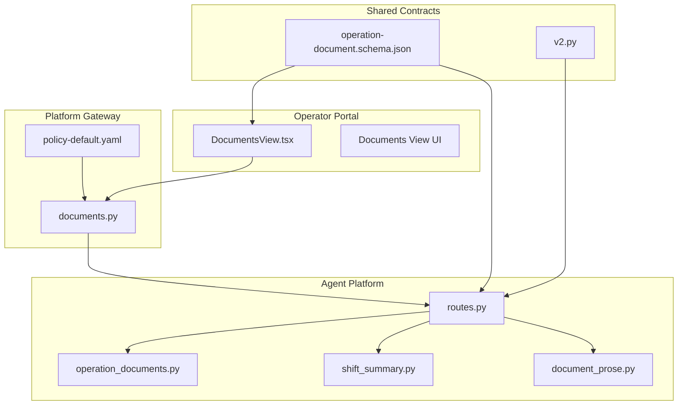
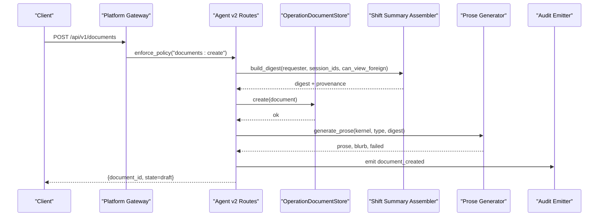
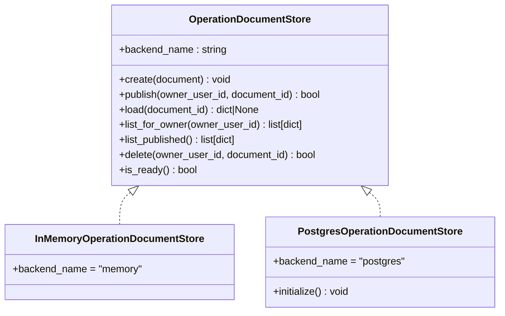
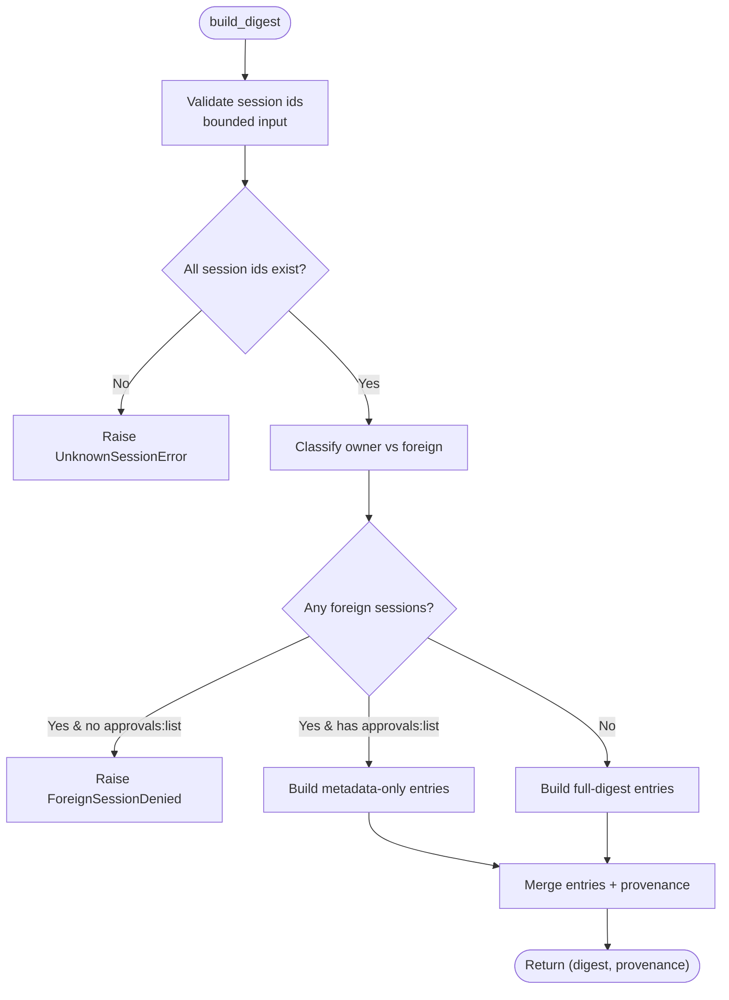
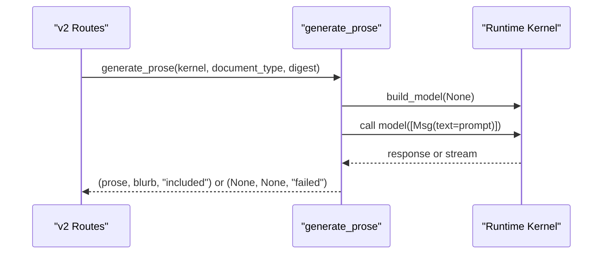
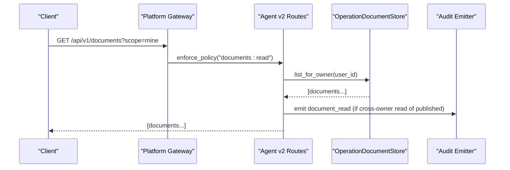
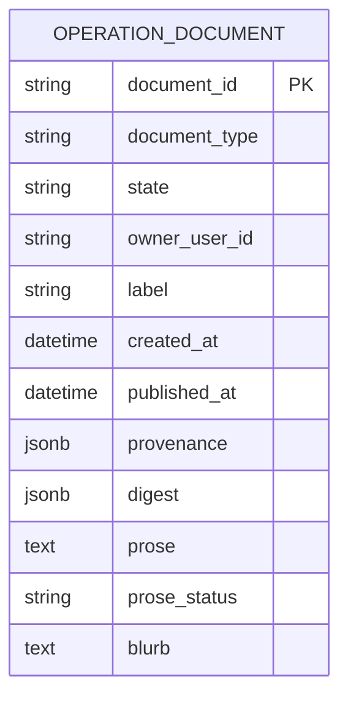
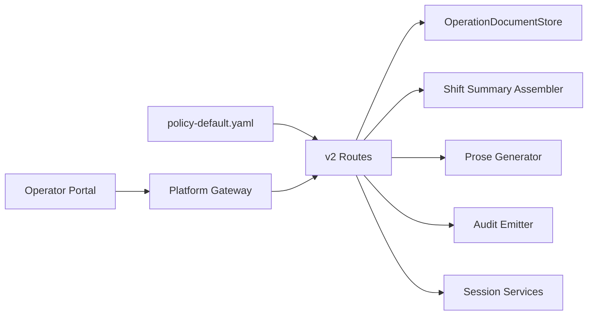

# SPEC-039: Operations Document Repository Specification

<cite>
**Referenced Files in This Document**
- [spec.md](file://docs/specs/SPEC-039-operations-document-repository/spec.md)
- [plan.md](file://docs/specs/SPEC-039-operations-document-repository/plan.md)
- [tasks.md](file://docs/specs/SPEC-039-operations-document-repository/tasks.md)
- [operation_documents.py](file://products/agent-platform/src/agent_service/services/operation_documents.py)
- [shift_summary.py](file://products/agent-platform/src/agent_service/services/shift_summary.py)
- [document_prose.py](file://products/agent-platform/src/agent_service/services/document_prose.py)
- [routes.py](file://products/agent-platform/src/agent_service/api/v2/routes.py)
- [documents.py](file://products/platform-gateway/src/platform_gateway/api/routes/documents.py)
- [policy-default.yaml](file://products/platform-gateway/src/platform_gateway/policies/policy-default.yaml)
- [operation-document.schema.json](file://shared/shared-contracts/schemas/operation-document.schema.json)
- [v2.py](file://products/agent-platform/src/agent_service/schemas/v2.py)
- [DocumentsView.tsx](file://products/operator-portal/web-ui/app/src/views/workspace/DocumentsView.tsx)
- [documents.ts](file://products/operator-portal/web-ui/app/src/api/documents.ts)
- [SPEC-041 spec.md](file://docs/specs/SPEC-041-documents-readability-and-digest-reference/spec.md)
- [SPEC-041 plan.md](file://docs/specs/SPEC-041-documents-readability-and-digest-reference/plan.md)
- [SPEC-043 spec.md](file://docs/specs/SPEC-043-incident-report-document-type/spec.md)
- [SPEC-043 plan.md](file://docs/specs/SPEC-043-incident-report-document-type/plan.md)
- [release notes](file://docs/agentic-aiops-platform/release-notes/2026-08-28-platform-components-blurb-prose-voice.md)
</cite>

## Update Summary
**Changes Made**
- Updated implementation status to reflect fully delivered Phase 1 with all eight requirements completed
- Enhanced architecture diagrams to include platform gateway policy enforcement and operator portal integration
- Added detailed component analysis for the complete typed document store, shift summary assembler, prose generator, and API routes
- Updated dependency analysis to show full cross-product integration between agent-platform, platform-gateway, and operator-portal
- Added comprehensive troubleshooting guide covering all error scenarios and degradation paths
- Updated conclusion to reflect delivery status and future extensibility
- Integrated SPEC-040 context showing handover section support and prose generation defaults changes
- **Added SPEC-041 enhancement planning**: Documentation now includes forward-looking information about upcoming readability improvements and digest reference capabilities that will extend the delivered SPEC-039 functionality
- **Updated v0.23.3 enhancements**: Added documentation for nullable blurb field, database migration, and envelope-only listing support for AI-generated document context
- **Added SPEC-043 incident report document type**: Documentation now includes the second document type alongside shift summaries, extending the substrate with incident-specific assembly, dual-action gate requiring documents:create and incident:read permissions, and incident-service client integration

## Table of Contents
1. [Introduction](#introduction)
2. [Project Structure](#project-structure)
3. [Core Components](#core-components)
4. [Architecture Overview](#architecture-overview)
5. [Detailed Component Analysis](#detailed-component-analysis)
6. [Dependency Analysis](#dependency-analysis)
7. [Performance Considerations](#performance-considerations)
8. [Troubleshooting Guide](#troubleshooting-guide)
9. [Future Enhancements (SPEC-041)](#future-enhancements-spec-041)
10. [Second Document Type - Incident Reports (SPEC-043)](#second-document-type---incident-reports-spec-043)
11. [Conclusion](#conclusion)

## Introduction
This document specifies the Operations Document Repository (SPEC-039), a platform-owned, typed-document substrate that lets operators produce durable operational recaps from existing platform records and share them by role rather than per-document grants. Phase 1 ships the substrate with a draft→published lifecycle, role-based access matrix, provenance anchoring, audit events, and a portal Documents view. The first document type is the shift summary: a deterministic digest of sessions, confirmation decisions, execution receipts, and evidence counts, with an optional clearly-labeled prose layer generated solely from the digest.

Key goals:
- Immutable snapshots anchored to record ids, not live references.
- Role-based visibility: drafts owner-only; published visible to all documents:read holders.
- Safe LLM-generated prose that can only paraphrase verified facts.
- Audit trails for creation, publishing, and cross-owner reads.

**Section sources**
- [spec.md:12-55](file://docs/specs/SPEC-039-operations-document-repository/spec.md#L12-L55)

## Project Structure
The implementation spans three products plus shared contracts:
- Agent Platform: document store, shift-summary assembler, prose generator, routes, and session add-ons.
- Platform Gateway: pass-through routes enforcing new policy actions and foreign coverage capability.
- Operator Portal: Documents view and session rename/id-copy UX.
- Shared Contracts: JSON schema for operation documents and default policy bundle updates.

**Diagram sources**
- [operation_documents.py:1-573](file://products/agent-platform/src/agent_service/services/operation_documents.py#L1-L573)
- [shift_summary.py:1-460](file://products/agent-platform/src/agent_service/services/shift_summary.py#L1-L460)
- [document_prose.py:1-158](file://products/agent-platform/src/agent_service/services/document_prose.py#L1-L158)
- [routes.py:738-957](file://products/agent-platform/src/agent_service/api/v2/routes.py#L738-L957)
- [documents.py:1-171](file://products/platform-gateway/src/platform_gateway/api/routes/documents.py#L1-L171)
- [policy-default.yaml:251-267](file://products/platform-gateway/src/platform_gateway/policies/policy-default.yaml#L251-L267)
- [DocumentsView.tsx:195-249](file://products/operator-portal/web-ui/app/src/views/workspace/DocumentsView.tsx#L195-L249)
- [operation-document.schema.json:1-110](file://shared/shared-contracts/schemas/operation-document.schema.json#L1-L110)
- [v2.py:335-367](file://products/agent-platform/src/agent_service/schemas/v2.py#L335-L367)

**Section sources**
- [plan.md:3-16](file://docs/specs/SPEC-039-operations-document-repository/plan.md#L3-L16)
- [tasks.md:5-52](file://docs/specs/SPEC-039-operations-document-repository/tasks.md#L5-L52)

## Core Components
- Typed document store: immutable rows with draft→published lifecycle, per-owner cap (20), 30-day TTL sweep, memory and Postgres backends behind one interface.
- Shift-summary assembler: builds deterministic digests from durable stores with two-tier coverage (owner full, foreign metadata-only).
- Optional prose generator: digest-only prompt contract, hard timeout, fail-soft degradation to digest-only documents.
- API routes: create, list (mine/published), get, publish, delete; session rename route; structured denials via gateway policy.
- Policy actions: documents:create, documents:read, session:update granted to operator/approver/platform-admin by default.
- Schema: strict JSON schema for operation documents including envelope fields, provenance, digest, prose status, and AI-generated blurb.

**Section sources**
- [operation_documents.py:38-120](file://products/agent-platform/src/agent_service/services/operation_documents.py#L38-L120)
- [shift_summary.py:40-74](file://products/agent-platform/src/agent_service/services/shift_summary.py#L40-L74)
- [document_prose.py:24-56](file://products/agent-platform/src/agent_service/services/document_prose.py#L24-L56)
- [routes.py:763-957](file://products/agent-platform/src/agent_service/api/v2/routes.py#L763-L957)
- [policy-default.yaml:251-267](file://products/platform-gateway/src/platform_gateway/policies/policy-default.yaml#L251-L267)
- [operation-document.schema.json:8-109](file://shared/shared-contracts/schemas/operation-document.schema.json#L8-L109)

## Architecture Overview
The repository composes a typed store, a type-agnostic assembler, and an optional prose generator, exposed through versioned routes and guarded by gateway-enforced policies.

**Diagram sources**
- [documents.py:29-69](file://products/platform-gateway/src/platform_gateway/api/routes/documents.py#L29-L69)
- [routes.py:763-856](file://products/agent-platform/src/agent_service/api/v2/routes.py#L763-L856)
- [shift_summary.py:266-323](file://products/agent-platform/src/agent_service/services/shift_summary.py#L266-L323)
- [operation_documents.py:488-531](file://products/agent-platform/src/agent_service/services/operation_documents.py#L488-L531)
- [document_prose.py:59-158](file://products/agent-platform/src/agent_service/services/document_prose.py#L59-L158)
- [policy-default.yaml:251-267](file://products/platform-gateway/src/platform_gateway/policies/policy-default.yaml#L251-L267)

## Detailed Component Analysis

### Operation Document Store (R-1)
- Interface: OperationDocumentStore with create, publish, load, list_for_owner, list_published, delete, is_ready.
- Backends: InMemoryOperationDocumentStore and PostgresOperationDocumentStore sharing the same behavior.
- Lifecycle: One-way publish (draft→published), owner-only publish/delete, immutable after publish.
- Retention and caps: Per-owner cap of 20 with oldest eviction; 30-day TTL sweep on writes and startup.
- Visibility: list_for_owner returns owner's drafts; list_published returns team-visible published docs.

**Diagram sources**
- [operation_documents.py:95-120](file://products/agent-platform/src/agent_service/services/operation_documents.py#L95-L120)
- [operation_documents.py:127-210](file://products/agent-platform/src/agent_service/services/operation_documents.py#L127-L210)
- [operation_documents.py:380-523](file://products/agent-platform/src/agent_service/services/operation_documents.py#L380-L523)

**Section sources**
- [operation_documents.py:38-120](file://products/agent-platform/src/agent_service/services/operation_documents.py#L38-L120)
- [operation_documents.py:127-210](file://products/agent-platform/src/agent_service/services/operation_documents.py#L127-L210)
- [operation_documents.py:217-331](file://products/agent-platform/src/agent_service/services/operation_documents.py#L217-L331)
- [operation_documents.py:380-523](file://products/agent-platform/src/agent_service/services/operation_documents.py#L380-L523)
- [operation_documents.py:530-573](file://products/agent-platform/src/agent_service/services/operation_documents.py#L530-L573)

### Shift Summary Assembler (R-3)
- Inputs: requester user id, bounded session ids (≤20), and a flag indicating whether foreign sessions may be viewed.
- Ownership tiers:
  - Owner sessions: full digest (title, transcript counts, evidence counts, confirmations, executions, open items).
  - Foreign sessions: metadata-only (decisions, receipts, record counts) gated by approvals:list.
- Degradation: unreadable secondary stores mark sections unavailable; never raise 500.
- Validation: rejects unknown session ids structurally without revealing ownership.

**Diagram sources**
- [shift_summary.py:77-90](file://products/agent-platform/src/agent_service/services/shift_summary.py#L77-L90)
- [shift_summary.py:182-263](file://products/agent-platform/src/agent_service/services/shift_summary.py#L182-L263)
- [shift_summary.py:367-426](file://products/agent-platform/src/agent_service/services/shift_summary.py#L367-L426)

**Section sources**
- [shift_summary.py:1-22](file://products/agent-platform/src/agent_service/services/shift_summary.py#L1-L22)
- [shift_summary.py:77-90](file://products/agent-platform/src/agent_service/services/shift_summary.py#L77-L90)
- [shift_summary.py:182-263](file://products/agent-platform/src/agent_service/services/shift_summary.py#L182-L263)
- [shift_summary.py:367-426](file://products/agent-platform/src/agent_service/services/shift_summary.py#L367-L426)

### Optional Prose Layer (R-4)
- Prompt contract: digest-only input; model cannot see transcripts or evidence payloads.
- Execution: uses runtime's default model client with a hard timeout; drains streaming responses if needed.
- Failure mode: any error yields prose_status=failed; document still created with digest only.
- **Updated**: v0.23.3 enhanced prose generation to extract AI-generated one-line summaries (blurbs) from the narrative response using SUMMARY markers, bounded to 240 characters.

**Diagram sources**
- [document_prose.py:24-56](file://products/agent-platform/src/agent_service/services/document_prose.py#L24-L56)
- [document_prose.py:59-158](file://products/agent-platform/src/agent_service/services/document_prose.py#L59-L158)

**Section sources**
- [document_prose.py:1-13](file://products/agent-platform/src/agent_service/services/document_prose.py#L1-L13)
- [document_prose.py:24-56](file://products/agent-platform/src/agent_service/services/document_prose.py#L24-L56)
- [document_prose.py:59-158](file://products/agent-platform/src/agent_service/services/document_prose.py#L59-L158)

### API Routes and Policy Enforcement (R-2, R-5, R-7)
- Create/list/get/publish/delete endpoints for documents with structured rejections.
- Session rename endpoint PATCH /sessions/{id}/title owner-only, bounds-checked, 404 for unknown/foreign.
- Gateway enforces documents:create, documents:read, session:update via policy-default.yaml.
- Audit emission: document_created, document_published, document_read (cross-owner only).

**Diagram sources**
- [documents.py:72-95](file://products/platform-gateway/src/platform_gateway/api/routes/documents.py#L72-L95)
- [routes.py:858-874](file://products/agent-platform/src/agent_service/api/v2/routes.py#L858-L874)
- [policy-default.yaml:251-267](file://products/platform-gateway/src/platform_gateway/policies/policy-default.yaml#L251-L267)

**Section sources**
- [routes.py:763-957](file://products/agent-platform/src/agent_service/api/v2/routes.py#L763-L957)
- [documents.py:29-171](file://products/platform-gateway/src/platform_gateway/api/routes/documents.py#L29-L171)
- [policy-default.yaml:251-267](file://products/platform-gateway/src/platform_gateway/policies/policy-default.yaml#L251-L267)
- [spec.md:87-106](file://docs/specs/SPEC-039-operations-document-repository/spec.md#L87-L106)
- [spec.md:156-170](file://docs/specs/SPEC-039-operations-document-repository/spec.md#L156-L170)
- [spec.md:189-219](file://docs/specs/SPEC-039-operations-document-repository/spec.md#L189-L219)

### Data Model (Operation Document)
- Envelope fields: document_id, document_type, state, owner_user_id, label, created_at, published_at, provenance, digest, prose, prose_status.
- **Updated**: v0.23.3 adds nullable blurb field (string/null, max 240 chars) for AI-generated one-line summaries extracted from prose responses.
- Provenance: sessions array with session_id, coverage (owner/foreign), cited_record_ids.
- Digest: type-specific deterministic data copied verbatim from durable stores.
- Prose: optional narrative produced from digest only; prose_status indicates included/failed/not_requested.

**Diagram sources**
- [operation-document.schema.json:8-109](file://shared/shared-contracts/schemas/operation-document.schema.json#L8-L109)

**Section sources**
- [operation-document.schema.json:1-110](file://shared/shared-contracts/schemas/operation-document.schema.json#L1-L110)

### Database Migration and Storage (v0.23.3 Enhancement)
- **Updated**: Additive migration adds nullable `blurb` column to operation_documents table for storing AI-generated one-line summaries.
- Migration runs during store initialization alongside existing summary column migration.
- Existing documents without blurbs degrade gracefully to null values.
- Insert operations include blurb parameter alongside other document fields.
- List queries select blurb field alongside other document metadata for envelope-only listings.

**Section sources**
- [operation_documents.py:246-251](file://products/agent-platform/src/agent_service/services/operation_documents.py#L246-L251)
- [operation_documents.py:253-311](file://products/agent-platform/src/agent_service/services/operation_documents.py#L253-L311)

### Envelope-Only Listing Support (v0.23.3 Enhancement)
- **Updated**: Blurb field rides envelope-only list rows alongside the deterministic summary field.
- Frontend displays blurb when available, falling back to summary for older documents.
- Security posture preserved: blurb is a bounded paraphrase of digest content, safe for un-audited listings.
- Full digest and prose remain protected behind audited single fetch endpoint.
- Portal UI shows blurb in list rows and detail cards with proper fallback handling.

**Section sources**
- [operation_documents.py:49-87](file://products/agent-platform/src/agent_service/services/operation_documents.py#L49-L87)
- [documents.ts:17-41](file://products/operator-portal/web-ui/app/src/api/documents.ts#L17-L41)
- [DocumentsView.tsx:1061-1072](file://products/operator-portal/web-ui/app/src/views/workspace/DocumentsView.tsx#L1061-L1072)
- [DocumentsView.tsx:1186-1196](file://products/operator-portal/web-ui/app/src/views/workspace/DocumentsView.tsx#L1186-L1196)

## Dependency Analysis
- Routes depend on:
  - OperationDocumentStore (create/list/get/publish/delete)
  - ShiftSummaryAssembler (build_digest)
  - ProseGenerator (generate_prose)
  - AuditEmitter (emit events)
  - Session services (rename title)
- Policy actions gate routes at the gateway:
  - documents:create → create/publish/delete own documents
  - documents:read → list/get documents
  - session:update → rename session title
- Store depends on environment knobs AGENT_STATE_STORE_BACKEND and AGENT_STATE_DB_URL; falls back to in-memory when Postgres is unreachable.

**Diagram sources**
- [routes.py:763-957](file://products/agent-platform/src/agent_service/api/v2/routes.py#L763-L957)
- [operation_documents.py:530-573](file://products/agent-platform/src/agent_service/services/operation_documents.py#L530-L573)
- [documents.py:29-171](file://products/platform-gateway/src/platform_gateway/api/routes/documents.py#L29-L171)
- [policy-default.yaml:251-267](file://products/platform-gateway/src/platform_gateway/policies/policy-default.yaml#L251-L267)

**Section sources**
- [plan.md:119-132](file://docs/specs/SPEC-039-operations-document-repository/plan.md#L119-L132)
- [policy-default.yaml:251-267](file://products/platform-gateway/src/platform_gateway/policies/policy-default.yaml#L251-L267)

## Performance Considerations
- Store operations are bounded: per-owner cap of 20 with oldest eviction; 30-day TTL sweep piggybacks on writes and initialization.
- Secondary store reads degrade gracefully; failures do not block request paths.
- Prose generation has a hard timeout to prevent route blocking; failures degrade to digest-only documents.
- Postgres queries use indexes on owner and state columns for efficient listing.
- **Updated**: Blurb extraction is lightweight string parsing with 240-character bounds, adding minimal overhead to prose generation.

## Troubleshooting Guide
- Unknown session ids during digest assembly: raises a specific error carrying offending ids; routes respond 400 without revealing ownership.
- Missing permissions: gateway returns structured denial for missing documents:create/documents:read/session:update.
- Postgres unavailability: store factory falls back to in-memory backend; service remains usable.
- Prose generation failure: prose_status set to failed; document still created with digest only.
- Foreign session access: requires approvals:list capability; denied without proper authorization.
- Session rename validation: titles must be 1-80 characters after trimming; foreign or unknown sessions return 404.
- **Updated**: Blurb parsing edge cases handled gracefully - missing SUMMARY marker results in null blurb, empty responses handled safely.

**Section sources**
- [shift_summary.py:46-70](file://products/agent-platform/src/agent_service/services/shift_summary.py#L46-L70)
- [policy-default.yaml:251-267](file://products/platform-gateway/src/platform_gateway/policies/policy-default.yaml#L251-L267)
- [operation_documents.py:530-573](file://products/agent-platform/src/agent_service/services/operation_documents.py#L530-L573)
- [document_prose.py:59-158](file://products/agent-platform/src/agent_service/services/document_prose.py#L59-L158)
- [routes.py:705-736](file://products/agent-platform/src/agent_service/api/v2/routes.py#L705-L736)

## Future Enhancements (SPEC-041)

### Planned Readability Improvements
The operations document repository is planned to receive significant usability enhancements through SPEC-041, which addresses operator feedback from the v0.22.0 live test. These enhancements focus on improving the digest's readability and providing better context for operators encountering the document system for the first time.

### Key Planned Features

#### R-1: Operator Digest and Documents Reference
- Dedicated operator-facing reference documentation explaining digest vocabulary (digest, frame, coverage tiers, handover)
- Integration with portal user guide and Documents view
- Maintains envelope-only listing posture while providing educational content

#### R-2: Tabbed, Structured Digest Rendering  
- Restructure the current recursive JSON tree into tabbed interface with dedicated tabs for:
  - Handover (default) - shift-level counts, open items, quiet state
  - Sessions - per-session coverage details
  - Confirmations - decision tracking
  - Executions - tool execution outcomes
  - Evidence & Transcript Counts - quantitative metrics
  - Open Items - pending actions breakdown
  - Raw JSON - preserves artifact inspection capability

#### R-3: Bounded Scrollable Digest and Prose Panes
- Maximum height constraints with internal scrolling for long content
- Expand/collapse affordances for full content access
- Prevents drawer overflow while maintaining content accessibility

#### R-4: Deterministic Counts-Only Document Summary
- Creation-time summary computed from handover skeleton (no model involvement)
- Shows covered session counts, decision/execution counts, open item counts
- Quiet phrasing for shifts with no recorded activity
- Envelope-only field that maintains security posture

### Implementation Timeline
SPEC-041 is currently in draft status targeting version 0.23.0 as part of the R5 hardening cycle. The enhancements are designed to be additive, preserving all existing functionality while significantly improving operator experience and onboarding.

**Section sources**
- [SPEC-041 spec.md:11-45](file://docs/specs/SPEC-041-documents-readability-and-digest-reference/spec.md#L11-L45)
- [SPEC-041 plan.md:13-87](file://docs/specs/SPEC-041-documents-readability-and-digest-reference/plan.md#L13-L87)

## Second Document Type - Incident Reports (SPEC-043)

### Overview
The operations document repository extends beyond shift summaries to include incident reports as its second document type, delivered 2026-08-29 as v0.25.0. This enhancement leverages the existing substrate's type discriminator, role × type matrix, provenance anchoring, and audited cross-owner read path to provide durable, attributed incident review artifacts.

### Incident Report Assembly
An incident-report assembler in agent-platform builds the digest from two sources: incident-service (via the new internal client) and the platform's own durable stores for the linked session. The digest carries four deterministic sections:

- **incident** — the incident envelope copied verbatim (incident_id, fingerprint, source, severity, status, title, summary, labels, reported_by, session_id, timestamps)
- **triage** — the validated triage report copied verbatim when present (summary, severity assessment, evidence refs, hypotheses, next steps, skills cited, generator and timestamp), or the marker `not_triaged` when the incident has none
- **dispatches** — the connector dispatch outcomes copied verbatim (connector, status, reference, timestamp), possibly empty
- **session** — the linked triage session's digest under the SPEC-039 R-3 two-tier posture: full digest when the requester owns the session; metadata-only when foreign with approvals:list; foreign_denied when foreign without approvals:list; missing when the incident carries no session id

### Dual-Action Gate and Permissions
Incident report creation requires both `documents:create` and `incident:read` permissions, ensuring that incident facts reach only holders of incident:read. This dual-action gate reuses the adjudicated incident visibility matrix without introducing new policy actions or policy-bundle changes.

### Internal Incident Client
Agent-platform gains a bounded incident-service client that speaks to incident-service with agent-platform's own registered Basic query credential. The client forwards x-request-id, honors a bounded timeout knob, and is configured by three new environment variables: AGENT_INCIDENT_SERVICE_URL, AGENT_INCIDENT_CLIENT_ID, and AGENT_INCIDENT_CLIENT_SECRET.

### Error Handling and Degradation
- Missing configuration answers 503 (dependency not configured) at creation time
- Unreachable incident-service answers 502
- Neither surfaces a raw stack trace
- An incident that failed triage still assembles (the digest carries the incident envelope with triage_failed status, the raw-triage marker, and the session digest)
- Assembly never 500s on incident content

### Portal Integration
The Documents view grows incident-report creation and rendering inside the existing surfaces:
- Creation dialog offers type choice (Shift summary / Incident report)
- Choosing Incident report swaps the session picker for an incident picker fed by the existing incidents list surface
- Document drawer renders the incident-report digest in the SPEC-041 tabbed posture with tabs for Incident, Triage, Dispatches, Session, Generated narrative, and Raw JSON
- Type badge distinguishes incident reports

**Section sources**
- [SPEC-043 spec.md:15-50](file://docs/specs/SPEC-043-incident-report-document-type/spec.md#L15-L50)
- [SPEC-043 spec.md:84-127](file://docs/specs/SPEC-043-incident-report-document-type/spec.md#L84-L127)
- [SPEC-043 spec.md:128-154](file://docs/specs/SPEC-043-incident-report-document-type/spec.md#L128-L154)
- [SPEC-043 spec.md:188-210](file://docs/specs/SPEC-043-incident-report-document-type/spec.md#L188-L210)
- [SPEC-043 plan.md:49-67](file://docs/specs/SPEC-043-incident-report-document-type/plan.md#L49-L67)

## Conclusion
SPEC-039 introduces a robust, typed operations document repository with a clear separation between immutable digests and optional prose, enforced by role-based access and strong provenance. Phase 1 delivers the substrate, shift summaries, and portal support, while leaving room for future document types and integrations. All eight requirements have been successfully implemented and delivered in v0.21.0, providing operators with a complete solution for creating, managing, and sharing operational documentation across their teams.

The system has been further enhanced with v0.23.3 additions including nullable blurb field support, database migrations, and envelope-only listing capabilities for AI-generated document context. These enhancements provide operators with concise, digest-anchored one-line summaries that ride safely in un-audited listings while maintaining the security posture of the core document system.

The system is now positioned to integrate with SPEC-040 capabilities, which will enhance the shift summaries with deterministic handover sections and improved prose generation defaults, further strengthening the operational handover workflow for relief operators. Additionally, SPEC-041 planning ensures continued evolution toward better operator experience through enhanced readability features and digest reference capabilities.

With the addition of SPEC-043's incident report document type, the substrate now supports two distinct document types: shift summaries for operational handover and incident reports for incident review. Both types leverage the same substrate foundation, policy enforcement, and portal integration patterns, demonstrating the extensibility of the design. The combination of SPEC-039's solid foundation, SPEC-040's handover narrative enhancements, v0.23.3's AI blurb capabilities, SPEC-043's incident report support, and the delivered SPEC-041 readability improvements (v0.23.0) create a comprehensive operational documentation system that scales from basic digest capture to sophisticated operator workflows.