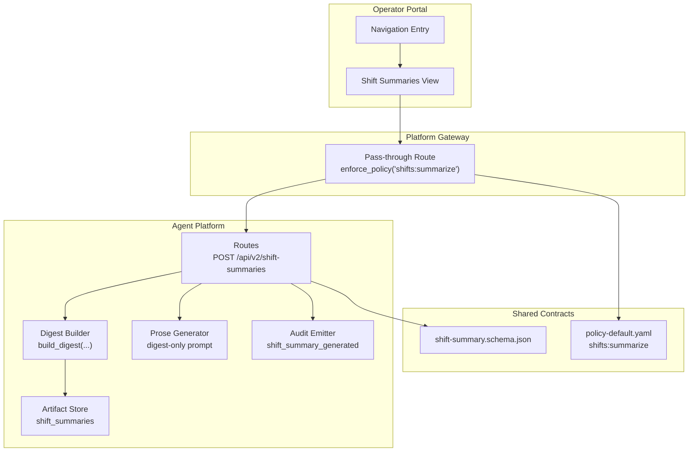
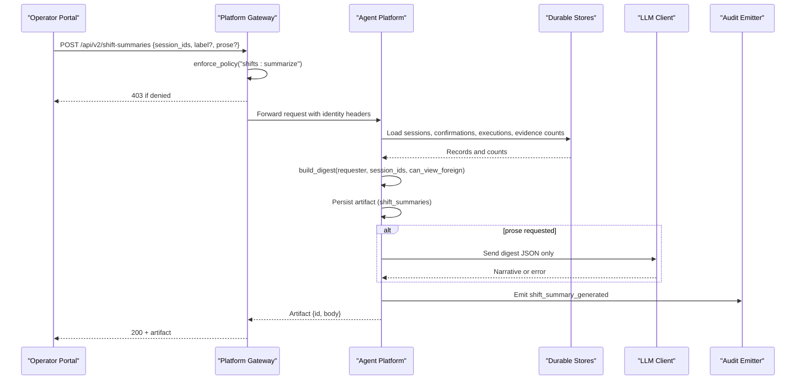
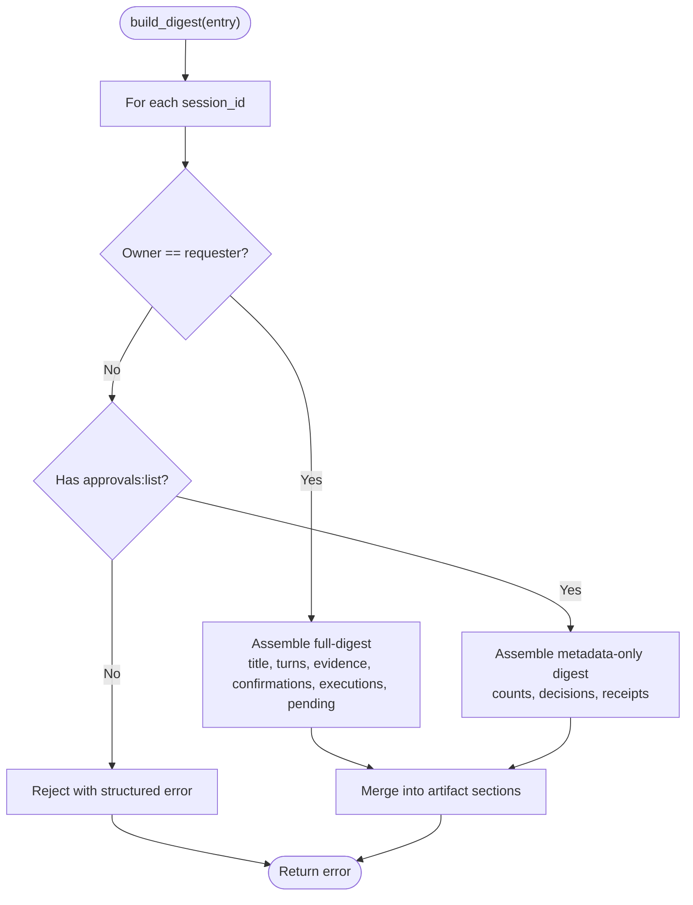
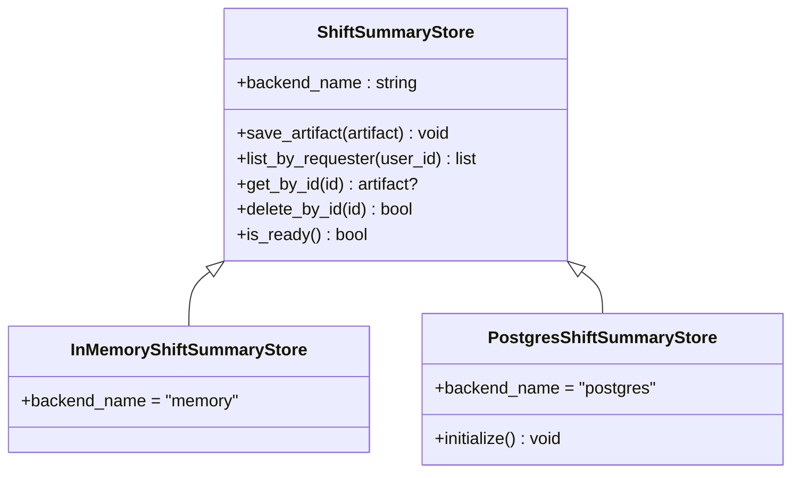
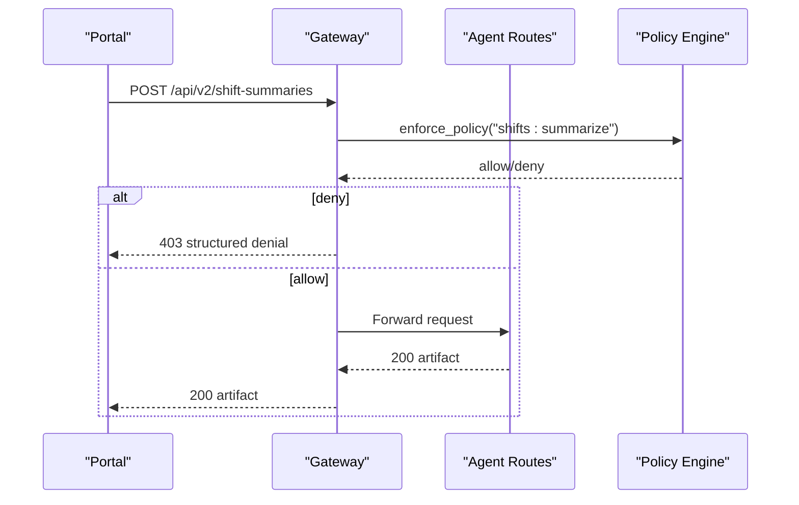
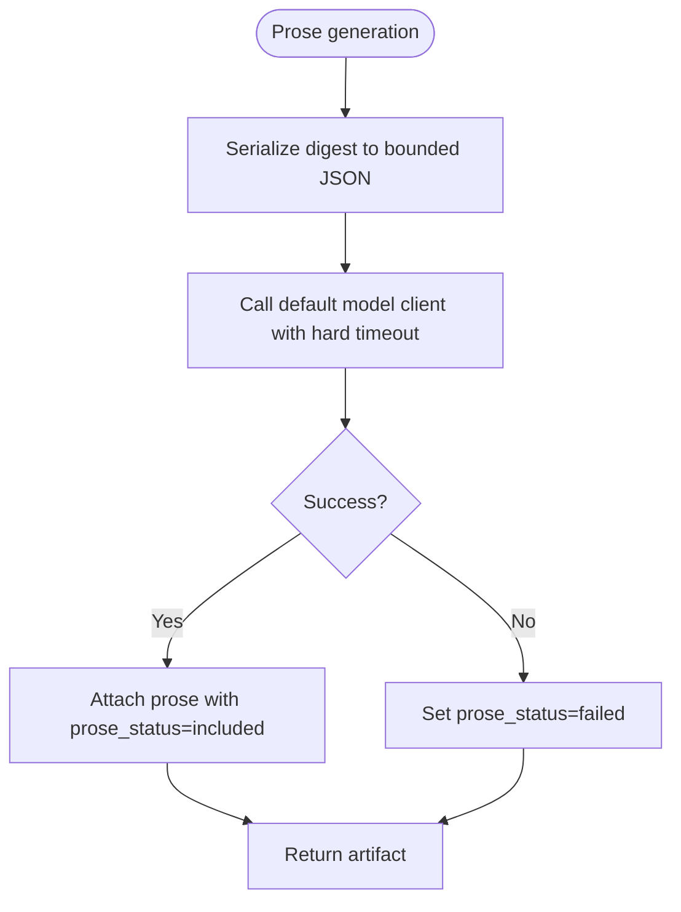
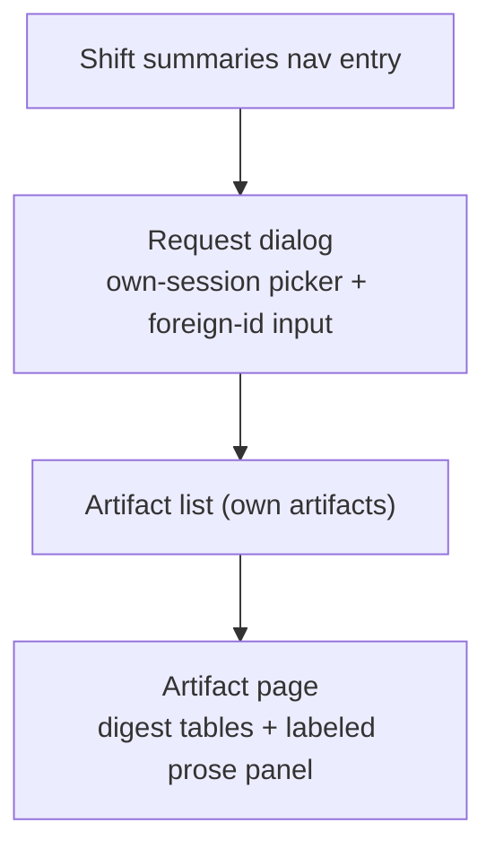
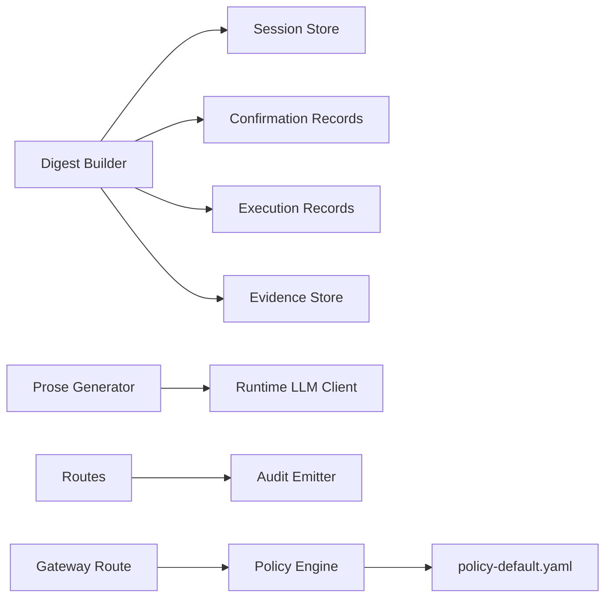
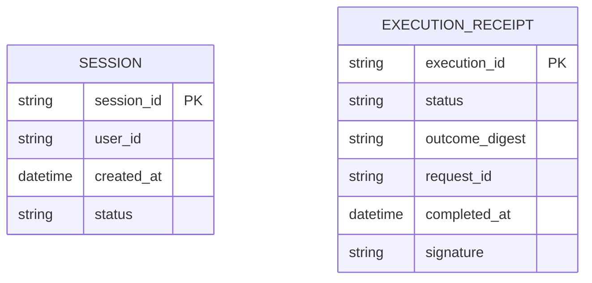

# SPEC-039: Shift-Summary Artifacts Specification

<cite>
**Referenced Files in This Document**
- [spec.md](file://docs/specs/SPEC-039-shift-summary-artifacts/spec.md)
- [plan.md](file://docs/specs/SPEC-039-shift-summary-artifacts/plan.md)
- [tasks.md](file://docs/specs/SPEC-039-shift-summary-artifacts/tasks.md)
- [confirmation_records.py](file://products/agent-platform/src/agent_service/services/confirmation_records.py)
- [execution_records.py](file://products/agent-platform/src/agent_service/services/execution_records.py)
- [session_store.py](file://products/agent-platform/src/agent_service/services/session_store.py)
- [policy-default.yaml](file://shared/shared-contracts/policies/policy-default.yaml)
- [router.py](file://products/platform-gateway/src/platform_gateway/api/router.py)
- [agent_client.py](file://products/platform-gateway/src/platform_gateway/services/agent_client.py)
- [execution-receipt.schema.json](file://shared/shared-contracts/schemas/execution-receipt.schema.json)
- [session.schema.json](file://shared/shared-contracts/schemas/session.schema.json)
</cite>

## Table of Contents
1. [Introduction](#introduction)
2. [Project Structure](#project-structure)
3. [Core Components](#core-components)
4. [Architecture Overview](#architecture-overview)
5. [Detailed Component Analysis](#detailed-component-analysis)
6. [Dependency Analysis](#dependency-analysis)
7. [Performance Considerations](#performance-considerations)
8. [Troubleshooting Guide](#troubleshooting-guide)
9. [Conclusion](#conclusion)
10. [Appendices](#appendices)

## Introduction
This document specifies the design and implementation plan for SPEC-039: Shift-Summary Artifacts. It defines how operators can request a deterministic, durable summary artifact over one or more sessions to support incident review and 7x24 handover. The artifact’s trusted core is assembled mechanically from existing durable stores (sessions, confirmation records, execution records, evidence counts), with optional LLM-generated prose that is clearly labeled and constrained to digest-only input. Access is policy-gated via a new action, artifacts are persisted with retention and per-requester caps, and a portal view renders digest-first with an optional narrative panel.

## Project Structure
SPEC-039 spans multiple products and shared contracts:
- Agent platform: digest assembly service, artifact store, routes, audit emission, optional prose generation.
- Platform gateway: pass-through route behind policy enforcement for the new action.
- Operator portal: navigation entry and UI for requesting and viewing shift summaries.
- Shared contracts: new schema for the artifact shape and a new policy action in the default bundle.



**Diagram sources**
- [router.py:1-32](file://products/platform-gateway/src/platform_gateway/api/router.py#L1-L32)
- [policy-default.yaml:1-248](file://shared/shared-contracts/policies/policy-default.yaml#L1-L248)
- [spec.md:84-104](file://docs/specs/SPEC-039-shift-summary-artifacts/spec.md#L84-L104)
- [plan.md:14-48](file://docs/specs/SPEC-039-shift-summary-artifacts/plan.md#L14-L48)

**Section sources**
- [spec.md:11-22](file://docs/specs/SPEC-039-shift-summary-artifacts/spec.md#L11-L22)
- [plan.md:3-12](file://docs/specs/SPEC-039-shift-summary-artifacts/plan.md#L3-L12)

## Core Components
- Deterministic digest builder: Assembles a trusted, verifiable summary from session metadata, confirmation decisions, execution receipts, and evidence counts. Ownership-aware coverage: full-digest for requester-owned sessions; metadata-only for foreign sessions when the caller has approvals:list.
- Durable artifact store: Immutable snapshots persisted under a new shift_summaries table with per-requester cap (20), 30-day TTL sweep, and idempotent Postgres DDL. Memory backend parity for dev/test.
- Policy-gated API: POST /api/v2/shift-summaries exposed through platform-gateway behind enforce_policy("shifts:summarize"). Bounded inputs (≤20 session ids), structured rejections for unknown ids, and consistent denial behavior.
- Optional prose layer: Digest-only prompt contract sent to the runtime’s default model client with a hard timeout; failures degrade gracefully to digest-only artifacts with prose_status=failed.
- Audit event: One fire-and-forget shift_summary_generated event per generation, correlating via x-request-id, including requester, covered ids split by ownership, per-source counts, and prose status.
- Portal view: Navigation entry beside Approvals, session picker limited to requester’s own recent sessions plus explicit foreign-id input, artifact list, and digest-first rendering with collapsed labeled prose panel.

**Section sources**
- [spec.md:49-179](file://docs/specs/SPEC-039-shift-summary-artifacts/spec.md#L49-L179)
- [plan.md:14-112](file://docs/specs/SPEC-039-shift-summary-artifacts/plan.md#L14-L112)
- [tasks.md:5-41](file://docs/specs/SPEC-039-shift-summary-artifacts/tasks.md#L5-L41)

## Architecture Overview
The flow begins at the operator portal, which requests a shift summary via the platform gateway. The gateway enforces the new policy action and proxies the request to agent-platform. Agent-platform builds the deterministic digest from durable stores, persists the artifact, optionally generates prose, emits audit, and returns the artifact. The portal lists and renders artifacts digest-first.



**Diagram sources**
- [agent_client.py:16-29](file://products/platform-gateway/src/platform_gateway/services/agent_client.py#L16-L29)
- [policy-default.yaml:234-248](file://shared/shared-contracts/policies/policy-default.yaml#L234-L248)
- [spec.md:84-104](file://docs/specs/SPEC-039-shift-summary-artifacts/spec.md#L84-L104)
- [plan.md:65-89](file://docs/specs/SPEC-039-shift-summary-artifacts/plan.md#L65-L89)

## Detailed Component Analysis

### Deterministic Digest Assembly
- Inputs: requester user id, bounded session-id list, and a flag indicating whether foreign metadata may be included (based on approvals:list).
- Coverage:
  - Requester-owned sessions: title, turn counts, evidence counts per turn, confirmation cards (decision/decider/timestamps), executions (receipt status), still-pending items.
  - Foreign sessions: metadata-level digest only (no titles/transcript/evidence content); requires approvals:list.
- Degradation: Unreadable secondary stores mark affected sections unavailable rather than failing the request.
- Provenance anchors: Each covered session carries its session_id and cites record ids (confirm ids, execution ids).



**Diagram sources**
- [spec.md:49-83](file://docs/specs/SPEC-039-shift-summary-artifacts/spec.md#L49-L83)
- [plan.md:16-30](file://docs/specs/SPEC-039-shift-summary-artifacts/plan.md#L16-L30)

**Section sources**
- [spec.md:49-83](file://docs/specs/SPEC-039-shift-summary-artifacts/spec.md#L49-L83)
- [plan.md:16-30](file://docs/specs/SPEC-039-shift-summary-artifacts/plan.md#L16-L30)

### Durable Artifact Store
- Backends: memory and Postgres behind a single interface, mirroring confirmation/execution record patterns.
- Cap and retention: Per-requester cap of 20 artifacts; oldest evicted on creation beyond cap. 30-day TTL with opportunistic sweep on startup and access.
- Idempotency: Postgres DDL initialization is idempotent; memory backend keeps parity for tests/dev.
- Operations: List requester’s own artifacts (most recent first), get by id, delete by id; foreign/unknown ids return 404.



**Diagram sources**
- [plan.md:50-63](file://docs/specs/SPEC-039-shift-summary-artifacts/plan.md#L50-L63)
- [spec.md:106-127](file://docs/specs/SPEC-039-shift-summary-artifacts/spec.md#L106-L127)

**Section sources**
- [spec.md:106-127](file://docs/specs/SPEC-039-shift-summary-artifacts/spec.md#L106-L127)
- [plan.md:50-63](file://docs/specs/SPEC-039-shift-summary-artifacts/plan.md#L50-L63)

### Policy-Gated Generation API
- Endpoint: POST /api/v2/shift-summaries served by agent-platform; proxied by platform-gateway behind enforce_policy("shifts:summarize").
- Input bounds: session-id list capped at 20; optional label; optional prose flag. Unknown session ids produce structured 404-family rejection without revealing ownership.
- Denials: Structured denial identical in shape to existing policy denials; audited block.
- Response: Returns artifact id and full artifact body conforming to shift-summary.schema.json.



**Diagram sources**
- [policy-default.yaml:234-248](file://shared/shared-contracts/policies/policy-default.yaml#L234-L248)
- [spec.md:84-104](file://docs/specs/SPEC-039-shift-summary-artifacts/spec.md#L84-L104)
- [plan.md:32-48](file://docs/specs/SPEC-039-shift-summary-artifacts/plan.md#L32-L48)

**Section sources**
- [spec.md:84-104](file://docs/specs/SPEC-039-shift-summary-artifacts/spec.md#L84-L104)
- [plan.md:32-48](file://docs/specs/SPEC-039-shift-summary-artifacts/plan.md#L32-L48)

### Optional Clearly-Labeled Prose Layer
- Prompt contract: Digest JSON only; no transcript text, evidence payload, or argument body reaches the model.
- Model selection: Uses requester’s default catalog model; no per-artifact model selection surface.
- Failure handling: Exceptions/timeouts set prose_status=failed; artifact ships digest-only.
- Rendering: Portal shows prose in a clearly labeled “Generated narrative” panel, collapsed by default.



**Diagram sources**
- [spec.md:129-147](file://docs/specs/SPEC-039-shift-summary-artifacts/spec.md#L129-L147)
- [plan.md:65-77](file://docs/specs/SPEC-039-shift-summary-artifacts/plan.md#L65-L77)

**Section sources**
- [spec.md:129-147](file://docs/specs/SPEC-039-shift-summary-artifacts/spec.md#L129-L147)
- [plan.md:65-77](file://docs/specs/SPEC-039-shift-summary-artifacts/plan.md#L65-L77)

### Audit Event
- Event name: shift_summary_generated emitted after persistence succeeds.
- Correlation: Forwarded x-request-id per SPEC-029 convention.
- Fields: Requester, covered session ids split by ownership (own/foreign), per-source counts, prose status.
- Non-blocking: Audit emission failure never blocks generation.

```mermaid
sequenceDiagram
participant Agent as "Agent Platform"
participant Audit as "Audit Emitter"
Agent->>Audit : Emit shift_summary_generated {requester, own_ids, foreign_ids, counts, prose_status}
Note over Agent,Audit : Fire-and-forget; failures do not block generation
```

**Diagram sources**
- [spec.md:149-162](file://docs/specs/SPEC-039-shift-summary-artifacts/spec.md#L149-L162)
- [plan.md:79-89](file://docs/specs/SPEC-039-shift-summary-artifacts/plan.md#L79-L89)

**Section sources**
- [spec.md:149-162](file://docs/specs/SPEC-039-shift-summary-artifacts/spec.md#L149-L162)
- [plan.md:79-89](file://docs/specs/SPEC-039-shift-summary-artifacts/plan.md#L79-L89)

### Portal Shift-Summaries View
- Navigation: New entry beside Approvals.
- Session picker: Offers requester’s own recent sessions; foreign session ids entered explicitly.
- Artifact page: Digest-first rendering (sessions, decisions, executions, open items); prose panel collapsed by default and unmistakably labeled.
- Conventions: Dark-theme antd patterns and sticky-banner/navigation reuse.



**Diagram sources**
- [spec.md:164-179](file://docs/specs/SPEC-039-shift-summary-artifacts/spec.md#L164-L179)
- [plan.md:91-101](file://docs/specs/SPEC-039-shift-summary-artifacts/plan.md#L91-L101)

**Section sources**
- [spec.md:164-179](file://docs/specs/SPEC-039-shift-summary-artifacts/spec.md#L164-L179)
- [plan.md:91-101](file://docs/specs/SPEC-039-shift-summary-artifacts/plan.md#L91-L101)

## Dependency Analysis
- Agent platform depends on:
  - Session store for ownership resolution and metadata.
  - Confirmation records for decision history.
  - Execution records for receipt status and outcomes.
  - Evidence store for counts (per spec).
  - Runtime LLM client for optional prose generation.
  - Audit emitter for shift_summary_generated events.
- Platform gateway depends on:
  - Policy engine to enforce shifts:summarize.
  - Identity forwarding headers (x-request-id, X-User-ID).
- Shared contracts define:
  - Artifact schema (shift-summary.schema.json).
  - Policy action (shifts:summarize) in policy-default.yaml.



**Diagram sources**
- [confirmation_records.py:1-28](file://products/agent-platform/src/agent_service/services/confirmation_records.py#L1-L28)
- [execution_records.py:1-18](file://products/agent-platform/src/agent_service/services/execution_records.py#L1-L18)
- [session_store.py:162-178](file://products/agent-platform/src/agent_service/services/session_store.py#L162-L178)
- [policy-default.yaml:234-248](file://shared/shared-contracts/policies/policy-default.yaml#L234-L248)
- [agent_client.py:16-29](file://products/platform-gateway/src/platform_gateway/services/agent_client.py#L16-L29)

**Section sources**
- [plan.md:14-48](file://docs/specs/SPEC-039-shift-summary-artifacts/plan.md#L14-L48)
- [spec.md:210-226](file://docs/specs/SPEC-039-shift-summary-artifacts/spec.md#L210-L226)

## Performance Considerations
- Bounded inputs: Session-id list capped at 20 prevents unbounded scans.
- Degradation: Unreadable stores mark sections unavailable instead of failing requests.
- Retention sweeps: Opportunistic cleanup aligns with inbox history window to keep storage bounded.
- Prose timeouts: Hard timeout ensures prose generation does not stall artifact delivery.

[No sources needed since this section provides general guidance]

## Troubleshooting Guide
- Unknown session ids: Expect structured 404-family rejection without ownership hints.
- Missing stores: Digest sections report unavailable; verify backend readiness and connectivity.
- Policy denial: Confirm role grants for shifts:summarize and ensure policy bundle sync.
- Prose failures: Check model availability and timeouts; artifact remains digest-only with prose_status=failed.
- Audit gaps: Audit emission is fire-and-forget; failures do not block generation but may indicate transport issues.

**Section sources**
- [spec.md:84-104](file://docs/specs/SPEC-039-shift-summary-artifacts/spec.md#L84-L104)
- [spec.md:129-162](file://docs/specs/SPEC-039-shift-summary-artifacts/spec.md#L129-L162)

## Conclusion
SPEC-039 introduces a robust, policy-gated mechanism for generating durable shift-summary artifacts that consolidate verified facts across sessions with clear provenance anchors. The design prioritizes determinism, safety, and graceful degradation, while providing an optional, clearly-labeled narrative layer. With bounded inputs, retention policies, and a dedicated portal view, it enables reliable incident review and roster handover without exposing raw cross-owner transcripts.

[No sources needed since this section summarizes without analyzing specific files]

## Appendices

### Data Models and Contracts
- Session model fields relevant to summaries include identifiers, timestamps, and status.
- Execution receipts carry outcome status, completion timestamp, and signature for integrity.



**Diagram sources**
- [session.schema.json:1-26](file://shared/shared-contracts/schemas/session.schema.json#L1-L26)
- [execution-receipt.schema.json:1-47](file://shared/shared-contracts/schemas/execution-receipt.schema.json#L1-L47)

**Section sources**
- [session.schema.json:1-26](file://shared/shared-contracts/schemas/session.schema.json#L1-L26)
- [execution-receipt.schema.json:1-47](file://shared/shared-contracts/schemas/execution-receipt.schema.json#L1-L47)