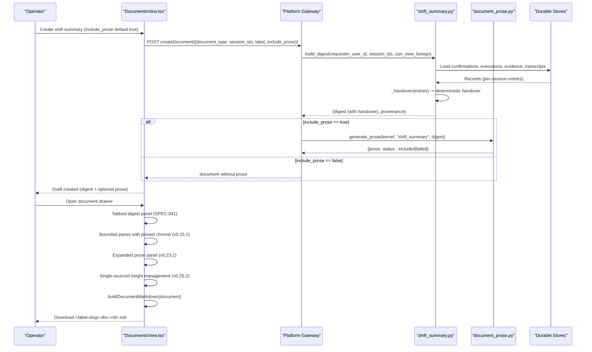
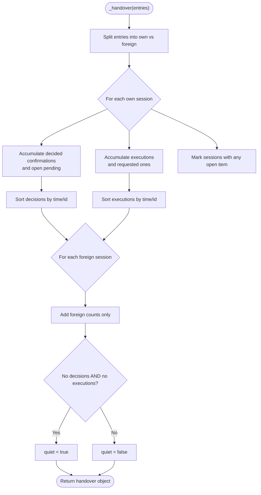
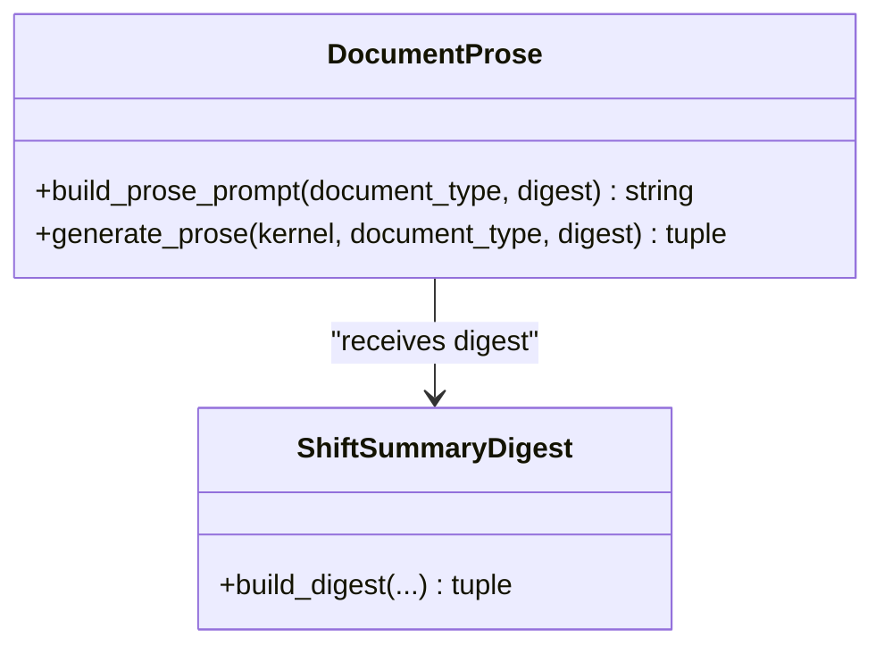
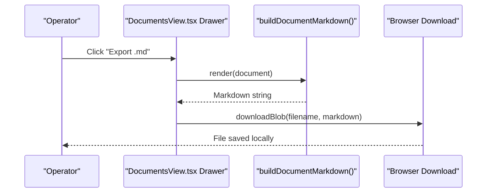
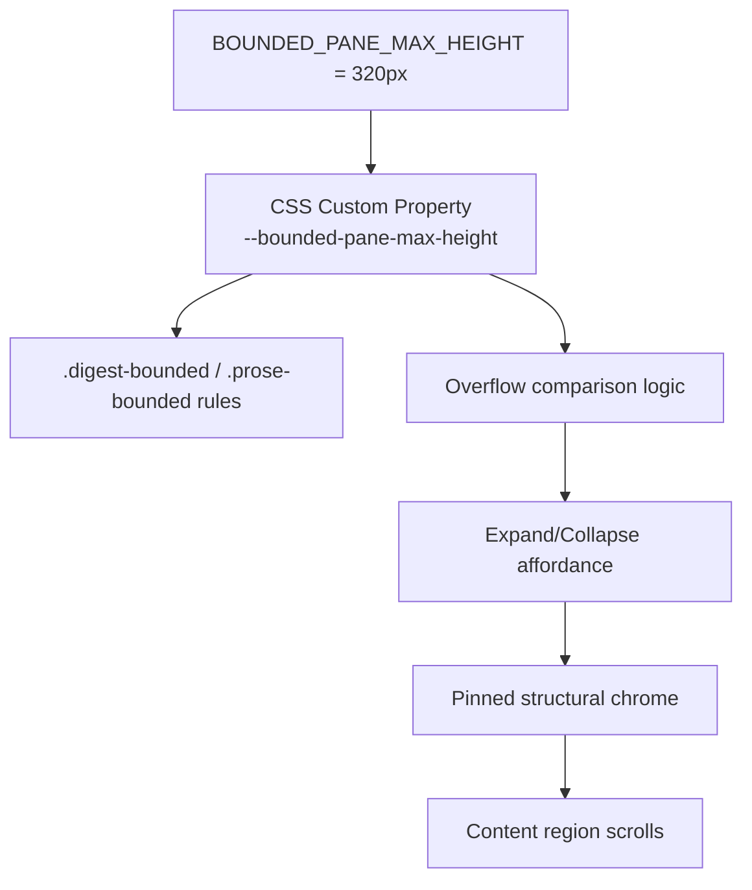
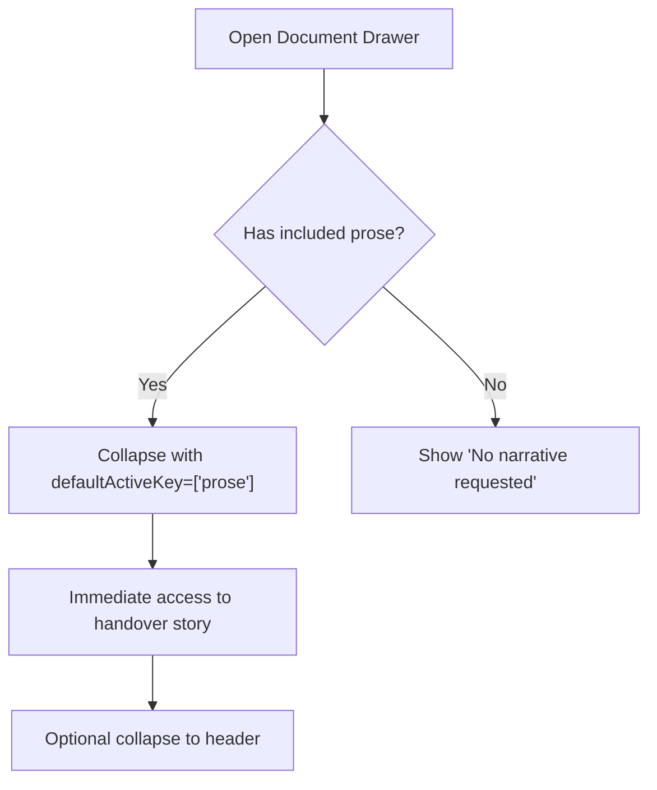
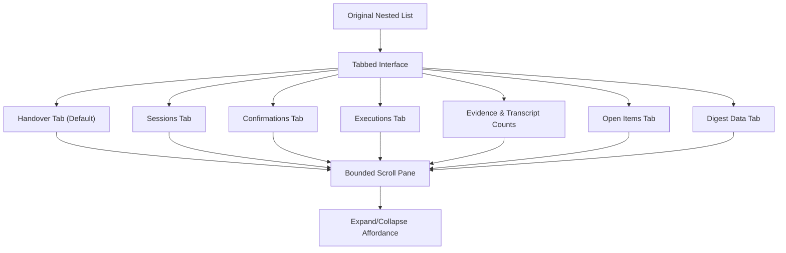
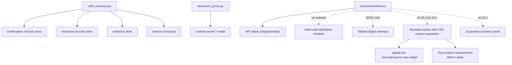

# SPEC-040: Shift-Summary Handover Narrative and Export

<cite>
**Referenced Files in This Document**
- [spec.md](file://docs/specs/SPEC-040-shift-summary-handover-narrative/spec.md)
- [plan.md](file://docs/specs/SPEC-040-shift-summary-handover-narrative/plan.md)
- [tasks.md](file://docs/specs/SPEC-040-shift-summary-handover-narrative/tasks.md)
- [shift_summary.py](file://products/agent-platform/src/agent_service/services/shift_summary.py)
- [document_prose.py](file://products/agent-platform/src/agent_service/services/document_prose.py)
- [DocumentsView.tsx](file://products/operator-portal/web-ui/app/src/views/workspace/DocumentsView.tsx)
- [App.tsx](file://products/operator-portal/web-ui/app/src/App.tsx)
- [test_shift_summary.py](file://products/agent-platform/tests/test_shift_summary.py)
- [test_documents.py](file://products/agent-platform/tests/test_documents.py)
- [2026-08-28-release-notes.md](file://docs/agentic-aiops-platform/release-notes/2026-08-28-shift-summary-handover-narrative-export.md)
- [2026-08-28-shift-summary-narrative-expanded.md](file://docs/agentic-aiops-platform/release-notes/2026-08-28-shift-summary-narrative-expanded.md)
- [2026-08-29-bounded-pane-review-follow-ups.md](file://docs/agentic-aiops-platform/release-notes/2026-08-29-bounded-pane-review-follow-ups.md)
- [2026-08-29-portal-live-check-polish.md](file://docs/agentic-aiops-platform/release-notes/2026-08-29-portal-live-check-polish.md)
- [SPEC-041 spec.md](file://docs/specs/SPEC-041-documents-readability-and-digest-reference/spec.md)
- [SPEC-041 plan.md](file://docs/specs/SPEC-041-documents-readability-and-digest-reference/plan.md)
- [SPEC-041 tasks.md](file://docs/specs/SPEC-041-documents-readability-and-digest-reference/tasks.md)
</cite>

## Update Summary
**Changes Made**
- Updated status to reflect v0.25.1/v0.25.2 release synchronization as part of comprehensive release notes refresh
- Enhanced bounded pane implementation details with single-sourced height management and post-motion measurement fixes
- Added v0.25.1 portal live-check polish including pinned chrome for bounded panes and digest data tab renaming
- Updated verification section with latest test counts and validation results from v0.25.1/v0.25.2 releases
- Enhanced troubleshooting guide with bounded pane-specific issues and resolution paths
- Updated dependency analysis to include bounded pane CSS custom property relationships

## Table of Contents
1. [Introduction](#introduction)
2. [Project Structure](#project-structure)
3. [Core Components](#core-components)
4. [Architecture Overview](#architecture-overview)
5. [Detailed Component Analysis](#detailed-component-analysis)
6. [Dependency Analysis](#dependency-analysis)
7. [Performance Considerations](#performance-considerations)
8. [Verification and Testing](#verification-and-testing)
9. [Troubleshooting Guide](#troubleshooting-guide)
10. [Conclusion](#conclusion)

## Introduction
SPEC-040 enhances the shift-summary artifact so that relieving operators inherit a clear, deterministic handover story plus an optional digest-anchored narrative, and can export the document offline as Markdown. The specification has been **delivered in v0.22.0** with all four workstreams fully implemented: deterministic handover section, prose generation default flip, portal navigation reorganization, and client-side Markdown export functionality.

The implementation spans three layers:
- Agent platform (digest assembly and prose generation)
- Operator portal (navigation placement, UI defaults, and client-side export)
- Spec artifacts (requirements, plan, tasks)

**Enhanced by SPEC-041**: The digest rendering and readability have been significantly improved with tabbed structured display, bounded scroll panes, and deterministic summary lines that make shift summary handover narratives more scannable and operator-friendly.

**Enhanced by v0.23.2**: The AI-generated narrative panel now opens expanded by default in the Documents drawer, eliminating the need for operators to click through before reading the shift story — the primary reason they open documents for handover purposes.

**Enhanced by v0.25.1/v0.25.2**: Bounded panes now feature single-sourced height management via CSS custom properties, pinned structural chrome for better UX, and comprehensive regression testing for measurement race conditions.

## Project Structure
The delivered implementation follows the planned architecture with all components integrated:

```mermaid
graph TB
subgraph "Agent Platform"
A["shift_summary.py<br/>_handover() function"]
B["document_prose.py<br/>anchored prompt contract"]
C["build_digest()<br/>includes handover"]
end
subgraph "Operator Portal"
D["App.tsx<br/>Workspace navigation"]
E["DocumentsView.tsx<br/>create dialog + export"]
F["Drawer Export Button<br/>client-side markdown"]
G["Tabbed Digest Panel<br/>SPEC-041 enhancement"]
H["Bounded Scroll Panes<br/>v0.25.1/v0.25.2 enhancements"]
I["Summary Lines<br/>SPEC-041 enhancement"]
J["Expanded Prose Panel<br/>v0.23.2 enhancement"]
K["Single-sourced Height<br/>v0.25.2 enhancement"]
L["Pinned Chrome<br/>v0.25.1 enhancement"]
end
subgraph "Spec Artifacts"
S1["spec.md<br/>status: delivered"]
S2["plan.md<br/>all workstreams complete"]
S3["tasks.md<br/>all tasks checked"]
S4["SPEC-041<br/>readability enhancements"]
S5["v0.23.2<br/>expanded narrative"]
S6["v0.25.1/v0.25.2<br/>bounded pane polish"]
end
S1 --> A
S1 --> B
S1 --> D
S1 --> E
S2 --> A
S2 --> B
S2 --> D
S2 --> E
S3 --> A
S3 --> B
S3 --> D
S3 --> E
S4 --> G
S4 --> H
S4 --> I
S5 --> J
S6 --> K
S6 --> L
```

**Diagram sources**
- [shift_summary.py:182-280](file://products/agent-platform/src/agent_service/services/shift_summary.py#L182-L280)
- [document_prose.py:32-50](file://products/agent-platform/src/agent_service/services/document_prose.py#L32-L50)
- [DocumentsView.tsx:1074-1143](file://products/operator-portal/web-ui/app/src/views/workspace/DocumentsView.tsx#L1074-L1143)
- [DocumentsView.tsx:254-305](file://products/operator-portal/web-ui/app/src/views/workspace/DocumentsView.tsx#L254-L305)
- [DocumentsView.tsx:593-634](file://products/operator-portal/web-ui/app/src/views/workspace/DocumentsView.tsx#L593-L634)
- [App.tsx:113-203](file://products/operator-portal/web-ui/app/src/App.tsx#L113-L203)

**Section sources**
- [spec.md:5-11](file://docs/specs/SPEC-040-shift-summary-handover-narrative/spec.md#L5-L11)
- [plan.md:11-88](file://docs/specs/SPEC-040-shift-summary-handover-narrative/plan.md#L11-L88)

## Core Components
All four requirements have been successfully delivered:

### R-1: Deterministic Handover Section
- `_handover(entries)` function aggregates decisions, executions, open items, and quiet state across covered sessions
- Two-tier coverage preserved: owner sessions contribute full details; foreign sessions contribute counts only
- Unavailable sources degrade gracefully; assembly remains side-effect-free and deterministic

### R-2: Prose as Default, Digest-Anchored Narrative  
- `include_prose` defaults to `true` in create requests
- Prompt contract enforces anchoring rules: every statement traces to digest sections
- Generation uses runtime model with timeout; failures return `prose_status=failed`
- Portal create dialog defaults prose switch on with explicit opt-out preserved

### R-3: Documents Navigation Move
- Documents entry relocated from Control to Workspace group
- Role gating (`documents:read`) moved with it into workspace visibility block
- Control rendering remains correct for roles seeing only other surfaces

### R-4: Client-Side Markdown Export
- Renders metadata, provenance, digest (including handover), and prose when included
- Filename derived from slugified label and short document id
- Download performed via Blob without network calls
- Drawer includes Export button next to header meta

**SPEC-041 Enhancements**:
- **Tabbed structured digest rendering**: Handover, Sessions, Confirmations, Executions, Evidence & transcript counts, Open items, and Digest data tabs
- **Bounded scroll panes**: Digest and prose areas with maximum height and internal scrolling
- **Deterministic summary lines**: One-line counts-only summaries computed at creation time and shown in document lists

**v0.23.2 Enhancement**:
- **Expanded narrative panel**: The AI-generated narrative now opens expanded by default in the Documents drawer, allowing relieving operators to immediately read the handover story without additional clicks while maintaining collapsible functionality

**v0.25.1/v0.25.2 Enhancements**:
- **Single-sourced bounded pane height**: 320px bound now managed via CSS custom property `--bounded-pane-max-height`, preventing drift between presentation and affordance logic
- **Pinned structural chrome**: Tab bars and collapse headers remain visible while content scrolls underneath
- **Digest data tab renaming**: Digest data tab renamed to "Digest data" for clarity
- **Post-motion measurement fix**: Delayed re-measure ensures expand affordance appears reliably on first reveal

**Section sources**
- [shift_summary.py:182-280](file://products/agent-platform/src/agent_service/services/shift_summary.py#L182-L280)
- [document_prose.py:32-50](file://products/agent-platform/src/agent_service/services/document_prose.py#L32-L50)
- [DocumentsView.tsx:1074-1143](file://products/operator-portal/web-ui/app/src/views/workspace/DocumentsView.tsx#L1074-L1143)
- [DocumentsView.tsx:254-305](file://products/operator-portal/web-ui/app/src/views/workspace/DocumentsView.tsx#L254-L305)
- [DocumentsView.tsx:593-634](file://products/operator-portal/web-ui/app/src/views/workspace/DocumentsView.tsx#L593-L634)
- [App.tsx:113-203](file://products/operator-portal/web-ui/app/src/App.tsx#L113-L203)

## Architecture Overview
End-to-end flow for creating and exporting a shift summary under SPEC-040:

**Diagram sources**
- [DocumentsView.tsx:254-305](file://products/operator-portal/web-ui/app/src/views/workspace/DocumentsView.tsx#L254-L305)
- [shift_summary.py:367-426](file://products/agent-platform/src/agent_service/services/shift_summary.py#L367-L426)
- [document_prose.py:68-109](file://products/agent-platform/src/agent_service/services/document_prose.py#L68-L109)
- [DocumentsView.tsx:393-461](file://products/operator-portal/web-ui/app/src/views/workspace/DocumentsView.tsx#L393-L461)
- [DocumentsView.tsx:593-634](file://products/operator-portal/web-ui/app/src/views/workspace/DocumentsView.tsx#L593-L634)
- [DocumentsView.tsx:1074-1143](file://products/operator-portal/web-ui/app/src/views/workspace/DocumentsView.tsx#L1074-L1143)

## Detailed Component Analysis

### Deterministic Handover Section (R-1) - DELIVERED
The `_handover()` function provides a deterministic skeleton of the shift story:

**Key Features:**
- Aggregation logic computes counts, own-coverage decision/execution details, open items, open sessions, and quiet flag deterministically
- Two-tier posture preserved: owner sessions contribute full details; foreign sessions contribute counts only
- Unavailable sources degrade gracefully; assembly remains side-effect-free and deterministic

**Section sources**
- [shift_summary.py:182-280](file://products/agent-platform/src/agent_service/services/shift_summary.py#L182-L280)
- [shift_summary.py:367-426](file://products/agent-platform/src/agent_service/services/shift_summary.py#L367-L426)

### Digest-Anchored Prose Default (R-2) - DELIVERED
The prose layer now serves as the default narrative with strict anchoring rules:

**Implementation Details:**
- Prompt template enforces anchoring: every statement must trace to a digest section; no record ids, causes, or recommendations absent from input
- Generation uses runtime model with 30-second timeout; failures return `prose_status=failed`, leaving digest intact
- Portal create dialog defaults prose switch on; explicit opt-out preserved
- Panel relabeled to "AI-generated narrative — from this document's digest facts"

**Section sources**
- [document_prose.py:32-50](file://products/agent-platform/src/agent_service/services/document_prose.py#L32-L50)
- [document_prose.py:68-109](file://products/agent-platform/src/agent_service/services/document_prose.py#L68-L109)
- [DocumentsView.tsx:254-305](file://products/operator-portal/web-ui/app/src/views/workspace/DocumentsView.tsx#L254-L305)

### Documents Navigation Move (R-3) - DELIVERED
The Documents view has been successfully relocated to improve ergonomics:

**Navigation Changes:**
- Documents moved from Control to Workspace in the sidebar menu
- Visibility mirror (`documents:read`) moved with it into workspace visibility block
- Control rendering remains correct for roles seeing only other surfaces
- First entry in Workspace group after role validation

**Section sources**
- [App.tsx:113-203](file://products/operator-portal/web-ui/app/src/App.tsx#L113-L203)
- [DocumentsView.tsx:1-7](file://products/operator-portal/web-ui/app/src/views/workspace/DocumentsView.tsx#L1-L7)

### Client-Side Markdown Export (R-4) - DELIVERED
Export functionality provides offline access to shift summaries:

**Export Features:**
- Renders metadata table, provenance table, digest (including handover), labeled prose when included, and failure note when prose failed
- Filename derived from slugified label and short document id (e.g., `night-shift-2026-08-28-doc-3f2a91.md`)
- Download performed via Blob without network calls
- Drawer includes Export button next to header meta with tooltip description

**Section sources**
- [DocumentsView.tsx:393-461](file://products/operator-portal/web-ui/app/src/views/workspace/DocumentsView.tsx#L393-L461)
- [DocumentsView.tsx:683-701](file://products/operator-portal/web-ui/app/src/views/workspace/DocumentsView.tsx#L683-L701)

### Enhanced Bounded Pane System (v0.25.1/v0.25.2) - DELIVERED
The bounded pane system has been significantly enhanced with single-sourced height management and improved UX:

**Enhancement Features:**
- **Single-sourced height management**: 320px bound now managed via CSS custom property `--bounded-pane-max-height`, preventing drift between presentation and affordance logic
- **Pinned structural chrome**: Tab bars and collapse headers remain visible while content scrolls underneath
- **Post-motion measurement fix**: 300ms delayed re-measure ensures expand affordance appears reliably on first reveal
- **Digest data tab renaming**: Digest data tab renamed to "Digest data" for clarity
- **Comprehensive testing**: Fake-timer regression test pins the measurement race condition fix

**Section sources**
- [DocumentsView.tsx:1074-1143](file://products/operator-portal/web-ui/app/src/views/workspace/DocumentsView.tsx#L1074-L1143)
- [2026-08-29-bounded-pane-review-follow-ups.md:14-22](file://docs/agentic-aiops-platform/release-notes/2026-08-29-bounded-pane-review-follow-ups.md#L14-L22)
- [2026-08-29-portal-live-check-polish.md:17-37](file://docs/agentic-aiops-platform/release-notes/2026-08-29-portal-live-check-polish.md#L17-L37)

### Expanded Narrative Panel (v0.23.2 Enhancement) - DELIVERED
The narrative panel now opens expanded by default to improve operator accessibility:

**Enhancement Features:**
- **Default expanded state**: The narrative panel opens expanded by default using `defaultActiveKey={["prose"]}`
- **Maintains collapsibility**: Operators can still collapse the panel to its header if needed
- **Improved accessibility**: Eliminates the extra click required to access the handover story
- **Preserves existing states**: Failed and not-requested states remain unchanged

**Section sources**
- [DocumentsView.tsx:593-634](file://products/operator-portal/web-ui/app/src/views/workspace/DocumentsView.tsx#L593-L634)
- [2026-08-28-shift-summary-narrative-expanded.md:17-24](file://docs/agentic-aiops-platform/release-notes/2026-08-28-shift-summary-narrative-expanded.md#L17-L24)

### SPEC-041 Readability Enhancements - DELIVERED
The digest rendering has been enhanced with operator-focused improvements:

**Enhancement Features:**
- **Tabbed structured digest rendering**: Organized interface with dedicated tabs for different digest sections
- **Bounded scroll panes**: Maximum height containers with internal scrolling and expand/collapse functionality
- **Tier-aware rendering**: Foreign sessions properly labeled as metadata-only, never showing empty owner-tier fields
- **Deterministic summary lines**: One-line counts-only summaries computed at creation time and displayed in document lists
- **Improved scanning**: Table-shaped content instead of nested lists for better readability

**Section sources**
- [SPEC-041 spec.md:77-100](file://docs/specs/SPEC-041-documents-readability-and-digest-reference/spec.md#L77-L100)
- [SPEC-041 plan.md:39-73](file://docs/specs/SPEC-041-documents-readability-and-digest-reference/plan.md#L39-L73)

## Dependency Analysis
The implementation maintains clean separation of concerns while preserving existing invariants:

**Dependencies:**
- Agent platform depends on durable stores (confirmations, executions, evidence, transcripts) through safe reads; degradation yields unavailable sections rather than errors
- Prose generation depends on the runtime kernel's model path with a hard timeout; failures are captured and surfaced as `prose_status=failed`
- Portal depends on existing API clients for list/get/create/publish/delete; export is purely client-side and does not call the gateway
- **SPEC-041 additions**: Tabbed interface and bounded panes are pure rendering enhancements that don't affect data flow
- **v0.23.2 addition**: Expanded narrative panel is a presentation-only change that doesn't affect data flow or storage
- **v0.25.1/v0.25.2 additions**: Bounded panes use CSS custom properties for single-sourced height management and post-motion measurement fixes

**Section sources**
- [shift_summary.py:93-113](file://products/agent-platform/src/agent_service/services/shift_summary.py#L93-L113)
- [document_prose.py:79-109](file://products/agent-platform/src/agent_service/services/document_prose.py#L79-L109)
- [DocumentsView.tsx:1074-1143](file://products/operator-portal/web-ui/app/src/views/workspace/DocumentsView.tsx#L1074-L1143)
- [DocumentsView.tsx:393-461](file://products/operator-portal/web-ui/app/src/views/workspace/DocumentsView.tsx#L393-L461)
- [DocumentsView.tsx:593-634](file://products/operator-portal/web-ui/app/src/views/workspace/DocumentsView.tsx#L593-L634)

## Performance Considerations
- Handover assembly is O(N) over covered sessions and their confirmation/execution rows; sorting is bounded by per-session lists
- Prose generation has a fixed 30-second timeout to prevent blocking the create route; empty replies are treated as failures
- Export is client-side and CPU-bound only on the current tab; large digests may increase render time but do not impact servers
- No new server endpoints or audit events introduced; export leverages already-fetched documents
- **SPEC-041 performance**: Tabbed interface and bounded panes are pure client-side rendering optimizations that improve user experience without additional server load
- **v0.23.2 performance**: Expanded narrative panel is a presentation-only change with minimal performance impact; uses existing Collapse component with default active key
- **v0.25.1/v0.25.2 performance**: Bounded panes use efficient CSS custom properties and DOM measurements with debounced re-measurement to prevent layout thrashing

## Verification and Testing
The implementation has been thoroughly verified through multiple testing approaches:

### Unit Tests
- `TestHandoverSection` pins determinism, two-tier foreign counts-only posture, quiet-shift empty state, open items, and degraded-source assembly
- Route-created document assertion requires the `handover` skeleton
- Prompt-contract test asserts the R-2 anchoring rules
- Portal suite covers narrative default, drawer export affordance, and Markdown serializer
- **v0.23.2 test**: Verifies narrative body renders immediately without a click, locking the expanded default while panel remains collapsible
- **v0.25.2 test**: Fake-timer regression test pins the post-motion measurement race condition fix

### Integration Testing
- Agent-platform + platform-gateway suites green
- Portal `tsc` build and unit tests green
- `make verify` green at 0.22.0, 0.25.1, and 0.25.2

### Live Verification
- Extended `documents-demo.sh` validates created document carries `handover` (quiet shape on demo session)
- Browser walkthrough covers nav placement, default prose switch, handover rendering, and export download
- Dev cluster deployment validated end-to-end workflow
- **v0.23.2 verification**: Confirms narrative opens expanded by default in document drawer
- **v0.25.1/v0.25.2 verification**: Validates pinned chrome, expand affordance, and digest data tab on documents with narrative

**Section sources**
- [test_shift_summary.py:282-370](file://products/agent-platform/tests/test_shift_summary.py#L282-L370)
- [test_documents.py:95-136](file://products/agent-platform/tests/test_documents.py#L95-136)
- [2026-08-28-release-notes.md:65-80](file://docs/agentic-aiops-platform/release-notes/2026-08-28-shift-summary-handover-narrative-export.md#L65-L80)
- [DocumentsView.test.tsx:351-369](file://products/operator-portal/web-ui/app/src/views/workspace/__tests__/DocumentsView.test.tsx#L351-L369)
- [2026-08-29-bounded-pane-review-follow-ups.md:33-39](file://docs/agentic-aiops-platform/release-notes/2026-08-29-bounded-pane-review-follow-ups.md#L33-L39)
- [2026-08-29-portal-live-check-polish.md:68-77](file://docs/agentic-aiops-platform/release-notes/2026-08-29-portal-live-check-polish.md#L68-L77)

## Troubleshooting Guide
Common issues and their resolutions:

### Missing Handover in Older Documents
- Pre-SPEC-040 documents retain original shape; consumers should treat absent `handover` as legacy
- New documents always include the `handover` section

### Prose Not Included
- Check `prose_status`; if `not_requested`, ensure create request omits `include_prose` (defaults to true) or explicitly sets it
- If `failed`, investigate model timeouts or empty replies
- Verify the 30-second timeout hasn't been exceeded

### Export File Missing Prose
- Exported Markdown notes failure when `prose_status=failed`; digest remains complete
- Check that the document was created with prose enabled (default behavior)

### Navigation Confusion
- Documents now appears under Workspace; verify role grants for `documents:read`
- Ensure users have appropriate workspace permissions

### Handover Data Issues
- Check that underlying stores (confirmations, executions, evidence) are accessible
- Verify session IDs are valid and accessible to the requester
- Review foreign session permissions for cross-owner coverage

### SPEC-041 Rendering Issues
- **Tabbed interface not showing**: Ensure browser supports modern CSS features; check for JavaScript errors
- **Summary lines missing**: Check that documents were created after SPEC-041 deployment; legacy documents won't have summary fields
- **Foreign session tags not visible**: Ensure proper coverage detection in provenance data

### v0.23.2 Narrative Panel Issues
- **Narrative not opening expanded**: Verify the document has `prose_status='included'` and contains prose content
- **Cannot collapse narrative**: The panel should remain collapsible to its header; check for JavaScript errors
- **Narrative appears collapsed initially**: This indicates a rendering issue; refresh the page or check browser console for errors

### v0.25.1/v0.25.2 Bounded Pane Issues
- **Bounded panes not working**: Verify CSS custom property `--bounded-pane-max-height` is set correctly on wrapper elements
- **Tab bar or header scrolling away**: Ensure structural chrome is properly pinned; check that bounds apply only to content regions
- **Expand affordance not appearing**: Check for JavaScript errors related to DOM measurement; verify the 300ms delayed re-measure is executing
- **Digest data tab not visible**: Ensure the document has digest data available; the tab shows stored digest through typed renderers
- **Height inconsistencies**: Verify that both CSS rules and overflow comparison use the same `BOUNDED_PANE_MAX_HEIGHT` constant

**Section sources**
- [document_prose.py:68-109](file://products/agent-platform/src/agent_service/services/document_prose.py#L68-L109)
- [DocumentsView.tsx:1074-1143](file://products/operator-portal/web-ui/app/src/views/workspace/DocumentsView.tsx#L1074-L1143)
- [DocumentsView.tsx:198-236](file://products/operator-portal/web-ui/app/src/views/workspace/DocumentsView.tsx#L198-L236)
- [DocumentsView.tsx:393-461](file://products/operator-portal/web-ui/app/src/views/workspace/DocumentsView.tsx#L393-L461)
- [DocumentsView.tsx:593-634](file://products/operator-portal/web-ui/app/src/views/workspace/DocumentsView.tsx#L593-L634)
- [App.tsx:113-203](file://products/operator-portal/web-ui/app/src/App.tsx#L113-L203)
- [2026-08-29-bounded-pane-review-follow-ups.md:14-31](file://docs/agentic-aiops-platform/release-notes/2026-08-29-bounded-pane-review-follow-ups.md#L14-L31)
- [2026-08-29-portal-live-check-polish.md:17-46](file://docs/agentic-aiops-platform/release-notes/2026-08-29-portal-live-check-polish.md#L17-L46)

## Conclusion
SPEC-040 has been successfully delivered in v0.22.0, providing a comprehensive solution for shift handover workflows. The implementation delivers:

- **Deterministic handover skeleton**: Provides reliable facts about decisions, executions, and open items
- **Digest-anchored narrative**: Default prose generation with strict anchoring rules prevents hallucination
- **Improved workspace ergonomics**: Documents relocated to logical Workspace location
- **Offline capability**: Client-side Markdown export enables handover sharing outside the portal

**Enhanced by SPEC-041**: The digest rendering and readability have been significantly improved with tabbed structured display, bounded scroll panes, and deterministic summary lines that make shift summary handover narratives more scannable and operator-friendly.

**Enhanced by v0.23.2**: The AI-generated narrative panel now opens expanded by default in the Documents drawer, addressing operator feedback about improved accessibility to handover content without requiring additional clicks.

**Enhanced by v0.25.1/v0.25.2**: The bounded pane system now features single-sourced height management via CSS custom properties, pinned structural chrome for better UX, and comprehensive regression testing. These enhancements ensure that long content remains accessible while maintaining clean visual hierarchy and preventing layout drift between presentation and interaction logic.

The changes preserve all prior invariants (no model output outside labeled prose, fail-soft generation, two-tier coverage) while closing the operator feedback gap about inheriting actionable context between shifts. All four workstreams (W-1 through W-4) have been completed and verified through comprehensive testing and live deployment, with additional readability enhancements from SPEC-041 improving the overall operator experience, the expanded narrative behavior from v0.23.2 further optimizing the handover workflow, and the bounded pane refinements from v0.25.1/v0.25.2 ensuring robust and maintainable presentation layer behavior.