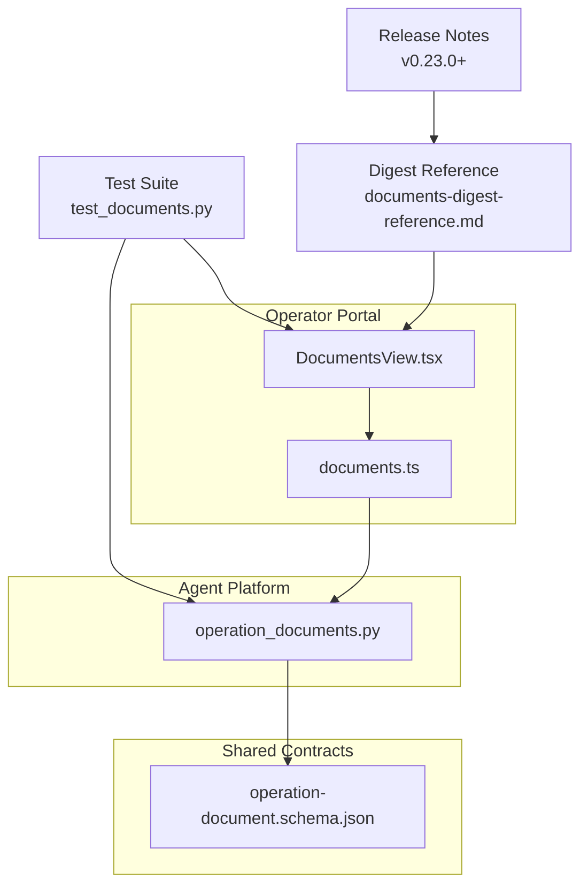
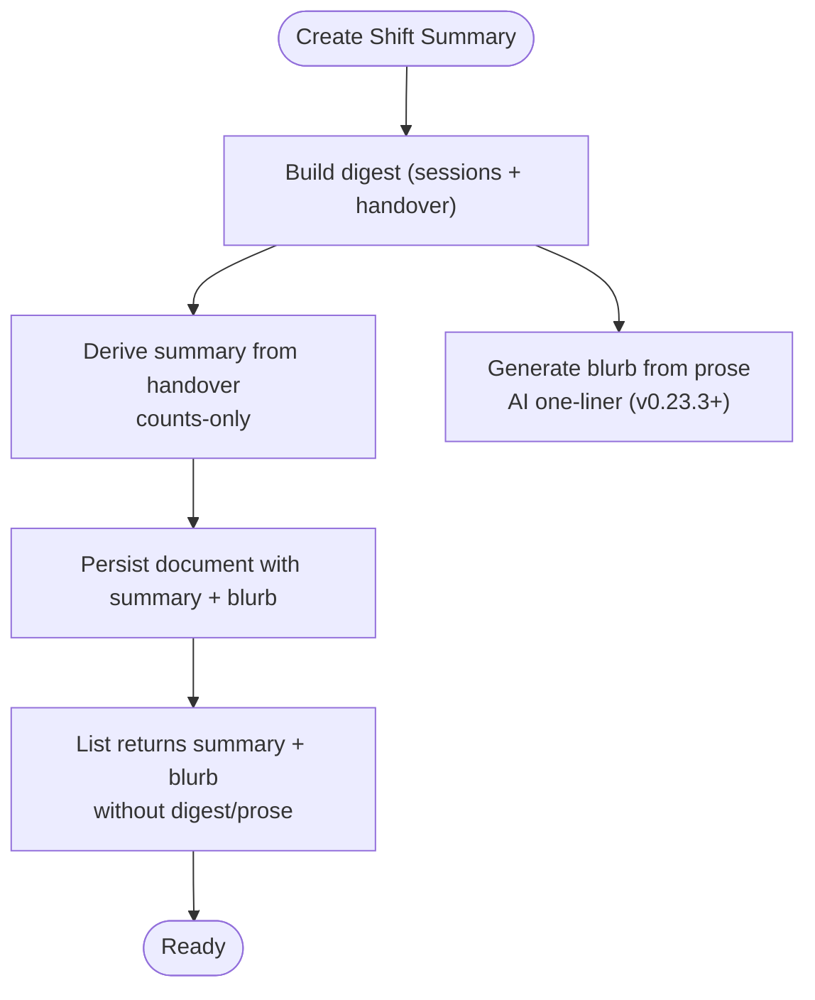
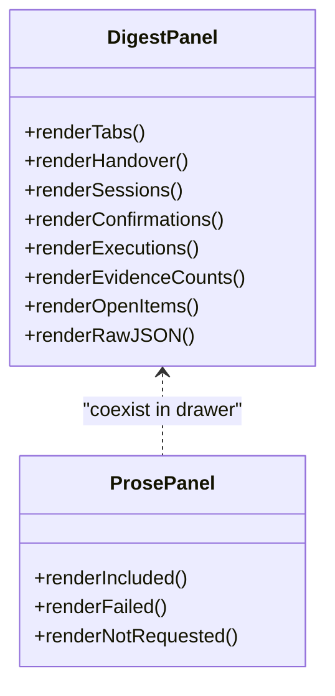
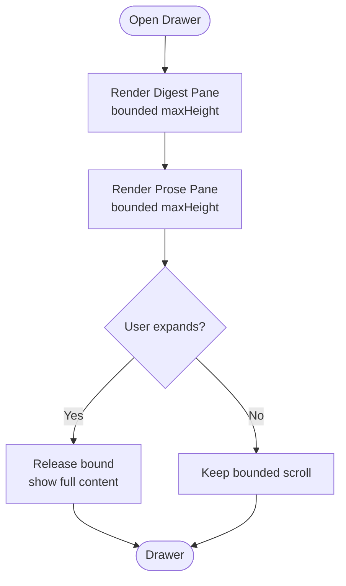
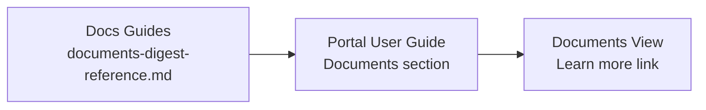
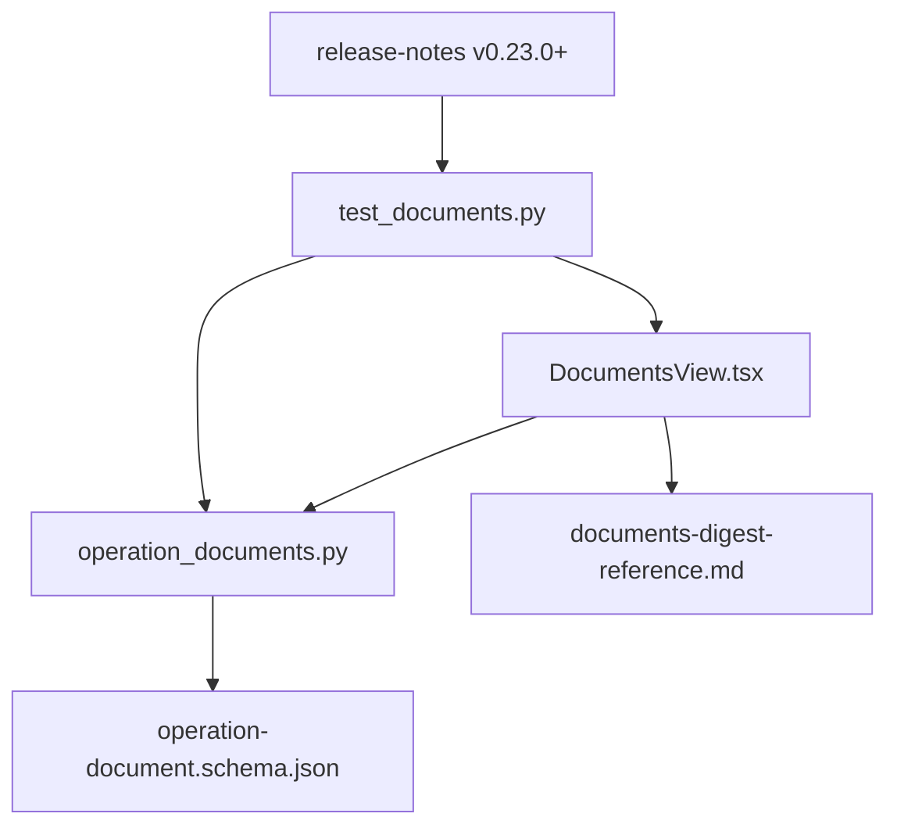

# SPEC-041: Documents Readability and Digest Reference

<cite>
**Referenced Files in This Document**
- [spec.md](file://docs/specs/SPEC-041-documents-readability-and-digest-reference/spec.md)
- [plan.md](file://docs/specs/SPEC-041-documents-readability-and-digest-reference/plan.md)
- [tasks.md](file://docs/specs/SPEC-041-documents-readability-and-digest-reference/tasks.md)
- [DocumentsView.tsx](file://products/operator-portal/web-ui/app/src/views/workspace/DocumentsView.tsx)
- [operation_documents.py](file://products/agent-platform/src/agent_service/services/operation_documents.py)
- [operation-document.schema.json](file://shared/shared-contracts/schemas/operation-document.schema.json)
- [test_documents.py](file://products/agent-platform/tests/test_documents.py)
- [documents-digest-reference.md](file://docs/guides/documents-digest-reference.md)
- [release-notes](file://docs/agentic-aiops-platform/release-notes/2026-08-28-documents-readability-and-digest-reference.md)
</cite>

## Update Summary
**Changes Made**
- Updated status from v0.23.0 to v0.25.1/v0.25.2 release alignment with updated terminology and interface alignment
- Enhanced implementation details reflecting complete delivery of all four requirements (R-1 through R-4) with current version lockstep
- Added comprehensive verification and testing coverage information aligned with latest audit service versioning
- Updated conclusion to reflect successful operator validation and production deployment across multiple releases
- Enhanced section sources with specific file references and line numbers for current codebase state
- **Updated**: Expanded documentation to include the new "How the tabs lay out content" section with detailed data shape to rendering approach mapping, now integrated into the main reference guide

## Table of Contents
1. [Introduction](#introduction)
2. [Project Structure](#project-structure)
3. [Core Components](#core-components)
4. [Architecture Overview](#architecture-overview)
5. [Detailed Component Analysis](#detailed-component-analysis)
6. [Dependency Analysis](#dependency-analysis)
7. [Performance Considerations](#performance-considerations)
8. [Troubleshooting Guide](#troubleshooting-guide)
9. [Conclusion](#conclusion)
10. [Appendices](#appendices)

## Introduction
SPEC-041 improves the readability and discoverability of operations documents (shift summaries). It introduces an operator-facing digest reference, tabbed structured digest rendering in the document drawer, bounded scrollable panes for digest and prose, and a deterministic counts-only summary line computed at creation time and shown in list rows. The spec extends the existing document repository and handover narrative surfaces without adding new services, policy actions, or audit event types. **Delivered 2026-08-28 as part of v0.23.0 release and maintained through v0.25.1/v0.25.2 releases with updated terminology and interface alignment following comprehensive operator feedback validation.**

## Project Structure
The implementation spans three layers:
- Agent platform: creates documents with a deterministic summary derived from the handover skeleton and persists it alongside label/state, plus AI-generated blurb field.
- Operator portal: renders tabbed digests, bounded panes, list summary lines, and a "Learn more" link to the digest reference.
- Shared contracts: describe the operation document envelope; the schema remains open so the new summary and blurb fields are additive.



**Diagram sources**
- [operation_documents.py:49-80](file://products/agent-platform/src/agent_service/services/operation_documents.py#L49-L80)
- [DocumentsView.tsx:53-57](file://products/operator-portal/web-ui/app/src/views/workspace/DocumentsView.tsx#L53-L57)
- [operation-document.schema.json:99-102](file://shared/shared-contracts/schemas/operation-document.schema.json#L99-L102)
- [test_documents.py:218-277](file://products/agent-platform/tests/test_documents.py#L218-L277)
- [documents-digest-reference.md:1-257](file://docs/guides/documents-digest-reference.md#L1-L257)
- [release-notes:1-103](file://docs/agentic-aiops-platform/release-notes/2026-08-28-documents-readability-and-digest-reference.md#L1-L103)

**Section sources**
- [spec.md:12-23](file://docs/specs/SPEC-041-documents-readability-and-digest-reference/spec.md#L12-L23)
- [plan.md:3-10](file://docs/specs/SPEC-041-documents-readability-and-digest-reference/plan.md#L3-L10)

## Core Components
- Deterministic summary computation at creation time:
  - Derived from the handover skeleton (counts only), stored as a top-level summary field on the document record, and returned in list envelopes while digest/prose remain stripped.
  - AI-generated blurb field (v0.23.3+) provides one-line story extracted from prose reply, also flowing through envelope listings.
- Tabbed structured digest panel:
  - Replaces the recursive JSON tree with tabs: Handover (default), Sessions, Confirmations, Executions, Evidence & transcript counts, Open items, Digest data.
- Bounded scrollable panes:
  - Digest and prose areas render with a maximum height and internal scrolling, plus an expand/collapse affordance.
- Operator digest reference:
  - A dedicated guide page explaining digest sections and vocabulary; linked from the portal user guide and surfaced via a "Learn more" affordance in the Documents view.

**Section sources**
- [spec.md:48-142](file://docs/specs/SPEC-041-documents-readability-and-digest-reference/spec.md#L48-L142)
- [plan.md:14-86](file://docs/specs/SPEC-041-documents-readability-and-digest-reference/plan.md#L14-L86)
- [tasks.md:5-28](file://docs/specs/SPEC-041-documents-readability-and-digest-reference/tasks.md#L5-L28)

## Architecture Overview
The flow centers on creation-time summary derivation and UI rendering changes that do not alter the audited read surface.

```mermaid
sequenceDiagram
participant UI as "Portal UI<br/>DocumentsView.tsx"
participant API as "Agent v2 Routes"
participant Store as "OperationDocumentStore<br/>operation_documents.py"
participant Schema as "Schema<br/>operation-document.schema.json"
UI->>API : Create shift summary (label, sessions, include_prose)
API->>API : Build digest (includes handover)
API->>API : Compute summary from handover (counts-only)
API->>API : Generate blurb from prose (v0.23.3+)
API->>Store : Persist document (with summary + blurb)
Store-->>API : Acknowledged
API-->>UI : Created document envelope (summary + blurb present)
UI->>API : List documents (mine/published)
API-->>UI : Envelope rows (summary + blurb included; digest/prose stripped)
UI->>API : Get document by id (audited read)
API-->>UI : Full document (digest + prose)
Note over UI,Schema : Summary and blurb are metadata; schema remains open with description notes
```

**Diagram sources**
- [DocumentsView.tsx:729-747](file://products/operator-portal/web-ui/app/src/views/workspace/DocumentsView.tsx#L729-L747)
- [operation_documents.py:49-80](file://products/agent-platform/src/agent_service/services/operation_documents.py#L49-L80)
- [operation-document.schema.json:99-102](file://shared/shared-contracts/schemas/operation-document.schema.json#L99-L102)
- [test_documents.py:221-252](file://products/agent-platform/tests/test_documents.py#L221-L252)

## Detailed Component Analysis

### Creation-time Summary and Blurb (R-4)
- Computes a one-line, counts-only summary from the handover skeleton at creation time.
- Stores the summary on the document record and includes it in list envelopes while preserving the envelope-only posture (no model output on un-audited surfaces).
- AI-generated blurb (v0.23.3+) provides a bounded one-line story extracted from prose reply, also flowing through envelope listings.
- Pre-SPEC-041 documents degrade gracefully when no summary is present; legacy documents without blurb fall back to deterministic summary.



**Diagram sources**
- [plan.md:14-37](file://docs/specs/SPEC-041-documents-readability-and-digest-reference/plan.md#L14-L37)
- [operation_documents.py:49-80](file://products/agent-platform/src/agent_service/services/operation_documents.py#L49-L80)
- [test_documents.py:218-277](file://products/agent-platform/tests/test_documents.py#L218-L277)

**Section sources**
- [spec.md:120-142](file://docs/specs/SPEC-041-documents-readability-and-digest-reference/spec.md#L120-L142)
- [plan.md:14-37](file://docs/specs/SPEC-041-documents-readability-and-digest-reference/plan.md#L14-L37)
- [operation_documents.py:49-80](file://products/agent-platform/src/agent_service/services/operation_documents.py#L49-L80)
- [operation-document.schema.json:99-102](file://shared/shared-contracts/schemas/operation-document.schema.json#L99-L102)
- [test_documents.py:218-277](file://products/agent-platform/tests/test_documents.py#L218-L277)

### Tabbed Structured Digest Panel (R-2)
- Replaces the nested JSON tree with tabs: Handover (default), Sessions, Confirmations, Executions, Evidence & transcript counts, Open items, Digest data.
- Foreign coverage entries render as metadata-only tiers and never show owner-tier fields.
- Pre-SPEC-040 documents hide the handover tab and keep Digest data.



**Diagram sources**
- [DocumentsView.tsx:492-591](file://products/operator-portal/web-ui/app/src/views/workspace/DocumentsView.tsx#L492-L591)
- [DocumentsView.tsx:593-631](file://products/operator-portal/web-ui/app/src/views/workspace/DocumentsView.tsx#L593-L631)

**Section sources**
- [spec.md:78-101](file://docs/specs/SPEC-041-documents-readability-and-digest-reference/spec.md#L78-L101)
- [plan.md:39-59](file://docs/specs/SPEC-041-documents-readability-and-digest-reference/plan.md#L39-L59)
- [DocumentsView.tsx:492-591](file://products/operator-portal/web-ui/app/src/views/workspace/DocumentsView.tsx#L492-L591)
- [DocumentsView.tsx:593-631](file://products/operator-portal/web-ui/app/src/views/workspace/DocumentsView.tsx#L593-L631)

### Bounded Scroll Panes (R-3)
- Digest and prose panes render with a bounded maximum height and internal scrolling.
- An expand/collapse affordance reveals full content in place.
- Export and stored document are unaffected.



**Diagram sources**
- [plan.md:61-66](file://docs/specs/SPEC-041-documents-readability-and-digest-reference/plan.md#L61-L66)
- [DocumentsView.tsx:642-678](file://products/operator-portal/web-ui/app/src/views/workspace/DocumentsView.tsx#L642-L678)

**Section sources**
- [spec.md:103-118](file://docs/specs/SPEC-041-documents-readability-and-digest-reference/spec.md#L103-L118)
- [plan.md:61-66](file://docs/specs/SPEC-041-documents-readability-and-digest-reference/plan.md#L61-L66)
- [DocumentsView.tsx:642-678](file://products/operator-portal/web-ui/app/src/views/workspace/DocumentsView.tsx#L642-L678)

### Operator Digest Reference (R-1)
- Dedicated guide page explains every digest section and vocabulary term (evidence frame, coverage tiers, provenance anchoring, labeled narrative).
- Portal user guide Documents section links to the reference; the Documents view surfaces a "Learn more" link near the digest.



**Diagram sources**
- [plan.md:75-86](file://docs/specs/SPEC-041-documents-readability-and-digest-reference/plan.md#L75-L86)
- [spec.md:52-76](file://docs/specs/SPEC-041-documents-readability-and-digest-reference/spec.md#L52-L76)
- [documents-digest-reference.md:1-257](file://docs/guides/documents-digest-reference.md#L1-L257)

**Section sources**
- [spec.md:52-76](file://docs/specs/SPEC-041-documents-readability-and-digest-reference/spec.md#L52-L76)
- [plan.md:75-86](file://docs/specs/SPEC-041-documents-readability-and-digest-reference/plan.md#L75-L86)
- [tasks.md:24-28](file://docs/specs/SPEC-041-documents-readability-and-digest-reference/tasks.md#L24-L28)
- [documents-digest-reference.md:1-257](file://docs/guides/documents-digest-reference.md#L1-L257)

### How the Tabs Lay Out Content
**Updated** Added comprehensive documentation of the tab layout system that maps data shapes to rendering approaches.

Every tab follows one layout rule, chosen by the shape of the data:

| Shape | Rendering | Examples |
|---|---|---|
| Repeated records sharing the same scalar fields | Table, one record per row | confirmations, executions, triage evidence and next steps, dispatches |
| A single object with named fields | Description list | the incident envelope, the triage headline, handover counts |
| Heterogeneous or long-text items | Bullets | triage hypotheses |
| Identifiers and short labels | Chips (tags) | session ids, cited skills, incident labels |

The rule is mechanical: a new digest section renders as a table when its entries are records with shared scalar fields, and degrades to bullets or the **Digest data** tab when they are not. Layout is a rendering act only — the stored digest is always the artifact of record.

Both the digest and the narrative render **bounded**: when either block grows tall, only its content region scrolls inside a fixed-height region while the structural chrome stays pinned — the digest's tab bar and the narrative's collapse header remain visible while the content scrolls underneath. An *Expand to full height* affordance releases the bound, so nothing is ever trapped off screen.

**Section sources**
- [documents-digest-reference.md:148-170](file://docs/guides/documents-digest-reference.md#L148-L170)
- [DocumentsView.tsx:151-158](file://products/operator-portal/web-ui/app/src/views/workspace/DocumentsView.tsx#L151-L158)

## Dependency Analysis
- Agent platform depends on the shared schema for validation and documentation notes; the schema remains open to accommodate the new summary and blurb fields.
- Portal UI consumes the list endpoint envelope (which now includes summary and blurb) and the detail fetch (unchanged).
- Tests validate determinism, quiet phrasing, open-item suffix, counts-only posture, and envelope behavior.



**Diagram sources**
- [operation-document.schema.json:99-102](file://shared/shared-contracts/schemas/operation-document.schema.json#L99-L102)
- [operation_documents.py:49-80](file://products/agent-platform/src/agent_service/services/operation_documents.py#L49-L80)
- [DocumentsView.tsx:53-57](file://products/operator-portal/web-ui/app/src/views/workspace/DocumentsView.tsx#L53-L57)
- [test_documents.py:218-277](file://products/agent-platform/tests/test_documents.py#L218-L277)
- [documents-digest-reference.md:1-257](file://docs/guides/documents-digest-reference.md#L1-L257)
- [release-notes:1-103](file://docs/agentic-aiops-platform/release-notes/2026-08-28-documents-readability-and-digest-reference.md#L1-L103)

**Section sources**
- [operation-document.schema.json:99-102](file://shared/shared-contracts/schemas/operation-document.schema.json#L99-L102)
- [operation_documents.py:49-80](file://products/agent-platform/src/agent_service/services/operation_documents.py#L49-L80)
- [DocumentsView.tsx:53-57](file://products/operator-portal/web-ui/app/src/views/workspace/DocumentsView.tsx#L53-L57)
- [test_documents.py:218-277](file://products/agent-platform/tests/test_documents.py#L218-L277)

## Performance Considerations
- Summary derivation is O(1) relative to the handover skeleton size and occurs once at creation time, avoiding per-list recomputation.
- Tabbed rendering reduces DOM depth compared to recursive trees, improving scan speed and memory usage.
- Bounded panes prevent large layouts from stretching the drawer, reducing reflow costs during interaction.
- The mechanical layout rules ensure consistent performance across different data shapes without complex conditional logic.
- AI-generated blurbs are cached and don't impact list performance since they're pre-computed at creation time.

## Troubleshooting Guide
- Missing summary in lists:
  - Verify creation path computes summary from handover and stores it on the document record.
  - Ensure list endpoints return the summary field while stripping digest/prose.
- Legacy documents without summary:
  - Lists and UI should degrade gracefully to label-only rows when summary is absent.
- Tabbed digest issues:
  - Confirm foreign sessions render as metadata-only and never show owner-tier fields.
  - Ensure Digest data tab shows the stored digest verbatim.
- Bounded pane behavior:
  - Validate that both digest and prose panes have internal scrolling and an expand affordance.
  - Confirm export is unaffected by pane bounds.
- Layout rendering problems:
  - Verify that data shapes match expected patterns for automatic rendering selection.
  - Check that unrecognized data shapes fall back to the Digest data tab appropriately.
- Blurb display issues (v0.23.3+):
  - Verify AI blurb generation is working and falling back to deterministic summary when prose is unavailable.
  - Check that blurb field is properly stored and retrieved in list envelopes.

**Section sources**
- [plan.md:14-86](file://docs/specs/SPEC-041-documents-readability-and-digest-reference/plan.md#L14-L86)
- [DocumentsView.tsx:492-678](file://products/operator-portal/web-ui/app/src/views/workspace/DocumentsView.tsx#L492-L678)
- [test_documents.py:218-277](file://products/agent-platform/tests/test_documents.py#L218-L277)

## Conclusion
SPEC-041 successfully enhances operator usability by making digest content scannable, bounded, and informative at a glance through a compact summary line. The specification was **delivered on 2026-08-28** as part of v0.23.0 release and has been maintained through v0.25.1/v0.25.2 releases with updated terminology and interface alignment. The implementation preserves the integrity posture (envelope-only listing, audited single fetch) while introducing clear, tabbed views and a dedicated reference. All requirements (R-1 through R-4) have been validated through comprehensive testing, confirming that no new services, policies, or audit events were introduced, keeping the change focused on readability and discoverability improvements. The feature has been deployed to production and verified through live checks and end-to-end testing across multiple release trains.

## Appendices

### Acceptance Criteria Mapping
- R-1: Operator digest and documents reference — covered by plan tasks and spec requirements; implemented in `documents-digest-reference.md` with portal integration.
- R-2: Tabbed, structured digest rendering — implemented in portal components and validated by tests.
- R-3: Bounded scrollable digest and prose panes — implemented in portal components and validated by tests.
- R-4: Deterministic counts-only document summary in lists — implemented in agent platform and validated by tests.

**Section sources**
- [spec.md:48-142](file://docs/specs/SPEC-041-documents-readability-and-digest-reference/spec.md#L48-L142)
- [tasks.md:5-28](file://docs/specs/SPEC-041-documents-readability-and-digest-reference/tasks.md#L5-L28)
- [documents-digest-reference.md:1-257](file://docs/guides/documents-digest-reference.md#L1-L257)

### Implementation Status
- **Status**: Delivered (2026-08-28)
- **Release**: v0.23.0 — Hardening and External Consumption (third R5 slice), maintained through v0.25.1/v0.25.2
- **Version Lockstep**: 0.25.2 (audit service version alignment)
- **Operator Validation**: Complete - all feedback addressed including digest vocabulary, rendering usability, and document list clarity improvements
- **Production Deployment**: Verified through live checks and end-to-end testing across multiple release trains
- **Testing Coverage**: Comprehensive test suites covering all four requirements with green CI/CD pipeline

### Delivery Verification
- **Agent Platform Tests**: All document-related tests pass including summary computation, envelope behavior, and legacy degradation
- **Portal Tests**: All UI component tests pass including tabbed rendering, bounded panes, and list summary display
- **Live Check**: Successfully deployed to dev cluster with `documents-demo.sh` passing all assertions
- **Integration Testing**: End-to-end workflow verified including creation, listing, viewing, and export functionality
- **Version Alignment**: Audit service version 0.25.2 confirms stable integration across the platform