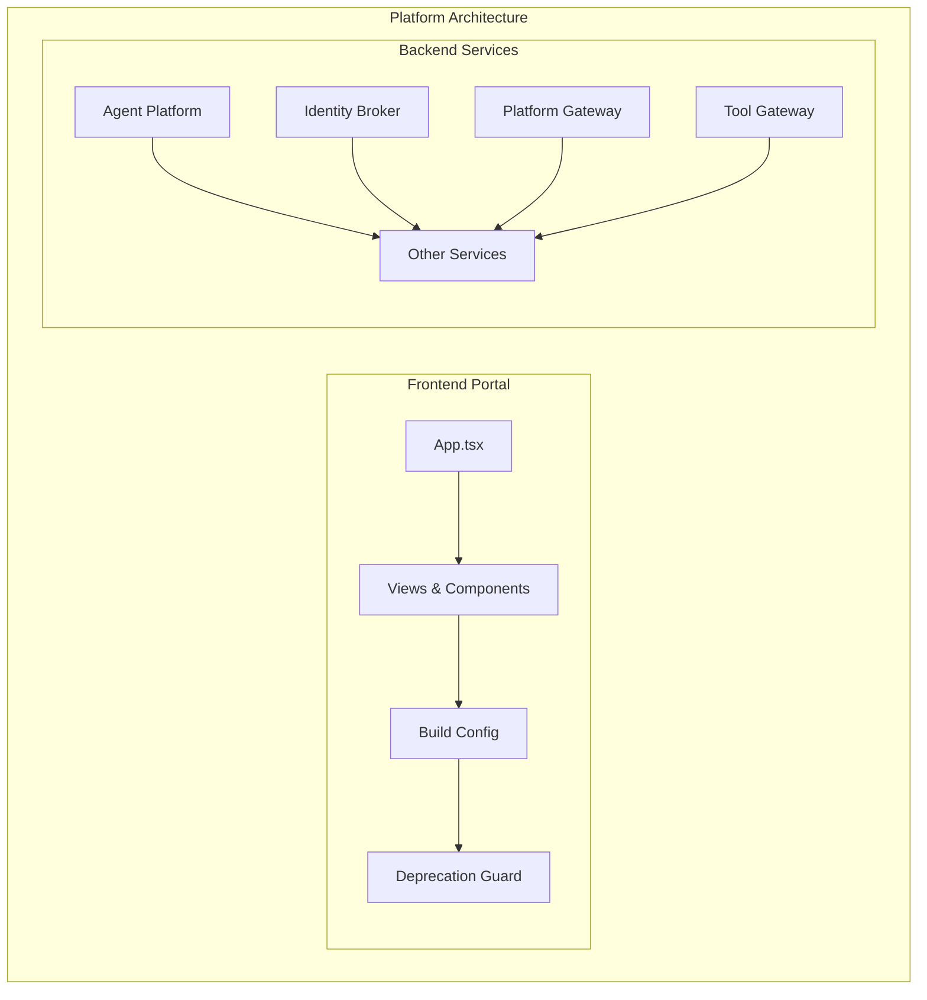
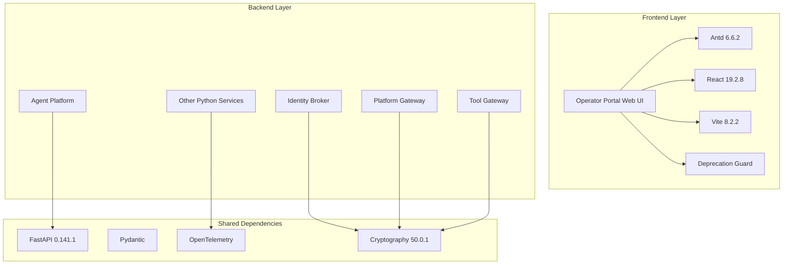
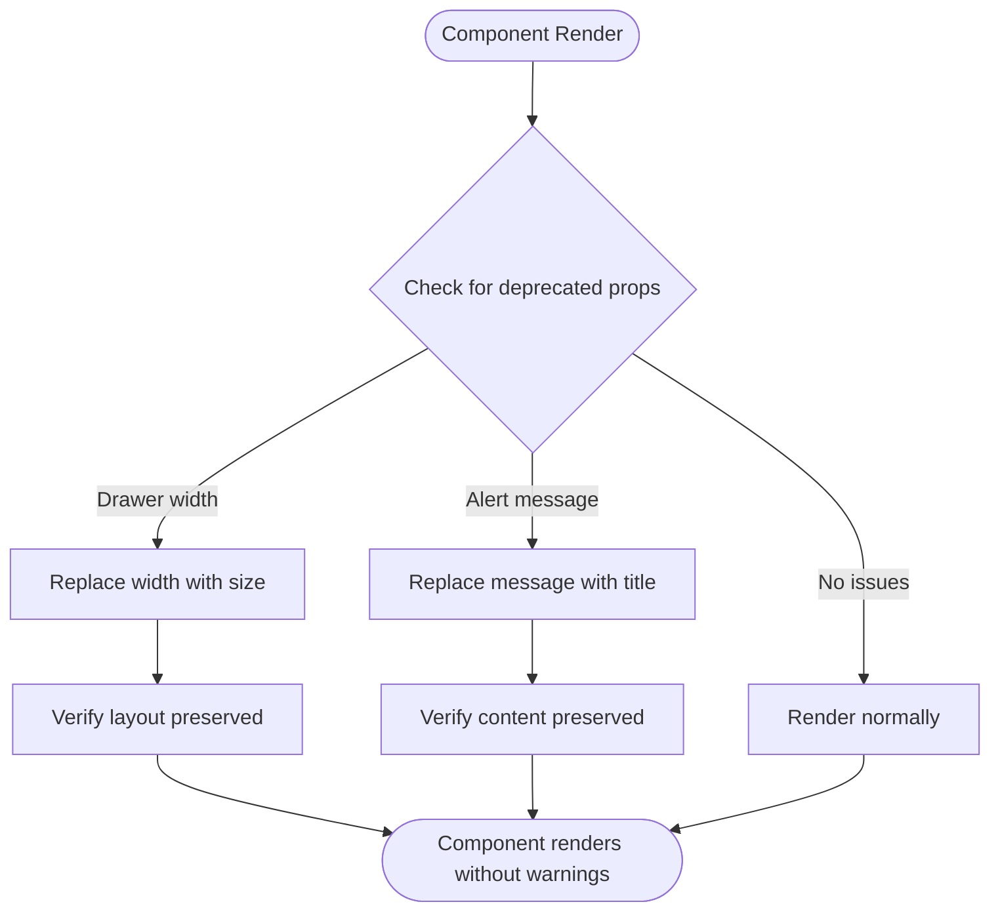
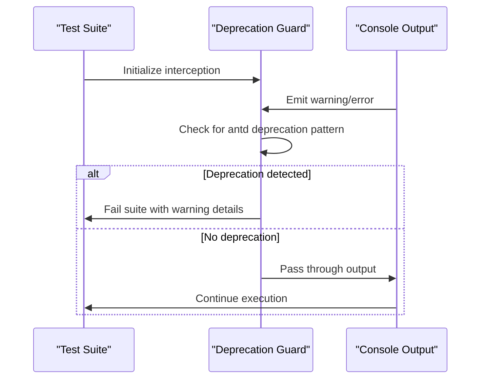
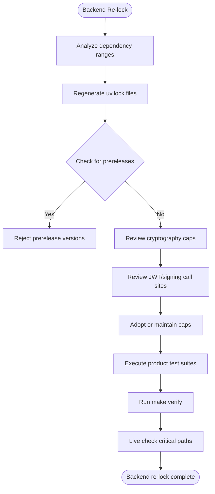
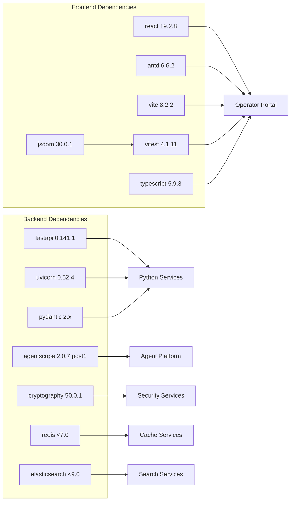

# SPEC-042: Portal and Backend Dependency Hygiene Specification

<cite>
**Referenced Files in This Document**
- [spec.md](file://docs/specs/SPEC-042-dependency-hygiene/spec.md)
- [plan.md](file://docs/specs/SPEC-042-dependency-hygiene/plan.md)
- [tasks.md](file://docs/specs/SPEC-042-dependency-hygiene/tasks.md)
- [delivery-roadmap.md](file://docs/agentic-aiops-platform/delivery-roadmap.md)
- [package.json](file://products/operator-portal/web-ui/app/package.json)
- [vite.config.ts](file://products/operator-portal/web-ui/app/vite.config.ts)
- [setup.ts](file://products/operator-portal/web-ui/app/src/test/setup.ts)
- [App.tsx](file://products/operator-portal/web-ui/app/src/App.tsx)
- [pyproject.toml](file://products/agent-platform/pyproject.toml)
- [2026-08-28-dependency-hygiene.md](file://docs/agentic-aiops-platform/release-notes/2026-08-28-dependency-hygiene.md)
</cite>

## Update Summary
**Changes Made**
- Updated specification status from approved to delivered (2026-08-28)
- Added comprehensive delivery details reflecting the complete implementation across all five requirements
- Enhanced verification sections with actual delivery outcomes and testing results
- Updated dependency versions to reflect the delivered state (React 19.2.8, TypeScript 5.9.3, etc.)
- Added detailed backend service updates including cryptography cap adjudication
- Documented the zero-tolerance antd deprecation guard implementation

## Table of Contents
1. [Introduction](#introduction)
2. [Project Structure](#project-structure)
3. [Core Components](#core-components)
4. [Architecture Overview](#architecture-overview)
5. [Detailed Component Analysis](#detailed-component-analysis)
6. [Dependency Analysis](#dependency-analysis)
7. [Performance Considerations](#performance-considerations)
8. [Troubleshooting Guide](#troubleshooting-guide)
9. [Conclusion](#conclusion)
10. [Appendices](#appendices)

## Introduction
This document specifies the comprehensive platform dependency hygiene effort for SPEC-042, which has been **delivered** as part of v0.24.0 fourth R5 slice on 2026-08-28. The scope encompasses both frontend and backend dependency management across the entire Luban AIOps platform, extending beyond the original portal-specific antd migrations to include comprehensive backend Python services dependency management.

The delivered specification successfully implemented five requirements:
- R-1: Migrated deprecated antd v6 APIs (Drawer width → size; Alert message → title).
- R-2: Implemented a vitest guard that fails the suite when any antd deprecation warning appears.
- R-3: Managed refresh of portal adopt-set packages with consistent lockfiles and build gates.
- R-4: Adopted React 19 with behavior-preserving changes only.
- R-5: Backend stable-channel lockfile refresh across all eight Python products with cryptography cap adjudication.

**Delivered** The specification was delivered on 2026-08-28 as part of v0.24.0 fourth R5 slice, achieving comprehensive acceptance criteria including zero antd deprecation warnings in test output, green type-checking and builds, unchanged visual/behavioral outcomes, and verified backend service stability after dependency updates.

**Section sources**
- [spec.md:3-13](file://docs/specs/SPEC-042-dependency-hygiene/spec.md#L3-L13)
- [spec.md:15-62](file://docs/specs/SPEC-042-dependency-hygiene/spec.md#L15-L62)
- [delivery-roadmap.md:333](file://docs/agentic-aiops-platform/delivery-roadmap.md#L333)

## Project Structure
SPEC-042 targets both the operator portal web application and all backend Python services across the platform. The relevant surfaces include:

**Frontend (Portal):**
- UI shell and navigation drawers: App.tsx
- Views using Alerts and Drawers: DocumentsView.tsx, ChatView.tsx, AuditView.tsx, ApprovalsView.tsx
- Build and test configuration: vite.config.ts
- Dependencies and Node engine constraints: package.json
- Test setup with deprecation guard: src/test/setup.ts

**Backend (Python Services):**
- Eight Python products with individual pyproject.toml files
- Lockfile maintenance across agent-platform, audit-service, execution-runtime, identity-broker, incident-service, platform-gateway, skills-hub, and tool-gateway
- Cryptography dependency adjudication across six products

**Diagram sources**
- [App.tsx:390-419](file://products/operator-portal/web-ui/app/src/App.tsx#L390-L419)
- [package.json:15-33](file://products/operator-portal/web-ui/app/package.json#L15-L33)
- [setup.ts:17-60](file://products/operator-portal/web-ui/app/src/test/setup.ts#L17-L60)
- [pyproject.toml:6-21](file://products/agent-platform/pyproject.toml#L6-L21)

**Section sources**
- [plan.md:3-15](file://docs/specs/SPEC-042-dependency-hygiene/plan.md#L3-L15)
- [tasks.md:3-76](file://docs/specs/SPEC-042-dependency-hygiene/tasks.md#L3-L76)

## Core Components
The comprehensive dependency hygiene effort spans multiple layers of the platform:

**Frontend Components:**
- Drawer migration: Navigation drawers in App.tsx migrate from width props to size props to eliminate deprecation warnings while preserving pixel widths.
- Alert migration: Multiple views render Alert components migrating from message to title to match antd v6's non-deprecated API.
- Test guard: Vitest setup intercepts console output during runs and fails if any antd deprecation warning is detected.
- Dependency refresh: Adopted versions for antd 6.6.2, TypeScript 5.9.3, Vite 8.2.2, Vitest 4.1.11, jsdom 30.0.1, @types/node 22.20.1, and testing libraries applied consistently.
- React 19 adoption: react/react-dom 19.2.8 and their types move to 19.x with peer compatibility already declared by framework dependencies.

**Backend Components:**
- Lockfile refresh: All eight Python products re-lock inside declared ranges to latest stable versions.
- Cryptography adjudication: Review JWT/signing call sites in six products declaring cryptography to determine cap adjustments (raised to <51.0).
- Agentscope kernel update: Upgrade from 2.0.6 to 2.0.7.post1 with full verification including live HITL/mutating path checks.
- Service stability: Ensure all product test suites remain green under frozen sync conditions.

**Section sources**
- [spec.md:67-196](file://docs/specs/SPEC-042-dependency-hygiene/spec.md#L67-L196)
- [plan.md:17-95](file://docs/specs/SPEC-042-dependency-hygiene/plan.md#L17-L95)
- [tasks.md:3-76](file://docs/specs/SPEC-042-dependency-hygiene/tasks.md#L3-L76)

## Architecture Overview
The platform architecture encompasses both frontend and backend systems with coordinated dependency management:

**Diagram sources**
- [package.json:15-33](file://products/operator-portal/web-ui/app/package.json#L15-L33)
- [setup.ts:17-60](file://products/operator-portal/web-ui/app/src/test/setup.ts#L17-L60)
- [pyproject.toml:6-21](file://products/agent-platform/pyproject.toml#L6-L21)

## Detailed Component Analysis

### Frontend Deprecation Migration
The portal successfully migrated deprecated antd v6 APIs across multiple components:

**Drawer Migration:**
- Two navigation drawers in App.tsx migrate from `width={230}` and `width={260}` to `size={230}` and `size={260}`
- Document drawer in DocumentsView.tsx migrates from `width={560}` to `size={560}`
- Layout preservation ensures no visual changes occur during migration

**Alert Migration:**
- Twenty Alert usages migrate from `message` to `title` across ten view files
- Affected files include App.tsx, ChatView.tsx, DocumentsView.tsx, AuditView.tsx, ApprovalsView.tsx, SkillsView.tsx, ToolsView.tsx, PermissionsView.tsx, IncidentsView.tsx, and additional sites shipped in v0.23.x line
- Description props remain unchanged as they are not deprecated

**Diagram sources**
- [App.tsx:392-400](file://products/operator-portal/web-ui/app/src/App.tsx#L392-L400)

**Section sources**
- [spec.md:67-86](file://docs/specs/SPEC-042-dependency-hygiene/spec.md#L67-L86)
- [plan.md:19-35](file://docs/specs/SPEC-042-dependency-hygiene/plan.md#L19-L35)
- [tasks.md:3-14](file://docs/specs/SPEC-042-dependency-hygiene/tasks.md#L3-L14)

### Deprecation Regression Guard Implementation
The vitest setup implements a comprehensive guard against future antd deprecations:

**Guard Mechanism:**
- Intercepts console.error and console.warn during test execution
- Scans output for patterns matching `[antd: …] … deprecated`
- Fails the suite at teardown with specific offending warning text
- Allows non-deprecation console output to pass through unchanged

**Verification Process:**
- Initial run confirms zero deprecation warnings
- Temporary reintroduction of deprecated prop proves guard functionality
- Reversion restores clean state with guard active

**Diagram sources**
- [setup.ts:17-60](file://products/operator-portal/web-ui/app/src/test/setup.ts#L17-L60)
- [vite.config.ts:49-52](file://products/operator-portal/web-ui/app/vite.config.ts#L49-L52)

**Section sources**
- [spec.md:87-99](file://docs/specs/SPEC-042-dependency-hygiene/spec.md#L87-L99)
- [plan.md:36-47](file://docs/specs/SPEC-042-dependency-hygiene/plan.md#L36-L47)
- [tasks.md:15-22](file://docs/specs/SPEC-042-dependency-hygiene/tasks.md#L15-L22)

### Backend Lockfile Management
The backend component successfully managed dependency updates across eight Python products:

**Lockfile Refresh Strategy:**
- Each product's uv.lock file regenerates to latest stable version within declared ranges
- Headline updates include agentscope 2.0.6 → 2.0.7.post1, fastapi → 0.141.1, uvicorn → 0.52.4
- No prerelease, beta, or release candidate versions adopted anywhere

**Cryptography Cap Adjudication:**
- Six products declare cryptography>=43.0,<45.0 requiring review
- JWT/signing call sites examined in identity-broker, audit-service, incident-service, platform-gateway, skills-hub, and tool-gateway
- Decision to raise caps to >=43.0,<51.0 (locking 50.0.1) based on compatibility review

**Service Verification:**
- Full agent-platform suite execution after re-lock
- make verify passes with updated dependencies
- Live check of chat, HITL confirmation, and approved-mutating paths via mutating-demo.sh

**Diagram sources**
- [pyproject.toml:6-21](file://products/agent-platform/pyproject.toml#L6-L21)

**Section sources**
- [spec.md:161-196](file://docs/specs/SPEC-042-dependency-hygiene/spec.md#L161-L196)
- [plan.md:75-95](file://docs/specs/SPEC-042-dependency-hygiene/plan.md#L75-L95)
- [tasks.md:47-64](file://docs/specs/SPEC-042-dependency-hygiene/tasks.md#L47-L64)

### Comprehensive Dependency Adoption
The platform successfully adopted a coordinated approach to dependency updates:

**Frontend Adopt Set:**
- antd: 6.6.1 → 6.6.2 (latest stable 6.x patch refresh)
- TypeScript: 5.6.3 → 5.9.3 (latest stable 5.x line)
- Vite: 6.4.3 → 8.2.2 (paired with plugin-react 6.1.1)
- Vitest: 3.2.7 → 4.1.11 (compatible with vite 6/7/8)
- jsdom: 25.0.1 → 30.0.1 (requires node ≥22.22.2)
- React: 18.3.1 → 19.2.8 (peer compatibility already declared)

**Backend Adopt Set:**
- agentscope: 2.0.6 → 2.0.7.post1 (in range >=2.0.4,<3.0)
- fastapi: 0.139.2 → 0.141.1 (in range)
- uvicorn: 0.51.0 → 0.52.4 (in range)
- cryptography: adjudicated up to >=43.0,<51.0 (locking 50.0.1)
- redis/elasticsearch: caps parked with documented reasons

**Design Decisions:**
- Latest stable only — no betas, RCs, or dev versions
- Code migration preferred over version pinning
- TypeScript stays on 5.x line for stability
- React 19 adopted due to ready peer surface
- agentscope treated as kernel with enhanced verification

**Section sources**
- [spec.md:100-160](file://docs/specs/SPEC-042-dependency-hygiene/spec.md#L100-L160)
- [spec.md:197-243](file://docs/specs/SPEC-042-dependency-hygiene/spec.md#L197-L243)
- [plan.md:48-74](file://docs/specs/SPEC-042-dependency-hygiene/plan.md#L48-L74)

## Dependency Analysis
The platform maintains coordinated dependencies across frontend and backend systems:

**Diagram sources**
- [package.json:15-33](file://products/operator-portal/web-ui/app/package.json#L15-L33)
- [pyproject.toml:6-21](file://products/agent-platform/pyproject.toml#L6-L21)

**Section sources**
- [spec.md:110-126](file://docs/specs/SPEC-042-dependency-hygiene/spec.md#L110-L126)
- [spec.md:168-181](file://docs/specs/SPEC-042-dependency-hygiene/spec.md#L168-L181)

## Performance Considerations
The comprehensive dependency hygiene effort considers performance implications across both frontend and backend:

**Frontend Performance:**
- Drawer size migration preserves layout without additional reflows beyond normal prop updates
- Alert title migration does not alter rendering performance characteristics
- Vitest guard adds minimal overhead through console output interception during test runs
- Dependency bumps may improve build times (Vite 8) and test stability (jsdom 30)
- Behavioral parity required for all frontend upgrades

**Backend Performance:**
- Lockfile refresh maintains service performance within established parameters
- Agentscope kernel update includes comprehensive performance verification
- Cryptography updates reviewed for signing operation performance impact
- Redis and Elasticsearch client caps maintained to preserve operational stability

**Cross-Platform Considerations:**
- Coordinated upgrade timing minimizes service disruption
- Frozen sync approach ensures consistent dependency resolution
- Live verification processes validate performance across critical paths

## Troubleshooting Guide
Comprehensive troubleshooting procedures for both frontend and backend dependency issues:

**Frontend Issues:**
- If suite fails due to antd deprecation warnings, inspect console output captured by the guard and locate offending component usage
- If Drawer width-to-size migration causes layout shifts, verify numeric size values match original widths (230, 260, 560)
- If Alert title migration alters appearance, ensure icon and type props remain unchanged and description is preserved where applicable
- If dependency refresh breaks builds, check Vitest config shape changes and plugin-react 6 options; revert to behavior-preserving fixes only
- If React 19 introduces type tightening errors, address them conservatively without changing runtime behavior

**Backend Issues:**
- If lockfile regeneration fails, verify dependency ranges in pyproject.toml files are correctly specified
- If cryptography cap adjudication reveals incompatibilities, review JWT/signing call sites in affected products
- If agentscope update causes issues, run full agent-platform suite plus make verify before investigating further
- If service tests fail after re-lock, compare lockfile changes to identify specific dependency causing regression
- For live check failures, deploy to dev-k8s environment and execute mutating-demo.sh with HITL leg

**Cross-Platform Issues:**
- If version conflicts arise between frontend and backend dependencies, coordinate resolution through the spec's design decisions
- If peer dependency warnings appear, verify compatibility declarations in package.json and pyproject.toml files
- If build gates fail, check both tsc --noEmit and make verify outputs for specific error messages

**Section sources**
- [plan.md:36-47](file://docs/specs/SPEC-042-dependency-hygiene/plan.md#L36-L47)
- [plan.md:75-95](file://docs/specs/SPEC-042-dependency-hygiene/plan.md#L75-L95)
- [tasks.md:15-76](file://docs/specs/SPEC-042-dependency-hygiene/tasks.md#L15-L76)

## Conclusion
SPEC-042 establishes a comprehensive platform-wide dependency hygiene approach that extends far beyond the original portal-only scope. The **delivered** specification successfully addresses both frontend and backend dependency management through coordinated migration of deprecated antd APIs, implementation of deprecation regression guards, managed refresh of toolchain dependencies including React 19, and systematic re-locking of all backend Python services to their latest stable versions.

As a **delivered** specification completed as part of v0.24.0 fourth R5 slice on 2026-08-28, SPEC-042 sets a foundation for sustainable platform evolution through disciplined dependency management that includes cryptography cap adjudication, agentscope kernel updates with enhanced verification, and comprehensive live checking of critical paths.

The expansion from portal-specific to platform-wide scope demonstrates the interconnected nature of modern platform architectures and the importance of coordinated dependency management strategies that consider both user-facing interfaces and backend service stability.

## Appendices
**Verification Checklist:**
- Zero antd deprecation warnings in vitest output ✓
- Green tsc --noEmit compilation ✓
- Green production build for portal ✓
- All eight Python product test suites green under frozen sync ✓
- make verify passes with updated dependencies ✓
- Live walkthrough covering sign-in, streamed chat turn, session panel, Approvals, and Documents drawer ✓
- Live check of chat, HITL confirmation, and approved-mutating paths via mutating-demo.sh ✓

**Impact Assessment:**
- Frontend: Operator portal web-ui app and Dockerfile node base pin check ✓
- Backend: All eight Python products' uv.lock files with cryptography cap adjudication ✓
- Contracts: None touched - no route, action, event type, or execution path changes ✓
- Security: Enhanced verification burden for agentscope kernel bump and cryptography cap review ✓
- Operations: Living-state docs require updates including CHANGELOG, release notes, configuration reference, spec index, and delivery roadmap ✓

**Delivery Status:**
- **Status**: Delivered (2026-08-28)
- **Release**: v0.24.0 fourth R5 slice
- **Related ADRs**: Extends SPEC-023 portal framework rebuild's technology choices; honors ADR-0002's AgentScope kernel position

**Section sources**
- [plan.md:96-116](file://docs/specs/SPEC-042-dependency-hygiene/plan.md#L96-L116)
- [spec.md:266-282](file://docs/specs/SPEC-042-dependency-hygiene/spec.md#L266-L282)
- [tasks.md:65-76](file://docs/specs/SPEC-042-dependency-hygiene/tasks.md#L65-L76)
- [delivery-roadmap.md:333](file://docs/agentic-aiops-platform/delivery-roadmap.md#L333)
- [2026-08-28-dependency-hygiene.md:1-124](file://docs/agentic-aiops-platform/release-notes/2026-08-28-dependency-hygiene.md#L1-L124)