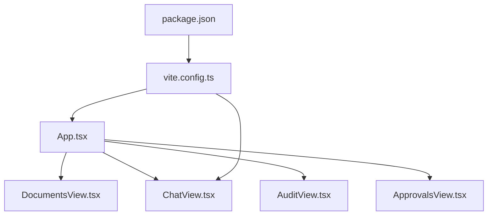
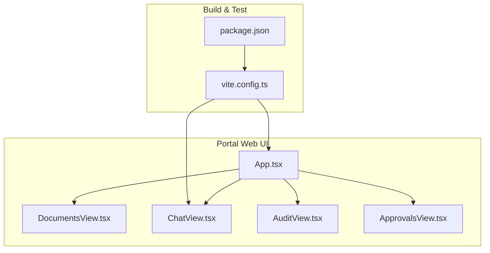
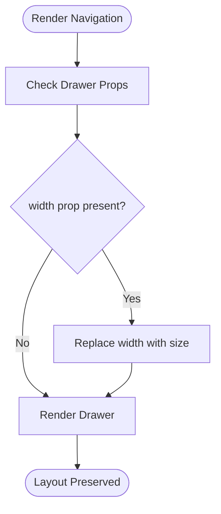
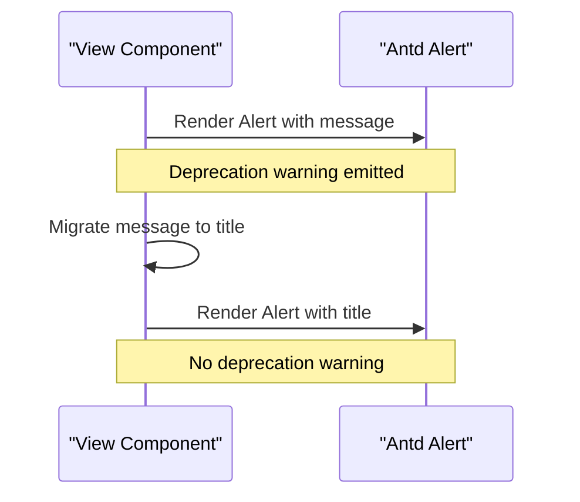
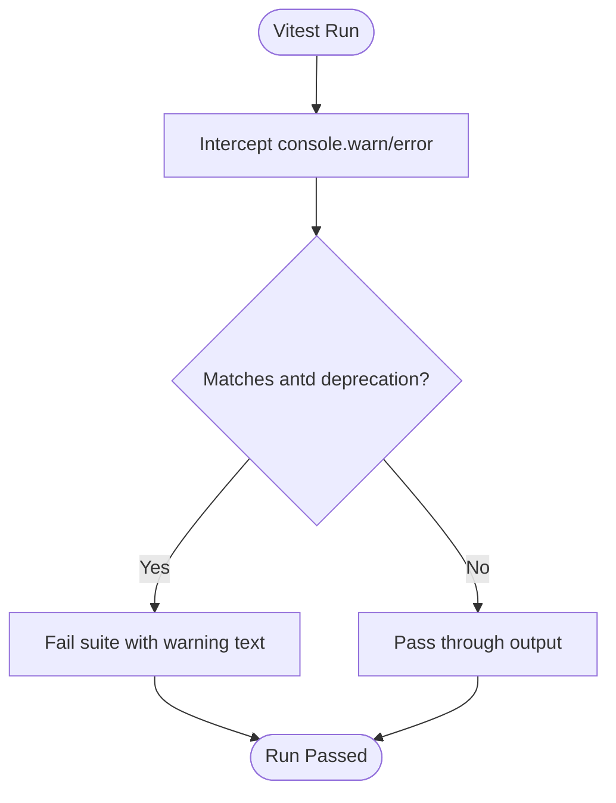
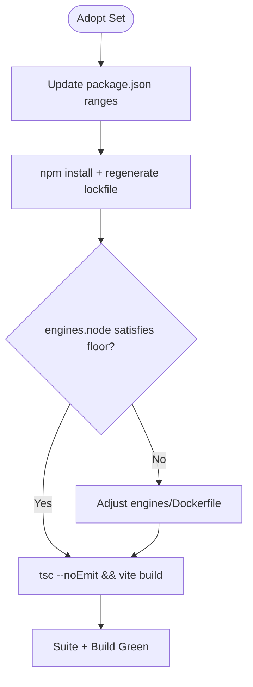
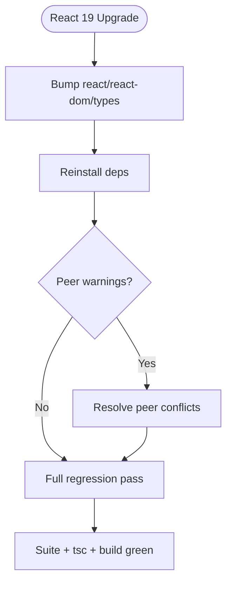
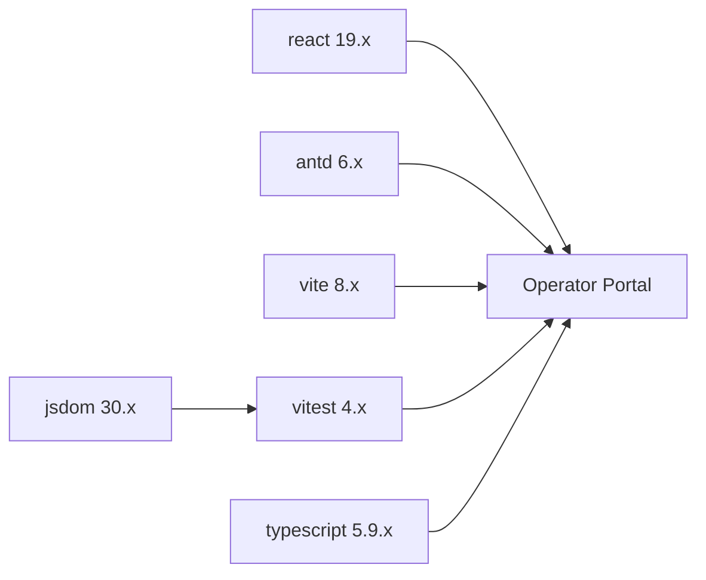

# SPEC-042: Portal Dependency Hygiene Specification

<cite>
**Referenced Files in This Document**
- [spec.md](file://docs/specs/SPEC-042-portal-dependency-hygiene/spec.md)
- [plan.md](file://docs/specs/SPEC-042-portal-dependency-hygiene/plan.md)
- [tasks.md](file://docs/specs/SPEC-042-portal-dependency-hygiene/tasks.md)
- [App.tsx](file://products/operator-portal/web-ui/app/src/App.tsx)
- [DocumentsView.tsx](file://products/operator-portal/web-ui/app/src/views/workspace/DocumentsView.tsx)
- [ChatView.tsx](file://products/operator-portal/web-ui/app/src/chat/ChatView.tsx)
- [AuditView.tsx](file://products/operator-portal/web-ui/app/src/views/audit/AuditView.tsx)
- [ApprovalsView.tsx](file://products/operator-portal/web-ui/app/src/views/control/ApprovalsView.tsx)
- [package.json](file://products/operator-portal/web-ui/app/package.json)
- [vite.config.ts](file://products/operator-portal/web-ui/app/vite.config.ts)
</cite>

## Table of Contents
1. [Introduction](#introduction)
2. [Project Structure](#project-structure)
3. [Core Components](#core-components)
4. [Architecture Overview](#architecture-overview)
5. [Detailed Component Analysis](#detailed-component-analysis)
6. [Dependency Analysis](#dependency-analysis)
7. [Performance Considerations](#performance-considerations)
8. [Troubleshooting Guide](#troubleshooting-guide)
9. [Conclusion](#conclusion)
10. [Appendices](#appendices)

## Introduction
This document specifies the portal dependency hygiene effort for SPEC-042. It focuses on migrating deprecated antd v6 APIs used by the operator portal, adding a deprecation regression guard in tests, and performing a managed refresh of major toolchain dependencies (including React 19). The scope is portal-only; no backend services, contracts, policies, or audit events change.

The spec defines four requirements:
- R-1: Migrate deprecated antd v6 APIs (Drawer width → size; Alert message → title).
- R-2: Add a vitest guard that fails the suite when any antd deprecation warning appears.
- R-3: Managed refresh of adopt-set packages with consistent lockfiles and build gates.
- R-4: Adopt React 19 with behavior-preserving changes only.

Acceptance criteria emphasize zero antd deprecation warnings in test output, green type-checking and builds, and unchanged visual/behavioral outcomes.

**Section sources**
- [spec.md:14-50](file://docs/specs/SPEC-042-portal-dependency-hygiene/spec.md#L14-L50)
- [spec.md:52-147](file://docs/specs/SPEC-042-portal-dependency-hygiene/spec.md#L52-L147)

## Project Structure
SPEC-042 targets the operator portal web application under products/operator-portal/web-ui/app. The relevant surface includes:
- UI shell and navigation drawers: App.tsx
- Views using Alerts and Drawers: DocumentsView.tsx, ChatView.tsx, AuditView.tsx, ApprovalsView.tsx
- Build and test configuration: vite.config.ts
- Dependencies and Node engine constraints: package.json

**Diagram sources**
- [App.tsx:1-419](file://products/operator-portal/web-ui/app/src/App.tsx#L1-L419)
- [DocumentsView.tsx:1-800](file://products/operator-portal/web-ui/app/src/views/workspace/DocumentsView.tsx#L1-L800)
- [ChatView.tsx:1-800](file://products/operator-portal/web-ui/app/src/chat/ChatView.tsx#L1-L800)
- [AuditView.tsx:1-250](file://products/operator-portal/web-ui/app/src/views/audit/AuditView.tsx#L1-L250)
- [ApprovalsView.tsx:1-441](file://products/operator-portal/web-ui/app/src/views/control/ApprovalsView.tsx#L1-L441)
- [vite.config.ts:1-39](file://products/operator-portal/web-ui/app/vite.config.ts#L1-L39)
- [package.json:1-36](file://products/operator-portal/web-ui/app/package.json#L1-L36)

**Section sources**
- [plan.md:3-11](file://docs/specs/SPEC-042-portal-dependency-hygiene/plan.md#L3-L11)
- [tasks.md:5-29](file://docs/specs/SPEC-042-portal-dependency-hygiene/tasks.md#L5-L29)

## Core Components
- Drawer migration: Two navigation drawers in App.tsx use width props that must be migrated to size to eliminate deprecation warnings while preserving pixel widths.
- Alert migration: Multiple views render Alert components with message; these must migrate to title to match antd v6’s non-deprecated API.
- Test guard: A vitest setup intercepts console output during runs and fails if any antd deprecation warning is detected.
- Dependency refresh: Adopted versions for antd, TypeScript, Vite, Vitest, jsdom, @types/node, and testing libraries are applied consistently across package.json and lockfiles.
- React 19 adoption: react/react-dom and their types move to 19.x with peer compatibility already declared by framework dependencies.

**Section sources**
- [spec.md:56-147](file://docs/specs/SPEC-042-portal-dependency-hygiene/spec.md#L56-L147)
- [plan.md:15-67](file://docs/specs/SPEC-042-portal-dependency-hygiene/plan.md#L15-L67)
- [tasks.md:5-29](file://docs/specs/SPEC-042-portal-dependency-hygiene/tasks.md#L5-L29)

## Architecture Overview
The portal architecture centers on a single-page React application built with Vite and tested via Vitest. Antd provides UI primitives; the app composes views for chat, approvals, audit, documents, and control surfaces. The build pipeline injects version metadata and proxies API calls during development.

**Diagram sources**
- [App.tsx:1-419](file://products/operator-portal/web-ui/app/src/App.tsx#L1-L419)
- [DocumentsView.tsx:1-800](file://products/operator-portal/web-ui/app/src/views/workspace/DocumentsView.tsx#L1-L800)
- [ChatView.tsx:1-800](file://products/operator-portal/web-ui/app/src/chat/ChatView.tsx#L1-L800)
- [AuditView.tsx:1-250](file://products/operator-portal/web-ui/app/src/views/audit/AuditView.tsx#L1-L250)
- [ApprovalsView.tsx:1-441](file://products/operator-portal/web-ui/app/src/views/control/ApprovalsView.tsx#L1-L441)
- [vite.config.ts:1-39](file://products/operator-portal/web-ui/app/vite.config.ts#L1-L39)
- [package.json:1-36](file://products/operator-portal/web-ui/app/package.json#L1-L36)

## Detailed Component Analysis

### Drawer Migration in App.tsx
- Two navigation drawers currently pass width props (230px and 260px). These must be migrated to size to align with antd v6’s non-deprecated API while preserving layout.
- The Sider also uses a fixed width; this is not flagged as deprecated in the spec and remains unchanged.

**Diagram sources**
- [App.tsx:392-400](file://products/operator-portal/web-ui/app/src/App.tsx#L392-L400)

**Section sources**
- [App.tsx:392-400](file://products/operator-portal/web-ui/app/src/App.tsx#L392-L400)
- [tasks.md:7-10](file://docs/specs/SPEC-042-portal-dependency-hygiene/tasks.md#L7-L10)

### Alert Migration Across Views
- Fifteen Alert usages pass message; these must migrate to title to remove deprecation warnings.
- Affected views include App.tsx, ChatView.tsx, DocumentsView.tsx, AuditView.tsx, and ApprovalsView.tsx.
- description props remain unchanged since they are not deprecated.

**Diagram sources**
- [App.tsx:279-281](file://products/operator-portal/web-ui/app/src/App.tsx#L279-L281)
- [ChatView.tsx:512-514](file://products/operator-portal/web-ui/app/src/chat/ChatView.tsx#L512-L514)
- [DocumentsView.tsx:250-256](file://products/operator-portal/web-ui/app/src/views/workspace/DocumentsView.tsx#L250-L256)
- [AuditView.tsx:121-125](file://products/operator-portal/web-ui/app/src/views/audit/AuditView.tsx#L121-L125)
- [ApprovalsView.tsx:362-368](file://products/operator-portal/web-ui/app/src/views/control/ApprovalsView.tsx#L362-L368)

**Section sources**
- [spec.md:56-74](file://docs/specs/SPEC-042-portal-dependency-hygiene/spec.md#L56-L74)
- [plan.md:15-30](file://docs/specs/SPEC-042-portal-dependency-hygiene/plan.md#L15-L30)
- [tasks.md:7-10](file://docs/specs/SPEC-042-portal-dependency-hygiene/tasks.md#L7-L10)

### Deprecation Regression Guard in Vitest
- The vitest setup intercepts console.error/console.warn during test runs.
- If any message matches an antd deprecation pattern, the suite fails at teardown with the offending text.
- Non-deprecation console output passes through untouched.

**Diagram sources**
- [vite.config.ts:34-37](file://products/operator-portal/web-ui/app/vite.config.ts#L34-L37)
- [plan.md:32-43](file://docs/specs/SPEC-042-portal-dependency-hygiene/plan.md#L32-L43)
- [tasks.md:12-15](file://docs/specs/SPEC-042-portal-dependency-hygiene/tasks.md#L12-L15)

**Section sources**
- [spec.md:76-87](file://docs/specs/SPEC-042-portal-dependency-hygiene/spec.md#L76-L87)
- [plan.md:32-43](file://docs/specs/SPEC-042-portal-dependency-hygiene/plan.md#L32-L43)
- [tasks.md:12-15](file://docs/specs/SPEC-042-portal-dependency-hygiene/tasks.md#L12-L15)

### Managed Component Refresh
- Adopt set includes antd latest 6.x, TypeScript 5.9.x, Vite 8.x paired with @vitejs/plugin-react 6.x, Vitest 4.x, jsdom 30.x, and @types/node ^22.x.
- package-lock.json must reflect adopted versions; engines.node must satisfy strictest requirement (jsdom 30 floor).
- Behavior-preserving fixes for config fallout (e.g., Vitest 4 config shape, plugin-react 6 options) are allowed.

**Diagram sources**
- [package.json:1-36](file://products/operator-portal/web-ui/app/package.json#L1-L36)
- [plan.md:44-58](file://docs/specs/SPEC-042-portal-dependency-hygiene/plan.md#L44-L58)
- [tasks.md:17-23](file://docs/specs/SPEC-042-portal-dependency-hygiene/tasks.md#L17-L23)

**Section sources**
- [spec.md:89-125](file://docs/specs/SPEC-042-portal-dependency-hygiene/spec.md#L89-L125)
- [plan.md:44-58](file://docs/specs/SPEC-042-portal-dependency-hygiene/plan.md#L44-L58)
- [tasks.md:17-23](file://docs/specs/SPEC-042-portal-dependency-hygiene/tasks.md#L17-L23)

### React 19 Migration
- react, react-dom, @types/react, @types/react-dom move to 19.x.
- Peer compatibility already declared by framework dependencies; migration gated on behavior.
- Acceptance criteria require zero peer warnings and green suite/build/walkthrough.

**Diagram sources**
- [package.json:15-33](file://products/operator-portal/web-ui/app/package.json#L15-L33)
- [plan.md:60-67](file://docs/specs/SPEC-042-portal-dependency-hygiene/plan.md#L60-L67)
- [tasks.md:24-28](file://docs/specs/SPEC-042-portal-dependency-hygiene/tasks.md#L24-L28)

**Section sources**
- [spec.md:127-147](file://docs/specs/SPEC-042-portal-dependency-hygiene/spec.md#L127-L147)
- [plan.md:60-67](file://docs/specs/SPEC-042-portal-dependency-hygiene/plan.md#L60-L67)
- [tasks.md:24-28](file://docs/specs/SPEC-042-portal-dependency-hygiene/tasks.md#L24-L28)

## Dependency Analysis
The portal depends on antd for UI primitives, Vite for building, Vitest for testing, and React for rendering. SPEC-042 tightens these dependencies to current stable lines while preserving behavior.

**Diagram sources**
- [package.json:15-33](file://products/operator-portal/web-ui/app/package.json#L15-L33)
- [spec.md:97-125](file://docs/specs/SPEC-042-portal-dependency-hygiene/spec.md#L97-L125)

**Section sources**
- [spec.md:97-125](file://docs/specs/SPEC-042-portal-dependency-hygiene/spec.md#L97-L125)
- [package.json:15-33](file://products/operator-portal/web-ui/app/package.json#L15-L33)

## Performance Considerations
- Drawer size migration preserves layout without reflows beyond normal prop updates.
- Alert title migration does not alter rendering performance.
- Vitest guard adds minimal overhead by intercepting console output during runs.
- Dependency bumps may improve build times (Vite 8) and test stability (jsdom 30), but behavioral parity is required.

[No sources needed since this section provides general guidance]

## Troubleshooting Guide
- If the suite fails due to antd deprecation warnings, inspect console output captured by the guard and locate the offending component usage.
- If Drawer width-to-size migration causes layout shifts, verify the numeric size values match original widths (230, 260, 560).
- If Alert title migration alters appearance, ensure icon and type props remain unchanged and description is preserved where applicable.
- If dependency refresh breaks builds, check Vitest config shape changes and plugin-react 6 options; revert to behavior-preserving fixes only.
- If React 19 introduces type tightening errors, address them conservatively without changing runtime behavior.

**Section sources**
- [plan.md:32-43](file://docs/specs/SPEC-042-portal-dependency-hygiene/plan.md#L32-L43)
- [tasks.md:12-28](file://docs/specs/SPEC-042-portal-dependency-hygiene/tasks.md#L12-L28)

## Conclusion
SPEC-042 establishes a disciplined approach to portal dependency hygiene: migrate deprecated antd APIs, enforce zero tolerance for new deprecations via a test guard, and perform a managed refresh of toolchain dependencies including React 19. The work is scoped to the portal, preserves behavior and visuals, and strengthens long-term maintainability.

[No sources needed since this section summarizes without analyzing specific files]

## Appendices
- Verification checklist: zero antd deprecation warnings in vitest output, green tsc --noEmit, green production build, live walkthrough covering sign-in, streamed chat turn, session panel, Approvals, and Documents drawer.
- Impact: portal-only changes; no backend, contract, policy, audit, or execution path modifications.

**Section sources**
- [plan.md:69-84](file://docs/specs/SPEC-042-portal-dependency-hygiene/plan.md#L69-L84)
- [spec.md:187-196](file://docs/specs/SPEC-042-portal-dependency-hygiene/spec.md#L187-L196)