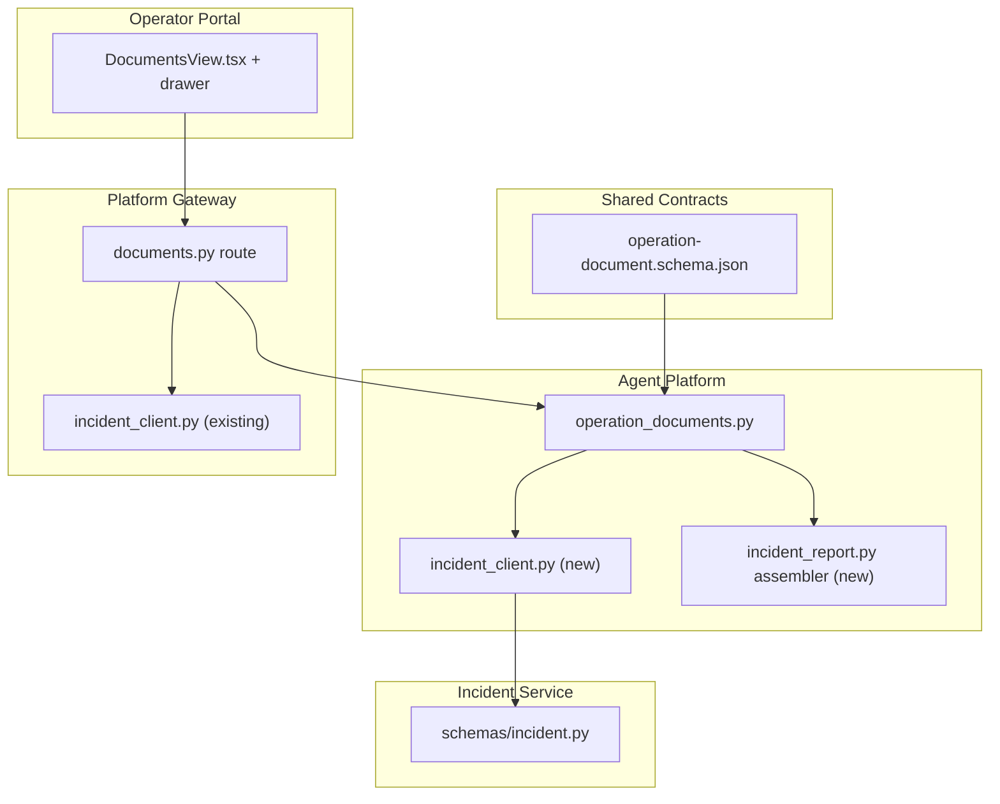
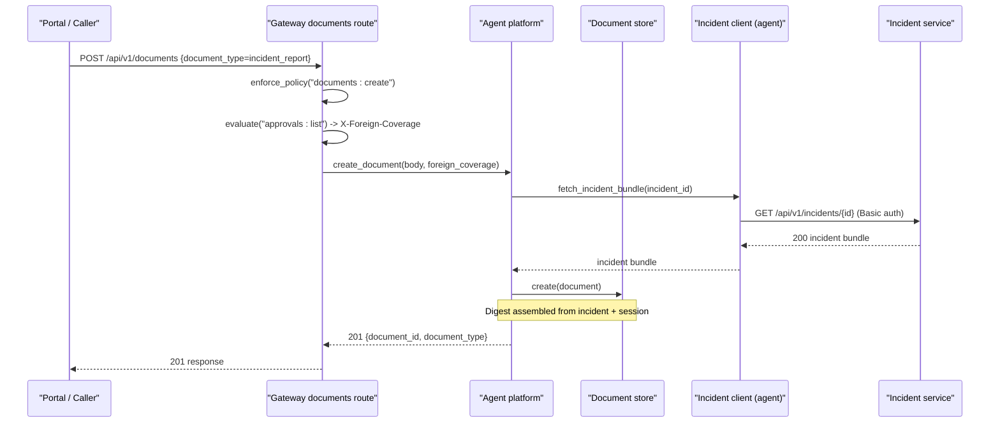
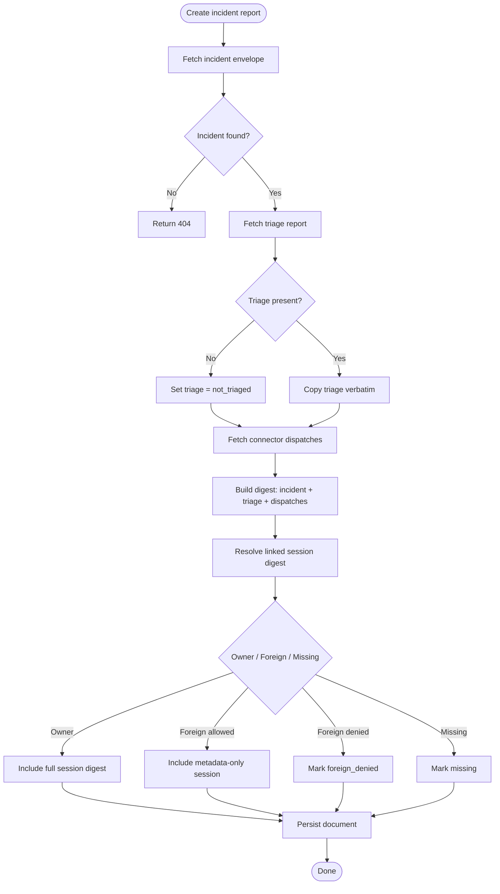
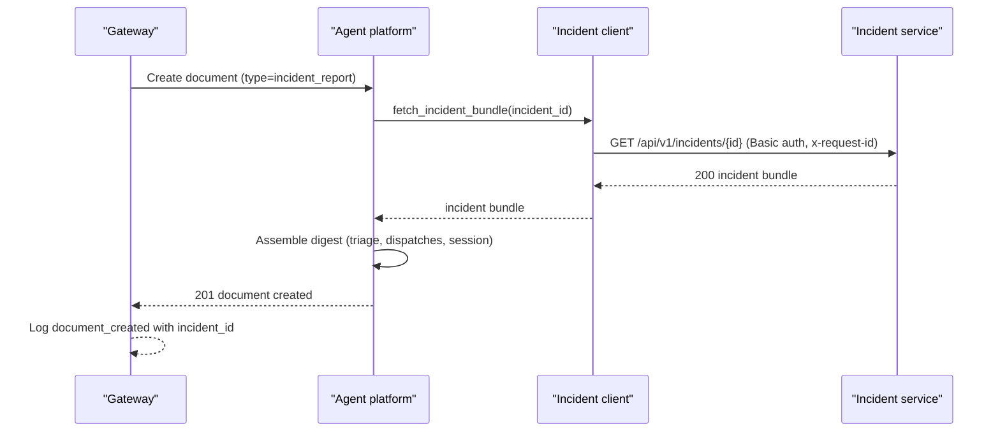
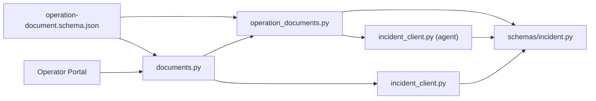
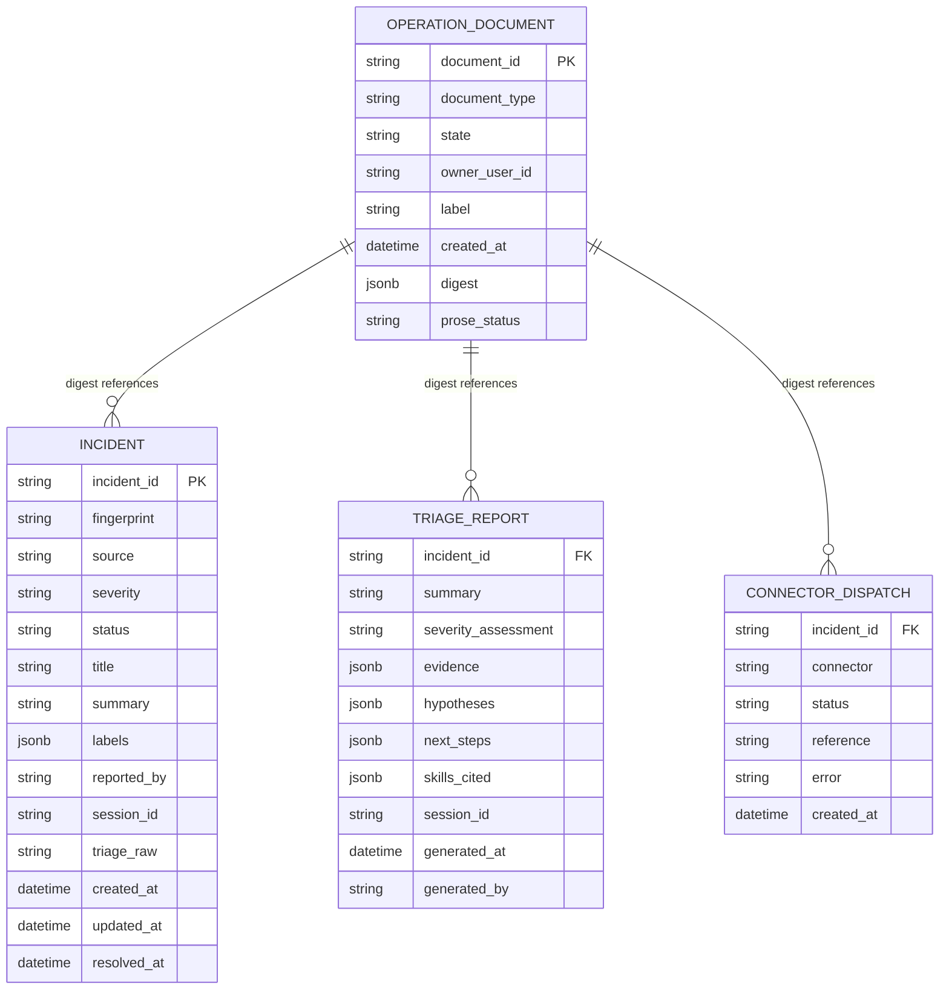

# SPEC-043: Incident Report Document Type

<cite>
**Referenced Files in This Document**
- [spec.md](file://docs/specs/SPEC-043-incident-report-document-type/spec.md)
- [plan.md](file://docs/specs/SPEC-043-incident-report-document-type/plan.md)
- [tasks.md](file://docs/specs/SPEC-043-incident-report-document-type/tasks.md)
- [operation-document.schema.json](file://shared/shared-contracts/schemas/operation-document.schema.json)
- [incident_report.py](file://products/agent-platform/src/agent_service/services/incident_report.py)
- [incident_client.py](file://products/agent-platform/src/agent_service/services/incident_client.py)
- [documents.py](file://products/platform-gateway/src/platform_gateway/api/routes/documents.py)
- [api.py](file://products/platform-gateway/src/platform_gateway/schemas/api.py)
- [incident.py](file://products/incident-service/src/incident_service/schemas/incident.py)
- [DocumentsView.tsx](file://products/operator-portal/web-ui/app/src/views/workspace/DocumentsView.tsx)
</cite>

## Update Summary
**Changes Made**
- Updated status and delivery information to reflect v0.25.1/v0.25.2 release synchronization as part of comprehensive release notes refresh
- Enhanced implementation details with actual code references showing complete incident report document type functionality
- Added comprehensive coverage of the assembler logic, client implementation, gateway dual-action gate, and portal UI components
- Updated architectural diagrams to show real implementation flow including incident service integration
- Enhanced component analysis to reflect actual code structure and behavior patterns from the delivered implementation

## Table of Contents
1. [Introduction](#introduction)
2. [Project Structure](#project-structure)
3. [Core Components](#core-components)
4. [Architecture Overview](#architecture-overview)
5. [Detailed Component Analysis](#detailed-component-analysis)
6. [Dependency Analysis](#dependency-analysis)
7. [Performance Considerations](#performance-considerations)
8. [Troubleshooting Guide](#troubleshooting-guide)
9. [Conclusion](#conclusion)
10. [Appendices](#appendices)

## Introduction
This document specifies the incident report document type for the operations document repository. It extends the existing typed-document substrate with a new `incident_report` type that assembles a durable, attributed snapshot from incident-service and the platform's session store. The slice is read-only with respect to incident state, reuses existing policy actions through a combined gate, and inherits the draft→publish lifecycle, role-based access, digest anchoring, and prose layer semantics already established for shift summaries.

Key outcomes:
- A new document type with a deterministic digest composed of incident envelope, triage report or marker, connector dispatch outcomes, and linked session digest under two-tier coverage.
- An internal client leg in agent-platform to fetch incident facts via incident-service using an existing Basic query credential posture.
- A dual-action gateway gate requiring both `documents:create` and `incident:read` to create an incident report.
- Portal support for creation and tabbed rendering of incident reports without introducing new routes.

**Section sources**
- [spec.md:15-26](file://docs/specs/SPEC-043-incident-report-document-type/spec.md#L15-L26)
- [plan.md:3-15](file://docs/specs/SPEC-043-incident-report-document-type/plan.md#L3-L15)

## Project Structure
SPEC-043 spans three products and one shared contract:
- Shared contract: extend the operation document schema with the new type and digest shape.
- Agent platform: add the incident client, assembler, and acceptance of the new type into the document substrate.
- Platform gateway: enforce a dual-action gate on document creation for the new type and pass through required fields.
- Operator portal: add creation dialog type choice, incident picker, and tabbed rendering for incident reports.

**Diagram sources**
- [operation-document.schema.json:24-28](file://shared/shared-contracts/schemas/operation-document.schema.json#L24-L28)
- [incident_report.py:126-167](file://products/agent-platform/src/agent_service/services/incident_report.py#L126-L167)
- [documents.py:29-69](file://products/platform-gateway/src/platform_gateway/api/routes/documents.py#L29-L69)
- [incident_client.py:77-122](file://products/agent-platform/src/agent_service/services/incident_client.py#L77-L122)
- [incident.py:37-63](file://products/incident-service/src/incident_service/schemas/incident.py#L37-L63)

**Section sources**
- [plan.md:19-122](file://docs/specs/SPEC-043-incident-report-document-type/plan.md#L19-L122)
- [tasks.md:3-67](file://docs/specs/SPEC-043-incident-report-document-type/tasks.md#L3-L67)

## Core Components
- Operation document substrate: stores immutable documents with a JSON digest column; supports memory and Postgres backends; enforces per-owner cap and retention.
- Incident service models: define the incident envelope, triage report, and connector dispatch structures used by the report assembly.
- Gateway document route: creates documents, enforces policies, logs events, and forwards foreign-session coverage decisions.
- Incident client (gateway): proxies calls to incident-service with bounded timeouts, structured error mapping, and credential handling.

Implementation anchors:
- Document creation payload shaping and storage conventions are defined in the operation document module.
- Incident envelope and list entry shapes are modeled in the incident service schemas.
- Gateway document creation route performs identity resolution, policy enforcement, and event logging.

**Section sources**
- [incident_report.py:126-167](file://products/agent-platform/src/agent_service/services/incident_report.py#L126-L167)
- [incident.py:37-116](file://products/incident-service/src/incident_service/schemas/incident.py#L37-L116)
- [documents.py:29-69](file://products/platform-gateway/src/platform_gateway/api/routes/documents.py#L29-L69)
- [incident_client.py:77-122](file://products/agent-platform/src/agent_service/services/incident_client.py#L77-L122)

## Architecture Overview
The incident report document type composes a snapshot from multiple durable sources and persists it as an immutable document. Creation flows through the gateway, which applies a dual-action gate for the new type before delegating to agent-platform. Agent-platform builds the digest by fetching incident facts and session data, then persists the document and optionally generates prose.

**Diagram sources**
- [documents.py:29-69](file://products/platform-gateway/src/platform_gateway/api/routes/documents.py#L29-L69)
- [incident_report.py:126-167](file://products/agent-platform/src/agent_service/services/incident_report.py#L126-L167)
- [incident_client.py:77-122](file://products/agent-platform/src/agent_service/services/incident_client.py#L77-L122)

## Detailed Component Analysis

### Contract Extension: Operation Document Schema
The shared schema defines the typed-document discriminator and common fields. SPEC-043 extends the `document_type` enum to include `incident_report` and adds a type-specific digest object describing the four sections: incident, triage, dispatches, and session. The schema remains additive so older documents remain unaffected.

Key points:
- Enum extension introduces the new type without changing substrate behavior.
- Digest structure mirrors incident-service model bounds to maintain contract parity.
- Provenance and lifecycle fields stay unchanged; digest values are copied verbatim at assembly time.

**Section sources**
- [operation-document.schema.json:24-28](file://shared/shared-contracts/schemas/operation-document.schema.json#L24-L28)
- [spec.md:57-82](file://docs/specs/SPEC-043-incident-report-document-type/spec.md#L57-L82)
- [plan.md:19-33](file://docs/specs/SPEC-043-incident-report-document-type/plan.md#L19-L33)

### Incident-Report Assembler (Agent Platform)
The assembler constructs a deterministic digest from incident-service and the platform's session store. It copies incident envelope fields, includes the validated triage report when present or a marker otherwise, aggregates connector dispatch outcomes, and resolves the linked session digest under two-tier coverage rules.

Behavioral guarantees:
- Unknown incident id returns a structural 404; triage failures still assemble with markers.
- Session coverage follows owner/full, foreign/metadata-only (behind trusted header), foreign_denied, or missing.
- Degradation paths avoid 500 errors: upstream unavailability yields 502; session store unreadability marks the section unavailable.

**Diagram sources**
- [incident_report.py:126-167](file://products/agent-platform/src/agent_service/services/incident_report.py#L126-L167)
- [incident_report.py:85-124](file://products/agent-platform/src/agent_service/services/incident_report.py#L85-L124)

**Section sources**
- [spec.md:84-127](file://docs/specs/SPEC-043-incident-report-document-type/spec.md#L84-L127)
- [plan.md:49-68](file://docs/specs/SPEC-043-incident-report-document-type/plan.md#L49-L68)
- [tasks.md:14-27](file://docs/specs/SPEC-043-incident-report-document-type/tasks.md#L14-L27)
- [incident_report.py:126-167](file://products/agent-platform/src/agent_service/services/incident_report.py#L126-L167)

### Internal Incident Client and Dual-Action Gate
Agent-platform gains a bounded client to incident-service using the same Basic query credential posture as the gateway's existing incident client. The gateway enforces both `documents:create` and `incident:read` for creating incident reports, ensuring incident visibility cannot be bypassed through the document surface.

Highlights:
- Client configuration knobs: URL, client ID, client secret; missing config yields 503; unreachable upstream yields 502.
- Request tracing: x-request-id forwarded; timeouts bounded.
- Policy gate: combined evaluation of two existing actions; no new policy action introduced.

**Diagram sources**
- [incident_client.py:77-122](file://products/agent-platform/src/agent_service/services/incident_client.py#L77-L122)
- [documents.py:29-69](file://products/platform-gateway/src/platform_gateway/api/routes/documents.py#L29-L69)

**Section sources**
- [spec.md:128-154](file://docs/specs/SPEC-043-incident-report-document-type/spec.md#L128-L154)
- [plan.md:35-47](file://docs/specs/SPEC-043-incident-report-document-type/plan.md#L35-L47)
- [plan.md:69-82](file://docs/specs/SPEC-043-incident-report-document-type/plan.md#L69-L82)
- [tasks.md:28-43](file://docs/specs/SPEC-043-incident-report-document-type/tasks.md#L28-L43)
- [incident_client.py:77-122](file://products/agent-platform/src/agent_service/services/incident_client.py#L77-L122)

### Prose Layer and Audit Inheritance
Prose generation for incident reports uses only the assembled digest JSON, never raw incident payloads or transcripts. Failure degrades to a digest-only document with prose_status set accordingly. Audit events reuse existing names; document_created carries incident_id for the new type.

Key constraints:
- Prompt purity: regression tests assert no non-digest incident field reaches the prompt.
- Rendering parity: prose_status vocabulary and portal behavior match shift summaries.
- Audit: no new event types; incident_id added to document_created payload for this type.

**Section sources**
- [spec.md:156-186](file://docs/specs/SPEC-043-incident-report-document-type/spec.md#L156-L186)
- [plan.md:84-91](file://docs/specs/SPEC-043-incident-report-document-type/plan.md#L84-L91)
- [tasks.md:44-57](file://docs/specs/SPEC-043-incident-report-document-type/tasks.md#L44-L57)

### Portal Documents Support
The operator portal augments the existing Documents view:
- Creation dialog offers a type choice; selecting incident report swaps the session picker for an incident picker backed by the incidents list surface.
- Drawer renders tabs for Incident, Triage, Dispatches, Session, plus Generated narrative and Raw JSON.
- List rows keep envelope-only posture with counts-only summaries and a type badge distinguishing incident reports.

**Updated** Added comprehensive implementation details showing actual React components and rendering logic for incident report tabs, including severity/status color coding, label display, and session coverage markers.

**Section sources**
- [spec.md:188-209](file://docs/specs/SPEC-043-incident-report-document-type/spec.md#L188-L209)
- [plan.md:93-108](file://docs/specs/SPEC-043-incident-report-document-type/plan.md#L93-L108)
- [tasks.md:59-67](file://docs/specs/SPEC-043-incident-report-document-type/tasks.md#L59-L67)
- [DocumentsView.tsx:527-850](file://products/operator-portal/web-ui/app/src/views/workspace/DocumentsView.tsx#L527-L850)

## Dependency Analysis
SPEC-043 introduces minimal coupling while leveraging existing contracts and services:
- Shared contract extension is foundational and consumed by all components.
- Agent platform depends on incident-service via a new client; session store access remains within agent platform.
- Gateway enforces policy and proxies requests; incident client reuse avoids duplication.
- Portal depends on gateway API surfaces and existing incidents list.

**Diagram sources**
- [operation-document.schema.json:24-28](file://shared/shared-contracts/schemas/operation-document.schema.json#L24-L28)
- [incident_report.py:126-167](file://products/agent-platform/src/agent_service/services/incident_report.py#L126-L167)
- [documents.py:29-69](file://products/platform-gateway/src/platform_gateway/api/routes/documents.py#L29-L69)
- [incident_client.py:77-122](file://products/agent-platform/src/agent_service/services/incident_client.py#L77-L122)
- [incident.py:37-63](file://products/incident-service/src/incident_service/schemas/incident.py#L37-L63)

**Section sources**
- [plan.md:19-122](file://docs/specs/SPEC-043-incident-report-document-type/plan.md#L19-L122)

## Performance Considerations
- Bounded timeouts: incident client uses a fixed timeout to prevent long-running requests during assembly.
- Minimal I/O: digest assembly reads incident and session data once; no mutations reduce write amplification.
- Storage efficiency: digest stored as JSON; retention and per-owner cap apply uniformly across document types.
- Error degradation: upstream failures map to 502; missing configuration maps to 503; unknown ids map to 404 — avoiding cascading failures.

## Troubleshooting Guide
Common issues and their expected behaviors:
- Missing incident client configuration: creation returns 503 dependency-not-configured.
- Unreachable incident-service: creation returns 502 with a structured message.
- Unknown incident id: creation returns 404 matching the incidents surface behavior.
- Policy denial: gateway enforces both `documents:create` and `incident:read`; first failing action determines the denial.
- Session store failure: session section marked unavailable; document still created if other sections succeed.

Operational checks:
- Verify environment knobs for incident client URL and credentials.
- Confirm policy roles include both required actions for creation.
- Validate incident existence and status prior to creation attempts.

**Section sources**
- [spec.md:128-154](file://docs/specs/SPEC-043-incident-report-document-type/spec.md#L128-L154)
- [incident_client.py:35-62](file://products/agent-platform/src/agent_service/services/incident_client.py#L35-L62)
- [documents.py:29-69](file://products/platform-gateway/src/platform_gateway/api/routes/documents.py#L29-L69)

## Conclusion
SPEC-043 delivers a focused, read-only extension to the operations document repository that consolidates incident review artifacts into a durable, auditable, and cross-owner-readable format. By reusing the typed-document substrate, existing policy actions, and proven incident-service integration patterns, it minimizes architectural risk while providing operators with a consistent post-incident artifact comparable to shift summaries.

## Appendices

### Data Model Relationships

**Diagram sources**
- [incident_report.py:126-167](file://products/agent-platform/src/agent_service/services/incident_report.py#L126-L167)
- [incident.py:37-116](file://products/incident-service/src/incident_service/schemas/incident.py#L37-L116)