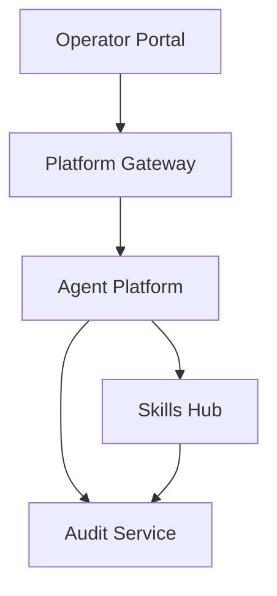
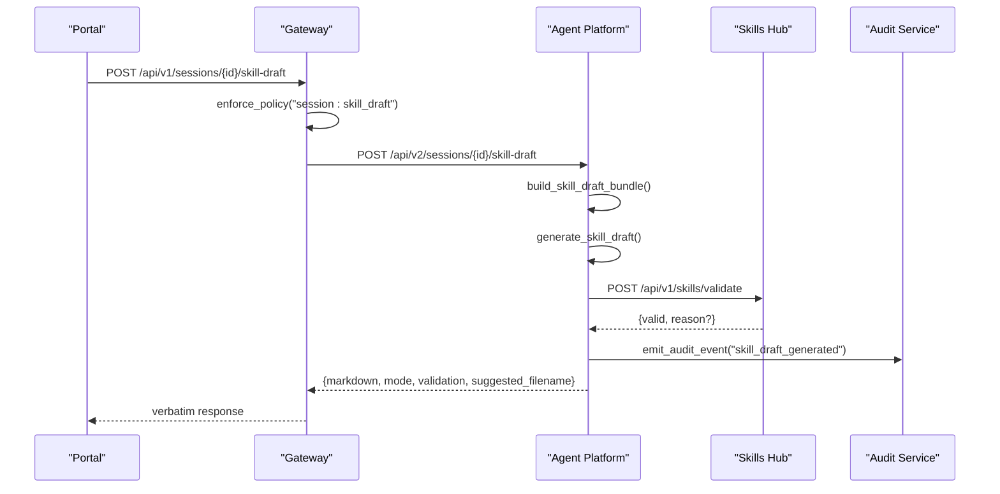
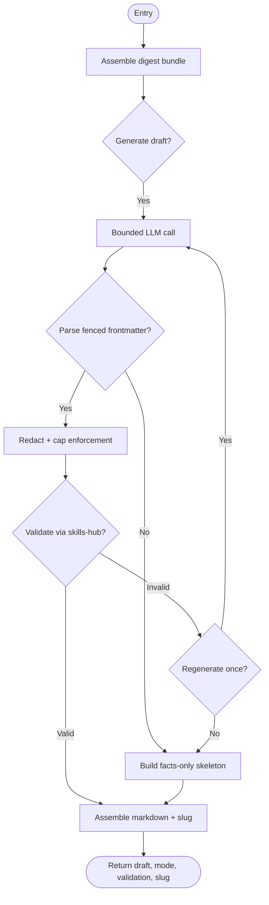
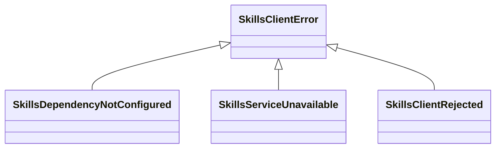
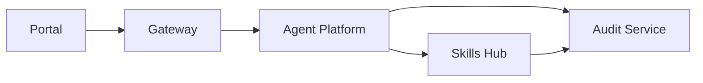

# SPEC-044: Skill Authoring Export from Sessions

<cite>
**Referenced Files in This Document**
- [spec.md](file://docs/specs/SPEC-044-skill-authoring-export/spec.md)
- [plan.md](file://docs/specs/SPEC-044-skill-authoring-export/plan.md)
- [tasks.md](file://docs/specs/SPEC-044-skill-authoring-export/tasks.md)
- [skill_draft.py](file://products/agent-platform/src/agent_service/services/skill_draft.py)
- [skills_client.py](file://products/agent-platform/src/agent_service/services/skills_client.py)
- [routes.py (agent-platform)](file://products/agent-platform/src/agent_service/api/v2/routes.py)
- [routes.py (skills-hub)](file://products/skills-hub/src/skills_hub/api/routes/skills.py)
- [sessions.py (gateway)](file://products/platform-gateway/src/platform_gateway/api/routes/sessions.py)
- [policy-default.yaml](file://shared/shared-contracts/policies/policy-default.yaml)
- [audit.py (audit-service)](file://products/audit-service/src/audit_service/schemas/audit.py)
- [audit_emitter.py (skills-hub)](file://products/skills-hub/src/skills_hub/services/audit_emitter.py)
- [sessions.ts (portal)](file://products/operator-portal/web-ui/app/src/api/sessions.ts)
</cite>

## Update Summary
**Changes Made**
- Updated status to reflect delivered state with v0.26.0 release completion
- Enhanced implementation details with comprehensive testing coverage
- Added portal integration and client-side export functionality
- Updated architecture diagrams to reflect complete end-to-end flow
- Expanded troubleshooting guide with validation failure scenarios
- Added provenance marker and content guardrails documentation

## Table of Contents
1. Introduction
2. Project Structure
3. Core Components
4. Architecture Overview
5. Detailed Component Analysis
6. Dependency Analysis
7. Performance Considerations
8. Troubleshooting Guide
9. Conclusion

## Introduction
SPEC-044 enables operators to export a session's troubleshooting into a reusable skill Markdown draft. The platform generates the draft deterministically from durable session facts, validates it against Skill Format v1 through skills-hub's own ingestion code path, and returns it as a client-side download for contribution to the team's Git skills repository. Nothing is persisted on the platform; the only durable additions are a new policy action and an audit event. **Status: Delivered in v0.26.0 with full feature completion.**

## Project Structure
The feature spans four products plus shared contracts:
- Agent-platform: skill-draft generator, validation client, and route
- Skills-hub: read-only validation endpoint using ingestion validation
- Platform-gateway: pass-through route gated by a new policy action
- Operator-portal: session action and client-side Markdown download
- Shared contracts: new policy rule and audit event enum extension

**Diagram sources**
- [sessions.py (gateway):155-185](file://products/platform-gateway/src/platform_gateway/api/routes/sessions.py#L155-L185)
- [skill_draft.py:124-163](file://products/agent-platform/src/agent_service/services/skill_draft.py#L124-L163)
- [skills_client.py:69-115](file://products/agent-platform/src/agent_service/services/skills_client.py#L69-L115)
- [routes.py (skills-hub):149-181](file://products/skills-hub/src/skills_hub/api/routes/skills.py#L149-L181)
- [audit_emitter.py (skills-hub):29-41](file://products/skills-hub/src/skills_hub/services/audit_emitter.py#L29-L41)

**Section sources**
- [spec.md:18-52](file://docs/specs/SPEC-044-skill-authoring-export/spec.md#L18-L52)
- [plan.md:3-15](file://docs/specs/SPEC-044-skill-authoring-export/plan.md#L3-L15)

## Core Components
- Skill-draft generator: Assembles a digest bundle from session facts and an optional validated triage report, builds a fenced-contract prompt, runs one bounded LLM call, parses output, applies deterministic post-processing (redaction and caps), and falls back to a facts-only skeleton when needed.
- Validation client: Calls skills-hub's read-only validate endpoint with Basic query credentials, forwards request correlation headers, maps errors to structured outcomes, and enforces consistency over availability.
- Validation endpoint: Reuses ingestion validation functions verbatim; accepts one candidate document and returns validity with a reason.
- Gateway pass-through: Enforces a new policy action, forwards identity and correlation headers, maps upstream errors, and passes responses verbatim without state.
- Policy and audit: Adds a deny-by-default action and a new audit event type to capture successful generation attempts.

**Section sources**
- [skill_draft.py:124-163](file://products/agent-platform/src/agent_service/services/skill_draft.py#L124-L163)
- [skill_draft.py:194-212](file://products/agent-platform/src/agent_service/services/skill_draft.py#L194-L212)
- [skill_draft.py:257-278](file://products/agent-platform/src/agent_service/services/skill_draft.py#L257-L278)
- [skill_draft.py:358-459](file://products/agent-platform/src/agent_service/services/skill_draft.py#L358-L459)
- [skills_client.py:52-115](file://products/agent-platform/src/agent_service/services/skills_client.py#L52-L115)
- [routes.py (skills-hub):149-181](file://products/skills-hub/src/skills_hub/api/routes/skills.py#L149-L181)
- [sessions.py (gateway):155-185](file://products/platform-gateway/src/platform_gateway/api/routes/sessions.py#L155-L185)
- [policy-default.yaml:268-284](file://shared/shared-contracts/policies/policy-default.yaml#L268-L284)

## Architecture Overview
End-to-end flow from portal to skills-hub validation and back:

**Diagram sources**
- [sessions.py (gateway):155-185](file://products/platform-gateway/src/platform_gateway/api/routes/sessions.py#L155-L185)
- [skill_draft.py:124-163](file://products/agent-platform/src/agent_service/services/skill_draft.py#L124-L163)
- [skill_draft.py:465-506](file://products/agent-platform/src/agent_service/services/skill_draft.py#L465-L506)
- [skills_client.py:69-115](file://products/agent-platform/src/agent_service/services/skills_client.py#L69-L115)
- [routes.py (skills-hub):149-181](file://products/skills-hub/src/skills_hub/api/routes/skills.py#L149-L181)
- [audit_emitter.py (skills-hub):29-41](file://products/skills-hub/src/skills_hub/services/audit_emitter.py#L29-L41)

## Detailed Component Analysis

### Skill-draft generator (agent-platform)
- Digest assembly: Reuses shift-summary session-fact assembly; enriches with incident envelope and triage report when present; raw transcripts and evidence payloads never enter the prompt.
- Prompt building: Fenced `skill-frontmatter` contract with strict anchoring rules and content prohibitions; supports regeneration with rejection hints.
- Parsing and post-processing: Parses fenced frontmatter, redacts sensitive patterns, enforces Skill Format caps, truncates body bytes, and prepends a deterministic HTML-comment provenance block.
- Skeleton fallback: Deterministic facts-only draft built from session/incident facts and handover tables; always format-valid and used on generation or parse failures.
- Bounded execution: One model call with a hard timeout; streaming responses drained; any exception degrades to skeleton.

**Diagram sources**
- [skill_draft.py:124-163](file://products/agent-platform/src/agent_service/services/skill_draft.py#L124-L163)
- [skill_draft.py:194-212](file://products/agent-platform/src/agent_service/services/skill_draft.py#L194-L212)
- [skill_draft.py:215-241](file://products/agent-platform/src/agent_service/services/skill_draft.py#L215-L241)
- [skill_draft.py:257-278](file://products/agent-platform/src/agent_service/services/skill_draft.py#L257-L278)
- [skill_draft.py:330-352](file://products/agent-platform/src/agent_service/services/skill_draft.py#L330-L352)
- [skill_draft.py:358-459](file://products/agent-platform/src/agent_service/services/skill_draft.py#L358-L459)
- [skill_draft.py:465-506](file://products/agent-platform/src/agent_service/services/skill_draft.py#L465-L506)

**Section sources**
- [skill_draft.py:124-163](file://products/agent-platform/src/agent_service/services/skill_draft.py#L124-L163)
- [skill_draft.py:194-212](file://products/agent-platform/src/agent_service/services/skill_draft.py#L194-L212)
- [skill_draft.py:257-278](file://products/agent-platform/src/agent_service/services/skill_draft.py#L257-L278)
- [skill_draft.py:330-352](file://products/agent-platform/src/agent_service/services/skill_draft.py#L330-L352)
- [skill_draft.py:358-459](file://products/agent-platform/src/agent_service/services/skill_draft.py#L358-L459)
- [skill_draft.py:465-506](file://products/agent-platform/src/agent_service/services/skill_draft.py#L465-L506)

### Validation client (agent-platform)
- Authentication: Uses registered Basic query credential; not configured yields a dependency-not-configured error.
- Transport: HTTPX async client with bounded timeout; forwards `x-request-id`.
- Error mapping: Transport failure or upstream 5xx becomes service unavailable; 4xx becomes rejected with status and message; success returns validity and optional reason.

**Diagram sources**
- [skills_client.py:31-50](file://products/agent-platform/src/agent_service/services/skills_client.py#L31-L50)

**Section sources**
- [skills_client.py:52-115](file://products/agent-platform/src/agent_service/services/skills_client.py#L52-L115)

### Validation endpoint (skills-hub)
- Read-only: No store writes, sync triggers, or audit emissions from this route.
- Input guardrails: JSON body with a single string document; size capped.
- Validation: Calls ingestion validation function verbatim; returns `{valid}` or `{valid, reason}`.

**Section sources**
- [routes.py (skills-hub):149-181](file://products/skills-hub/src/skills_hub/api/routes/skills.py#L149-L181)

### Gateway pass-through and policy gate
- Route: New session skill-draft endpoint under sessions routes.
- Policy: Enforces `session:skill_draft`; denies by default if not granted.
- Forwarding: Passes delegated identity and `x-request-id`; maps 403/404/502/503; no held state.

**Section sources**
- [sessions.py (gateway):155-185](file://products/platform-gateway/src/platform_gateway/api/routes/sessions.py#L155-L185)
- [policy-default.yaml:268-284](file://shared/shared-contracts/policies/policy-default.yaml#L268-L284)

### Provenance and content guardrails
- Provenance marker: Deterministic HTML-comment block at top of draft with session id, incident id (when present), date, platform version, and mode.
- Redaction: Applies gateway-equivalent pattern-based scrubbing to model output before validation.
- Caps: Enforces Skill Format v1 limits regardless of model obedience.

**Section sources**
- [skill_draft.py:257-278](file://products/agent-platform/src/agent_service/services/skill_draft.py#L257-L278)
- [skill_draft.py:287-310](file://products/agent-platform/src/agent_service/services/skill_draft.py#L287-L310)
- [skill_draft.py:330-352](file://products/agent-platform/src/agent_service/services/skill_draft.py#L330-L352)

### Agent-platform route integration
- Server-side ownership check ensures foreign sessions return structural 404
- Integration with skills validation client for format compliance
- Audit event emission for successful generation attempts
- Response schema includes markdown, mode, validation status, and suggested filename

**Section sources**
- [routes.py (agent-platform):787-879](file://products/agent-platform/src/agent_service/api/v2/routes.py#L787-L879)

### Portal integration and client-side export
- Session actions include "Draft as skill" button with role-based visibility
- Client-side download using Blob pattern with suggested filename
- Toast notifications distinguish between generated and skeleton modes
- Error handling for structured API responses (403/502/503)

**Section sources**
- [sessions.ts (portal):170-189](file://products/operator-portal/web-ui/app/src/api/sessions.ts#L170-L189)

## Dependency Analysis

**Diagram sources**
- [sessions.py (gateway):155-185](file://products/platform-gateway/src/platform_gateway/api/routes/sessions.py#L155-L185)
- [skill_draft.py:124-163](file://products/agent-platform/src/agent_service/services/skill_draft.py#L124-L163)
- [skills_client.py:69-115](file://products/agent-platform/src/agent_service/services/skills_client.py#L69-L115)
- [routes.py (skills-hub):149-181](file://products/skills-hub/src/skills_hub/api/routes/skills.py#L149-L181)
- [audit_emitter.py (skills-hub):29-41](file://products/skills-hub/src/skills_hub/services/audit_emitter.py#L29-L41)

**Section sources**
- [plan.md:17-125](file://docs/specs/SPEC-044-skill-authoring-export/plan.md#L17-L125)

## Performance Considerations
- Generation latency: One bounded LLM call per attempt; a second attempt allowed on validation rejection.
- Validation round-trip: Additional HTTP call to skills-hub; timeouts are bounded and mapped to structured errors.
- Degradation: Skeleton path avoids blocking on LLM or validation failures; ensures consistent responses.
- Memory: Body truncation and tag/title/description caps prevent oversized payloads.

## Troubleshooting Guide
- Validation unavailable: If skills-hub is not configured or unreachable, the generation route fails closed (503/502); no unvalidated draft is returned.
- Validation rejection: The generator retries once with the rejection reason; persistent failures fall back to skeleton.
- Ownership checks: Foreign session ids return structural 404; server-side ownership is enforced even after gateway authorization.
- Content issues: Redaction and caps are applied deterministically; ensure prompts prohibit secrets/hostnames/customer data.
- Portal integration: Check role permissions for "Draft as skill" button visibility; verify client-side download functionality.
- Audit trail: Verify `skill_draft_generated` events appear in audit service for successful generations.

**Section sources**
- [skills_client.py:52-115](file://products/agent-platform/src/agent_service/services/skills_client.py#L52-L115)
- [skill_draft.py:215-241](file://products/agent-platform/src/agent_service/services/skill_draft.py#L215-L241)
- [skill_draft.py:358-459](file://products/agent-platform/src/agent_service/services/skill_draft.py#L358-L459)
- [skill_draft.py:465-506](file://products/agent-platform/src/agent_service/services/skill_draft.py#L465-L506)
- [audit.py (audit-service):14-34](file://products/audit-service/src/audit_service/schemas/audit.py#L14-L34)

## Conclusion
SPEC-044 closes the loop between session troubleshooting and reusable team knowledge by generating, validating, and exporting skill drafts from durable facts. **Delivered in v0.26.0**, the feature reuses established patterns across digest-anchored generation, fenced contracts, client-side export, and internal Basic-auth clients. The design keeps fabrication risk low, preserves operator review as the publication gate, and adds minimal durable surface: one policy action and one audit event. Full implementation includes comprehensive testing coverage, portal integration, and robust error handling for production deployment.