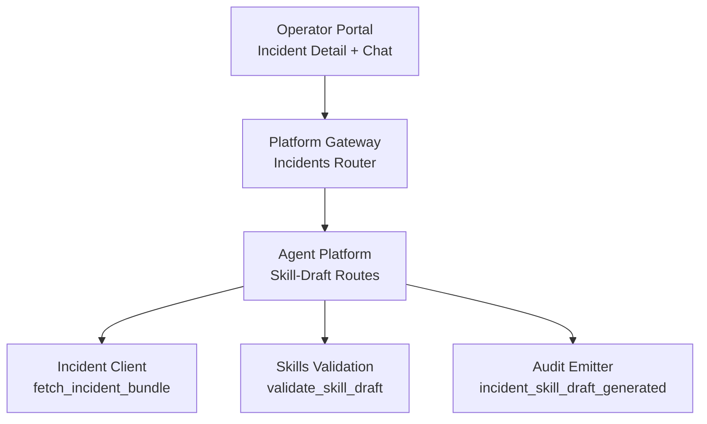
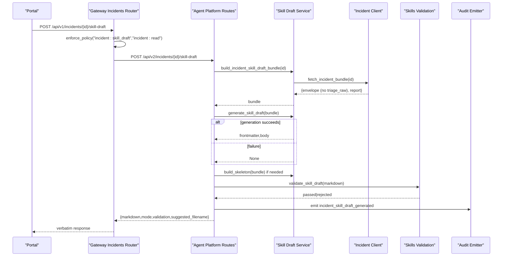
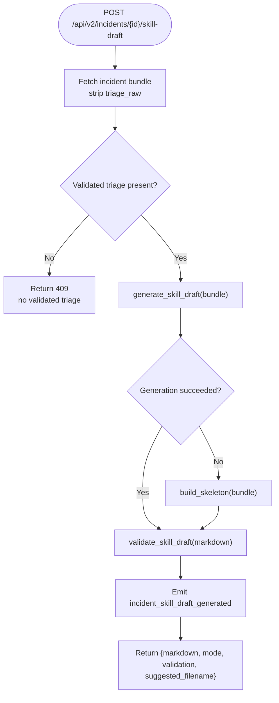
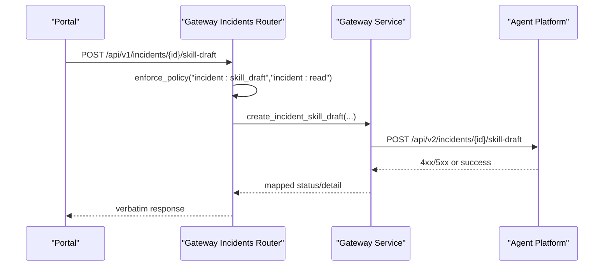
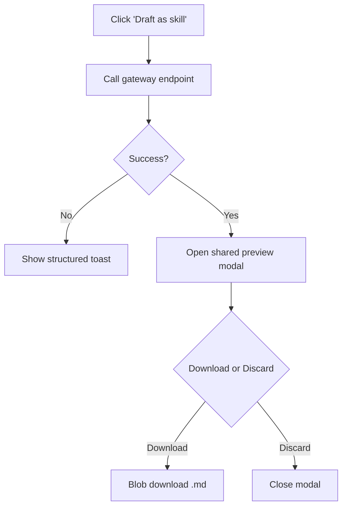
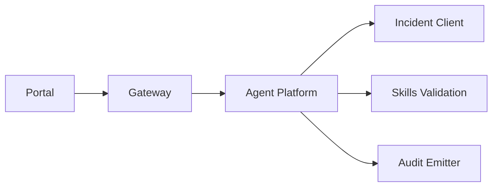

# SPEC-045: Incident-Anchored Skill Drafts and Draft Preview

<cite>
**Referenced Files in This Document**
- [spec.md](file://docs/specs/SPEC-045-incident-skill-draft-and-preview/spec.md)
- [plan.md](file://docs/specs/SPEC-045-incident-skill-draft-and-preview/plan.md)
- [tasks.md](file://docs/specs/SPEC-045-incident-skill-draft-and-preview/tasks.md)
- [skill_draft.py](file://products/agent-platform/src/agent_service/services/skill_draft.py)
- [routes.py](file://products/agent-platform/src/agent_service/api/v2/routes.py)
- [incidents.py](file://products/platform-gateway/src/platform_gateway/api/routes/incidents.py)
- [gateway_service.py](file://products/platform-gateway/src/platform_gateway/services/gateway_service.py)
- [IncidentsView.tsx](file://products/operator-portal/web-ui/app/src/views/incidents/IncidentsView.tsx)
- [ChatView.tsx](file://products/operator-portal/web-ui/app/src/chat/ChatView.tsx)
</cite>

## Table of Contents
1. [Introduction](#introduction)
2. [Project Structure](#project-structure)
3. [Core Components](#core-components)
4. [Architecture Overview](#architecture-overview)
5. [Detailed Component Analysis](#detailed-component-analysis)
6. [Dependency Analysis](#dependency-analysis)
7. [Performance Considerations](#performance-considerations)
8. [Troubleshooting Guide](#troubleshooting-guide)
9. [Conclusion](#conclusion)
10. [Appendices](#appendices)

## Introduction
This document specifies the design, implementation plan, and task breakdown for SPEC-045: Incident-Anchored Skill Drafts and Draft Preview. It introduces an incident-scoped skill-draft generation flow that converts a validated triage report into a reusable skill draft without touching session ownership. It also defines a shared preview modal that appears before download from both the chat header (session-scoped) and the incident detail toolbar (incident-scoped). The spec enforces digest-only inputs, deterministic post-processing, fail-closed validation, and no durable draft persistence on the platform.

## Project Structure
SPEC-045 spans three products plus policy and audit surfaces:
- Agent-platform: incident-anchored generator and route, reusing existing skill-draft internals and the incident client.
- Platform-gateway: pass-through route with dual-action authorization and structured error mapping.
- Operator portal: new incident-detail action and a shared skill-draft preview modal; the existing session button is wired through the same preview.
- Policy and audit: a new action grant and a typed audit event.

**Diagram sources**
- [incidents.py:119-183](file://products/platform-gateway/src/platform_gateway/api/routes/incidents.py#L119-L183)
- [gateway_service.py:507-538](file://products/platform-gateway/src/platform_gateway/services/gateway_service.py#L507-L538)
- [routes.py:765-800](file://products/agent-platform/src/agent_service/api/v2/routes.py#L765-L800)
- [skill_draft.py:124-163](file://products/agent-platform/src/agent_service/services/skill_draft.py#L124-L163)

**Section sources**
- [spec.md:19-49](file://docs/specs/SPEC-045-incident-skill-draft-and-preview/spec.md#L19-L49)
- [plan.md:1-15](file://docs/specs/SPEC-045-incident-skill-draft-and-preview/plan.md#L1-L15)

## Core Components
- Incident-anchored generator: builds a digest bundle from the incident envelope (stripped of raw triage output) and the validated triage report, then runs the same bounded generation pipeline as the session-scoped path. A triage-required gate returns a deterministic 409 when no validated triage exists.
- Gateway pass-through: adds a new incidents endpoint behind a dual-action gate (incident:skill_draft and incident:read), forwards identity and request id, and maps upstream errors to house conventions without returning unvalidated drafts.
- Shared preview modal: renders markdown (rendered by default, raw toggle shows provenance), mode badge (generated vs skeleton), validation status, suggested filename, and offers Download .md or Discard.
- Policy and audit: new allow rule for incident:skill_draft and a typed audit event emitted per generation.

**Section sources**
- [spec.md:51-106](file://docs/specs/SPEC-045-incident-skill-draft-and-preview/spec.md#L51-L106)
- [spec.md:126-158](file://docs/specs/SPEC-045-incident-skill-draft-and-preview/spec.md#L126-L158)
- [plan.md:19-47](file://docs/specs/SPEC-045-incident-skill-draft-and-preview/plan.md#L19-L47)
- [tasks.md:3-85](file://docs/specs/SPEC-045-incident-skill-draft-and-preview/tasks.md#L3-L85)

## Architecture Overview
The end-to-end flow for incident-anchored drafting:
- Portal triggers “Draft as skill” on the incident detail toolbar.
- Gateway enforces dual actions and proxies to agent-platform.
- Agent-platform fetches the incident bundle via the incident client, strips triage_raw, requires a validated triage report, generates or degrades to a facts-only skeleton, validates via skills-hub, and emits an audit event.
- Response flows back through gateway verbatim to the portal’s shared preview modal.

**Diagram sources**
- [incidents.py:119-183](file://products/platform-gateway/src/platform_gateway/api/routes/incidents.py#L119-L183)
- [gateway_service.py:507-538](file://products/platform-gateway/src/platform_gateway/services/gateway_service.py#L507-L538)
- [routes.py:765-800](file://products/agent-platform/src/agent_service/api/v2/routes.py#L765-L800)
- [skill_draft.py:124-163](file://products/agent-platform/src/agent_service/services/skill_draft.py#L124-L163)
- [skill_draft.py:465-506](file://products/agent-platform/src/agent_service/services/skill_draft.py#L465-L506)

## Detailed Component Analysis

### Agent Platform: Incident-Anchored Generator and Route
- Bundle assembly: uses the existing incident client to fetch the incident bundle, strips triage_raw from the envelope, excludes connector dispatch outcomes, and requires a validated triage report. Missing triage yields a typed 409 before generation.
- Generation reuse: shares prompt posture, fenced contract, parser, redaction vocabulary, Skill Format v1 caps, and skeleton builder with the session-scoped path. Any failure degrades to a deterministic facts-only skeleton.
- Route: exposes POST /api/v2/incidents/{incident_id}/skill-draft, maps incident-client errors (not configured, transport, unknown id), applies the generate → validate → bounded-regenerate → skeleton sequence, and emits the incident-specific audit event.

**Diagram sources**
- [skill_draft.py:124-163](file://products/agent-platform/src/agent_service/services/skill_draft.py#L124-L163)
- [skill_draft.py:355-459](file://products/agent-platform/src/agent_service/services/skill_draft.py#L355-L459)
- [skill_draft.py:465-506](file://products/agent-platform/src/agent_service/services/skill_draft.py#L465-L506)
- [routes.py:765-800](file://products/agent-platform/src/agent_service/api/v2/routes.py#L765-L800)

**Section sources**
- [spec.md:51-87](file://docs/specs/SPEC-045-incident-skill-draft-and-preview/spec.md#L51-L87)
- [plan.md:19-47](file://docs/specs/SPEC-045-incident-skill-draft-and-preview/plan.md#L19-L47)
- [tasks.md:3-26](file://docs/specs/SPEC-045-incident-skill-draft-and-preview/tasks.md#L3-L26)

### Platform Gateway: Pass-Through and Error Mapping
- New incidents route: POST /api/v1/incidents/{incident_id}/skill-draft behind dual-action enforcement (incident:skill_draft first, then incident:read).
- Identity forwarding: delegated user id and x-request-id are forwarded; responses are passed through verbatim.
- Error mapping: 403 policy, 404 unknown incident id, 409 no validated triage (passed through with structured detail), 503 dependency not configured, 502 transport/upstream 5xx. Never returns an unvalidated draft.

**Diagram sources**
- [incidents.py:119-183](file://products/platform-gateway/src/platform_gateway/api/routes/incidents.py#L119-L183)
- [gateway_service.py:507-538](file://products/platform-gateway/src/platform_gateway/services/gateway_service.py#L507-L538)

**Section sources**
- [spec.md:89-106](file://docs/specs/SPEC-045-incident-skill-draft-and-preview/spec.md#L89-L106)
- [plan.md:49-73](file://docs/specs/SPEC-045-incident-skill-draft-and-preview/plan.md#L49-L73)
- [tasks.md:27-39](file://docs/specs/SPEC-045-incident-skill-draft-and-preview/tasks.md#L27-L39)

### Operator Portal: Incident Action and Shared Preview
- Incident detail toolbar: gains “Draft as skill” next to Run/Re-run triage and Continue in chat. Visibility mirrors the policy grant; busy state during generation; structured toasts for 403/404/409/502/503; success opens the shared preview.
- Shared preview modal: rendered markdown by default with raw toggle, mode badge, validation status, suggested filename; Download .md performs Blob download; Discard closes without persisting anything. Read-only by design.
- Session surface unchanged: the existing session-scoped button is rewired through the same preview component while keeping its original behavior and tests green.

**Diagram sources**
- [IncidentsView.tsx:480-494](file://products/operator-portal/web-ui/app/src/views/incidents/IncidentsView.tsx#L480-L494)
- [ChatView.tsx:573-638](file://products/operator-portal/web-ui/app/src/chat/ChatView.tsx#L573-L638)

**Section sources**
- [spec.md:126-158](file://docs/specs/SPEC-045-incident-skill-draft-and-preview/spec.md#L126-L158)
- [plan.md:75-106](file://docs/specs/SPEC-045-incident-skill-draft-and-preview/plan.md#L75-L106)
- [tasks.md:57-85](file://docs/specs/SPEC-045-incident-skill-draft-and-preview/tasks.md#L57-L85)

### Policy Gate and Audit
- Policy: new rule granting incident:skill_draft to platform-admin, approver, operator; developer and read-only-observer remain denied by default. Dual gate ensures visibility matrix is respected.
- Audit: new event incident_skill_draft_generated emitted on successful generation with requester, incident id, mode, validation outcome, and forwarded x-request-id. Blocked attempts ride the gateway’s blocked-attempt audit.

**Section sources**
- [spec.md:108-124](file://docs/specs/SPEC-045-incident-skill-draft-and-preview/spec.md#L108-L124)
- [plan.md:49-73](file://docs/specs/SPEC-045-incident-skill-draft-and-preview/plan.md#L49-L73)
- [tasks.md:41-55](file://docs/specs/SPEC-045-incident-skill-draft-and-preview/tasks.md#L41-L55)

## Dependency Analysis
- Agent-platform depends on:
  - Incident client for fetching the incident bundle (digest-only).
  - Skills validation service for validating Markdown before return.
  - Audit emitter for incident_skill_draft_generated.
- Platform-gateway depends on:
  - Policy engine for dual-action enforcement.
  - Incident client proxy to agent-platform.
- Portal depends on:
  - Roles and API helpers for visibility and calls.
  - Shared preview component for rendering and actions.

**Diagram sources**
- [routes.py:765-800](file://products/agent-platform/src/agent_service/api/v2/routes.py#L765-L800)
- [skill_draft.py:124-163](file://products/agent-platform/src/agent_service/services/skill_draft.py#L124-L163)
- [gateway_service.py:507-538](file://products/platform-gateway/src/platform_gateway/services/gateway_service.py#L507-L538)

**Section sources**
- [plan.md:1-15](file://docs/specs/SPEC-045-incident-skill-draft-and-preview/plan.md#L1-L15)

## Performance Considerations
- Bounded LLM call: generation uses a fixed timeout to avoid long-running requests.
- Deterministic degradation: any generation or parse failure falls back to a facts-only skeleton, ensuring predictable latency and response shape.
- Minimal network hops: incident bundle fetched once; validation performed server-side before response.
- No persistent draft storage: reduces I/O overhead and avoids contention.

[No sources needed since this section provides general guidance]

## Troubleshooting Guide
- 409 No validated triage report: indicates the incident has not completed a validated triage. Run triage first; do not treat as a platform error.
- 503 Dependency not configured: skills validation or incident client not configured; check configuration and availability.
- 502 Transport or upstream 5xx: transient or upstream failures; retry after short delay.
- 403 Policy denial: ensure the caller holds incident:skill_draft and incident:read; verify role grants.
- 404 Unknown incident id: anti-enumeration posture; confirm the incident id format and existence.

**Section sources**
- [spec.md:89-106](file://docs/specs/SPEC-045-incident-skill-draft-and-preview/spec.md#L89-L106)
- [tasks.md:27-39](file://docs/specs/SPEC-045-incident-skill-draft-and-preview/tasks.md#L27-L39)

## Conclusion
SPEC-045 introduces an incident-anchored skill-draft workflow that aligns with operators’ mental model: review the incident and its validated triage, then convert it into a reusable skill. The design preserves digest-only inputs, deterministic post-processing, fail-closed validation, and no durable draft persistence. Both entry points share a read-only preview experience, and the session-scoped path remains unchanged.

[No sources needed since this section summarizes without analyzing specific files]

## Appendices
- Related specs: SPEC-015 (incident triage sessions), SPEC-043 (incident bundle client), SPEC-044 (skill authoring export).
- Parked items: including connector dispatch outcomes in the incident bundle and edit-then-revalidate in the preview, which are explicitly deferred.

**Section sources**
- [spec.md:12-17](file://docs/specs/SPEC-045-incident-skill-draft-and-preview/spec.md#L12-L17)
- [spec.md:251-259](file://docs/specs/SPEC-045-incident-skill-draft-and-preview/spec.md#L251-L259)