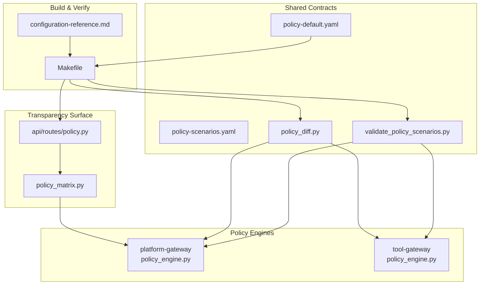
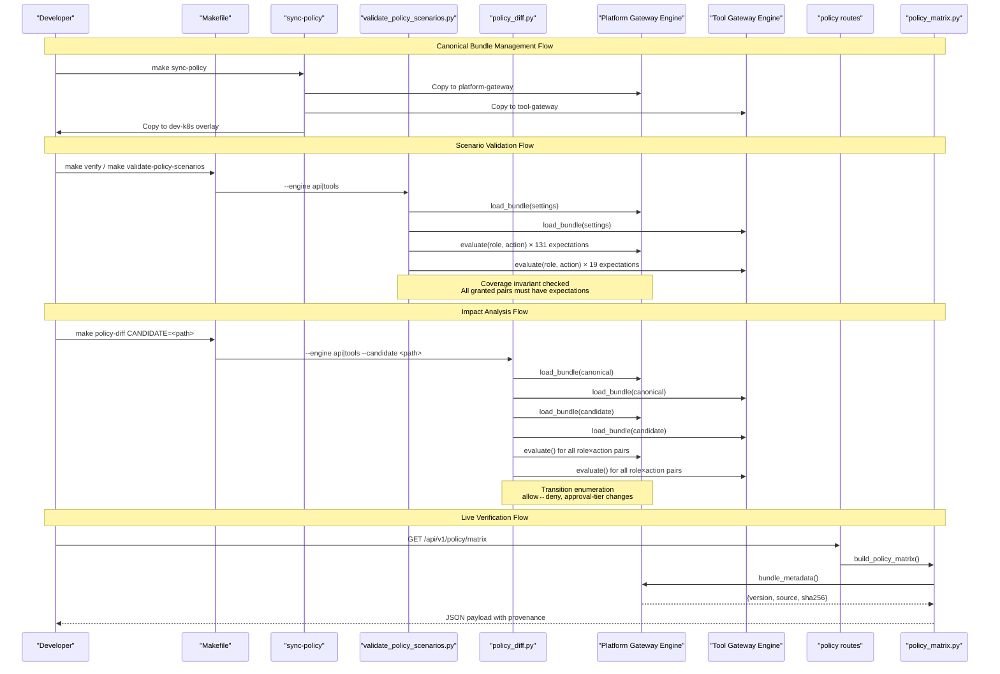
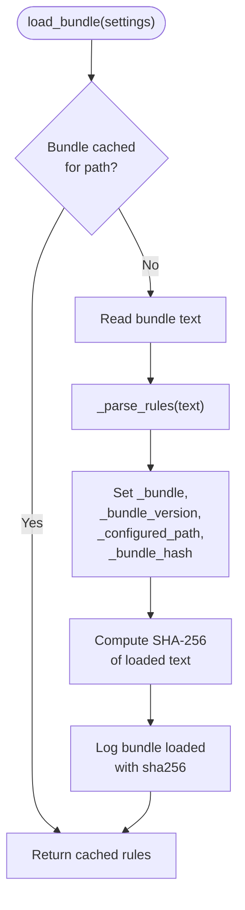
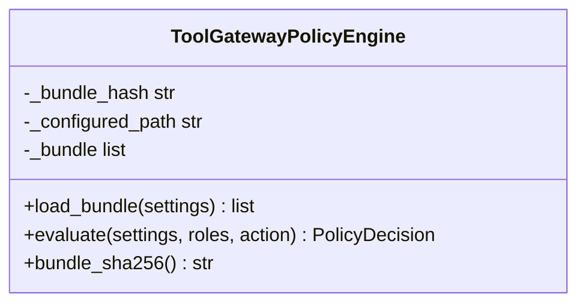
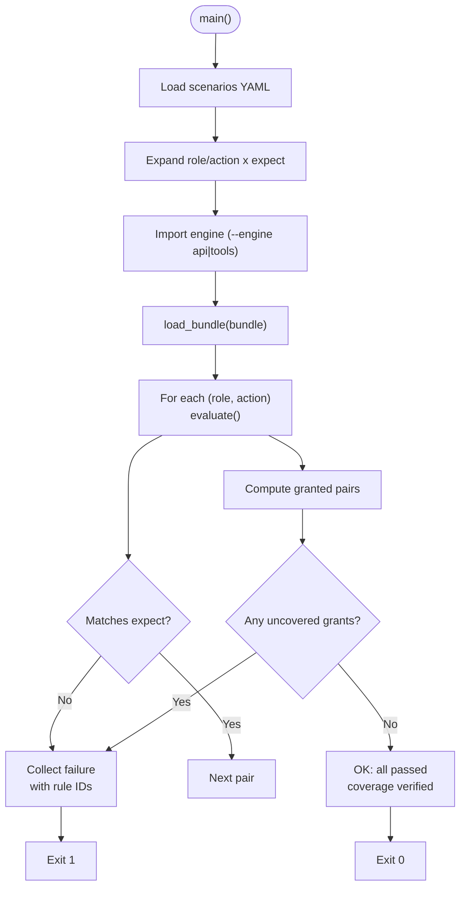
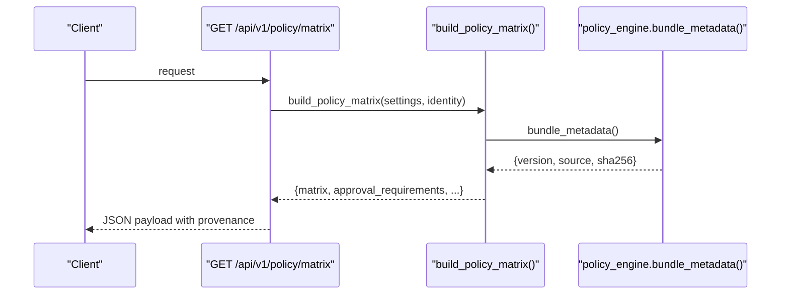
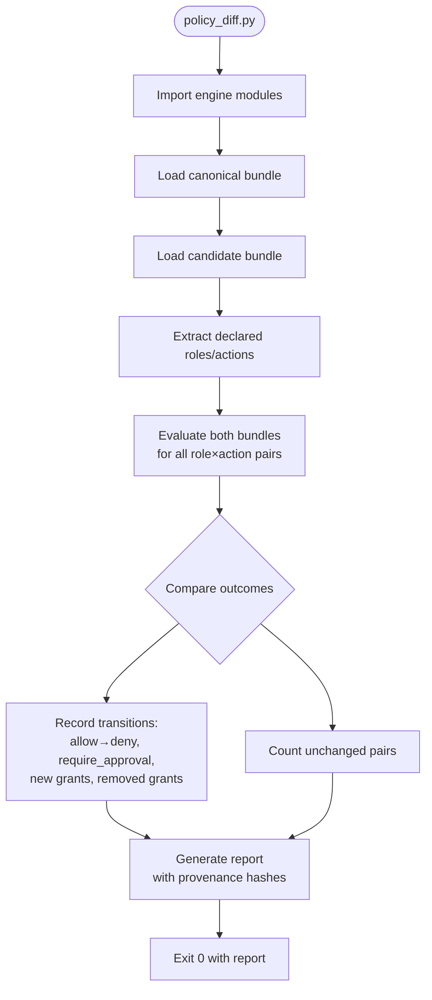
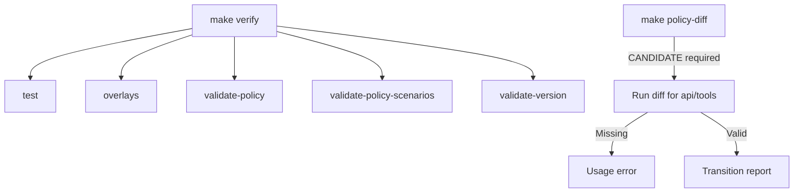
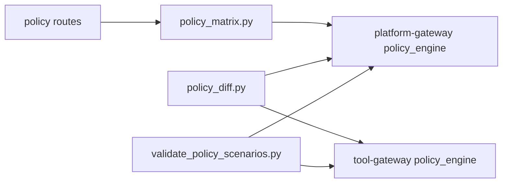

# SPEC-048: Policy Testing and Rollout Controls

<cite>
**Referenced Files in This Document**
- [spec.md](file://docs/specs/SPEC-048-policy-testing-rollout-controls/spec.md)
- [plan.md](file://docs/specs/SPEC-048-policy-testing-rollout-controls/plan.md)
- [tasks.md](file://docs/specs/SPEC-048-policy-testing-rollout-controls/tasks.md)
- [policy_engine.py (platform-gateway)](file://products/platform-gateway/src/platform_gateway/services/policy_engine.py)
- [policy_engine.py (tool-gateway)](file://products/tool-gateway/src/tool_gateway/services/policy_engine.py)
- [policy_matrix.py](file://products/platform-gateway/src/platform_gateway/services/policy_matrix.py)
- [policy.py (routes)](file://products/platform-gateway/src/platform_gateway/api/routes/policy.py)
- [validate_policy_scenarios.py](file://shared/shared-contracts/scripts/validate_policy_scenarios.py)
- [policy_diff.py](file://shared/shared-contracts/scripts/policy_diff.py)
- [policy-scenarios.yaml](file://shared/shared-contracts/policies/policy-scenarios.yaml)
- [policy-default.yaml](file://shared/shared-contracts/policies/policy-default.yaml)
- [Makefile](file://Makefile)
- [configuration-reference.md](file://docs/guides/configuration-reference.md)
- [release notes](file://docs/agentic-aiops-platform/release-notes/2026-09-02-spec-048-policy-testing-rollout-controls.md)
</cite>

## Update Summary
**Changes Made**
- Updated to document the complete SPEC-048 rollout controls implementation
- Enhanced canonical bundle management section with `make sync-policy` workflow
- Expanded semantic regression guards through `policy-scenarios.yaml` harness
- Added comprehensive verification process combining JSON schema validation with scenario expectations
- Documented per-(role, action) outcome transition reporting via `policy-diff` tool
- Updated architecture diagrams to reflect full implementation with provenance fingerprinting
- Enhanced troubleshooting guide with specific error scenarios and resolution paths

## Table of Contents
1. [Introduction](#introduction)
2. [Project Structure](#project-structure)
3. [Core Components](#core-components)
4. [Architecture Overview](#architecture-overview)
5. [Detailed Component Analysis](#detailed-component-analysis)
6. [Canonical Bundle Management](#canonical-bundle-management)
7. [Semantic Regression Guards](#semantic-regression-guards)
8. [Verification Process](#verification-process)
9. [Policy Diff Impact Reporting](#policy-diff-impact-reporting)
10. [Cross-Environment Promotion Strategy](#cross-environment-promotion-strategy)
11. [Comprehensive Testing Strategy](#comprehensive-testing-strategy)
12. [Dependency Analysis](#dependency-analysis)
13. [Performance Considerations](#performance-considerations)
14. [Troubleshooting Guide](#troubleshooting-guide)
15. [Conclusion](#conclusion)

## Introduction
SPEC-048 introduces comprehensive policy testing and rollout controls for the platform's policy engines without changing evaluation semantics or bundle schema. It adds a content-hash provenance field to live surfaces, a scenario-expectation harness integrated into verification, a review-time impact report comparing bundles, and a documented rollout runbook. The goal is to prevent silent grant flips, make enforcement transparent, and give operators confidence that the running bundle matches the intended commit.

**Status:** Delivered in v0.30.0 (R5 — Hardening and External Consumption)

Key outcomes delivered:
- **Versioned-and-Auditable Floor**: Bundle provenance hash on matrix and readiness surfaces via SHA-256 content hashing provides immutable audit trail
- **Canonical Bundle Management**: Single source of truth with `make sync-policy` copying to all consumer locations
- **Semantic Regression Guards**: Scenario expectations enforced by CI via `make verify` with 131 API and 19 tool expectations coverage
- **Review-Time Impact Analysis**: Per-(role, action) outcome transitions using shared evaluation path
- **Explicit Rollout Posture**: Restart-based rollout with no hot reload, ensuring fail-fast behavior

**Section sources**
- [spec.md:19-42](file://docs/specs/SPEC-048-policy-testing-rollout-controls/spec.md#L19-L42)
- [plan.md:3-15](file://docs/specs/SPEC-048-policy-testing-rollout-controls/plan.md#L3-L15)
- [release notes:7-59](file://docs/agentic-aiops-platform/release-notes/2026-09-02-spec-048-policy-testing-rollout-controls.md#L7-L59)

## Project Structure
SPEC-048 touches two policy engines, their transparency surface, shared scenario definitions, and root Make targets that orchestrate verification and reporting.

**Diagram sources**
- [policy_engine.py (platform-gateway):323-376](file://products/platform-gateway/src/platform_gateway/services/policy_engine.py#L323-L376)
- [policy_engine.py (tool-gateway):254-296](file://products/tool-gateway/src/tool_gateway/services/policy_engine.py#L254-L296)
- [policy_matrix.py:31-87](file://products/platform-gateway/src/platform_gateway/services/policy_matrix.py#L31-L87)
- [policy.py (routes):30-54](file://products/platform-gateway/src/platform_gateway/api/routes/policy.py#L30-L54)
- [policy-scenarios.yaml:1-20](file://shared/shared-contracts/policies/policy-scenarios.yaml#L1-L20)
- [validate_policy_scenarios.py:37-47](file://shared/shared-contracts/scripts/validate_policy_scenarios.py#L37-L47)
- [policy_diff.py:48-58](file://shared/shared-contracts/scripts/policy_diff.py#L48-L58)
- [Makefile:122-167](file://Makefile#L122-L167)

**Section sources**
- [Makefile:122-167](file://Makefile#L122-L167)
- [policy_matrix.py:31-87](file://products/platform-gateway/src/platform_gateway/services/policy_matrix.py#L31-L87)
- [policy.py (routes):30-54](file://products/platform-gateway/src/platform_gateway/api/routes/policy.py#L30-L54)

## Core Components
The implementation delivers four major capabilities as specified in R-1 through R-6:

### Versioned-and-Auditable Floor Implementation (R-1)
- Platform-gateway policy engine computes SHA-256 of exact loaded text at load time
- Tool-gateway policy engine provides `bundle_sha256()` helper for health/readiness surfaces  
- Matrix route includes provenance block (version, source, sha256) under existing `policy:read` gate
- Both gateways' readiness/health surfaces carry the same block for deployment confirmation
- Immutable audit trail: hash computed at load time, never authored in bundle

### Canonical Bundle Management (R-4, R-5)
- Single canonical copy in `shared/shared-contracts/policies/policy-default.yaml`
- `make sync-policy` copies to all consumer locations: both gateways and dev-k8s overlay
- Byte-identical replication ensures consistency across environments
- Contract tests fail on any drift between canonical and replicas

### Semantic Regression Guards (R-2)
- Curated but complete scenario table covering 131 API expectations over 21-action vocabulary
- 19 tool expectations honoring deliberate engine non-parity (require_approval rules skipped at load)
- Full grant coverage invariant: every granted pair must have explicit expectation
- Named denials enforced: auditor gets nothing, observer denied mutating/authoring/governance surfaces
- Integrated into `make verify` alongside schema validation

### Policy Diff Impact Reporting (R-3)
- Review-time comparison between canonical and candidate bundles
- Enumerates per-(role, action) outcome transitions: allow→deny, allow→require_approval, new grants, removed grants
- Shares exact evaluation path with scenario harness — one evaluator, two entry points
- Reports unchanged pairs by count; missing/unparseable candidate is hard error

**Section sources**
- [policy_engine.py (platform-gateway):323-376](file://products/platform-gateway/src/platform_gateway/services/policy_engine.py#L323-L376)
- [policy_engine.py (tool-gateway):254-296](file://products/tool-gateway/src/tool_gateway/services/policy_engine.py#L254-L296)
- [policy_matrix.py:31-87](file://products/platform-gateway/src/platform_gateway/services/policy_matrix.py#L31-L87)
- [validate_policy_scenarios.py:95-155](file://shared/shared-contracts/scripts/validate_policy_scenarios.py#L95-L155)
- [policy_diff.py:117-183](file://shared/shared-contracts/scripts/policy_diff.py#L117-L183)
- [Makefile:136-167](file://Makefile#L136-L167)

## Architecture Overview
The control flow spans bundle load, provenance computation, scenario validation, and matrix exposure with full implementation of all four capability areas.

**Diagram sources**
- [Makefile:136-167](file://Makefile#L136-L167)
- [validate_policy_scenarios.py:95-155](file://shared/shared-contracts/scripts/validate_policy_scenarios.py#L95-L155)
- [policy_diff.py:117-183](file://shared/shared-contracts/scripts/policy_diff.py#L117-L183)
- [policy_engine.py (platform-gateway):323-376](file://products/platform-gateway/src/platform_gateway/services/policy_engine.py#L323-L376)
- [policy_engine.py (tool-gateway):254-296](file://products/tool-gateway/src/tool_gateway/services/policy_engine.py#L254-L296)
- [policy.py (routes):30-54](file://products/platform-gateway/src/platform_gateway/api/routes/policy.py#L30-L54)
- [policy_matrix.py:31-87](file://products/platform-gateway/src/platform_gateway/services/policy_matrix.py#L31-L87)

## Detailed Component Analysis

### Platform-Gateway Policy Engine Provenance
- Loads bundle from configured path or packaged default with path-keyed caching
- Computes SHA-256 of exact loaded text at load time (never authored in bundle)
- Exposes `bundle_metadata()` returning version, source, and sha256
- Matrix route uses this metadata to include sha256 in response under existing `policy:read` gate

**Diagram sources**
- [policy_engine.py (platform-gateway):323-360](file://products/platform-gateway/src/platform_gateway/services/policy_engine.py#L323-L360)

**Section sources**
- [policy_engine.py (platform-gateway):323-376](file://products/platform-gateway/src/platform_gateway/services/policy_engine.py#L323-L376)
- [policy_matrix.py:31-87](file://products/platform-gateway/src/platform_gateway/services/policy_matrix.py#L31-L87)

### Tool-Gateway Policy Engine Provenance
- Same provenance capture strategy as platform-gateway with path-keyed caching
- Provides `bundle_sha256()` for readiness/health surfaces
- Skips require_approval rules at load per gateway constraints (SPEC-030 R-2)
- Health builder exposes hash beside existing `policy_rules` count

**Diagram sources**
- [policy_engine.py (tool-gateway):254-296](file://products/tool-gateway/src/tool_gateway/services/policy_engine.py#L254-L296)

**Section sources**
- [policy_engine.py (tool-gateway):254-296](file://products/tool-gateway/src/tool_gateway/services/policy_engine.py#L254-L296)

### Scenario Expectation Harness
- Reads `policy-scenarios.yaml`, expands role/action pairs, imports owning engine, evaluates each expectation
- Enforces coverage: every granted pair must have an expectation (131 API + 19 tools expectations)
- Honors deliberate engine non-parity: API vocabulary vs tool vocabulary
- Fails non-zero on mismatch or missing coverage with detailed failure messages

**Diagram sources**
- [validate_policy_scenarios.py:95-155](file://shared/shared-contracts/scripts/validate_policy_scenarios.py#L95-L155)
- [policy-scenarios.yaml:21-191](file://shared/shared-contracts/policies/policy-scenarios.yaml#L21-L191)

**Section sources**
- [validate_policy_scenarios.py:95-155](file://shared/shared-contracts/scripts/validate_policy_scenarios.py#L95-L155)
- [policy-scenarios.yaml:1-20](file://shared/shared-contracts/policies/policy-scenarios.yaml#L1-L20)

### Policy Matrix Exposure
- Builds caller-scoped matrix using actual engine evaluation path
- Includes provenance block (version, source, sha256) in response under existing `policy:read` gate
- Server-side role filtering: admin sees full scope, others see own scope
- Approval requirements preserved with tier information

**Diagram sources**
- [policy.py (routes):30-54](file://products/platform-gateway/src/platform_gateway/api/routes/policy.py#L30-L54)
- [policy_matrix.py:31-87](file://products/platform-gateway/src/platform_gateway/services/policy_matrix.py#L31-L87)

**Section sources**
- [policy.py (routes):30-54](file://products/platform-gateway/src/platform_gateway/api/routes/policy.py#L30-L54)
- [policy_matrix.py:31-87](file://products/platform-gateway/src/platform_gateway/services/policy_matrix.py#L31-L87)

### Policy Diff Impact Reporter
- Compares canonical bundle against candidate file using shared evaluation path
- Enumerates per-(role, action) outcome transitions across both vocabularies
- Reports unchanged pairs by count; missing/unparseable candidate is hard error
- Shares exact evaluation path with scenario harness — one evaluator, two entry points

**Diagram sources**
- [policy_diff.py:117-183](file://shared/shared-contracts/scripts/policy_diff.py#L117-L183)

**Section sources**
- [policy_diff.py:117-183](file://shared/shared-contracts/scripts/policy_diff.py#L117-L183)

### Make Targets and Verification Gate
- `sync-policy`: copies canonical bundle to consumer locations including overlay
- `validate-policy`: validates bundle schema against JSON schema
- `validate-policy-scenarios`: runs scenario harness for both engines (131 API + 19 tools expectations)
- `policy-diff`: compares candidate vs canonical (requires CANDIDATE parameter)
- `verify`: aggregates tests, overlays, policy checks, scenarios, and version lockstep

**Diagram sources**
- [Makefile:122-167](file://Makefile#L122-L167)

**Section sources**
- [Makefile:122-167](file://Makefile#L122-L167)

## Canonical Bundle Management
The implementation establishes a single source of truth for policy bundles with automated synchronization:

### Single Canonical Source
- **Location**: `shared/shared-contracts/policies/policy-default.yaml`
- **Version Discipline**: Bump `version` field on every rule change
- **Review Discipline**: Git history is the authority; no monotonicity machinery

### Automated Synchronization
- **Command**: `make sync-policy`
- **Targets**: 
  - `products/tool-gateway/src/tool_gateway/policies/policy-default.yaml`
  - `products/platform-gateway/src/platform_gateway/policies/policy-default.yaml`
  - `shared/platform-ops/gitops/dev-k8s/base/shared/policy.yaml`
- **Guarantee**: Byte-identical copies across all locations

### Drift Detection
- Contract tests enforce byte-identical parity between canonical and replicas
- Any manual edit to replicas fails `make verify`
- Ensures all consumers always use the intended bundle version

**Section sources**
- [Makefile:125-135](file://Makefile#L125-L135)
- [configuration-reference.md:282-323](file://docs/guides/configuration-reference.md#L282-L323)

## Semantic Regression Guards
The scenario expectation harness provides comprehensive regression protection:

### Scenario Table Structure
- **Location**: `shared/shared-contracts/policies/policy-scenarios.yaml`
- **Sections**: Separate `api` and `tools` sections honoring engine non-parity
- **Expectations**: Every granted (role, action) pair must have explicit expectation

### Coverage Invariant Enforcement
- **Mechanism**: Harness mechanically enforces full grant coverage
- **Failure Mode**: New grants without expectations fail `make verify`
- **Prompt Design**: Intentional failure to ensure intent is recorded in same commit

### Engine Non-Parity Handling
- **API Vocabulary**: 21 actions with `require_approval` rules evaluating normally
- **Tools Vocabulary**: Different action set where `require_approval` rules are skipped at load
- **Separate Sections**: Each engine has its own expectation section

**Section sources**
- [validate_policy_scenarios.py:50-75](file://shared/shared-contracts/scripts/validate_policy_scenarios.py#L50-L75)
- [policy-scenarios.yaml:21-191](file://shared/shared-contracts/policies/policy-scenarios.yaml#L21-L191)

## Verification Process
The verification process combines multiple validation layers:

### Multi-Layer Validation Pipeline
1. **Schema Validation**: `make validate-policy` checks bundle structure against JSON schema
2. **Scenario Expectations**: `make validate-policy-scenarios` evaluates both engines
3. **Copy Parity**: Contract tests ensure replicas match canonical
4. **Version Lockstep**: `make validate-version` maintains version consistency

### Integration with Build Process
- **Pre-commit Gate**: `make verify` runs before commits
- **CI Integration**: Same checks run in continuous integration
- **Post-build Verification**: Green status maintained after `make build`

### Comprehensive Coverage
- **131 API Expectations**: Covering all platform-gateway actions
- **19 Tool Expectations**: Covering tool-gateway invocation vocabulary
- **Named Denials**: Explicit expectations for auditor, observer, developer restrictions
- **Deny-by-Default Floor**: Tests for ungranted roles and actions

**Section sources**
- [Makefile:141-156](file://Makefile#L141-L156)
- [validate_policy_scenarios.py:100-160](file://shared/shared-contracts/scripts/validate_policy_scenarios.py#L100-L160)

## Policy Diff Impact Reporting
The policy diff tool provides comprehensive impact analysis for policy changes:

### Review-Time Analysis
- **Command**: `make policy-diff CANDIDATE=<path>`
- **Purpose**: Compare canonical bundle against candidate file
- **Safety**: Never modifies canonical bundle; read-only operation

### Transition Enumeration
- **Per-(role, action)**: Evaluates all combinations across both vocabularies
- **Transition Types**: 
  - `allow → deny`: Access removal
  - `allow → require_approval`: New approval requirement
  - `require_approval → allow`: Removed approval requirement
  - `new grants`: Previously denied access now allowed
  - `removed grants`: Previously allowed access now denied
  - `approval-tier changes`: Changes in approval level

### Output Format
- **Provenance Hashes**: Both canonical and candidate bundle SHA-256 values
- **Pair Space**: Union of roles and actions from both bundles plus protected actions
- **Summary Statistics**: Count of unchanged pairs and total transitions
- **Human-Readable**: Clear formatting for review in pull requests

**Section sources**
- [policy_diff.py:117-183](file://shared/shared-contracts/scripts/policy_diff.py#L117-L183)
- [Makefile:146-152](file://Makefile#L146-L152)

## Cross-Environment Promotion Strategy
The implementation supports a comprehensive cross-environment promotion strategy for dev/qa/prd environments:

### Environment-Specific Deployment
- **Development Environment**: Uses dev-k8s overlay with immediate feedback loop
- **Quality Assurance Environment**: Validates policy changes against test scenarios
- **Production Environment**: Final deployment with hash-chain verification

### Promotion Workflow
1. **Edit Canonical Bundle**: Modify `shared/shared-contracts/policies/policy-default.yaml`
2. **Update Scenarios**: Record intent changes in `policy-scenarios.yaml`
3. **Sync and Verify**: Run `make sync-policy` and `make verify`
4. **Impact Analysis**: Use `make policy-diff` to review changes
5. **Deploy to Dev**: `make deploy` to development environment
6. **Promote to QA**: Validate with automated testing
7. **Promote to Production**: Final deployment with hash verification

### Hash-Chain Verification
- Each environment maintains the same canonical bundle
- Provenance hash ensures identical content across environments
- Operators can verify deployed bundle matches intended commit
- No environment-specific bundle divergence

**Section sources**
- [spec.md:191-215](file://docs/specs/SPEC-048-policy-testing-rollout-controls/spec.md#L191-L215)
- [configuration-reference.md:282-323](file://docs/guides/configuration-reference.md#L282-L323)

## Comprehensive Testing Strategy
The implementation includes a comprehensive testing strategy covering all four required test types before deployment:

### Test Type 1: Schema Validation
- Validates bundle structure against JSON schema
- Ensures proper YAML formatting and rule syntax
- Catches malformed bundles before deployment

### Test Type 2: Scenario Expectation Testing
- Evaluates 131 API expectations against platform-gateway engine
- Evaluates 19 tool expectations against tool-gateway engine
- Enforces full grant coverage invariant
- Validates named denials and deny-by-default floor

### Test Type 3: Policy Diff Testing
- Compares canonical bundle against candidate files
- Enumerates all per-(role, action) outcome transitions
- Reports unchanged pairs by count
- Validates transition detection accuracy

### Test Type 4: Integration and Live Testing
- Verifies hash stability and sensitivity
- Tests both configured-path and packaged-default loading
- Validates matrix payload shape and tool-gateway health shape
- Confirms live deployment hash matching

### Automated Verification Pipeline
- All tests integrated into `make verify` target
- Runs before and after `make build`
- Ensures green status across all product suites
- Maintains version lockstep across components

**Section sources**
- [validate_policy_scenarios.py:95-155](file://shared/shared-contracts/scripts/validate_policy_scenarios.py#L95-L155)
- [policy_diff.py:117-183](file://shared/shared-contracts/scripts/policy_diff.py#L117-L183)
- [Makefile:167-168](file://Makefile#L167-L168)

## Dependency Analysis
- Shared scripts depend on product engines to ensure evaluation parity; they run inside product uv environments
- Platform-gateway matrix depends on engine metadata and evaluation path
- Tool-gateway readiness surfaces depend on engine-provided hash accessor
- Scenario harness and diff share common evaluation path to prevent drift

**Diagram sources**
- [validate_policy_scenarios.py:37-47](file://shared/shared-contracts/scripts/validate_policy_scenarios.py#L37-L47)
- [policy_diff.py:48-58](file://shared/shared-contracts/scripts/policy_diff.py#L48-L58)
- [policy_matrix.py:31-87](file://products/platform-gateway/src/platform_gateway/services/policy_matrix.py#L31-L87)

**Section sources**
- [validate_policy_scenarios.py:37-47](file://shared/shared-contracts/scripts/validate_policy_scenarios.py#L37-L47)
- [policy_diff.py:48-58](file://shared/shared-contracts/scripts/policy_diff.py#L48-L58)
- [policy_matrix.py:31-87](file://products/platform-gateway/src/platform_gateway/services/policy_matrix.py#L31-L87)

## Performance Considerations
- Bundle caching keyed by configured path avoids re-parsing on repeated calls
- Hash computation occurs once per load; negligible overhead relative to I/O
- Scenario harness evaluates only declared expectations plus coverage check; complexity proportional to number of scenarios and actions
- Matrix building iterates visible roles × actions; scope filtering reduces work for non-admin identities
- Policy diff evaluates all role×action pairs between bundles; unchanged pairs summarized by count
- All operations are CPU-bound with minimal memory footprint due to streaming evaluation

## Troubleshooting Guide
Common issues and resolutions:

### Scenario Failures
- **Symptom**: `make validate-policy-scenarios` fails with non-zero exit
- **Cause**: Rule edit changed operator-visible outcome or introduced ungranted gap
- **Resolution**: Update expectations in same commit to make intent explicit
- **Details**: Failure message includes specific role×action pair and expected vs actual decision

### Missing Candidate for Policy Diff
- **Symptom**: `make policy-diff` shows usage error
- **Cause**: Missing CANDIDATE parameter
- **Resolution**: Provide valid file path: `make policy-diff CANDIDATE=/path/to/candidate.yaml`

### Bundle Load Errors
- **Symptom**: `PolicyLoadError` during bundle loading
- **Cause**: Malformed YAML or invalid rule structure
- **Resolution**: Fix bundle before proceeding; errors include specific parsing details

### Provenance Mismatch After Deploy
- **Symptom**: Matrix/hash doesn't match expected bundle
- **Cause**: Pod didn't restart after ConfigMap change or wrong bundle deployed
- **Resolution**: Confirm pod restart occurred; verify deployed bundle's SHA-256 matches matrix/readiness output

### Coverage Gaps
- **Symptom**: New grant causes scenario failure
- **Cause**: New grant lacks corresponding expectation in `policy-scenarios.yaml`
- **Resolution**: Add expectation for new grant in same commit; harness enforces full coverage

### Engine Non-Parity Surprises
- **Symptom**: Different behavior between API and tools engines
- **Cause**: Tools engine skips require_approval rules at load (SPEC-030 R-2)
- **Resolution**: Use appropriate engine section in scenarios; understand deliberate non-parity

### Cross-Environment Promotion Issues
- **Symptom**: Hash mismatch between environments
- **Cause**: Bundle drift or incomplete promotion workflow
- **Resolution**: Re-sync canonical bundle and verify hash chain across environments

### Canonical Bundle Drift
- **Symptom**: `make verify` fails with replica mismatch
- **Cause**: Manual edit to replica instead of canonical bundle
- **Resolution**: Edit canonical bundle and run `make sync-policy`; never edit replicas directly

**Section sources**
- [validate_policy_scenarios.py:102-122](file://shared/shared-contracts/scripts/validate_policy_scenarios.py#L102-L122)
- [Makefile:145-151](file://Makefile#L145-L151)
- [policy_engine.py (platform-gateway):323-360](file://products/platform-gateway/src/platform_gateway/services/policy_engine.py#L323-L360)
- [policy_engine.py (tool-gateway):254-287](file://products/tool-gateway/src/tool_gateway/services/policy_engine.py#L254-L287)
- [policy_diff.py:128-133](file://shared/shared-contracts/scripts/policy_diff.py#L128-L133)

## Conclusion
SPEC-048 successfully delivers comprehensive policy governance through transparent provenance, scenario-driven guards, and review-time impact analysis while preserving existing evaluation semantics and rollout posture. The v0.30.0 release implements all four major capabilities:

1. **Versioned-and-Auditable Floor**: Bundle provenance fingerprinting with SHA-256 content hashing on both engines' matrix and readiness surfaces
2. **Canonical Bundle Management**: Single source of truth with automated synchronization to all consumers
3. **Semantic Regression Guards**: Scenario expectations enforcing full grant coverage with 131 API and 19 tool expectations
4. **Policy Diff Impact Reporting**: Providing review-time analysis of per-(role, action) outcome transitions
5. **Documented Rollout Procedures**: With explicit restart-based deployment workflow

Operators gain verifiable assurance that the enforced bundle matches the intended commit across all environments, and authors are guided to explicitly record intent changes alongside rule edits. The implementation maintains backward compatibility with no breaking changes to existing APIs or evaluation semantics.

Live validation confirms the implementation works as designed: both gateways' `/health/ready` endpoints carry fingerprints matching the canonical file byte-for-byte, the matrix surface carries the provenance hash under the unchanged `policy:read` gate, and the scenario guard demonstrably fails on deliberate local flips while passing on identical bundles.

[No sources needed since this section summarizes without analyzing specific files]