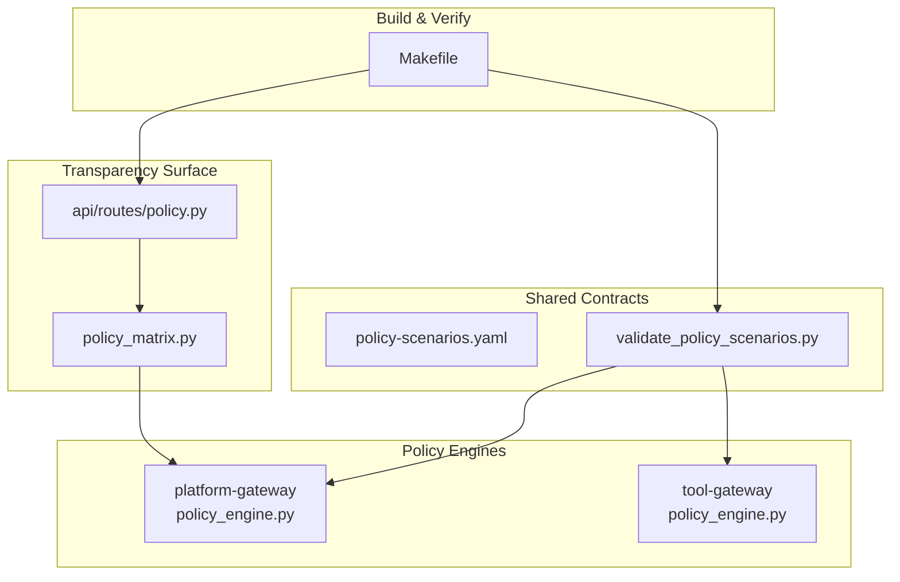
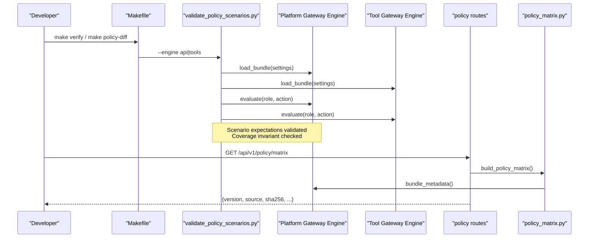
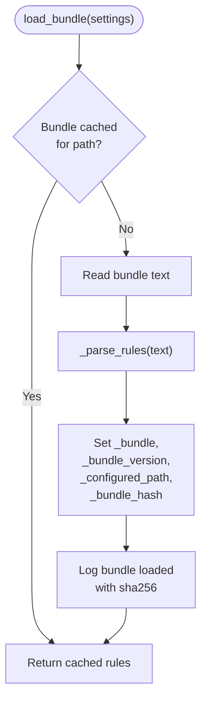
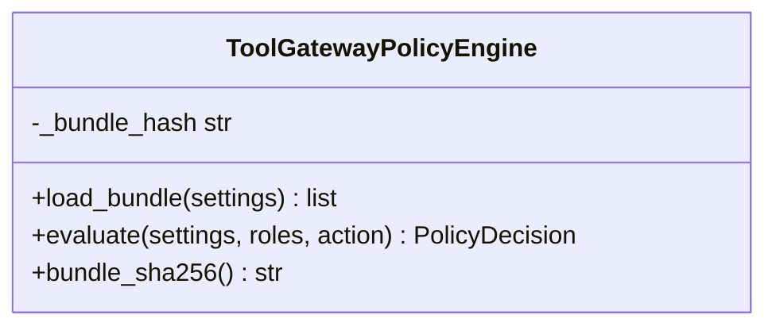
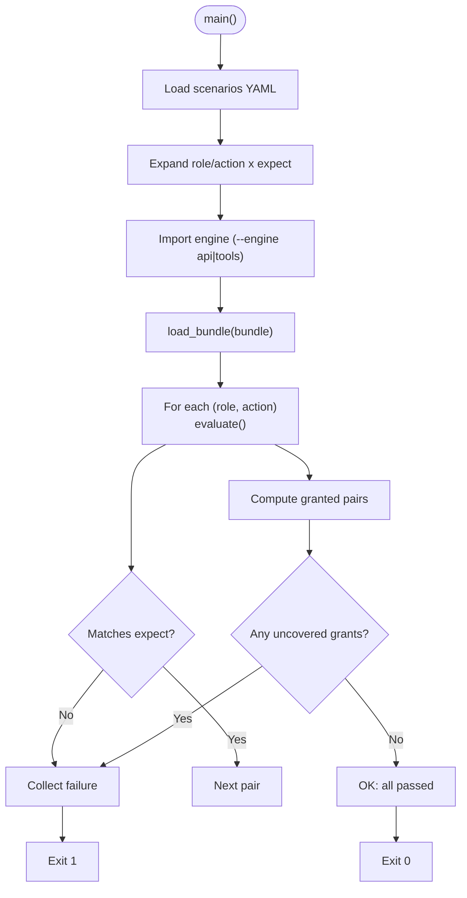
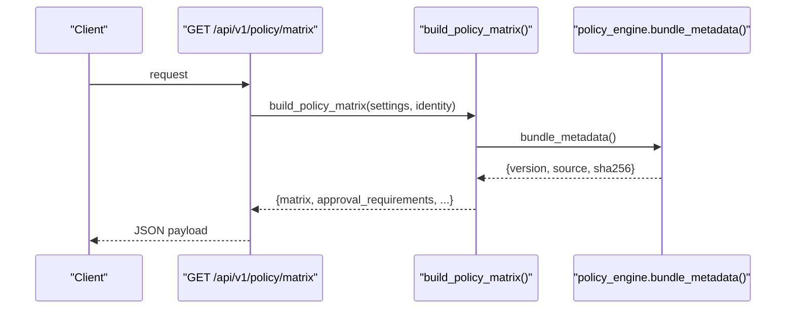
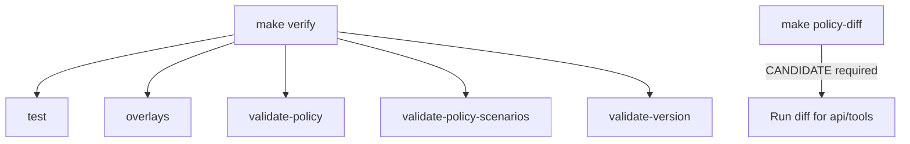
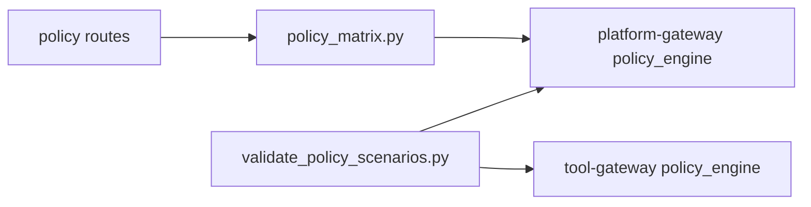

# SPEC-048: Policy Testing and Rollout Controls

<cite>
**Referenced Files in This Document**
- [spec.md](file://docs/specs/SPEC-048-policy-testing-rollout-controls/spec.md)
- [plan.md](file://docs/specs/SPEC-048-policy-testing-rollout-controls/plan.md)
- [tasks.md](file://docs/specs/SPEC-048-policy-testing-rollout-controls/tasks.md)
- [policy_engine.py (platform-gateway)](file://products/platform-gateway/src/platform_gateway/services/policy_engine.py)
- [policy_engine.py (tool-gateway)](file://products/tool-gateway/src/tool_gateway/services/policy_engine.py)
- [policy_matrix.py](file://products/platform-gateway/src/platform_gateway/services/policy_matrix.py)
- [policy.py (routes)](file://products/platform-gateway/src/platform_gateway/api/routes/policy.py)
- [policy-scenarios.yaml](file://shared/shared-contracts/policies/policy-scenarios.yaml)
- [validate_policy_scenarios.py](file://shared/shared-contracts/scripts/validate_policy_scenarios.py)
- [Makefile](file://Makefile)
</cite>

## Table of Contents
1. [Introduction](#introduction)
2. [Project Structure](#project-structure)
3. [Core Components](#core-components)
4. [Architecture Overview](#architecture-overview)
5. [Detailed Component Analysis](#detailed-component-analysis)
6. [Dependency Analysis](#dependency-analysis)
7. [Performance Considerations](#performance-considerations)
8. [Troubleshooting Guide](#troubleshooting-guide)
9. [Conclusion](#conclusion)

## Introduction
SPEC-048 introduces policy testing and rollout controls for the platform’s policy engines without changing evaluation semantics or bundle schema. It adds a content-hash provenance field to live surfaces, a scenario-expectation harness integrated into verification, a review-time impact report comparing bundles, and a documented rollout runbook. The goal is to prevent silent grant flips, make enforcement transparent, and give operators confidence that the running bundle matches the intended commit.

Key outcomes:
- Bundle provenance hash on matrix and readiness surfaces.
- Scenario expectations enforced by CI via `make verify`.
- Review-time diff of role×action outcome transitions.
- Explicit restart-based rollout posture with no hot reload.

**Section sources**
- [spec.md:19-42](file://docs/specs/SPEC-048-policy-testing-rollout-controls/spec.md#L19-L42)
- [plan.md:3-15](file://docs/specs/SPEC-048-policy-testing-rollout-controls/plan.md#L3-L15)

## Project Structure
SPEC-048 touches two policy engines, their transparency surface, shared scenario definitions, and root Make targets that orchestrate verification and reporting.

**Diagram sources**
- [policy_engine.py (platform-gateway):323-376](file://products/platform-gateway/src/platform_gateway/services/policy_engine.py#L323-L376)
- [policy_engine.py (tool-gateway):254-296](file://products/tool-gateway/src/tool_gateway/services/policy_engine.py#L254-L296)
- [policy_matrix.py:31-87](file://products/platform-gateway/src/platform_gateway/services/policy_matrix.py#L31-L87)
- [policy.py (routes):30-54](file://products/platform-gateway/src/platform_gateway/api/routes/policy.py#L30-L54)
- [policy-scenarios.yaml:1-20](file://shared/shared-contracts/policies/policy-scenarios.yaml#L1-L20)
- [validate_policy_scenarios.py:37-47](file://shared/shared-contracts/scripts/validate_policy_scenarios.py#L37-L47)
- [Makefile:122-167](file://Makefile#L122-L167)

**Section sources**
- [Makefile:122-167](file://Makefile#L122-L167)
- [policy_matrix.py:31-87](file://products/platform-gateway/src/platform_gateway/services/policy_matrix.py#L31-L87)
- [policy.py (routes):30-54](file://products/platform-gateway/src/platform_gateway/api/routes/policy.py#L30-L54)

## Core Components
- Platform-gateway policy engine: loads bundle, computes SHA-256 of loaded text, exposes metadata including version, source, and sha256.
- Tool-gateway policy engine: same provenance capture; provides a helper to read the hash for health/readiness surfaces.
- Policy matrix builder: includes the provenance block in the matrix payload under the existing `policy:read` gate.
- Scenario harness: evaluates canonical scenarios against both engines using the real evaluation path; enforces coverage of every granted pair.
- Make targets: validate-policy, validate-policy-scenarios, policy-diff, and verify orchestration.

**Section sources**
- [policy_engine.py (platform-gateway):323-376](file://products/platform-gateway/src/platform_gateway/services/policy_engine.py#L323-L376)
- [policy_engine.py (tool-gateway):254-296](file://products/tool-gateway/src/tool_gateway/services/policy_engine.py#L254-L296)
- [policy_matrix.py:31-87](file://products/platform-gateway/src/platform_gateway/services/policy_matrix.py#L31-L87)
- [validate_policy_scenarios.py:95-155](file://shared/shared-contracts/scripts/validate_policy_scenarios.py#L95-L155)
- [Makefile:136-167](file://Makefile#L136-L167)

## Architecture Overview
The control flow spans bundle load, provenance computation, scenario validation, and matrix exposure.

**Diagram sources**
- [Makefile:136-167](file://Makefile#L136-L167)
- [validate_policy_scenarios.py:95-155](file://shared/shared-contracts/scripts/validate_policy_scenarios.py#L95-L155)
- [policy_engine.py (platform-gateway):323-376](file://products/platform-gateway/src/platform_gateway/services/policy_engine.py#L323-L376)
- [policy_engine.py (tool-gateway):254-296](file://products/tool-gateway/src/tool_gateway/services/policy_engine.py#L254-L296)
- [policy.py (routes):30-54](file://products/platform-gateway/src/platform_gateway/api/routes/policy.py#L30-L54)
- [policy_matrix.py:31-87](file://products/platform-gateway/src/platform_gateway/services/policy_matrix.py#L31-L87)

## Detailed Component Analysis

### Platform-Gateway Policy Engine Provenance
- Loads bundle from configured path or packaged default.
- Computes SHA-256 of exact loaded text at load time.
- Exposes `bundle_metadata()` returning version, source, and sha256.
- Matrix route uses this metadata to include sha256 in response.

**Diagram sources**
- [policy_engine.py (platform-gateway):323-360](file://products/platform-gateway/src/platform_gateway/services/policy_engine.py#L323-L360)

**Section sources**
- [policy_engine.py (platform-gateway):323-376](file://products/platform-gateway/src/platform_gateway/services/policy_engine.py#L323-L376)
- [policy_matrix.py:31-87](file://products/platform-gateway/src/platform_gateway/services/policy_matrix.py#L31-L87)

### Tool-Gateway Policy Engine Provenance
- Same provenance capture strategy as platform-gateway.
- Provides `bundle_sha256()` for readiness/health surfaces.
- Skips require_approval rules at load per gateway constraints.

**Diagram sources**
- [policy_engine.py (tool-gateway):254-296](file://products/tool-gateway/src/tool_gateway/services/policy_engine.py#L254-L296)

**Section sources**
- [policy_engine.py (tool-gateway):254-296](file://products/tool-gateway/src/tool_gateway/services/policy_engine.py#L254-L296)

### Scenario Expectation Harness
- Reads `policy-scenarios.yaml`, expands role/action pairs, imports the owning engine, and evaluates each expectation.
- Enforces coverage: every granted pair must have an expectation.
- Fails non-zero on mismatch or missing coverage.

**Diagram sources**
- [validate_policy_scenarios.py:95-155](file://shared/shared-contracts/scripts/validate_policy_scenarios.py#L95-L155)
- [policy-scenarios.yaml:21-191](file://shared/shared-contracts/policies/policy-scenarios.yaml#L21-L191)

**Section sources**
- [validate_policy_scenarios.py:95-155](file://shared/shared-contracts/scripts/validate_policy_scenarios.py#L95-L155)
- [policy-scenarios.yaml:1-20](file://shared/shared-contracts/policies/policy-scenarios.yaml#L1-L20)

### Policy Matrix Exposure
- Builds caller-scoped matrix using the actual engine evaluation path.
- Includes provenance block (version, source, sha256) in response under existing `policy:read` gate.

**Diagram sources**
- [policy.py (routes):30-54](file://products/platform-gateway/src/platform_gateway/api/routes/policy.py#L30-L54)
- [policy_matrix.py:31-87](file://products/platform-gateway/src/platform_gateway/services/policy_matrix.py#L31-L87)

**Section sources**
- [policy.py (routes):30-54](file://products/platform-gateway/src/platform_gateway/api/routes/policy.py#L30-L54)
- [policy_matrix.py:31-87](file://products/platform-gateway/src/platform_gateway/services/policy_matrix.py#L31-L87)

### Make Targets and Verification Gate
- `sync-policy`: copies canonical bundle to consumer locations.
- `validate-policy`: validates bundle schema.
- `validate-policy-scenarios`: runs scenario harness for both engines.
- `policy-diff`: compares candidate vs canonical (requires CANDIDATE).
- `verify`: aggregates tests, overlays, policy checks, scenarios, and version lockstep.

**Diagram sources**
- [Makefile:122-167](file://Makefile#L122-L167)

**Section sources**
- [Makefile:122-167](file://Makefile#L122-L167)

## Dependency Analysis
- Shared scripts depend on product engines to ensure evaluation parity; they run inside product uv environments.
- Platform-gateway matrix depends on engine metadata and evaluation path.
- Tool-gateway readiness surfaces depend on engine-provided hash accessor.

**Diagram sources**
- [validate_policy_scenarios.py:37-47](file://shared/shared-contracts/scripts/validate_policy_scenarios.py#L37-L47)
- [policy_matrix.py:31-87](file://products/platform-gateway/src/platform_gateway/services/policy_matrix.py#L31-L87)

**Section sources**
- [validate_policy_scenarios.py:37-47](file://shared/shared-contracts/scripts/validate_policy_scenarios.py#L37-L47)
- [policy_matrix.py:31-87](file://products/platform-gateway/src/platform_gateway/services/policy_matrix.py#L31-L87)

## Performance Considerations
- Bundle caching keyed by configured path avoids re-parsing on repeated calls.
- Hash computation occurs once per load; negligible overhead relative to I/O.
- Scenario harness evaluates only declared expectations plus coverage check; complexity proportional to number of scenarios and actions.
- Matrix building iterates visible roles × actions; scope filtering reduces work for non-admin identities.

[No sources needed since this section provides general guidance]

## Troubleshooting Guide
Common issues and resolutions:
- Scenario failures: indicates a rule edit changed an operator-visible outcome or introduced an ungranted gap. Update expectations in the same commit to make intent explicit.
- Missing candidate for `policy-diff`: target requires `CANDIDATE=<path>`; provide a valid file path.
- Bundle load errors: malformed YAML or invalid rule structure will raise `PolicyLoadError`; fix bundle before proceeding.
- Provenance mismatch after deploy: confirm the deployed bundle’s SHA-256 matches the matrix/readiness output; ensure pod restart occurred after ConfigMap change.

**Section sources**
- [validate_policy_scenarios.py:102-122](file://shared/shared-contracts/scripts/validate_policy_scenarios.py#L102-L122)
- [Makefile:145-151](file://Makefile#L145-L151)
- [policy_engine.py (platform-gateway):323-360](file://products/platform-gateway/src/platform_gateway/services/policy_engine.py#L323-L360)
- [policy_engine.py (tool-gateway):254-287](file://products/tool-gateway/src/tool_gateway/services/policy_engine.py#L254-L287)

## Conclusion
SPEC-048 hardens policy governance through transparent provenance, scenario-driven guards, and review-time impact analysis while preserving existing evaluation semantics and rollout posture. Operators gain verifiable assurance that the enforced bundle matches the intended commit, and authors are guided to explicitly record intent changes alongside rule edits.

[No sources needed since this section summarizes without analyzing specific files]