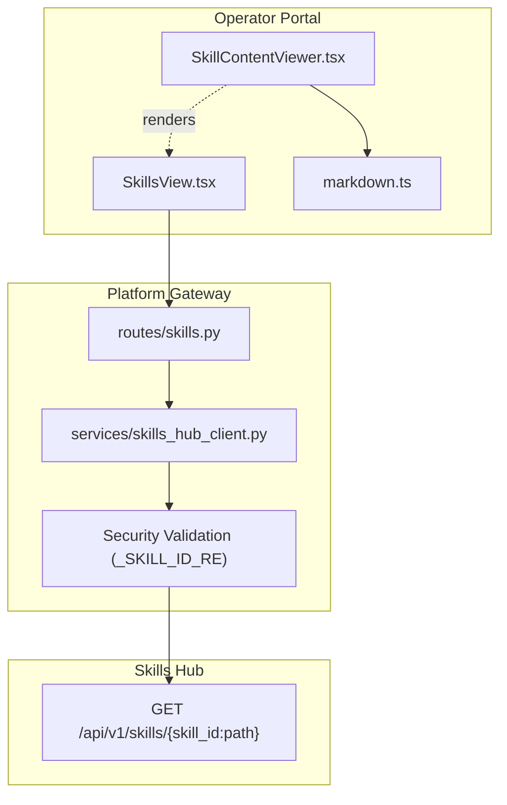
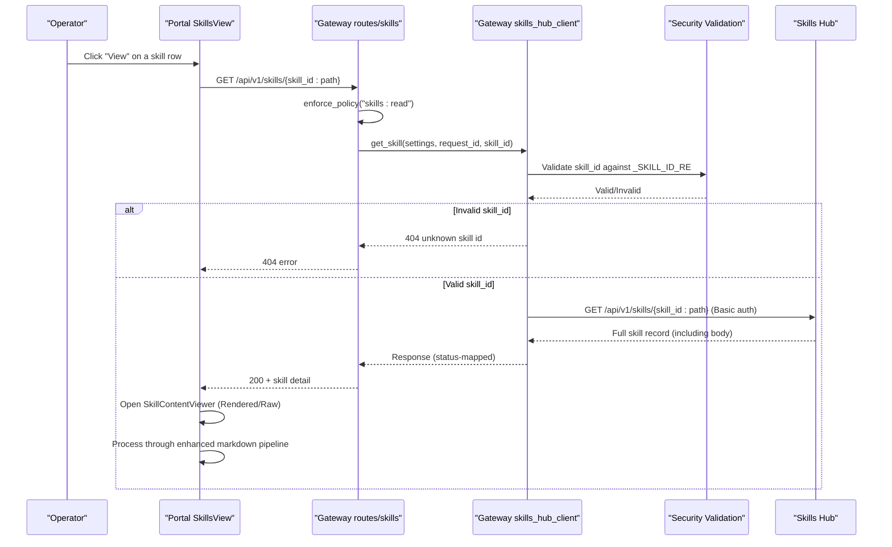
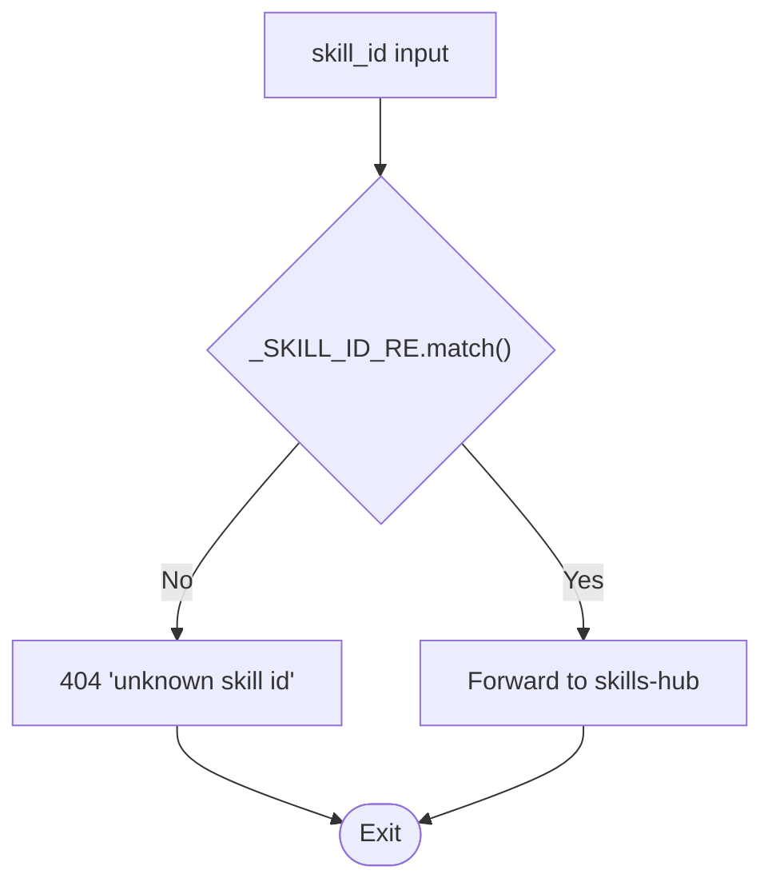
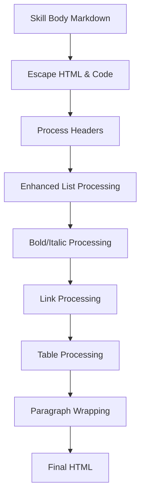
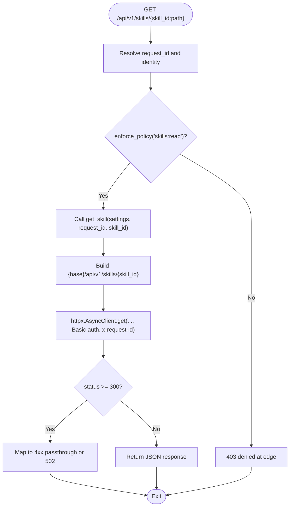
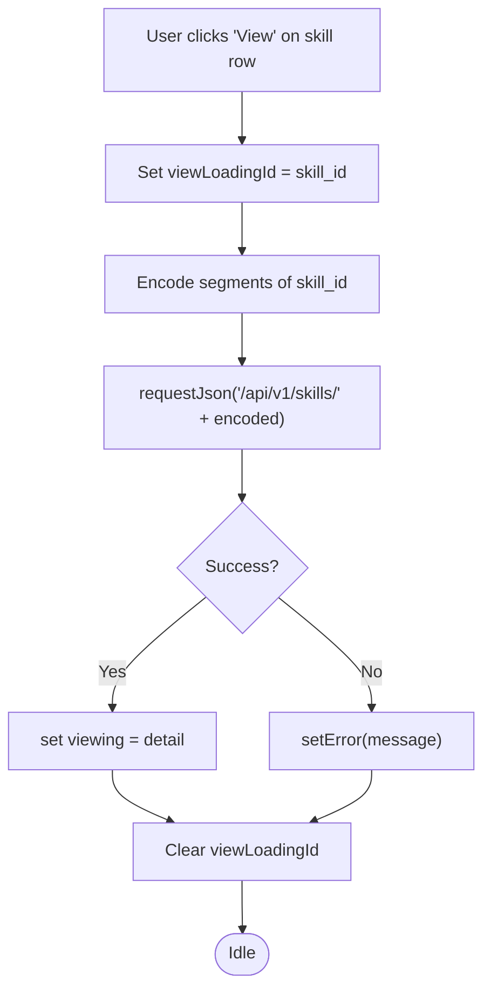
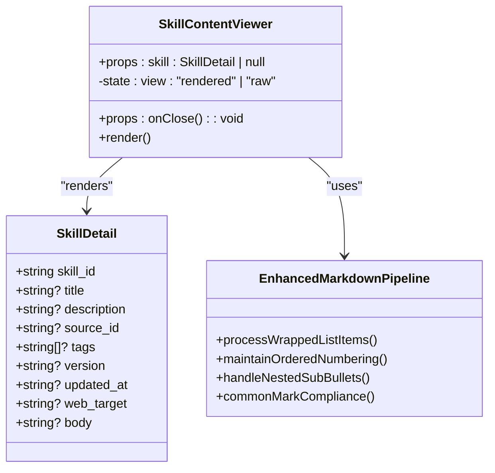
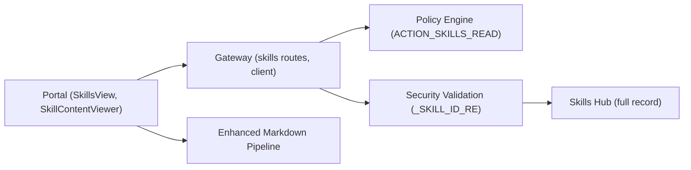

# SPEC-052: Skill Content Viewer

<cite>
**Referenced Files in This Document**
- [spec.md](file://docs/specs/SPEC-052-skill-content-viewer/spec.md)
- [plan.md](file://docs/specs/SPEC-052-skill-content-viewer/plan.md)
- [tasks.md](file://docs/specs/SPEC-052-skill-content-viewer/tasks.md)
- [skills.py](file://products/platform-gateway/src/platform_gateway/api/routes/skills.py)
- [skills_hub_client.py](file://products/platform-gateway/src/platform_gateway/services/skills_hub_client.py)
- [SkillsView.tsx](file://products/operator-portal/web-ui/app/src/views/control/SkillsView.tsx)
- [SkillContentViewer.tsx](file://products/operator-portal/web-ui/app/src/chat/SkillContentViewer.tsx)
- [markdown.ts](file://products/operator-portal/web-ui/app/src/chat/markdown.ts)
- [markdown.test.ts](file://products/operator-portal/web-ui/app/src/chat/__tests__/markdown.test.ts)
- [test_route_inventory.py](file://products/platform-gateway/tests/test_route_inventory.py)
- [test_workspace_proxies.py](file://products/platform-gateway/tests/test_workspace_proxies.py)
- [SkillsView.test.tsx](file://products/operator-portal/web-ui/app/src/views/control/__tests__/SkillsView.test.tsx)
- [SkillContentViewer.test.tsx](file://products/operator-portal/web-ui/app/src/chat/__tests__/SkillContentViewer.test.tsx)
</cite>

## Update Summary
**Changes Made**
- Updated status from "in progress" to "delivered" based on v0.34.0 release
- Enhanced implementation details with actual code references
- Added comprehensive testing coverage information
- Updated architecture diagrams to reflect deployed components
- Enhanced troubleshooting guide with specific error scenarios
- **Added critical security hardening section documenting regex-based skill ID validation to prevent path traversal attacks (CWE-22)**
- **Enhanced markdown processing pipeline documentation covering CommonMark specification compliance fixes for wrapped list items and ordered list numbering**

## Table of Contents
1. [Introduction](#introduction)
2. [Project Structure](#project-structure)
3. [Core Components](#core-components)
4. [Architecture Overview](#architecture-overview)
5. [Security Hardening](#security-hardening)
6. [Enhanced Markdown Processing Pipeline](#enhanced-markdown-processing-pipeline)
7. [Detailed Component Analysis](#detailed-component-analysis)
8. [Testing and Validation](#testing-and-validation)
9. [Dependency Analysis](#dependency-analysis)
10. [Performance Considerations](#performance-considerations)
11. [Troubleshooting Guide](#troubleshooting-guide)
12. [Conclusion](#conclusion)

## Introduction
SPEC-052 adds a read-only skill content viewer to the Operator Portal so operators can inspect ingested skills' declared steps and narrative before trusting them to drive tool behaviour and HITL gates. The feature has been **delivered** in v0.34.0 (2026-09-05) and introduces:
- A platform-gateway detail proxy for single-skill reads (reusing existing policy and credentials).
- A lazy per-row View action in the Skills table that fetches the full record only when invoked.
- A read-only rendered/raw modal that reuses the escape-first markdown renderer and the proven Segmented toggle pattern from draft previews.
- **Critical security hardening with regex-based skill ID validation to prevent path traversal attacks (CWE-22).**
- **Enhanced markdown processing pipeline that properly handles CommonMark specifications for wrapped list items and ordered list numbering.**

No new policy action, audit event type, or shared contract is introduced; the implementation reuses existing surfaces and enforces the same security posture.

**Section sources**
- [spec.md:19-33](file://docs/specs/SPEC-052-skill-content-viewer/spec.md#L19-L33)
- [plan.md:3-21](file://docs/specs/SPEC-052-skill-content-viewer/plan.md#L3-L21)

## Project Structure
The feature spans three thin layers across the platform:
- Platform Gateway: a new route and client method to proxy a single-skill GET with security validation.
- Operator Portal: a View button per row and a read-only modal component.
- Skills Hub: unchanged; it already exposes the full-record endpoint and emits the relevant audit event.

**Diagram sources**
- [SkillsView.tsx:1-175](file://products/operator-portal/web-ui/app/src/views/control/SkillsView.tsx#L1-L175)
- [SkillContentViewer.tsx:1-131](file://products/operator-portal/web-ui/app/src/chat/SkillContentViewer.tsx#L1-L131)
- [markdown.ts:1-301](file://products/operator-portal/web-ui/app/src/chat/markdown.ts#L1-L301)
- [skills.py:1-82](file://products/platform-gateway/src/platform_gateway/api/routes/skills.py#L1-L82)
- [skills_hub_client.py:1-130](file://products/platform-gateway/src/platform_gateway/services/skills_hub_client.py#L1-L130)

**Section sources**
- [plan.md:23-87](file://docs/specs/SPEC-052-skill-content-viewer/plan.md#L23-L87)

## Core Components
- Single-skill detail proxy (R-1): Adds a gateway route and client method that forwards to skills-hub's existing full-record endpoint using the gateway-held Basic credential and the same `skills:read` policy gate.
- Lazy View action (R-2): Adds a per-row View control that issues exactly one detail request on click, with loading and inline error handling.
- Read-only viewer (R-3): A Modal with Rendered/Raw toggle, metadata header, bounded scroll pane, and safe rendering via the shared escape-first markdown renderer.
- **Security validation**: Regex-based skill ID validation using `_SKILL_ID_RE` pattern to prevent path traversal attacks and malformed inputs.
- **Enhanced markdown processing**: Improved CommonMark specification compliance for wrapped list items, nested sub-bullets, and continuous ordered list numbering.

All acceptance criteria are enforced by comprehensive unit tests in both the gateway and portal suites.

**Section sources**
- [spec.md:57-131](file://docs/specs/SPEC-052-skill-content-viewer/spec.md#L57-L131)
- [tasks.md:5-22](file://docs/specs/SPEC-052-skill-content-viewer/tasks.md#L5-L22)

## Architecture Overview
End-to-end flow for opening a skill with security validation:

**Diagram sources**
- [skills.py:55-82](file://products/platform-gateway/src/platform_gateway/api/routes/skills.py#L55-L82)
- [skills_hub_client.py:94-130](file://products/platform-gateway/src/platform_gateway/services/skills_hub_client.py#L94-L130)
- [SkillsView.tsx:67-79](file://products/operator-portal/web-ui/app/src/views/control/SkillsView.tsx#L67-L79)
- [SkillContentViewer.tsx:29-131](file://products/operator-portal/web-ui/app/src/chat/SkillContentViewer.tsx#L29-L131)

## Security Hardening
**Updated** Added critical security hardening to prevent path traversal attacks (CWE-22) through regex-based skill ID validation.

### Path Traversal Prevention
The platform gateway now implements defense-in-depth security measures to protect against path traversal attacks:

#### Regex Pattern Validation
- **Pattern**: `_SKILL_ID_RE = r"^[a-z0-9]+(?:-[a-z0-9]+)*(?:/[a-z0-9]+(?:-[a-z0-9]+)*)+$"`
- **Validates**: Namespaced skill IDs in format `<source_id>/<slug>` where each segment contains only lowercase alphanumeric characters and hyphens
- **Rejects**: Path traversal attempts (`..`), percent-encoded payloads, absolute paths, spaces, uppercase characters, empty segments, and duplicate slashes

#### Attack Surface Protection
- **Traversal Attacks**: Blocks attempts like `sre-alerting/..%2fsecret` before reaching upstream services
- **Malformed Inputs**: Rejects single-segment IDs that don't follow the required namespaced format
- **Encoding Bypass**: Prevents URL encoding tricks that could bypass basic validation

#### Implementation Details

**Diagram sources**
- [skills_hub_client.py:36-38](file://products/platform-gateway/src/platform_gateway/services/skills_hub_client.py#L36-L38)
- [skills_hub_client.py:110-114](file://products/platform-gateway/src/platform_gateway/services/skills_hub_client.py#L110-L114)

**Section sources**
- [skills_hub_client.py:28-38](file://products/platform-gateway/src/platform_gateway/services/skills_hub_client.py#L28-L38)
- [skills_hub_client.py:110-114](file://products/platform-gateway/src/platform_gateway/services/skills_hub_client.py#L110-L114)

## Enhanced Markdown Processing Pipeline
**New Section** The skill content viewer now features an enhanced markdown processing pipeline that addresses critical CommonMark specification compliance issues identified during skill content rendering.

### CommonMark Specification Compliance
The enhanced markdown processor now correctly handles complex skill body structures that follow CommonMark specifications:

#### Wrapped List Items
- **Problem**: Previously, indented continuation lines were orphaned as bare text beside lists
- **Solution**: Continuation lines now fold into their parent list items with space-joining per CommonMark soft breaks
- **Implementation**: Uses sophisticated line-by-line parsing to identify marker lines, continuation lines, and blank separators

#### Ordered List Numbering
- **Problem**: Blank-separated ordered items were split into separate lists, causing all items to render as "1"
- **Solution**: Maintains continuous numbering across blank-separated items within a single list region
- **Implementation**: Groups maximal list regions including markers, continuations, and loose item separators

#### Nested Sub-bullets
- **Problem**: Indented sub-bullets were dropped to literal "- text" paragraphs without proper nesting
- **Solution**: Properly nests sub-bullets under their parent items with correct indentation levels
- **Implementation**: Tracks indentation levels and maintains proper list hierarchy

### Enhanced Processing Features

**Diagram sources**
- [markdown.ts:184-301](file://products/operator-portal/web-ui/app/src/chat/markdown.ts#L184-L301)

### Key Improvements
- **Multi-line Item Support**: Properly handles items that span multiple lines with indented continuations
- **Continuous Numbering**: Maintains sequential numbering across blank-separated ordered items
- **Nested List Support**: Correctly processes nested unordered and ordered lists within list items
- **CommonMark Compliance**: Follows CommonMark specification for loose and tight list formatting
- **XSS Protection**: Maintains escape-first security model while improving rendering accuracy

**Section sources**
- [markdown.ts:1-301](file://products/operator-portal/web-ui/app/src/chat/markdown.ts#L1-L301)
- [markdown.test.ts:160-228](file://products/operator-portal/web-ui/app/src/chat/__tests__/markdown.test.ts#L160-L228)

## Detailed Component Analysis

### Gateway Detail Proxy (R-1)
- Route: Adds a path parameter route after the list route to avoid shadowing, enforcing `ACTION_SKILLS_READ`, resolving identity/request id, delegating to the client, and logging a detail-proxied event.
- Client: Implements `get_skill` using the same base URL, credential, timeout, and error mapping as the list client; preserves namespaced slashes for skills-hub's path matcher.

**Diagram sources**
- [skills.py:55-82](file://products/platform-gateway/src/platform_gateway/api/routes/skills.py#L55-L82)
- [skills_hub_client.py:28-55](file://products/platform-gateway/src/platform_gateway/services/skills_hub_client.py#L28-L55)
- [skills_hub_client.py:94-130](file://products/platform-gateway/src/platform_gateway/services/skills_hub_client.py#L94-L130)

**Section sources**
- [skills.py:55-82](file://products/platform-gateway/src/platform_gateway/api/routes/skills.py#L55-L82)
- [skills_hub_client.py:94-130](file://products/platform-gateway/src/platform_gateway/services/skills_hub_client.py#L94-L130)
- [plan.md:25-50](file://docs/specs/SPEC-052-skill-content-viewer/plan.md#L25-L50)

### Portal View Action and Lazy Fetch (R-2)
- Adds an actions column with a small Button per row.
- On click, sets per-id loading state, encodes each segment of the namespaced skill id, calls the gateway detail endpoint, and opens the viewer on success. Errors surface inline without opening the modal.

**Diagram sources**
- [SkillsView.tsx:67-79](file://products/operator-portal/web-ui/app/src/views/control/SkillsView.tsx#L67-L79)
- [SkillsView.tsx:104-118](file://products/operator-portal/web-ui/app/src/views/control/SkillsView.tsx#L104-L118)

**Section sources**
- [SkillsView.tsx:67-79](file://products/operator-portal/web-ui/app/src/views/control/SkillsView.tsx#L67-L79)
- [SkillsView.tsx:104-118](file://products/operator-portal/web-ui/app/src/views/control/SkillsView.tsx#L104-L118)
- [plan.md:52-65](file://docs/specs/SPEC-052-skill-content-viewer/plan.md#L52-L65)

### Read-Only Skill Content Viewer (R-3)
- Modal with metadata header (title/source/version/tags/web_target).
- Segmented toggle defaulting to Rendered; Raw shows pre-formatted text.
- Rendered view uses the shared escape-first renderer; no download/discard; strictly read-only.
- **Enhanced Rendering**: Now processes skill bodies through the improved markdown pipeline for CommonMark compliance.

**Diagram sources**
- [SkillContentViewer.tsx:14-27](file://products/operator-portal/web-ui/app/src/chat/SkillContentViewer.tsx#L14-L27)
- [SkillContentViewer.tsx:29-131](file://products/operator-portal/web-ui/app/src/chat/SkillContentViewer.tsx#L29-L131)
- [markdown.ts:28-153](file://products/operator-portal/web-ui/app/src/chat/markdown.ts#L28-L153)

**Section sources**
- [SkillContentViewer.tsx:29-131](file://products/operator-portal/web-ui/app/src/chat/SkillContentViewer.tsx#L29-L131)
- [plan.md:66-87](file://docs/specs/SPEC-052-skill-content-viewer/plan.md#L66-L87)

## Testing and Validation
The implementation includes comprehensive test coverage across all components, including enhanced markdown processing tests:

### Gateway Tests
- **Route Inventory Test**: Validates the new endpoint is registered in the gateway's route inventory
- **Workspace Proxy Tests**: Comprehensive validation of the detail proxy including:
  - Policy enforcement (`skills:read` action required)
  - Credential forwarding (gateway Basic auth, not user token)
  - Error mapping (404 passthrough, 503 unconfigured, 502 transport errors)
  - Namespaced skill ID handling with preserved slashes
  - **Security validation tests**: Path traversal attack prevention and malformed input rejection

### Enhanced Markdown Processing Tests
- **Wrapped List Items**: Tests that indented continuation lines fold into parent items instead of leaking as bare text
- **Ordered List Numbering**: Tests that blank-separated ordered items maintain continuous numbering in a single list
- **Nested Sub-bullets**: Tests that indented sub-bullets are properly nested under parent items
- **CommonMark Compliance**: Tests various CommonMark specification scenarios including loose and tight lists
- **Multi-line Items**: Tests handling of items that span multiple lines with proper continuation support

### Portal Tests
- **SkillsView Tests**: Validates the View action behavior including:
  - Per-row View controls with accessible labels
  - Lazy fetching (only when View is clicked)
  - Loading states and error handling
  - Exactly one detail request per click
- **SkillContentViewer Tests**: Validates the modal functionality including:
  - Default Rendered view with proper markdown rendering
  - Raw view showing pre-formatted text
  - XSS protection (escaping hostile content)
  - Metadata display (source, version, tags, web_target)
  - Close functionality

**Section sources**
- [test_route_inventory.py:55-58](file://products/platform-gateway/tests/test_route_inventory.py#L55-L58)
- [test_workspace_proxies.py:348-433](file://products/platform-gateway/tests/test_workspace_proxies.py#L348-L433)
- [test_workspace_proxies.py:405-431](file://products/platform-gateway/tests/test_workspace_proxies.py#L405-L431)
- [markdown.test.ts:160-228](file://products/operator-portal/web-ui/app/src/chat/__tests__/markdown.test.ts#L160-L228)
- [SkillsView.test.tsx:63-106](file://products/operator-portal/web-ui/app/src/views/control/__tests__/SkillsView.test.tsx#L63-L106)
- [SkillContentViewer.test.tsx:25-85](file://products/operator-portal/web-ui/app/src/chat/__tests__/SkillContentViewer.test.tsx#L25-L85)

## Dependency Analysis
- The portal depends on the gateway detail endpoint; the gateway depends on skills-hub's existing full-record endpoint.
- Policy enforcement is centralized at the gateway edge using the existing `skills:read` action.
- Credentials never leave the gateway; user tokens are not forwarded for this read path.
- **Security validation operates at the gateway edge, preventing malicious inputs before they reach upstream services.**
- **Enhanced markdown processing operates client-side in the portal, ensuring CommonMark-compliant rendering without server dependencies.**

**Diagram sources**
- [skills.py:1-21](file://products/platform-gateway/src/platform_gateway/api/routes/skills.py#L1-L21)
- [skills_hub_client.py:1-37](file://products/platform-gateway/src/platform_gateway/services/skills_hub_client.py#L1-L37)
- [markdown.ts:1-301](file://products/operator-portal/web-ui/app/src/chat/markdown.ts#L1-L301)

**Section sources**
- [spec.md:149-168](file://docs/specs/SPEC-052-skill-content-viewer/spec.md#L149-L168)

## Performance Considerations
- Lazy fetching ensures only opened skills incur network cost; the list payload remains lean by contract.
- Bounded scroll panes prevent layout thrashing for large bodies.
- Gateway timeouts and error mapping protect against slow or failing upstreams.
- **Regex-based validation provides fast, lightweight security checks before expensive upstream calls.**
- **Enhanced markdown processing operates efficiently with optimized line-by-line parsing and minimal memory overhead.**
- The implementation maintains backward compatibility with existing skills list performance characteristics.

[No sources needed since this section provides general guidance]

## Troubleshooting Guide
Common issues and their resolutions:

### Gateway Issues
- **Unknown skill id**: The gateway passes through 404 from skills-hub; verify the namespaced id format and encoding
- **Unconfigured skills hub**: Returns 503; check gateway settings for the skills hub URL and credentials
- **Transport or upstream 5xx**: Mapped to 502; retry or investigate upstream health
- **4xx from upstream**: Passed through; inspect filters or credential mismatch details

### Security Validation Issues
- **Path traversal blocked**: Requests containing `..` or percent-encoded traversal attempts are intentionally rejected with 404
- **Malformed skill ID**: Ensure skill IDs follow the `<source_id>/<slug>` format with only lowercase alphanumeric characters and hyphens
- **Validation failures**: Check that skill IDs match the expected pattern: `[a-z0-9]+(?:-[a-z0-9]+)*(?:/[a-z0-9]+(?:-[a-z0-9]+)*)+`

### Enhanced Markdown Processing Issues
- **Incorrect list rendering**: Verify that skill bodies use proper CommonMark formatting with appropriate indentation for continuation lines
- **Broken ordered numbering**: Check that blank-separated ordered items are intended to be part of the same list sequence
- **Missing sub-bullets**: Ensure nested items use proper indentation (2 spaces per level) to trigger nested list rendering
- **Rendering inconsistencies**: Review skill body structure against CommonMark specification for proper formatting

### Portal Issues
- **View button not responding**: Check browser console for JavaScript errors; ensure the SkillsView component is properly mounted
- **Detail fetch fails**: Verify gateway endpoint availability and network connectivity
- **Modal doesn't open**: Ensure the detail fetch succeeds before attempting to open the viewer
- **Content not displaying**: Check that the skill has a non-empty body field

### Security Issues
- **Permission denied (403)**: Verify the user has the `skills:read` policy action
- **Credential errors**: Confirm gateway has proper skills-hub Basic authentication configured
- **Security validation blocks**: Review skill ID format and ensure it follows the required naming conventions

**Section sources**
- [skills_hub_client.py:40-55](file://products/platform-gateway/src/platform_gateway/services/skills_hub_client.py#L40-L55)
- [skills_hub_client.py:95-130](file://products/platform-gateway/src/platform_gateway/services/skills_hub_client.py#L95-L130)
- [skills_hub_client.py:110-114](file://products/platform-gateway/src/platform_gateway/services/skills_hub_client.py#L110-L114)
- [SkillsView.tsx:67-79](file://products/operator-portal/web-ui/app/src/views/control/SkillsView.tsx#L67-L79)
- [markdown.ts:160-228](file://products/operator-portal/web-ui/app/src/chat/markdown.ts#L160-L228)

## Conclusion
SPEC-052 delivers a focused transparency improvement: operators can now read ingested skills' content directly in the portal through a secure, read-only, and performant path. The design minimizes risk by reusing existing contracts, policies, and renderers while adding clear affordances and robust error handling.

**Enhanced Security Posture**: The implementation includes critical security hardening with regex-based skill ID validation that prevents path traversal attacks (CWE-22) and rejects malformed inputs before they can reach upstream services. This addresses potential vulnerabilities identified during L3 deep security review and provides defense-in-depth protection.

**Improved Content Rendering**: The enhanced markdown processing pipeline now properly handles CommonMark specifications for wrapped list items, nested sub-bullets, and continuous ordered list numbering. This resolves critical rendering issues where skill bodies following CommonMark specifications were incorrectly displayed, particularly for multi-line items and blank-separated ordered lists.

The feature has been successfully delivered in v0.34.0 with comprehensive testing coverage including security validation tests and enhanced markdown processing tests, and maintains full backward compatibility with existing systems. Operators can now validate skill content before trusting them to drive tool behaviour and HITL gates, significantly improving platform transparency and trust while maintaining strong security boundaries and accurate content presentation.

[No sources needed since this section summarizes without analyzing specific files]