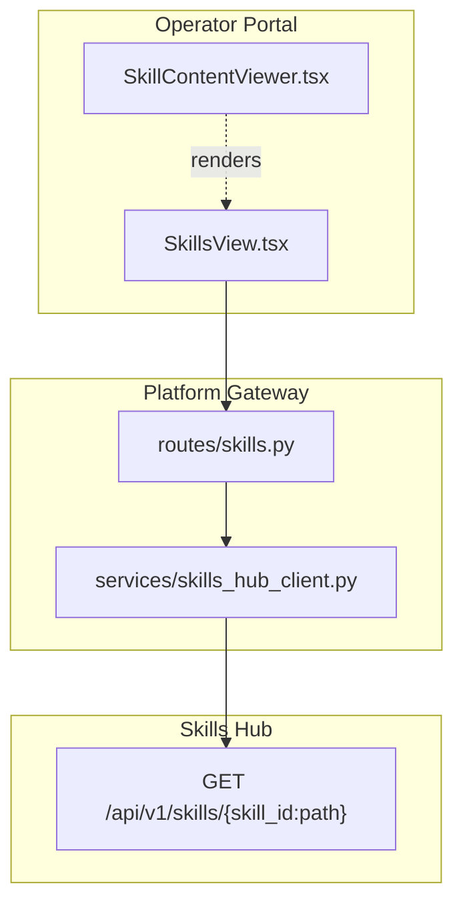
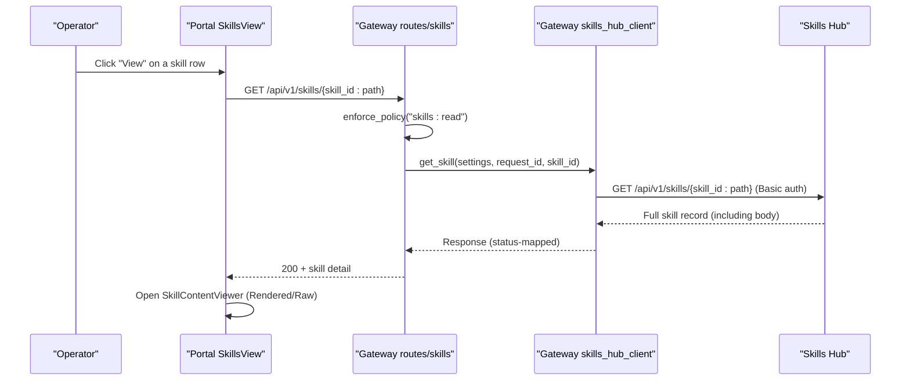
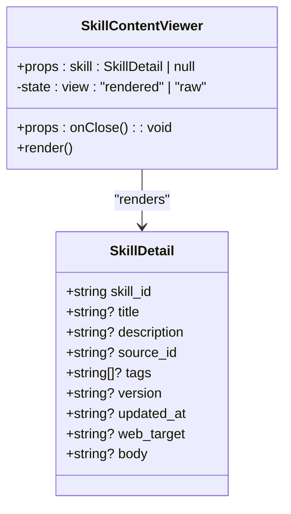
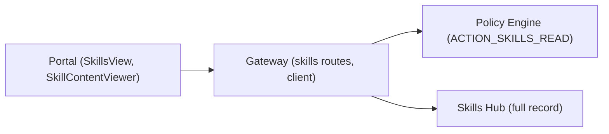

# SPEC-052: Skill Content Viewer

<cite>
**Referenced Files in This Document**
- [spec.md](file://docs/specs/SPEC-052-skill-content-viewer/spec.md)
- [plan.md](file://docs/specs/SPEC-052-skill-content-viewer/plan.md)
- [tasks.md](file://docs/specs/SPEC-052-skill-content-viewer/tasks.md)
- [SkillsView.tsx](file://products/operator-portal/web-ui/app/src/views/control/SkillsView.tsx)
- [SkillContentViewer.tsx](file://products/operator-portal/web-ui/app/src/chat/SkillContentViewer.tsx)
- [skills.py](file://products/platform-gateway/src/platform_gateway/api/routes/skills.py)
- [skills_hub_client.py](file://products/platform-gateway/src/platform_gateway/services/skills_hub_client.py)
- [test_route_inventory.py](file://products/platform-gateway/tests/test_route_inventory.py)
- [test_workspace_proxies.py](file://products/platform-gateway/tests/test_workspace_proxies.py)
- [SkillsView.test.tsx](file://products/operator-portal/web-ui/app/src/views/control/__tests__/SkillsView.test.tsx)
- [SkillContentViewer.test.tsx](file://products/operator-portal/web-ui/app/src/chat/__tests__/SkillContentViewer.test.tsx)
</cite>

## Table of Contents
1. [Introduction](#introduction)
2. [Project Structure](#project-structure)
3. [Core Components](#core-components)
4. [Architecture Overview](#architecture-overview)
5. [Detailed Component Analysis](#detailed-component-analysis)
6. [Dependency Analysis](#dependency-analysis)
7. [Performance Considerations](#performance-considerations)
8. [Troubleshooting Guide](#troubleshooting-guide)
9. [Conclusion](#conclusion)

## Introduction
SPEC-052 adds a read-only skill content viewer to the Operator Portal so operators can inspect ingested skills’ declared steps and narrative before trusting them to drive tool behaviour and HITL gates. It introduces:
- A platform-gateway detail proxy for single-skill reads (reusing existing policy and credentials).
- A lazy per-row View action in the Skills table that fetches the full record only when invoked.
- A read-only rendered/raw modal that reuses the escape-first markdown renderer and the proven Segmented toggle pattern from draft previews.

No new policy action, audit event type, or shared contract is introduced; the implementation reuses existing surfaces and enforces the same security posture.

**Section sources**
- [spec.md:18-32](file://docs/specs/SPEC-052-skill-content-viewer/spec.md#L18-L32)
- [plan.md:3-21](file://docs/specs/SPEC-052-skill-content-viewer/plan.md#L3-L21)

## Project Structure
The feature spans three thin layers:
- Platform Gateway: a new route and client method to proxy a single-skill GET.
- Operator Portal: a View button per row and a read-only modal component.
- Skills Hub: unchanged; it already exposes the full-record endpoint and emits the relevant audit event.

**Diagram sources**
- [SkillsView.tsx:1-175](file://products/operator-portal/web-ui/app/src/views/control/SkillsView.tsx#L1-L175)
- [SkillContentViewer.tsx:1-131](file://products/operator-portal/web-ui/app/src/chat/SkillContentViewer.tsx#L1-L131)
- [skills.py:1-79](file://products/platform-gateway/src/platform_gateway/api/routes/skills.py#L1-L79)
- [skills_hub_client.py:1-110](file://products/platform-gateway/src/platform_gateway/services/skills_hub_client.py#L1-L110)

**Section sources**
- [plan.md:23-87](file://docs/specs/SPEC-052-skill-content-viewer/plan.md#L23-L87)

## Core Components
- Single-skill detail proxy (R-1): Adds a gateway route and client method that forwards to skills-hub’s existing full-record endpoint using the gateway-held Basic credential and the same `skills:read` policy gate.
- Lazy View action (R-2): Adds a per-row View control that issues exactly one detail request on click, with loading and inline error handling.
- Read-only viewer (R-3): A Modal with Rendered/Raw toggle, metadata header, bounded scroll pane, and safe rendering via the shared escape-first markdown renderer.

Acceptance criteria are enforced by unit tests in both the gateway and portal suites.

**Section sources**
- [spec.md:57-131](file://docs/specs/SPEC-052-skill-content-viewer/spec.md#L57-L131)
- [tasks.md:5-22](file://docs/specs/SPEC-052-skill-content-viewer/tasks.md#L5-L22)

## Architecture Overview
End-to-end flow for opening a skill:

**Diagram sources**
- [skills.py:55-78](file://products/platform-gateway/src/platform_gateway/api/routes/skills.py#L55-L78)
- [skills_hub_client.py:81-109](file://products/platform-gateway/src/platform_gateway/services/skills_hub_client.py#L81-L109)
- [SkillsView.tsx:67-79](file://products/operator-portal/web-ui/app/src/views/control/SkillsView.tsx#L67-L79)
- [SkillContentViewer.tsx:29-131](file://products/operator-portal/web-ui/app/src/chat/SkillContentViewer.tsx#L29-L131)

## Detailed Component Analysis

### Gateway Detail Proxy (R-1)
- Route: Adds a path parameter route after the list route to avoid shadowing, enforcing `ACTION_SKILLS_READ`, resolving identity/request id, delegating to the client, and logging a detail-proxied event.
- Client: Implements `get_skill` using the same base URL, credential, timeout, and error mapping as the list client; preserves namespaced slashes for skills-hub’s path matcher.

**Diagram sources**
- [skills.py:55-78](file://products/platform-gateway/src/platform_gateway/api/routes/skills.py#L55-L78)
- [skills_hub_client.py:28-55](file://products/platform-gateway/src/platform_gateway/services/skills_hub_client.py#L28-L55)
- [skills_hub_client.py:81-109](file://products/platform-gateway/src/platform_gateway/services/skills_hub_client.py#L81-L109)

**Section sources**
- [skills.py:55-78](file://products/platform-gateway/src/platform_gateway/api/routes/skills.py#L55-L78)
- [skills_hub_client.py:81-109](file://products/platform-gateway/src/platform_gateway/services/skills_hub_client.py#L81-L109)
- [plan.md:25-50](file://docs/specs/SPEC-052-skill-content-viewer/plan.md#L25-L50)

### Portal View Action and Lazy Fetch (R-2)
- Adds an actions column with a small Button per row.
- On click, sets per-id loading state, encodes each segment of the namespaced skill id, calls the gateway detail endpoint, and opens the viewer on success. Errors surface inline without opening the modal.

**Diagram sources**
- [SkillsView.tsx:67-79](file://products/operator-portal/web-ui/app/src/views/control/SkillsView.tsx#L67-L79)
- [SkillsView.tsx:104-118](file://products/operator-portal/web-ui/app/src/views/control/SkillsView.tsx#L104-L118)

**Section sources**
- [SkillsView.tsx:67-79](file://products/operator-portal/web-ui/app/src/views/control/SkillsView.tsx#L67-L79)
- [SkillsView.tsx:104-118](file://products/operator-portal/web-ui/app/src/views/control/SkillsView.tsx#L104-L118)
- [plan.md:52-65](file://docs/specs/SPEC-052-skill-content-viewer/plan.md#L52-L65)

### Read-Only Skill Content Viewer (R-3)
- Modal with metadata header (title/source/version/tags/web_target).
- Segmented toggle defaulting to Rendered; Raw shows pre-formatted text.
- Rendered view uses the shared escape-first renderer; no download/discard; strictly read-only.

**Diagram sources**
- [SkillContentViewer.tsx:14-27](file://products/operator-portal/web-ui/app/src/chat/SkillContentViewer.tsx#L14-L27)
- [SkillContentViewer.tsx:29-131](file://products/operator-portal/web-ui/app/src/chat/SkillContentViewer.tsx#L29-L131)

**Section sources**
- [SkillContentViewer.tsx:29-131](file://products/operator-portal/web-ui/app/src/chat/SkillContentViewer.tsx#L29-L131)
- [plan.md:66-87](file://docs/specs/SPEC-052-skill-content-viewer/plan.md#L66-L87)

## Dependency Analysis
- The portal depends on the gateway detail endpoint; the gateway depends on skills-hub’s existing full-record endpoint.
- Policy enforcement is centralized at the gateway edge using the existing `skills:read` action.
- Credentials never leave the gateway; user tokens are not forwarded for this read path.

**Diagram sources**
- [skills.py:1-21](file://products/platform-gateway/src/platform_gateway/api/routes/skills.py#L1-L21)
- [skills_hub_client.py:1-37](file://products/platform-gateway/src/platform_gateway/services/skills_hub_client.py#L1-L37)

**Section sources**
- [spec.md:149-168](file://docs/specs/SPEC-052-skill-content-viewer/spec.md#L149-L168)

## Performance Considerations
- Lazy fetching ensures only opened skills incur network cost; the list payload remains lean by contract.
- Bounded scroll panes prevent layout thrashing for large bodies.
- Gateway timeouts and error mapping protect against slow or failing upstreams.

[No sources needed since this section provides general guidance]

## Troubleshooting Guide
- Unknown skill id: The gateway passes through 404 from skills-hub; verify the namespaced id format and encoding.
- Unconfigured skills hub: Returns 503; check gateway settings for the skills hub URL and credentials.
- Transport or upstream 5xx: Mapped to 502; retry or investigate upstream health.
- 4xx from upstream: Passed through; inspect filters or credential mismatch details.
- Portal errors: Inline Alert displays messages; ensure the detail fetch succeeds before opening the modal.

**Section sources**
- [skills_hub_client.py:40-55](file://products/platform-gateway/src/platform_gateway/services/skills_hub_client.py#L40-L55)
- [skills_hub_client.py:95-109](file://products/platform-gateway/src/platform_gateway/services/skills_hub_client.py#L95-L109)
- [SkillsView.tsx:67-79](file://products/operator-portal/web-ui/app/src/views/control/SkillsView.tsx#L67-L79)

## Conclusion
SPEC-052 delivers a focused transparency improvement: operators can now read ingested skills’ content directly in the portal through a secure, read-only, and performant path. The design minimizes risk by reusing existing contracts, policies, and renderers while adding clear affordances and robust error handling.

[No sources needed since this section summarizes without analyzing specific files]