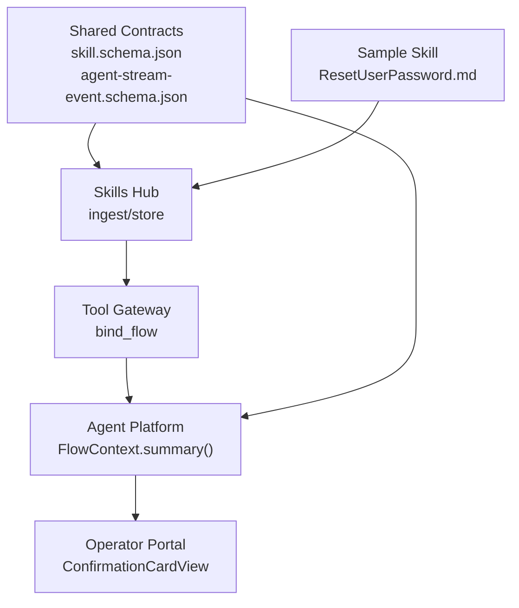
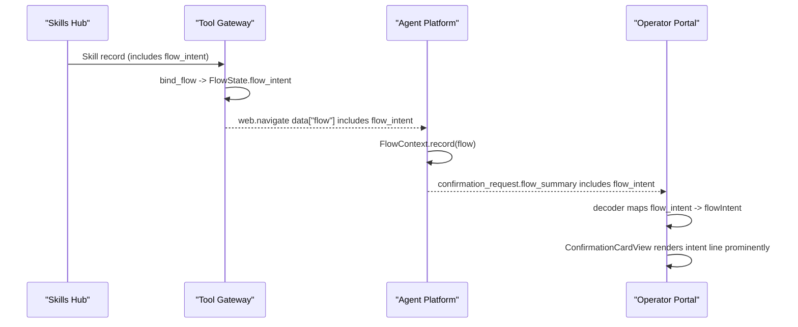
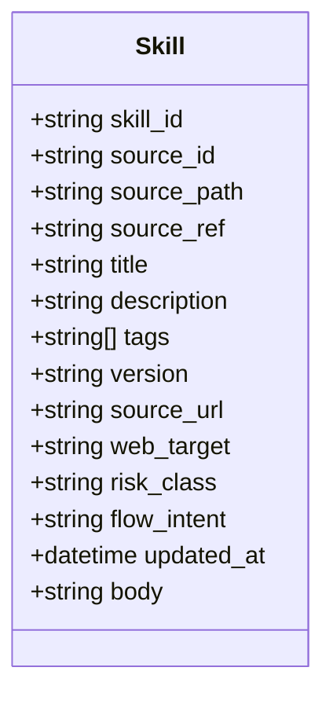
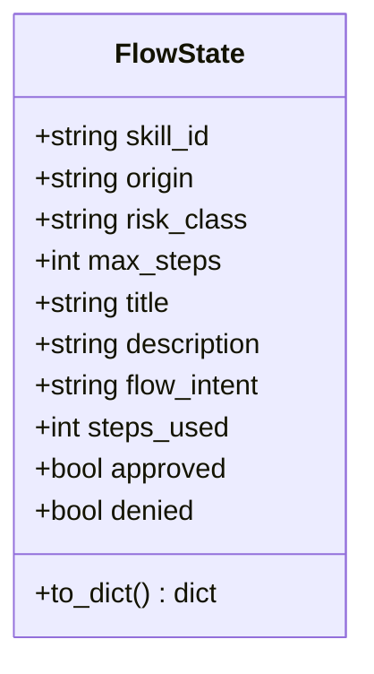
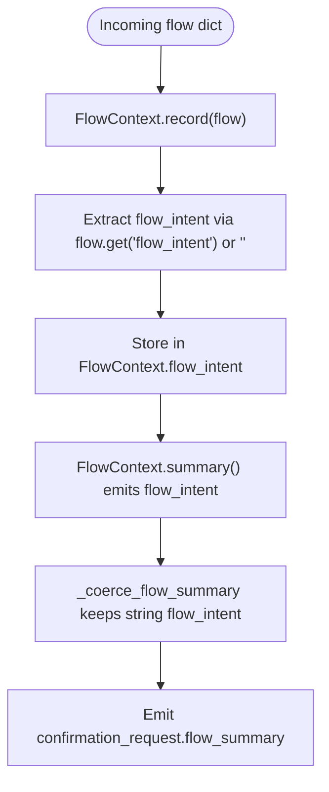
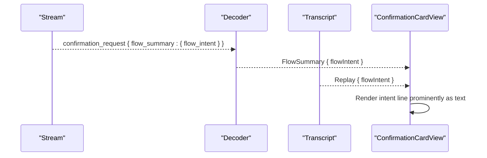
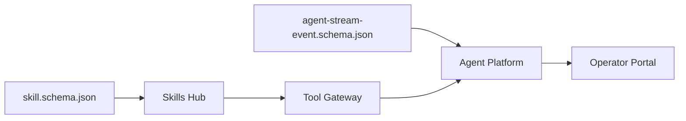

# SPEC-053: Skill-Declared Step Intent on Browser Confirmation Cards

<cite>
**Referenced Files in This Document**
- [spec.md](file://docs/specs/SPEC-053-skill-declared-step-intent/spec.md)
- [plan.md](file://docs/specs/SPEC-053-skill-declared-step-intent/plan.md)
- [tasks.md](file://docs/specs/SPEC-053-skill-declared-step-intent/tasks.md)
- [skill.schema.json](file://shared/shared-contracts/schemas/skill.schema.json)
- [agent-stream-event.schema.json](file://shared/shared-contracts/schemas/agent-stream-event.schema.json)
- [skill.py](file://products/skills-hub/src/skills_hub/schemas/skill.py)
- [browser_sessions.py](file://products/tool-gateway/src/tool_gateway/tools/browser_sessions.py)
- [flow_approvals.py](file://products/agent-platform/src/agent_service/services/flow_approvals.py)
- [models.ts](file://products/operator-portal/web-ui/app/src/stream/models.ts)
- [transcript.ts](file://products/operator-portal/web-ui/app/src/chat/transcript.ts)
- [ChatView.tsx](file://products/operator-portal/web-ui/app/src/chat/ChatView.tsx)
- [ResetUserPassword.md](file://samples/web-checks/password-reset/skill/ResetUserPassword.md)
</cite>

## Update Summary
**Changes Made**
- Updated implementation status to reflect delivered state (v0.34.0)
- Enhanced validation requirements section with specific character limits and web_target dependency
- Added comprehensive flow_intent validation details throughout the document
- Updated rendering specifications to reflect prominent placement above technical details
- Enhanced sample skill documentation with actual implementation example

## Table of Contents
1. [Introduction](#introduction)
2. [Project Structure](#project-structure)
3. [Core Components](#core-components)
4. [Architecture Overview](#architecture-overview)
5. [Detailed Component Analysis](#detailed-component-analysis)
6. [Dependency Analysis](#dependency-analysis)
7. [Performance Considerations](#performance-considerations)
8. [Troubleshooting Guide](#troubleshooting-guide)
9. [Conclusion](#conclusion)

## Introduction
SPEC-053 adds a skill-declared, operator-facing intent line to the browser confirmation card used by write-class web flows. It introduces one optional frontmatter key, `flow_intent`, into the skill envelope and carries it end-to-end along the existing flow-summary path from skills ingestion through the gateway binding, kernel context, stream frame, durable record, and portal rendering. The change is additive, display-only, and backward-compatible: skills without `flow_intent` render as before, and older frames/records validate and fall back gracefully.

The feature addresses an operator feedback gap: approval cards previously showed technical DOM details rather than a plain sentence describing what the gated mutation achieves. With `flow_intent`, operators see a clear decision line above the technical detail, improving trust and clarity at the HITL gate.

**Section sources**
- [spec.md:20-52](file://docs/specs/SPEC-053-skill-declared-step-intent/spec.md#L20-L52)

## Project Structure
This spec touches four product layers plus shared contracts and a sample:
- Skills contract and ingestion (skills-hub): declares and validates `flow_intent` with non-empty string ≤ 200 characters requirement and web_target dependency.
- Gateway flow binding (tool-gateway): binds flow metadata including `flow_intent` into the session flow state.
- Kernel flow context (agent-platform): records and emits `flow_intent` on the confirmation frame's flow summary.
- Portal UI (operator-portal): renders the intent as a prominent decision line on the confirmation card above technical details.
- Shared schemas: add `flow_intent` to the skill envelope and flow-summary schema; bump stream contract version.
- Sample: demonstrates the key in a real write-class skill with proper validation.

**Diagram sources**
- [skill.schema.json:74-79](file://shared/shared-contracts/schemas/skill.schema.json#L74-L79)
- [agent-stream-event.schema.json:59-70](file://shared/shared-contracts/schemas/agent-stream-event.schema.json#L59-L70)
- [browser_sessions.py:58-106](file://products/tool-gateway/src/tool_gateway/tools/browser_sessions.py#L58-L106)
- [flow_approvals.py:54-97](file://products/agent-platform/src/agent_service/services/flow_approvals.py#L54-L97)
- [models.ts:70-82](file://products/operator-portal/web-ui/app/src/stream/models.ts#L70-L82)
- [ResetUserPassword.md:1-19](file://samples/web-checks/password-reset/skill/ResetUserPassword.md#L1-L19)

**Section sources**
- [plan.md:3-30](file://docs/specs/SPEC-053-skill-declared-step-intent/plan.md#L3-L30)
- [spec.md:235-267](file://docs/specs/SPEC-053-skill-declared-step-intent/spec.md#L235-L267)

## Core Components
- **Skill envelope model**: Adds `flow_intent: str | None = Field(default=None, max_length=200)` with explicit length constraints and remains `extra="forbid"`.
- **Skill contract schema**: Adds optional `flow_intent` string property with `minLength: 1`, `maxLength: 200`, and requires `web_target` presence.
- **Gateway FlowState**: Carries `flow_intent: str = ""` alongside title/description and includes it in serialization for the flow payload.
- **Kernel FlowContext**: Records `flow_intent` from the flow dict and emits it in the flow summary sent to the portal.
- **Stream/session schemas**: Add `flow_intent` under `flow_summary`; stream event docstring records v9 → v10.
- **Portal models and rendering**: Maps wire snake_case to camelCase and renders the intent as escaped text in the confirmation card headline block, prominently above technical details.
- **Sample skill**: Declares `flow_intent` describing the single write-tier action with proper validation.

**Section sources**
- [skill.py:15-38](file://products/skills-hub/src/skills_hub/schemas/skill.py#L15-L38)
- [skill.schema.json:74-79](file://shared/shared-contracts/schemas/skill.schema.json#L74-L79)
- [browser_sessions.py:58-106](file://products/tool-gateway/src/tool_gateway/tools/browser_sessions.py#L58-L106)
- [flow_approvals.py:54-97](file://products/agent-platform/src/agent_service/services/flow_approvals.py#L54-L97)
- [agent-stream-event.schema.json:59-70](file://shared/shared-contracts/schemas/agent-stream-event.schema.json#L59-L70)
- [models.ts:70-82](file://products/operator-portal/web-ui/app/src/stream/models.ts#L70-L82)
- [transcript.ts:116-134](file://products/operator-portal/web-ui/app/src/chat/transcript.ts#L116-L134)
- [ResetUserPassword.md:1-19](file://samples/web-checks/password-reset/skill/ResetUserPassword.md#L1-L19)

## Architecture Overview
The data path is intentionally minimal and additive:
1. Skills hub ingests and validates `flow_intent` from skill frontmatter with strict validation (non-empty string ≤ 200 characters, requires `web_target`) and persists it verbatim.
2. Tool gateway binds the skill to a browser flow and attaches `flow_intent` to `FlowState`, serialized into `web.navigate`'s flow payload.
3. Agent platform kernel records the flow context and emits `flow_intent` in the confirmation frame's `flow_summary`.
4. Operator portal decodes the stream and durable records, mapping `flow_intent` to `flowIntent`, and renders it as a prominent plain-text decision line above technical details.

**Diagram sources**
- [browser_sessions.py:58-106](file://products/tool-gateway/src/tool_gateway/tools/browser_sessions.py#L58-L106)
- [flow_approvals.py:112-131](file://products/agent-platform/src/agent_service/services/flow_approvals.py#L112-L131)
- [agent-stream-event.schema.json:59-70](file://shared/shared-contracts/schemas/agent-stream-event.schema.json#L59-L70)
- [transcript.ts:116-134](file://products/operator-portal/web-ui/app/src/chat/transcript.ts#L116-L134)
- [ChatView.tsx:410-421](file://products/operator-portal/web-ui/app/src/chat/ChatView.tsx#L410-L421)

## Detailed Component Analysis

### Skills Hub: Declaration, Validation, Persistence
- **Model**: `Skill` gains `flow_intent: str | None = Field(default=None, max_length=200)` and remains `extra="forbid"`.
- **Contract**: `skill.schema.json` adds optional `flow_intent` string with `minLength: 1`, `maxLength: 200`, and description documenting it requires `web_target`.
- **Validation**: Ingestion accepts `flow_intent` in allowed keys and validates presence/length; rejects documents where `flow_intent` is present but `web_target` is missing; both store backends persist and round-trip the field.

**Diagram sources**
- [skill.py:15-38](file://products/skills-hub/src/skills_hub/schemas/skill.py#L15-L38)
- [skill.schema.json:74-79](file://shared/shared-contracts/schemas/skill.schema.json#L74-L79)

**Section sources**
- [plan.md:34-62](file://docs/specs/SPEC-053-skill-declared-step-intent/plan.md#L34-L62)
- [tasks.md:5-11](file://docs/specs/SPEC-053-skill-declared-step-intent/tasks.md#L5-L11)

### Tool Gateway: Flow Binding and Serialization
- **FlowState**: Gains `flow_intent: str = ""` and includes it in `to_dict()` so it rides `web.navigate`'s flow payload.
- **bind_flow**: Populates `flow_intent` from the fetched skill's frontmatter, defaulting to empty string when absent.

**Diagram sources**
- [browser_sessions.py:58-106](file://products/tool-gateway/src/tool_gateway/tools/browser_sessions.py#L58-L106)

**Section sources**
- [plan.md:64-71](file://docs/specs/SPEC-053-skill-declared-step-intent/plan.md#L64-L71)
- [tasks.md:13-22](file://docs/specs/SPEC-053-skill-declared-step-intent/tasks.md#L13-L22)

### Agent Platform: Kernel Context and Frame Emission
- **FlowContext**: Stores `flow_intent: str = ""` and reads it from the incoming flow dict during `record()`.
- **summary()**: Emits `flow_intent` as part of the flow headline payload.
- **_FLOW_SUMMARY_FIELDS**: Allows the field through coercion; non-string values degrade safely.
- **Stream event docstring**: Records v9 → v10; `flow_summary` schema adds `flow_intent`.

**Diagram sources**
- [flow_approvals.py:54-97](file://products/agent-platform/src/agent_service/services/flow_approvals.py#L54-L97)
- [flow_approvals.py:112-131](file://products/agent-platform/src/agent_service/services/flow_approvals.py#L112-L131)
- [agent-stream-event.schema.json:59-70](file://shared/shared-contracts/schemas/agent-stream-event.schema.json#L59-L70)

**Section sources**
- [plan.md:64-86](file://docs/specs/SPEC-053-skill-declared-step-intent/plan.md#L64-L86)
- [tasks.md:13-22](file://docs/specs/SPEC-053-skill-declared-step-intent/tasks.md#L13-L22)

### Operator Portal: Models, Decoding, and Rendering
- **FlowSummary**: Gains `flowIntent?: string`; durable type `ConfirmationFlowSummary` gains `flow_intent?: string`.
- **Decoder**: Maps wire `flow_intent` to `flowIntent`; transcript replays map durable `flow_intent` to `flowIntent`.
- **ConfirmationCardView**: Renders `flowSummary.flowIntent` as escaped text within the `.confirm-flow` headline block, prominently above technical details with distinct styling (fontSize: 13, fontWeight: 500).

**Diagram sources**
- [models.ts:70-82](file://products/operator-portal/web-ui/app/src/stream/models.ts#L70-L82)
- [transcript.ts:116-134](file://products/operator-portal/web-ui/app/src/chat/transcript.ts#L116-L134)
- [ChatView.tsx:410-421](file://products/operator-portal/web-ui/app/src/chat/ChatView.tsx#L410-L421)

**Section sources**
- [plan.md:96-120](file://docs/specs/SPEC-053-skill-declared-step-intent/plan.md#L96-L120)
- [tasks.md:24-29](file://docs/specs/SPEC-053-skill-declared-step-intent/tasks.md#L24-L29)
- [spec.md:149-174](file://docs/specs/SPEC-053-skill-declared-step-intent/spec.md#L149-L174)

### Sample Skill: Demonstrating the Key
- **ResetUserPassword.md**: Declares `flow_intent` describing the single write-tier "Confirm reset" click and bumps its version to 1.3.
- **Documentation**: Notes that the card now leads with the authored intent, providing a clear example of proper usage.

**Section sources**
- [ResetUserPassword.md:1-19](file://samples/web-checks/password-reset/skill/ResetUserPassword.md#L1-L19)
- [plan.md:122-131](file://docs/specs/SPEC-053-skill-declared-step-intent/plan.md#L122-L131)
- [tasks.md:31-34](file://docs/specs/SPEC-053-skill-declared-step-intent/tasks.md#L31-L34)

## Dependency Analysis
- **Contract-first design**: Changes begin with `skill.schema.json` and the two `flow_summary` schemas, ensuring all downstream components validate against them.
- **Backward compatibility**: Absent `flow_intent` degrades to empty/omitted at every hop; older frames/records remain valid and render unchanged.
- **Display-only boundary**: `flow_intent` never influences identity, deviation guard, step budget, or signing envelope; it is rendered as escaped text only.
- **Validation dependencies**: `flow_intent` requires `web_target` presence, mirroring the existing pattern where `risk_class` requires `web_target`.

**Diagram sources**
- [skill.schema.json:74-79](file://shared/shared-contracts/schemas/skill.schema.json#L74-L79)
- [agent-stream-event.schema.json:59-70](file://shared/shared-contracts/schemas/agent-stream-event.schema.json#L59-L70)

**Section sources**
- [plan.md:133-145](file://docs/specs/SPEC-053-skill-declared-step-intent/plan.md#L133-L145)
- [spec.md:235-267](file://docs/specs/SPEC-053-skill-declared-step-intent/spec.md#L235-L267)

## Performance Considerations
- **Minimal overhead**: Adding one short string to an already-passed flow dict; no new network hops or heavy processing.
- **Safe degradation**: Coercion ensures malformed or missing values do not break frame validation or rendering.
- **No runtime configuration**: Behavior is opt-in per skill via frontmatter; absence yields current behavior.
- **Validation efficiency**: String length validation (≤ 200 chars) prevents excessive memory usage while maintaining usability.

## Troubleshooting Guide
- **Card shows no intent line**:
  - Skill does not declare `flow_intent`, or value is empty; rendering falls back to existing headline and technical details.
  - Verify skill frontmatter contains a non-empty `flow_intent` and that ingestion accepted it.
  - Check that `web_target` is present when `flow_intent` is declared (required dependency).
- **Intent not visible in replayed/durable view**:
  - Ensure decoder and transcript mappings include `flow_intent` → `flowIntent`; confirm durable record contains `flow_intent` in `flow_summary`.
- **Validation errors on skill ingestion**:
  - Check length limits (must be ≤ 200 characters) and that `web_target` is present when `flow_intent` is declared; ensure schema envelope remains closed (`additionalProperties: false`).
  - Verify `flow_intent` is a non-empty string (minLength: 1 constraint).
- **Security concerns**:
  - `flow_intent` is display-only and never feeds authorization or execution paths; it is rendered as escaped text to prevent markup injection.
  - The field is validated server-side and never trusted as security input.

**Section sources**
- [spec.md:149-174](file://docs/specs/SPEC-053-skill-declared-step-intent/spec.md#L149-L174)
- [plan.md:147-172](file://docs/specs/SPEC-053-skill-declared-step-intent/plan.md#L147-L172)

## Conclusion
SPEC-053 delivers a small, robust enhancement to the browser confirmation card by surfacing a skill-authored intent line where operators actually make decisions. It extends the existing flow-summary pipeline with one optional field with strict validation (non-empty string ≤ 200 characters, requires `web_target`), preserves backward compatibility, and avoids any security or policy surface expansion. The password-reset sample demonstrates the feature end-to-end, and the layered implementation across skills-hub, tool-gateway, agent-platform, and operator-portal ensures consistent rendering for live and durable views. The prominent placement of the intent line above technical details significantly improves operator understanding and trust at the critical HITL gate point.