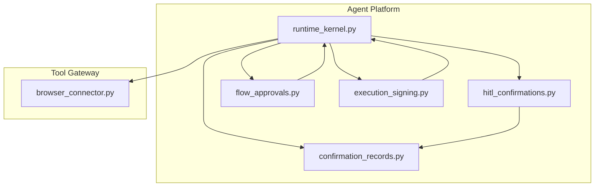
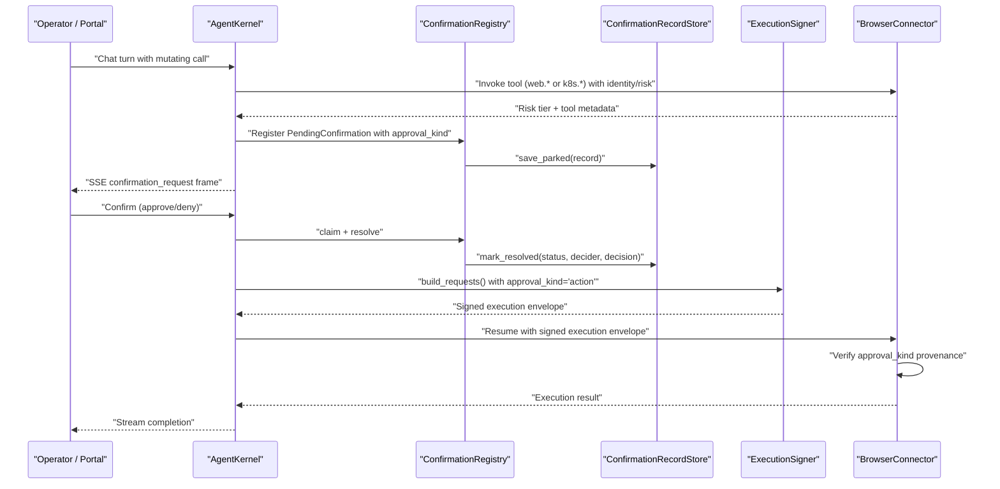
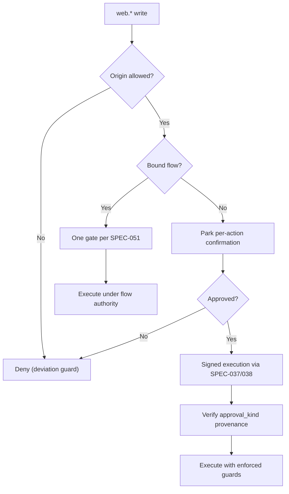
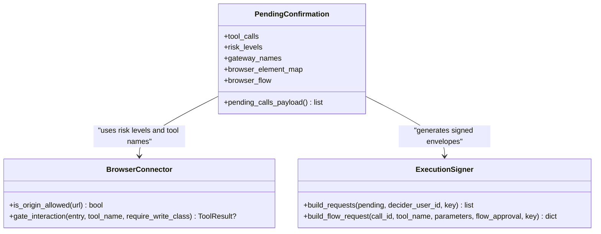
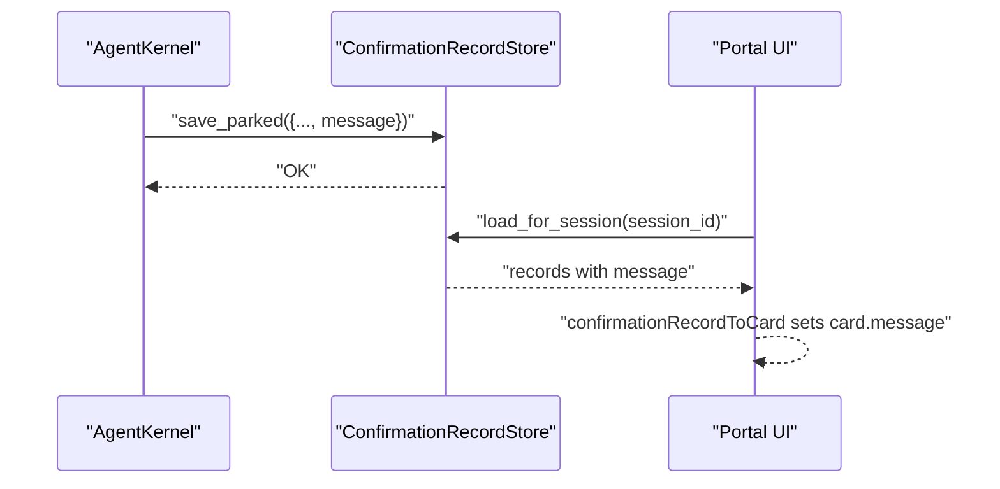
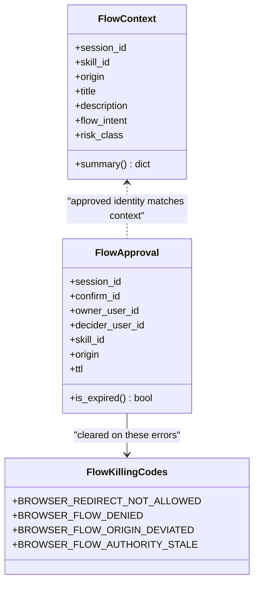
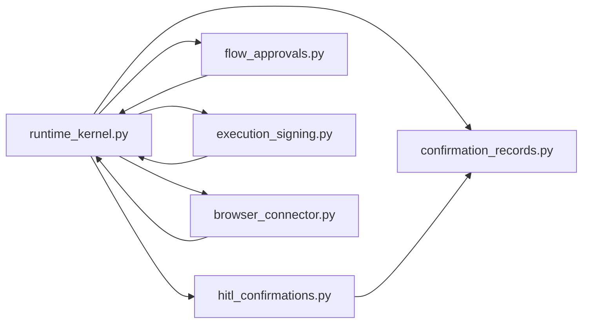

# SPEC-054: Action-Level Approval and Change Request Card

<cite>
**Referenced Files in This Document**
- [spec.md](file://docs/specs/SPEC-054-action-approval-and-change-request-card/spec.md)
- [flow_approvals.py](file://products/agent-platform/src/agent_service/services/flow_approvals.py)
- [hitl_confirmations.py](file://products/agent-platform/src/agent_service/services/hitl_confirmations.py)
- [confirmation_records.py](file://products/agent-platform/src/agent_service/services/confirmation_records.py)
- [runtime_kernel.py](file://products/agent-platform/src/agent_service/runtime_kernel.py)
- [browser_connector.py](file://products/tool-gateway/src/tool_gateway/tools/browser_connector.py)
- [execution_signing.py](file://products/agent-platform/src/agent_service/services/execution_signing.py)
</cite>

## Update Summary
**Changes Made**
- Updated all sections to reflect SPEC-054 v0.35.0 delivery status
- Enhanced browser interaction security model with per-action signed gates
- Added detailed coverage of explicit approval_kind discriminator
- Expanded change request card functionality with secret masking
- Updated architecture diagrams to reflect new enforcement boundaries
- Added comprehensive coverage of flow authority clearing mechanisms

## Table of Contents
1. [Introduction](#introduction)
2. [Project Structure](#project-structure)
3. [Core Components](#core-components)
4. [Architecture Overview](#architecture-overview)
5. [Detailed Component Analysis](#detailed-component-analysis)
6. [Dependency Analysis](#dependency-analysis)
7. [Performance Considerations](#performance-considerations)
8. [Troubleshooting Guide](#troubleshooting-guide)
9. [Conclusion](#conclusion)

## Introduction
This document explains the implementation of SPEC-054, which has been **delivered in v0.35.0** as part of the R5 hardening release. The specification makes action-level human-in-the-loop (HITL) approval first-class alongside flow-level approval, introduces an enhanced browser interaction security model with per-action signed gates, and transforms every action confirmation card into a readable change request with secret masking.

Key outcomes delivered:
- Explicit `approval_kind` discriminator on confirmation frames and durable records
- Ad-hoc browser writes park as per-action signed gates instead of hard-denying when on allowlisted origins
- Action cards surface secret-masked change request projections without altering signed parameters
- Durable card-message parity across live stream, approver inbox, and reloaded transcripts
- Flow authority clearing mechanisms prevent stale approvals from outliving gateway bindings
- Signed execution envelopes carry explicit authority provenance for enforcement

**Section sources**
- [spec.md:3-736](file://docs/specs/SPEC-054-action-approval-and-change-request-card/spec.md#L3-L736)

## Project Structure
SPEC-054 touches five main areas across the platform:
- Agent platform kernel and HITL services: frame building, pending confirmations, durable records, flow authority, and execution signing
- Tool gateway browser connector: origin allowlist checks, flow binding, deviation guard, and write-tier gating
- Shared contracts: additive schema fields for approval_kind, change_request, and message
- Operator portal rendering: decode and render both flow and action cards with message parity
- Execution runtime: worker forwarding of approval_kind provenance handle

**Diagram sources**
- [runtime_kernel.py:1-200](file://products/agent-platform/src/agent_service/runtime_kernel.py#L1-L200)
- [hitl_confirmations.py:1-548](file://products/agent-platform/src/agent_service/services/hitl_confirmations.py#L1-L548)
- [confirmation_records.py:1-744](file://products/agent-platform/src/agent_service/services/confirmation_records.py#L1-L744)
- [flow_approvals.py:1-274](file://products/agent-platform/src/agent_service/services/flow_approvals.py#L1-L274)
- [execution_signing.py:1-175](file://products/agent-platform/src/agent_service/services/execution_signing.py#L1-L175)
- [browser_connector.py:1-800](file://products/tool-gateway/src/tool_gateway/tools/browser_connector.py#L1-L800)

**Section sources**
- [spec.md:440-534](file://docs/specs/SPEC-054-action-approval-and-change-request-card/spec.md#L440-L534)

## Core Components
The delivered implementation includes four major requirements:

### R-1: Explicit Approval Kind Discriminator
Every parked confirmation declares whether it is a flow or action through the `approval_kind` field. Flow cards carry a headline; action cards show a change request projection. The kind is derived from the parked batch, not ambient session state.

### R-2: Per-Action Signed Gates for Browser Writes
Unbound browser writes on allowlisted origins park per-action and execute only after operator approval and signing. Each write gets its own execution_id, args_digest, and confirm_id. No auto-allow occurs; if bridging is disabled, such writes are denied.

### R-3: Change Request Projection
A display-only, secret-masked summary of decision-relevant parameters that complements technical details without changing the signed payload. Uses existing redaction vocabulary to mask secret-bearing values while preserving keys.

### R-4: Durable Card-Message Parity
The top-line card message is persisted alongside other record fields so all surfaces render consistently. Legacy rows without the field degrade gracefully.

These behaviors reuse existing per-action approval and signed execution paths and add only optional fields to the confirmation frame and durable record schemas.

**Section sources**
- [spec.md:144-368](file://docs/specs/SPEC-054-action-approval-and-change-request-card/spec.md#L144-L368)

## Architecture Overview
The approval flow spans the agent platform kernel, HITL registry, durable store, execution signing, and tool gateway enforcement boundaries with enhanced staleness protection.

**Diagram sources**
- [runtime_kernel.py:409-443](file://products/agent-platform/src/agent_service/runtime_kernel.py#L409-L443)
- [hitl_confirmations.py:208-349](file://products/agent-platform/src/agent_service/services/hitl_confirmations.py#L208-L349)
- [confirmation_records.py:511-545](file://products/agent-platform/src/agent_service/services/confirmation_records.py#L511-L545)
- [execution_signing.py:70-105](file://products/agent-platform/src/agent_service/services/execution_signing.py#L70-L105)
- [browser_connector.py:423-477](file://products/tool-gateway/src/tool_gateway/tools/browser_connector.py#L423-L477)

## Detailed Component Analysis

### Approval Kind Discriminator (R-1) - Delivered
**Updated** The approval_kind discriminator is now fully implemented and delivered. Every parked confirmation explicitly declares its kind at park time, ensuring the portal can render either a flow headline or an action change request reliably.

- Purpose: Make the confirmation's kind explicit so the portal can render either a flow headline or an action change request reliably.
- Derivation: For flows, the batch carries a browser write and a bound FlowContext; otherwise it is an action.
- Persistence: approval_kind is stored on the durable record so inbox and transcript replay match the live card.

**Diagram sources**
- [flow_approvals.py:54-97](file://products/agent-platform/src/agent_service/services/flow_approvals.py#L54-L97)
- [hitl_confirmations.py:66-73](file://products/agent-platform/src/agent_service/services/hitl_confirmations.py#L66-L73)
- [confirmation_records.py:52-82](file://products/agent-platform/src/agent_service/services/confirmation_records.py#L52-L82)

**Section sources**
- [spec.md:144-179](file://docs/specs/SPEC-054-action-approval-and-change-request-card/spec.md#L144-L179)

### Ad-Hoc Browser Writes Park as Per-Action Signed Gates (R-2) - Delivered
**Updated** The per-action signed gate mechanism is fully implemented with enhanced security controls. Unbound browser writes on allowlisted origins now park as individual confirmation cards rather than being hard-denied.

- Behavior: An unbound web.* write on an allowlisted origin parks a per-action confirmation instead of being hard-denied. Each write gets its own execution_id, args_digest, and confirm_id.
- Safety: No auto-allow; if bridging is disabled, such writes are denied. Non-browser tools remain unchanged; bound flows still collapse to one gate.
- Enforcement: Origin allowlist remains deny-by-default; deviation guard still bounds execution.
- Staleness Protection: New `BROWSER_FLOW_AUTHORITY_STALE` refusal prevents stale flow-provenance envelopes from executing without bound flows.

**Diagram sources**
- [browser_connector.py:423-477](file://products/tool-gateway/src/tool_gateway/tools/browser_connector.py#L423-L477)
- [execution_signing.py:70-105](file://products/agent-platform/src/agent_service/services/execution_signing.py#L70-L105)

**Section sources**
- [spec.md:180-273](file://docs/specs/SPEC-054-action-approval-and-change-request-card/spec.md#L180-L273)

### Action Card as Change Request (R-3) - Delivered
**Updated** The change request projection system is fully implemented with curated formatters for critical tools and generic fallbacks for others.

- Display projection: A short, human-readable description of the intended change assembled from parameters at park time.
- Secret masking: Uses the existing redaction vocabulary to mask secret-bearing values while preserving keys.
- Integrity: The projection never alters the signed args_digest; full parameters remain available in technical details.
- Curated Formatters: Special handling for demo-critical tools like `k8s.delete_pod`, `web.click`, `web.type`, etc.

**Diagram sources**
- [hitl_confirmations.py:41-118](file://products/agent-platform/src/agent_service/services/hitl_confirmations.py#L41-L118)
- [browser_connector.py:151-201](file://products/tool-gateway/src/tool_gateway/tools/browser_connector.py#L151-L201)
- [execution_signing.py:70-105](file://products/agent-platform/src/agent_service/services/execution_signing.py#L70-L105)

**Section sources**
- [spec.md:274-333](file://docs/specs/SPEC-054-action-approval-and-change-request-card/spec.md#L274-L333)

### Durable Card-Message Parity (R-4) - Delivered
**Updated** The message persistence mechanism ensures consistent rendering across all surfaces.

- Problem: The confirmation card's top-line message was frame-only and vanished on durable renders.
- Fix: Persist message on the durable confirmation record and map it back to the portal's card model so inbox and reloaded transcripts match the live card.
- Backward compatibility: Legacy rows without the field degrade gracefully.

**Diagram sources**
- [confirmation_records.py:52-82](file://products/agent-platform/src/agent_service/services/confirmation_records.py#L52-L82)
- [confirmation_records.py:511-545](file://products/agent-platform/src/agent_service/services/confirmation_records.py#L511-L545)

**Section sources**
- [spec.md:334-368](file://docs/specs/SPEC-054-action-approval-and-change-request-card/spec.md#L334-L368)

### Flow Authority and Context (Supporting R-1/R-2) - Enhanced
**Updated** Flow authority management now includes enhanced clearing mechanisms to prevent stale approvals.

- FlowContext reflects the gateway-bound flow identity and supplies the headline payload.
- FlowApprovalStore tracks TTL-bounded authority for subsequent writes within the same flow identity.
- **Enhanced**: Flow-killing error codes now include `BROWSER_FLOW_AUTHORITY_STALE` to clear stale authorities.
- These stores ensure that approvals scope strictly to the approved skill and origin.

**Diagram sources**
- [flow_approvals.py:54-97](file://products/agent-platform/src/agent_service/services/flow_approvals.py#L54-L97)
- [flow_approvals.py:143-178](file://products/agent-platform/src/agent_service/services/flow_approvals.py#L143-L178)
- [flow_approvals.py:70-75](file://products/agent-platform/src/agent_service/services/flow_approvals.py#L70-L75)

**Section sources**
- [flow_approvals.py:1-274](file://products/agent-platform/src/agent_service/services/flow_approvals.py#L1-L274)

## Dependency Analysis
**Updated** Dependencies now include the execution signing service for approval_kind provenance.

- runtime_kernel.py composes middlewares and integrates HITL registration, durable record creation, flow approval state, and execution signing.
- hitl_confirmations.py maintains the in-memory registry of pending confirmations and serializes payloads for the confirmation_request frame.
- confirmation_records.py provides in-memory and Postgres backends for durable confirmation lifecycle storage.
- flow_approvals.py holds session-scoped flow context and approval authority used by the kernel to decide flow vs action framing.
- execution_signing.py stamps approval_kind on both per-action and flow-signed envelopes.
- browser_connector.py enforces origin allowlist, flow binding, and deviation guard; write-tier calls ride the upstream HITL and signed execution path.

**Diagram sources**
- [runtime_kernel.py:1-200](file://products/agent-platform/src/agent_service/runtime_kernel.py#L1-L200)
- [hitl_confirmations.py:1-548](file://products/agent-platform/src/agent_service/services/hitl_confirmations.py#L1-L548)
- [confirmation_records.py:1-744](file://products/agent-platform/src/agent_service/services/confirmation_records.py#L1-L744)
- [flow_approvals.py:1-274](file://products/agent-platform/src/agent_service/services/flow_approvals.py#L1-L274)
- [execution_signing.py:1-175](file://products/agent-platform/src/agent_service/services/execution_signing.py#L1-L175)
- [browser_connector.py:1-800](file://products/tool-gateway/src/tool_gateway/tools/browser_connector.py#L1-L800)

**Section sources**
- [spec.md:440-534](file://docs/specs/SPEC-054-action-approval-and-change-request-card/spec.md#L440-L534)

## Performance Considerations
**Updated** Performance considerations now include execution signing overhead and enhanced security checks.

- In-memory registries and stores are intentionally per-process for speed during live interactions; durable storage backs history and restart recovery.
- Bounded caps and sweeps prevent unbounded growth in confirmation records and evidence.
- Flow authority TTL limits the window for auto-signed writes, reducing risk and memory footprint.
- Secret masking and snapshot element parsing are lightweight operations scoped to confirmation payloads.
- **New**: Execution signing adds minimal overhead but provides crucial security guarantees through HMAC signatures.
- **New**: Enhanced flow authority clearing prevents stale state accumulation.

[No sources needed since this section provides general guidance]

## Troubleshooting Guide
**Updated** Troubleshooting guide now includes issues related to approval_kind and flow authority clearing.

Common issues and where to look:
- Missing card message on durable surfaces: verify message persistence path and mapping in the durable record and portal model.
- Action card shows stale flow headline: ensure approval_kind is set explicitly and flow_summary is present only for flows.
- Ad-hoc browser write denied unexpectedly: check origin allowlist configuration and deviation guard behavior.
- Confirmation not resuming: inspect single-flight claim/resume logic and TTL handling in the registry.
- **New**: Flow authority stale errors: check for `BROWSER_FLOW_AUTHORITY_STALE` refusals indicating stale flow-provenance envelopes.
- **New**: Approval_kind mismatch: verify that execution envelopes carry the correct approval_kind value matching the actual authorization source.

**Section sources**
- [hitl_confirmations.py:208-349](file://products/agent-platform/src/agent_service/services/hitl_confirmations.py#L208-L349)
- [confirmation_records.py:491-545](file://products/agent-platform/src/agent_service/services/confirmation_records.py#L491-L545)
- [browser_connector.py:423-477](file://products/tool-gateway/src/tool_gateway/tools/browser_connector.py#L423-L477)
- [flow_approvals.py:70-75](file://products/agent-platform/src/agent_service/services/flow_approvals.py#L70-L75)

## Conclusion
**Updated** SPEC-054 has been successfully delivered in v0.35.0 as part of the R5 hardening release. The specification elevates action-level approvals to first-class status, enables interactive browser mutations through per-action signed gates on allowlisted origins, improves operator decision-making with secret-masked change requests, and ensures durable parity of the card message across all surfaces.

Key achievements:
- First-class action-level approval alongside flow-level approval
- Enhanced browser interaction security model with per-action signed gates
- Human-readable change request projections with secret masking
- Explicit approval_kind discriminator preventing stale state issues
- Robust flow authority clearing mechanisms preventing security regressions
- All changes are additive and build on existing HITL and signed-execution foundations, keeping the trust boundary intact while expanding safe interactivity

The delivery includes comprehensive testing, contract validation, and backward compatibility measures ensuring smooth adoption across the platform.

[No sources needed since this section summarizes without analyzing specific files]