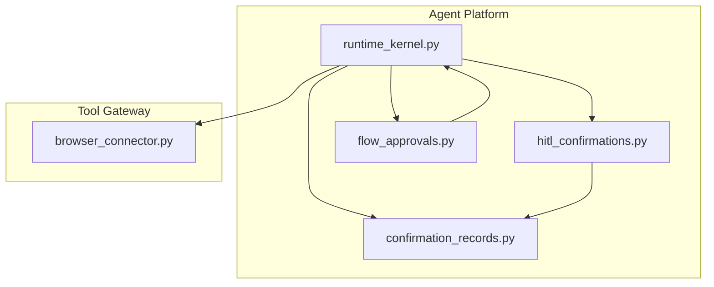
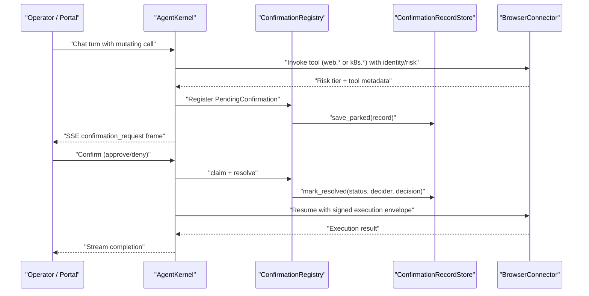
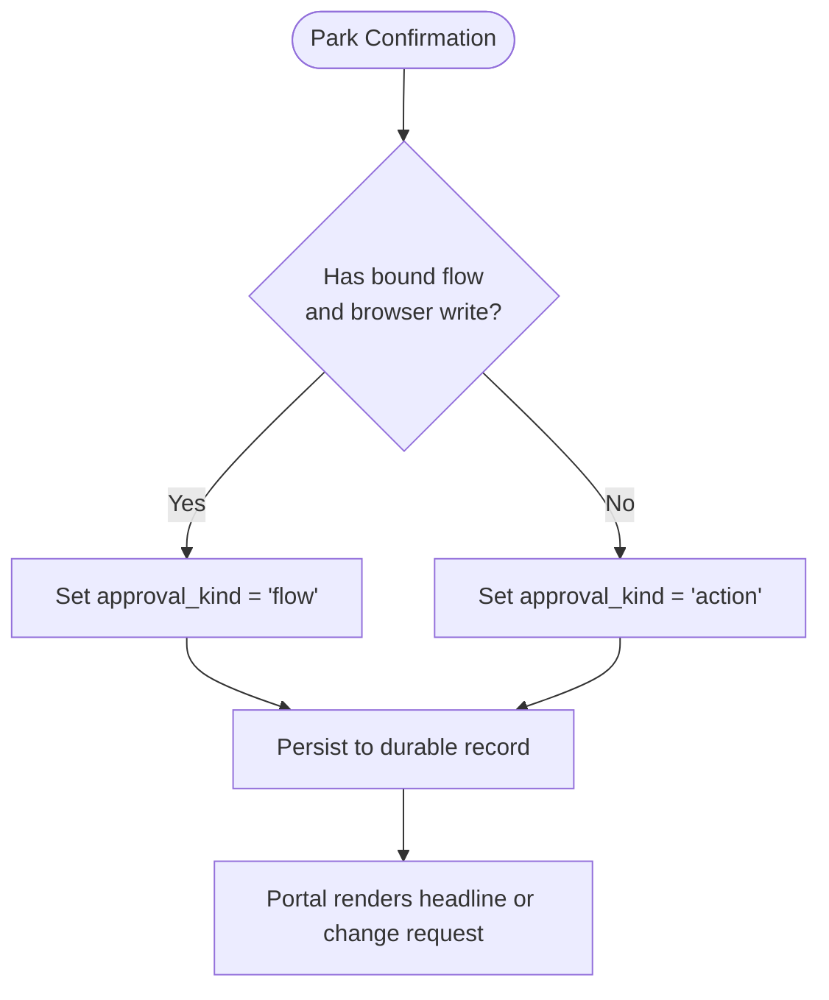
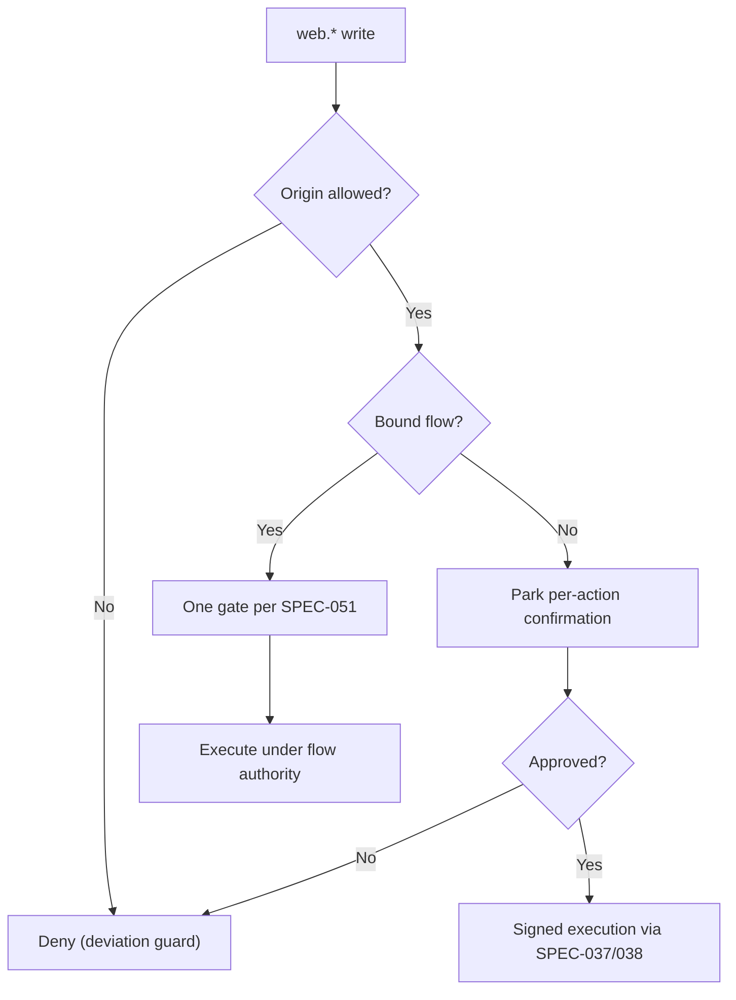
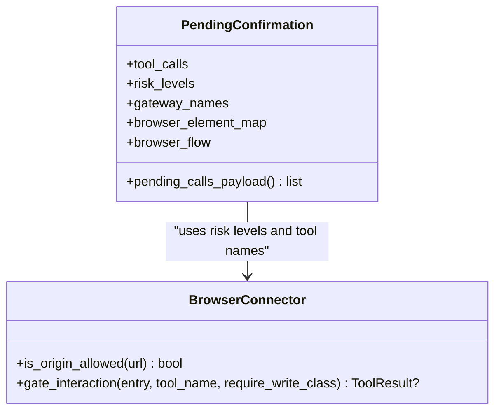
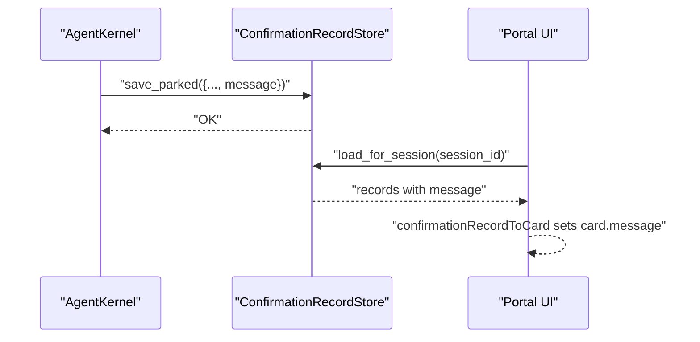
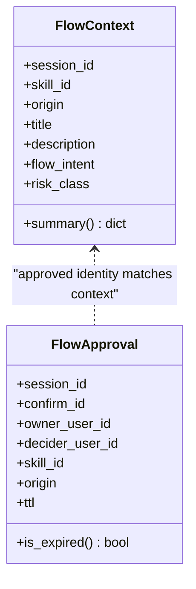
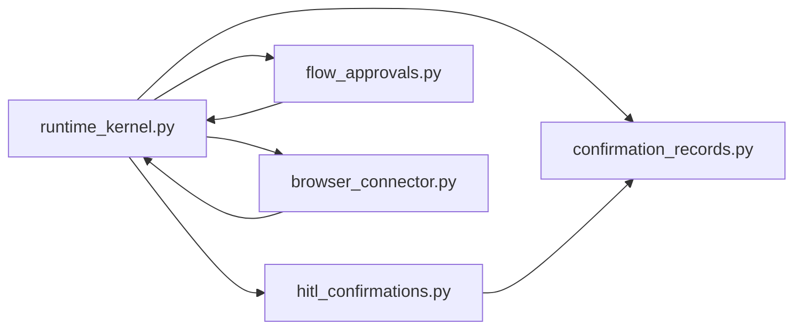

# SPEC-054: Action-Level Approval and Change Request Card

<cite>
**Referenced Files in This Document**
- [spec.md](file://docs/specs/SPEC-054-action-approval-and-change-request-card/spec.md)
- [flow_approvals.py](file://products/agent-platform/src/agent_service/services/flow_approvals.py)
- [hitl_confirmations.py](file://products/agent-platform/src/agent_service/services/hitl_confirmations.py)
- [confirmation_records.py](file://products/agent-platform/src/agent_service/services/confirmation_records.py)
- [runtime_kernel.py](file://products/agent-platform/src/agent_service/runtime_kernel.py)
- [browser_connector.py](file://products/tool-gateway/src/tool_gateway/tools/browser_connector.py)
</cite>

## Table of Contents
1. [Introduction](#introduction)
2. [Project Structure](#project-structure)
3. [Core Components](#core-components)
4. [Architecture Overview](#architecture-overview)
5. [Detailed Component Analysis](#detailed-component-analysis)
6. [Dependency Analysis](#dependency-analysis)
7. [Performance Considerations](#performance-considerations)
8. [Troubleshooting Guide](#troubleshooting-guide)
9. [Conclusion](#conclusion)

## Introduction
This document explains the implementation of SPEC-054, which makes action-level human-in-the-loop (HITL) approval first-class and turns every action confirmation card into a readable change request. It also introduces an explicit approval kind discriminator so flow and action cards are framed correctly, extends per-action signed gates to ad-hoc browser writes on allowlisted origins, persists the card message for durable parity, and keeps all changes additive with no new trust mechanisms or policy actions.

Key outcomes:
- Explicit approval_kind on confirmation frames and durable records.
- Ad-hoc browser writes park as per-action signed gates instead of hard-denying when on an allowlisted origin.
- Action cards surface a secret-masked change request projection without altering signed parameters.
- Durable card-message parity across live stream, approver inbox, and reloaded transcripts.

**Section sources**
- [spec.md:27-62](file://docs/specs/SPEC-054-action-approval-and-change-request-card/spec.md#L27-L62)

## Project Structure
SPEC-054 touches four main areas:
- Agent platform kernel and HITL services: frame building, pending confirmations, durable records, and flow authority.
- Tool gateway browser connector: origin allowlist checks, flow binding, deviation guard, and write-tier gating.
- Shared contracts: additive schema fields for approval_kind, change_request, and message.
- Operator portal rendering: decode and render both flow and action cards with message parity.

**Diagram sources**
- [runtime_kernel.py:1-800](file://products/agent-platform/src/agent_service/runtime_kernel.py#L1-L800)
- [hitl_confirmations.py:1-349](file://products/agent-platform/src/agent_service/services/hitl_confirmations.py#L1-L349)
- [confirmation_records.py:1-707](file://products/agent-platform/src/agent_service/services/confirmation_records.py#L1-L707)
- [flow_approvals.py:1-250](file://products/agent-platform/src/agent_service/services/flow_approvals.py#L1-L250)
- [browser_connector.py:1-800](file://products/tool-gateway/src/tool_gateway/tools/browser_connector.py#L1-L800)

**Section sources**
- [spec.md:250-298](file://docs/specs/SPEC-054-action-approval-and-change-request-card/spec.md#L250-L298)

## Core Components
- Approval kind discriminator: Every parked confirmation declares whether it is a flow or action. Flow cards carry a headline; action cards show a change request projection.
- Per-action signed gates for browser writes: Unbound browser writes on allowlisted origins park per-action and execute only after operator approval and signing.
- Change request projection: A display-only, secret-masked summary of decision-relevant parameters that complements technical details without changing the signed payload.
- Durable message persistence: The top-line card message is persisted alongside other record fields so all surfaces render consistently.

These behaviors reuse existing per-action approval and signed execution paths and add only optional fields to the confirmation frame and durable record schemas.

**Section sources**
- [spec.md:88-208](file://docs/specs/SPEC-054-action-approval-and-change-request-card/spec.md#L88-L208)

## Architecture Overview
The approval flow spans the agent platform kernel, HITL registry, durable store, and tool gateway enforcement boundaries.

**Diagram sources**
- [runtime_kernel.py:409-443](file://products/agent-platform/src/agent_service/runtime_kernel.py#L409-L443)
- [hitl_confirmations.py:208-349](file://products/agent-platform/src/agent_service/services/hitl_confirmations.py#L208-L349)
- [confirmation_records.py:511-545](file://products/agent-platform/src/agent_service/services/confirmation_records.py#L511-L545)
- [browser_connector.py:423-477](file://products/tool-gateway/src/tool_gateway/tools/browser_connector.py#L423-L477)

## Detailed Component Analysis

### Approval Kind Discriminator (R-1)
- Purpose: Make the confirmation’s kind explicit so the portal can render either a flow headline or an action change request reliably.
- Derivation: For flows, the batch carries a browser write and a bound FlowContext; otherwise it is an action.
- Persistence: approval_kind is stored on the durable record so inbox and transcript replay match the live card.

**Diagram sources**
- [flow_approvals.py:54-97](file://products/agent-platform/src/agent_service/services/flow_approvals.py#L54-L97)
- [hitl_confirmations.py:66-73](file://products/agent-platform/src/agent_service/services/hitl_confirmations.py#L66-L73)
- [confirmation_records.py:52-82](file://products/agent-platform/src/agent_service/services/confirmation_records.py#L52-L82)

**Section sources**
- [spec.md:88-116](file://docs/specs/SPEC-054-action-approval-and-change-request-card/spec.md#L88-L116)

### Ad-Hoc Browser Writes Park as Per-Action Signed Gates (R-2)
- Behavior: An unbound web.* write on an allowlisted origin parks a per-action confirmation instead of being hard-denied. Each write gets its own execution_id, args_digest, and confirm_id.
- Safety: No auto-allow; if bridging is disabled, such writes are denied. Non-browser tools remain unchanged; bound flows still collapse to one gate.
- Enforcement: Origin allowlist remains deny-by-default; deviation guard still bounds execution.

**Diagram sources**
- [browser_connector.py:423-477](file://products/tool-gateway/src/tool_gateway/tools/browser_connector.py#L423-L477)
- [spec.md:117-143](file://docs/specs/SPEC-054-action-approval-and-change-request-card/spec.md#L117-L143)

**Section sources**
- [spec.md:117-143](file://docs/specs/SPEC-054-action-approval-and-change-request-card/spec.md#L117-L143)

### Action Card as Change Request (R-3)
- Display projection: A short, human-readable description of the intended change assembled from parameters at park time.
- Secret masking: Uses the existing redaction vocabulary to mask secret-bearing values while preserving keys.
- Integrity: The projection never alters the signed args_digest; full parameters remain available in technical details.

**Diagram sources**
- [hitl_confirmations.py:41-118](file://products/agent-platform/src/agent_service/services/hitl_confirmations.py#L41-L118)
- [browser_connector.py:151-201](file://products/tool-gateway/src/tool_gateway/tools/browser_connector.py#L151-L201)

**Section sources**
- [spec.md:145-173](file://docs/specs/SPEC-054-action-approval-and-change-request-card/spec.md#L145-L173)

### Durable Card-Message Parity (R-4)
- Problem: The confirmation card’s top-line message was frame-only and vanished on durable renders.
- Fix: Persist message on the durable confirmation record and map it back to the portal’s card model so inbox and reloaded transcripts match the live card.
- Backward compatibility: Legacy rows without the field degrade gracefully.

**Diagram sources**
- [confirmation_records.py:52-82](file://products/agent-platform/src/agent_service/services/confirmation_records.py#L52-L82)
- [confirmation_records.py:511-545](file://products/agent-platform/src/agent_service/services/confirmation_records.py#L511-L545)

**Section sources**
- [spec.md:175-208](file://docs/specs/SPEC-054-action-approval-and-change-request-card/spec.md#L175-L208)

### Flow Authority and Context (Supporting R-1/R-2)
- FlowContext reflects the gateway-bound flow identity and supplies the headline payload.
- FlowApprovalStore tracks TTL-bounded authority for subsequent writes within the same flow identity.
- These stores ensure that approvals scope strictly to the approved skill and origin.

**Diagram sources**
- [flow_approvals.py:54-97](file://products/agent-platform/src/agent_service/services/flow_approvals.py#L54-L97)
- [flow_approvals.py:143-178](file://products/agent-platform/src/agent_service/services/flow_approvals.py#L143-L178)

**Section sources**
- [flow_approvals.py:1-250](file://products/agent-platform/src/agent_service/services/flow_approvals.py#L1-L250)

## Dependency Analysis
- runtime_kernel.py composes middlewares and integrates HITL registration, durable record creation, and flow approval state.
- hitl_confirmations.py maintains the in-memory registry of pending confirmations and serializes payloads for the confirmation_request frame.
- confirmation_records.py provides in-memory and Postgres backends for durable confirmation lifecycle storage.
- flow_approvals.py holds session-scoped flow context and approval authority used by the kernel to decide flow vs action framing.
- browser_connector.py enforces origin allowlist, flow binding, and deviation guard; write-tier calls ride the upstream HITL and signed execution path.

**Diagram sources**
- [runtime_kernel.py:1-800](file://products/agent-platform/src/agent_service/runtime_kernel.py#L1-L800)
- [hitl_confirmations.py:1-349](file://products/agent-platform/src/agent_service/services/hitl_confirmations.py#L1-L349)
- [confirmation_records.py:1-707](file://products/agent-platform/src/agent_service/services/confirmation_records.py#L1-L707)
- [flow_approvals.py:1-250](file://products/agent-platform/src/agent_service/services/flow_approvals.py#L1-L250)
- [browser_connector.py:1-800](file://products/tool-gateway/src/tool_gateway/tools/browser_connector.py#L1-L800)

**Section sources**
- [spec.md:250-298](file://docs/specs/SPEC-054-action-approval-and-change-request-card/spec.md#L250-L298)

## Performance Considerations
- In-memory registries and stores are intentionally per-process for speed during live interactions; durable storage backs history and restart recovery.
- Bounded caps and sweeps prevent unbounded growth in confirmation records and evidence.
- Flow authority TTL limits the window for auto-signed writes, reducing risk and memory footprint.
- Secret masking and snapshot element parsing are lightweight operations scoped to confirmation payloads.

[No sources needed since this section provides general guidance]

## Troubleshooting Guide
Common issues and where to look:
- Missing card message on durable surfaces: verify message persistence path and mapping in the durable record and portal model.
- Action card shows stale flow headline: ensure approval_kind is set explicitly and flow_summary is present only for flows.
- Ad-hoc browser write denied unexpectedly: check origin allowlist configuration and deviation guard behavior.
- Confirmation not resuming: inspect single-flight claim/resume logic and TTL handling in the registry.

**Section sources**
- [hitl_confirmations.py:208-349](file://products/agent-platform/src/agent_service/services/hitl_confirmations.py#L208-L349)
- [confirmation_records.py:491-545](file://products/agent-platform/src/agent_service/services/confirmation_records.py#L491-L545)
- [browser_connector.py:423-477](file://products/tool-gateway/src/tool_gateway/tools/browser_connector.py#L423-L477)

## Conclusion
SPEC-054 elevates action-level approvals to first-class status, enables interactive browser mutations through per-action signed gates on allowlisted origins, improves operator decision-making with secret-masked change requests, and ensures durable parity of the card message across all surfaces. All changes are additive and build on existing HITL and signed-execution foundations, keeping the trust boundary intact while expanding safe interactivity.

[No sources needed since this section summarizes without analyzing specific files]