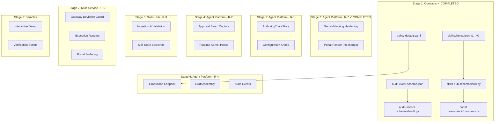
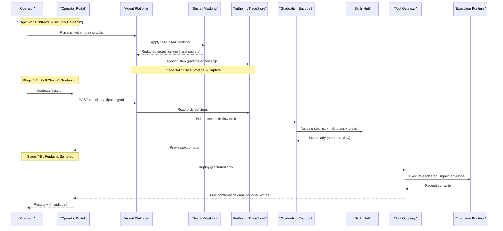
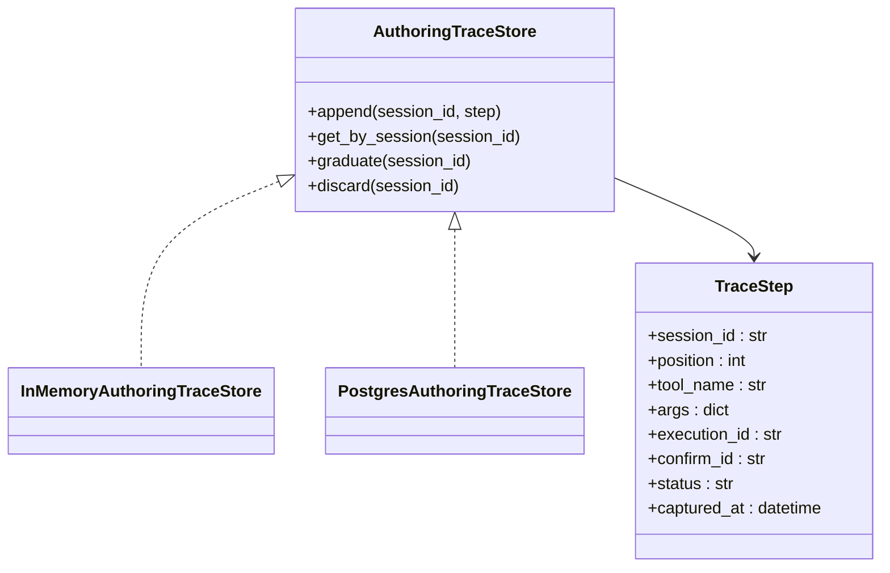
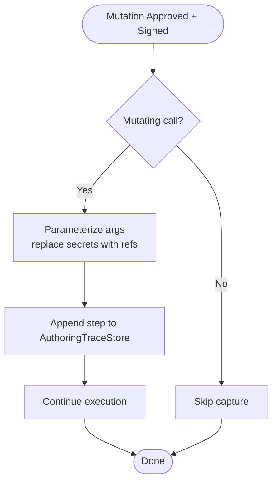
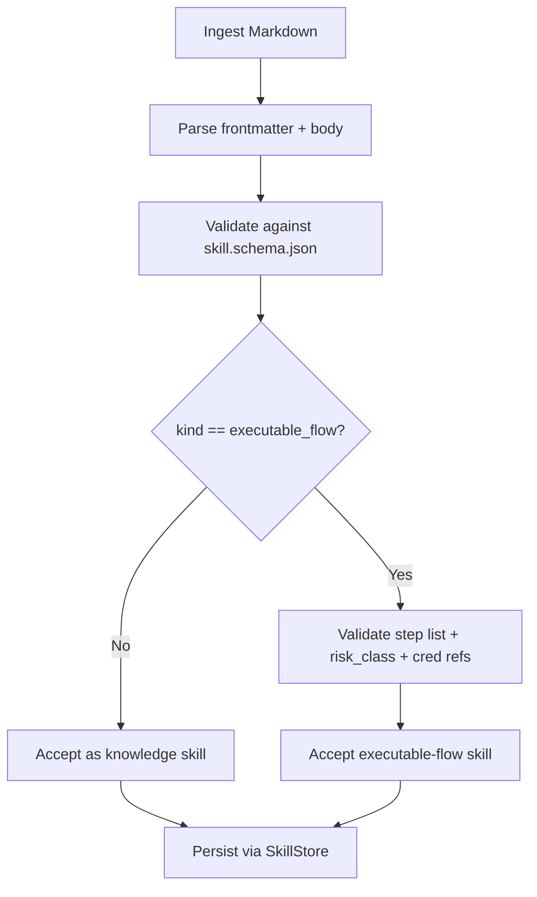
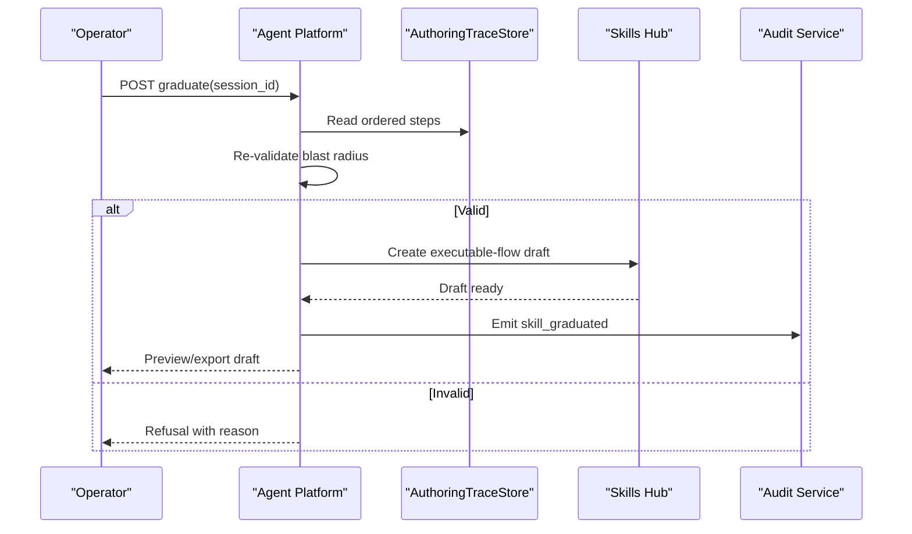
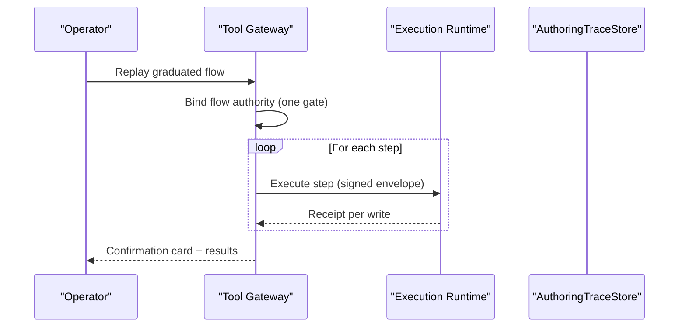
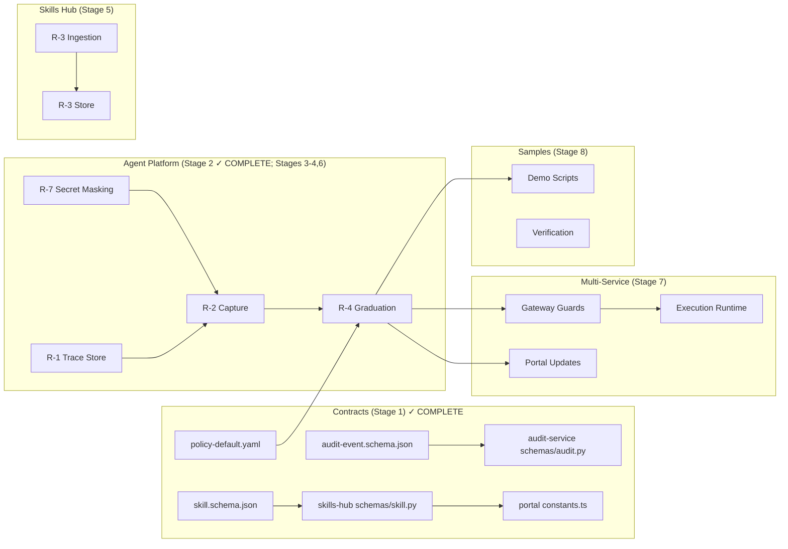

# SPEC-055: Develop-as-You-Go Skill Graduation

<cite>
**Referenced Files in This Document**
- [spec.md](file://docs/specs/SPEC-055-develop-as-you-go-skill-graduation/spec.md)
- [plan.md](file://docs/specs/SPEC-055-develop-as-you-go-skill-graduation/plan.md)
- [tasks.md](file://docs/specs/SPEC-055-develop-as-you-go-skill-graduation/tasks.md)
- [skill.schema.json](file://shared/shared-contracts/schemas/skill.schema.json)
- [audit-event.schema.json](file://shared/shared-contracts/schemas/audit-event.schema.json)
- [policy-default.yaml](file://shared/shared-contracts/policies/policy-default.yaml)
- [skill.py](file://products/skills-hub/src/skills_hub/schemas/skill.py)
- [audit.py](file://products/audit-service/src/audit_service/schemas/audit.py)
- [constants.ts](file://products/operator-portal/web-ui/app/src/views/audit/constants.ts)
</cite>

## Update Summary
**Changes Made**
- Updated implementation status to reflect completed Stage 1 with shared-contract lockstep
- Added detailed analysis of completed contract implementations including executable flow support
- Enhanced security analysis with new skill_graduated audit event and authorization controls
- Updated dependency analysis to reflect completed schema bindings and policy actions
- Added comprehensive coverage of lockstep refinement process for shared contracts
- Marked Stage 2 (R-7 approval-seam secret masking) complete and corrected its description to the design that actually shipped: a per-tool `KNOWN_SAFE_FIELDS` allow-list with `should_mask` flipped fail-closed, plus in-place redaction of action-card `parameters` at the park site, the resume-result frame and the live pending-confirmation bridge
- Corrected the R-7 persisted-record claim (nothing persists raw for signing) and the Stage 2 portal claim (the portal needed no functional change)

## Table of Contents
1. [Introduction](#introduction)
2. [Project Structure](#project-structure)
3. [Core Components](#core-components)
4. [Architecture Overview](#architecture-overview)
5. [Detailed Component Analysis](#detailed-component-analysis)
6. [Implementation Strategy](#implementation-strategy)
7. [Dependency Analysis](#dependency-analysis)
8. [Performance Considerations](#performance-considerations)
9. [Troubleshooting Guide](#troubleshooting-guide)
10. [Conclusion](#conclusion)

## Introduction
This document specifies and analyzes SPEC-055: Develop-as-You-Go Skill Graduation. It explains how a troubleshooting session that performed individually approved, signed mutations can be turned into a replayable executable-flow skill. The spec introduces a durable authoring-trace store, an executable-flow skill class with risk_class decoupled from web_target, deterministic graduation with blast-radius re-validation, and one-gate replay under gateway guards with credential-set references instead of literal secrets.

The goal is to enable operators to "develop as you go" by running actions in chat, approving them, and then graduating the resulting trace into a reusable, human-reviewed skill draft that replays safely under a single HITL gate.

**Updated** Stage 1 implementation is complete with shared-contract lockstep for skill graduation functionality. The completed work includes advanced skill.schema.json from v1 to v2 with additive executable-flow support, new skill_graduated audit event type with detailed payload structure, introduction of session:skill_graduate policy action with appropriate role bindings, and comprehensive lockstep validation ensuring bidirectional parity between schemas and their consumers. The implementation follows strict lockstep refinement where shared schemas are never edited alone - bidirectional parity tests pin each schema to its consumers, so the schema and its bound declarations ship as one atomic unit or `make verify` fails.

**Section sources**
- [spec.md:29-61](file://docs/specs/SPEC-055-develop-as-you-go-skill-graduation/spec.md#L29-L61)
- [plan.md:5-37](file://docs/specs/SPEC-055-develop-as-you-go-skill-graduation/plan.md#L5-L37)
- [tasks.md:10-29](file://docs/specs/SPEC-055-develop-as-you-go-skill-graduation/tasks.md#L10-L29)

## Project Structure
SPEC-055 spans multiple services and shared contracts with a structured eight-stage implementation approach. Stage 1 (Contracts) is now complete with lockstep refinement ensuring all shared contracts are properly bound to their consumers.



**Diagram sources**
- [plan.md:349-373](file://docs/specs/SPEC-055-develop-as-you-go-skill-graduation/plan.md#L349-L373)
- [tasks.md:10-102](file://docs/specs/SPEC-055-develop-as-you-go-skill-graduation/tasks.md#L10-L102)

**Section sources**
- [plan.md:349-373](file://docs/specs/SPEC-055-develop-as-you-go-skill-graduation/plan.md#L349-L373)
- [tasks.md:10-102](file://docs/specs/SPEC-055-develop-as-you-go-skill-graduation/tasks.md#L10-L102)

## Core Components
- **AuthoringTraceStore (R-1)**: A dual-backend store (InMemory + Postgres) keyed by session_id, capturing ordered, secret-safe parameterized steps from approved mutations. Lifecycle: draft → graduated | discarded. Retention independent of execution_records sweep. Per-session step cap prevents unbounded growth.
- **Capture at Approval Seam (R-2)**: Trace append occurs only for mutating calls that are approved and signed (per-action or flow authority). Best-effort and fail-safe; never blocks execution or receipts. Secrets parameterized at capture time using redaction vocabulary and credential-set references.
- **Executable-Flow Skill Class (R-3)**: Additive skill schema extension with kind discriminator and machine-readable replay step list. risk_class accepted without web_target so non-browser mutating skills can declare write intent. Ingestion validates step-list shape, declared risk_class, and credential-set references.
- **Graduation (R-4)**: Deterministic assembly of executable-flow skill draft from the authoring trace. Re-validates blast radius (step count, origin/risk_class allowlists, credential resolution). Produces a human-reviewable draft; never auto-publishes. New policy action and audit event for authorization and auditability.
- **One-Gate Replay (R-5)**: Graduated flows replay under a single confirmation card; each write remains individually signed, persisted, audited, and receipted. Gateway deviation guard enforces origin/risk_class/step budget. Credentials resolved at replay from named credential sets. Non-browser replay binding generalized to skill identity (deferred if too large).
- **Approval-Seam Secret-Masking Hardening (R-7)**: Fail-closed projection masking that closes the generic field-masking failure path for off-vocabulary secret values. Ensures no literal secrets appear on streamed or rendered change-request surfaces while preserving the signed-execution invariant. Addresses critical gaps where raw secret-bearing parameters persist in pending_calls field and generic field-masking fails open for off-vocabulary secret values. **Shipped in Stage 2**: masking is now driven by a per-tool `KNOWN_SAFE_FIELDS` allow-list rather than by name or value vocabulary, and action-card `parameters` are redacted in place on every display and persistence surface.

**Updated** Stage 1 completion includes advanced skill.schema.json v2 with executable-flow support, comprehensive lockstep validation across all consumer services, and enhanced authorization controls through new policy actions and audit events. Stage 2 completion adds the R-7 fail-closed masking flip and the action-card parameter redaction seam in agent-platform, with the signed `args_digest` proven byte-identical by test.

**Section sources**
- [spec.md:101-305](file://docs/specs/SPEC-055-develop-as-you-go-skill-graduation/spec.md#L101-L305)
- [plan.md:214-347](file://docs/specs/SPEC-055-develop-as-you-go-skill-graduation/plan.md#L214-L347)

## Architecture Overview
The graduation pipeline connects agent runtime approvals to a durable trace, then to a validated executable-flow skill, and finally to safe replay under one gate, with comprehensive secret-masking hardening at every surface.



**Diagram sources**
- [plan.md:349-373](file://docs/specs/SPEC-055-develop-as-you-go-skill-graduation/plan.md#L349-L373)
- [tasks.md:10-102](file://docs/specs/SPEC-055-develop-as-you-go-skill-graduation/tasks.md#L10-L102)

## Detailed Component Analysis

### AuthoringTraceStore (R-1)
- Protocol and backends: Mirrors existing patterns (execution_records/confirmation_records) with InMemory and Postgres implementations and a build_*_store factory. Both backends must expose identical schema fields to avoid silent drops in production.
- Step record: Ordered position, canonical tool name, secret-safe parameterized arguments (credential values replaced by placeholders/credential-set references), and references to originating execution_id/confirm_id.
- Lifecycle and retention: draft → graduated | discarded; retention independent of 30-day execution sweep. Keyed by session_id with a per-session step cap.



**Diagram sources**
- [plan.md:214-230](file://docs/specs/SPEC-055-develop-as-you-go-skill-graduation/plan.md#L214-L230)
- [tasks.md:33-45](file://docs/specs/SPEC-055-develop-as-you-go-skill-graduation/tasks.md#L33-L45)

**Section sources**
- [plan.md:214-230](file://docs/specs/SPEC-055-develop-as-you-go-skill-graduation/plan.md#L214-L230)
- [tasks.md:33-45](file://docs/specs/SPEC-055-develop-as-you-go-skill-graduation/tasks.md#L33-L45)

### Capture at Approval Seam (R-2)
- Trigger point: Same resume/receipt seam that writes execution_records; only captures mutating calls that were approved and signed (per-action or flow authority).
- Mixed sessions: Both ad-hoc per-action writes and writes inside bound flows contribute to one coherent ordered trace.
- Fail-safe: Trace-store failures degrade gracefully; they do not block execution or receipts.
- Secret safety: Parameterization at capture time using redaction vocabulary and credential-set references; no literal secrets stored.



**Diagram sources**
- [plan.md:232-253](file://docs/specs/SPEC-055-develop-as-you-go-skill-graduation/plan.md#L232-L253)
- [tasks.md:47-57](file://docs/specs/SPEC-055-develop-as-you-go-skill-graduation/tasks.md#L47-L57)

**Section sources**
- [plan.md:232-253](file://docs/specs/SPEC-055-develop-as-you-go-skill-graduation/plan.md#L232-L253)
- [tasks.md:47-57](file://docs/specs/SPEC-055-develop-as-you-go-skill-graduation/tasks.md#L47-L57)

### Executable-Flow Skill Class (R-3)
- Schema change: Additive extension to skill.schema.json introducing kind discriminator and replay step list. Existing knowledge/guidance skills validate unchanged.
- Risk class decoupling: risk_class accepted without web_target so non-browser mutating skills can declare write intent.
- Ingestion validation: Validates step-list shape, ensures declared risk_class matches mutating steps, and verifies credential-set references resolve to named sets.



**Diagram sources**
- [plan.md:255-272](file://docs/specs/SPEC-055-develop-as-you-go-skill-graduation/plan.md#L255-L272)
- [tasks.md:59-69](file://docs/specs/SPEC-055-develop-as-you-go-skill-graduation/tasks.md#L59-L69)

**Section sources**
- [plan.md:255-272](file://docs/specs/SPEC-055-develop-as-you-go-skill-graduation/plan.md#L255-L272)
- [tasks.md:59-69](file://docs/specs/SPEC-055-develop-as-you-go-skill-graduation/tasks.md#L59-L69)

### Graduation (R-4)
- Deterministic assembly: Builds executable-flow skill draft strictly from captured, approved trace; no LLM synthesis of steps.
- Blast-radius re-validation: Step count bounds, target/origin allowlist checks, consistent risk_class: write, credential resolution to named sets. Failure yields deterministic refusal surfaced to operator.
- Human merge: Produces previewable/exportable draft; platform never auto-publishes executable mutating skills.
- Policy and audit: New policy action (session:skill_graduate) and audit event (skill_graduated) for authorization and auditing; role-gated to operator/approver.



**Diagram sources**
- [plan.md:274-297](file://docs/specs/SPEC-055-develop-as-you-go-skill-graduation/plan.md#L274-L297)
- [tasks.md:71-84](file://docs/specs/SPEC-055-develop-as-you-go-skill-graduation/tasks.md#L71-L84)

**Section sources**
- [plan.md:274-297](file://docs/specs/SPEC-055-develop-as-you-go-skill-graduation/plan.md#L274-L297)
- [tasks.md:71-84](file://docs/specs/SPEC-055-develop-as-you-go-skill-graduation/tasks.md#L71-L84)

### One-Gate Replay (R-5)
- Single confirmation: Replaying a write-class executable flow binds a flow authority and parks one confirmation card; subsequent writes admitted under that authority.
- Per-write signing: Each replayed write is individually signed, persisted, audited, and receipted, identical to hand-authored flows.
- Gateway deviation guard: Origin allowlist, declared risk_class, and step budget enforced; off-allowlist or past-budget replays fail closed.
- Credential resolution: At replay time, credentials resolved from named credential sets referenced in steps; no literal secrets in skills.
- Non-browser binding: Generalize flow-binding key to skill identity for infra flows; browser-only replay in this spec with infra deferred if needed.



**Diagram sources**
- [plan.md:299-318](file://docs/specs/SPEC-055-develop-as-you-go-skill-graduation/plan.md#L299-L318)
- [tasks.md:86-96](file://docs/specs/SPEC-055-develop-as-you-go-skill-graduation/tasks.md#L86-L96)

**Section sources**
- [plan.md:299-318](file://docs/specs/SPEC-055-develop-as-you-go-skill-graduation/plan.md#L299-L318)
- [tasks.md:86-96](file://docs/specs/SPEC-055-develop-as-you-go-skill-graduation/tasks.md#L86-L96)

### Approval-Seam Secret-Masking Hardening (R-7)
**Critical security enhancement addressing fundamental gaps in the action approval workflow where raw secret-bearing parameters could persist in plaintext across multiple system surfaces.**

- **Fail-closed projection masking**: Closes the `_generic_fields` fail-open path so generically-named secrets (off-vocabulary keys) are masked rather than projected as plaintext. As shipped, `should_mask(tool_name, param_name)` returns `not is_known_safe(...)`: a field is passed through only when its dotted `tool_name.param_name` appears in the per-tool `KNOWN_SAFE_FIELDS` allow-list, so any unlisted field masks by default. `is_secret_param` / `is_opaque_value` and `SECRET_PARAM_SUBSTRINGS` are retained (the latter is the twinned record checked against tool-gateway's `_SECRET_QUERY_PARAMS` by `validate_secret_vocabulary.py`) but no longer decide masking.
- **No literal secret exposure**: For an `action` card the raw per-call `parameters` are redacted in place (`redact_pending_calls` → `redact_parameters`), so both the `change_request` projection and the portal "Technical details" expander carry `***` for every non-allow-listed value; no surface presents the raw secret.
- **Signed-execution invariant preservation**: Redaction operates purely as a projection layer - the `canonical_digest(parameters)` inputs forming the signed `args_digest` remain unchanged, so resume-time digest verification and signing are unaffected. `pending_calls_payload()` re-parses the parked tool calls into a fresh copy on every call, and `build_requests` reads that fresh raw copy at resume, so mutating a display copy cannot reach the digest. Pinned by `test_args_digest_is_invariant_under_action_card_redaction`.
- **Bounded persisted-record exposure**: Nothing must persist raw for signing. The redacted `pending_calls` payload is computed once at the park site and feeds both the durable `confirmation_records` row and the `confirmation_request` frame, so the stored record carries `***` too; the same redaction is applied to the `confirmation_result` frame and to the live branch of the v2 `GET /sessions/{id}/pending-confirmation` bridge. The card message is built from the raw parameters *before* redaction so it stays readable.
- **Flow and legacy cards untouched**: Redaction is gated on `approval_kind == "action"`; browser `flow` cards and legacy cards without an approval kind keep their existing payload shape.
- **Reference-only credential entry enforcement**: `web.fill_credential` remains the only path introducing secrets into browser flows, extending the same discipline to non-browser action parameters as defense-in-depth.

```mermaid
flowchart TD
Param["Raw Parameters"] --> MaskCheck{"Known-safe field for this tool?"}
MaskCheck --> |No (default)| Mask["Apply *** mask"]
MaskCheck --> |Yes| Pass["Pass through"]
Mask --> Projection["Build change_request projection"]
Pass --> Projection
Mask --> Redacted["Redacted parameters copy"]
Pass --> Redacted
Projection --> Stream["Stream to portal"]
Redacted --> Stream
Projection --> Durable["Persist to durable record"]
Redacted --> Durable
Stream --> Render["Render to user"]
Durable --> Audit["Audit trail"]
Param --> Resume["Fresh re-parse at resume"]
Resume --> Digest["canonical_digest → signed args_digest (unredacted)"]
```

**Diagram sources**
- [plan.md:331-347](file://docs/specs/SPEC-055-develop-as-you-go-skill-graduation/plan.md#L331-L347)
- [tasks.md:19-31](file://docs/specs/SPEC-055-develop-as-you-go-skill-graduation/tasks.md#L19-L31)

**Section sources**
- [plan.md:331-347](file://docs/specs/SPEC-055-develop-as-you-go-skill-graduation/plan.md#L331-L347)
- [tasks.md:19-31](file://docs/specs/SPEC-055-develop-as-you-go-skill-graduation/tasks.md#L19-L31)

## Implementation Strategy
SPEC-055 follows a structured eight-stage implementation approach that builds incrementally while maintaining backward compatibility and security invariants. Stages 1-2 are now complete: Stage 1 with comprehensive shared-contract lockstep, Stage 2 with the R-7 approval-seam secret-masking hardening.

### Stage 1: Contracts (Foundation) ✓ COMPLETED
- Advanced skill.schema.json from v1 to v2 with additive executable-flow support including `kind` discriminator and `steps` array
- Added skill_graduated audit event type with detailed payload structure (session_id, mode, validation, step_count)
- Introduced session:skill_graduate policy action with appropriate role bindings (platform-admin, approver, operator)
- Implemented comprehensive lockstep validation ensuring bidirectional parity between schemas and consumers
- Verified execution-runtime requires no changes (verify-only approach)

### Stage 2: Agent Platform - R-7 Secret Masking ✓ COMPLETED
- Implemented the `KNOWN_SAFE_FIELDS` allow-list for per-tool field whitelisting (dotted `tool_name.param_name` entries)
- Flipped `should_mask` to a fail-closed posture (mask-unless-known-safe) and added `redact_parameters`
- Added `redact_pending_calls`, gated on `approval_kind == "action"`, and applied it at the park site (feeding both the durable record and the `confirmation_request` frame), at the `confirmation_result` frame, and at the live pending-confirmation bridge
- The portal needed no functional change: it renders `call.parameters` verbatim, so the backend redaction flows through to the "Technical details" expander; only the stale ChatView.tsx comment claiming raw arguments still travel to the audit trail was corrected
- Coverage: two existing change-request tests were updated for the intended behavior change (an unlisted `namespace` and a secret-named `name` now mask), plus new tests for off-vocabulary fail-closed masking, the redaction unit behavior on action/flow/legacy payloads, stream-and-record redaction, the `args_digest` invariance, and two portal render tests

### Stage 3: Agent Platform - R-1 Authoring Trace Store
- Create AuthoringTraceStore protocol with InMemory and Postgres backends
- Implement idempotent DDL for authoring_trace table sharing sessions database
- Configure per-session step cap (AGENT_AUTHORING_TRACE_MAX_STEPS) and idle-GC (AGENT_AUTHORING_TRACE_IDLE_DAYS)
- Establish lifecycle management (draft → graduated | discarded)

### Stage 4: Agent Platform - R-2 Approval Seam Capture
- Hook into both per-action and flow-unlock signing sites in runtime_kernel.py
- Implement secret-safe parameterization at capture using redaction vocabulary
- Store execution_id/confirm_id references rather than duplicating receipts
- Ensure best-effort capture that never blocks execution or receipts

### Stage 5: Skills Hub - R-3 Executable-Flow Skill Class
- Extend ingestion validation to support executable-flow skills with step lists
- Relax risk_class requirement to allow write-class without web_target
- Validate step-list shape, credential-set references, and mutating-ness declarations
- Update both skill store backends with kind and steps columns

### Stage 6: Agent Platform - R-4 Graduation
- Implement deterministic build_executable_flow_draft function (no LLM synthesis)
- Add blast-radius re-validation before draft production
- Create graduation endpoint mirroring skill-draft pattern with proper authorization
- Emit skill_graduated audit events and flip trace lifecycle

### Stage 7: Multi-Service - R-5 Replay
- Verify browser executable flows bind and one-gate through existing SPEC-051 machinery
- Confirm gateway deviation guards apply to replayed writes
- Assert infra executable flows park per-action (safe fallback until OQ-2)
- Update portal to surface replay information

### Stage 8: Samples and Verification
- Create interactive graduation demo exercising full end-to-end flow
- Implement verification scripts following ADR-0008 exercised-sample rule
- Ensure password-reset demos remain green (no regression)
- Complete delivery gate with version bump to 0.36.0

**Section sources**
- [plan.md:349-373](file://docs/specs/SPEC-055-develop-as-you-go-skill-graduation/plan.md#L349-L373)
- [tasks.md:10-102](file://docs/specs/SPEC-055-develop-as-you-go-skill-graduation/tasks.md#L10-L102)

## Dependency Analysis
The implementation follows strict dependency ordering with clear separation between products and phases. Stage 1 dependencies are now fully resolved with lockstep validation ensuring all shared contracts are properly bound, and Stage 2's R-7 masking seam is in place ahead of the Stage 4 capture that builds on it.



**Diagram sources**
- [plan.md:349-373](file://docs/specs/SPEC-055-develop-as-you-go-skill-graduation/plan.md#L349-L373)

**Section sources**
- [plan.md:349-373](file://docs/specs/SPEC-055-develop-as-you-go-skill-graduation/plan.md#L349-L373)

## Performance Considerations
- **Dual-backend stores**: Ensure both InMemory and Postgres backends implement identical schemas to avoid silent data loss in production. Prefer verifying against Postgres (dev-k8s backend).
- **Bounded traces**: Enforce per-session step caps to prevent unbounded growth of authoring traces.
- **Best-effort capture**: Trace-store failures should not block execution; degrade gracefully to "no graduation candidate."
- **Credential resolution**: Resolve credentials at replay time from named sets to keep skills shareable and avoid secret leakage.
- **Search and storage**: Leverage existing indexing strategies (e.g., GIN indexes) for skill catalog queries when integrating executable-flow metadata.
- **Secret-masking performance**: Fail-closed masking adds minimal overhead through vocabulary lookups but prevents catastrophic secret exposure; the constant-time substring matching is negligible compared to I/O operations.
- **Graduation determinism**: No LLM calls during graduation ensure predictable performance and reproducibility.
- **Replay efficiency**: One-gate replay minimizes confirmation overhead while maintaining per-write signing and auditing.
- **Lockstep validation overhead**: Bidirectional parity tests add minimal CI time but prevent schema drift across services.

## Troubleshooting Guide
- **Graduation refusal**: If blast-radius re-validation fails (step budget exceeded, off-allowlist target, inconsistent risk_class, unresolved credentials), the operation deterministically refuses and surfaces the reason to the operator.
- **Missing capture**: If trace capture fails, the session cannot be graduated but execution continues unaffected; verify capture seam and store health.
- **Schema mismatches**: Ensure executable-flow fields exist on both InMemory and Postgres backends; otherwise, fields may be silently dropped in production.
- **Audit gaps**: Confirm new policy action and audit event types are configured and emitted during graduation.
- **Secret-masking issues**: If a value that should be readable shows as `***`, check whether its dotted `tool_name.param_name` is listed in `KNOWN_SAFE_FIELDS` - masking is fail-closed, so every unlisted field masks by default and the fix is an explicit allow-list entry, not a vocabulary change. `SECRET_PARAM_SUBSTRINGS` alignment with tool-gateway's `_SECRET_QUERY_PARAMS` is still enforced by `make validate-secret-vocabulary`, but that vocabulary and the opaque-value configuration no longer decide masking.
- **Trace store failures**: Monitor for best-effort degradation patterns; trace failures should log warnings but never block execution.
- **Replay deviations**: Check gateway deviation guards for origin allowlist, risk_class consistency, and step budget compliance.
- **Sample verification**: Use the interactive graduation demo to validate end-to-end functionality and identify integration issues.
- **Lockstep validation failures**: When make verify fails due to schema mismatches, check that all consumer services have been updated to match the shared schema changes.

**Section sources**
- [plan.md:375-427](file://docs/specs/SPEC-055-develop-as-you-go-skill-graduation/plan.md#L375-L427)
- [tasks.md:104-124](file://docs/specs/SPEC-055-develop-as-you-go-skill-graduation/tasks.md#L104-L124)

## Conclusion
SPEC-055 enables a secure, operator-friendly path from live troubleshooting to reusable executable skills. By capturing approved mutations into a durable trace, validating and graduating them into executable-flow skills, and replaying under one gate with strict gateway guards and secret-safe parameters, the platform preserves trust invariants while dramatically improving skill authoring velocity. Delivery follows ADR-0008 with per-requirement tests and clear separation between exploration (per-action approvals) and mature replay (one gate).

**Updated** Stage 1 implementation is complete with comprehensive shared-contract lockstep for skill graduation functionality. The completed work includes advanced skill.schema.json v2 with executable-flow support, new skill_graduated audit event with detailed payload structure, session:skill_graduate policy action with appropriate role bindings, and comprehensive lockstep validation ensuring bidirectional parity between schemas and their consumers. The lockstep refinement process ensures that shared schemas are never edited alone - bidirectional parity tests pin each schema to its consumers, so the schema and its bound declarations ship as one atomic unit or `make verify` fails. Stage 2 is likewise complete: the R-7 approval-seam masking is fail-closed and action-card parameters are redacted on every streamed, rendered and persisted surface, while the signed `args_digest` stays byte-identical.

The implementation strategy emphasizes incremental delivery with clear dependencies, comprehensive testing requirements, and robust rollback procedures. With Stages 1-2 complete, the foundation and the security seam are solid for proceeding with the remaining six stages of implementation. The eight-stage approach ensures that each component is thoroughly tested and validated before proceeding to the next, minimizing risk while maximizing the value delivered at each milestone.

**Section sources**
- [spec.md:445-512](file://docs/specs/SPEC-055-develop-as-you-go-skill-graduation/spec.md#L445-L512)
- [plan.md:429-464](file://docs/specs/SPEC-055-develop-as-you-go-skill-graduation/plan.md#L429-L464)
- [tasks.md:104-124](file://docs/specs/SPEC-055-develop-as-you-go-skill-graduation/tasks.md#L104-L124)