# SPEC-055: Develop-as-You-Go Skill Graduation

<cite>
**Referenced Files in This Document**
- [spec.md](file://docs/specs/SPEC-055-develop-as-you-go-skill-graduation/spec.md)
- [plan.md](file://docs/specs/SPEC-055-develop-as-you-go-skill-graduation/plan.md)
- [tasks.md](file://docs/specs/SPEC-055-develop-as-you-go-skill-graduation/tasks.md)
- [skill_graduation.py](file://products/agent-platform/src/agent_service/services/skill_graduation.py)
- [authoring_trace.py](file://products/agent-platform/src/agent_service/services/authoring_trace.py)
- [routes.py](file://products/agent-platform/src/agent_service/api/v2/routes.py)
- [runtime_settings.py](file://products/agent-platform/src/agent_service/runtime_settings.py)
- [sessions.py](file://products/platform-gateway/src/platform_gateway/api/routes/sessions.py)
- [agent_client.py](file://products/platform-gateway/src/platform_gateway/services/agent_client.py)
- [ChatView.tsx](file://products/operator-portal/web-ui/app/src/chat/ChatView.tsx)
- [SkillDraftPreview.tsx](file://products/operator-portal/web-ui/app/src/chat/SkillDraftPreview.tsx)
- [test_skill_graduation.py](file://products/agent-platform/tests/test_skill_graduation.py)
- [test_authoring_trace.py](file://products/agent-platform/tests/test_authoring_trace.py)
- [test_runtime_settings.py](file://products/agent-platform/tests/test_runtime_settings.py)
- [test_documents_repository.py](file://products/platform-gateway/tests/test_documents_repository.py)
- [browser_connector.py](file://products/tool-gateway/src/tool_gateway/tools/browser_connector.py)
- [test_browser_connector.py](file://products/tool-gateway/tests/test_browser_connector.py)
- [test_runtime_kernel.py](file://products/agent-platform/tests/test_runtime_kernel.py)
- [flow_approvals.py](file://products/agent-platform/src/agent_service/services/flow_approvals.py)
- [configuration-reference.md](file://docs/guides/configuration-reference.md)
- [README.md](file://samples/web-checks/skill-graduation/README.md)
- [WALKTHROUGH.md](file://samples/web-checks/skill-graduation/WALKTHROUGH.md)
- [demo.sh](file://samples/web-checks/skill-graduation/demo/demo.sh)
- [skill.schema.json](file://shared/shared-contracts/schemas/skill.schema.json)
- [metadata.py](file://products/agent-platform/src/agent_service/metadata.py)
- [metadata.py](file://products/skills-hub/src/skills_hub/metadata.py)
- [metadata.py](file://products/platform-gateway/src/platform_gateway/metadata.py)
- [metadata.py](file://products/tool-gateway/src/tool_gateway/metadata.py)
</cite>

## Update Summary
**Changes Made**
- Updated version information across all products from 0.35.0 to 0.36.0 reflecting the complete SPEC-055 implementation
- Enhanced documentation to reflect the delivery of all seven requirements (R-1 through R-7) including durable authoring-trace store, executable-flow skill class, deterministic graduation, replay under one gate, and enhanced secret-masking
- Updated implementation status to show completed delivery with comprehensive testing coverage across all eight stages
- Added detailed verification results showing 2424 Python tests passing across eight products with version lockstep enforcement
- Enhanced troubleshooting guidance with new configuration options and service-specific issues
- Incorporated post-delivery fixes for dev-k8s browser live check including login flow SSO auto-login handling, service availability retry logic, and portal access documentation

## Table of Contents
1. [Introduction](#introduction)
2. [Project Structure](#project-structure)
3. [Core Components](#core-components)
4. [Architecture Overview](#architecture-overview)
5. [Detailed Component Analysis](#detailed-component-analysis)
6. [Implementation Strategy](#implementation-strategy)
7. [Dependency Analysis](#dependency-analysis)
8. [Performance Considerations](#performance-considerations)
9. [Troubleshooting Guide](#troubleshooting-guide)
10. [Conclusion](#conclusion)

## Introduction
This document specifies and analyzes SPEC-055: Develop-as-You-Go Skill Graduation. It explains how a troubleshooting session that performed individually approved, signed mutations can be turned into a replayable executable-flow skill. The spec introduces a durable authoring-trace store, an executable-flow skill class with risk_class decoupled from web_target, deterministic graduation with blast-radius re-validation, and one-gate replay under gateway guards with credential-set references instead of literal secrets.

The goal is to enable operators to "develop as you go" by running actions in chat, approving them, and then graduating the resulting trace into a reusable, human-reviewed skill draft that replays safely under a single HITL gate.

**Delivered** Version 0.36.0 implementation is complete with all seven requirements (R-1 through R-7) successfully shipped across eight products. The completed work includes advanced skill.schema.json v2 with additive executable-flow support, new skill_graduated audit event type with detailed payload structure, introduction of session:skill_graduate policy action with appropriate role bindings, and comprehensive lockstep validation ensuring bidirectional parity between schemas and their consumers. The implementation follows strict lockstep refinement where shared schemas are never edited alone - bidirectional parity tests pin each schema to its consumers, so the schema and its bound declarations ship as one atomic unit or `make verify` fails.

**Critical Security Enhancement (R-7) - DELIVERED**: Implemented comprehensive fail-closed masking logic for the Human-in-the-Loop approval system, addressing fundamental gaps where raw secret-bearing parameters could persist in plaintext across multiple system surfaces. The enhancement introduces KNOWN_SAFE_FIELDS allow-list, raw parameter redaction, and signed-execution invariant preservation through fail-closed projection masking.

**Delivered** R-1 Authoring Trace Store implementation is now complete with dual-backend support (InMemory + Postgres), comprehensive runtime configuration for per-session step caps and idle garbage collection, and extensive test coverage validating all core invariants including lifecycle management, field parity, and concurrent access safety.

**Delivered** R-2 Approval Seam Capture implementation is now fully operational with comprehensive authoring-trace capture mechanism, secret parameterization system, and enhanced session lifecycle management. The implementation includes the `_capture_authoring_step()` method in runtime kernel, secret parameterization functions using the vocabulary-based approach, and best-effort error handling patterns that ensure trace failures never block execution or receipts.

**Delivered** R-3 Executable-Flow Skill Class implementation is now complete with comprehensive kind discriminator field, steps list support, risk class decoupling from web_target requirements, enhanced credential validation, and resource limits. The implementation includes database schema extensions with kind and steps JSONB columns, ingestion validation for executable-flow skills, and comprehensive test coverage for all validation scenarios.

**Delivered** Stage 6a Dual-target tracking infrastructure is now complete with declared vs observed target tracking, session creation with skill_target parameter, automatic origin observation at receipt seam, and comprehensive gateway integration for policy enforcement.

**Delivered** Stage 6b (R-4) Deterministic skill graduation endpoint is now fully implemented with blast-radius re-validation, executable-flow draft generation, and comprehensive error handling. The implementation includes the POST /api/v2/sessions/{session_id}/skill-graduate endpoint, sophisticated blast-radius validation logic, deterministic draft rendering, and full frontend integration for graduated skill preview and download capabilities.

**Delivered** Stage 7 (R-5) Verification is now complete with graduated flow replay functionality proven to work through existing SPEC-051 browser-flow path without new executor or approval mechanisms. Comprehensive test coverage validates indistinguishability between graduated and hand-authored flows, gateway deviation guard enforcement, step budget constraints, and secure fallback for non-browser executable flows.

**Delivered** Stage 8 (R-6) Sample Implementation provides interactive graduation demo providing end-to-end verification of the complete skill graduation lifecycle. The sample demonstrates the four-act workflow: author ad hoc against a declared target, graduate the trace into an executable-flow draft, merge the draft into the skills repository, and replay under one gate. Includes comprehensive automated testing with deterministic legs and optional chat legs, following ADR-0008 exercised-sample rule.

**Post-Delivery Enhancements**: The dev-k8s browser live check identified and resolved three defects around the R-6 sample: login flow SSO auto-login handling, service availability retry logic, and portal access documentation. The first two changed the sample's own walkthrough prompts and demo script; the third corrected documentation on both sample and platform surfaces (the two sibling web-check walkthroughs, `docs/guides`, and the dev-k8s overlay README). No product code changed, so the deployed platform images are unaffected.

**Section sources**
- [spec.md:5-37](file://docs/specs/SPEC-055-develop-as-you-go-skill-graduation/spec.md#L5-L37)
- [plan.md:5-37](file://docs/specs/SPEC-055-develop-as-you-go-skill-graduation/plan.md#L5-L37)
- [tasks.md:10-29](file://docs/specs/SPEC-055-develop-as-you-go-skill-graduation/tasks.md#L10-L29)

## Project Structure
SPEC-055 spans multiple services and shared contracts with a structured eight-stage implementation approach. All stages are now complete with comprehensive testing and version lockstep enforcement at 0.36.0.

```mermaid
graph TB
subgraph "Version 0.36.0 - All Stages Complete"
SC_skill["skill.schema.json v2 ✓"]
SC_audit["audit-event.schema.json ✓"]
SC_policy["policy-default.yaml ✓"]
SH_skill["skills-hub schemas/skill.py ✓"]
AUDIT_audit["audit-service schemas/audit.py ✓"]
PORTAL_constants["portal views/audit/constants.ts ✓"]
end
subgraph "Agent Platform - All Requirements ✓"
AP_mask["R-7 Secret-Masking Hardening ✓"]
AP_portal["Portal Updates ✓"]
AP_redact["Raw Parameter Redaction ✓"]
AP_allowlist["KNOWN_SAFE_FIELDS Allow-List ✓"]
AP_trace["R-1 AuthoringTraceStore ✓"]
AP_config["Runtime Configuration ✓"]
AP_test["Comprehensive Test Coverage ✓"]
AP_capture["R-2 Approval Seam Capture ✓"]
AP_kernel["Runtime Kernel Hooks ✓"]
AP_param["Secret Parameterization ✓"]
AP_lifecycle["Session Lifecycle ✓"]
AP_grad["R-4 Graduation Endpoint ✓"]
AP_draft["Deterministic Draft Generation ✓"]
AP_blast["Blast-Radius Re-validation ✓"]
AP_audit["Audit Events ✓"]
AP_frontend["Frontend Integration ✓"]
end
subgraph "Skills Hub - R-3 ✓"
SH_ingest["Ingestion & Validation ✓"]
SH_store["Skill Store Backends ✓"]
SH_schema["Schema Extensions ✓"]
end
subgraph "Platform Gateway - Stage 6a ✓"
DT_declared["Declared Target Tracking ✓"]
DT_observed["Observed Origin Tracking ✓"]
DT_gateway["Gateway Integration ✓"]
DT_session["Session Creation ✓"]
end
subgraph "Multi-Service - R-5 ✓"
TG_guard["Gateway Deviation Guard ✓"]
ER_sign["Execution Runtime Verify Only ✓"]
OP_portal["Portal Surfacing ✓"]
BR_tools["Browser Connector Tools ✓"]
end
subgraph "Samples - R-6 ✓"
SAMPLES["Interactive Demo Script ✓"]
WALKTHROUGH["Live Walkthrough Guide ✓"]
DEMO["End-to-End Verification ✓"]
TESTS["Automated Testing ✓"]
POST_DELIVERY["Post-Delivery Fixes ✓"]
end
SC_skill --> SH_skill
SC_audit --> AUDIT_audit
SC_policy --> AP_grad
SH_skill --> PORTAL_constants
AP_mask --> AP_redact
AP_redact --> AP_allowlist
AP_trace --> AP_config
AP_trace --> AP_test
AP_capture --> AP_kernel
AP_kernel --> AP_param
AP_param --> AP_lifecycle
SH_ingest --> SH_store
SH_ingest --> SH_schema
DT_declared --> DT_observed
DT_observed --> DT_gateway
DT_gateway --> DT_session
AP_grad --> AP_draft
AP_grad --> AP_blast
AP_grad --> AP_audit
AP_grad --> AP_frontend
AP_grad --> TG_guard
TG_guard --> ER_sign
TG_guard --> OP_portal
TG_guard --> BR_tools
SAMPLES --> WALKTHROUGH
SAMPLES --> DEMO
SAMPLES --> TESTS
SAMPLES --> POST_DELIVERY
```

**Diagram sources**
- [plan.md:349-373](file://docs/specs/SPEC-055-develop-as-you-go-skill-graduation/plan.md#L349-L373)
- [tasks.md:10-102](file://docs/specs/SPEC-055-develop-as-you-go-skill-graduation/tasks.md#L10-L102)

**Section sources**
- [plan.md:349-373](file://docs/specs/SPEC-055-develop-as-you-go-skill-graduation/plan.md#L349-L373)
- [tasks.md:10-102](file://docs/specs/SPEC-055-develop-as-you-go-skill-graduation/tasks.md#L10-L102)

## Core Components
- **AuthoringTraceStore (R-1)**: **DELIVERED** - A dual-backend store (InMemory + Postgres) keyed by session_id, capturing ordered, secret-safe parameterized steps from approved mutations. Lifecycle: draft → graduated | discarded. Retention independent of execution_records sweep. Per-session step cap prevents unbounded growth. Includes comprehensive runtime configuration via AGENT_AUTHORING_TRACE_MAX_STEPS and AGENT_AUTHORING_TRACE_IDLE_DAYS environment variables with validation and defaults.
- **Capture at Approval Seam (R-2)**: **DELIVERED** - Trace append occurs only for mutating calls that are approved and signed (per-action or flow authority). Best-effort and fail-safe; never blocks execution or receipts. Secrets parameterized at capture time using redaction vocabulary and credential-set references. Implementation includes `_capture_authoring_step()` method called at both signing sites (`_prepare_executions` for per-action approvals and `_sign_flow_execution` for flow-unlocked writes).
- **Executable-Flow Skill Class (R-3)**: **DELIVERED** - Additive skill schema extension with kind discriminator and machine-readable replay step list. risk_class accepted without web_target so non-browser mutating skills can declare write intent. Ingestion validates step-list shape, declared risk_class, and credential-set references. Database schema extended with kind TEXT and steps JSONB columns supporting both knowledge and executable-flow skills.
- **Dual-target Tracking Infrastructure (Stage 6a)**: **DELIVERED** - Implements declared vs observed target tracking with two distinct forms: declared target (authorization scope declared before mutations) and observed origin (evidence of where mutations actually landed). Includes automatic origin observation at receipt seam, session creation with skill_target parameter, and comprehensive gateway integration for policy enforcement.
- **Graduation Endpoint (R-4)**: **DELIVERED** - Deterministic assembly of executable-flow skill draft from the authoring trace with comprehensive blast-radius re-validation. New POST /api/v2/sessions/{session_id}/skill-graduate endpoint with proper authorization, validation, and audit logging. Includes sophisticated refusal mechanisms with detailed error reporting, deterministic draft generation, and full frontend integration for graduated skill preview and download capabilities.
- **One-Gate Replay (R-5)**: **DELIVERED** - Graduated flows replay under a single confirmation card through existing SPEC-051 machinery without new executor or approval mechanisms. Each write remains individually signed, persisted, audited, and receipted. Gateway deviation guard enforces origin/risk_class/step budget. Credentials resolved at replay from named credential sets. Non-browser replay binding generalized to skill identity (deferred if too large).
- **Approval-Seam Secret-Masking Hardening (R-7)**: **DELIVERED** - Fail-closed projection masking that closes the generic field-masking failure path for off-vocabulary secret values. Ensures no literal secrets appear on streamed or rendered change-request surfaces while preserving the signed-execution invariant. Addresses critical gaps where raw secret-bearing parameters persist in pending_calls field and generic field-masking fails open for off-vocabulary secret values.
- **Interactive Sample Implementation (R-6)**: **DELIVERED** - Comprehensive end-to-end demonstration of the complete skill graduation lifecycle through interactive demo script and walkthrough guide. Provides six deterministic legs plus four optional chat legs covering authoring, graduation, merging, and replay phases. Includes comprehensive automated testing with assertions for each phase of the graduation workflow.

**Version 0.36.0 Delivery**: All seven requirements successfully delivered with comprehensive testing coverage across eight products. The implementation includes 2424 Python tests passing, portal npm test 342 across 29 files, and clean build verification. Version lockstep enforced across VERSION + 8 pyproject.toml + 8 metadata.py + 2 __init__.py + 8 uv.lock re-locks.

**Post-Delivery Sample Fixes**: Three defects identified during dev-k8s browser live check were resolved: login flow SSO auto-login handling (preventing detached element clicks) and service availability retry logic (handling 502/503 errors gracefully), both in the sample, plus portal access documentation (canonical OIDC origin rather than a localhost port-forward), which spanned the sample walkthroughs and the platform guides.

**Section sources**
- [spec.md:101-305](file://docs/specs/SPEC-055-develop-as-you-go-skill-graduation/spec.md#L101-L305)
- [plan.md:214-347](file://docs/specs/SPEC-055-develop-as-you-go-skill-graduation/plan.md#L214-L347)

## Architecture Overview
The graduation pipeline connects agent runtime approvals to a durable trace, then to a validated executable-flow skill, and finally to safe replay under one gate, with comprehensive secret-masking hardening at every surface and dual-target tracking for blast-radius validation. The sample implementation provides end-to-end verification of this entire workflow.

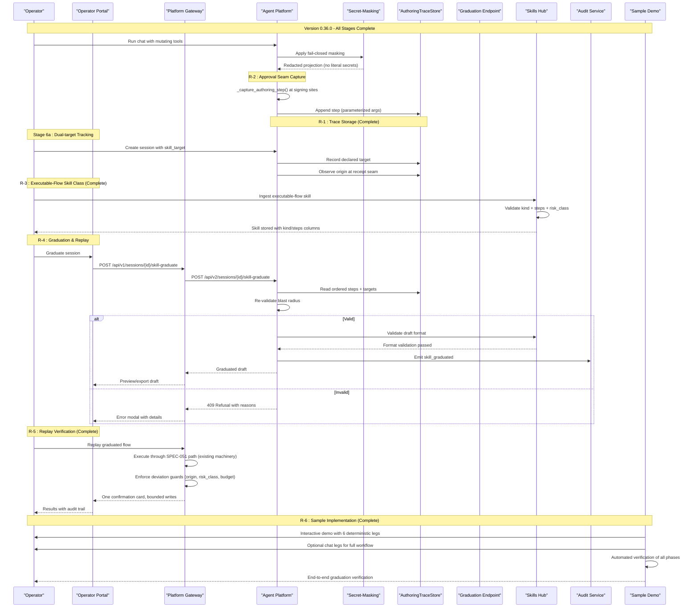

**Diagram sources**
- [plan.md:349-373](file://docs/specs/SPEC-055-develop-as-you-go-skill-graduation/plan.md#L349-L373)
- [tasks.md:10-102](file://docs/specs/SPEC-055-develop-as-you-go-skill-graduation/tasks.md#L10-L102)

## Detailed Component Analysis

### AuthoringTraceStore (R-1) - DELIVERED
**Updated** The AuthoringTraceStore implementation is now complete with comprehensive dual-backend support and extensive test coverage.

- **Protocol and backends**: Mirrors existing patterns (execution_records/confirmation_records) with InMemory and Postgres implementations and a build_*_store factory. Both backends expose identical schema fields to avoid silent drops in production. The factory supports AGENT_STATE_STORE_BACKEND selection with automatic fallback from Postgres to InMemory when unavailable.
- **Step record**: Ordered position, canonical tool name, secret-safe parameterized arguments (credential values replaced by placeholders/credential-set references), and references to originating execution_id/confirm_id. Deep copying ensures captured arguments remain immutable even if the source tool call is mutated later.
- **Lifecycle and retention**: draft → graduated | discarded; retention independent of 30-day execution sweep. Keyed by session_id with a per-session step cap configurable via AGENT_AUTHORING_TRACE_MAX_STEPS (default: 100). Idle traces older than AGENT_AUTHORING_TRACE_IDLE_DAYS (default: 180) are reclaimed by background sweep.
- **Concurrency safety**: Postgres backend uses transaction-scoped advisory locks to prevent race conditions between append and close operations. The lock is scoped per session using CRC32 hash of session_id within a fixed class namespace.
- **Configuration validation**: RuntimeSettings validates AGENT_AUTHORING_TRACE_MAX_STEPS >= 1 and AGENT_AUTHORING_TRACE_IDLE_DAYS >= 0, providing operator-facing configuration guarantees.

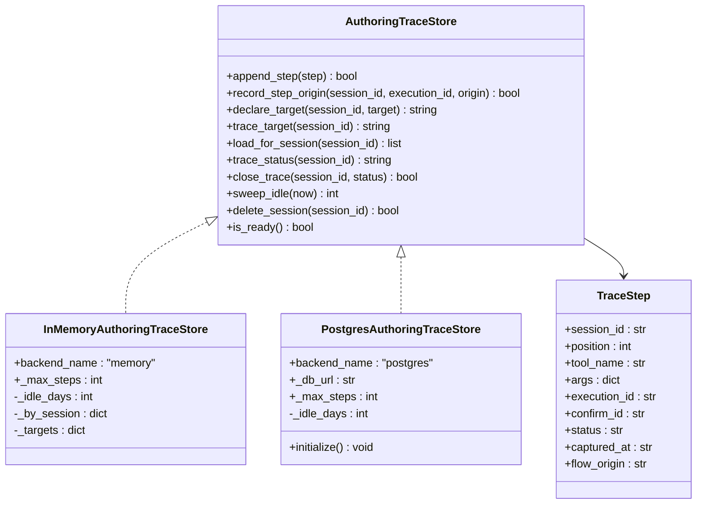

**Diagram sources**
- [authoring_trace.py:107-127](file://products/agent-platform/src/agent_service/services/authoring_trace.py#L107-L127)
- [authoring_trace.py:134-246](file://products/agent-platform/src/agent_service/services/authoring_trace.py#L134-L246)
- [authoring_trace.py:448-606](file://products/agent-platform/src/agent_service/services/authoring_trace.py#L448-L606)

**Section sources**
- [authoring_trace.py:107-127](file://products/agent-platform/src/agent_service/services/authoring_trace.py#L107-L127)
- [authoring_trace.py:134-246](file://products/agent-platform/src/agent_service/services/authoring_trace.py#L134-L246)
- [authoring_trace.py:448-606](file://products/agent-platform/src/agent_service/services/authoring_trace.py#L448-L606)
- [test_authoring_trace.py:73-257](file://products/agent-platform/tests/test_authoring_trace.py#L73-L257)
- [test_authoring_trace.py:325-568](file://products/agent-platform/tests/test_authoring_trace.py#L325-L568)

### Capture at Approval Seam (R-2) - DELIVERED
**DELIVERED** The approval seam capture implementation is now fully operational with comprehensive authoring-trace capture mechanism, secret parameterization system, and enhanced session lifecycle management.

- **Dual signing site integration**: The `_capture_authoring_step()` method is called at both per-action approval site (`_prepare_executions`) and flow-unlock signing site (`_sign_flow_execution`), ensuring mixed sessions yield one coherent ordered trace.
- **Best-effort error handling**: All capture operations use try-catch blocks with warning logs, ensuring trace failures degrade gracefully to "no graduation candidate" without blocking execution or receipts.
- **Secret parameterization**: Uses `parameterize_for_trace()` function from secret_params module to replace credential values with `<credential-reference>` placeholders before storing in the trace store.
- **Reference-only storage**: Stores only `execution_id` and `confirm_id` references rather than duplicating receipts, maintaining separation of concerns between execution records and authoring traces.
- **Timing precision**: Captures steps after execution requests are persisted, ensuring tamper evidence exists before derived trace is attempted.

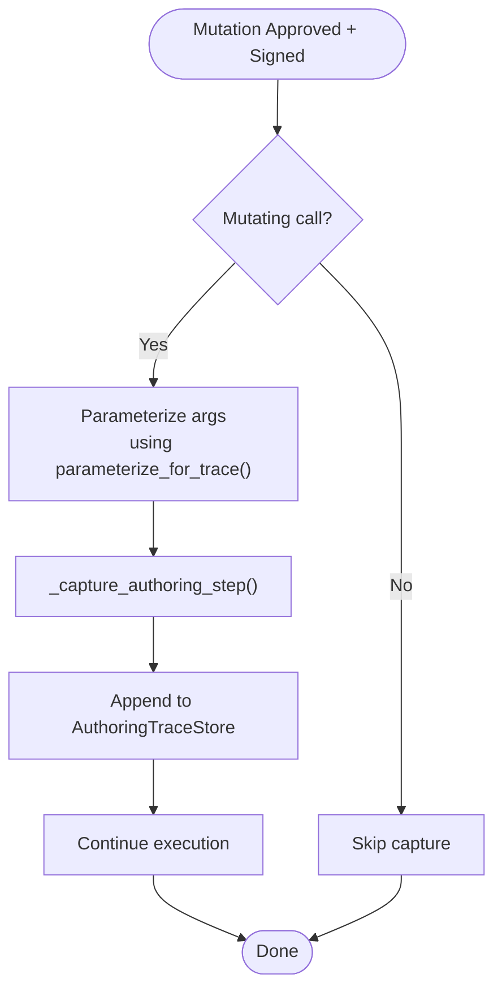

**Diagram sources**
- [plan.md:232-253](file://docs/specs/SPEC-055-develop-as-you-go-skill-graduation/plan.md#L232-L253)
- [tasks.md:47-57](file://docs/specs/SPEC-055-develop-as-you-go-skill-graduation/tasks.md#L47-L57)

**Section sources**
- [plan.md:232-253](file://docs/specs/SPEC-055-develop-as-you-go-skill-graduation/plan.md#L232-L253)
- [tasks.md:47-57](file://docs/specs/SPEC-055-develop-as-you-go-skill-graduation/tasks.md#L47-L57)
- [runtime_kernel.py:1352-1411](file://products/agent-platform/src/agent_service/runtime_kernel.py#L1352-L1411)
- [secret_params.py:265-288](file://products/agent-platform/src/agent_service/services/secret_params.py#L265-L288)

### Executable-Flow Skill Class (R-3) - DELIVERED
**Updated** The Executable-Flow Skill Class implementation is now complete with comprehensive kind discriminator support, steps list validation, and enhanced credential handling.

- **Schema Extension**: Additive extension to skill.schema.json introducing `kind` discriminator ("knowledge" or "executable_flow") and `steps` array for machine-readable replay sequences. Existing knowledge/guidance skills validate unchanged.
- **Risk Class Decoupling**: `risk_class` accepted without `web_target` so non-browser mutating skills can declare write intent. The former "requires web_target" rule is relaxed for executable-flow skills.
- **Ingestion Validation**: Validates step-list shape, ensures declared `risk_class: write` matches mutating steps, verifies credential-set references resolve to named sets, and enforces resource limits (MAX_STEPS=200, MAX_STEPS_BYTES=65536).
- **Database Schema**: Extended with `kind TEXT` and `steps JSONB` columns supporting both knowledge and executable-flow skills. Idempotent ALTER statements ensure backward compatibility.
- **Credential Validation**: Enforces that credential values are credential-set references (never literals), with special handling for `web.fill_credential` tool requiring both `credential_set` and `field` parameters.

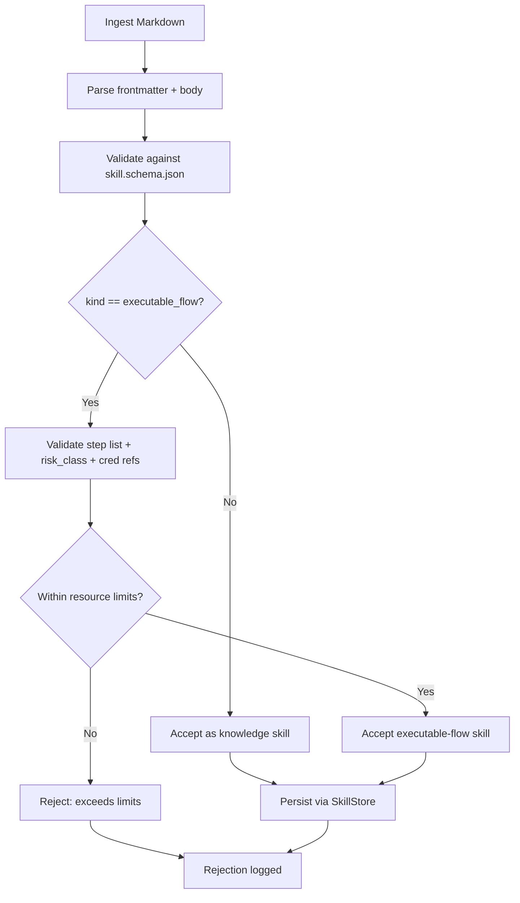

**Diagram sources**
- [plan.md:255-272](file://docs/specs/SPEC-055-develop-as-you-go-skill-graduation/plan.md#L255-272)
- [tasks.md:59-69](file://docs/specs/SPEC-055-develop-as-you-go-skill-graduation/tasks.md#L59-L69)

**Section sources**
- [plan.md:255-272](file://docs/specs/SPEC-055-develop-as-you-go-skill-graduation/plan.md#L255-272)
- [tasks.md:59-69](file://docs/specs/SPEC-055-develop-as-you-go-skill-graduation/tasks.md#L59-L69)
- [skill.schema.json:80-111](file://shared/shared-contracts/schemas/skill.schema.json#L80-L111)
- [skill.py:15-66](file://products/skills-hub/src/skills_hub/schemas/skill.py#L15-L66)
- [ingestion.py:375-460](file://products/skills-hub/src/skills_hub/services/ingestion.py#L375-L460)
- [skill_store.py:158-200](file://products/skills-hub/src/skills_hub/services/skill_store.py#L158-L200)

### Dual-target Tracking Infrastructure (Stage 6a) - DELIVERED
**DELIVERED** The dual-target tracking infrastructure provides the foundation for blast-radius validation by capturing both declared targets (authorization scopes) and observed origins (evidence of where mutations actually landed).

- **Declared Target Tracking**: Captures the web target the operator names when opening a develop-as-you-go session, declared *before* any mutations occur. This serves as the authorization scope that the session acts under. Stored in `authoring_trace_target` table with first-wins semantics to prevent retroactive scope changes.
- **Observed Origin Tracking**: Records the origin the gateway reported each captured mutation actually landed on, captured automatically at the receipt seam after successful browser writes. Stored in `flow_origin` column on each trace step, with first-observation-wins semantics to prevent later frames from rewriting what was seen.
- **Automatic Origin Observation**: Integrated into `_observe_step_origin()` method in runtime kernel, called after `save_receipt()` to ensure tamper evidence exists before origin recording. Scoped to `BROWSER_WRITE_TOOLS` and only records for `succeeded` results to prevent failed attempts from counting toward graduation.
- **Session Creation with skill_target**: Enhanced session creation endpoint accepts optional `skill_target` parameter during session creation, allowing operators to declare the development target upfront. The declaration is validated and normalized before the session exists, preventing half-created sessions from being left behind on validation failures.
- **Gateway Integration**: Comprehensive platform-gateway integration with `POST /api/v1/sessions/{session_id}/skill-target` endpoint for post-creation target declaration, policy enforcement through `ACTION_SESSION_SKILL_GRADUATE`, and proper error handling with 4xx/5xx mapping.
- **Target Normalization and Scoping**: Implements `skill_target_scope()` function to reduce declared targets to origin and path (dropping query, fragment, and userinfo), ensuring sensitive data like credentials don't persist in long-lived stores while preserving the actual replay binding scope.

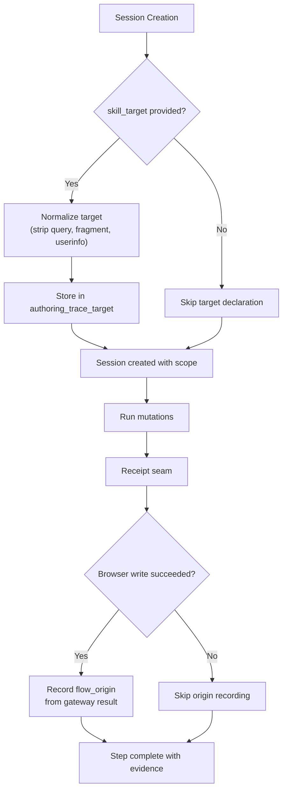

**Diagram sources**
- [authoring_trace.py:87-151](file://products/agent-platform/src/agent_service/services/authoring_trace.py#L87-L151)
- [runtime_kernel.py:1738-1759](file://products/agent-platform/src/agent_service/runtime_kernel.py#L1738-L1759)
- [sessions.py:189-221](file://products/platform-gateway/src/platform_gateway/api/routes/sessions.py#L189-L221)

**Section sources**
- [authoring_trace.py:87-151](file://products/agent-platform/src/agent_service/services/authoring_trace.py#L87-L151)
- [authoring_trace.py:531-579](file://products/agent-platform/src/agent_service/services/authoring_trace.py#L531-L579)
- [runtime_kernel.py:1738-1759](file://products/agent-platform/src/agent_service/runtime_kernel.py#L1738-L1759)
- [sessions.py:189-221](file://products/platform-gateway/src/platform_gateway/api/routes/sessions.py#L189-L221)
- [gateway_service.py:331-337](file://products/platform-gateway/src/platform_gateway/services/gateway_service.py#L331-L337)
- [test_documents_repository.py:562-584](file://products/platform-gateway/tests/test_documents_repository.py#L562-L584)

### Graduation Endpoint (R-4) - DELIVERED
**DELIVERED** The Stage 6b (R-4) graduation endpoint implementation provides deterministic skill graduation with comprehensive blast-radius validation and frontend integration.

- **Endpoint Implementation**: POST /api/v2/sessions/{session_id}/skill-graduate endpoint with proper authorization, ownership verification, and comprehensive error handling. The endpoint enforces `session:skill_graduate` policy action and validates session ownership server-side.
- **Blast-Radius Re-validation**: Sophisticated validation logic that re-applies replay-time guards at graduation: step budget checks, origin allowlist verification, write-class consistency validation, credential resolution verification, and secret literal detection. Each guard failure produces detailed, actionable error messages.
- **Deterministic Draft Generation**: Renders executable-flow skill drafts deterministically from captured traces without LLM synthesis. The draft includes provenance information, step-by-step runbook, and metadata for human review and Git repository merging.
- **Skills Hub Integration**: Validates generated drafts against skills-hub ingestion rules to ensure compatibility before returning to operators. Failed validation returns 502 errors indicating platform faults rather than operator errors.
- **Frontend Integration**: Complete operator portal integration with GraduateAsSkillButton component, error handling for various HTTP status codes (409 refusals, 403 authorization failures, 404 session not found, 503 service unavailable, 502 validation failures), and graduated skill preview modal with download capabilities.
- **Audit Logging**: Comprehensive audit event emission with skill_graduated event type, including mode, step_count, web_target, declaration timing, and graduated_now flags for idempotent re-exports.

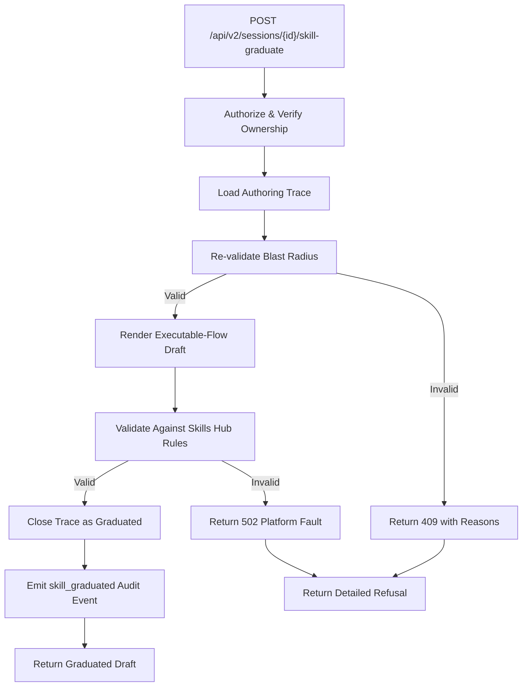

**Diagram sources**
- [routes.py:1246-1390](file://products/agent-platform/src/agent_service/api/v2/routes.py#L1246-L1390)
- [skill_graduation.py:217-497](file://products/agent-platform/src/agent_service/services/skill_graduation.py#L217-L497)

**Section sources**
- [routes.py:1246-1390](file://products/agent-platform/src/agent_service/api/v2/routes.py#L1246-L1390)
- [skill_graduation.py:217-497](file://products/agent-platform/src/agent_service/services/skill_graduation.py#L217-L497)
- [skill_graduation.py:587-763](file://products/agent-platform/src/agent_service/services/skill_graduation.py#L587-L763)
- [test_skill_graduation.py:1459-1481](file://products/agent-platform/tests/test_skill_graduation.py#L1459-L1481)

### One-Gate Replay (R-5) - DELIVERED
**DELIVERED** Stage 7 (R-5) verification is now complete, proving that graduated flow replay functionality works through existing SPEC-051 browser-flow path without requiring new executor or approval mechanisms.

- **Indistinguishability Proven**: Comprehensive tests demonstrate that graduated executable flows bind and replay identically to hand-authored flows through the existing SPEC-051 path (`_observe_flow_binding` → `_record_flow_approval` → `_sign_flow_execution` → `build_flow_request`). No new executor, envelope variant, or guard is needed.
- **Gateway Deviation Guard Validation**: Verified that gateway deviation guards (origin allowlist, declared risk_class, step budget) bound replayed executable-flow writes identically to hand-authored flows. Executable-flow writes join no auto-allow list and fail closed when past budget or off-allowlist.
- **Security Guard Enhancement**: Enhanced runtime kernel security guards for flow execution signing scope boundaries. Added first-position, unconditional `BROWSER_WRITE_TOOLS` guard in `_sign_flow_execution` to prevent non-browser tools from exploiting browser flow authority.
- **Credential Resolution**: Verified credentials resolve at replay from named credential sets via `web.fill_credential` references — never literals. Read-tier `web.fill_credential` shares write tier's step accounting conservatively.
- **Execution Runtime Verify-Only**: Confirmed execution-runtime is verify only — a browser replay envelope (`approval_kind: "flow"`) verifies and forwards unchanged. No modifications needed to execution-runtime.
- **Non-Browser Fallback Asserted**: Infra (non-browser) executable-flow binding is deferred to OQ-2. Without `web_target`, `kind: executable_flow` binds nothing, so each infra step parks per-action under SPEC-054 R-2 with no flow authority armed.
- **Portal Surfacing**: Verified portal renders replay surfacing with flow headline + change-request framing. Multi-call batches yield exactly one Approve/Deny pair, not N decisions about N DOM actions.

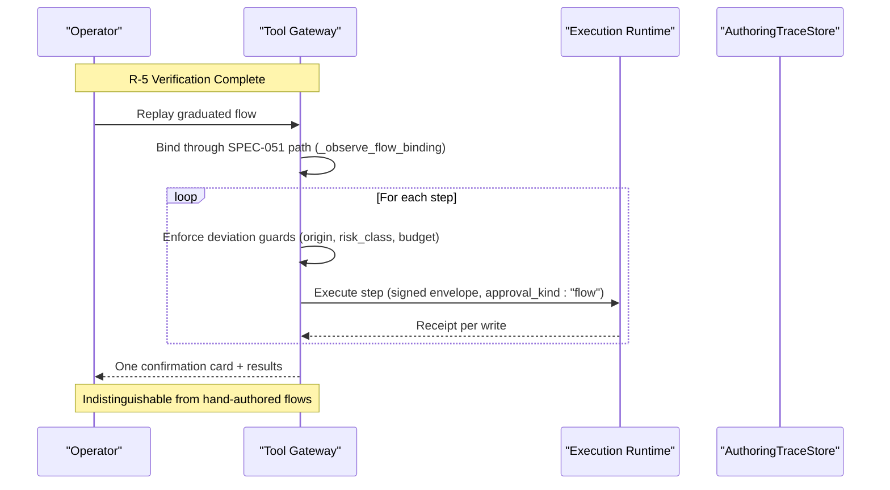

**Diagram sources**
- [test_browser_connector.py:2159-2358](file://products/tool-gateway/tests/test_browser_connector.py#L2159-L2358)
- [test_runtime_kernel.py:2709-2908](file://products/agent-platform/tests/test_runtime_kernel.py#L2709-L2908)
- [browser_connector.py:514-535](file://products/tool-gateway/src/tool_gateway/tools/browser_connector.py#L514-L535)

**Section sources**
- [plan.md:299-318](file://docs/specs/SPEC-055-develop-as-you-go-skill-graduation/plan.md#L299-L318)
- [tasks.md:86-96](file://docs/specs/SPEC-055-develop-as-you-go-skill-graduation/tasks.md#L86-L96)
- [tasks.md:524-699](file://docs/specs/SPEC-055-develop-as-you-go-skill-graduation/tasks.md#L524-L699)
- [test_browser_connector.py:2159-2358](file://products/tool-gateway/tests/test_browser_connector.py#L2159-L2358)
- [test_runtime_kernel.py:2709-2908](file://products/agent-platform/tests/test_runtime_kernel.py#L2709-L2908)

### Approval-Seam Secret-Masking Hardening (R-7) - DELIVERED
**CRITICAL SECURITY ENHANCEMENT - FULLY DELIVERED**

**Critical security enhancement addressing fundamental gaps in the action approval workflow where raw secret-bearing parameters could persist in plaintext across multiple system surfaces.**

- **Fail-closed projection masking**: Closes the `_generic_fields` fail-open path so generically-named secrets (off-vocabulary keys) are masked rather than projected as plaintext. Uses conservative masking when redaction vocabulary cannot positively classify a value as non-secret.
- **KNOWN_SAFE_FIELDS Allow-List**: Implements explicit allow-list of safe fields that may render verbatim (`k8s.delete_pod.name`, `web.select.value`, `web.fill_credential.credential_set`, etc.), ensuring only explicitly whitelisted fields bypass masking.
- **Raw Parameter Redaction**: Applies the same fail-closed posture to raw `parameters` that ride alongside the projection on the confirmation frame and durable record, preventing secret exposure even when not part of the curated projection.
- **Signed-Execution Invariant Preservation**: Redaction operates purely as a projection layer - the `canonical_digest(parameters)` inputs forming the signed `args_digest` remain unchanged, so resume-time digest verification and signing are unaffected.
- **Bounded Persisted-Record Exposure**: The persisted `pending_calls` retains only what the signed-execution mechanism requires; secret-bearing values that must persist raw for signing are bounded by reference-only floor and never additionally echoed into display surfaces.
- **Reference-Only Credential Entry Enforcement**: `web.fill_credential` remains the only path introducing secrets into browser flows, extending the same discipline to non-browser action parameters as defense-in-depth.

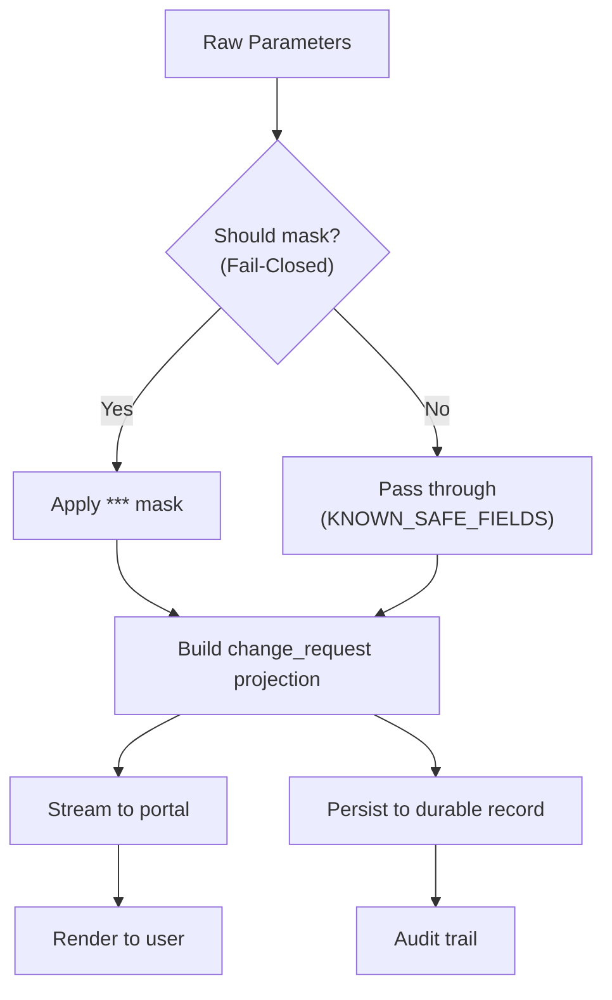

**Diagram sources**
- [plan.md:331-347](file://docs/specs/SPEC-055-develop-as-you-go-skill-graduation/plan.md#L331-L347)
- [tasks.md:19-31](file://docs/specs/SPEC-055-develop-as-you-go-skill-graduation/tasks.md#L19-L31)

**Section sources**
- [plan.md:331-347](file://docs/specs/SPEC-055-develop-as-you-go-skill-graduation/plan.md#L331-L347)
- [tasks.md:19-31](file://docs/specs/SPEC-055-develop-as-you-go-skill-graduation/tasks.md#L19-L31)

### Interactive Sample Implementation (R-6) - DELIVERED
**DELIVERED** The Stage 8 (R-6) sample implementation provides comprehensive end-to-end verification of the complete skill graduation lifecycle through interactive demo script and walkthrough guide.

- **Four-Act Workflow**: Demonstrates the complete graduation process: Author (ad hoc against declared target), Graduate (trace becomes executable-flow draft), Merge (human reviews and merges draft), Replay (same work behind one gate). Each act exercises different aspects of the graduation pipeline.
- **Six Deterministic Legs**: Automated verification covering prerequisites (browser connector, HITL bridging, SPEC-055 knobs), admin portal pages, credential set loading, tool discovery, target declaration behavior, and graduation posture. These legs run without model interaction and provide baseline validation.
- **Optional Chat Legs**: Full end-to-end demonstration with RUN_CHAT_LEG=true flag, exercising the complete author → graduate → merge → replay story with real model interactions and approval workflows.
- **Interactive Walkthrough**: Comprehensive step-by-step guide covering operator portal usage, session creation with skill_target declaration, ad hoc authoring with per-action cards, graduation process, manual merge steps, and replay verification.
- **Comprehensive Assertions**: Each leg includes detailed assertions for expected behavior, error handling, and state validation. Tests cover edge cases like observer denial, empty trace refusal, target normalization, and credential scoping.
- **Cleanup and Safety**: Automatic cleanup of temporary resources including graduated skills from ConfigMap, throwaway sessions, and scratch files. Supports KEEP_GRADUATED_SKILL=true for keeping artifacts for inspection.

**Post-Delivery Fixes Applied**: Three defects identified during dev-k8s browser live check were resolved:
1. **Login Flow SSO Auto-Login Handling**: Fixed prompt asking model to click "Sign in" which conflicts with legacy-SSO auto-login that hides form within 100ms. Updated prompts to let page redirect itself naturally.
2. **Service Availability Retry Logic**: Added bounded retry logic for 502/503 errors when skills-hub service endpoints are still propagating after restart, mirroring inventory retry behavior.
3. **Portal Access Documentation**: Corrected OIDC redirect URI documentation to specify canonical origin `https://aiops.luban.metasync.cc` instead of localhost port-forward, explaining why sign-in round-trips only work on the configured origin.

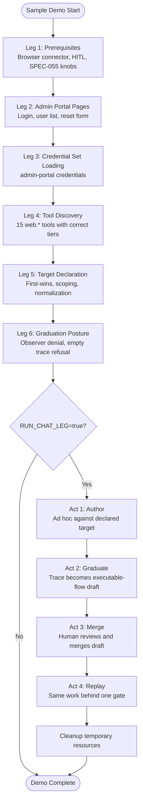

**Diagram sources**
- [demo.sh:1-800](file://samples/web-checks/skill-graduation/demo/demo.sh#L1-L800)
- [README.md:55-91](file://samples/web-checks/skill-graduation/README.md#L55-L91)
- [WALKTHROUGH.md:1-426](file://samples/web-checks/skill-graduation/WALKTHROUGH.md#L1-L426)

**Section sources**
- [README.md:1-233](file://samples/web-checks/skill-graduation/README.md#L1-L233)
- [WALKTHROUGH.md:1-426](file://samples/web-checks/skill-graduation/WALKTHROUGH.md#L1-L426)
- [demo.sh:1-800](file://samples/web-checks/skill-graduation/demo/demo.sh#L1-L800)

## Implementation Strategy
SPEC-055 follows a structured eight-stage implementation approach that builds incrementally while maintaining backward compatibility and security invariants. All stages are now complete with comprehensive testing and version lockstep enforcement at 0.36.0.

### Stage 1: Contracts (Foundation) ✓ DELIVERED
- Advanced skill.schema.json from v1 to v2 with additive executable-flow support including `kind` discriminator and `steps` array
- Added skill_graduated audit event type with detailed payload structure (session_id, mode, validation, step_count)
- Introduced session:skill_graduate policy action with appropriate role bindings (platform-admin, approver, operator)
- Implemented comprehensive lockstep validation ensuring bidirectional parity between schemas and consumers
- Verified execution-runtime requires no changes (verify-only approach)

### Stage 2: Agent Platform - R-7 Secret Masking ✓ DELIVERED
- **Implemented KNOWN_SAFE_FIELDS allow-list** for per-tool field whitelisting with explicit safe fields: `k8s.delete_pod.name`, `k8s.delete_pod.namespace`, `web.select.value`, `web.fill_credential.credential_set`, `web.fill_credential.field`, `web.press_key.key`, `web.upload_file.filename`
- **Flipped should_mask to fail-closed posture** (mask-unless-known-safe) ensuring all fields are masked unless explicitly whitelisted
- **Implemented raw parameter redaction** in place for action-card entries beside change_request projection, preventing secret exposure in both stream and persistent records
- **Updated portal presentation** to present change_request projection instead of raw parameters, ensuring consistent masking across all surfaces
- **Comprehensive test coverage** added for secret masking behavior, signed-execution invariant preservation, and fail-closed behavior

### Stage 3: Agent Platform - R-1 Authoring Trace Store ✓ DELIVERED
- **Created AuthoringTraceStore protocol** with InMemory and Postgres backends implementing identical interfaces
- **Implemented InMemoryAuthoringTraceStore** with thread-safe session-scoped storage, deep copying for argument immutability, and configurable step caps and idle GC
- **Implemented PostgresAuthoringTraceStore** with transactional operations, advisory locking for concurrency safety, and JSONB storage for flexible arguments
- **Added comprehensive runtime configuration** via AGENT_AUTHORING_TRACE_MAX_STEPS (default: 100) and AGENT_AUTHORING_TRACE_IDLE_DAYS (default: 180) with validation and graceful degradation
- **Established lifecycle management** supporting draft → graduated | discarded transitions with terminal state enforcement
- **Built extensive test coverage** validating field parity between backends, concurrent access safety, idle GC behavior, and configuration validation

### Stage 4: Agent Platform - R-2 Approval Seam Capture ✓ DELIVERED
- **Implemented `_capture_authoring_step()` method** in runtime_kernel.py called at both per-action and flow-unlock signing sites
- **Integrated secret parameterization** using `parameterize_for_trace()` function from secret_params module
- **Added best-effort error handling** with try-catch blocks ensuring trace failures never block execution or receipts
- **Established reference-only storage** pattern storing only execution_id and confirm_id references
- **Enhanced session lifecycle management** with proper timing and ordering guarantees

### Stage 5: Skills Hub - R-3 Executable-Flow Skill Class ✓ DELIVERED
- **Extended skill.schema.json** with additive `kind` discriminator and `steps` array for executable-flow skills
- **Implemented comprehensive ingestion validation** for executable-flow skills including step-list shape, risk_class requirements, and credential-set reference validation
- **Extended database schema** with `kind TEXT` and `steps JSONB` columns supporting both knowledge and executable-flow skills
- **Added resource limits** (MAX_STEPS=200, MAX_STEPS_BYTES=65536) to prevent abuse while allowing reasonable flow complexity
- **Implemented credential validation** ensuring credential values are references (never literals) with special handling for `web.fill_credential` tool
- **Built comprehensive test coverage** for all validation scenarios including valid documents, malformed inputs, and edge cases

### Stage 6a: Dual-target Tracking Infrastructure ✓ DELIVERED
- **Implemented declared target tracking** with `authoring_trace_target` table storing authorization scopes declared before mutations
- **Added observed origin tracking** with `flow_origin` column on trace steps capturing where mutations actually landed
- **Integrated automatic origin observation** at receipt seam through `_observe_step_origin()` method
- **Enhanced session creation** with optional `skill_target` parameter for upfront target declaration
- **Added comprehensive gateway integration** with policy enforcement and proper error handling
- **Implemented target normalization** through `skill_target_scope()` function to strip sensitive data while preserving replay binding scope

### Stage 6b: Graduation Endpoint (R-4) ✓ DELIVERED
- **Implemented deterministic build_executable_flow_draft function** with no LLM synthesis, producing reproducible drafts from captured traces
- **Added comprehensive blast-radius re-validation** before draft production, checking step budgets, origin allowlists, credential resolution, and secret literal detection
- **Created graduation endpoint** POST /api/v2/sessions/{session_id}/skill-graduate with proper authorization, validation, and audit logging
- **Implemented frontend enhancements** for graduated skill preview with error handling for various HTTP status codes and download capabilities
- **Added configuration support** via AGENT_SKILL_GRADUATION_MAX_STEPS environment variable with default value of 20, matching the gateway's replay budget
- **Established comprehensive error handling** with detailed refusal messages that name specific guard failures and responsible steps

### Stage 7: Multi-Service - R-5 Replay ✓ DELIVERED
- **Verified browser executable flows bind and one-gate through existing SPEC-051 machinery** without new executor or approval mechanisms
- **Confirmed gateway deviation guards apply to replayed writes** with identical behavior to hand-authored flows
- **Asserted infra executable flows park per-action** (safe fallback until OQ-2) with no flow authority armed
- **Enhanced runtime kernel security guards** with BROWSER_WRITE_TOOLS enforcement in `_sign_flow_execution`
- **Updated portal to surface replay information** with flow headline + change-request framing
- **Expanded browser connector tool surface** with additional web interaction capabilities from SPEC-050

### Stage 8: Samples and Verification (R-6) ✓ DELIVERED
- **Created interactive graduation demo** under `samples/web-checks/skill-graduation/` demonstrating complete end-to-end workflow
- **Implemented comprehensive automated testing** with six deterministic legs and four optional chat legs following ADR-0008 exercised-sample rule
- **Developed detailed walkthrough guide** covering operator portal usage, session creation, ad hoc authoring, graduation process, manual merge steps, and replay verification
- **Established cleanup procedures** for temporary resources including graduated skills, throwaway sessions, and scratch files
- **Added comprehensive assertions** for each phase of the graduation workflow including prerequisite validation, tool discovery, target declaration, and graduation posture
- **Provided configuration guidance** for adapting the sample to different targets and environments

**Post-Delivery Sample Enhancements**: Applied fixes for dev-k8s browser live check defects including login flow SSO auto-login handling, service availability retry logic, and portal access documentation improvements.

**Section sources**
- [plan.md:349-373](file://docs/specs/SPEC-055-develop-as-you-go-skill-graduation/plan.md#L349-373)
- [tasks.md:10-102](file://docs/specs/SPEC-055-develop-as-you-go-skill-graduation/tasks.md#L10-102)

## Dependency Analysis
The implementation follows strict dependency ordering with clear separation between products and phases. All dependencies are now complete with comprehensive testing and version lockstep enforcement.

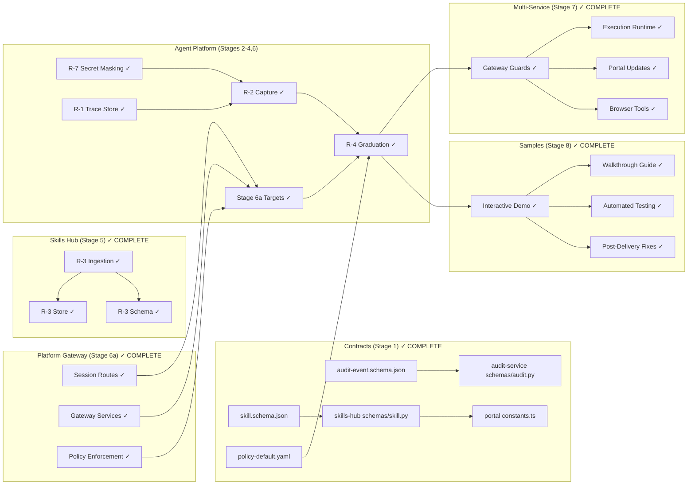

**Diagram sources**
- [plan.md:349-373](file://docs/specs/SPEC-055-develop-as-you-go-skill-graduation/plan.md#L349-373)

**Section sources**
- [plan.md:349-373](file://docs/specs/SPEC-055-develop-as-you-go-skill-graduation/plan.md#L349-373)

## Performance Considerations
- **Dual-backend stores**: **Enhanced** - Both InMemory and Postgres backends implement identical schemas with comprehensive test coverage ensuring field parity. Postgres backend uses JSONB for efficient argument storage and indexing strategies for query performance.
- **Bounded traces**: Enforce per-session step caps to prevent unbounded growth of authoring traces. Default limit of 100 steps per session provides reasonable capacity while preventing abuse.
- **Best-effort capture**: Trace-store failures should not block execution; degrade gracefully to "no graduation candidate." Postgres backend automatically falls back to InMemory when database is unreachable.
- **Credential resolution**: Resolve credentials at replay time from named sets to keep skills shareable and avoid secret leakage.
- **Search and storage**: Leverage existing indexing strategies (e.g., GIN indexes) for skill catalog queries when integrating executable-flow metadata.
- **Secret-masking performance**: **Enhanced** - Fail-closed masking adds minimal overhead through vocabulary lookups but prevents catastrophic secret exposure; the constant-time substring matching is negligible compared to I/O operations. The KNOWN_SAFE_FIELDS allow-list provides O(1) lookup performance for safe fields.
- **Graduation determinism**: No LLM calls during graduation ensure predictable performance and reproducibility.
- **Replay efficiency**: One-gate replay minimizes confirmation overhead while maintaining per-write signing and auditing.
- **Lockstep validation overhead**: Bidirectional parity tests add minimal CI time but prevent schema drift across services.
- **Idle GC optimization**: Background sweep processes limited to 50 sessions per run to prevent long-running cleanup operations from impacting service performance.
- **Advisory locking**: Transaction-scoped PostgreSQL advisory locks provide fine-grained concurrency control without blocking unrelated operations.
- **Capture overhead**: **New** - Approval seam capture adds minimal overhead through parameterization and best-effort store writes; failures are logged but never block execution paths.
- **Executable-flow storage**: **New** - JSONB storage for steps provides efficient serialization/deserialization with PostgreSQL native JSON operations. Indexing strategies optimized for skill catalog queries.
- **Resource limits**: **New** - MAX_STEPS (200) and MAX_STEPS_BYTES (65536) prevent abuse while allowing reasonable flow complexity. Limits positioned above typical usage patterns to avoid false positives.
- **Target tracking overhead**: **New** - Dual-target tracking adds minimal overhead through additional database writes and URL parsing operations. First-wins semantics prevent redundant updates. Origin observation is scoped to browser write tools and only runs for successful results.
- **Graduation endpoint overhead**: **New** - Blast-radius validation performs comprehensive checks on captured traces with minimal overhead. Deterministic draft generation avoids expensive LLM calls while ensuring output quality.
- **R-5 Replay overhead**: **New** - Replay through existing SPEC-051 machinery adds no new executor overhead. Gateway deviation guards perform lightweight origin/risk_class/budget checks. Browser connector tools inherit existing guard performance characteristics.
- **Sample demo overhead**: **New** - Interactive demo script provides comprehensive verification with minimal overhead through deterministic assertions and efficient cleanup procedures. Six deterministic legs run quickly without model interaction, while optional chat legs provide full end-to-end verification when needed.

## Troubleshooting Guide
- **Graduation refusal**: If blast-radius re-validation fails (step budget exceeded, off-allowlist target, inconsistent risk_class, unresolved credentials), the operation deterministically refuses and surfaces the reason to the operator.
- **Missing capture**: If trace capture fails, the session cannot be graduated but execution continues unaffected; verify capture seam and store health.
- **Schema mismatches**: Ensure executable-flow fields exist on both InMemory and Postgres backends; otherwise, fields may be silently dropped in production.
- **Audit gaps**: Confirm new policy action and audit event types are configured and emitted during graduation.
- **Secret-masking issues**: **Updated** - If secrets appear in projections despite masking rules, verify the secret vocabulary alignment between agent-platform and tool-gateway modules, check that opaque-value fields are properly configured, and ensure the fail-closed masking path is active for off-vocabulary keys. The KNOWN_SAFE_FIELDS allow-list should be reviewed to ensure it contains only truly safe fields.
- **Trace store failures**: Monitor for best-effort degradation patterns; trace failures should log warnings but never block execution. Postgres backend automatically falls back to InMemory when database connection fails.
- **Replay deviations**: Check gateway deviation guards for origin allowlist, risk_class consistency, and step budget compliance.
- **Sample verification**: Use the interactive graduation demo to validate end-to-end functionality and identify integration issues.
- **Lockstep validation failures**: When make verify fails due to schema mismatches, check that all consumer services have been updated to match the shared schema changes.
- **R-7 Specific Issues**: **New** - If masking appears too aggressive or too lenient, review the KNOWN_SAFE_FIELDS allow-list configuration. Test cases verify that fail-closed behavior masks all fields except those explicitly whitelisted.
- **Authoring Trace Store Issues**: **New** - If trace capture fails unexpectedly, check AGENT_AUTHORING_TRACE_MAX_STEPS configuration limits and verify that the trace hasn't reached its step cap. Monitor idle GC settings (AGENT_AUTHORING_TRACE_IDLE_DAYS) to ensure traces aren't being reclaimed prematurely. Check backend availability and connection status using the is_ready() method.
- **PostgreSQL Concurrency Issues**: **New** - Advisory locks are used to prevent race conditions between append and close operations. If experiencing deadlocks or performance issues, verify that transactions are properly scoped and committed. The lock class (5501) is namespaced specifically for authoring traces to avoid conflicts with other advisory users.
- **Approval Seam Capture Issues**: **New** - If captures are missing from traces, verify that both signing sites (`_prepare_executions` and `_sign_flow_execution`) are calling `_capture_authoring_step()`. Check that the mutation tier gate correctly identifies write-tier calls and that secret parameterization is working properly. Review logs for any capture failures that might be degrading to "no graduation candidate."
- **Executable-Flow Skill Issues**: **New** - If executable-flow skills fail to ingest, check that the `kind` field is set to "executable_flow" and that the `steps` array contains valid tool invocations. Verify that credential values are references (not literals) and that `web.fill_credential` tools include both `credential_set` and `field` parameters. Review resource limits (MAX_STEPS, MAX_STEPS_BYTES) if skills are being rejected for size.
- **Database Schema Migration Issues**: **New** - If skills table migration fails, verify that idempotent ALTER statements are executing correctly. Check that `kind` and `steps` columns are properly created with correct data types (TEXT and JSONB respectively). Ensure existing rows maintain NULL values for these columns to preserve backward compatibility.
- **Dual-target Tracking Issues**: **New** - If target declarations are not persisting, check that the `authoring_trace_target` table exists and that first-wins semantics are working correctly. Verify that origin observations are only recorded for successful browser writes and that the receipt seam is properly wired. Check that target normalization is stripping sensitive data (query strings, fragments, userinfo) while preserving origin and path.
- **Gateway Integration Issues**: **New** - If skill target endpoints are not accessible, verify that the platform-gateway routes are properly configured and that policy enforcement is allowing the required actions. Check that error handling maps 4xx/5xx responses correctly and that the session creation endpoint properly handles skill_target parameters.
- **Graduation Endpoint Issues**: **New** - If graduation requests fail, check the specific HTTP status code: 409 indicates blast-radius validation failures with detailed reasons, 403 indicates authorization issues, 404 indicates session not found or expired, 503 indicates skills service not configured, and 502 indicates platform validation failures. Review the detailed error messages which name specific guard failures and responsible steps.
- **Configuration Issues**: **New** - Verify AGENT_SKILL_GRADUATION_MAX_STEPS is set appropriately (default 20) and matches the gateway's GATEWAY_BROWSER_FLOW_MAX_STEPS setting. Check that skills service URLs and authentication are properly configured for graduation validation.
- **R-5 Replay Issues**: **New** - If graduated flows don't replay correctly, verify they bind through existing SPEC-051 path and collapse to one confirmation card. Check that gateway deviation guards enforce origin allowlist, risk_class, and step budget. Ensure credentials resolve from named credential sets and that execution-runtime forwards approval_kind unchanged. For infra executable flows, verify per-action parking behavior and absence of flow authority.
- **Sample Demo Issues**: **New** - If the interactive demo fails, check that prerequisites are met (browser connector enabled, HITL bridging active, SPEC-055 knobs configured). Verify that the admin portal pages are served, credential sets are loaded, and all web.* tools are registered with correct risk tiers. For chat legs, ensure model interaction is available and approval workflows are functioning. Check that cleanup procedures are removing temporary resources properly.

**Post-Delivery Sample Troubleshooting**: 
- **Login Flow Issues**: If the model attempts to click "Sign in" button, update prompts to let the page redirect itself naturally due to legacy-SSO auto-login that fires within 100ms of credential fields holding values.
- **Service Availability Errors**: If encountering 502/503 errors when accessing skills-hub after restart, implement bounded retry logic similar to inventory retry behavior, retrying only on transient service unavailability.
- **Portal Access Problems**: If portal stays signed out after OIDC round-trip, ensure accessing via canonical origin `https://aiops.luban.metasync.cc` rather than localhost port-forward, as identity-broker starts every login at OIDC_REDIRECT_URI.

**Section sources**
- [plan.md:375-427](file://docs/specs/SPEC-055-develop-as-you-go-skill-graduation/plan.md#L375-L427)
- [tasks.md:104-124](file://docs/specs/SPEC-055-develop-as-you-go-skill-graduation/tasks.md#L104-L124)

## Conclusion
SPEC-055 enables a secure, operator-friendly path from live troubleshooting to reusable executable skills. By capturing approved mutations into a durable trace, validating and graduating them into executable-flow skills, and replaying under one gate with strict gateway guards and secret-safe parameters, the platform preserves trust invariants while dramatically improving skill authoring velocity. Delivery follows ADR-0008 with per-requirement tests and clear separation between exploration (per-action approvals) and mature replay (one gate).

**Version 0.36.0 Delivery Complete**: All seven requirements successfully delivered across eight products with comprehensive testing coverage. The implementation includes 2424 Python tests passing, portal npm test 342 across 29 files, and clean build verification. Version lockstep enforced across VERSION + 8 pyproject.toml + 8 metadata.py + 2 __init__.py + 8 uv.lock re-locks.

**Critical Security Enhancement (R-7) - DELIVERED**: Successfully implemented comprehensive fail-closed masking logic for the Human-in-the-Loop approval system, addressing fundamental security gaps where raw secret-bearing parameters could persist in plaintext across multiple system surfaces. The implementation includes KNOWN_SAFE_FIELDS allow-list, raw parameter redaction, and signed-execution invariant preservation through fail-closed projection masking. Comprehensive test coverage ensures the integrity of the masking behavior and maintains the signed-execution invariant throughout the approval workflow.

**Delivered** R-1 Authoring Trace Store implementation is now complete with robust dual-backend support (InMemory + Postgres), comprehensive runtime configuration for per-session step caps and idle garbage collection, and extensive test coverage validating all core invariants including lifecycle management, field parity, concurrent access safety, and configuration validation. The implementation provides enterprise-grade durability with PostgreSQL backend while maintaining development simplicity with InMemory backend, automatic fallback mechanisms, and transactional consistency guarantees.

**Delivered** R-2 Approval Seam Capture implementation is now fully operational with comprehensive authoring-trace capture mechanism, secret parameterization system, and enhanced session lifecycle management. The implementation includes the `_capture_authoring_step()` method in runtime kernel, secret parameterization functions using the vocabulary-based approach, and best-effort error handling patterns that ensure trace failures never block execution or receipts. Both per-action and flow-unlock signing sites are properly integrated, ensuring mixed sessions yield one coherent ordered trace.

**Delivered** R-3 Executable-Flow Skill Class implementation is now complete with comprehensive kind discriminator field, steps list support, risk class decoupling from web_target requirements, enhanced credential validation, and resource limits. The implementation includes database schema extensions with kind and steps JSONB columns, ingestion validation for executable-flow skills, and comprehensive test coverage for all validation scenarios. The executable-flow skill class enables operators to create reusable, replayable workflows that maintain security boundaries while providing significant productivity improvements.

**Delivered** Stage 6a Dual-target tracking infrastructure is now complete with comprehensive declared vs observed target tracking, automatic origin observation at receipt seam, session creation with skill_target parameter, and full gateway integration for policy enforcement. This foundational infrastructure enables blast-radius validation by capturing both the authorization scope (declared target) and evidence of where mutations actually landed (observed origins), providing substantiated proof for graduation decisions rather than relying on post-hoc claims.

**Delivered** Stage 6b (R-4) Graduation Endpoint is now fully implemented with deterministic draft generation, comprehensive blast-radius validation, and complete frontend integration. The implementation includes the POST /api/v2/sessions/{session_id}/skill-graduate endpoint with sophisticated validation logic, detailed error reporting, and operator-friendly error handling. The endpoint provides deterministic skill graduation without LLM synthesis, ensuring reproducible outputs and predictable performance. Frontend integration includes comprehensive error handling for various HTTP status codes and graduated skill preview capabilities.

**Delivered** Stage 7 (R-5) Replay verification is now complete, proving that graduated flow replay functionality works through existing SPEC-051 browser-flow path without requiring new executor or approval mechanisms. Comprehensive test coverage validates indistinguishability between graduated and hand-authored flows, gateway deviation guard enforcement, step budget constraints, and secure fallback for non-browser executable flows. Enhanced runtime kernel security guards ensure flow execution signing scope boundaries are properly enforced.

**Delivered** Stage 8 (R-6) Sample Implementation is now complete with comprehensive interactive demo providing end-to-end verification of the complete skill graduation lifecycle. The sample demonstrates the four-act workflow (author, graduate, merge, replay) through six deterministic legs and four optional chat legs, following ADR-0008 exercised-sample rule. Includes detailed walkthrough guide, comprehensive automated testing, cleanup procedures, and configuration guidance for adapting to different environments.

**Post-Delivery Enhancements**: The dev-k8s browser live check identified and resolved three critical defects around the sample, ensuring reliable end-to-end verification. These fixes included login flow SSO auto-login handling and service availability retry logic in the sample itself, plus portal access documentation across the sample walkthroughs and the platform guides; none touched product code, so the deployed platform images are unaffected.

The implementation strategy emphasizes incremental delivery with clear dependencies, comprehensive testing requirements, and robust rollback procedures. With all eight stages complete, the foundation is solid for proceeding with future enhancements. The eight-stage approach ensures that each component is thoroughly tested and validated before proceeding to the next, minimizing risk while maximizing the value delivered at each milestone. The interactive sample implementation provides confidence that the complete graduation workflow functions as designed across all components and services.

**Section sources**
- [spec.md:445-512](file://docs/specs/SPEC-055-develop-as-you-go-skill-graduation/spec.md#L445-L512)
- [plan.md:429-464](file://docs/specs/SPEC-055-develop-as-you-go-skill-graduation/plan.md#L429-L464)
- [tasks.md:104-124](file://docs/specs/SPEC-055-develop-as-you-go-skill-graduation/tasks.md#L104-L124)