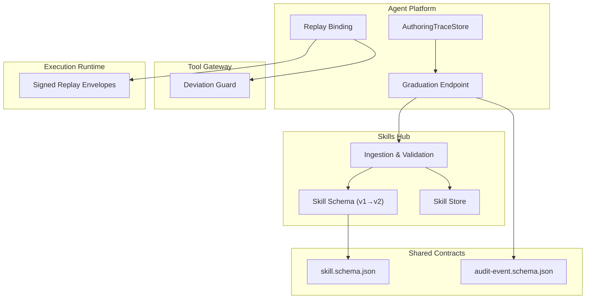
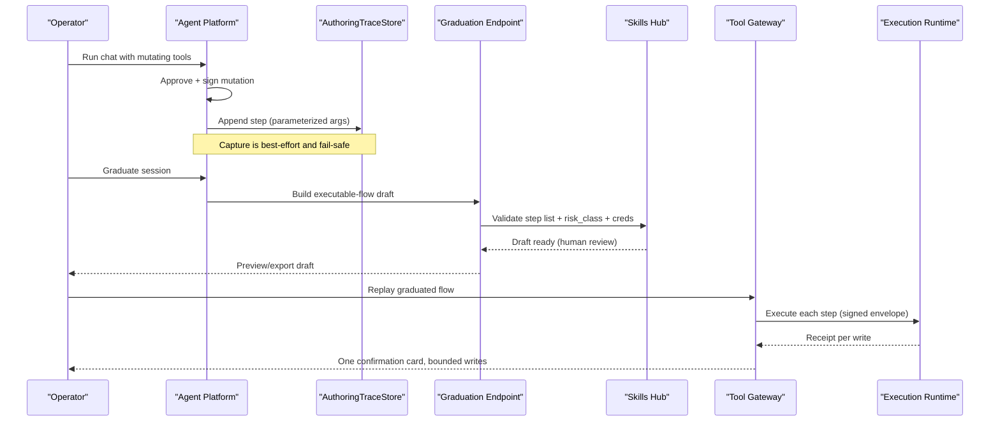
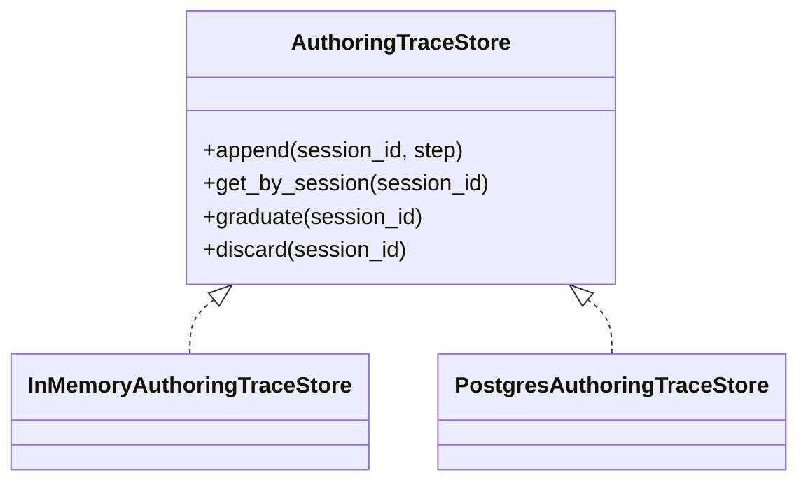
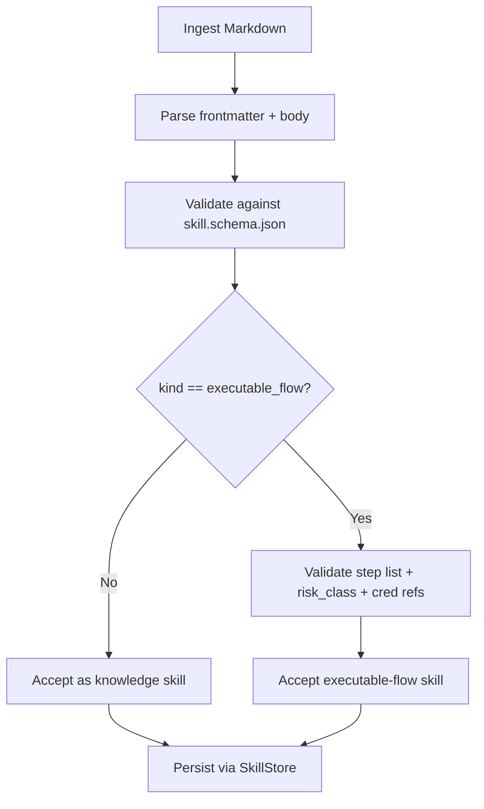
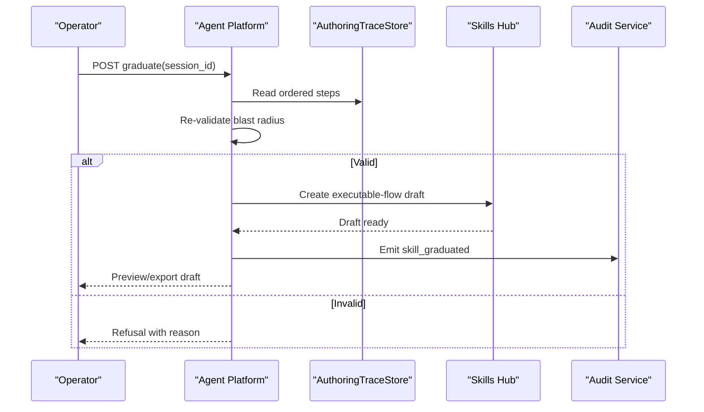
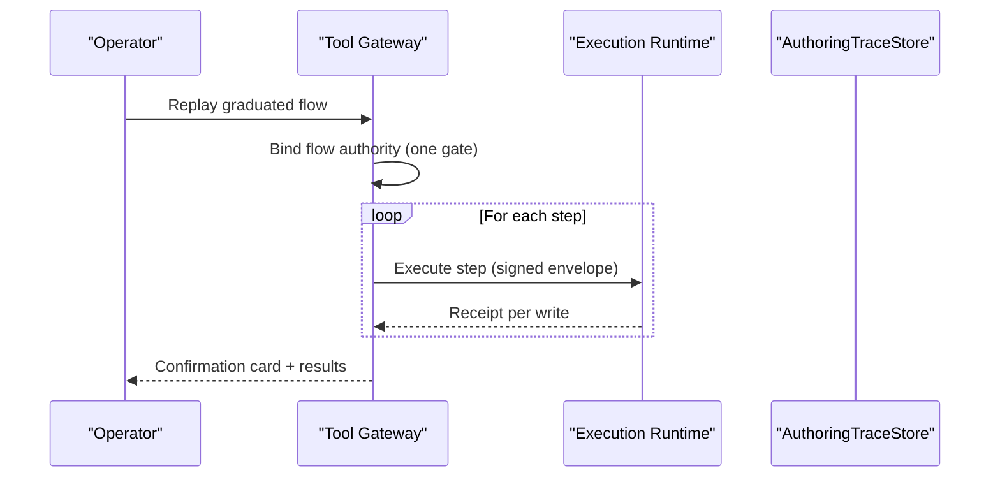
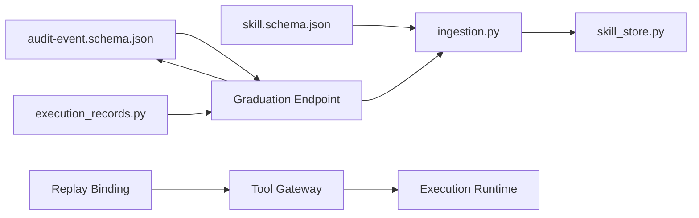

# SPEC-055: Develop-as-You-Go Skill Graduation

<cite>
**Referenced Files in This Document**
- [spec.md](file://docs/specs/SPEC-055-develop-as-you-go-skill-graduation/spec.md)
- [skill.schema.json](file://shared/shared-contracts/schemas/skill.schema.json)
- [audit-event.schema.json](file://shared/shared-contracts/schemas/audit-event.schema.json)
- [ingestion.py](file://products/skills-hub/src/skills_hub/services/ingestion.py)
- [skill_store.py](file://products/skills-hub/src/skills_hub/services/skill_store.py)
- [execution_records.py](file://products/agent-platform/src/agent_service/services/execution_records.py)
- [skill_draft.py](file://products/agent-platform/src/agent_service/services/skill_draft.py)
</cite>

## Table of Contents
1. [Introduction](#introduction)
2. [Project Structure](#project-structure)
3. [Core Components](#core-components)
4. [Architecture Overview](#architecture-overview)
5. [Detailed Component Analysis](#detailed-component-analysis)
6. [Dependency Analysis](#dependency-analysis)
7. [Performance Considerations](#performance-considerations)
8. [Troubleshooting Guide](#troubleshooting-guide)
9. [Conclusion](#conclusion)

## Introduction
This document specifies and analyzes SPEC-055: Develop-as-You-Go Skill Graduation. It explains how a troubleshooting session that performed individually approved, signed mutations can be turned into a replayable executable-flow skill. The spec introduces a durable authoring-trace store, an executable-flow skill class with risk_class decoupled from web_target, deterministic graduation with blast-radius re-validation, and one-gate replay under gateway guards with credential-set references instead of literal secrets.

The goal is to enable operators to “develop as you go” by running actions in chat, approving them, and then graduating the resulting trace into a reusable, human-reviewed skill draft that replays safely under a single HITL gate.

**Section sources**
- [spec.md:24-52](file://docs/specs/SPEC-055-develop-as-you-go-skill-graduation/spec.md#L24-L52)

## Project Structure
SPEC-055 spans multiple services and shared contracts:
- Skills Hub: ingestion validation and schema for executable-flow skills; retention of skill records.
- Agent Platform: authoring-trace capture at the approval seam, graduation endpoint, and replay binding.
- Tool Gateway: replay deviation guard (origin allowlist, risk_class, step budget).
- Execution Runtime: signed replay envelopes per write.
- Shared Contracts: additive skill schema changes and new audit event type.

**Diagram sources**
- [skill_store.py:158-192](file://products/skills-hub/src/skills_hub/services/skill_store.py#L158-L192)
- [ingestion.py:163-214](file://products/skills-hub/src/skills_hub/services/ingestion.py#L163-L214)
- [skill.schema.json:63-79](file://shared/shared-contracts/schemas/skill.schema.json#L63-L79)
- [audit-event.schema.json:27-48](file://shared/shared-contracts/schemas/audit-event.schema.json#L27-L48)

**Section sources**
- [spec.md:246-284](file://docs/specs/SPEC-055-develop-as-you-go-skill-graduation/spec.md#L246-L284)

## Core Components
- AuthoringTraceStore (R-1): A dual-backend store (InMemory + Postgres) keyed by session_id, capturing ordered, secret-safe parameterized steps from approved mutations. Lifecycle: draft → graduated | discarded. Retention independent of execution_records sweep. Per-session step cap prevents unbounded growth.
- Capture at Approval Seam (R-2): Trace append occurs only for mutating calls that are approved and signed (per-action or flow authority). Best-effort and fail-safe; never blocks execution or receipts. Secrets parameterized at capture time using redaction vocabulary and credential-set references.
- Executable-Flow Skill Class (R-3): Additive skill schema extension with kind discriminator and machine-readable replay step list. risk_class accepted without web_target so non-browser mutating skills can declare write intent. Ingestion validates step-list shape, declared risk_class, and credential-set references.
- Graduation (R-4): Deterministic assembly of executable-flow skill draft from the authoring trace. Re-validates blast radius (step count, origin/risk_class allowlists, credential resolution). Produces a human-reviewable draft; never auto-publishes. New policy action and audit event for authorization and auditability.
- One-Gate Replay (R-5): Graduated flows replay under a single confirmation card; each write remains individually signed, persisted, audited, and receipted. Gateway deviation guard enforces origin/risk_class/step budget. Credentials resolved at replay from named credential sets. Non-browser replay binding generalized to skill identity (deferred if too large).

**Section sources**
- [spec.md:83-207](file://docs/specs/SPEC-055-develop-as-you-go-skill-graduation/spec.md#L83-L207)

## Architecture Overview
The graduation pipeline connects agent runtime approvals to a durable trace, then to a validated executable-flow skill, and finally to safe replay under one gate.

**Diagram sources**
- [execution_records.py:1-200](file://products/agent-platform/src/agent_service/services/execution_records.py#L1-L200)
- [skill_draft.py:1-200](file://products/agent-platform/src/agent_service/services/skill_draft.py#L1-L200)
- [ingestion.py:163-214](file://products/skills-hub/src/skills_hub/services/ingestion.py#L163-L214)
- [skill_store.py:158-192](file://products/skills-hub/src/skills_hub/services/skill_store.py#L158-L192)

## Detailed Component Analysis

### AuthoringTraceStore (R-1)
- Protocol and backends: Mirrors existing patterns (execution_records/confirmation_records) with InMemory and Postgres implementations and a build_*_store factory. Both backends must expose identical schema fields to avoid silent drops in production.
- Step record: Ordered position, canonical tool name, secret-safe parameterized arguments (credential values replaced by placeholders/credential-set references), and references to originating execution_id/confirm_id.
- Lifecycle and retention: draft → graduated | discarded; retention independent of 30-day execution sweep. Keyed by session_id with a per-session step cap.

**Diagram sources**
- [skill_store.py:30-67](file://products/skills-hub/src/skills_hub/services/skill_store.py#L30-L67)
- [skill_store.py:158-192](file://products/skills-hub/src/skills_hub/services/skill_store.py#L158-L192)

**Section sources**
- [spec.md:83-107](file://docs/specs/SPEC-055-develop-as-you-go-skill-graduation/spec.md#L83-L107)

### Capture at Approval Seam (R-2)
- Trigger point: Same resume/receipt seam that writes execution_records; only captures mutating calls that were approved and signed (per-action or flow authority).
- Mixed sessions: Both ad-hoc per-action writes and writes inside bound flows contribute to one coherent ordered trace.
- Fail-safe: Trace-store failures degrade gracefully; they do not block execution or receipts.
- Secret safety: Parameterization at capture time using redaction vocabulary and credential-set references; no literal secrets stored.

**Diagram sources**
- [execution_records.py:1-200](file://products/agent-platform/src/agent_service/services/execution_records.py#L1-L200)

**Section sources**
- [spec.md:108-128](file://docs/specs/SPEC-055-develop-as-you-go-skill-graduation/spec.md#L108-L128)

### Executable-Flow Skill Class (R-3)
- Schema change: Additive extension to skill.schema.json introducing kind discriminator and replay step list. Existing knowledge/guidance skills validate unchanged.
- Risk class decoupling: risk_class accepted without web_target so non-browser mutating skills can declare write intent.
- Ingestion validation: Validates step-list shape, ensures declared risk_class matches mutating steps, and verifies credential-set references resolve to named sets.

**Diagram sources**
- [skill.schema.json:63-79](file://shared/shared-contracts/schemas/skill.schema.json#L63-L79)
- [ingestion.py:163-214](file://products/skills-hub/src/skills_hub/services/ingestion.py#L163-L214)
- [skill_store.py:158-192](file://products/skills-hub/src/skills_hub/services/skill_store.py#L158-L192)

**Section sources**
- [spec.md:129-152](file://docs/specs/SPEC-055-develop-as-you-go-skill-graduation/spec.md#L129-L152)

### Graduation (R-4)
- Deterministic assembly: Builds executable-flow skill draft strictly from captured, approved trace; no LLM synthesis of steps.
- Blast-radius re-validation: Step count bounds, target/origin allowlist checks, consistent risk_class: write, credential resolution to named sets. Failure yields deterministic refusal surfaced to operator.
- Human merge: Produces previewable/exportable draft; platform never auto-publishes executable mutating skills.
- Policy and audit: New policy action (e.g., session:skill_graduate) and audit event (e.g., skill_graduated) for authorization and auditing; role-gated to operator/approver.

**Diagram sources**
- [skill_draft.py:1-200](file://products/agent-platform/src/agent_service/services/skill_draft.py#L1-L200)
- [audit-event.schema.json:27-48](file://shared/shared-contracts/schemas/audit-event.schema.json#L27-L48)

**Section sources**
- [spec.md:153-181](file://docs/specs/SPEC-055-develop-as-you-go-skill-graduation/spec.md#L153-L181)

### One-Gate Replay (R-5)
- Single confirmation: Replaying a write-class executable flow binds a flow authority and parks one confirmation card; subsequent writes admitted under that authority.
- Per-write signing: Each replayed write is individually signed, persisted, audited, and receipted, identical to hand-authored flows.
- Gateway deviation guard: Origin allowlist, declared risk_class, and step budget enforced; off-allowlist or past-budget replays fail closed.
- Credential resolution: At replay time, credentials resolved from named credential sets referenced in steps; no literal secrets in skills.
- Non-browser binding: Generalize flow-binding key to skill identity for infra flows; browser-only replay in this spec with infra deferred if needed.

**Diagram sources**
- [execution_records.py:1-200](file://products/agent-platform/src/agent_service/services/execution_records.py#L1-L200)

**Section sources**
- [spec.md:182-207](file://docs/specs/SPEC-055-develop-as-you-go-skill-graduation/spec.md#L182-L207)

## Dependency Analysis
- Skills Hub depends on shared skill schema and its own ingestion/validation logic.
- Agent Platform depends on execution_records for signing/receipts and provides graduation and replay binding.
- Tool Gateway enforces replay deviation guards and coordinates credential resolution.
- Execution Runtime produces signed envelopes per replayed write.
- Shared contracts define additive schema changes and new audit events.

**Diagram sources**
- [skill.schema.json:63-79](file://shared/shared-contracts/schemas/skill.schema.json#L63-L79)
- [audit-event.schema.json:27-48](file://shared/shared-contracts/schemas/audit-event.schema.json#L27-L48)
- [ingestion.py:163-214](file://products/skills-hub/src/skills_hub/services/ingestion.py#L163-L214)
- [skill_store.py:158-192](file://products/skills-hub/src/skills_hub/services/skill_store.py#L158-L192)
- [execution_records.py:1-200](file://products/agent-platform/src/agent_service/services/execution_records.py#L1-L200)

**Section sources**
- [spec.md:246-284](file://docs/specs/SPEC-055-develop-as-you-go-skill-graduation/spec.md#L246-L284)

## Performance Considerations
- Dual-backend stores: Ensure both InMemory and Postgres backends implement identical schemas to avoid silent data loss in production. Prefer verifying against Postgres (dev-k8s backend).
- Bounded traces: Enforce per-session step caps to prevent unbounded growth of authoring traces.
- Best-effort capture: Trace-store failures should not block execution; degrade gracefully to “no graduation candidate.”
- Credential resolution: Resolve credentials at replay time from named sets to keep skills shareable and avoid secret leakage.
- Search and storage: Leverage existing indexing strategies (e.g., GIN indexes) for skill catalog queries when integrating executable-flow metadata.

[No sources needed since this section provides general guidance]

## Troubleshooting Guide
- Graduation refusal: If blast-radius re-validation fails (step budget exceeded, off-allowlist target, inconsistent risk_class, unresolved credentials), the operation deterministically refuses and surfaces the reason to the operator.
- Missing capture: If trace capture fails, the session cannot be graduated but execution continues unaffected; verify capture seam and store health.
- Schema mismatches: Ensure executable-flow fields exist on both InMemory and Postgres backends; otherwise, fields may be silently dropped in production.
- Audit gaps: Confirm new policy action and audit event types are configured and emitted during graduation.

**Section sources**
- [spec.md:153-181](file://docs/specs/SPEC-055-develop-as-you-go-skill-graduation/spec.md#L153-L181)
- [skill_store.py:158-192](file://products/skills-hub/src/skills_hub/services/skill_store.py#L158-L192)
- [audit-event.schema.json:27-48](file://shared/shared-contracts/schemas/audit-event.schema.json#L27-L48)

## Conclusion
SPEC-055 enables a secure, operator-friendly path from live troubleshooting to reusable executable skills. By capturing approved mutations into a durable trace, validating and graduating them into executable-flow skills, and replaying under one gate with strict gateway guards and secret-safe parameters, the platform preserves trust invariants while dramatically improving skill authoring velocity. Delivery follows ADR-0008 with per-requirement tests and clear separation between exploration (per-action approvals) and mature replay (one gate).

[No sources needed since this section summarizes without analyzing specific files]